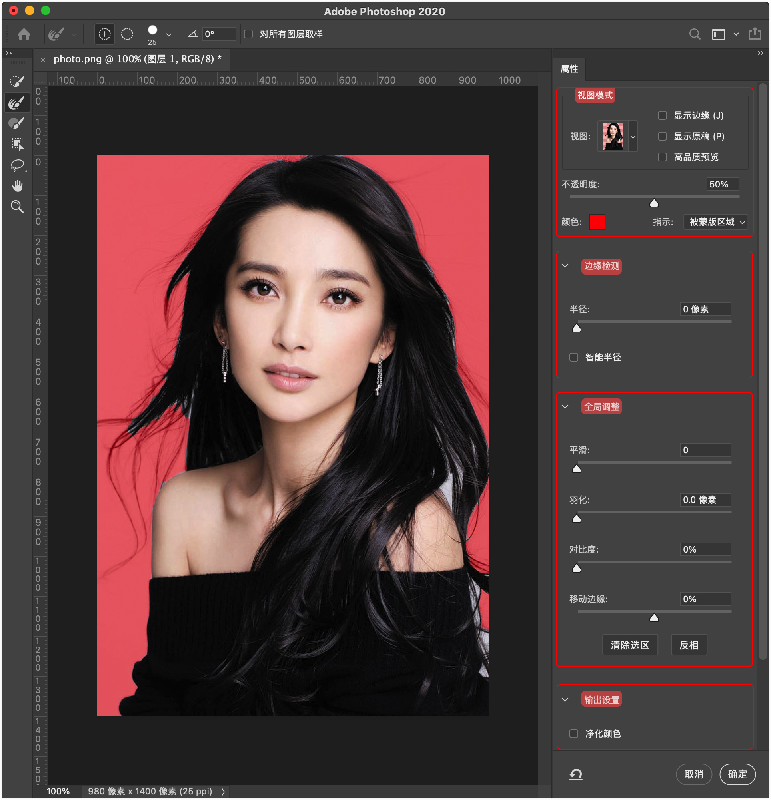
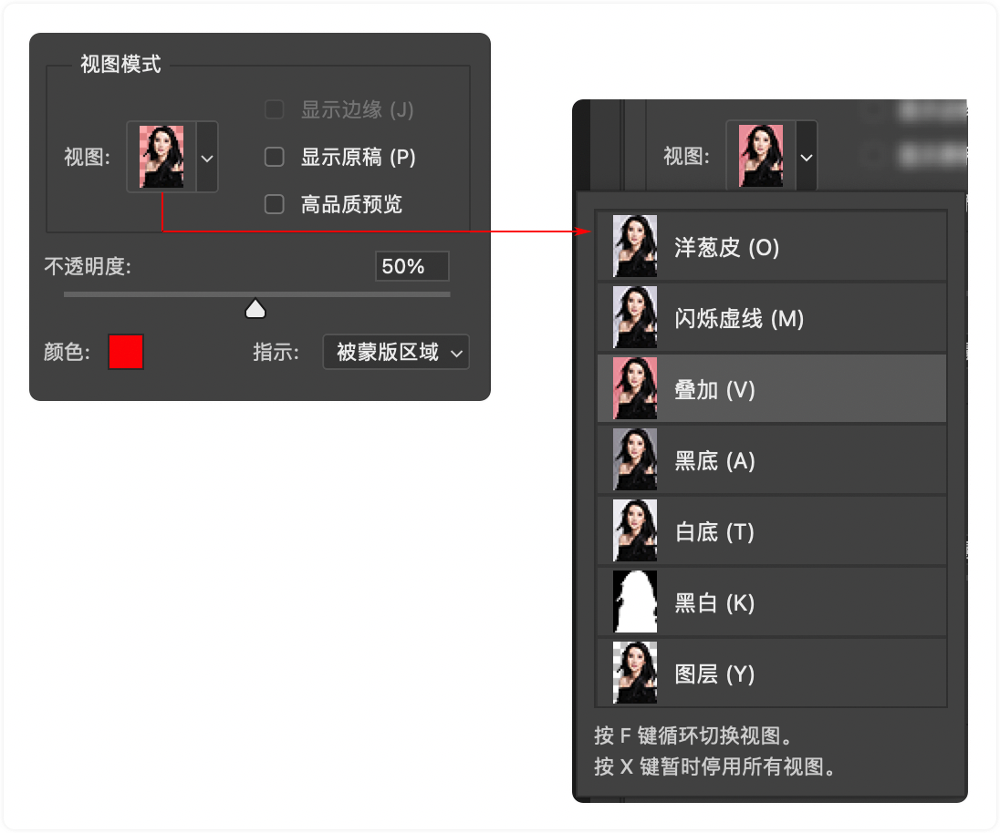
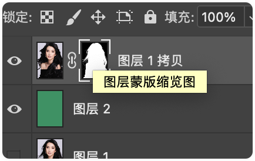
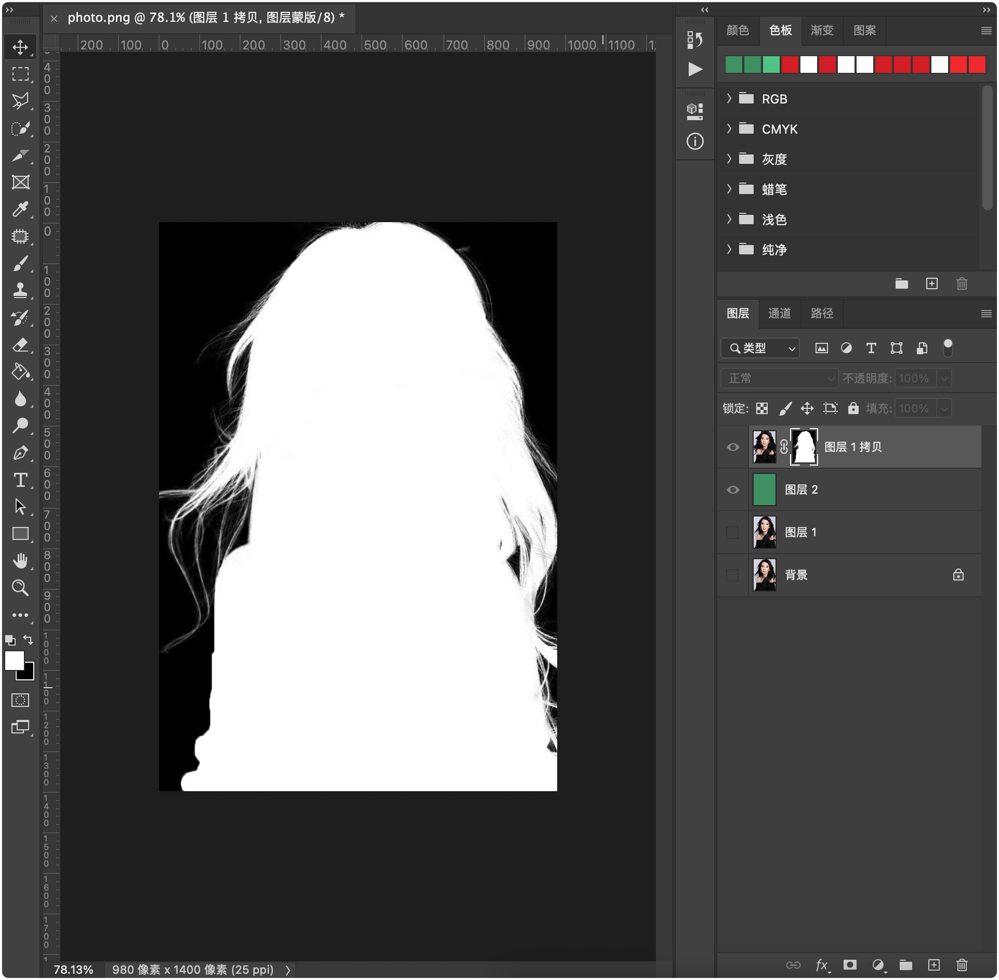

# PS 抠发丝

## ▲ 使用图层蒙版抠发丝

我们先使用 "方法 1：直接创建图层蒙版" 的方法来创建图层蒙版（见：`../蒙版/readme.md` 中的 "方法 1：直接创建图层蒙版"），然后使用 `快速选区` 工具大致来选取人像（此时图示如下：）

然后点击上图中的 `选择并遮住` 按钮，接着会打开 "选择并遮住" 窗口。图示如下：

- 注：也可以从顶部 "菜单栏"  的 `选择` -> `选择并遮住` 来打开 "选择并遮住" 窗口。
- 提示：在 PS 界面最左侧 "工具栏" 中的 `矩形选框工具(M)`、`套索工具(L)`、`对象选择工具/快速选择工具/魔棒工具(W)` 都可以使用 "选择并遮住" 功能。

我们先了解一下这个面板的各个功能： 

视图模式 可以切换不同的模式对图片进行观察 大多数情况下都会使用叠加方式进行观察 这一块稍后详解 这里是不透明度 方便观察抠图选区的区域 也可以点击这里对观察颜色进行修改 看到这个指示 被蒙版区域 此时示指红色的部分最终会被隐藏 就是我们要抠出的部分 而改为选定区域 则表示红色的部分最终会显示出来 也就是我们要抠的人物主体 其实两者的结果都是一样的 都是为了方便观察 这下方都稍后讲解 我们调整好合适的不透明度 用这个面板里的快速选择工具 对我们要保留的部分做一个大概的选择 如果有选错的部分 可以找到上方的拣选图标 进行拣选 我们将大部分内容选中之后 就可以对物体边缘进行处理了 注意 这里有一个专门用于调整边缘的画笔 如果我们现在还是直接用快速选择工具 你会发现细小的头发 根本就不好选择 甚至会选到背景 但是当我们使用调整边缘画笔的时候 就可以对边缘发丝进行选择 我们现在再去擦除发丝边缘的部分 现在发丝边缘就抠了出来 注意 调整边缘画笔尽量要用在要抠除的边缘部分 如果我们涂抹到画面中间 工具也会进行误选 我们快速重复刚才的操作 将所有的边缘发丝都选中 现在我们仔细盯着这些发丝边缘的部分 我勾选上进化颜色 有没有注意到颜色前后的变化 进化颜色在抠除头发的时候 可以有效地帮助我们减少边缘泛白的问题 还可以有效地选择一些细小的发丝 这就是进化边缘的部分作用 做到这里我们就可以对人物头发进行检查了 此时我们将视图改为黑白模式 黑白模式下我们可以观察人物部分是否被选中 如果有 我们就需要用到另外一个画笔工具 在黑白模式下 我们选择画笔工具 加号绘制白色代表选中的区域 减号绘制黑色代表未选中的区域 而这些有点发灰的部分 就是半透明区域 人物脸颊这些地方肯定不能处于半透明的一个状态 所以我们用画笔工具再次涂抹 如果有误选 我们用黑色也就是减去涂抹 我们快速重复刚才的操作 现在整个选择工作就已经做完了 抠图也算是成功了一半 现在我们看看什么是显示边缘 我们勾选上显示边缘 显示边缘需要和边缘检测配合使用 我们将边缘检测的半径拉大 这些空白区域就是边缘 我们一般对半径数值不做修改 保持默认即可 智能半径和检测边缘差不多 智能半径就是软件对选择的边缘进行智能识别 下面是全局调整 我们放大视图看一下 放大或者缩小视图 通过滚轮配合alt键即可 也可以使用缩放工具 再配合抓手工具拖动图片 我们看到边缘部分 平滑是指 如果边缘有参差不齐的地方 可以通过平滑适当的缓解一下 数值越高越柔和 羽化让生硬的边缘更柔和一点 对比度会使柔和的边缘变得生硬清晰 移动边缘就是收缩或者扩张边缘 清除选区就是撤销你辛辛苦苦抠的图 反向就是对选区的反选 现在看到输出部分 里面就不一一讲解了 每种结果都可以试一下 我建议使用新建带有图层模板的图层 这样即使后面有需要调整的部分也是非常方便的 点击确定这张图就刻好了 我一般会再复制一个图层 这样能够加深边缘发丝的颜色 发丝看上去会更加真实一些 回到选择并遮住这种抠图方法 这个方法也不是万能的 偶尔也会出现某些地方没有刻好的头发 这也不是什么大问题 我们在模板上调整一下即可 做个示范 比如这里没有刻好 我用画笔工具可以在模板上进行涂抹 这就是新建带有图层模板的益处 为了验证我们的头发是否有白边 新建一个图层填充一个颜色 这张是勾过进化颜色的图片 这张是没有勾选过的 我拖入一张其他背景图 嗯,这个效果还是不错的 好了 那么本期的视频就是这样了 如果你对本视频感到满意 希望你能够点赞投币收藏 如果本视频能够帮助到你身边的朋友 你也可以分享给他 我们下期见 拜拜

### (1) 视图模式

- 视图：

### (2) 边缘检测

### (3) 全局调整

### (4) 输出设置

鼠标点击 "图层蒙版缩览图" 即可选中图层蒙版 (即下图)

**按住 `Alt` 键** + **鼠标再次点击图层蒙版**，即可在 PS 窗口中打开图层蒙版：

