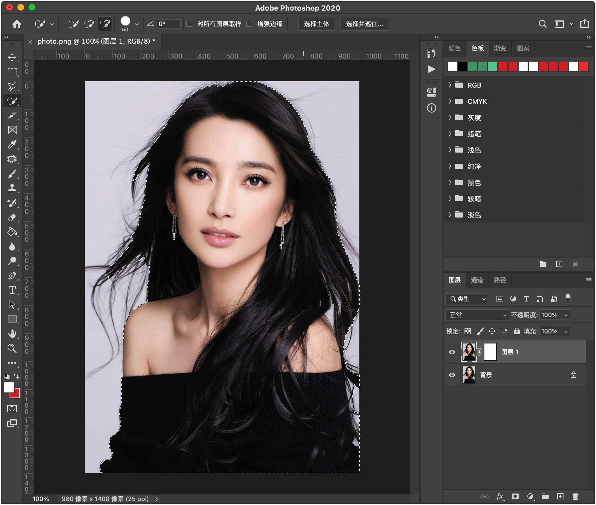
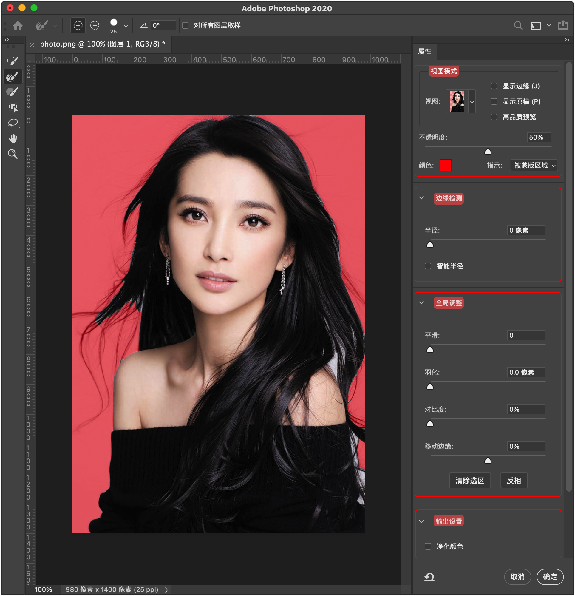
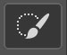
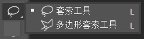
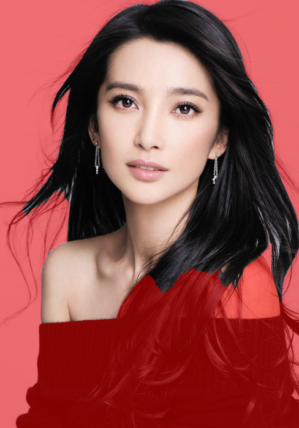
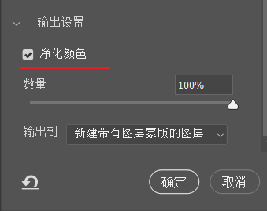
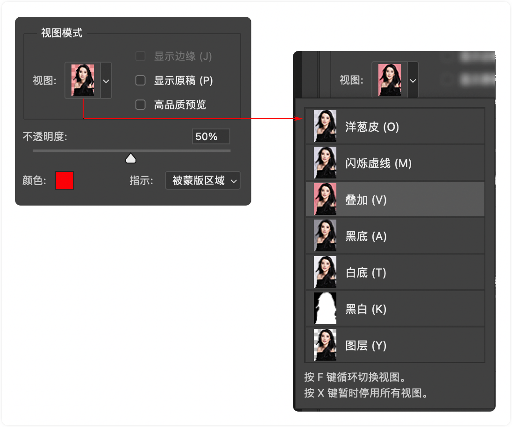
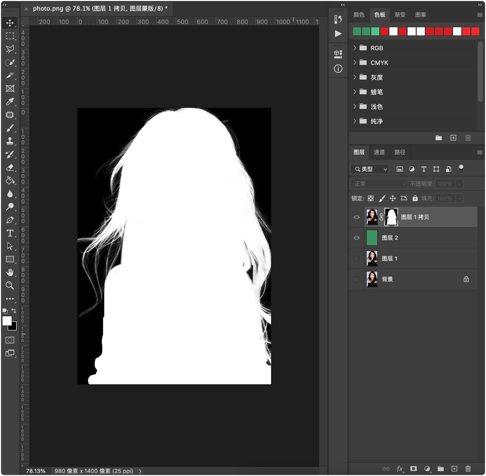

# 使用选择并遮住抠发丝

## ▲ 使用图层蒙版抠发丝

> 笔记来源：[PS抠图，选择并遮住！调整边缘！最常用的方法之一！超详细讲解！](https://www.bilibili.com/video/BV14E411A7KJ/?spm_id_from=333.337.search-card.all.click&vd_source=e92153ec1930505e455be52646a78b7c)

我们先使用 "方法 1：直接创建图层蒙版" 的方法来创建图层蒙版（见：`../蒙版/readme.md` 中的 "方法 1：直接创建图层蒙版"），然后使用 `快速选区` 工具大致来选取人像（此时图示如下：）

然后点击上图中的 `选择并遮住` 按钮，接着会打开 "选择并遮住" 窗口。图示如下：

- 注：也可以从顶部 "菜单栏"  的 `选择` -> `选择并遮住` 来直接打开 "选择并遮住" 窗口。
- 提示：在 PS 界面最左侧 "工具栏" 中的 `矩形选框工具(M)`、`套索工具(L)`、`对象选择工具/快速选择工具/魔棒工具(W)` 都可以使用 "选择并遮住" 功能。

我们先来过一遍上图最左侧的工具栏

### 工具栏图标及功能详解

| 工具图标                                                     | 名称                 | 注释                   |
| ------------------------------------------------------------ | -------------------- | ---------------------- |
|  | 快速选择工具 (W)     |                        |
|  | 调整边缘画笔工具 (R) |                        |
|  | 画笔工具 (B)         |                        |
|  | 对象选择工具 (W)     | 查找并自动选择对象     |
|  | 套索工具 (L)         |                        |
|  | 抓手工具 (H)         | 在图像的不同部门间平移 |
|  | 缩放工具 (Z)         | 在图像上放大和缩小     |

#### (1) 快速选择工具 (W)

对我们要保留的部分做一个大概的选择，比如在使用 "选择并遮住" 之前我把图片选择成下面这种状态（注：红色是在视图模式中选择了 "叠加"，详细讲解见当前文档下部）

注意看身子我并没有选到，现在我点击 "快速选择工具" 把红色的身子选中，Gif 图如下：（注：从 gif 动图可以看出来，如果我们不松开鼠标在衣服上滑动，PS 本身是可以自动识别物体的。）

如果不小心把需要去除的空白也选中了，那我们就可以点击上图顶部的 `从选区中减去` 图标，把需要去除的空白从选中状态去除 (a)；当然更快捷的方式是按下 `Alt` 键 `添加到选区` 的图标就会变成 `从选区中减去`了 (b)。

- (a) 此处的选区的概念见下面文档的 "(1) 视图模式 - 指示") 

- (b) 放大和缩小 `快速选择工具` 图标，是键盘上的 `[` 和 `]` 键)

人/物的大部分主题选中之后，我们接下来就可以对人/物的边缘进行处理了，现在就要用到 "调整边缘画笔" 工具了。

#### 调整边缘画笔工具 (R)

如果我们现在还是直接用快速选择工具，你会发现细小的头发根本就不好选择，甚至会选到背景，但是当我们使用调整边缘画笔的时候，就可以对边缘发丝进行选择，我们现在再去擦除发丝边缘的部分，现在发丝边缘就抠了出来，注意、调整边缘画笔尽量要用在要抠除的边缘部分，如果我们涂抹到画面中间，工具也会进行误选，我们快速重复刚才的操作，将所有的边缘发丝都选中；现在我们仔细盯着这些发丝边缘的部分。我勾选上 `净化颜色`，有没有注意到颜色前后的变化？净化颜色在抠除头发的时候可以有效地帮助我们减少边缘泛白的问题，还可以有效地选择一些细小的发丝，这就是净化边缘的部分作用，

做到这里我们就可以对人物头发进行检查了，此时我们将视图改为 `黑白模式`，黑白模式下我们可以观察人物部分是否被选中，如果有我们就需要用到另外一个 `画笔工具`，在黑白模式下，我们选择画笔工具：

- 加号（`添加到选取`）：绘制白色代表选中的区域
- 减号（`从选取中减去`）：绘制黑色代表未选中的区域

而这些有点发灰的部分，就是半透明区域，人物脸颊这些地方肯定不能处于半透明的一个状态，所以我们用画笔工具再次涂抹，如果有误选，我们用黑色也就是减去涂抹 我们快速重复刚才的操作，现在整个选择工作就已经做完了，抠图也算是成功了一半。（注：这里的说明请见视频）

### (1) 视图模式

**视图**：切换不同的模式对图片进行观察，大多数情况下都会使用叠加方式进行观察

**不透明度**： 方便观察抠图选区的区域

**颜色**：可以对上面 "试图" 中 "叠加" 模式的颜色进行修改，其他试图模式没有这个选项

**指示**：

- 被蒙版区域：此时是指红色的部分最终会被隐藏，就是我们要扣除(去除)的部分
- 选定区域：表示红色的部分最终会显示出来，也就是我们要扣的人物主体

**显示边缘**：我们勾选上显示边缘，`显示边缘` 需要和 `边缘检测` 配合使用

### (2) 边缘检测

我们将边缘检测的半径拉大（比如：30 - 40），这些空白区域就是边缘，我们一般对半径数值不做修改，保持默认即可，`智能半径`和 检测边缘 差不多，智能半径就是软件对选择的边缘进行智能识别，

### (3) 全局调整

我们放大视图看一下，放大或者缩小视图，通过 鼠标滚轮 + `Alt` 键 即可，也可以使用 `缩放工具` 再配合 `抓手工具` 拖动图片，我们看到边缘部分，

**平滑**：平滑是指如果边缘有参差不齐的地方，可以通过平滑适当的缓解一下，数值越高越柔和；

**羽化**：让生硬的边缘更柔和一点

**对比度**：对比度会使柔和的边缘变得生硬清晰 

**移动边缘**：移动边缘就是收缩或者扩张边缘 

**清除选区**：清除选区就是撤销你辛辛苦苦抠的图 

**反选**：反向就是对选区的反选

### (4) 输出设置

输出部分里面就不一一讲解了，每种结果都可以试一下，我建议使用 "新建带有图层模板的图层"，这样即使后面有需要调整的部分也是非常方便的，点击确定这张图就修好了。

 我一般会再复制一个图层，这样能够加深边缘发丝的颜色，发丝看上去会更加真实一些，回到选择并遮住这种抠图方法，这个方法也不是万能的，偶尔也会出现某些地方没有扣好的头发，这也不是什么大问题，我们在模板上调整一下即可。做个示范：比如这里没有刻好，我用画笔工具可以在模板上进行涂抹（注：画笔工具 -- 白显黑不显），这就是新建带有图层模板的益处 为了验证我们的头发是否有白边 新建一个图层填充一个颜色 这张是勾过净化颜色的图片 这张是没有勾选过的 我拖入一张其他背景图 嗯,这个效果还是不错的 好了 那么本期的视频就是这样了 。

-----

鼠标点击 "图层蒙版缩览图" 即可选中图层蒙版 (即下图)

**按住 `Alt` 键** + **鼠标再次点击图层蒙版**，即可在 PS 窗口中打开图层蒙版：

