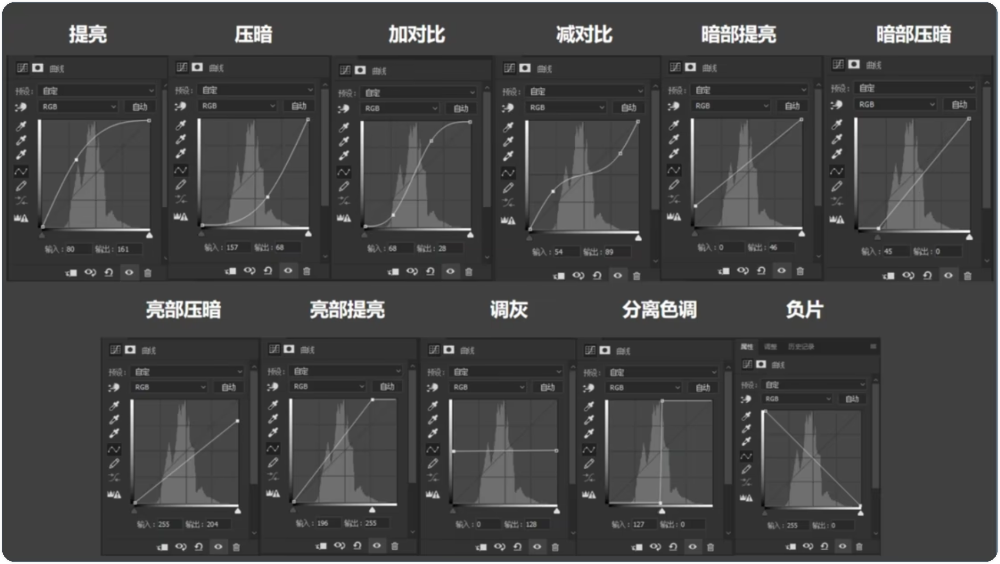
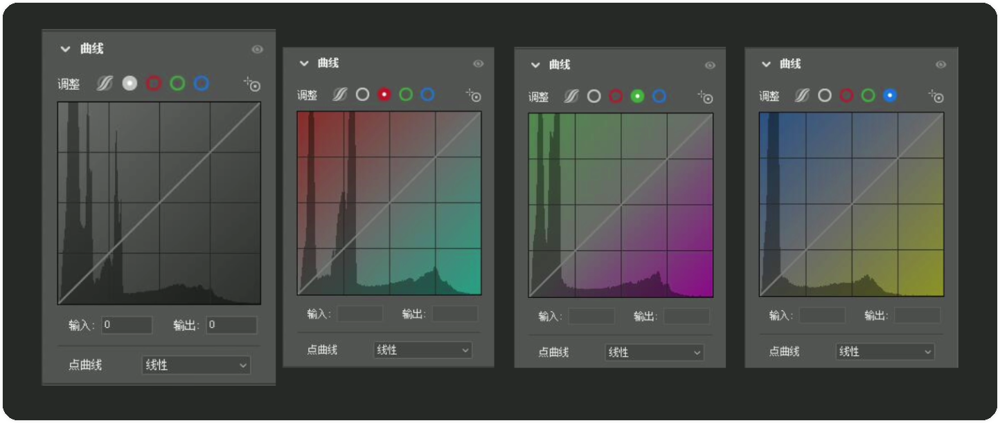
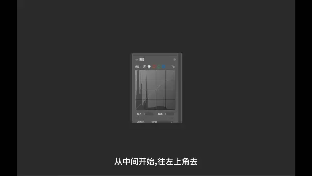

# 曲线

## 常见曲线调整方式

> 图片来源：https://www.bilibili.com/video/BV13j411q731/?spm_id_from=333.337.search-card.all.click&vd_source=e92153ec1930505e455be52646a78b7c  （建议观看此视频）

|   方式   | 注释                                                         |
| :------: | ------------------------------------------------------------ |
|   提亮   | 把照片整体提亮，不过一般还是中间调提亮比值更大，因为越往两头的黑白处，曲线变化越小。 |
|   压暗   |                                                              |
|  加对比  | 亮部曲线提亮，暗部曲线压低，S形状越大对比越大                |
|  减对比  |                                                              |
| 暗部提亮 |                                                              |
| 暗部压暗 |                                                              |
| 亮部压暗 |                                                              |
| 亮部提亮 |                                                              |
|   调灰   |                                                              |
| 分离色调 |                                                              |
|   负片   |                                                              |
|          |                                                              |

## 十分钟吃透曲线原理
>  https://www.bilibili.com/video/BV1Tf4y1M7HX/?spm_id_from=333.788.recommend_more_video.0&vd_source=e92153ec1930505e455be52646a78b7c

### 四个曲线

RGB(明度曲线)：实际上是个复合曲线（通道），主要控制画面的亮度和对比度。

色彩曲线：红、绿、蓝曲线，主要调整画面中的色彩。

### 怎样使用明度曲线

光影变化

正方形中从中间开始，往左上角变亮，反之变暗

线上光影的变化是右上角变亮，反之变暗

中间的位置范围为中间调

正方形代表这张照片之后“可”调整的方向

线代表这张照片本身  照片中任何一个光影的范围点都可以在线上找到

**中间调调亮**

按住线的中间向左上角拖拽

**S形曲线（加对比）**

