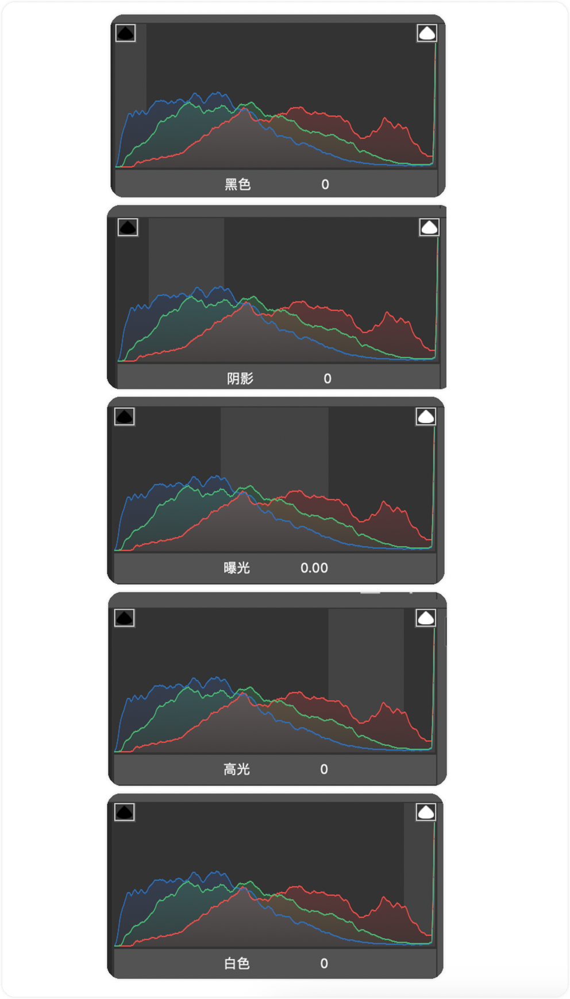

# 直方图

上图的 "曝光" 是不是可以理解为 "中间调"？

这是一张普通照片。 将照片去色并进行放大，模糊后得到了拥有明暗层次的球体。将球体展开，得到黑与白的色阶。当画面只有黑和白两种关系的时候，照片是这样的。随着明暗层次的增加，便有了最原本的硬调关系。将这个由黑至白的明暗层次分为了10个等级。当图像减少黑色与白色，我们便得到了中灰。减少黑色与中灰，我们便得到了暗部。减少白色与中灰，我们便得到了亮部。调整图像时，明暗层次产生的波峰变化便形成了直方图的显示原理。通过观察直方图上明暗的波峰变化进行基础调色，比如调整曝光。左右滑动是改变整体图像的明暗，调整阴影是改变暗部区域，调整高光是改变亮部区域。调整对比，以中灰为支点减少整体明暗的对比和加深整体明暗的对比，调整黑色改变暗部区域，调整白色改变亮部区域。通过以上的基础调色，我们将直方图由左至右的波峰变化归纳出低中高的影调风格。波峰集中倾斜直方图右侧，以中灰到白色为主，影调跨越范围大，会呈现出画面明亮纯真的氛围感，适合人像属于高调。波峰集中在直方图中间，以中灰为主到黑白左右的平缓过渡，会呈现出画面相对柔和细腻的层次感，适合人文或者风景属于中调。波峰集中在直方图左侧，以中灰到黑色为主，暗部范围大，会呈现出沉重神秘的感觉，适合街拍或者艺术属于低调。通过低中高，还能细分出更多音调的风格。而这些仅仅是观察一个小小的直方图变化来区分。有人说我调色从来不看直方图，但在我看来也许就是你与专业之间的差距。
