# PhotoShop Learning

[Photoshop 的精髓是什么？为什么？](https://www.zhihu.com/question/20329343)


| 单词       | 美式发音          | 词类 + 汉语释义                                |
| ---------- | ----------------- | ---------------------------------------------- |
| vibrance   | `/ˈvaɪbrəns/`     | n. 振动；自然饱和度                            |
| saturation | `/ˌsætʃəˈreɪʃən/` | n. 饱和；饱和度                                |
| cyan       | `/saɪən/`         | n. 青色；青绿色<br />adj. 青色的               |
| magenta    | `/məˈdʒentə/`     | n. 品红色，洋红色<br />adj. 品红色的，洋红色的 |
|            |                   |                                                |


## ▲ RGB 和 CMY

> 第一张图来源：https://www.youtube.com/watch?v=EIVhk1RvbSE （这个视频还没看完）

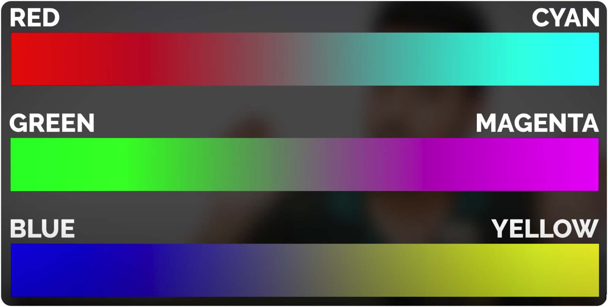

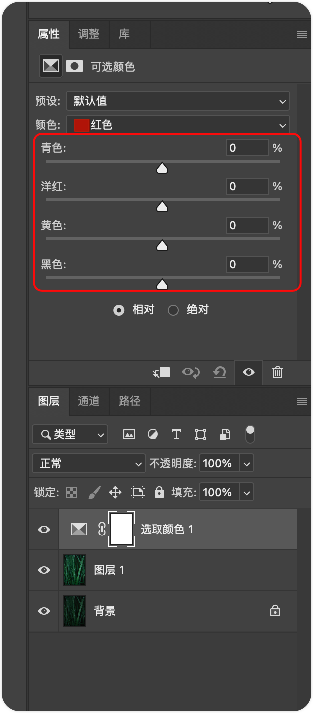

下面一张图来自：《美国纽约摄影学院-摄影教材》P173

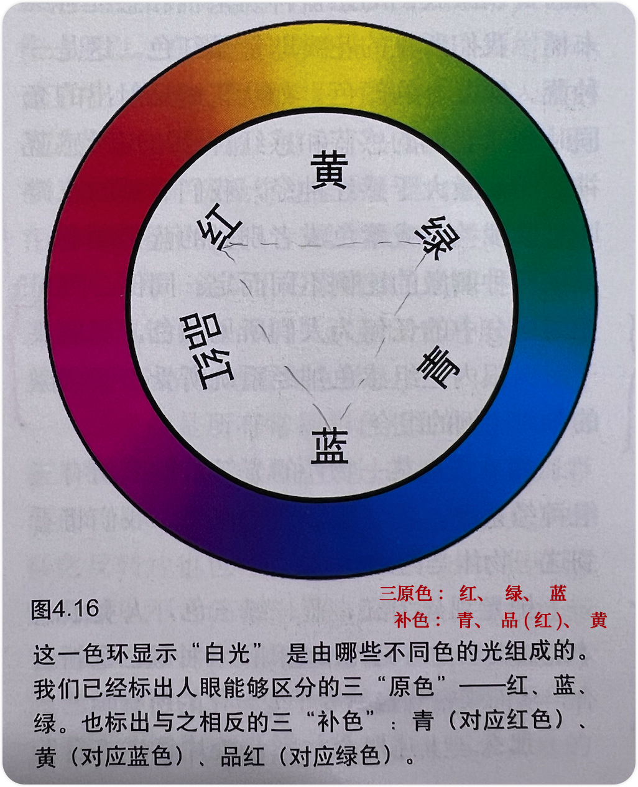


## ▲ 饱和度(Saturation) 和 自然饱和度(Vibrance)

> 下面笔记来源：https://www.bilibili.com/video/BV1sr4y1S7ZZ/?spm_id_from=333.337.search-card.all.click&vd_source=e92153ec1930505e455be52646a78b7c

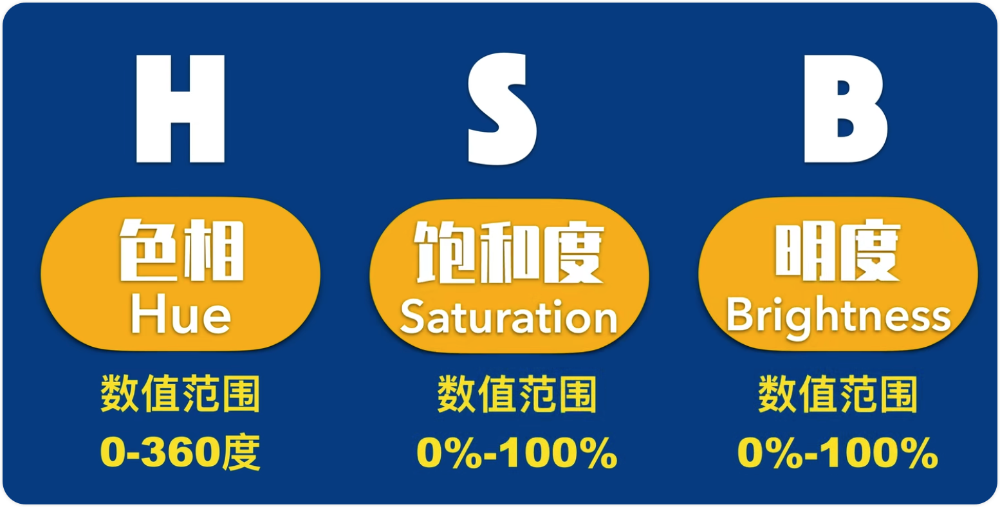

饱和度：其实就是颜色的纯度，饱和度越高颜色越纯，饱和度越低颜色越偏灰

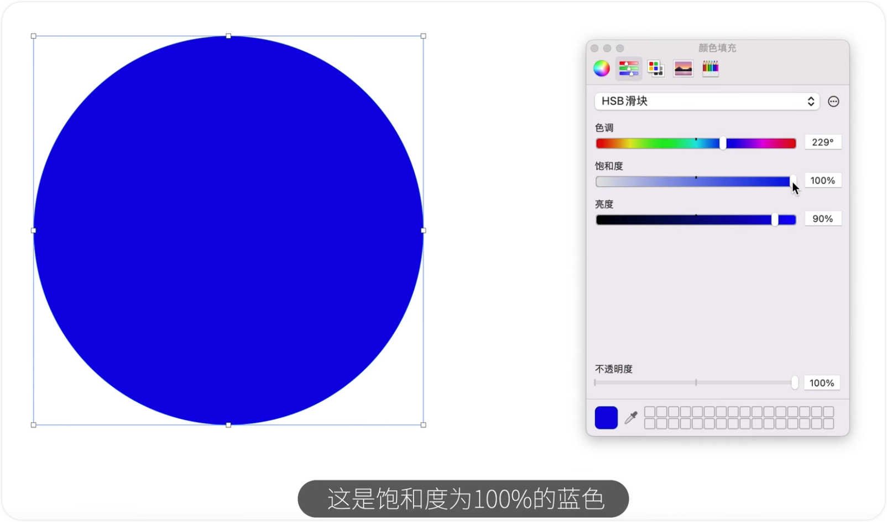

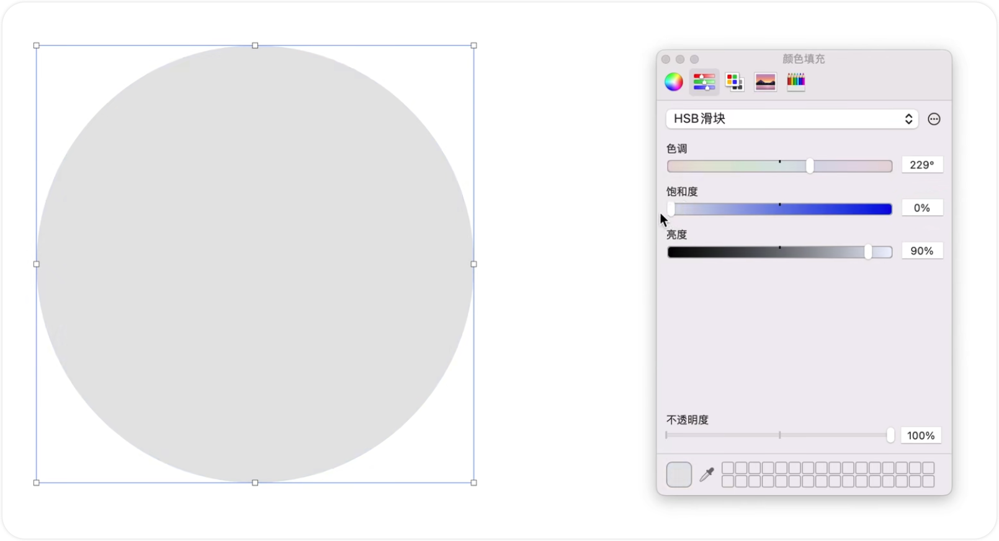

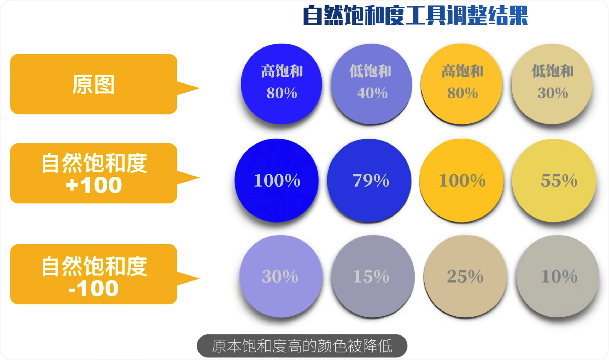

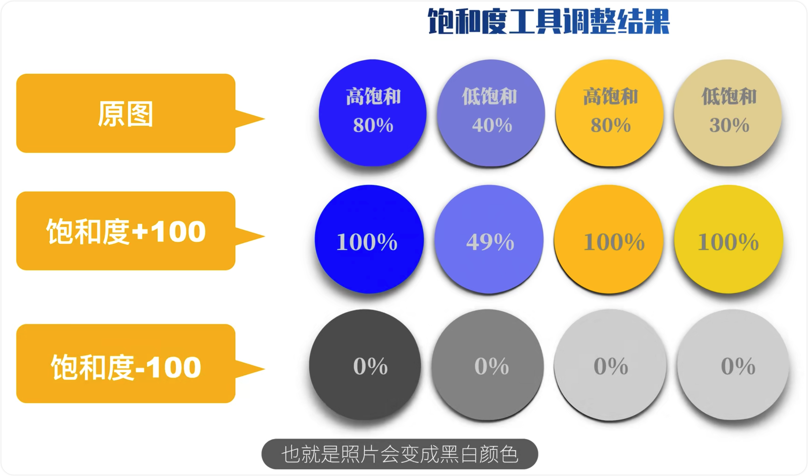

> 知识点总结
> SUMMARY OF KNOWLEDGE POINTS
>
> - 调整自然饱和度会让照片整体的饱和度超于一致
> - 调整饱和度会整体的提升或降低照片中的饱和度，且强度大于自然饱和度
> - 对于不同的色相.自然饱和度跟饱和度调整參数时影响的幅度是不一样的。
> - 自然饱和度对接近肤色的黄色,橙色影响较小，
> - 饱和度对于蓝色饱和度的影响程度不如自然饱和度（此条仅限于LR软件）
> - 调整饱和度参数时也会影响照片中颜色的亮度
> - 不同软件的自然饱和度 饱和度原理大致相同,但调整结果略有差异

> 下面的笔记来自评论区：
>
> 一句话概括，饱和度调节是线性的，自然饱和度调节是非线性的，斜率是下降的。


## ▲ Photoshop 官网教程

> https://helpx.adobe.com/cn/photoshop/using/layer-basics.html

官网教程需要过一遍。


## ▲ PS 2023 新增功能：

### 选取改善项目

使用全新增強的選取工具功能，更快速、更輕鬆地創造保留邊緣細節的高品質挖剪圖案。

### 单键删除和填色

只需按一下，即可從您的場景中完全移除物件，並使用內容感知填滿來填滿該區域。

### 即时高斯模糊（Beta）

即時預覽和調整高斯模糊，輕鬆取得精確的效果。

### 即时渐层（Beta）

使用更新的漸層工具輕鬆繪製、預覽和修改精美的漸層。查看 Beta Photoshop 應用程式，預覽漸層改善項目。

### 新神经滤镜

使用全新的神經濾鏡融入您的構想，即可還原塵封已久的受損相片，並打造全然獨特的設計元素。


## ▲ PS 中新建文件窗口信息介绍

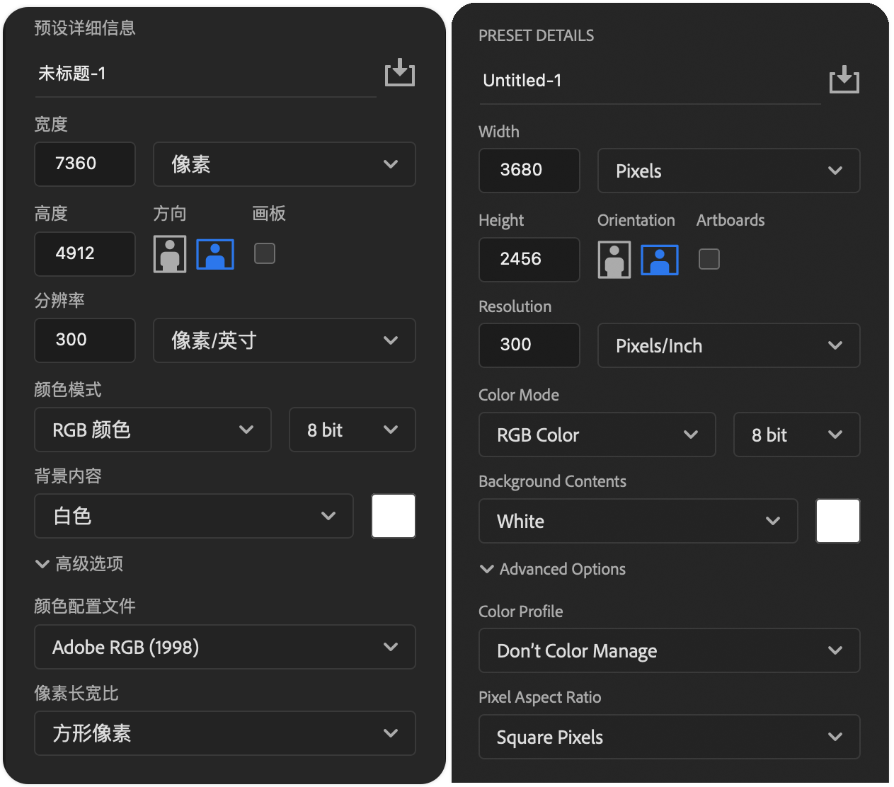

### 颜色模式 (Color Mode)

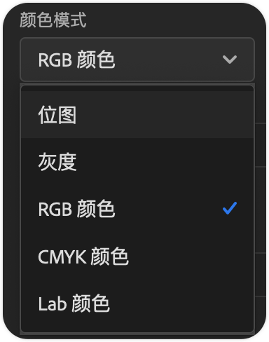

- **位图**：位图是用黑色和白色来表现图像的，是不包含灰度和其他颜色的黑白图像。占用内存小，常连接雕刻机上用。

- **灰度**：灰度值可以用黑色程度的百分比来衡量（0% 等于白色，100% 等于黑色）。在 8 位图像中，最多有 256 级灰度。灰度图像中的每个像素都有一个 0（黑色）到 255（白色）之间的亮度值。在 16 和 32 位图像中，图像的级数比 8 位图像要大得多。

- **RGB 颜色**：也是我们常用的颜色模式。RGB 颜色是将红（Red）、绿（Green）、蓝（Blue）3 种基本颜色进行颜色加法（加色法），配置出绝大部分肉眼能看到的颜色。（一般用于图像处理）

- **CMYK 颜色**：这是一种印刷模式，4 个字母分别是指青色（Cyan）、洋红（Magenta）、黄色（Yellow）和黑色（Black），这 4 种颜色通过减色法形成 CMYK 颜色模式。

    | 单词  | 美式音标 | 词类 + 汉语释义 |
    | ---- | ---- | ---- |
    | cyan | `/ˈsaɪˌæn/` | n. 青色，青绿色<br />adj. 青色的 |
    | magenta | `/məˈdʒentə/` | n. 品红，洋红<br/>adj. 品红色的，洋红色的 |

- **Lab 颜色**：这个模式是以一个亮度分量 L 以及两个颜色分量 a 与 b 来表示颜色的。通常情况下，Lab 颜色很少使用。该模式是 Photoshop 的内部颜色模式，它是图像由 RGB 模式转换为 CMYK 颜色的中间模式。

### 颜色模式 - 颜色深度（Color Depth）

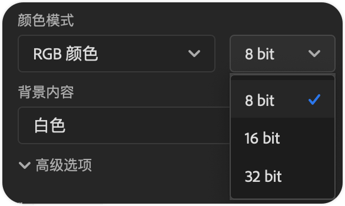


8bit/16bit/32bit 和 16bpc 这些有什么区别?

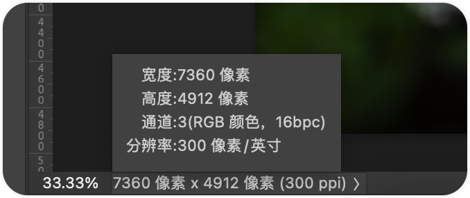


## ▲ 在 Camera Raw 中你用蒙版进行局部调整

> 官网教程：https://helpx.adobe.com/cn/camera-raw/using/masking.html


## ▲ PS 钢笔工具创建选区后添加羽化半径

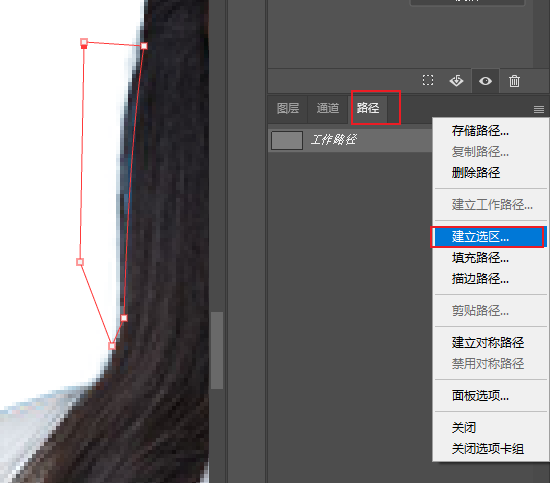

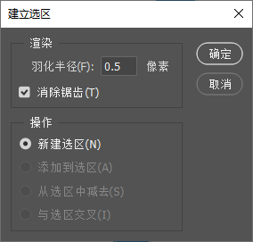

羽化半径：像素根据需要设置。


## ▲  PS 路径选择工具

Added: 2023.06.30

Q：在做集团各部门组织结构图的时候，需要把部门人员头像放入到画好的圆形中，但是把图片拉入到圆形后，我选中圆形后然后 `Ctrl + T` 选中，再 `Ctrl + Enter` 进行选区，正常这样应该就会出现 **选区虚线**（简称：蚂蚁线。-- 指的就是选区边缘），然后再用鼠标选中图像所在的图层，按 `Ctrl + J` 复制，但是不知道为什么就是一直不出现选区虚线。那么怎么解决了这个问题呢？

A：首先选中路径选择工具，如下图：（快捷键：A）

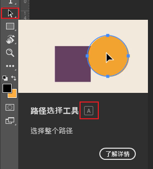

  然后我们再次执行上面的操作，就会出现选区虚线了。


## ▲ PS 常用快捷键

显示标尺：`command + R`


### (1) 图层

| 功能                  | Mac 快捷键（win 系统把 Command 换成 Control）                | 常用程度 |
| --------------------- | ------------------------------------------------------------ | :------: |
| 填充图层              | Alt + Backspace (前景)     Cmd + Backspace (背景)            |          |
| 盖印图层 (平面化图层) | Cmd + Alt + Shift + E                                        |    ☆     |
| 合并可见图层          | Cmd + Shift + E                                              |          |
| 复制图层              | Cmd + J                                                      |  ☆☆☆☆☆   |
| 剪切图层              | Cmd + Shift + J                                              |          |
| 上移图层至顶端        | Cmd + Shift + ]                                              |          |
| 下移至图层底端        | Cmd + Shift + [                                              |          |
| 上移图层              | Cmd + ]                                                      |          |
| 下移图层              | Cmd + [                                                      |          |
| 复制多个图层          | Shift + Cmd + C                                              |          |
| 选中画面的高光区域    | Cmd + Alt + 2                                                |          |
| 选择画面暗部          | Cmd + Shift + i <br />  (注: 需先使用上一行快捷键选中画面高光区域后，才可以使用此快捷键反选画面暗部。）<br />（注2：如果快捷键不起作用，也可以从顶部选项卡的 "**选择 --> 反选**" 来选择暗部。） |          |

### (2) 选择

| 功能            | Mac 快捷键              | 常用程度 |
| ------------- | -------------------- |:----:|
| 重新选择          | Cmd + Shift + D      |      |
| 选择反向          | Cmd + Shift + I      |      |
| 选择所有图层        | Cmd + Opt + A        |      |
| 从选区中取消选择一部分   | Opt + 拖移             |      |
| 取消选择选区中未选中的区域 | Shift + Opt + 拖移     |      |
| 取消选区          | Command + D          | ☆☆☆☆ |
| 寻找变换点         | Cmd + T, Cmd + 0     |      |
| 选择色彩通道        | Cmd + 3(红),4(绿),5(蓝) |      |

### (3) 画笔/填充

| 功能                 | Mac 快捷键              | 常用程度 |
| ------------------ | -------------------- |:----:|
| 重新选择               | Cmd + Shift + D      |      |
| 选择反向               | Cmd + Shift + I      |      |
| 选择所有图层             | Cmd + Opt + A        |      |
| 从选区中取消选择一部分        | Opt + 拖移             |      |
| 取消选择选区中     未选中的区域 | Shift + Opt + 拖移     |      |
| 取消选区               | Command + D          | ☆☆☆☆ |
| 寻找变换点              | Cmd + T, Cmd + 0     |      |
| 选择色彩通道             | Cmd + 3(红),4(绿),5(蓝) |      |

### (4) 图像

| 功能     | Mac 快捷键                   | 常用程度  |
| ------ | ------------------------- |:-----:|
| 色阶     | Command + L               |       |
| 自由变换   | Cmd + T                   | ☆☆☆☆☆ |
| 曲线     | Cmd + M                   |       |
| 色彩平衡   | Cmd + B                   |       |
| 色相/饱和度 | Cmd + U                   |       |
| 去色     | Cmd + Shift + U           |       |
| 内容识别比例 | Cmd + Shift + Opt + C     |       |
| 创建剪贴蒙版 | Cmd + Opt + G             |       |
| 混合模式   | Shift + + (加号) or –  (减号) |       |
| 黑白调整   | Shift + Cmd + Alt + B     |       |

### (5) 视图

| 功能     | Mac 快捷键                   | 常用程度 |
| ------ | ------------------------- |:----:|
| 色阶     | Command + L               |      |
| 自由变换   | Cmd + T                   | ☆☆☆  |
| 曲线     | Cmd + M                   |      |
| 色彩平衡   | Cmd + B                   |      |
| 色相/饱和度 | Cmd + U                   |      |
| 去色     | Cmd + Shift + U           |      |
| 内容识别比例 | Cmd + Shift + Opt + C     |      |
| 创建剪贴蒙版 | Cmd + Opt + G             |      |
| 混合模式   | Shift + + (加号) or –  (减号) |      |
| 黑白调整   | Shift + Cmd + Alt + B     |      |

### (6) 文本

略

## ▲ 照片大小和尺寸

### 尼康 D810 默认的 4:3 格式对应的像素大小

默认为: 7360 * 4912px, 缩小一半为: 3680 * 2456，分辨率：300ppi

### 创建 4:3 和 16:9 照片, 常用的像素比例.

- **16:9** 
  + 1080P: `1920 : 1080`
  + 2K: `2048 : 1152`
  + `2560 : 1440`
  + `3200 : 1800`
  + `5120 : 2880`
- **4:3**
  + `2880 : 2160`
  + `3200 : 2400`
  + `6400 : 4800`
- 佳能 1dx 相机尺寸 5472 : 3648 (缩小一半为 2736 : 1824)

### 7寸竖的照片尺寸是 12.7 x 17.8cm, 360 x 505px.

## ▲ RGB 与 YUV

计算机彩色显示器显示色彩的原理与彩色电视机一样，都是采用 $R$( Red)、$G$(Green )、$B$(Blue) 相加混色的原理:
通过发射出三种不同强度的电子束，使屏幕内侧覆盖的红、绿、蓝磷光材料发光而产生色彩。这种色彩的表示方法称为
RGB 色彩空间表示（它也是多媒体计算机技术中用得最多的一种色彩空间表示方法）。

根据三基色原理，任意一种色光 F 都可以用不同分量的 $R、G、B$ 三色相加混合而成。

$F=r[R] + g[G] + b[B]$ 
其中，$r、g、b$ 分别为三基色參与混合的系数。

当三基色分量都为 0（最弱）时混合为黑色光：而当三基色分量都为k（最强）时混合为白色光。调整 $r、g、b$ 三个系数的值，可以混合出介于黑色光和白色光之间的各种各样的色光。

那么 **YUV** 又从何而来呢？ 

在现代彩色电视系统中，通常采用三管彩色摄像机或彩色 CCD 摄像机进行摄像，然后把摄得的彩色图像信号经分色、分别放大校正后得到 $RGB$，再经过矩阵变换电路得到亮度信号 $Y$ 和两个色差信号$R - Y$ (即$U$)、$B - Y$(即$V$)，最后发送端将亮度和色差三个信号分别进行编码，用同一信道发送出去。这种色彩的表示方法就是所谓的 $YUV$ 色彩空间表示。

采用 $YUV$ 色彩空间的重要性是它的亮度信号 $Y$ 和色度信号 $U$、$V$ 是分离的。如果只有 $Y$ 信号分量而没有 $U、V$ 分量，那么这样表示的图像就是黑白灰度图像。彩色电视采用 $YUV$ 空间正是为了用亮度信号 $Y$ 解决彩色电视机与黑白电视机的兼容问题，使黑白电视机也能接收彩色电视信号。

$YUV$ 与 $RGB$ 相互转换的公式如下（$RGB$ 取值范围均为 0-255）

$Y = 0.299R + 0.587G + 0.114B$    $R = Y + 1.14V$

$U = -0.147R - 0.289G + 0.436B$   $G = Y - 0.39U - 0.58V$

$V = 0.615R - 0.515G - 0.100B$    $B = Y + 2.03U$

## ▲ 如何在 PS 中画带箭头的直线

工具模式选择：**像素**

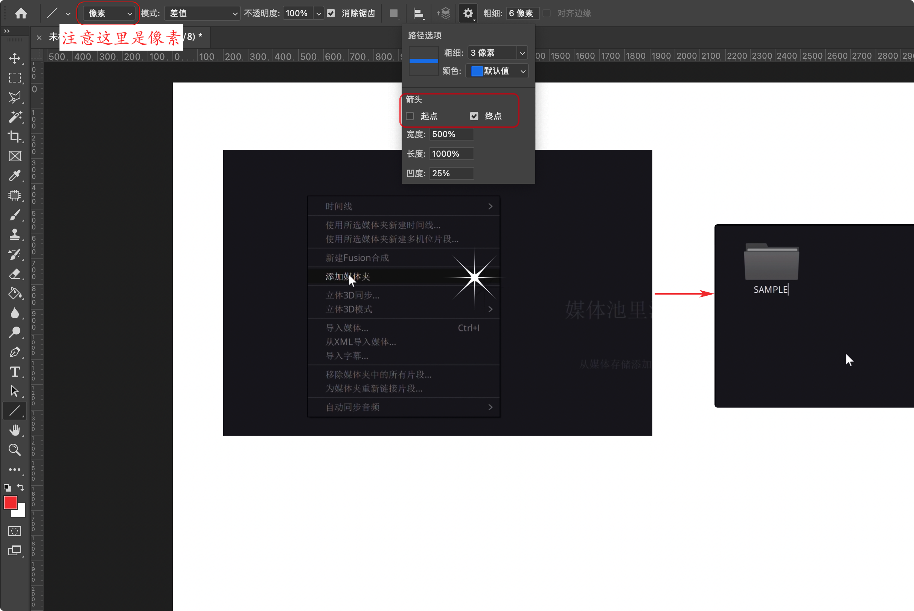

## ▲ 如何在 PS 中画透明矩形

选中圆角矩形后，设置如下图：

- 选择工具模式：**形状**
- 填充：无
- 描边：即前景色
- 描边的宽度：3px, 若修改数值后直接按 enter 键就会及时变更。

填充完毕之后，按下 `Command + Enter` 退出自由变换状态，然后按下 `Esc` 或 `Command + D` 键去除虚边线。 

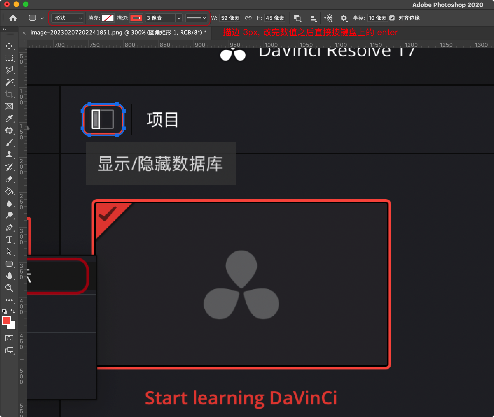

2023.06.02 Added:

windows 上的 PS 没有圆角矩形，这里添加一下如何在画完直角矩形后，再自定义圆角的：

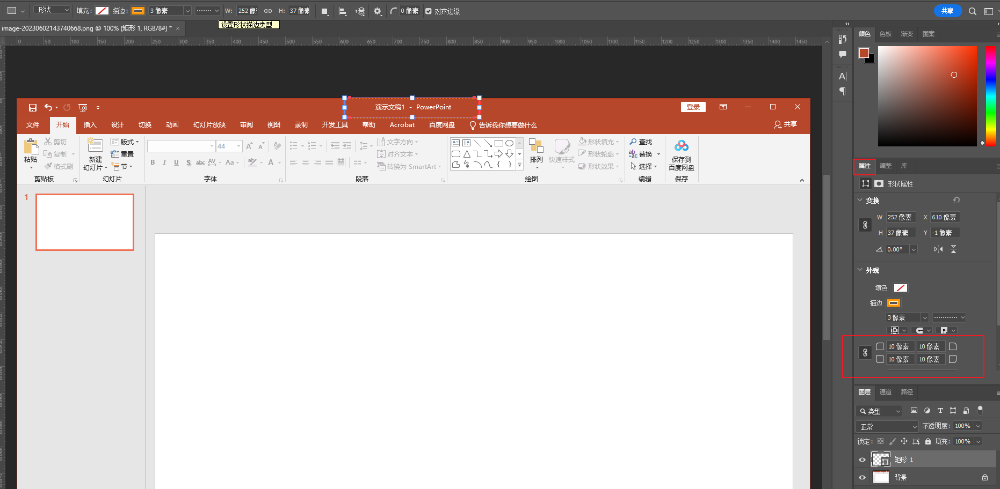


## ▲ 推荐几个配色网站

- [Color Hex - ColorHexa.com](http://www.colorhexa.com/)
- [colourcode - find your colour scheme](http://www.colourco.de/)
- [Colours](http://webcolourdata.com/)
- [Color Safe - accessible web color combinations](http://colorsafe.co/)
- [NIPPON COLORS - 日本の伝統色](http://nipponcolors.com/#jinzamomi)
- [配色网-致力色彩搭配方案的交流与学习](http://www.peise.net/)
- [色見本と配色サイト - color-sample.com](http://www.color-sample.com/)
- [豆豆猫的窝 &gt; 配色手册 &gt; 关于颜色](http://www.ddcat.net/sheji/peise/menu01.htm)
- [Color Scheme Designer 3_高级在线配色器_配色网](http://www.peise.net/tools/web/)
- [<span class="m">147 Colors <span class="p">| CSS Color Names](http://www.colors.commutercreative.com/grid/)

## ▲ PS 矩形选框工具(M) 怎么填充颜色

在工具栏的 选框工具 上右键, 可以看到其包含:

+ 矩形选框工具
+ 椭圆选框工具
+ 单行选框工具
+ 单列选框工具

方法一：使用矩形选框工具创建选框后, 单击右键, 下拉菜单里面点击 `填充`: 

方法二：使用拾色器填充

方法二：使用油漆桶填充

方法二：使用前景色和背景色 (快捷键见: `./PS-快捷键`)

## ▲ PS 绘制多条等间距的直线/矩形

Mac 几个重要的快捷键

+ `⌘` == Command
+ `⇧` == Shift
+ `⌥` == Alt/Option

(1) 首先使用 `矩形工具 (U)` 下的 `圆角矩形工具` 画出一个自定义的圆角矩形;

(2) 

+ (a) 接着使用 `Command/Control` + `J` 快捷键复制一个图层;
+ (b) 在当前复制的图层上按下`Command` + `T`(也可以通过顶部的导航栏 `编辑` --> `自由变换` 来实现), 使用鼠标向右拖动一个想要的距离, 完成后按下 `Command + Enter` 确定.

(3) 仍然选中当前复制的图层, 按下 `Command/Control` + `J` 再复制一个图层, 此时按下 `Command` + `Shift` + `T`(即是: `编辑` --> `变换` --> `再次`), 这个快捷键实现的操作就是第 (2) 步 (b) 的操作. 

(4) 重复第 (3) 步的操作, 直到创建完所有你想要的数量.

## ▲ PS 画单弧度曲线

(1) 在文件中, 新建图层.(不然画完了曲线是在背景图层里, 不能调整)

(2) 选中`钢笔工具`, 把大致的路线画出来. 在 2 步之间拉出一个自己想要的曲线, 上面 `选项` 栏的设置如下图:


+ (1) 工具模式选择: 形状;
+ (2) 填充: 红色斜线表示不填充;
+ (3) 描边: 为描边颜色;
+ (4) 2像素: 为自己设置的曲线宽度;
+ (5) 描边类型: 可自己设置, 有 "实线"/"虚线" 或 自定义.
- (3) 然后 `Ctrl` + `回车` 把路径变成形状. 此时当前仍会有虚线的路径框,按下 `Ctrl` + `D` 去除.

## ▲ PS 画多个折点的曲线:

(1) 和上面 “PS 画单弧度曲线”  的步骤 (1) 相同

(2) 选中`钢笔工具`, 把大致的路线画出来. 主要是建立多个折点, 上面选项设置和 "PS 画单弧度曲线" 中步骤(2)的图片一样. 下面是一个画出多个折点的形状:

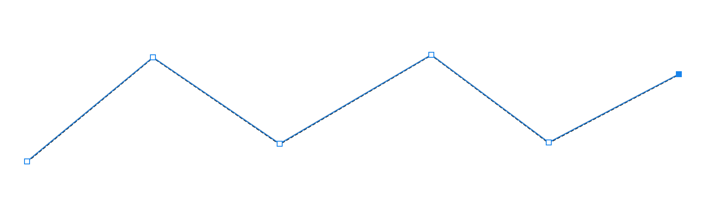

(3) 点击 `钢笔工具` 右键, 选择 `转换点工具`, 把鼠标放在画的每个折点上, 就可以调整了.

(4) 调整好后 `Ctrl` + `回车` 把路径变成形状. 此时当前仍会有虚线的路径框, 按下 `Ctrl` + `D` 去除.

## ▲ PS 如何快速画出三角形

(1) 在 `矩形选框` 工具上右键, 选择 `多边形工具`;

(2) 在上面 `选项` 栏中把, `边` 设置为 `3` 即可.

## ▲ PS 选择主体的 2 种方法

### 1. 使用 `快速选择` 工具

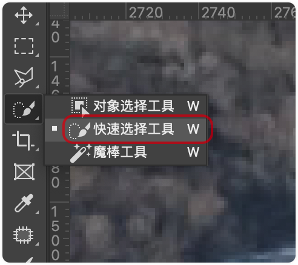

使用方法：选中工具之后，用鼠标在需要选中的物体上移动即可选中物体，多选的部分按住键盘的 `Alt` 键同事在多余的部分滑动鼠标，即可去除多选的部分。精细的选择物体扩大放大倍数即可。

### 2. 使用 `选择主体` 工具

详细使用方法见：https://zhuanlan.zhihu.com/p/33570414

## ▲ PS 插件

1. 磨皮插件 Portraiture 4
    - windows 下载地址：https://www.huajclub.com/4251.html （已经下载，在百度云盘）
    - Mac 下载地址：后补充
2. 

## ▲ PS 制作九宫格方法

- (1) 新建一个 1800 * 1800px 空白文件
- (2) 找到顶部导航中的 `视图` --> ``新建参考线版面`
  - 列: 数字填 3，装订线 30px(自定义) 
  - 行数: 数字填 3, 装订线自定义; 
  - 下面的边距: 上下左右 默认和装订线的设置相同, 但也可以根据自己的需求来.
- (3) 拉入图片, 调整大小和位置, 即可. 


## ▲ Mac Studio 安装 PS 出错记录

created: 2023.03.29

**问题**：安装完 PS 2022/2023 之后，点击 “打开” 按钮打开文件的弹框是纯黑色啥都没有，搜索了很久，看到 adobe 说可以解决 “新建文件” 黑屏的问题，按照 adobe 教程的是可以解决 “打开” 文件黑屏的问题，但是保存文件还是黑屏。

**解决方法**：

- 先从 `应用程序` 中点击各个 adobe 软件后，点击 content 下的 uninstall 删除所有 adobe 家的软件，

- 然后点击 `访达` —> 点击顶部导航栏的 `前往` 按钮 --> `资源库`—> `/Users/mac1033/Library/Application Support` 把文件夹下面的所有含有 adobe 名的文件夹都删除，并清空废纸篓。
  
  - 注：资源库的显示方法：点击当前访达窗口的用户图标（mac1033），然后按下 `command + J` 在弹框中勾选 “显示资源库文件夹” ) 

- 关机重启，再次重新安装。

**PS 2023 安装版本**： 安装百度云里的 ps 2023 版本，安装之前先看里面的安装教程。


## ▲ MBP 解决 This non-genuine Adobe app will be disabled soon

（这个非正版的 Adobe 应用程序将很快被禁用）

*==Created: 2023.06.05==*

事情的起因：6 月 4 号晚打开老黑的 MBP，突然弹出下图所示的弹框，大致意思就是 "这个非正版的adobe应用程序将很快被禁用"，然后我就卸载安装了最新版本的 ps 24 beta 版本，仍然不行；也在 google 和 baidu 搜索了很久，都没有找到任何可以解决的方法，无奈只能把 mbp 上所有的 adobe 软件都卸载试下可不可以解决问题。

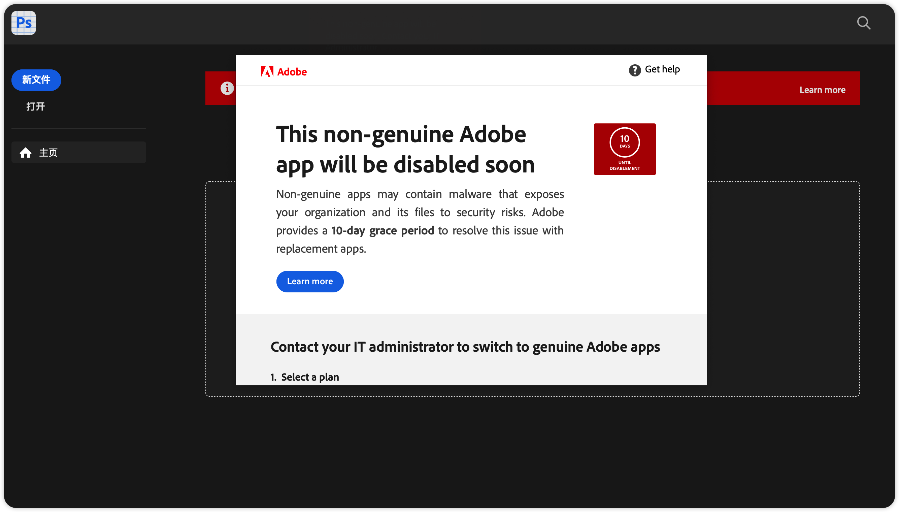

1. 首选需要在应用程序中点击各个 Adobe 软件的 uninstaller 删除，然后从 Application support 中删除 adobe 文件夹，好像哪个文件夹下还有 adobe 的残余文件，但是找不到了，全盘搜索找吧。。。
2. 首选需要安装 adobe creative installer，下载地址：https://www.adobe.com/creativecloud/desktop-app.html，安装期间需要登录账号，可以使用 apple id 登录。（注意：安装过程中不要勾选 AGS）

但是重新安装仍然没有解决上面的盗版提示。

*==Added: 2023.06.06==*

今天在 google 继续搜寻解决方案的时候，看到这个知乎专栏：[PS/LR 等软件提示“this Adobe app is not available”的解决方法（2023.05.21更新）](https://zhuanlan.zhihu.com/p/631079550?utm_id=0), 意思就是 Adobe 软件自动联网检查是否是盗版，作者建议把下面的网址加入到 Hosts 文件中（注: 下面的地址可能会不时更新）：

```sh
# 屏蔽 photoshop 非正版提示
0.0.0.0 ic.adobe.io
0.0.0.0 p13n.adobe.io
0.0.0.0 p13n-mr.adobe.io
0.0.0.0 cai-identity.adobe.io
0.0.0.0 dyzt55url8.adobe.io
0.0.0.0 gw8gfjbs05.adobe.io
0.0.0.0 2ftem87osk.adobe.io
0.0.0.0 ph0f2h2csf.adobe.io

0.0.0.0 crs.cr.adobe.com
0.0.0.0 photos.adobe.io
0.0.0.0 lcs-cops.adobe.io
0.0.0.0 cc-cdn.adobe.com
0.0.0.0 cc-api-data.adobe.io
0.0.0.0 cai-splunk-proxy.adobe.io

0.0.0.0 ge02.adobe.com
0.0.0.0 assets.adobedtm.com
0.0.0.0 auth.services.adobe.com
0.0.0.0 sstats.adobe.com
0.0.0.0 adobeid-na1.services.adobe.com
```

> 从哪里可以看到 PS 会自动联网检测软件是不是正版呢？
>
> 答：从 ClashX 的日志文件可以看到，我们点击 `ClashX -> 控制台 -> 日志`，此时几乎没有连接信息，接着我们打开 PS ，稍等 2 分种，可以看到如下的 TCP 连接，接着 PS 便会出现 non-genuine 弹出。
>
> 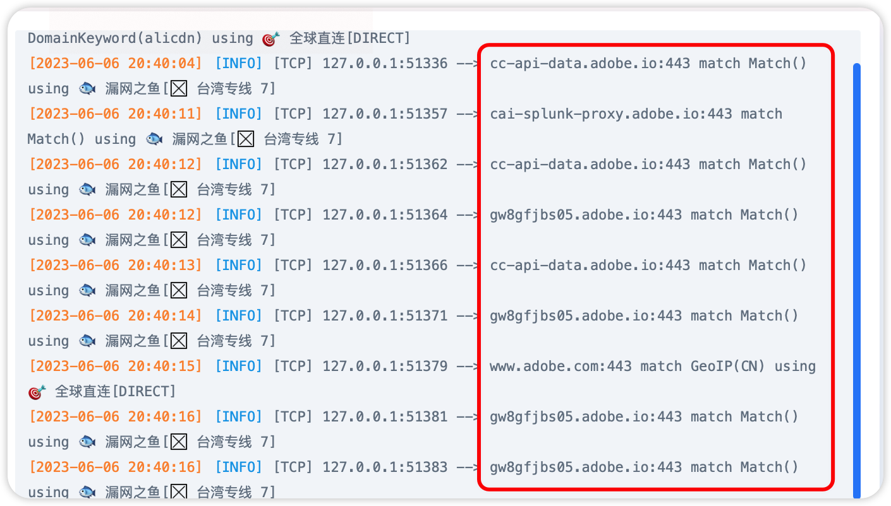

然后，我添加到 hosts 文件中，不开 ClashX 的情况下，PS 的 non-genuine 提示确实不再弹出了，但问题我是一直开着 ClashX 使用的。那为什么开着 ClashX 本地的 hosts 文件就不起作用了呢？原因大致是：DNS 解析被 ClashX 接管了，本地的 hosts 设置就没有作用了，看到的解决方法大致有 2 种，两种方法默认都是根据 Clash Windows 端为基础配置的：

### (1) 在 config 配置文件（如下图）中把 clash 的 DNS 设置设置为 false，

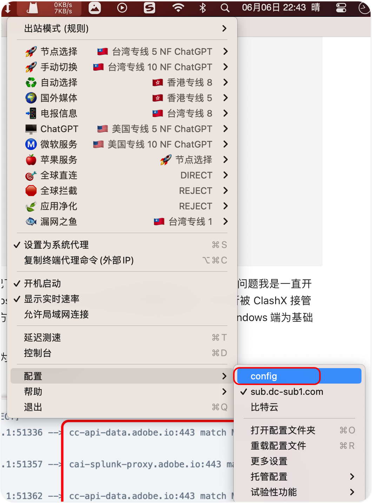

代码如下图：

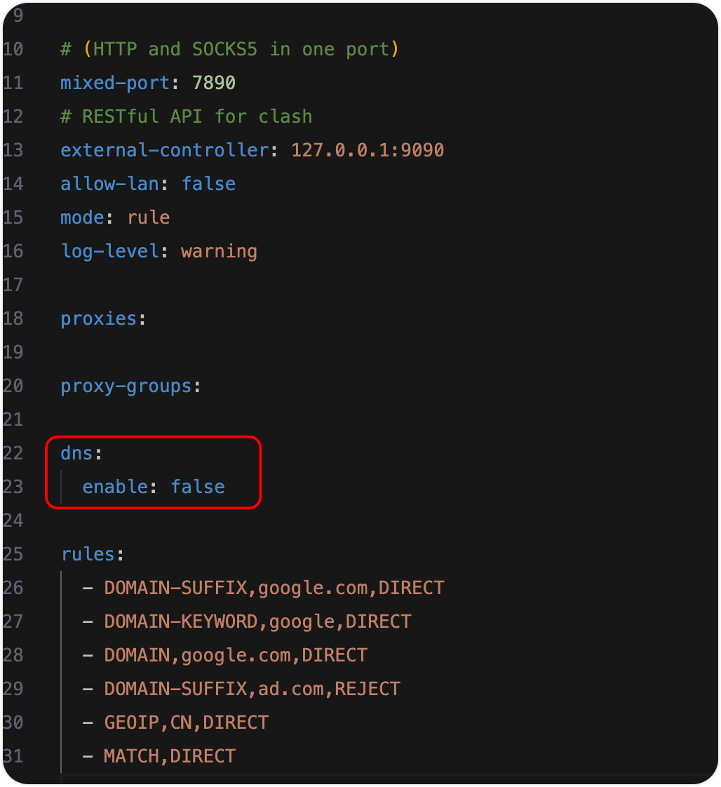

**但是在 ClashX mac 上尝试没有作用**。

### (2) 在代理节点的配置文件中添加 "指定网站不走代理" 的设置

Clash 的默认语法是这样的：

```yaml
# 此笔记来自：https://docs.mebi.me/docs/advanced-usage-for-clash#2%E6%8C%87%E5%AE%9A%E7%BD%91%E7%AB%99%E4%B8%8D%E8%B5%B0%E4%BB%A3%E7%90%86

mixin: # 注意下面缩进
  rules:
    - "DOMAIN-SUFFIX,ident.me,DIRECT"
```

注意：上面的 "DIRECT" 是 Clash 允许次网址直连的意思。

上面的代码是允许直连的情况，但我们自己购买的节点配置文件如何更改呢？

点击下图的 "打开配置文件夹" 然后找到 `DuangCloud.yaml` 文件。(注：请打开自己电脑对应的节点配置文件，此处只做演示。)

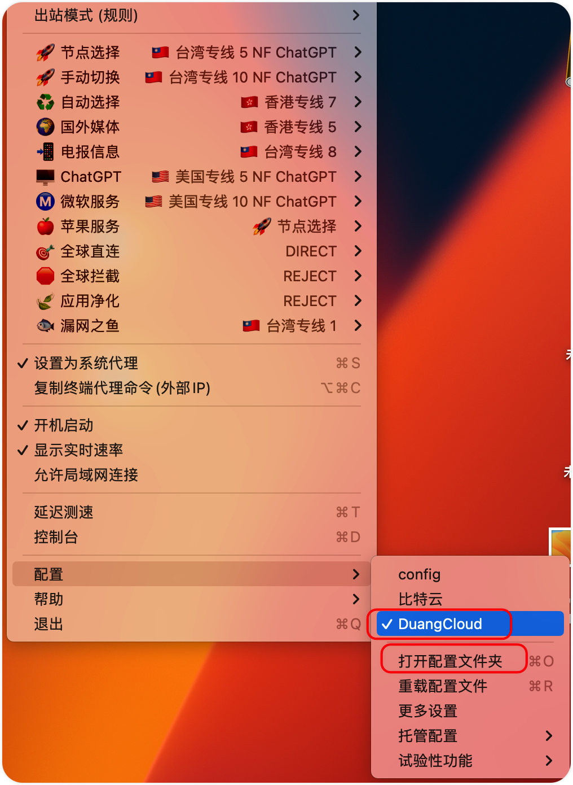

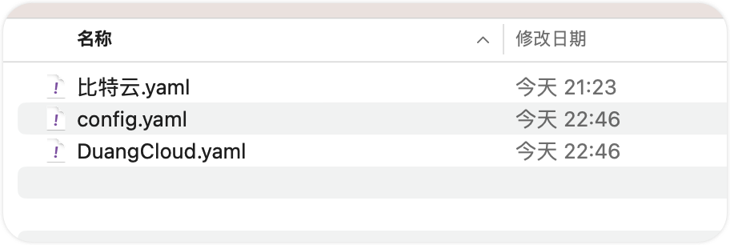

打开后，可以看到 `proxy-groups` 数组内可能有 REJECT 拒绝链接的配置（下面的截图来自 DuangCloud，但我发现 "比特云" 是没有的）。

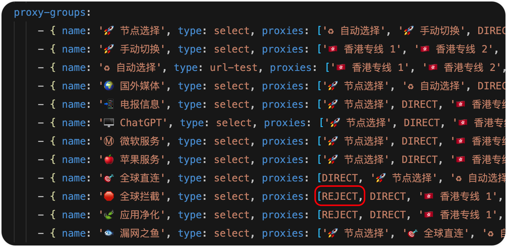

接着我们在当前文件的 `rules` 字段下添加如下的拦截配置。接着 `ClashX -> 配置 -> 重载配置` 即可。

```yaml
rules:
    - 'DOMAIN,api.duangss.cloud,DIRECT'
	...
    - 'DOMAIN-KEYWORD,zjtoolbar,🛑 全球拦截'    
    # 添加如下的拦截配置
    - 'DOMAIN-SUFFIX,ic.adobe.io,🛑 全球拦截'
    - 'DOMAIN-SUFFIX,p13n.adobe.io,🛑 全球拦截'
    - 'DOMAIN-SUFFIX,p13n-mr.adobe.io,🛑 全球拦截'
    - 'DOMAIN-SUFFIX,cai-identity.adobe.io,🛑 全球拦截'
    - 'DOMAIN-SUFFIX,dyzt55url8.adobe.io,🛑 全球拦截'
    - 'DOMAIN-SUFFIX,gw8gfjbs05.adobe.io,🛑 全球拦截'
    - 'DOMAIN-SUFFIX,2ftem87osk.adobe.io,🛑 全球拦截'
    - 'DOMAIN-SUFFIX,ph0f2h2csf.adobe.io,🛑 全球拦截'
    - 'DOMAIN-SUFFIX,crs.cr.adobe.com,🛑 全球拦截'
    - 'DOMAIN-SUFFIX,photos.adobe.io,🛑 全球拦截'
    - 'DOMAIN-SUFFIX,lcs-cops.adobe.io,🛑 全球拦截'
    - 'DOMAIN-SUFFIX,cc-cdn.adobe.com,🛑 全球拦截'
    - 'DOMAIN-SUFFIX,cc-api-data.adobe.io,🛑 全球拦截'
    - 'DOMAIN-SUFFIX,cai-splunk-proxy.adobe.io,🛑 全球拦截'
    - 'DOMAIN-SUFFIX,ge02.adobe.com,🛑 全球拦截'
    - 'DOMAIN-SUFFIX,assets.adobedtm.com,🛑 全球拦截'
    - 'DOMAIN-SUFFIX,auth.services.adobe.com,🛑 全球拦截'
    - 'DOMAIN-SUFFIX,sstats.adobe.com,🛑 全球拦截'
    - 'DOMAIN-SUFFIX,adobeid-na1.services.adobe.com,🛑 全球拦截'
    
    # 2023.08.02 添加
    - 'DOMAIN-SUFFIX,cai-splunk-proxy.adobe.io,🛑 全球拦截'
    - 'DOMAIN-SUFFIX,cc-api-data.adobe.io,🛑 全球拦截'
    - 'DOMAIN-SUFFIX,dxyeyf6ecy.adobe.io,🛑 全球拦截'
    - 'DOMAIN-SUFFIX,cc-api-data.adobe.io,🛑 全球拦截'

    # 2023.08.14 added 
    - 'DOMAIN-SUFFIX,fqaq3pq1o9.adobe.io,🛑 全球拦截'
    
```

*==Added: 2023.08.07==*

上面在 ClashX 中添加拦截的配置是可以的，但现在面临一个新的问题，因为节点会自动更新，所以自己添加的配置就会被更新后的节点文件覆盖，解决的方法就是下载 [ClashX Pro](https://install.appcenter.ms/users/clashx/apps/clashx-pro/distribution_groups/public) 版本，然后使用 Pro 版本的 [rule-providers](https://lancellc.gitbook.io/clash/clash-config-file/proxy-provider) 功能。

rule-providers 的使用方法见同仓库的这篇文章：`Hardware-and-Software-Apps-Notes\软件-software\ClashX\ClashX-Pro配置rule-providers\readme.md`

