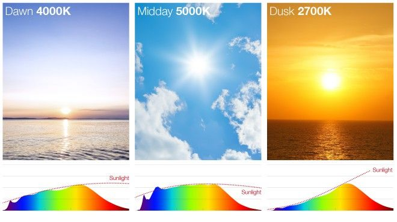

# Understanding Light and Color

[刘斯宁](https://www.zhihu.com/people/liu-si-zhu-82)

Camera技术专家

## 光的本质

人们很早就发现，白光或太阳光经三棱镜折射会分离出光谱色光，形成由红、橙、黄、绿、蓝、靛、紫等七个颜色组成的光带，这光带称为**光谱**。其中红光波长最长，紫光波长最短，其它各色光的波长则依次介于其间。如下图所示。

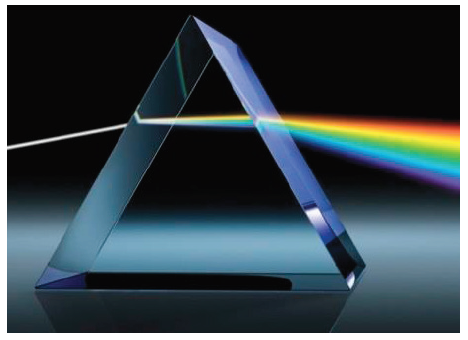

从白光分解出来的**色光**，如果再次通过三棱镜则不会继续分解出其它色光。这种不能再分解的色光叫做**单色光**。单色光的颜色取决于光的频率*f*，或者波长*λ*，两者是等价的， 可以根据光速公式c=*λf* 相互换算*。*由“单色光”混合而成的光称为“**复合光**”。复合光的颜色主要取决于复合光中能量最大的光的频率。当复合光中包含所有可见光频率，并且各频率能量相同时，复合光的颜色表现为白色。很多光学介质（如玻璃）的参数都与光的频率有关，即对不同频率的光表现出不同的折射率，不同频率的光在介质中传播的速度也不同，这两种情况统称为光的**色散**现象（dispersion of light）。三棱镜对光的色散形成了可见光谱，光纤中光的色散导致波包展宽，限制了信号传输的性能。


人类之所以能够感知客观世界中五彩缤纷的景象，是因为人眼能够接收物体发射、反射或散射的光。进一步说，是携带了物体信息的光子被人眼视网膜上的感光细胞吸收转换成电信号，通过视觉神经传导到大脑进行解释处理，最终产生了视觉。现在人们已经知道，光是一种电磁波，与手机天线辐射的电磁波、微波炉辐射的电磁波，以及X光机辐射的电磁波本质是一样的，只是辐射的频率各有不同。能够对人眼感光细胞产生刺激的电磁波称为可见光，光谱范围为380～760nm 。从下面的电磁辐射谱示意图中可以看到，可见光的光谱只是电磁辐射谱中的一小部分。

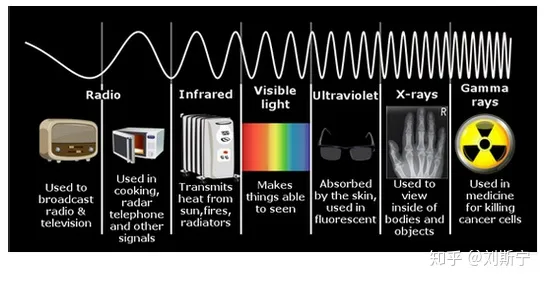

物体呈现出颜色的本质是对光的吸收和反射作用。举例来说，当白光通过硫酸铜溶液时，铜离子选择性地吸收了部分黄色光，使透射光中的蓝光成为主要成分，于是硫酸铜溶液就呈现出蓝色。如果照射硫酸铜溶液的是黄光，则硫酸铜溶液不能呈现蓝色，而是呈现黑色。这个例子说明，光源的光谱组成对颜色的形成起到至关重要的作用。光谱中谱线频率的缺失意味着可观察颜色会减少。

从观察颜色的角度看，日光是一种非常理想的光源，如下图所示，日光在可见光波段光谱连续（覆盖所有波长）、平坦（各波长功率非常接近），因此被定义为观察颜色的标准光源。

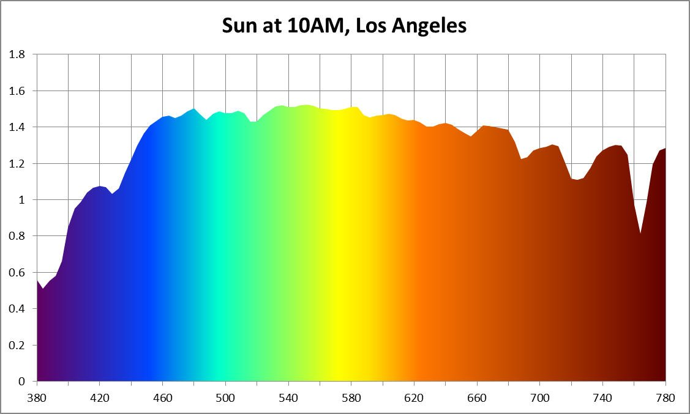


光的产生源于电子的运动。根据量子力学理论，组成原子的电子只能呆在一系列不连续的**轨道**（orbit）上，每个轨道对应一个**能级**（energy level），距离原子核越远的轨道能级越高。当电子从高能级跃迁到低能级时会释放一个光子。一个低能级的电子想要跃迁到高能级则必须吸收一份能量（通过热激发或吸收一个光子），而且吸收的能量必须刚好等于两个能级之差。高能级一般是不太稳定的，电子在高能级停留一段时间后会自发地跃迁回低能级，同时释放一个光子。

下图显示了氢原子的能级结构和对应的光谱。

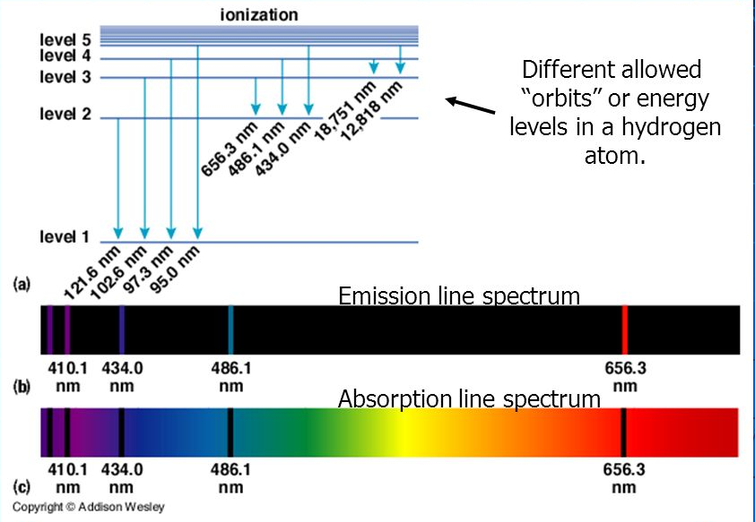

(a) 轨道能级 (b)发射谱 (c)吸收谱

如上图所示，当电子从高能级向低能级跃迁时，会发射光子，得到发射谱(b)。当连续谱光源经过氢原子气体时，特定波长的光子将被电子吸收，在连续谱上留下空洞，得到吸收谱(c)。

有些物质（如卤族元素）具备一些容易发生电子跃迁的能级，因此常被用于制作人造光源。此类物质发出的光能量通常集中在几个特定的波长。下图是金属卤化物灯的光谱，可以看到能量最集中的波长是591nm，这个波长的光颜色是黄绿色。

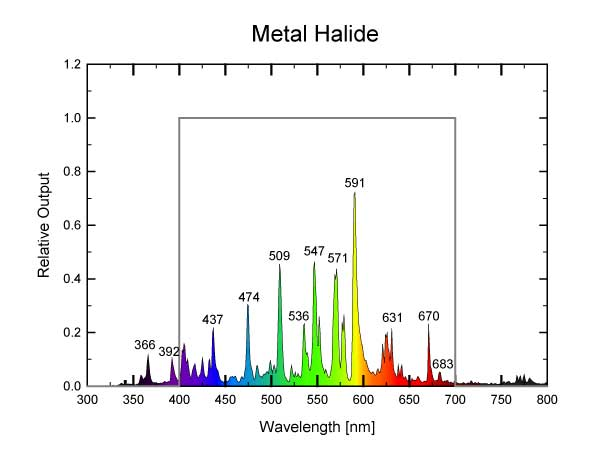

最常见的荧光灯使用汞蒸汽作为发光物质，汞原子的光谱如下图所示。

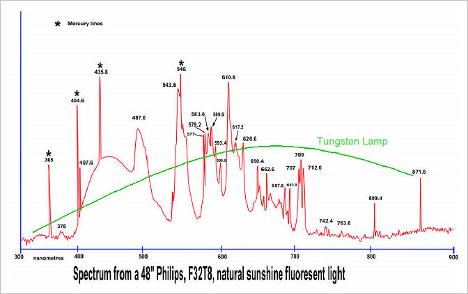

## 人类视觉

人类视觉系统（Human Vision System, HVS）具有三种视锥细胞（cones），分别感应长、中、短三种波长的可见光。三种锥体对等能光刺激的频率响应如下图所示。

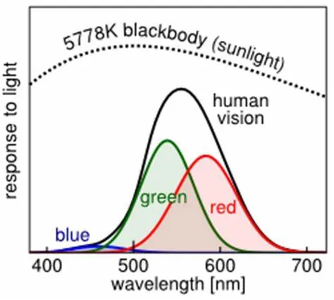

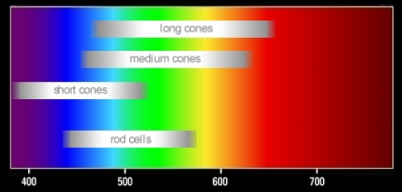

由于HVS只存在三种物理的颜色探测器，人类对颜色的知觉实际上是神经系统通过插值的方法外推出来的，对于任何一种颜色知觉都存在无穷多种光谱形式可以激发出同样的知觉。比如下图所示的四种情况，从上到下分别是(a)日光的连续谱，(b)红、绿、蓝分立谱，(c)黄、蓝分立谱，(d)荧光谱

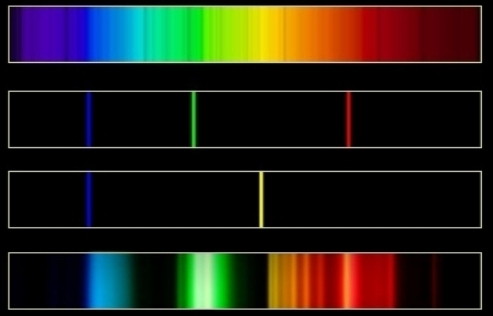

实验表明，这四种光在人眼看来都是白光。因此看起来HVS对光源的具体光谱成分并不是特别在意。

一个理想的黑体（如太阳）发射连续光谱，光谱的功率分布取决于黑体的温度，即色温。在上图的(b)~(d)例子中，谱线是分立的，并不符合色温的定义。因此引入**相关色温**（Correlated Color Temperature, CCT）的概念，如果任意光源与色温为T的黑体激发的颜色知觉相同，则该光源的相关色温定义为T。

相关色温的概念由D.B. Judd于1936年提出，基于色温和等温线定义。沿给定等温线的所有颜色具有相同的相关色温。以下是D.B. Judd关于等温线的建议，该建议被纳入了CIE 1960 UCS 均匀色度空间标准，下文会有详细介绍。

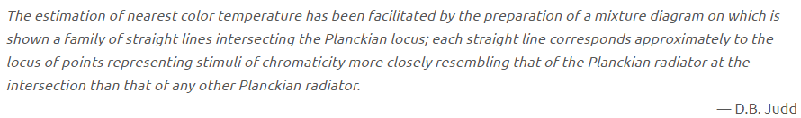

对人眼来说，光的频率决定了光的颜色，光的能量决定了引起视觉刺激的强度。对于频率相同而能量不同的两束光，人眼感受到的色彩相同，但是色彩的明暗程度不同。

下图中的白色线曲线是人眼中感应短波的S视锥体的光谱响应，黑色实心点曲线是20岁左右年轻人对等功率强光（glare）的不舒适度，黑色空心点曲线是60岁左右老人对等功率强光的不舒适度，实验表明各种人群都是对蓝色强光的刺激更敏感。想必很多人都有被高亮远光车灯短暂致盲的痛苦体验，其中起主要作用的就是蓝光成分。

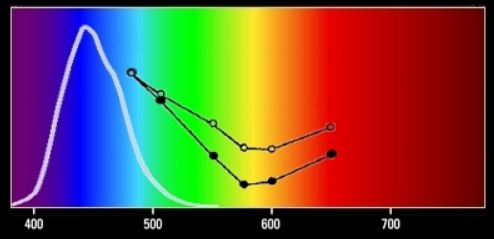


## LED 光源

LED 全称 Light Emitting Diode，即发光二极管，目前流行的高功率LED发射的是峰值波长460nm的蓝光。为了获得白光光源，人们在LED上添加了磷化合物，它能吸收蓝光发射黄绿光，从而改变LED光源的色调，调制出冷白、暖白等各种色温的光源产品。

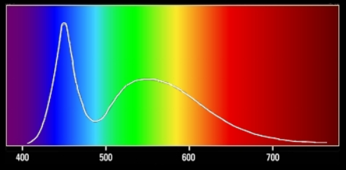

6650K 冷白光

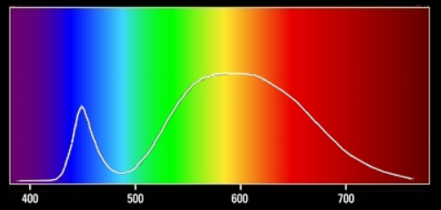

2875K 暖白光

从下图的例子可以看到，不同的光谱成分（色温）对拍照的效果影响很大。

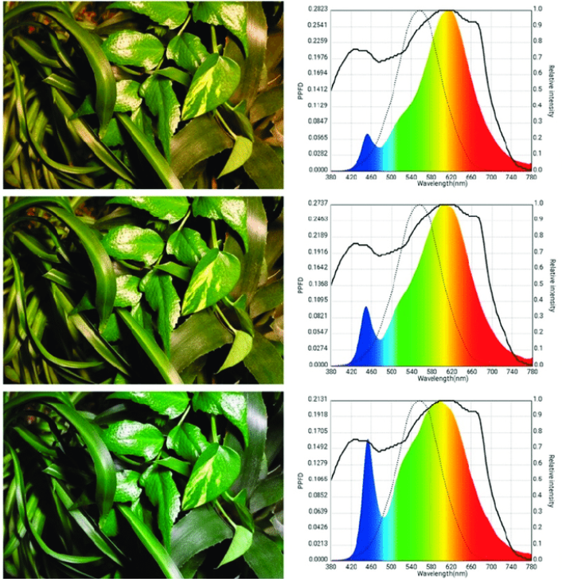


### 光源的性质

**发光强度** (luminous intensity) 是描述一个光源在指定方向上的辐射功率的物理量，单位是坎德拉cd(candela)。坎德拉的名字来源与蜡烛有关，最初英国人以一磅重的白蜡制造出一尺长的蜡烛所燃放出来的光来定义烛光单位，而如今坎德拉的定义已发生了变化。


根据1979年第16届国际计量大会确立的决定：如果一个频率为540x10^12Hz的单色光源在给定方向上的**辐射强度**是1/683Watt/sr，则该光源在该方向上的发光强度是1cd。

**注1：**1Watt/sr的含义是1秒内通过1单位立体角的辐射能量是1焦耳。

**注2：**立体角的国际制单位是[球面度](https://link.zhihu.com/?target=https%3A//baike.baidu.com/item/%E7%90%83%E9%9D%A2%E5%BA%A6)(steradian，sr)。一个完整的球面对于球内任意一点的立体角为4π*sr*。


当光源用于照明用途时，仅仅用辐射功率来衡量光源在单位时间所发出的光能是不够的，还需要考虑人眼对不同波长光的光谱响应问题。**光通量** (Luminous flux) 的引入就解决了这个问题。

国际照明委员会（CIE）选择了明视觉下人眼最敏感的555nm作为从“功率”向“光通量”转换的参考波长，并定义功率为1W的555nm波长单色光，对应的光通量为683流明。

流明为光通量的单位，英文缩写为lumen或lm。至于为什么是“683”，则与早期以蜡烛烛光来描述光照的历史有关。

根据发光强度的定义可以知道，一个各向同性的、发光强度为1cd的光源，在4π立体角上的光通量总和是12.57lm。

一个波长为555nm的光子所携带的能量是，

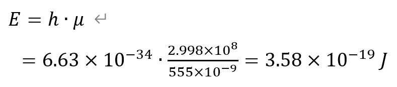

在1lux照度（1lm/m^2）下，1m^2面积上1秒内通过的光子数是，

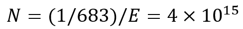

**光照度** (illuminance) 是描述落在某个表面上的光的总和的物理量，定义是单位面积上的光通量，度量单位为流明每立方米（lm/m2），也叫勒克斯（lux, lx）。1勒克司相当于1流明/平方米，即被照射物体每平方米的面积上，受距离一米、发光强度为1烛光的光源垂直照射的光通量。


**光亮度** (luminance) 是描述发光面明亮程度的物理量，定义是单位发光面积在其法线方向上、单位立体角内的光通量，单位是[尼特](https://link.zhihu.com/?target=https%3A//www.baidu.com/s%3Fwd%3D%E5%B0%BC%E7%89%B9%26tn%3DSE_PcZhidaonwhc_ngpagmjz%26rsv_dl%3Dgh_pc_zhidao)，即每平方米每球面度1流明，或坎德拉每平方米（cd/m2）。

**注1：**坎德拉每平方米（cd/m2）中的m2描述的是发光面本身的面积。

**注2：**光亮度有时简称“亮度”。

**注3：**“光强”是一个非正式的说法，很难说对应哪一个光度学概念。在某些场合可能会用“光强”指代发光强度，有时则指代光照度，有时又指代光亮度。


**朗伯**（亮度单位，物体表面垂直方向上每平方厘米反射或辐射—“流明”的亮度）
lam·bert, The unit of luminance in the centimeter-gram-second system, equivalent to the luminance of a perfectly diffusing surface that emits or reflects one lumen per square centimeter.


光源的**纯度**是对光的频谱纯度的一种度量。单色光的纯度最高，白光的纯度最低。


### 三基色

人们在进行混色实验时发现，只要选取三种不同颜色的单色光按照一定比例混合就可以得到自然界中绝大多数色彩。具有这种特性的三个单色光叫做基色光，对应的三种颜色称为三基色，比如红色、绿色、蓝色。

混色的基本原理是

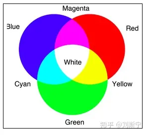

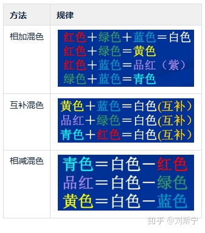

三基色的原理是

- 三基色必须是相互独立的，其中任何一种都不能由另外两种混合得到。
- 自然界中的大多数颜色都可以用三基色按一定比例混合得到，或者说大多数颜色都可以分解成三基色。
- 三个基色的混合比例决定了混合色的色调和饱和度。
- 混合色的亮度等于构成该混合色的各基色的亮度之和。

随着对三基色的了解研究深入，人们对三基色的应用也越来越广泛，例如，三基色荧光灯为人类提供了更加丰富的光源系统，人们在绘画，摄影灯领域越来越多的应用到三基色原理的产品。不同的应用对三基色的定义也有所差异，目前主要存在以下几种分类

**色光三基色**

国际照明委员会（CIE）于1931年规定水银光谱中波长分别为700nm,546.1nm,435.8nm的分量为红、绿、蓝三基色光。CIE规定：光通量为1光瓦的红光为一个红基色单位量；光通量为4.5907光瓦的绿光为一个绿基色单位量；光通量为0.0601光瓦的蓝光作为一个蓝基色单位量，分别记为[R], [G], [B]。三基色光按一定比例混合可以呈现各种光色。

三基色以单位量混合时应得到E白光 , E白光是指CIE 1931 xyY色谱图上的等能白光点E，等效色温5400K。

F(E白)=1+4.5907+0.0601 =5.6508(lm)


**彩电三基色**

彩色电视机的荧光屏上涂有三种不同的荧光粉，当电子束打在上面的时候，一种能发出红光，一种能发出绿光，一种能发出蓝光**。**由这三基色按照不同比例和强弱混合．可以产生自然界的各种色彩变化。

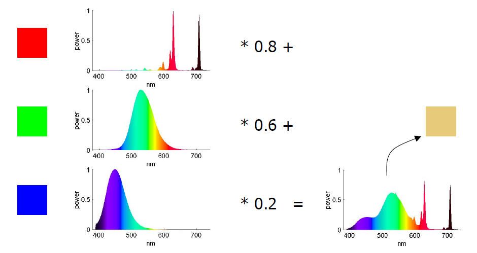

**颜料三基色**

颜料和其他不发光物体的三基色是品红（相当于[玫瑰红](https://link.zhihu.com/?target=https%3A//baike.baidu.com/item/%E7%8E%AB%E7%91%B0%E7%BA%A2/4809156)、[桃红](https://link.zhihu.com/?target=https%3A//baike.baidu.com/item/%E6%A1%83%E7%BA%A2/66548)）、品青（相当于较深的[天蓝](https://link.zhihu.com/?target=https%3A//baike.baidu.com/item/%E5%A4%A9%E8%93%9D/9471902)、[湖蓝](https://link.zhihu.com/?target=https%3A//baike.baidu.com/item/%E6%B9%96%E8%93%9D/19913407)）、浅黄（相当于柠檬黄）。由英国化学家富勃斯特（1781—1868）研究选定的这三原色可以混合出多种多样的颜色，不过不能调配出黑色，只能混合出深灰色。因此在彩色印刷中，除了使用的三原色外还要增加一版黑色．才能得出深重的颜色。

美术实践证明，品红加少量黄可以调出大红（红=M100+Y100），而大红却无法调出品红；青加少量品红可以得到蓝（蓝=C100+M100），而蓝加白得到的却是不鲜艳的青。

**印刷三基色**

印刷品的颜色，实际上都是看到的纸张反射的光线，比如我们在画画的时候调颜色，也要用这种组合。颜料的原理是吸收光线而不是光线的叠加，因此颜料的三基色就是能够吸收RGB三种波长的光的颜色，经研究确定为青、品红、黄（CMY），它们就是RGB的补色。

把黄色颜料和青色颜料混合起来，则黄色颜料吸收蓝光，青色颜料吸收红光，因此只有绿色光反射出来，这就是黄色颜料加上青色颜料形成绿色的道理。


## 颜色模型 （color model）

A color model is an abstract mathematical model describing the way colors can be represented as tuples of numbers, typically as three or four values or color components. When this model is associated with a precise description of how the components are to be interpreted (viewing conditions, etc.), the resulting set of colors is called "color space."

颜色模型是一种抽象的数学模型，是一种对颜色的表示方法，以方便对颜色进行编码和存储。一个典型的颜色模型通常会包含三到四个分量。如果在颜色模型的基础上进一步定义了约束条件，使模型的颜色编码（coded values）可以精确地映射到实际的颜色，则该颜色模型能够表示的全部颜色即完全确定，即构成了一个颜色空间（color space）。

在实践中，人们往往较少使用“颜色模型”这一术语，而是更多地使用“颜色空间”来实际指代颜色模型，严格来讲其实是不太准确的，使用时应注意概念区别。举例来说，sRGB是一种颜色空间，它使用RGB颜色模型表示颜色，并定义了R、G、B三基色以及白色的具体色度值，并且定义了观察颜色所需的环境（亮度范围）等约束条件。这些约束条件保证了RGB颜色模型的编码能够精确地、可重复地映射成特定的视觉刺激。以sRGB编码的图像在所有支持sRGB的显示器上都能还原出同样的效果。


**常用颜色模型**

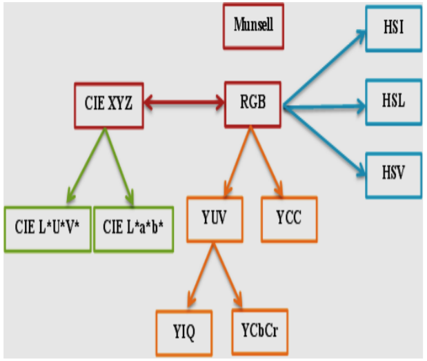


对于一个颜色显示系统，该系统能够渲染的颜色空间也称为色域（color gamut）。需要注意的是，色域概念一般只适用于颜色渲染系统，如显示器、打印机等。对于一个颜色度量系统，如camera、光谱仪等，则只存在颜色响应的概念，不存在色域的概念。尽管如此，很多camera厂家还是会将camera/sensor输出的RGB值和一个特定的色域联系起来，此时，camera 输出的RGB编码应该直接映射为该色域中的一个颜色点，如果按照其它色域进行解释，则在显示系统上还原出来的颜色会与真实颜色差异较大。如果目标显示系统不支持camera厂家定义的色域，为了能够正确地显示颜色，则需要先将camera RGB映射为标准颜色模型（如XYZ），再通过XYZ值进行显示，或将XYZ变换到显示器RGB值后显示。camera厂家选择这种做法的原因主要是sensor能够记录的颜色范围通常大于普通显示器支持的颜色范围（sRGB）。在记录时选取更大的目标色域可以减少原始颜色信息的损失，为后期的视频编辑处理预留充裕的空间。

### RGB 颜色空间

在计算机技术中使用最广泛的颜色空间是RGB颜色空间，如下图所示。

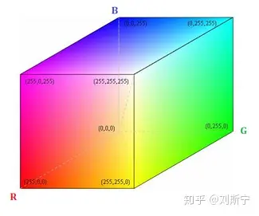

对于最常见的24位三通道彩色数字图像，每个像素Pixel(x,y)需要使用三个分量R、G、B来描述，每个分量用一个字节表示，范围是[0,255]。

RGB颜色空间是一种与人的视觉系统结构密切相关的模型，因为人眼的生理结构决定了人能感知的所有颜色都可以看成是R、G、B三个基色的不同组合，大部分显示器都采用这种颜色模型。彩色阴极射线管、彩色光栅图形显示器都使用R、G、B数值来驱动R、G、B 电子枪发射电子，并分别激发荧光屏上的R、G、B三种颜色的荧光粉发出不同亮度的光线，并通过相加混合产生各种颜色。扫描仪的工作原理也是分别采样原稿反射光线中的R、G、B分量，并用它来表示原稿的颜色。

RGB色彩空间称为与设备相关的色彩空间，因为不同的扫描仪扫描同一幅图像，会得到不同色彩的图像数据；不同型号的显示器显示同一幅图像，也会有不同 的色彩显示结果。显示器和扫描仪使用的RGB空间与CIE 1931 RGB真实三原色表色系统空间是不同的，后者是与设备无关的颜色空间。

### YUV、YCbCr 颜色空间

YUV是一类信号的总称，最早在德国和法国发展的彩色电视系统PAL和SECAM中使用，现今已经在电脑系统上广泛使用。

YUV中的“Y”表示明亮度（Luminance、Luma），“U”和“V”则是色度、浓度（Chrominance、Chroma）。

YCbCr不是一种绝对色彩空间，而是在YUV基础上进行压缩和偏移的衍生版本，一般应用于影片中的影像连续处理，或是数字摄影系统中。JPEG、MPEG、DVD、摄影机、数字电视等皆採此一格式。因此一般俗称的YUV大多是指YCbCr。

YCbCr的Y与YUV中的Y含义一致，Cb和Cr与UV相同都指色彩，Cb指蓝色色度，Cr指红色色度。

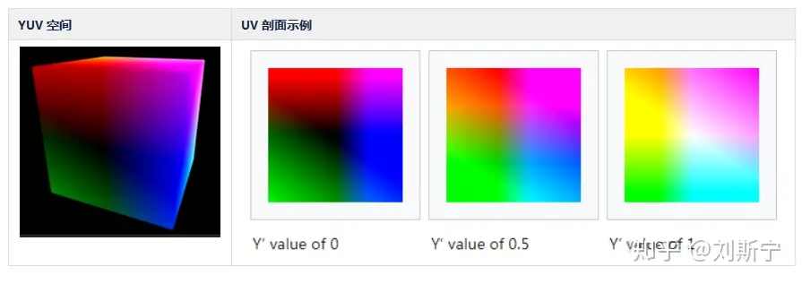

### HSV 颜色空间

HSV是一种比较直观的颜色模型，所以在许多图像编辑工具中应用比较广泛，这个模型中颜色的参数分别是：色调（H, Hue），饱和度（S,Saturation），明度（V, Value）。

**色调H** 用角度度量，取值范围为0°～360°，从红色开始按逆时针方向计算，红色为0°，绿色为120°,蓝色为240°。它们的补色是：黄色为60°，青色为180°,品红为300°；

**饱和度S** 表示颜色接近光谱色的程度。一种颜色，可以看成是某种光谱色与白色混合的结果。其中光谱色所占的比例愈大，颜色接近光谱色的程度就愈高，颜色的饱和度也就愈高。饱和度高，颜色则深而艳。光谱色的白光成分为0，饱和度达到最高。通常取值范围为0%～100%，值越大，颜色越饱和。

**明度V** 表示颜色明亮的程度，对于光源色，明度值与发光体的光亮度有关；对于物体色，此值和物体的透射比或反射比有关。通常取值范围为0%（黑）到100%（白）。

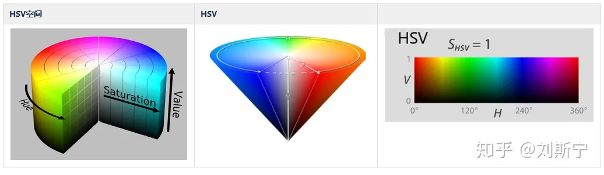

### CIE-1931 RGB 颜色空间

国际照明委员会（CIE）于1931年提出了一个RGB颜色模型，但是人们很快发现这个模型存在缺陷，其中红色响应在435.1~546.1波段出现了负值，给配色造成了极大不便，如下图所示。

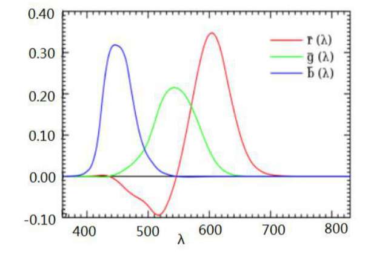

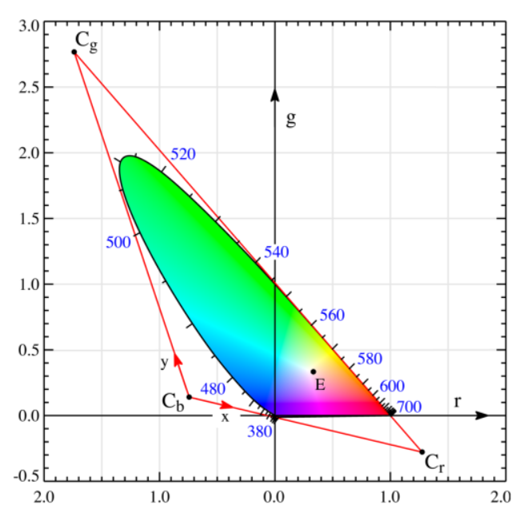

为了解决这个问题，CIE 很快又推出了改进的模型，由于RGB名称已经被占用，所以新的颜色模型称为XYZ颜色空间。

### CIE-1931 XYZ 颜色空间

国际照明委员会（CIE）于1931年首次用纯数学的方法定义了一种颜色空间模型，即CIE 1931 XYZ 颜色空间，它覆盖了人眼所能感知的全部颜色，而且不依赖于任何特定的物理实现。当一个颜色以XYZ 形式表示时，在任何支持XYZ标准的显示器上都会渲染出一致的颜色，与显示器的具体物理特性无关。

在该模型中，CIE定义了三个函数用于模拟人眼的三种锥细胞对可见光谱的响应曲线，如下图所示。

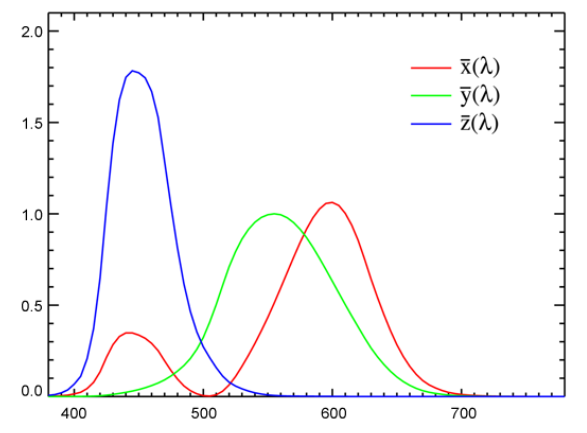

CIE用数据表格的形式定义了三个函数的取值，该组数据称为CIE标准观察者响应，适用于观察角度小于2°的情况。

关于2°的来源是，Wright 以及 Guild 等人在1920年代组织了关于颜色匹配函数（Color Matchting Function，CMF） 的研究实验，他们让受试者通过一个小孔观察颜色，该小孔提供2°的视场角。后来CIE又发布了10°视场角的标准观察者响应，称为CIE 1964 10° RGB CMF。

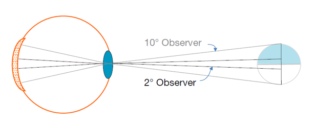

假设某种色光的功率谱为S(λ) ，则CIE XYZ三刺激值用标准观察者响应函数定义如下

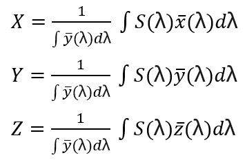

在进行数值计算时一般取dλ为5nm或10nm。

当色光是源于物体表面的反射时，S(λ) 取决于照明光源和物体表面的反射率，下图给出了一个具体的例子。

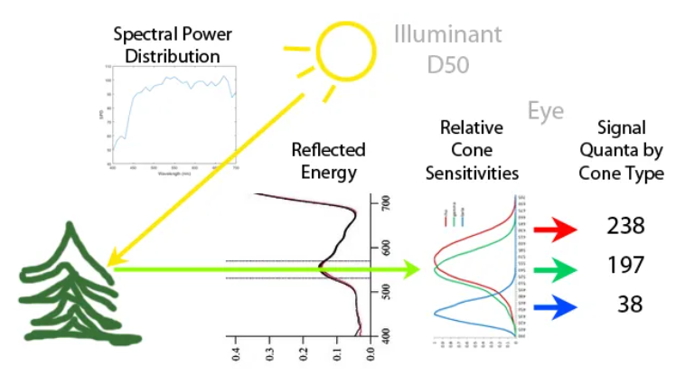

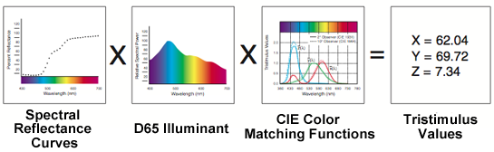

XYZ 坐标包含了光源的能量信息，因此取值是无上限的，如下图所示

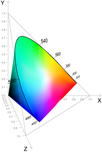


**CIE-1931 xyY 颜色空间**

如果只考虑色度问题，则更加方便的是XYZ 的归一化形式。从CIE三刺激值可以导出三个正交量x,y,z，即

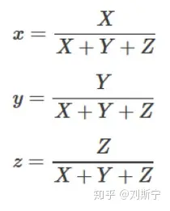

其中x,y分量用于度量颜色的色度(chromaticity)，而颜色的明度（brightness/luminance）被设计成用三刺激值中的Y分量表示，这就是CIE xyY空间。

定义CIE xyY颜色空间的根据是，对于一种给定的颜色，如果增加它的明度，则每一种基色的光通量也要按比例增加，X:Y:Z的比值保持不变，这样才能匹配这种颜色。由于色度值仅与波长(色调)和纯度有关，而与总的辐射能量无关，因此在计算颜色的色度时可以用总的辐射能(X+Y+Z)对X, Y和Z进行归一化处理，或者等效地只考虑X+Y+Z=1截面的情形，则配色方程简化为x+y+z=1。由于z可以从x+y+z=1导出，因此可以只用x和y表示颜色。


下图所示的是著名的CIE色度图(chromaticity diagram)，俗称马蹄图（horsehoe）或舌形图。

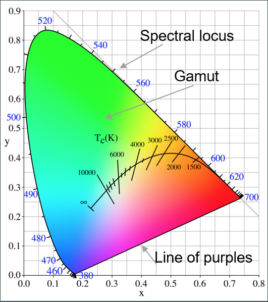


色度图外缘的舌形曲线是光谱轨迹(spectral locus)，标注的数字是光谱的波长，以纳米为单位。底部连接380nm和700nm的直线叫做紫红线（purple line）。从外缘向内颜色的饱和度逐渐降低，最终会聚到图形中心的一个特殊点E，这个点叫做等能白光点，坐标值(0.33,0.33)，色温5400K。

色度图中，红色位于x值较大的区域，绿色位于y值较大的区域，蓝色位于x,y值均较小（因此z值较大）的区域。

色度图中间向下凹的曲线叫做**黑体色温轨迹**(blackbody locus)，或**普朗克轨迹**(Planckian locus)，曲线上有一些特殊点，分别是

- A点(2856K)，代表白炽灯
- B点(4874K)，曾被推荐为日光标准，后又废除，用D点取代
- C点(6774K)，代表阴天的天光
- D点(6500K)，代表日光
- E点，等能白光点，一个理想标准，实际中并不存在。


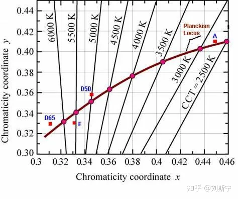

值得注意的是色温轨迹上的比例尺是不均匀的，在曲线两端有十倍的变化。

各特殊点对应的光谱如下图所示。

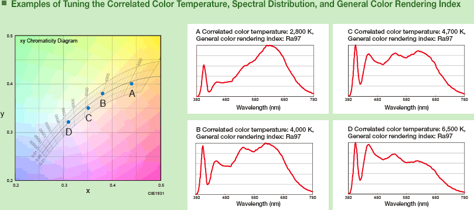

下图是RGB空间在XYZ空间的投影。图中可以看出，很多人眼可以感知的颜色并不在RGB空间中，换句话说，RGB空间并不包含人眼可见的全部颜色。

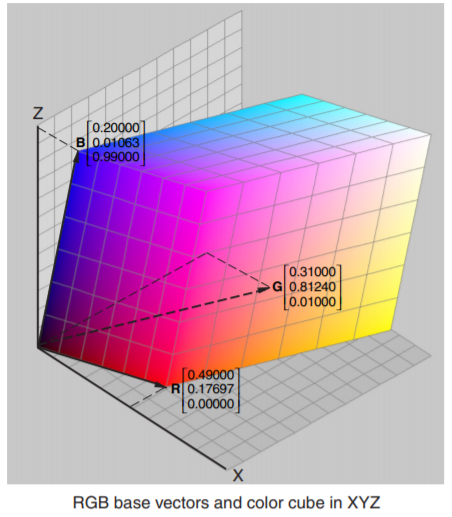

### 颜色宽容量

在xy色度图上每一点都代表一种确定的颜色，但是如果两个点靠得过近则人眼无法分辨出差异。人眼感觉不出颜色变化的范围称为颜色宽容量。Mac Adam等人的研究表明，色度图不同位置上颜色宽容量并不相同，其分布规律如下图所示(为突出显示效果，椭圆大小被放大为实际值的10倍)。

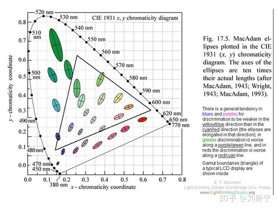

从Mac Adam实验中可以得到一个重要的结论是，色度图上任意两个色点之间的距离与人类视觉能够分辨的色度差并不是线性关系。


**知觉均匀空间**

A color space is defined as perceptually uniform if a difference in value anywhere in the color space corresponds to the same difference in perception.

如果一个颜色空间满足在任意位置处颜色值的单位变化量总是对应相同的知觉变化量，则称该颜色空间是**知觉均匀**的（perceptually uniform）。知觉均匀空间的特点是**颜色宽容量**处处相等，与具体的颜色值无关，如下图所示。

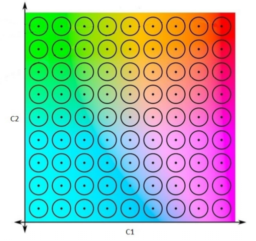

按照这个定义，CIE-1931 xyY 空间是知觉不均匀的（perceptually non-uniform）。那么一个很自然的问题就是，是否存在一种与人类视觉响应呈线性关系的度量方式呢？答案是存在的，这就是**微倒数**表示。


**微倒数**

颜色宽容量又称最小可辨差(Just Noticeable Difference, JND)，已知它是色温的函数，用E(T)表示。Judd等人的研究结果表明，JND与色温满足如下经验公式

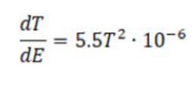

该公式可以整理成下面的形式

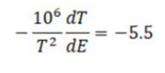

令函数M(T) = 1E6/T，则dM/dT=-1E6/T^2，代入上式可得到M与E的线性函数

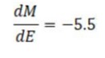

因此定义M为色温的微倒数(Micro Reciprocal Degree, MRD)，单位是mired，或MK^-1，意义是人眼的最小可辨差是5.5mireds，

举例来说，色温T=5000K对应的微倒数是M=200mireds，下一个可分辨的色温点是M=205.5，对应T=4866K,色温间距为134K。而T=2000K对应的微倒数是M=500mireds，下一个可分辨的色温

点是M=505.5，对应T=1978K,色温间距为22K。由此可见，人眼对低色温区的分辨能力更强。


下图在一系列色温点上标出了颜色宽容量，人眼无法分辨椭圆内颜色的差异。为了说明问题，图中椭圆的半径是真实比例的24倍。

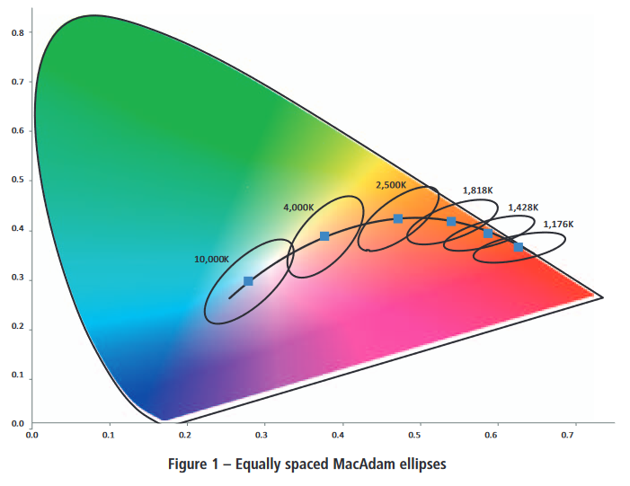

下表列出了图中的色温点和相应的微倒数。可以看到，如果采用微倒数坐标表示，则图中各点在微倒数坐标上刚好是等间距的。

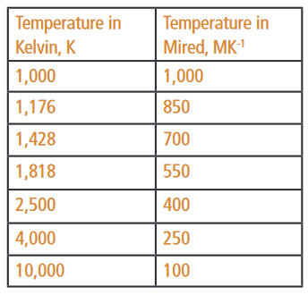


### CIE-1960 UCS 颜色空间

CIE-1931 XYZ 颜色空间有一个大的缺陷，在计算色差时，各颜色区间允许的误差是不一样。为了统一颜色的计算和比较，CIE 又推出了均匀颜色空间。1937年Mac Adam 将(x, y)转换成(u,v)色坐标系統，于1960年被CIE所采用：

u=4x/(-2x+12y+3);

v=6y/(-2x+12y+3)

或者等价地，

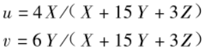

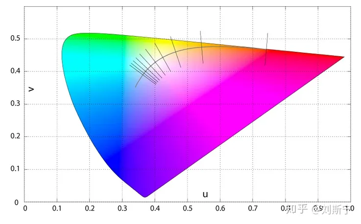

CIE-1960 uv色度图上的普朗克轨迹、等温线与特殊色温点。

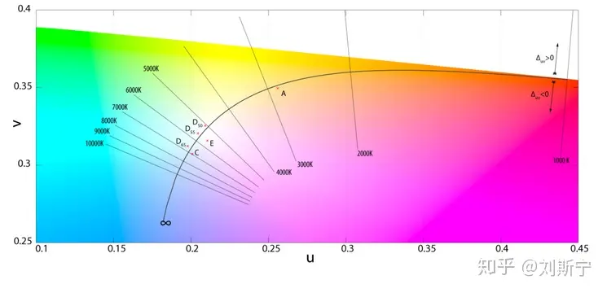

普朗克轨迹上，色温T处的斜率可以根据以下公式求得，

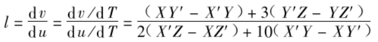

其中

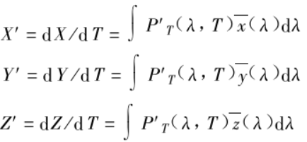

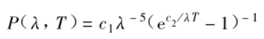

由于等温线定义为垂直于普朗克轨迹的切线，所以其斜率可以表示为切线斜率的负倒数，


给定色度图上一个任意点S(u,v)，有多种方法可以计算该点对应的相关色温（CCT），如内插法，垂足法等，


(a) 内插法 (b) 垂足法

具体实现过程可参考以下论文。


**CIE-1976 UCS 颜色空间**

(u,v)色坐标系統仍无法与视觉颜色同步化，因此 Mac Adam 继续深化研究，最终在1973年决定将v坐标再加上50%，这个系统又被采纳为**CIE 1976 UCS** (Uniform Chromaticity Scale)色度坐标系統：

u’=u=4x/(-2x+12y+3);

v’=1.5v=9y/(-2x+12y+3)

CIE 1976 UCS将CIE 1931色度坐标加以转换，使其所形成的色域接近均匀色度空间，让色彩差异得以量化，在各种文献中也称CIE LUV颜色空间。


CIE-1976 UCS 普朗克曲线局部放大图


在(u',v')坐标系上两个颜色的差异∆u'v'与人知觉到的颜色差异成正比关系。


分别使用CIE 1964和1976 版本标注 Munsell 色序，可以发现1976版本的色调均匀性更好。


**CIE-1976 L\*a\*b\* 颜色空间**

CIE L*a*b*又称**CIELAB**颜色空间，是目前应用最广的颜色空间之一，它的主要优点是颜色之间的距离与人的知觉更好地符合线性关系，尤其是描述较暗的颜色准确度更高。轻微的不足是描述黄色区域时线性关系会有一定变化，即颜色宽容量的圆圈在黄色附近直径会有变化。


**CIELAB** 颜色空间在知觉均匀性方面与CIE 1976 UCS类似，两种标准都不是十全十美的，但都取得了广泛的应用。关于这两个颜色空间哪一个会更均匀一些，学术界还没有形成明确的结论。目前似乎是CIELAB的应用会更多一些。下图是使用CIELAB标注Munsell色序，可以看到确实有些色调的分布是不太均匀的，尤其是蓝色问题比较。


CIELAB 颜色空间并没有很好地解决色调恒常问题，它无法解释Hunt和Stevens等色貌现象。1997年，CIE提出了一个过渡标准改进了色调恒常性，该标准称为CIECAM97s，后续又进行了改良，简化了复杂度，提高了准确性，最终于2002年定型成为CIECAM02标准。


CIE L***a***b* 颜色模型的数学定义


其中，


以上公式中，

- L* 代表颜色的明度，范围0~100；
- a*和b*代表色度，范围-128~128，其中a*代表红绿轴（红+绿-），b*代表黄蓝轴（黄+蓝-）。
- Xn,Yn,Zn 代表光源的XYZ值

以上公式中使用1/3指数曲线模拟人类视觉响应的log曲线特性，可以起到简化计算的作用。


在L***a***b*空间中两个颜色点之间的距离定义为


其中，


基于a*和b*可以定义饱和度C（也称彩度）和色调h：


从L***a***b*空间变换到XYZ空间的公式如下，


其中，


如果不考虑颜色的明度L，只考虑彩度C，可定义色差∆C为


一般认为，如果色差在4~5区间时颜色质量很好，如果色差在5~6区间时颜色质量较好，色差大于10 则属于较差水平。

下图是Imatest软件评估CCM矩阵色彩还原效果时生成的报告，图中标注了24色卡上每个颜色点在L*a*b*空间上的理论位置和实际位置，且计算了color error 均值。很明显24色卡上的6个灰色块全部位于a*=b*=0的位置。


XYZ 变换到 CIE LAB 空间的 Matlab 参考代码,

```text
 clc
 clear all
 close all


 X=19.4100;
 Y=28.4100;
 Z=11.5766;

 Xn = 94.811;   % refrence white
 Yn = 100;
 Zn = 107.304;

  if X/Xn >(6/29)^3
     fx = (X/Xn)^(1/3);
  else
     fx = (841/108)* (X/Xn) + 4/29;
  end

  if Y/Yn >(6/29)^3
     fy = (Y/Yn)^(1/3);
  else
     fy = (841/108)* (Y/Yn) + 4/29;
  end   
  if Z/Zn >(6/29)^3
     fz = (Z/Zn)^(1/3);
  else
     fz = (841/108)* (Z/Zn) + 4/29;
  end

%% converting XYZ to CIE LAB
  L = 116 * fy-16;
  a = 500 *(fx-fy);
  b = 200 *(fy-fz);
```


下图所示的是 Munsell 颜色标记系统，在理想的颜色空间中，相同色调的一组颜色点应该在同一条直线上。


而在CIELAB空间中情况却不是很理想，当lightness或者chroma变化时，颜色的色调会发生漂移（hue shift）。


在各个颜色空间中相互变换的在线工具

[Color picker and converter (RGB HSL HSB/HSV CMYK HEX LAB)colorizer.org/](https://link.zhihu.com/?target=http%3A//colorizer.org/)

## IPT 颜色空间

色调恒常（hue constancy）是颜色空间的一个重要属性。与明度（lightness）和色度相比，色调的变化规律比较难以用数学公式描述。

1998年，美国Rochester Institute of Technology (RIT) 大学的博士生Fritz Ebner 和他的导师Mark D. Fairchild 在Ebner的博士论文中提出了IPT颜色空间，其中IPT分别代表明度轴Intensity，红绿轴Protan，黄蓝轴Tritan。

IP T 数值范围分别为 : *I* 为{ 0 ～ 1} *,* *P* 与 *T* 均为{- 1～1}之间。所以 ,为了能 与 CIELAB 相互转换对应 , 需要分别将 *I* ×100 *,* *P* ×150 *,* *T* ×150 。


独立的研究表明，IPT空间在明度均匀性和色度均匀性方面表现与CIELAB空间类似，但在色相均匀性方面，蓝色色相的线性关系优于CIELAB空间。

学术界对IPT颜色空间进行了持续的研究和发展。近期一个学术研究的热点方向是等色调线（constant hue line），其意义是，从颜色空间的白点出发向任意方向做射线，射线经过的空间点具有相同的色调，只有饱和度不同。由此引出了ICaCb空间。


## Rec.709 色域

ITU-R Recommendation BT.709, 常简写为 Rec. 709, BT.709, ITU709, 是ITU组织于1990年制定的HDTV色域标准，符合HDTV标准的显示器应支持此空间的全部颜色。


Rec.709 Gamma 公式


## AdobeRGB 色域


这是一个意料之外的成果。根据Adobe公司员工的描述，在1998年的时候Photoshop 5即将发布，为了完善软件内置的颜色管理功能，工程师Thomas Knoll希望参考BT. 709的来源，即SMPTE 240M标准来确定色域范围。然而由于该标准没有提供在线版本，并且Photoshop 5发布在即，他们无法等到纸质版本寄送到，于是Thomas便从一个看起来比较官方的网站上找到了一组SMPTE 240M数据用在了Photoshop中。软件发布后获得了非常积极的反馈，用户普遍认为新的SMPTE 240M配置在色彩范围以及与CMYK色彩系统之间的转换表现出色，这正好是sRGB的劣势所在。很多书籍杂志都推荐使用Adobe的这套SMPTE 240M色域标准。

然而没过多久就有熟悉SMPTE 240M标准的用户向Adobe指出：Photoshop中提供的SMPTE 240M搞错了，它不是真正的SMPTE 240M中规定的色域值，而是该标准附件中的一个“理想值”。更糟糕的是，Thomas在设置红色坐标的时候还发生了笔误，红色坐标的值甚至与附件中的“理想值”都不一样。Adobe知悉后尝试了各种方式去修正这个错误，然而无论他们如何努力都无法超越这个意外带来的色域标准表现。最后Adobe放弃了修正这个“错误”，并将其命名为Adobe RGB，以避免商标以及法律方面的问题。

Adobe RGB 主要解决了印刷与电脑显示器显现颜色不同的问题，并且提高了在青绿色系上的表现，CIE色域覆盖率达到了50%。目前只有部分高端显示器能够支持99%的Adobe RGB色域，基本都是用在专业设计领域。

## sRGB 色域

由微软和惠普于1996年联合制定了sRGB标准并得到了计算机产业的广泛支持，人们日常使用的显示器、图形图像软件、电子游戏、图片、视频等都默认支持sRGB标准。电脑显示器支持95% 以上的sRGB颜色空间。sRGB颜色空间沿用了Rec.709的定义，因此与Rec.709完全一致。


由于这套色彩标准制定的时间太早，很多技术和概念都不成熟，所以它只覆盖了 CIE 色域标准的 30%，并且色彩还原度不高，而且绿色覆盖率极低。也是因为这样，它对显示器的要求不高，所以现在市面上大多数显示器都能达到 sRGB100%。

AdobeRGB 于1998年提出，它的颜色覆盖范围大于sRGB，可以更好地支持CMYK打印机，在专业出版领域应用较为广泛。支持AdobeRGB 标准的显示器与CMYK打印机的输出效果十分接近，可以收到”所见即所得“的效果。按照AdobeRGB 标准拍摄的图像在sRGB显示器上显示时，颜色效果通常会显得单薄。


sRGB XYZ 三刺激值


AdobeRGB XYZ 三刺激值


如上图所示，AdobeRGB与sRGB唯一的区别就是绿原色的色度坐标不同，其它参数都是一致的，但是这一点差异给图像带来的影响却是非常明显的。


sRGB 与 XYZ 空间变换


ITU-R BT.709 XYZ 三刺激值

sRGB Gamma 公式


## ACES2065-1 色域

The Academy Color Encoding System (ACES) is a global standard for interchanging digital image files, managing color workflows and creating masters for delivery and archiving.

It is a combination of SMPTE standards, best practices, and sophisticated color science developed by hundreds of professional filmmakers and color scientists under the auspices of the Science and Technology Council of the Academy of Motion Picture Arts and Sciences. It aims to be the filmmaking industry standard for managing color.

ACES can be used on any type of production from features to television, commercials, AR/VR and more.

ACES2065-1 定义了一个特别宽广的色域，包含了所有可见颜色，三基色点定义在可见区之外。白点采用CIE D60，坐标 x = 0.32168， y = 0.33767。ACES2065-1 常简称为AP0, 即“ACES Primaries 0”，主要用于视频数据存储，采用线性gamma。


**ACES系列色域的区别**


## DCI P3 色域

DCI-P3是美国电影行业推出的一种广色域标准，是目前数字电影回放设备的色彩标准之一。它的色域较大，与sRGB相比，绿色和红色的范围更广。DCI-P3能更好的满足人类视觉体验，适用于数字电影，电视剧后期制作、调色等。


在 CIE 1931 xy 色彩空间中，DCI-P3 色彩空间覆盖了 45.5% 的全色域和 86.9% 的常见色域，在 CIE 1976 u’v’ 色度图覆盖率分别是 41.7% 和 85.5%。 蓝色原色与 sRGB 和 Adobe RGB 相同; 红色原色是波长 615 纳米单色光源。

相对于 AdobeRGB 来说，它没有覆盖太多 CIE 色域，但是它可以更好地满足人类视觉的体验，并且可以满足电影中全部色彩要求，也就是说，DCI-P3 是一款更加注重于视觉冲击，而不是色彩全面性的色域。并且相对其他色彩标准，它拥有更广阔的红色/绿色系色彩范围。

DCI-P3 由数字电影倡导联盟 (DCI) 组织定义电影电视工程师协会 (SMPTE) 在 SMPTE EG 432-1 和 SMPTE RP 431-2 中发布。作为实施 2020 倡议的一个步骤，预计将于 2020 在电视系统和家庭影院领域获得更广泛的采用。

**Definition:** SMPTE-EG-0432-1:2010 Digital Source Processing - Color Processing for D-Cinema

**Responsible Organization:** **[The Society of Motion Picture and Television Engineers](https://link.zhihu.com/?target=http%3A//www.smpte.org/)**

**Color space**

Type: Colorimetric RGB color space

RGB primaries:

|      | x     | y    | z     |
| ---- | ----- | ---- | ----- |
| R    | 0.68  | 0.32 | 0.00  |
| G    | 0.265 | 0.69 | 0.045 |
| B    | 0.15  | 0.06 | 0.79  |

Color component transfer function: 2.6 gamma

White point luminance: 48 cd/m^2

White point chromaticity:
D65: x = 0.3127, y = 0.3290
DCI: x = 0.3140, y = 0.3510

DCI在画面亮度方面有着明确的要求，画面中心测试经过校准后的白色画面亮度需要达到48nit或14fL，这也是所熟知的商业电影院中的画面亮度要求。有趣的是在影院放映的实际情况下，DCI允许有±3fL的误差，也就是说有的电影院的画面中心亮度可能只有11fL。

关于对比度方面，DCI也有相关的要求，理论上帧间对比度需要达到2000:1，帧内对比度要达到150:1，但同样放到电影院实际环境中相关要求就降低为最低要1200:1与100:1。

在消费领域中所要求的DCI-P3色域，其白点需要和BT.2020与BT.709保持一致，都需要是D65，在CIE1931色彩空间的坐标点为x=0.313，y=0.329，但是对于商业影院中的DCI-P3色域的白点则是x0.314，y=0.351，比D65要更为偏绿、偏黄。当我们在对家庭影院投影系统进行DCI-P3色域校准的时候，一定要注意选择白点的位置，否则将会影响到整个画面白平衡的准确性。此外，DCI所要求的Gamma数值也与我们熟知的BT.1886标准不同，是采取Gamma 2.6的曲线。

## Display P3 色域

由于DCI的目标是建立数字电影的行业技术标准，大多数单反、微单等高级相机都提供了sRGB和 Adobe RGB （简写为ARGB）两种记录色彩空间。ARGB 色域范围能力也是专业显示器的重要鉴定标准，但电影和视频回放也是手机、平板电脑、电脑显示器和平板电视机的主力应用之一，因此苹果、索尼和三星等公司的产品正在逐步将DCI-P3作为广色域的标准，而苹果最为彻底，iPhone 7系列的拍照和显示的色彩空间均采用了P3色域。从2015版iMac起，许多手机、平板和专业显示器也逐步支持P3色域。

由于目前互联网内容仍以sRGB为绝对主流，为了兼顾sRGB图片的显示效果，许多P3的显示设备也做了一些妥协，将Gamma设定为2.2，而标准色温仍是D65，苹果一般将此称为Display P3，而卖显示器送主机的微软Surface Studio提供了三种色彩空间，除了标准的sRGB和DCI-P3外，还有Vivid模式，实际上这个Vivid模式就是Gamma 2.2+D65白点的P3色域。

DCI-P3 的伽马是 2.6, 而 Display P3 和 sRGB, AdobeRGB 也一样，都是 2.2，这个区别的主要原因是 DCI-P3 是为了没有其它光源的电影院设计的，而 Display P3 是为了现代显示器设计的。


## Pointer 色域

Michael R. Pointer 于 1980 年定义了一个常见物体表面颜色的最大可能色域，包含了 4089个样本，这个色域成为了研究色彩还原问题的有力工具，得到了人们的推崇。在视觉上，Pointer Gamut 代表了人们在自然界中可能见到的大部分颜色。 Pointer Gamut 之外的颜色则一般是人造光源，包括霓虹灯（neon lights）以及电脑动画生成的颜色。


Pointer 色域覆盖了CIE1931 xy空间47.9%的颜色范围，从它的不规则形状就不难想象，制造一个支持Pointer色域的显示器应该不是一件很容易的事情。事实也确实如此，研究发现，理论上不可能使用三种基色实现支持Pointer色域的显示系统，实际上至少需要四种基色。


## ProPhoto RGB 色域

ProPhoto RGB 也被称为 ROMM RGB 色域（Reference Output Medium Metric RGB Color Space），由 Kodak 公司为摄影输出的目的而设计。


相比一般的 RGB 色彩空间来说，该色彩空间所提供的色域十分宽裕，包含了 CIE Lab 色彩空间中 90% 以上的表面色彩和 Pointer 色域中 100% 的表面色彩。ProPhoto RGB 色域的缺点之一是其包含有大约 13% 的通常不存在色彩。

## Munsell color system

由艺术家•教授 Albert H. Munsell 在1905年定义的颜色空间。


Munsell 首次将颜色分解成三个相互独立的分量，即hue, value, chroma。Munsell 颜色空间的最大优势在于它是知觉均匀的（percetually uniform），所以至今仍有一定用途，尤其是在评估空间的知觉均匀性时总是会以它作为参考标准。


Munsell value 与 luminance 成平方根关系


Munsell color order


color order demonstration


Munsell constant hue plane


constant hue plane example

在1940年代，色度学家们发现Munsell系统存在一些缺陷有必要进行一次修正，于是组织了一次大规模的辨色实验，参与者来自几个大洲，最终形成了一批修正数据，称为 Munsell renotation system。

下面的链接是stackoverflow上关于Munsell颜色空间转换的一些讨论。

[Color Theory: How to convert Munsell HVC to RGB/HSB/HSLstackoverflow.com/questions/3620663/color-theory-how-to-convert-munsell-hvc-to-rgb-hsb-hsl](https://link.zhihu.com/?target=https%3A//stackoverflow.com/questions/3620663/color-theory-how-to-convert-munsell-hvc-to-rgb-hsb-hsl)

## RGB2XYZ 变换矩阵


## ICC Profile

在颜色管理领域，设备（如显示器）的输入输出特性使用ICC Profile进行描述，ICC Profile 定义了从输入到输出的变换矩阵，以D50为参考白点。如果输入信号的参考白点不是D50，则需要使用Bradford矩阵或等价方法将输入变换到以D50为白点的空间，这个过程称为色适应变换（Chromatic Adaptation Transformation ）。

In color management, an ICC profile is a set of data that characterizes a color input or output device, or a color space, according to standards promulgated by the International Color Consortium (ICC). Profiles describe the color attributes of a particular device or viewing requirement by defining a mapping between the device source or target color space and a profile connection space (PCS). This PCS is either CIELAB (L*a*b*) or CIEXYZ. Mappings may be specified using tables, to which interpolation is applied, or through a series of parameters for transformations.


## Bradford-adapted D50 matrices


[http://www.brucelindbloom.com/index.html?Eqn_RGB_XYZ_Matrix.htmlwww.brucelindbloom.com/index.html?Eqn_RGB_XYZ_Matrix.html](https://link.zhihu.com/?target=http%3A//www.brucelindbloom.com/index.html%3FEqn_RGB_XYZ_Matrix.html)

## 颜色精度 Color Accuracy

为了定量地评估一个设备的颜色还原能力，人们制定了多种评估公式，比较常用的有 dE76 和 dE2000，其中dE也可以写作Delta-E，两者都是基于CIE-1976颜色空间，但 dE2000 对亮度做了一些调整，所以结果更符合人眼的知觉。

给定CIELAB颜色空间中的两个点(L1*,a1*,b1*)和(L2*,a2*,b2*)，如果只提Delta-E 而不指定具体后缀，则默认是dE76标准，公式如下


dE00或dE2000 的符号定义如下


下图显然了一种评价显示器色彩还原能力的常用方法，首先选取6个典型颜色：Red, Green, Blue, Cyan, Magenta, Yellow，然后在5种饱和度水平下 (20, 40, 60, 80, 100%) 比较理想值与实际值之间的差异。


理论上说，如果两个颜色的dE2000<1则人眼无法分辨其差异，dE2000值在3~6之间即符合一般商业品的质量要求，但对于专业级别的印刷品或视频应用则可能还不够好。下面是一些参考标准。

• 13 - 25: Deemed as different color tones, if the value exceeds this range the two colors are considered two different colors.

• 6.5 - 13: The difference between the two colors is observable, but the two colors are considered the same color tone.

• 3.2 - 6.5: The difference between the two colors is observable, but the impression given by both is basically the same.

• 1.6 - 3.2: From a given distance, the difference between the two colors is basically indistinguishable. Most of the time the two are considered the same color.

CIE dE2000 标准发布于2001年，公式比较复杂，具体步骤如下。


下面是某软件对camera进行颜色精度评估的算法过程，可以看到同时使用了dE76和dE2000 标准。


**FAQ: What does the “E” in delta E or E\* stand for?**

The "E" in delta E or delta E* is derived from "**Empfindung**", the German word for sensation. Delta E means a "difference in sensation" for any delta E-type metric, CIE or Hunter.

[Delta E - PrintWikiprintwiki.org/Delta_E](https://link.zhihu.com/?target=http%3A//printwiki.org/Delta_E)

##  色貌现象

德国生理学家Von Kries 于1902年提出一个猜想，他认为，”人眼中感知颜色的锥细胞与人对色彩的心理感知是两个彼此独立的主体，彼此互不影响“。


Johannes von Kries 1853–1928

当两个颜色的CIE 三刺激值（XYZ）相同时，人的视锥细胞接受到的刺激强度是相同的，那么这两个颜色的感知一定相同吗？答案是否定的。根据实验结果，只有在周围环境、背景、样本尺寸、样本形状、样本表面特性和照明条件等情况都相同的观察条件下，视觉感知才会是一样的。一旦将两个相同的颜色置于不同的观察条件下，虽然三刺激值仍然相同，但人的视觉感知会产生变化，这就是所谓的色貌现象。下面是色貌现象的一些例子。


相同亮度的灰色，在亮背景下感觉亮，暗背景下感觉暗


红色、蓝色刺激值相同，但在不同背景下感知的颜色不同


白色交叉口视觉上似乎有灰色圆点出现


视觉感知图中心存在一个圆，实际并不存在

因此，仅以色彩的物理刺激量无法绝对代表人眼所见的色彩，还需要将外在环境所造成的影响一同加以考虑。另外，单纯以色差公式计算两色点之间的差异量，无法得到接近人眼对于两色块于视觉上的差距。除了考虑物理差距外，还需考虑到人眼视觉对颜色的影响。

另外还可以推出一个结论，当两个颜色的三刺激值相同时，如果这两个颜色的色貌不同，那一定是因为它们的观察条件不同。不同的色貌现象描述了观察条件的改变和色貌改变的关系。


下面列举了一些关于色貌的属性和现象。

**色相**（Hue）：人眼依据某一刺激量，视觉感受出其所呈现出的一种主色彩表现的视觉属性。

**明度**（Lightness）：人眼依据某一刺激量，视觉感受出其与周围白点或最亮区块之相对辉度比例值（相对值）。

**视明度**（Brightness）：人眼依据某一刺激量，视觉感受出其所呈现出之光量的程度（绝对值）。

**视彩度**（Colorfulness）：人眼依据某一刺激量，视觉所感受出其在某一种主色相色彩表现之色味的浓厚值（绝对值）。

**饱和度**（Saturation）：人眼依据某一刺激量，视觉感受出其视彩度与视明度的相对比例值（相对值）。

**彩度**（Chroma）：人眼依据某一刺激量，视觉感受出其视彩度与周围白点或最亮区块视明度之相对比例值（相对值）

**色相偏移**：当亮度发生变化时，单色刺激的色相将产生漂移。即样本的色相在照明体的亮度发生变化时不保持恒常。当光源亮度值有变动时，色相会随着亮度变化而有所偏移。

**艾比尼效应**：当一束单色光和白光混合后，施照态的色纯度将被改变。根据色相偏移效应，样本的色相也将发生变化。这一现象被称为Abney效应。

**赫尔姆霍-科耳劳奇效应**（Helmholtz-Kohlrausch effect）：根据以往的理论基础，人眼对于明度的感知只是取决于三刺激中的Y值。但Helmoltz 通过实验发现，明度值和色度值的改变均会影响视明度值。当绝对亮度相等时，色饱和度越大感知亮度越大，如下图所示。


**亨特效应**（Hunt effect）：物体的色貌随着整体的亮度变化发生明显的改变。即色度随着亮度的变化而变化。

Hunt 发现，光源亮度愈高色彩的色相也会相对提高。例如物体的色貌在夏天的下午显得更加鲜艳和明亮，而在傍晚则显得柔和。在更亮的光源条件下，物体色看起来更加鲜艳，明暗对比更加强烈。视彩度随着亮度的增加而增加。在更亮的光源条件下，物体色看起来更加鲜艳，明暗对比更加强烈。

如下图所示，点(0.35,0.33)在1000cd/m2的条件下，与在1cd/m2的条件下的点(0.55,0.33)相匹配，这说明随着暗适应程度的增加，人眼对色彩的分辨能力在下降。因此在评价色貌时，必须把绝对亮度考虑在内。


**斯蒂文斯效应**（Stevens effect）：视明度对比（Brightness contrast）或明度对比（Lightness contrast）随亮度的提高而提高。当明度增加时，色彩的对比也会随之提升，与Hunt 效应的结论是相似的。

**记忆色**：人们在长期实践中对某些颜色的认识形成了深刻的记忆，因此对这些颜色的认识有一定的规律并形成固有的习惯，这类颜色就称为记忆色。红苹果、灰云、蓝色天空、绿草地、绿树和黄柠檬的颜色都是常见的记忆色，多数人都知道何时这些颜色是对的还是错的。这些颜色在记忆中多数比实际颜色要更为鲜艳。

一般而言，肤色、蓝天是是非常重要的记忆色，常需要特别的校正处理。


## 色适应转换 CAT

色适应对于色彩的改变在色外貌的研究中比明、暗适应更为重要。在色貌转换模式中，需加入色适应的转换较为合适，英语是 CAT（Chromatic Adaptation Transform）。

色适应转换模式发展到至今已有100 多年历史，而现今所有的色适应模式主要是以 Johannes von Kries于1902 年最早提出的概念假设为基础。Von Kries 提出“人类的视觉接收器与人眼知觉感受应当是呈互相独立而不会相互影响”。

研究表明，人眼存在L,M,S三种视锥细胞，它们根据各自感受到的刺激强度相对独立地调节敏感度，因此对于相同强度的刺激输入，视锥细胞产生的信号输出会环境而变化，如下图所示。


因此，在人眼经历色彩适应转换的过程中，应该要利用适当的模式将观测之物体的色彩三刺激转换、处理成与人眼视觉相关的“锥体细胞感应值”，以预测出在不同观测环境下的色彩表现能力；其做法即-可利用输入端与输出端之间的比值及不同模式的转换矩阵，将输入源端光源下所观测之物体的色彩转换成输出端光源下所表现的色度值。

色恒性检测技术（color constancy detection）利用色适应模型(Chromatic Adaptation Model)预测任一色刺激在不同光源或照明下，甚至不同媒体上，所呈现的色外观，进而评估其色恒性。色适应转换的模式有许多种类，目前已公布发表的色度适应模式有如von Kries、Bartl-eson、BFD、CIE(Nayatani et al.)、Hunt、CIEL*a*b*、RLAB等。


**Von Kries 色适应模型**

设光源为β，Von Kries 变换的第一步是将色彩三刺激值 XYZ转换成人眼 RGB（或LMS ）锥体细胞各自感应到的刺激量。


其中


第二步是用β光源下的白场响应对各刺激值做归一化处理，归一化系数为，


得到人眼适应后的刺激响应。


第三步是对任意新光源（δ光源）下的响应进行预测，结合新光源下的白场响应反推出新光源下三种锥细胞的刺激值，再用Von Kries 逆变换矩阵得到XYZ空间三刺激值。


其中


**BFD 色适应模型**

Lam 于1985年在其博士论文中提出了基于Von Kries 变换的改进模型，称为Bradford 模型，简称BFD模型。


与Von Kries 变换类似，BFD 变换的第一步是将观测到的色彩三刺激值 XYZ转换成人眼 RGB（或LMS ）锥体细胞各自感应到的刺激量。


其中，


BFD 变换的特点是

- 使用了亮度Y对XYZ进行归一化处理，由此得到的RGB三刺激响应称为”锐响应“；
- 若X=Y=Z，则R=G=B，视锥感知为白色响应；
- 由于使用了亮度对XYZ进行了归一化，BFD 消除了样本亮度对视锥细胞的影响；
- 锐响应使人的感知范围变窄，使颜色饱和度不失真，因此适用于颜色恒常方面的计算。

使用BFD模型对新光源下的XYZ进行预测方法是，


其中，


**Finlayson 矩阵**

Finlayson 等人于2000年提出了一个基于BFD模型的改进矩阵，实验表明对颜色预测的效果比BFD矩阵更好一些。


下图对比了锐响应（实线）和BFD响应（虚线）的光谱特性，可以看到，锐响应在长波段比BFD更窄，而实测效果更好。


## CAT 效果评估

下面的链接介绍了评估各种色适应矩阵效果的方法。

[http://www.brucelindbloom.com/index.html?Eqn_RGB_XYZ_Matrix.htmlwww.brucelindbloom.com/index.html?Eqn_RGB_XYZ_Matrix.html](https://link.zhihu.com/?target=http%3A//www.brucelindbloom.com/index.html%3FEqn_RGB_XYZ_Matrix.html)


如下图所示，ColorChecker 某色块（patch）在光源A下呈现的颜色是Sample A，在光源C下呈现的颜色是Sample C。分别使用Bradford、Von Kries、XYZ Scaling等矩阵对Sample A 颜色进行CAT变换，得到图中的三个小方块所示的颜色。显然没有任何矩阵能够输出完全正确的结果，但大体上都是比较接近的。


## 相关书籍


下面的网站提供了各种常用光源之间的变换矩阵。

[http://www.brucelindbloom.com/index.html?Eqn_ChromAdapt.htmlwww.brucelindbloom.com/index.html?Eqn_ChromAdapt.html](https://link.zhihu.com/?target=http%3A//www.brucelindbloom.com/index.html%3FEqn_ChromAdapt.html)


[https://ninedegreesbelow.com/photography/xyz-rgb.htmlninedegreesbelow.com/photography/xyz-rgb.html](https://link.zhihu.com/?target=https%3A//ninedegreesbelow.com/photography/xyz-rgb.html)


下面的网站提供了关于颜色的基础课程。

[The Dimensions of Colour, modern colour theorywww.huevaluechroma.com/index.php](https://link.zhihu.com/?target=http%3A//www.huevaluechroma.com/index.php)


一些有用的数据可供下载

[RIT | Color Science | Resources | Useful Color datawww.rit.edu/cos/colorscience/rc_useful_data.php](https://link.zhihu.com/?target=https%3A//www.rit.edu/cos/colorscience/rc_useful_data.php)


编辑于 2021-01-15 15:53

图像信号处理器ISP (Image Signal Processor)

Camera

色度学
