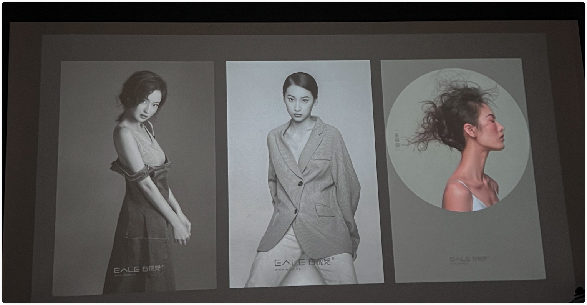
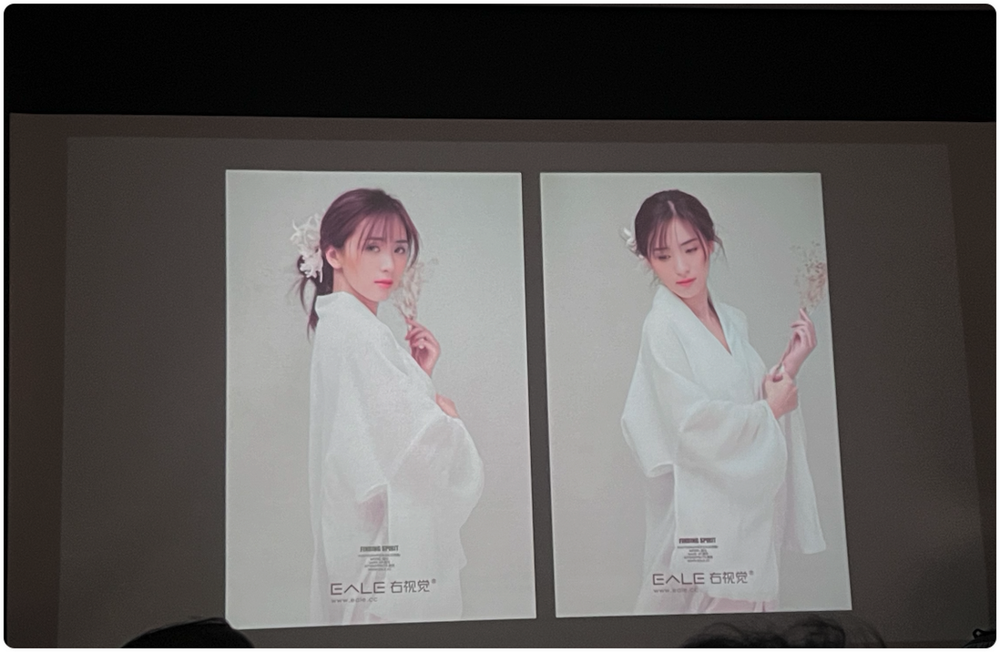
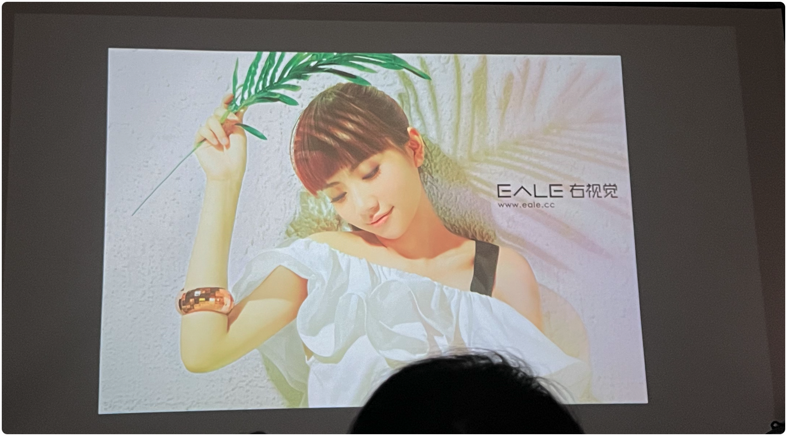
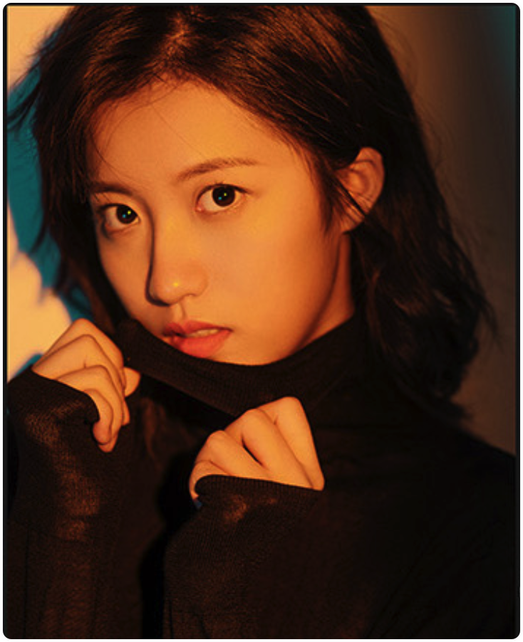

# 第四、五讲：右视觉灯光经典案例

> - ▲ 答疑
> - ▲ 上节课回顾
> - ▲ 深入点评上节课的作业，找到问题并解决问题
> - ▲ 影棚是个大魔术箱，能出来任何你想要的效果
> - ▲ 右视觉十余个经典作品的灯光解析：
> - ▲ 从整体解析，从每一处的细节解析，无任何死角式的分享
> - ▲ 明星见组和宣传大片的拍摄要点
> - ▲ 欧美大片的拍摄要点
> - ▲ 日韩风大片的拍摄要点
> - ▲ 视觉大片的拍摄要点
> - ▲ 工笔人像复古大片的拍摄要点
> - ▲ 让光随着你的感情走
> - ▲ 再次关注打灯中的几个要点，用灯光核心去创造更多的可能
> - ▲ 一些特定和特殊的灯光
> - ▲ （幻灯、特殊附件、特殊光源等）
> - ▲ 原来灯光可以这么玩！
> - ▲ 一个难度系数极高的人像灯光现场实操
> - ▲ 2023 年新增大量 LED 常亮灯拍摄案例
> - ▲ 答疑
> - ▲ 三个经典案例灯光作业

## ▲ 影棚是个大魔术箱，能出来任何你想要的效果。

反推灯光，不能通过反推的地方：
- 眼神光
- 人在背景上的影子（最多当个辅助)

反推灯光，可以通过反推的地方：
- 鼻子（不够精准）
- 脖子区域 （下巴在脖子上的影子，轮廓比鼻子的影子柔和一些），鼻子的影子比较实下巴的影子比较柔，灯离的比较近，

### 案例 3 
下图为小号的柔光伞拍摄，柔光伞是弹性最大的附件，xxxxxxxxxx, 两把小伞再结合距离，有个很大的优点，

上图中：面部两次暗，是因为人两侧加了吸光板。

柔光伞：不太好控制范围，但是优势也是范围。

### 案例 5

大光圈 + 造型灯

### 案例 6

手拿树叶的女孩

主光：雷达罩 + 蜂巢

辐光：柔光箱，1.5m - 2.5m 之间，

主灯光在照片的左前方，距离很远，看鼻子和下巴的影子可以看出来是硬光，尤其是下巴的影子，从花的影子很大可以看出来主灯光的距离比较远，背景

## ▲ 右视觉十余个经典作品的灯光解析：

## ▲ 从整体解析，从每一处的细节解析，无任何死角式的分享

下午练习的时候，多练习一下灯光的远近，测试一下影子的实和虚

白色的光打在墙上，如果再给一个红/绿/蓝任何一个色值的颜色去和白色混合，那么墙还是白色。 原因是：白色的光可见范围更广，详细讲解见同目录： `了解光和颜色.md`

束光筒：灯比较远的话，人在墙上的影子比较小。

多 K 值拍摄

### 案例 XX

主光：~~长条柔光箱 + 格栅~~，标罩 + 前面左右两个遮光板（遮光板的放置见下图），这样实现条形光。标罩前 + 色片（黄色） + 格栅既可以实现条形光有色彩。

上图背景墙上也需要一个浅蓝色，实现方法如下图，一盏灯 + 标罩 + 蓝色色片 + 灯头朝顶部打灯。

上图的蓝色滤镜灯是用来控制背景墙的浅蓝色色值的，如果希望背景墙的浅蓝色色值再弱一些，还可以在当前灯的附近在家一盏往顶部打的标罩灯，提高亮度之后，浅蓝色色值会更弱，原因也是很明显，因为白色色值的可见光波长比单独红绿蓝一个色值的更广。

## ▲ 作业

每个人拍两个棚内组合灯光作品
