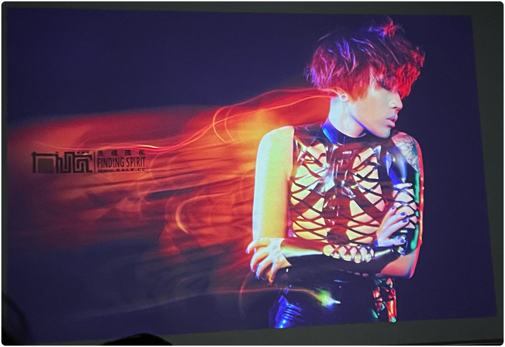

# 第四、五讲：右视觉灯光经典案例

> - ▲ 答疑
> - ▲ 上节课回顾
> - ▲ 深入点评上节课的作业，找到问题并解决问题
> - ▲ 影棚是个大魔术箱，能出来任何你想要的效果
> - ▲ 右视觉十余个经典作品的灯光解析：
> - ▲ 从整体解析，从每一处的细节解析，无任何死角式的分享
> - ▲ 明星见组和宣传大片的拍摄要点
> - ▲ 欧美大片的拍摄要点
> - ▲ 日韩风大片的拍摄要点
> - ▲ 视觉大片的拍摄要点
> - ▲ 工笔人像复古大片的拍摄要点
> - ▲ 让光随着你的感情走
> - ▲ 再次关注打灯中的几个要点，用灯光核心去创造更多的可能
> - ▲ 一些特定和特殊的灯光
> - ▲ （幻灯、特殊附件、特殊光源等）
> - ▲ 原来灯光可以这么玩！
> - ▲ 一个难度系数极高的人像灯光现场实操
> - ▲ 2023 年新增大量 LED 常亮灯拍摄案例
> - ▲ 答疑
> - ▲ 三个经典案例灯光作业

## ▲ 影棚是个大魔术箱，能出来任何你想要的效果。

反推灯光，不能通过反推的地方：
- 眼神光
- 人在背景上的影子（最多当个辅助)

反推灯光，可以通过反推的地方：
- 鼻子（不够精准）
- 脖子区域 （下巴在脖子上的影子，轮廓比鼻子的影子柔和一些），鼻子的影子比较实下巴的影子比较柔，灯离的比较近，

### 案例 3 
下图为小号的柔光伞拍摄，柔光伞是弹性最大的附件，柔光伞产生光的范围很大，买小一点的柔光伞，不然光线的范围太广，如果一把柔光伞的范围太小，那就两把小伞组合，再结合距离，有个很大的优点。

上图中：面部两次暗，是因为人两侧加了吸光板。

柔光伞：不太好控制范围，但是优势也是范围。

### 案例 5

大光圈 + 造型灯

### 案例 6

手拿树叶的女孩

主光：雷达罩 + 蜂巢

辐光：柔光箱，1.5m - 2.5m 之间，

主灯光在照片的左前方，距离很远，看鼻子和下巴的影子可以看出来是硬光，尤其是下巴的影子，从花的影子很大可以看出来主灯光的距离比较远，背景

## ▲ 右视觉十余个经典作品的灯光解析：

## ▲ 从整体解析，从每一处的细节解析，无任何死角式的分享

下午练习的时候，多练习一下灯光的远近，测试一下影子的实和虚

白色的光打在墙上，如果再给一个红/绿/蓝任何一个色值的颜色去和白色混合，那么墙还是白色。 原因是：白色的光可见范围更广，详细讲解见同目录： `了解光和颜色.md`

束光筒：灯比较远的话，人在墙上的影子比较小。

多 K 值拍摄

### 案例 XX

主光：~~长条柔光箱 + 格栅~~，标罩 + 前面左右两个遮光板（遮光板的放置见下图），这样实现条形光。标罩前 + 色片（黄色） + 格栅既可以实现条形光有色彩。

上图背景墙上也需要一个浅蓝色，实现方法如下图，一盏灯 + 标罩 + 蓝色色片 + 灯头朝顶部打灯。

上图的蓝色滤镜灯是用来控制背景墙的浅蓝色色值的，如果希望背景墙的浅蓝色色值再弱一些，还可以在当前灯的附近在家一盏往顶部打的标罩灯，提高亮度之后，浅蓝色色值会更弱，原因也是很明显，因为白色色值的可见光波长比单独红绿蓝一个色值的更广。

## ▲ 作业

每个人拍两个棚内组合灯光作品

# 2023.10.12

长方形柔光箱比长条柔光箱打出来的光更柔

附件：点光源（指附件加了镜片，通过镜片聚光之后出来的光源）

## 案例 1

示例图：

打光顺序：
1. 先打侧逆红色，把基调打出来，雷达罩+蜂巢
2. 青色雷达罩+青色色调，朝左侧墙上打，利用漫反把背景墙上色
3. 主灯：雷达罩+蜂巢，15°，提高，把人的正面补光

## 案例 2

1. 闪光灯的 power 值不能太低，建议给到 1/2 
2. 环境光负责对焦, 造型灯(负责流光的形成？)
3。 
4. 服装建议能产生高光的

怎么把流光拍的更高看？
1. 流光不能太单薄，变化更多一点，移动相机的时候可以灵活一点，人也可以动起来。
2. 人不能糊，一般是流光在人的身上，正确的方法是移动的时候更稳定一些，匀速一些
3. 流光在相机运动的反方向上。（Q:所以散光灯应该是 后帘同步？？？)

## 案例 3 - 频闪图

频闪：在同一个安全快门之内有多次闪光

拍摄：建议背景使用吸光布，相机动起来，不要把拍摄的重叠起来

## 联系性的眼光 - 让灯光变得更整体一些

注意：
1. 光的范围
2. 夹板光里的更远一些

## 艺人见组宣传

## 服装
分四个类型：
1. 广告
2. 画册：对服装的款式、颜色、面料、质感要求很高
3. 产品类的拍摄（不建议拍摄：原因：一、挂拍摆拍会花很多时间，对拍摄的要求更不高；二、灯光很多在室内都已经布置了，打灯很少；当然这些都是对于一般的拍摄）
4. 网拍

附件建议：小号的柔光伞和小号的反光伞

## 广告

## 日韩风拍摄
写真

特点：用光偏自然；对比比较小一些；

## 欧美风
杂志推荐：
- 《vogue》意大利版：https://www.vogue.com/
- https://www.numero.com/en

## 复古和工笔人像
需要很多更长时间的积累在里面，推荐去看美术史，不建议自己画背景

## 一些特殊的灯光

投影
- 刷新率：相机的快门超过投影的刷新率的话，拍出来的照片每张都会不一样，
- 投影因为打出来画面，画面打到人的身上会把照片变的特别平，所以投影尽量找下角度。

束光筒/聚光筒：添加组件；最硬的光，衰减速度最快。(建议长亮灯??)。

## 妆面 beauty

护肤类产品：把皮肤拍的更好看，细节：光的方向性弱一些，对比度小一些

眼神光：距离更大眼神光越小，距离越近眼神光更大（比如柔光伞）

## 彩妆和珠宝类产品
硬光拍摄

## 指向性用光
和范围控制直接挂钩

通过点光源进行塑造

## 创意用光
光绘：通过光纤灯

## 常亮灯
所以可持续的光都可以称为常亮灯

电影棚 10 - 12 米

摄影棚

常亮灯：
- 红头灯：便宜，但是受限
- 石英灯：理解为造型灯的加强版本，在冬天的时候更好用，购率高
- 假电影灯：不好用
- LED 灯：国内有 2 个品牌（xx 和 南光），已经做的很好，K 值和功率、控制力都很好；功率不高但是亮度很高。

### 闪灯和常亮灯的区别：
1. 闪灯有更快的光速； 常亮灯没有光速
2. 闪灯有更高的功率（讲外景会说到，可以压低太阳光亮度）； 常亮灯功率受限
3. 闪灯有更精准的色温； 常亮灯色温有限制
4. 闪灯不是所见即所得； 常亮灯所见即所得
5. 闪灯对视频不友好； 常亮灯对视频友好
6. 闪灯相对更安全； 常亮灯（LED）更要注意安全

### 案例
主光：闪灯（附件） + 色片，漫反

脸部：是个手电灯

### 案例
右案例：主灯可以看出略，脸部的光斑为手电照射到鱼缸上反射的

左案例：没听到

## ▲ 作业

没人拍两个棚内组合灯光作品

