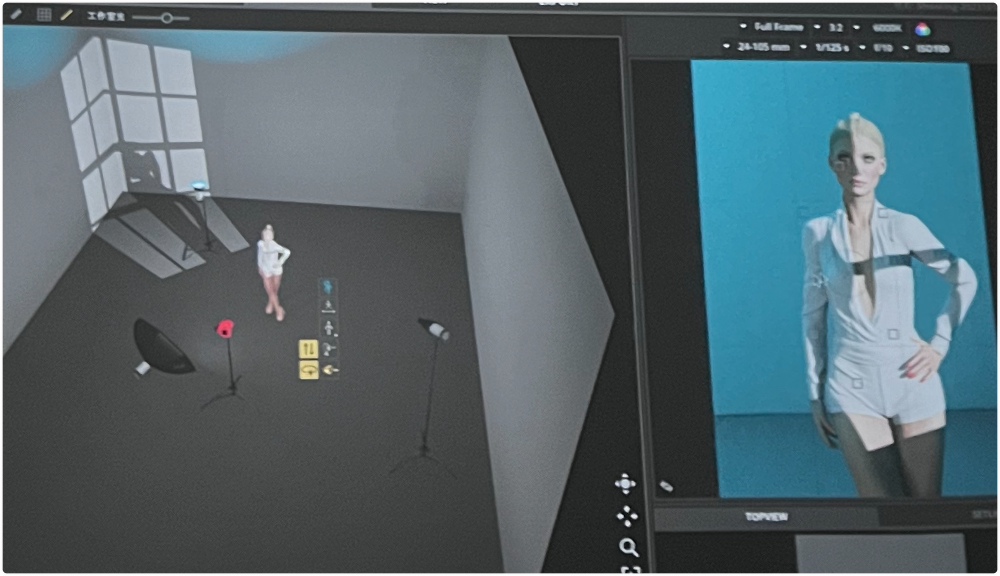

# 第六讲：摄影之路和摄影创意

## 上节课回顾

控制力，灯光无偶然

频闪

闪灯造型灯也关上，

频闪

点光源：四周按下去，

照片的光整体暗的时候，基本上不会拿地灯来补光，这样可能会补出来一个小鬼光

黑白人像 或 拍黑色背景的照片：背景一般不用黑色吸光板，因为太黑容易把人和背景融到一体，建议拉开距离。

漫反：如果漫反有色片，如何把人身上的漫反少一些？如下图：补光灯应该在人后，补光灯的角度也是朝后上，这样漫反到人身上的色值就会减少。

答疑

上节课回顾

深入点评上节课的作业，找到问题并解决问题。

## 结合秘老师的摄影经历帮您解决摄影发展中的遇到的瓶颈和产生飞跃式进步的原因和技巧

摄影三阶段：摄影爱好者、业余摄影师、职业摄影师

妆面是拍出来的

了解国画：国画很棒

## 作业
结合自己的经历和性格拍一组创意主题片

-------------------

摄影爱好者时期的作品和感悟

（热爱眼光 和美术的结合 和油画的结合）

业余摄影师时期的作品和感悟

（几个广告软宣的创意和拍摄要点

摄影的坚持和原则

关于私房人像的拍摄

摄影包装的看法）

在摄影初期如何来宣传自己

职业摄影师时期的作品和感悟

一个广告拍摄带来的转变

好习惯和创意成就第一个艺人的拍摄

一个失败的广告拍摄带来的思考

摄影中的不同态度带来的不同收获

关于西方绘画和中国绘画风格的拍摄技巧和带来的思考

把你的人生感悟和想法用在拍摄中

带着激情去拍摄

如何来运作自己的工作室

如何把摄影当做职业并且如何去发展好

关于摄影师的风格，如何形成自己的摄影风格

结合自己的经历和性格拍一组创意主题片

授课老师：秘老师

秘老师结合十五年的摄影经历，大量的商业，个人，艺人拍摄经历，分享每个有收获的节点，怎么去越过一个个平台期，甚至还有失败的案例，直接让学生少走许多弯路，避免付出代价式的成长；结合大量的案例分享摄影中的思路和创意，所有的技巧都是为内容去服务的，有方向和主题，技巧才可以更完善更快速成长。
