## 第十二讲：后期流程及光影修图

后期是让自己的作品加分的，是让拍摄变得更加完善的，好多人不善后期让自己的拍摄大打折扣，是非常可惜的事情，即使以后有完整的团队，摄影是导演的决策，如果给不到后期部分精准的方向和修改的细节，那也谈不上任何后期的控制力，更何况后期还可以很好的反推前期看，让自己的前期拍摄的更加有效，让项目变得更加高效。不管从哪一点，摄影师的后期都要变得很强悍才是。

### PS 工具栏快捷键

好的，以下是Photoshop工具栏中一些常见工具的英文名称和它们的快捷键；此快捷键顺序根据下图的摄影工作区来书写的。

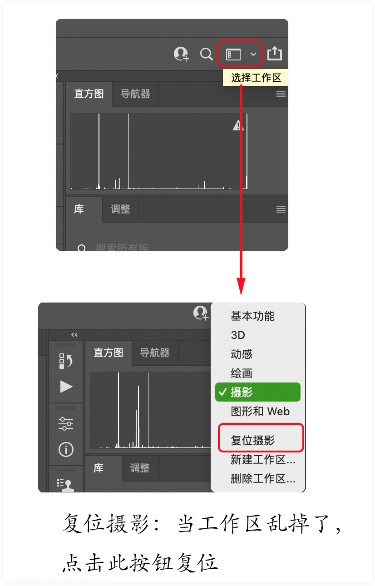

| 工具                           | 快捷键  | 英文名称           |
| ------------------------------ | ------- | ------------------ |
| 移动工具 / 画板工具    | V       | Move Tool          |
| 选框工具 / 椭圆选框工具 | M       | Marquee Tool       |
| 套索工具 / 多边形套索工具 / 磁性套索工具 | L       | Lasso Tool         |
| 对象选择工具 / 快速选择工具 / 魔术棒工具 | W       | Magic Wand Tool    |
| 裁剪工具 / 透视裁剪工具 | C |  |
| 吸管工具 / 颜色取样器工具                                    | I       |                          |
| 污点修复画笔工具 / 移除工具 / 修复画笔工具 / 修补工具 / 内容识别移动工具 | J |  |
| 画笔工具 / 铅笔工具 | B | Brush Tool / Pencil Tool |
| 仿制图章工具 / 图案图章工具 | S |  |
| 历史记录画笔工具 / 历史记录艺术画笔工具 | Y |  |
| 橡皮擦工具 / 背景橡皮擦工具 / 魔术橡皮擦工具 | E |  |
|  |  |  |
|  |  |  |
|                                                              |         |                          |
| 铅笔工具                   | N       | Pencil Tool        |
| 橡皮擦工具                 | E       | Eraser Tool        |
| 文本工具                   | T       | Text Tool          |
| 眼球工具                   | I       | Eyedropper Tool    |
| 取样工具                   | Alt + I | Color Sampler Tool |
| 裁剪工具                   | C       | Crop Tool          |
| 钢笔工具                   | P       | Pen Tool           |
| 形状工具                   | U       | Shape Tool         |
| 渐变工具                   | G       | Gradient Tool      |
| 油漆桶工具                 | G       | Paint Bucket Tool  |
| 历史记录画笔工具            | Y       | History Brush Tool |
| 模糊工具                   | R       | Blur Tool          |
| 锐化工具                   | J       | Sharpen Tool       |
| 减淡工具/加深工具/海绵工具    | O       | Sponge Tool        |

希望这个表格对你有所帮助。如果你有其他问题或需要进一步的信息，请随时告诉我。

| 快捷键              | 工具                   |
| ------------------- | ---------------------- |
| D 键                | 前景色和背景色恢复黑白 |
| X 键                | 切换前景色和背景色     |
| Command + Shift + N | 新建图层快捷键         |
| H 键                | Camera Raw 的抓手工具  |

### 后期概述

### 为什么需要做后期

### 后期的原则和方向

### 使用原厂和第三方软件进行图片管理和选片
1、选片管理：Adobe Bridge, Capture one

2、解 RAW：Camera raw，Capture one

3、精修： Photoshop，Affinity Photo

4、辅助批量：ACDsee Pro， Macos 预览  

#### 电脑硬件相关知识

硬件相关：

- 数位板的选择，
- 让电脑速度更快

显示器及校色：

- 印刷广色域，
- 红蜘蛛和爱色丽，
- 新媒体的颜色，
- 如何让自己的片子不偏色
- 双显示器的优化

### RAW 的重要性

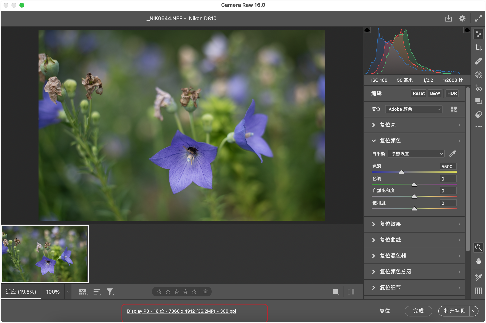

首先点击上图的色彩空间-文件大小(Display P3 - 16位 - 7430 x 4912...) 按钮，进入到设置窗口

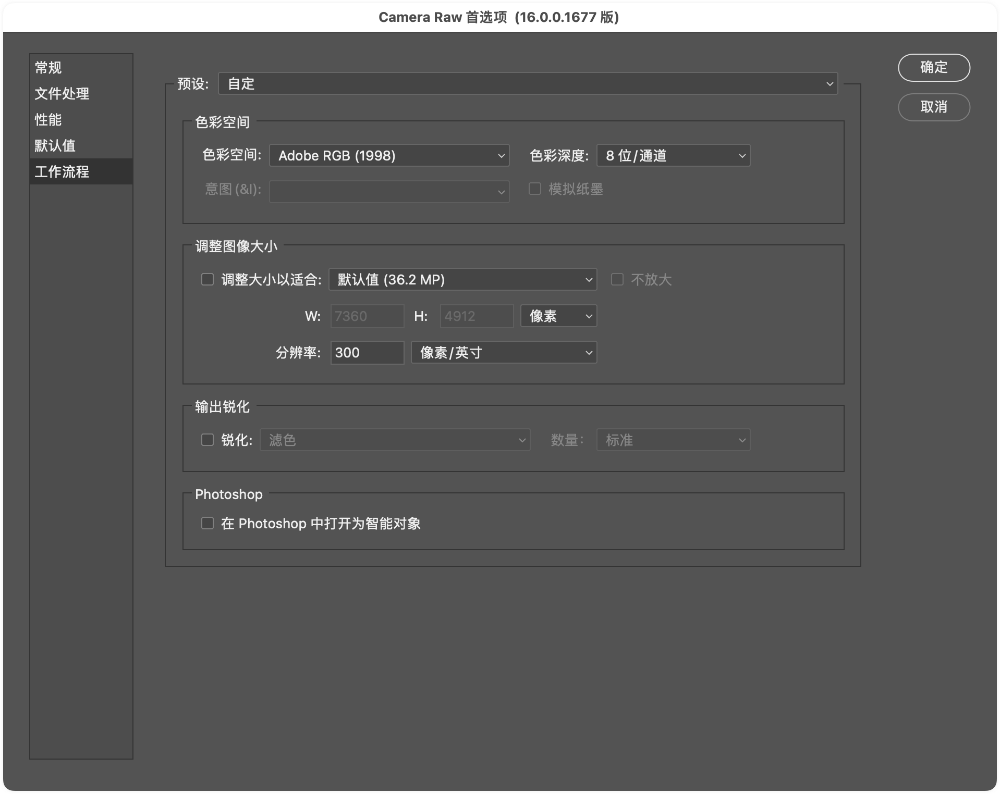

色彩空间：建议使用 Adobe RGB(1998)

色彩深度：8位（如果自己修图还是建议使用 16位）

### 解 RAW 的原厂和第三方的技巧及优劣

### 后期流程管理中的重要的一些概念

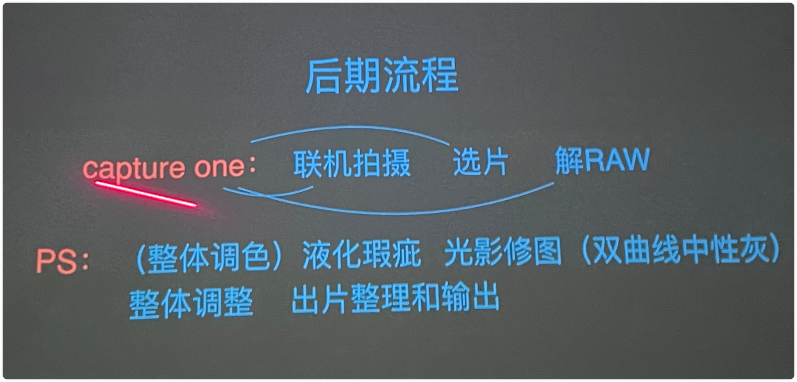

#### Capture one: 联机拍摄、选片、解 RAW

#### PhotoShop：（整体调色）、液化瑕疵、光影修图、（双曲线中性灰）、整体调整、出片整理和输出

### Capture One 使用讲解

### PS 的前世今生

### 解 RAW 格式的原则

Camera raw 界面调整建议：

- 肤色曝光值：RGB 210 左右。
- 调整 "曝光" 按钮的同时按住 Alt 键，可以辅助帮助显示欠曝和过曝。白色、黑色按钮同理。
- 原图和调整后的界面对比

#### 待做笔记：
在 camera raw 界面，把直方图和下面的：
- 曝光
- 对比度
- 高光
- 阴影
- 白色
- 黑色

几个选项关联起来

#### Capture One 解 RAW 更强

### 摄影的调子及曝光原则

### 后期流程和光影修图原理

### 光影修图的技巧及涉及到的曲线、蒙版、中性灰、柔光等

### 修图流程规范的建立

### 怎么快速掌握好中性灰和双曲线

#### 中性灰修图

camera raw 新建图层快捷键：command + shift + N

叠加模式改成柔光

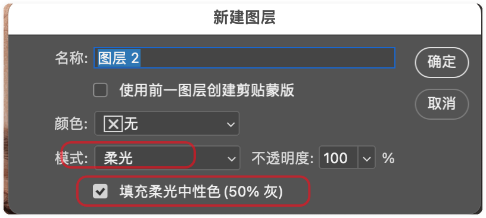

上图就是一个中性灰图层

##### 混合模式：

加光模式 -- 滤色：可以使第一层画面中的黑色完全消失，黑色以外的区域都可以使底层画面中的颜色整体变亮

减光模式 -- 正片叠底（相乘）：可以使第一层画面中的白色完全消失 ，白色以外的区域都可以使底画面中的颜色整体变暗

中性灰模式 -- 柔光模式：明度高于中性灰的就执行减光模式，明度低于中性灰的就执行加光模式。但这个需要使用画笔，再配合前景色和背景色来操作。具体操作：按 B 键选中画笔，把画笔的不透明度调整到 30% - 40%，如果明度高于中性灰的就把前景色设置为黑色，然后使用画笔来回滑动就会加黑画笔画的地方， 如果明度低于中性灰的就把前景色设置为白色，然后使用画笔画，把画的地方加白。
- 前景色为黑色：就是加黑
- 前景色为白色：就是加白

- 画笔：不透明度：30%

#### 双曲线

创建曲线蒙版，如下图，创建好之后按下 ctrl + i 可以把白色蒙版转为黑色。

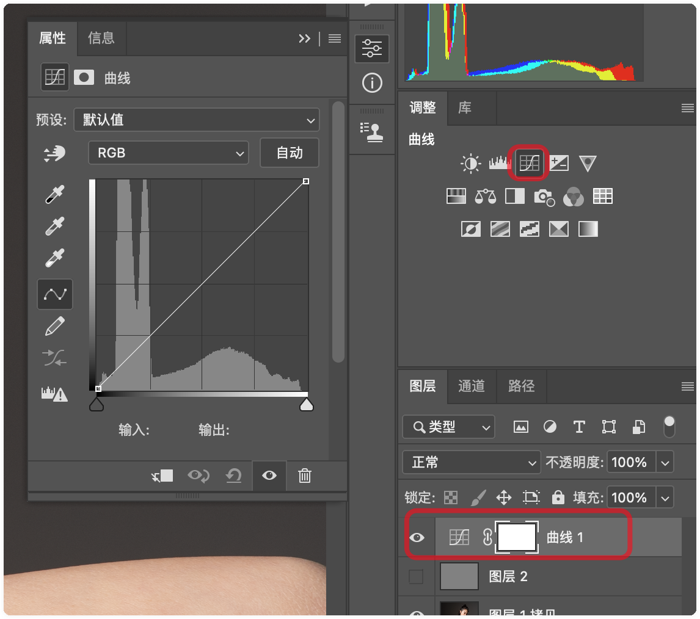

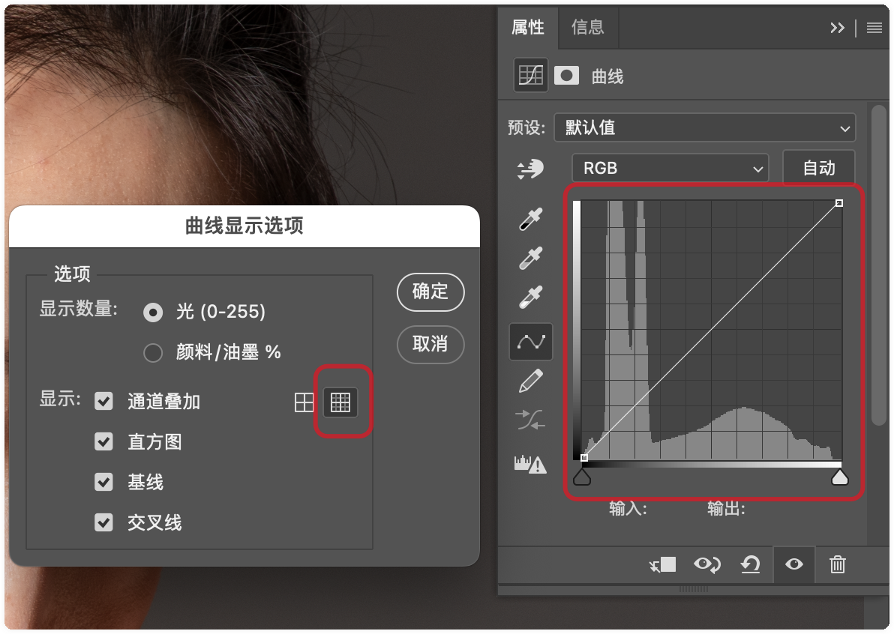

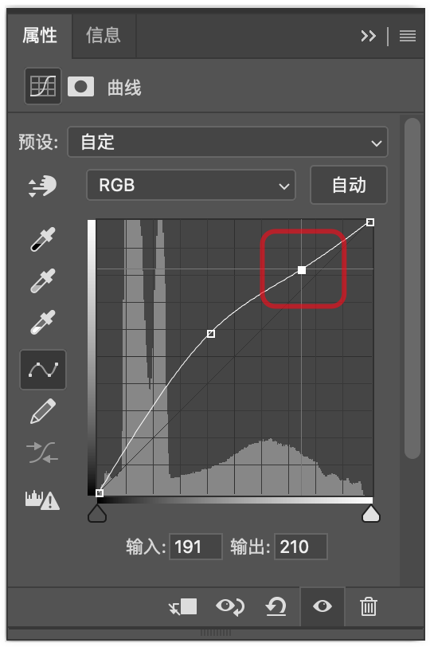

去除上图误添加的点，按下 command 点击这个点即可去除。

提亮：

压暗：

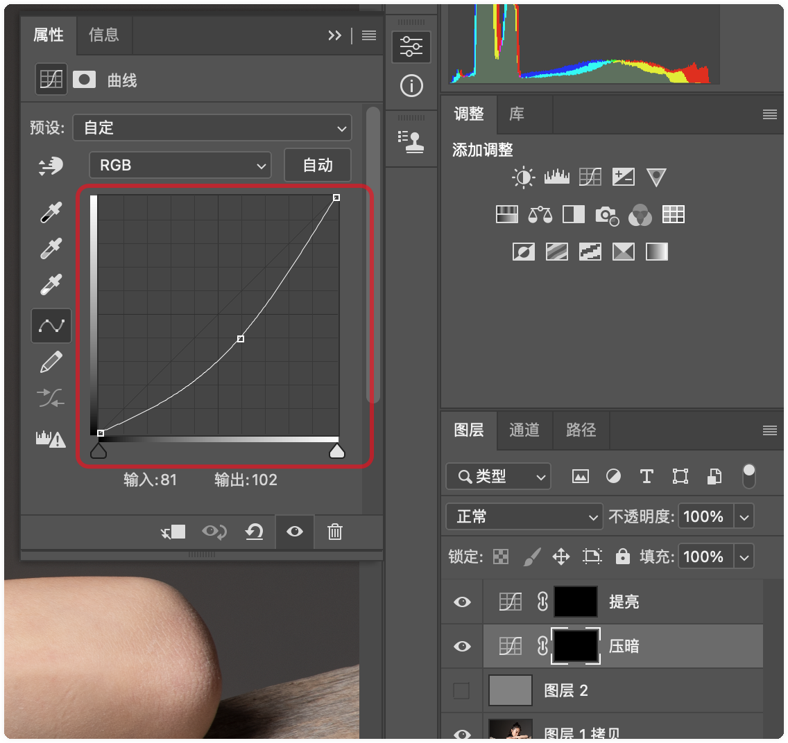

双曲线只负责整体的光影。

中性灰：负责修细节。

- 明度观察层（创建 2 个图层）：（1）明度曲线，(2) 渐变映射变成单色。

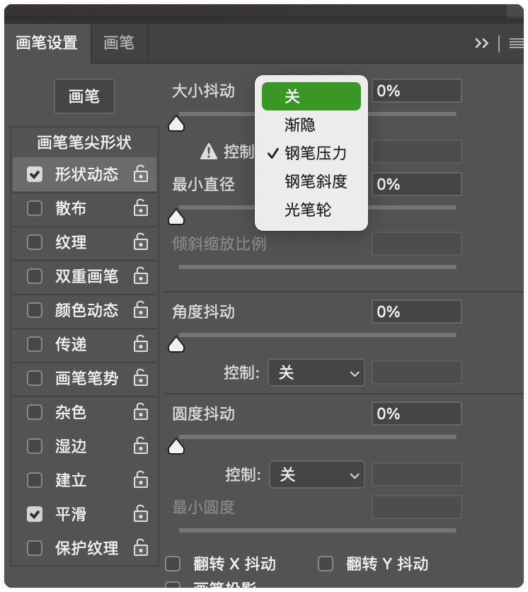

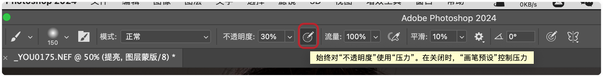

## 中性灰修图的所有步骤如下图：

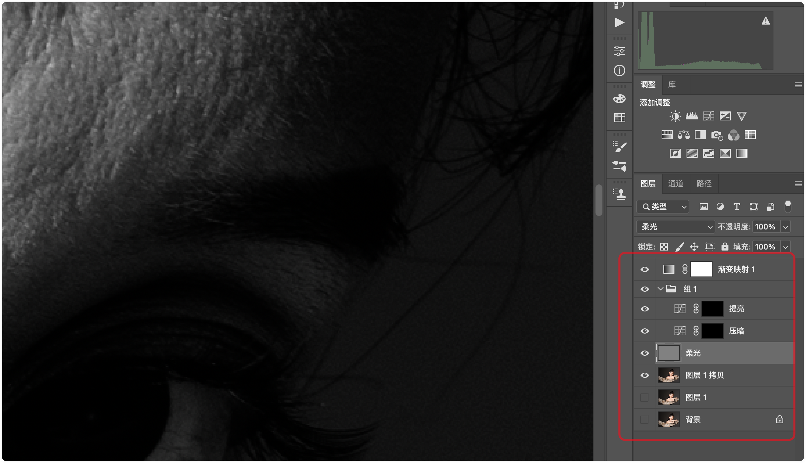

在中性灰修图中，提亮和压暗的双曲线应该是为柔光修图做准备的，添加渐变映射之后，图片会变成黑白色，调整提亮和压暗曲线中的任何一个都可以使图片的黑白对比度变的更大，这样柔光修图就会更方便。

注：上面这段话有问题，关于大局部的提亮和压暗式在双曲线中画的，只有小的局部的调整才在柔光层中的画。

### 笔感的形成

PS 插件：

- 像素蛋糕
- retouch

