## 第十三讲：后期精修及高效操作

对一个图层按住 Alt 键然后点击，当前文件的其余图层都会隐藏，便于图层间做对比1

画中性灰的时候一定要设定时间，比如刚开始 10 分钟，十分钟做不完就删除，重新

### 继续深入掌握好中性灰和双曲线

#### 创建动作 01 - 修图规范流程

动作：Alt + F9

新建动作：

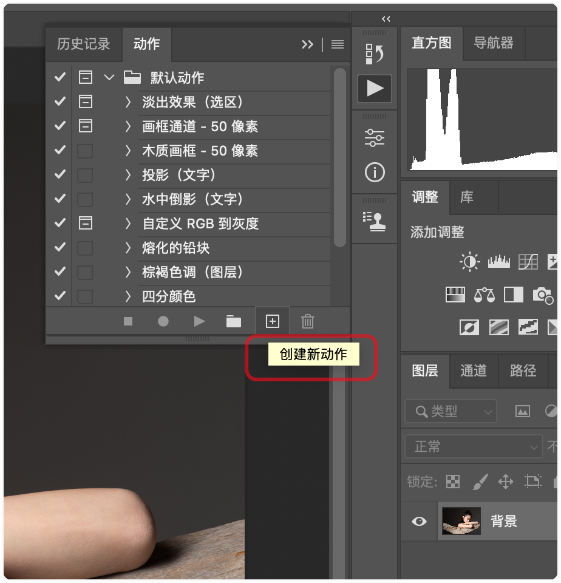

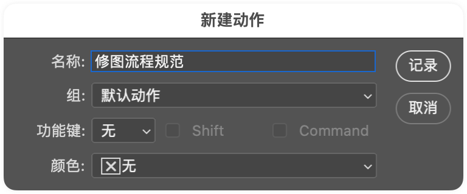

然后 command + J 拷贝图层，选中拷贝的图层，

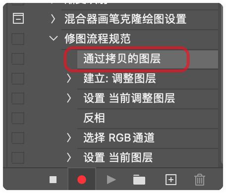

然后创建 提亮 和 压暗的双曲线， 使用 command + i 反向双曲线（图层蒙版，白显黑不显），

接着创建中性灰，渐变映射层，再创建一个双曲线，把他们合并到 "明度观察层" 中，完整的步骤如下图：（注：实际上这写步骤就是上节课的中性灰修图步骤）

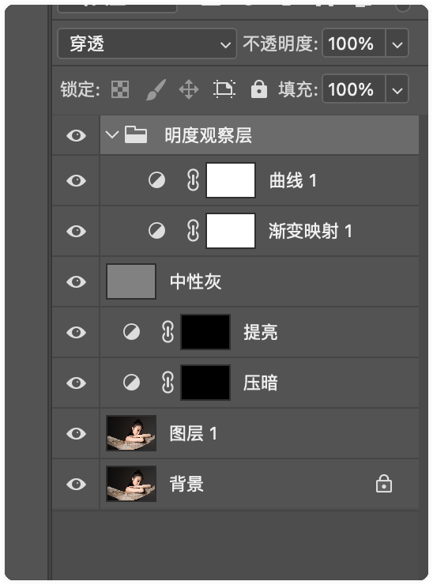

#### 创建动作 02 - 去高光

创建去高光的图层，设置图层样式(在去高光图层的右侧双击，即可显示图层样式)，

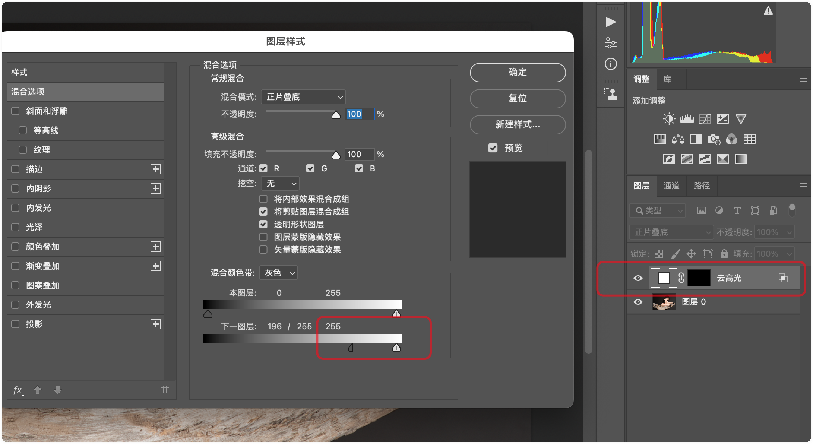

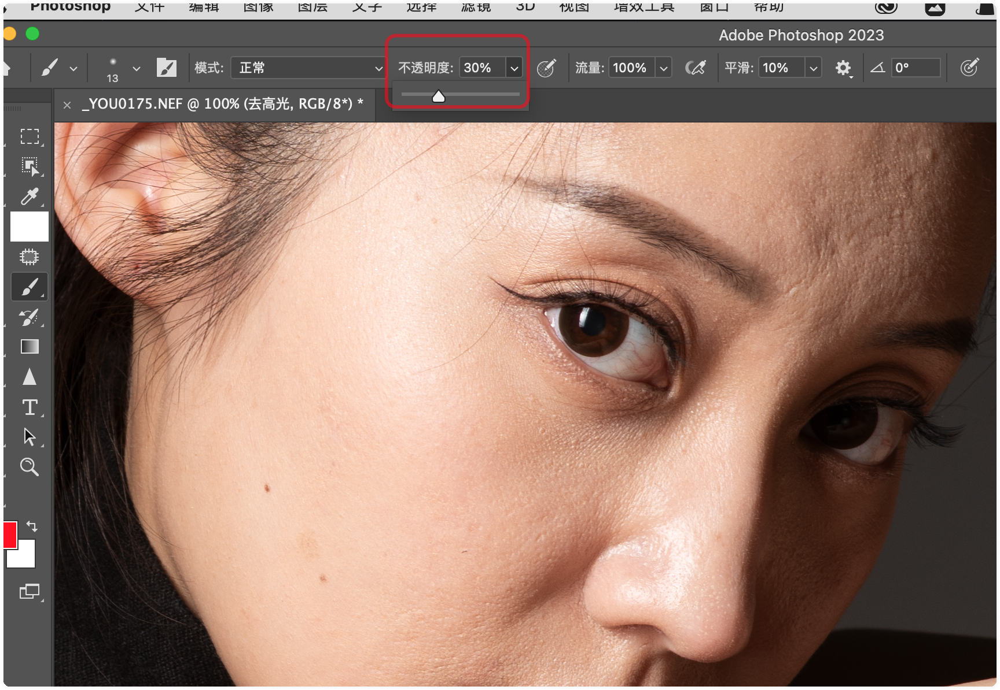

#### 高低频修图

1. 创建 高频、低频 2 个图层
2. 利用高斯模糊对 低频层 进行模糊，模糊半径的原则是以刚看不到皮肤的纹理细节为准，（模糊的越多，高频的计算越多）
3. 选择高频层，图像 -- 应用图像，

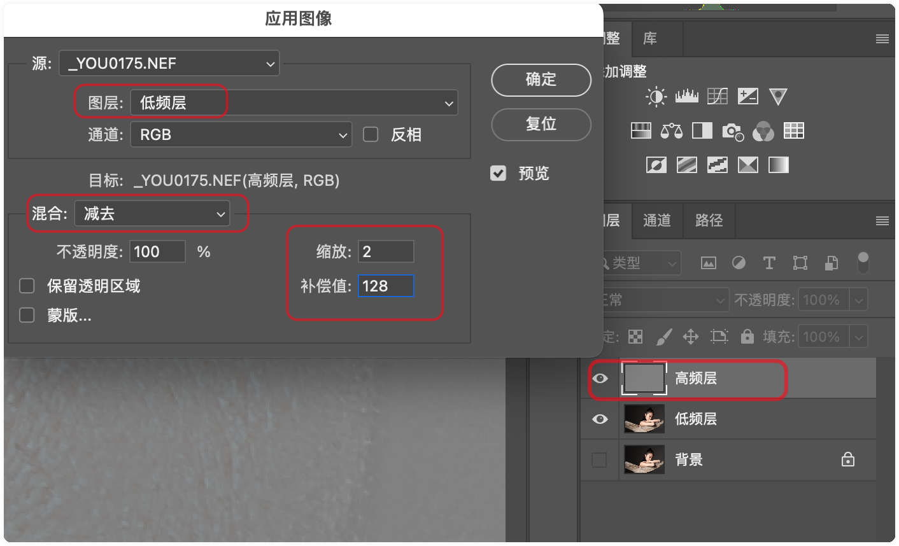

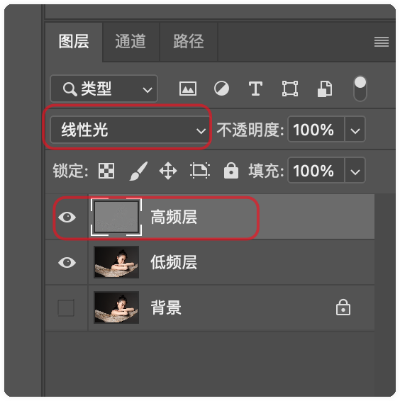

4. 选择低频层，如下图
5. 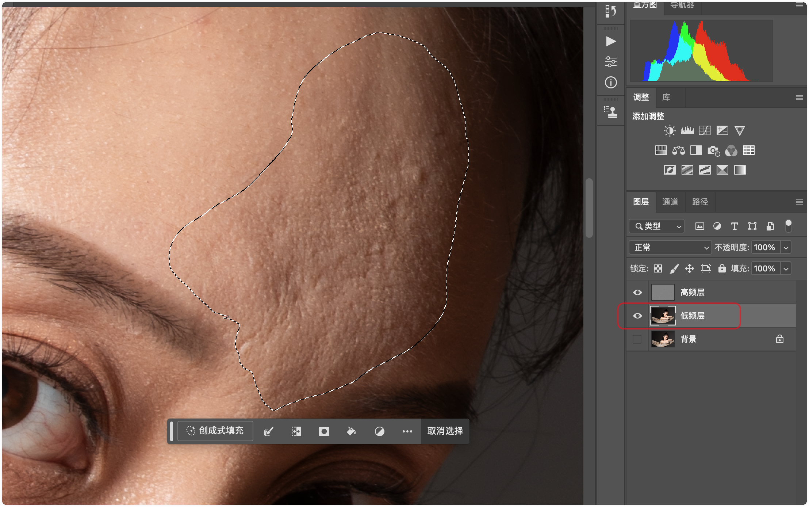
6. 设置羽化，下图的 9 太小，16 左右可以。

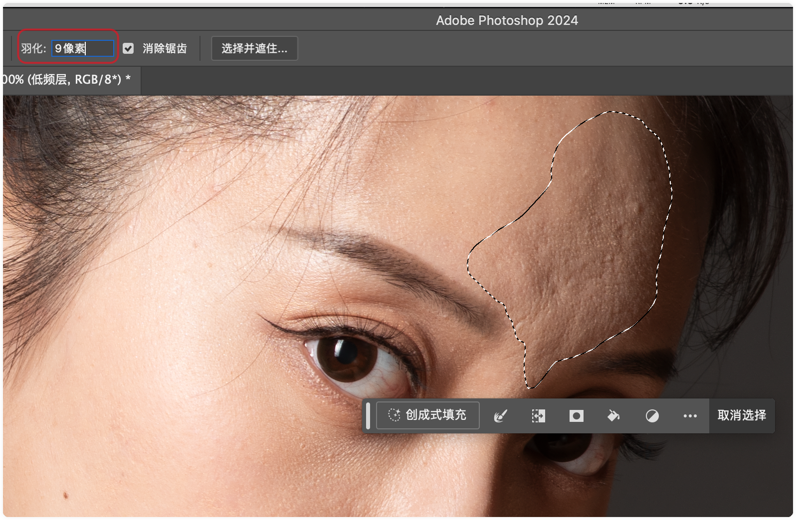

对低频层实行高斯模糊

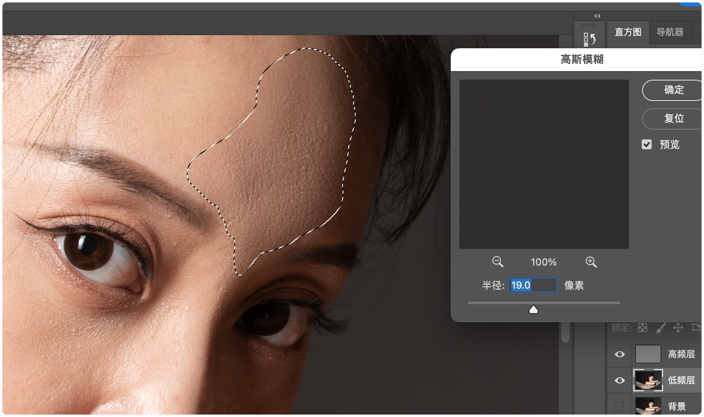

### 人物液化

### 人物骨骼、肌肉及比例

### 人物液化系列案例

### 人物五官的精修

### 高低频

### 皮肤快速磨皮

### 服装及背景的高效处理

### 快速去高光

### 磨皮插件的运用

### 精修中的系列技巧

### 授课老师：秘老师 
