# 第十三讲：后期精修及高效操作

<strong style="color:#dd5a2b;">重要提示：</strong>笔记不确保全部正确，若发现错误请自行改正，见谅。
  
Windows 系统请把下面快捷键的 Command 换成 Control.

==注：当前 PDF 含有目录，若用电脑请打开目录查看更方便==

对一个图层按住 Alt 键然后点击，当前文件的其余图层都会隐藏，便于图层间做对比

~~画中性灰的时候一定要设定时间，比如刚开始 10 分钟，十分钟做不完就删除，重新开始下个 10 分钟，慢慢画熟悉之后以后可能会在一两分钟时间就可以完成。~~

## 1. 创建动作 01 - 修图流程规范

(0) 准备图片如下图，打开时已经在 Camera Raw 中稍微调整了基本的曝光、对比度、高光、阴影、白色、黑色。

(1) 打开创建动作弹框：快捷键为 `Alt + F9`，或点击下图中的朝向右的三角图标按钮（动作按钮）。

(2) 点击 "创建新动作" 按钮，并给新动作命名，见下图：

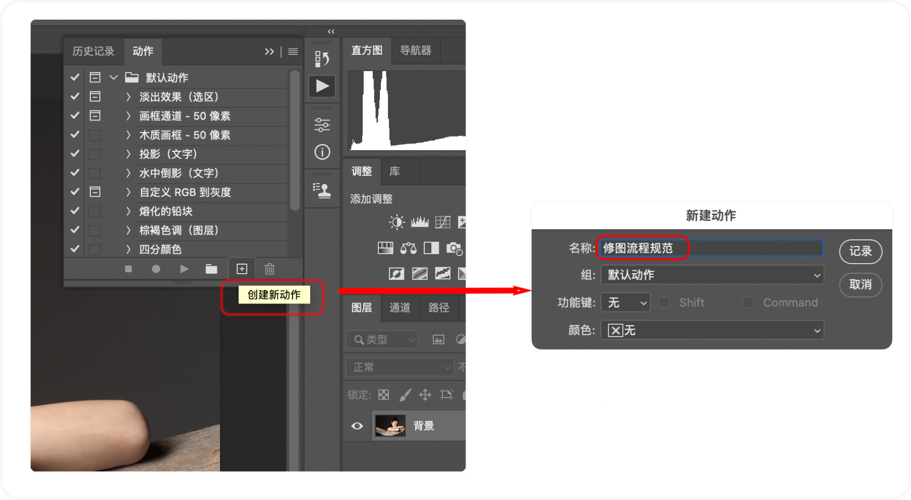

(3) 然后 `Command + J` 拷贝图层，并选中拷贝的图层，见下图：（注意：下图中的红色圆点图标即 "开始记录" 按钮，当前的意思就是动作创建的记录已经开启）。

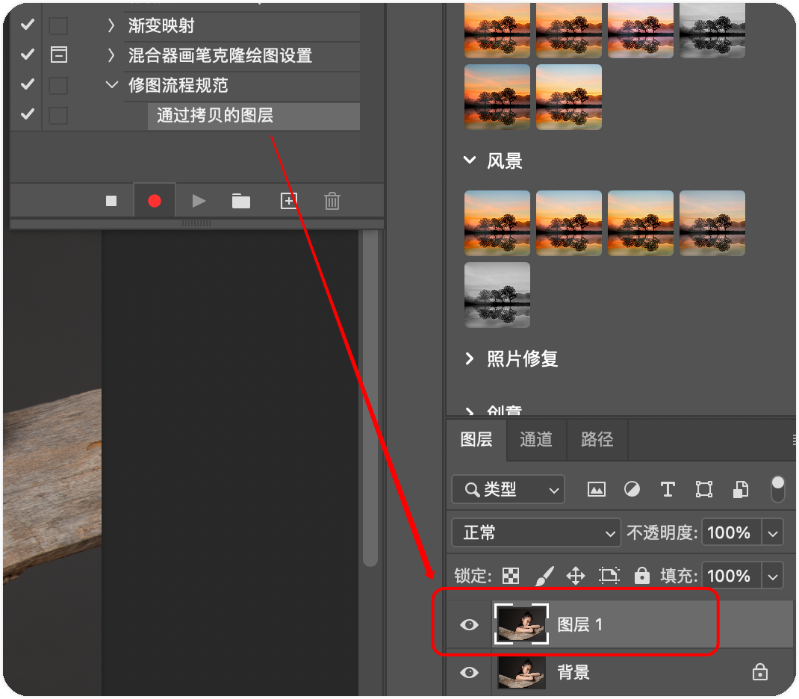

(4) 接着创建**提亮**和**压暗**的双曲线， 使用 `Command + I` 反向双曲线（图层蒙版：白显黑不显）。（注：详细的创建见 12 课的讲解。）

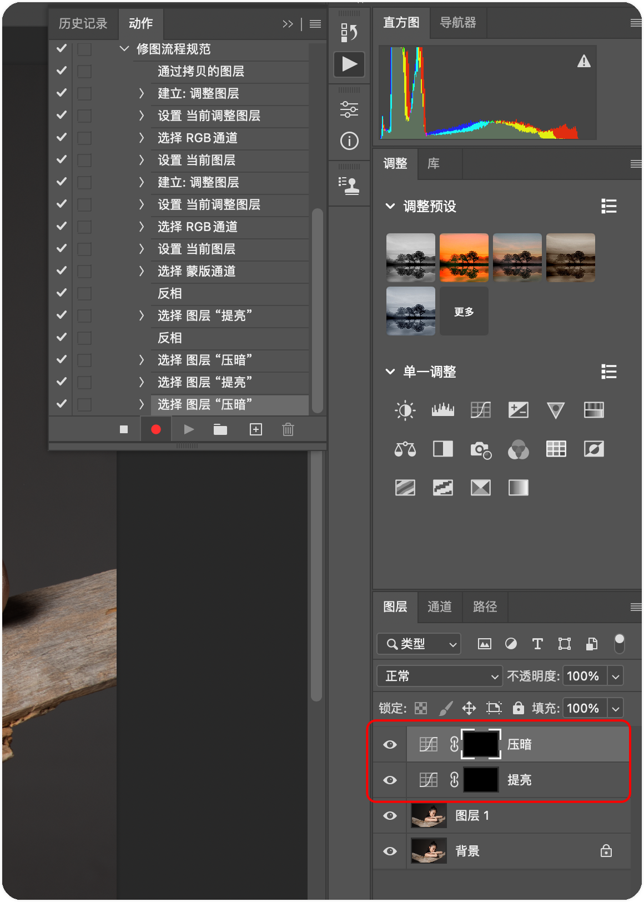

(5) 然后创建**中性灰图层、渐变映射图层、一个双曲线图层**，并把他们合并到自定义的 **"明度观察层"** 组中（注：选中 "双曲线1" 和 "渐变映射1" 之后，点击 `Command + G` 快捷键，可以快速合并到组。），完整的步骤如下图：（注：实际上这些步骤就是上节课的中性灰修图步骤，只是上节课中的 "中性灰" 图层名字叫 "柔光"。）

(6) 当前所有的步骤都创建完毕之后，点击下图的 "停止播放/记录" 按钮结束即可，此时一个完整的动作即创建完毕：

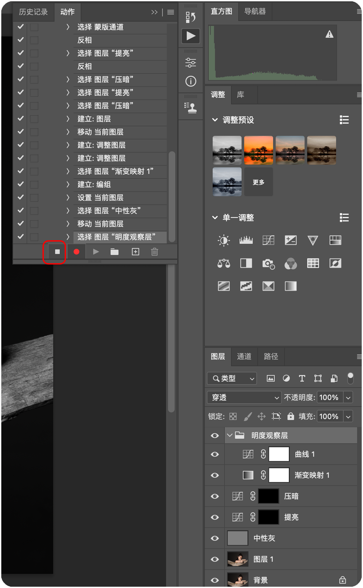

(7) 如何在新图片中使用 "修图流程规范" 动作？答：打开一张新图片之后，直接点击下图中的 "播放选定的动作" 按钮即可。

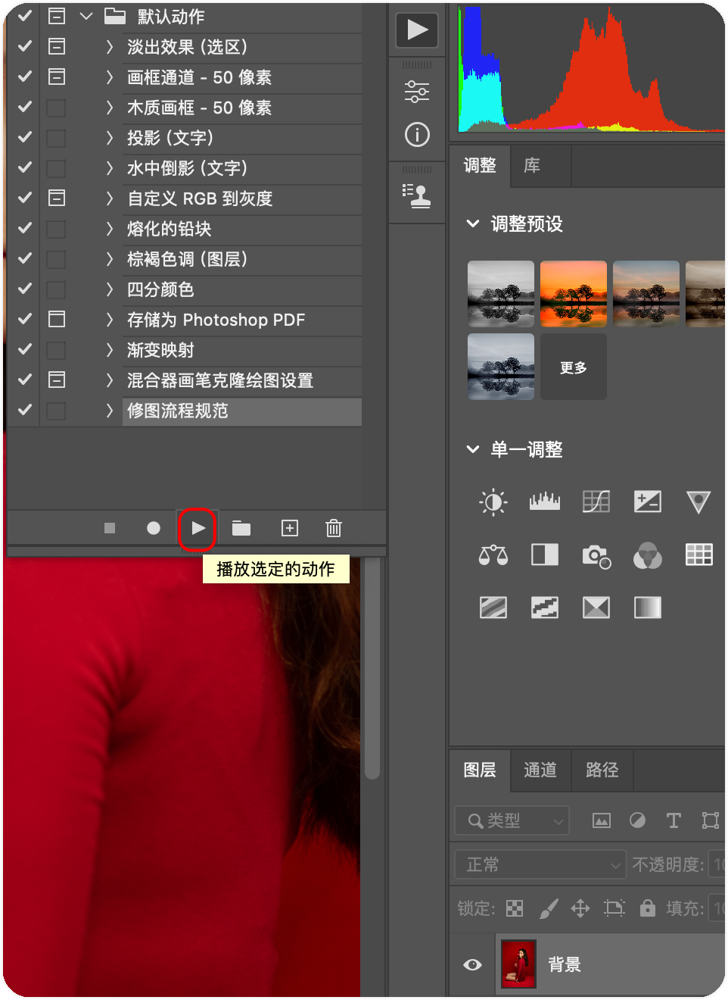

(8) 上一步中使用动作的方式需要点击几次，更快的使用动作的方式还有 2 种，下面分别介绍：

- 第一种见下图，直接设置成按钮模式，点击即可

     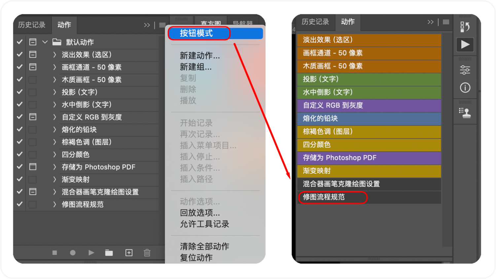

- 第二种更快速，给当前 "修图流程规范" 按钮创建快捷键，如下图：

​    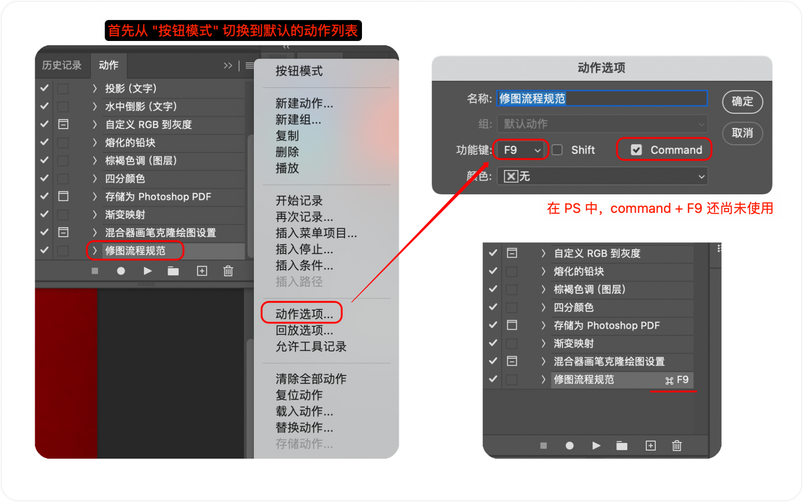

上面 2 种方式的选择取决个人习惯。

## 2. 创建动作 02 - 去高光

### 创建去高光动作

(0) 打开创建动作弹框：快捷键为 `Alt + F9`，或点击下图中的朝向右的三角图标按钮（动作按钮）。 创建新动作，并命名 "去高光"。

(1) 创建去高光的图层，创建步骤如下图：即首先创建一个纯白的填充图层，然后在给当前纯白图层添加黑色蒙版。(注：实际上直接点击 `[+]` 加号创建一个新的空白图层，然后添加一个黑色蒙版也可以，但是这样不能直接在白色图层上点击更换颜色，不如创建白色填充图层方便。为什么要点击更换颜色是因为下面我们要在人的脸部吸取颜色使用到。）

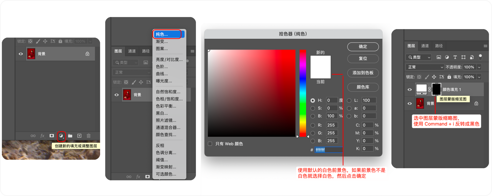

(2) 在 "去高光" 图层的右侧双击打开 "图层样式" 弹框：

- 混合模式：正片叠底（减光模式，因为我们是要去除下层的肤色高光）。见下图：

- 下一图层：首先把下图灰色的三角形移动到 200 左右，下图为 196，因为我们只想去除高光；接着按住 `Alt` 键，可把下图红框内的灰色三角形从中间分离，因为要去除高光，所以我们选择从 196 - 255 这部分色值，灰色三角形的右半部分被整个白色的三角形覆盖。 完整效果下图：

    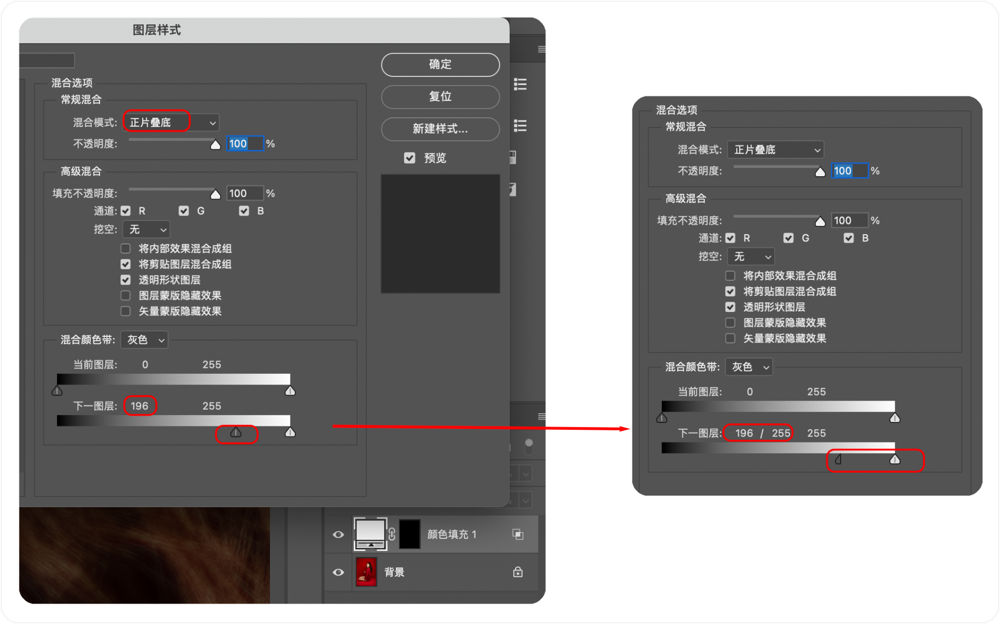

(3) 以上步骤执行完之后，点击 "停止播放/记录" 按钮结束动作创建。

### 使用去高光动作

(1) 吸取亮部周围的正常肤色为采样点，操作步骤见下图：双击 "白色调整图层"，在弹出的拾色器中吸取高光周围正常肤色，然后点击确定关闭拾色器。

(2) 选择画笔工具(快捷键 `B`)，然后按照下图把画笔的不透明度调整为 30% 左右，

(3) 然后选中 "黑色蒙版"，把前景色改成白色，使用画笔在照片高光处涂抹，直到高光去除即可，注意人的颧骨及鼻子轮廓等处的高光可以降低但是要保留，更要注意不要涂抹太多次，次数过多会把当前处所有的细节都抹平。（注：当前我们添加了一个 RGB 色值只有 1 ~ 196 的透明黑色蒙版，透明的也就是说当前图层对下层没有影响，接着把前景色改成白色，在黑色透明图层上涂抹，变白的地方即蒙版作用到下层图层上了，因为我们再白色填充图层上已经设置了 "正片叠底" 的减光模式，所以擦完之后即我们想要的效果。）

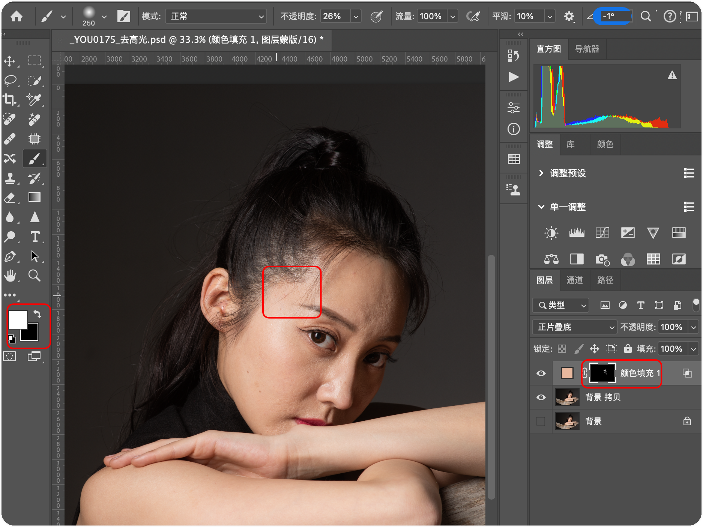

## 3. 高低频修图

(1) 把背景复制 2 份（`Command + J`），分别改名为： "高频层" 和 "低频层"。

(2) 利用高斯模糊对 "低频层" 进行模糊，模糊半径的原则是以刚好看不到皮肤的纹理细节为准。（注：模糊的越多，高频的计算就越多。reason? 后续补充。）

(3) 选择 "高频层"，点击顶部导航栏的 **图像** --> **应用图像**，弹框内的设置如下图：

(3) 然后把 "高频层" 的混合模式改为 "线性光"：（线性加深：是正片叠底和颜色加深的组合版本，在变暗的同时进一步提高颜色饱和度）

(4) 选择 "低频层" ，然后使用套索工具 (快捷键 `L`)，选中需要磨皮的区域 (少选按 `Shift` 接着选择添加区域，多选按 `Alt` 去除多选区域。） 

(5) 设置羽化半径，下图的 9 太小了，16 左右可以。(注：这个根据自己的修图效果来进行调整)

(6) 最后对低频层实行高斯模糊 (顶部导航栏：滤镜 -> 模糊 -> 高斯模糊)

##  4. 创建动作 03 - 高低频

(0) 我们先把当前图片复制一层，命名为 "图层HL"（注: 图层和 HL 之间无空格）；这一步很重要，因为 PS 的动作是根据文件的名称执行的，为了在后续执行动作的时候，不会出现当前图层和已有的图层重名，所以一定要改一个不容易重名的图层名称。

(1) 打开创建动作弹框（`Alt + F9`），创建新动作，并命名 "高低频Motion"。

(3) 把 "图层HL" 复制 2 份（`Command + J`），分别改名为： "高频" 和 "低频"。 

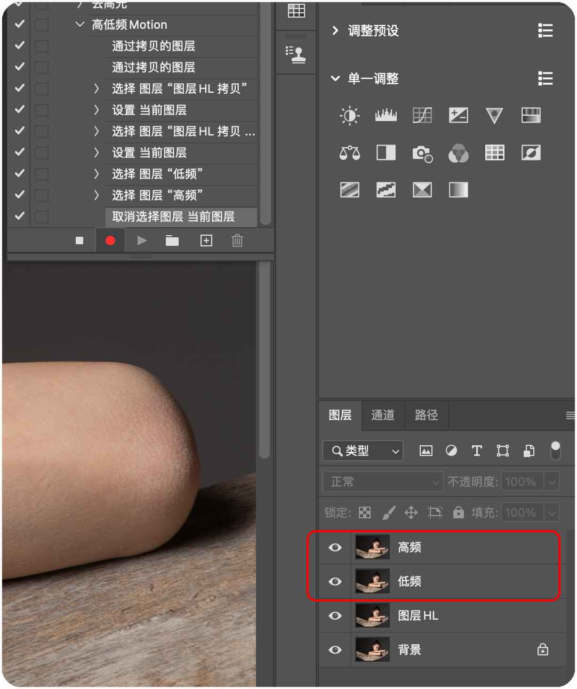

(4) 点击低频层，对其实行高斯模糊 (顶部导航栏：滤镜 -> 模糊 -> 高斯模糊)，设置模糊半径为 4px。

(5) 点击高频层，然后点击顶部导航栏的 **图像** --> **应用图像**，弹框内的设置如下图，完成之后点击确定。

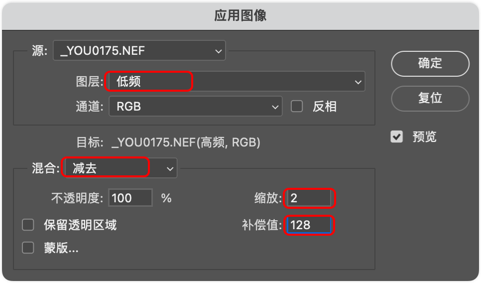

(6) 把 "高频" 图层的混合模式改为 "线性光"。

(7) 接着选中 "低频" 图层，然后点击 "停止播放/记录" 按钮结束动作创建。

(8) 如何在新文件中使用 "高低频" 动作？A：打开新文件之后，先拷贝一份图层，改名称为 "高低频HL"，接着点击动作弹框中的 "播放选定的动作" (上面有图)。

## 5. 更高效的高低频修图

(1) 先使用上面 **4. 创建动作 03 - 高低频** ，把高低频创建好

(2) 选中 "低频" 图层，给低频图层添加 "高斯模糊"，半径的设置规则是看皮肤的纹理，皮肤的纹理很好就是设置的标准，效果图如下，接着点击确定。

(3) 选中 "高频" 和 "低频" 图层，按下 `Command + G` 合并到一个新组中，改新组的名称为 "磨皮"，

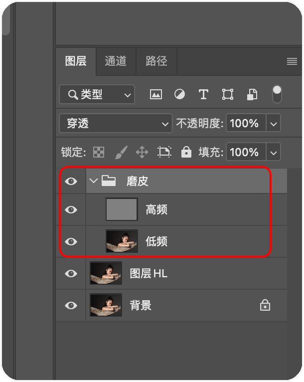

(4) 然后，选中 "磨皮" 组，按下 `Alt` 键的同时，点击 "图层蒙版"，创建一个黑色的图层蒙版，下图的最底部即为 "图层蒙版" 按钮。

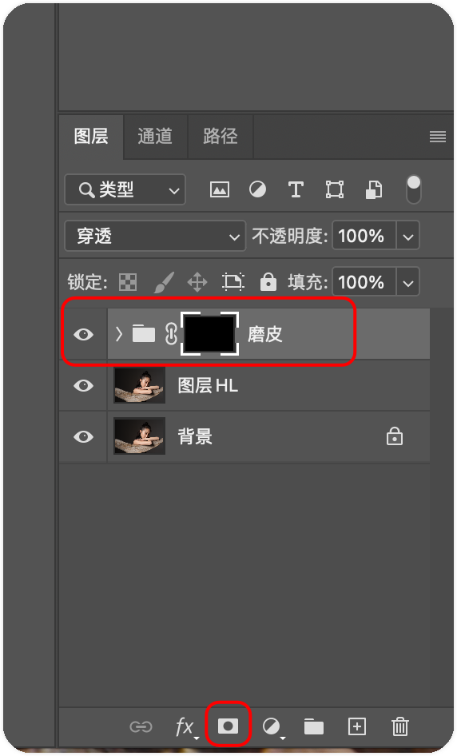

(5) 选中上图的 "黑色蒙版"，按 `B` 键选中画笔工具，然后设置 "不透明"：60% 左右，在黑色蒙版上画需要磨皮的地方即可。效果图如下： 

-------

- 继续深入掌握好中性灰和双曲线
- 人物液化
- 人物骨骼、肌肉及比例
- 人物液化系列案例
- 人物五官的精修
- 高低频
- 皮肤快速磨皮
- 服装及背景的高效处理
- 快速去高光
- 磨皮插件的运用
- 精修中的系列技巧

## 6. 液化

打开液化的快捷键：`Command + Shift + X`

四个用到的快捷键：**W、A、 F、 D**

- W： 手动液化
- A：人脸识别液化
- F：锁定按钮，冻结命令
- D：