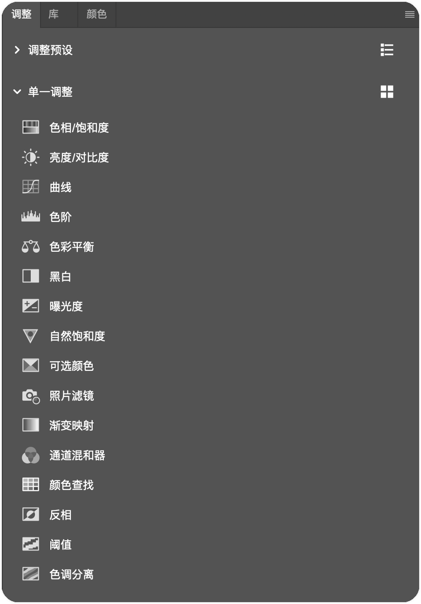

## 第十四讲：选择的艺术及黑白人像

### 上节课作业回顾

秘老师建议：不建议在高低频上画光影。

### 调色工具

##### 调整 - 单一调整

| 图标 | 名称        | 注释                    |
| ---- | ----------- | ----------------------- |
| 略   | 色相/饱和度 |                         |
|      | 亮度/对比度 |                         |
|      | 曲线        | 被称为 "调色之王"  |
|      | 色阶        | 其实就是直方图          |
|      | 色彩平衡    |                         |
|      | 黑白        |                         |
|      | 曝光度      |                         |
|      | 自然饱和度  |                         |
|      | 可选颜色    |                         |
|      | 照片滤镜    |                         |
|      | 渐变映射    |                         |
|      | 通道混和器  |                         |
|      | 颜色查找    |                         |
|      | 反相        |                         |
|      | 阈值        |                         |
|      | 色调分离    |                         |

- 后期的每一步都离不开选择
- 选择的各种技巧
- 合成案例分享
- 抠像的几种技巧
- 关于合成的综述
- 关系及颜色的匹配
- 背景和主题的关系处理
- 前后景的关系
- 合成的技巧分享
- 黑大大片的技巧
- 秘老师指导和点评
- 然后开始做毕业拍摄前的系列准备，毕业拍摄以高质量商业拍摄标准来走

 

## 第十五讲：三分钟快修、后期案例解析及后期输出
- 上节课回顾
- 点评上节课的作业
- 没有时间节奏的后期是不负责任的
- 后期系列快速修图技法
- 从管理到接 RAW
- 从动作到图层的优化
- 从导出 LUT 到案例的优化
- 完全可以三分钟出一张高质量后期
- 前期预留的后期完善
- 杂志艺人后期技巧
- 服装类后期技巧
- “废片”的后期  
- 视觉类图片后期技巧
- 后期出片锐化的一系列技巧
- 新媒体输出和印刷类输出的一系列注意事项
- 让你的后期为前期加分

 

