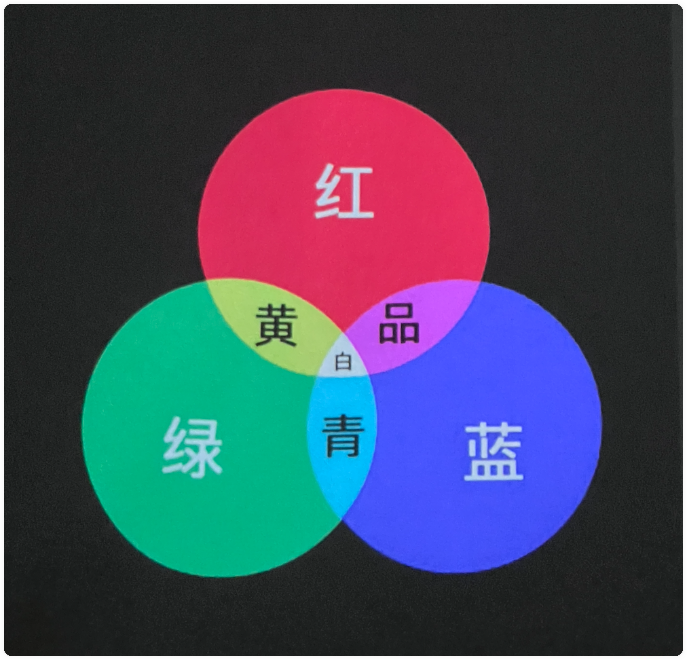

# 右视觉摄影机构 2022 年度摄影弟子班课程表

## 第一讲：摄影概述和光的本质

## 第二讲：单灯

## 第三讲：双灯和初步接触多灯

## 第四、五讲：右视觉灯光经典案例

## 第六讲：右视觉经典作品的背后及秘老师的摄影之路

-------------

## 第七、八讲：影棚布景（/置景）

置景是一个非常综合的话题，借机分享美术的三大构成，从地核打好基础，去主要的运用场景和道具。不管是从拍摄的角度还是被摄者的引导以及最终效果，置景都有很好的帮助作用。在这里，大家伙会充分感受到，影棚就是魔术箱，在里面可以出来任何想要的效果，这也是摄影的魅力所在之一。

### 答疑
### 上节课回顾
### 深入点评上节课的作业，找到问题并解决问题。

三大构成：
- 平面构成
- 色彩构成
- 立体构成

- 平面构成和摄影的结合（构图，道具，场景等）
点、线、面

照片里喷点水，水就会变成光斑

### 色彩构成和摄影的结合（颜色本身的引导性，颜色的关系等）

HSV：色调（H, Hue），饱和度（S,Saturation），明度（V, Value）。

HSL：色彩有三个基本的属性，“色相（Hue）、饱和度（Saturation）、亮度（Lightness）”，取首字母简称为hsl功能。

> （待做笔记）上图来源：https://zhuanlan.zhihu.com/p/140478770

| 色彩 | 色彩图 |                  抽象联想                  |
| :--: | :----: | :----------------------------------------: |
|  红  |        |  兴奋、热烈、激情、喜庆、高贵、紧张、奋进  |
|  橙  |        |  愉快、激情、活跃、热情、精神、活渡、甜美  |
|  黄  |        |  光明、希望、愉悦、阳和、明朗、动感、欢快  |
|  绿  |        |  舒适、和平、新鲜、青春、希望、安宁、温和  |
|  蓝  |        |  清爽、开朗、理智、沉静、深远、伤感、寂静  |
|  紫  |        |  高责、神秘、豪华、思念、悲哀、温柔、女性  |
|  白  |        |  洁净、明朗、清晰、透明、纯真、虚无、简洁  |
|  灰  |        | 沉着、平易、暖睐、内向、消极、失望、抑郁 |
|  黑  |        | 深沉、庄重、成熟、稳定、坚定、压抑、悲感 |

### 立体构成和摄影的结合（透视，消失点，主体突出等）

透视与立体构成

相机不同焦段的视角：

- 14mm 的视角为 114°
- 15mm 的视角为 114°
- 24mm 的视角为 84°
- 28mm 的视角为 75°
- 35mm 的视角为 63°
- 50mm 的视角为 46°
- 85mm 的视角为 28-30°
- 100mm 的视角为 24°
- 135mm 的视角为 18°
- 200mm 的视角为 12°
- 500mm 的视角为 5°
- 600mm 的视角为 4°10′

人眼视角：
- 人单眼的水平视角最大可达 156 度
- 双眼的水平视角最大可达 188 度
- 人两眼重合视域为 124 度
- 单眼舒适视域为 60 度

拍摄主次：
大小 饱和度 虚实、节奏、XX

### 背景和主题的关系（拿经典案例解析背景布、色纸、肌理布等简单背景的灯光和拍摄技巧）

#### 背景

**(1)** 背景纸：推荐只建议买浅色，比如浅红色、浅粉色、青色等等。明度低于 128 的话，所有的纸都会坑坑洼洼

背景纸和色片的区别：背景纸是可以通过颜色来打出来的，但是还为什么需要背景纸呢？第一如果人在地上坐着的时候，如果欠曝，地上打不上色，第二就是人和背景离的比较近的话。背景纸不建议用黄色、绿色。

**(2)** 无纺布：不建议买无纺布。

**(3)** 绒布：拍摄厚重的效果。比如拍摄深红色背景

**(4)** 油画布：拍复古、厚重的题材。下图示例：

拍摄建议：背景灯预留，即建议人和背景拉开距离，因为油画布背景吸光，油画布补光一般使用束光筒，补光的距离见下面示例。

使用最多的是墨绿色的油画布。

**(5)** 写真布：不建议买，但有些可以买，比如：水泥墙。

**(6)** 塑料布：灯光如果从两侧打的话，塑料布会有高光，

柔焦人像：在镜头前加柔焦镜；或者在 uv 镜上涂凡士林（四周厚越往中间越少）；后期也可以。丝袜、白纱都不建议用。

### 道具在拍摄中的应用（道具的作用和被摄者结合及引导性；案例解析点线面构成和道具使用的关系；各种创意道具比如树枝树叶，烟雾，水，面粉，服装的特点等就在你身边；道具和主题的关系等）

建议：在摄影当中建议多用道具，道具本身具有引导性，这样给拍摄者一个引导。

服装搭配是一件非常重要的事情。

从主题身上提取元素，这样道具不容易出错。

吹头发：不能对着人的眼睛来吹风，常规的位置是对着人的脖子吹；第二也不要对着一个地方吹，要摇着吹；

### 综合场景（数个右视觉经典案例的解析；创意点和场景的结合，大片原来是这么拍出来的；）

### 整体意识的重要性

### 各个关系的综合处理

### 2023 年新增当前最有市场的拍摄案例

### 三个练习作业

- 利用背景（背景纸、绒布、肌理布）拍摄一个主题
- 利用道具拍摄一个主题
- 任选一种综合置景拍摄一个主题

为接下来的模特实拍做准备

## 第九讲：和被摄者的交互 如何引导你的拍摄对象（含中模拍摄）
摄影的核心环节之一，被摄者的引导和 pose 部分，但我们给的更多，也本该需要更多有效的前后期相关的和拍摄中的系列工作要去做好的，然后享受其中即可。

- 答疑
- 上节课回顾
- 深入点评上节课的作业，找到问题并解决问题。
- 好的摄影师首先是一名好导演
- 结合大量的案例来谈
- 拍摄前的一些好习惯
- 拍摄中的一些好习惯
- 拍摄中拍摄者可能出现的各种问题以及解决方式
- 如何引导好被摄者
- 被摄者不喜欢的行为
- 拍摄后的一些好习惯
- 如何让拍摄中可能出现的问题消失于萌芽状态
- 如何解决已经出现的拍照中的问题
- 摄影师的最基本和最高职责：拍好每一个拍摄
- 摄影中的 POSE
- 如何让你的 POSE 技巧快速有效提升
- 外模的拍摄和沟通技巧
- 通过模式实拍巩固今天和之前的学习内容（右视觉造型师化妆造型）
- 发现问题解决问题
- 授课老师：秘老师

## 第十讲：摄影构图、外景拍摄
好多人拍不好最熟悉的环境人像，一个容易拍摄太普通太中规中矩，摄影需要出彩才可以，再一个是没有拍摄的意识，内容太空。环境人像和之前的置景及灯光课关联非常大，结合系列意识和核心干货的分享，再结合大量实操的案例，在标杆意识下，我们可以很快掌握好当天的内容，

- 上节课回顾
- 答疑
- 环境是载体 环境的弹性
- 外景人像的控制力
- 外景人像的五大调关系
- 外拍灯和附件的选择
- 近两年外拍灯特点和优势
- 外景拍摄的顺序和意识
- 逆光拍摄技巧
- 压光拍摄技巧
- 服装拍摄技巧
- 夜景及慢门拍摄技巧
- 大环境人像拍摄技巧
- 黑白风格拍摄技巧
- 正午太阳下拍摄技巧
- 外景的半置景和灵活用光
- 外景人像的几个注意点
- 外景拍摄实操（熟练外拍灯、各个风格实操）
- 什么是构图
- 美术在构图中的重要作用
- 构图的引导性
- 构图的景别及机位语言
- 镜头焦段与透视
- 一条线引发的距离感
- 构图对视觉的影响
- 十余种拿起来就可以用的构图技巧及技法解析
- 构图的呼吸效应和想象空间
- 构图的一些原则
- 构图的一些忌讳
- 外景及构图的拍摄作业

## 第十一讲：拍摄方案及创意 后期基础
在完善的流程中，拍摄发难的占比极大，在拍摄之前和甲方或客户做有效的沟通和准备，是非常重要的事情，方案是桥梁和方向。

当然会分享一下后期的基础内容，为下面的后期课程做好准备和过度。

- 上节课回顾
- 深入点评上节课的作业，找到问题并解决问题。
- 拍摄方案的重要性
- （商业、个人、创作）
- 商业拍摄方案案例分享和解析
- （三个广告案例的解析和分享）
- 创意拍摄方案案例分享和解析
- 快速执行拍摄方案案例分享和解析
- 专题方案
- 方案和品牌的关系
- 先走起来
- 方案的第一步-关键字
- 作业：写三个商业拍摄方案
- 授课老师：秘老师

## 第十二讲：后期流程及光影修图
后期是让自己的作品加分的，是让拍摄变得更加完善的，好多人不善后期让自己的拍摄大打折扣，是非常可惜的事情，即使以后有完整的团队，摄影是导演的决策，如果给不到后期部分精准的方向和修改的细节，那也谈不上任何后期的控制力，更何况后期还可以很好的反推前期看，让自己的前期拍摄的更加有效，让项目变得更加高效。不管从哪一点，摄影师的后期都要变得很强悍才是。

2023 年新增更多纯摄影师角度的后期。

- 答疑
- 上节课回顾
- 后期概述
- 为什么需要做后期
- 后期的原则和方向
- 使用原厂和第三方软件进行图片管理和选片
- RAW 的重要性
- 解 RAW 的原厂和第三方的技巧及优劣
- 后期流程管理中的重要的一些概念
- PS 的前世今生
- 解 RAW 格式的原则
- 摄影的调子及曝光原则
- 后期流程和光影修图原理
- 光影修图的技巧及涉及到的曲线、蒙版、中性灰、柔光等
- 修图流程规范的建立
- 怎么快速掌握好中性灰和双曲线
- 笔感的形成
- 授课老师：秘老师

## 第十三讲：后期精修及高效操作

- 继续深入掌握好中性灰和双曲线
- 人物液化
- 人物骨骼、肌肉及比例
- 人物液化系列案例
- 人物五官的精修
- 高低频
- 皮肤快速磨皮
- 服装及背景的高效处理
- 快速去高光
- 磨皮插件的运用
- 精修中的系列技巧
- 授课老师：秘老师 

## 第十四讲：后期调色
- 深入理解颜色
- 深度理解直方图
- 吃透一系列调整工具
- Capture one 解 RAW 的特点和优势
- 调色之王曲线的详解
- 日系人像，欧美人像，莫兰迪，青橙，棚内外等调色案例分享
- 杂志封面案例解析
- 前后期的关系及后期反推的前期注意事项
- PS 工程文件的优化
- 如何高效处理一组作品
- 各种关系的处理
- 授课老师：秘老师

 

## 第十四讲：选择的艺术及黑白人像

后期的每一步都离不开选择

选择的各种技巧

合成案例分享

抠像的几种技巧

关于合成的综述

关系及颜色的匹配

背景和主题的关系处理

前后景的关系

合成的技巧分享

黑大大片的技巧

秘老师指导和点评

然后开始做毕业拍摄前的系列准备，毕业拍摄以高质量商业拍摄标准来走

授课老师：秘老师

 

## 第十五讲：三分钟快修、后期案例解析及后期输出

上节课回顾

点评上节课的作业

没有时间节奏的后期是不负责任的

后期系列快速修图技法

从管理到接 RAW

从动作到图层的优化

从导出 LUT 到案例的优化

完全可以三分钟出一张高质量后期

前期预留的后期完善

杂志艺人后期技巧

服装类后期技巧

“废片”的后期  

视觉类图片后期技巧

后期出片锐化的一系列技巧

新媒体输出和印刷类输出的一系列注意事项

让你的后期为前期加分

授课老师：秘老师

 

## 第十六-十八讲：灯光回顾和毕业拍摄前期准备

回顾之前的灯光部分，温故而知新

商业拍摄的流程

确认和准备毕业拍照的提灯光、场景、服装、道具、妆面等

解决拍摄准备中的问题

确认拍摄顺序

授课老师：秘老师 准备指导老师：王老师

 

## 第十九、二十讲：毕业拍摄

以拍摄方案为准

每人拍摄两组中外模时尚大片

为前期的学习和下面的后期及以后的发展做准备

拍摄条件为商业拍摄中的一流条件

一流的外模，一流的化妆造型，一流的拍摄硬件

严格以商业流程的规范来操作

务必让每一位学生除了检验之前的学习之外，每人都有过硬的作品来帮助个人或公司今后的发展。

指导老师：秘老师

全程协助老师：王老师

化妆师：右视觉御用造型师

影棚：右视觉一号大影棚

 

第二十一：后期修图

后期阶段

讲解毕业大片的拍摄

选片技巧

后期方向和后期的一系列注意事项

然后开始后期

每人一台电脑和数位板

每人每组至少精修三张大片

后期过程之后充分理解前期

也充分掌握后期

后期过程中可申请前期练习

每天交片和讲解作业

找出自己修片的不足和快速弥补不足

过程一直有老师指导

授课指导老师：秘老师

 

然后每天上课前为后期修图详解，授课为秘老师。

 

## 第二十二讲：学习总结

毕业作品点评

回顾一个月内容，再讲解，再有新的感悟。

发展建议及规划

工作室建设和运营

拷贝作品、领毕业证和毕业合影纪念照。

课程结束之后并不是结束，学习完之后的每一个学生将会和右视觉一起来做好摄影，右视觉将在以后的日子里会每一位学生解惑，并且右视觉的发展计划中还会有很多的机会可以让每一位学员参与进来。

学习不达标和以后想进修的做时间安排

右视觉是每个学员永远的家，右视觉在下一盘大棋，大家还会有共事的机会 一起做好摄影。

课程结束之后会聚餐时间，一个月的高效分享学习之外我们松口气，好好唠唠，珍惜这难忘的经历！

主分享老师：秘老师

 

处了回顾和总结之前的内容外，一个很重要的内容是学完之后的发展建议，新媒体运营和推广技巧，工作室的运营，怎么快速发展摄影和快速接单。

相信每一个来右视觉学习的朋友们都是热爱摄影的，热爱，本来就应该产生更大的价值，我们首先都已经在做自己很喜欢的职业，喜欢本身就可以产生更大的价值。

备注：授课以当天内容为准，会比提到的内容还要更多也更为精彩。 

要学好和做好摄影很简单，来右视觉就好！