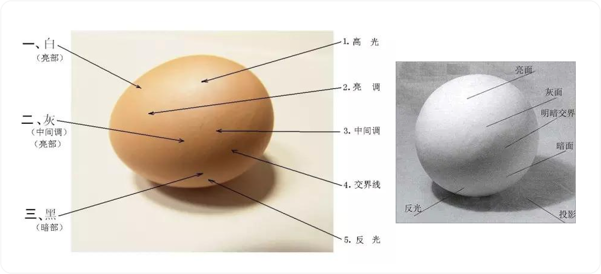
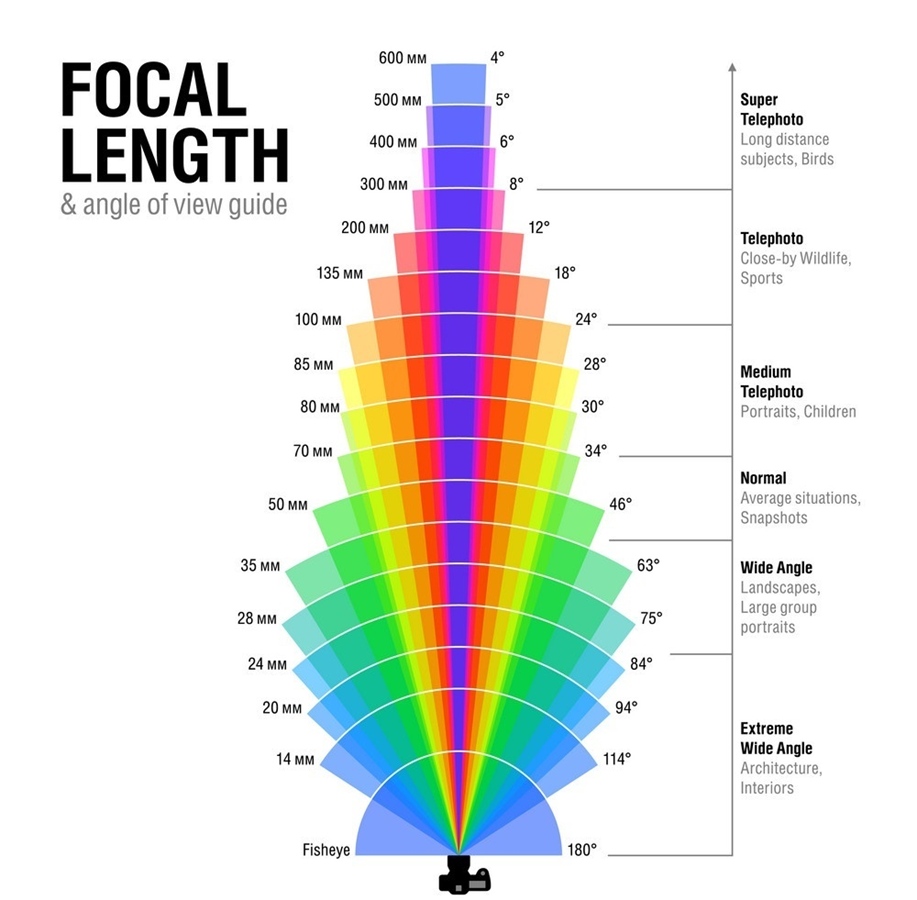
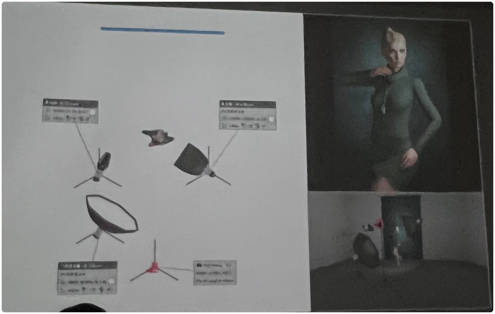
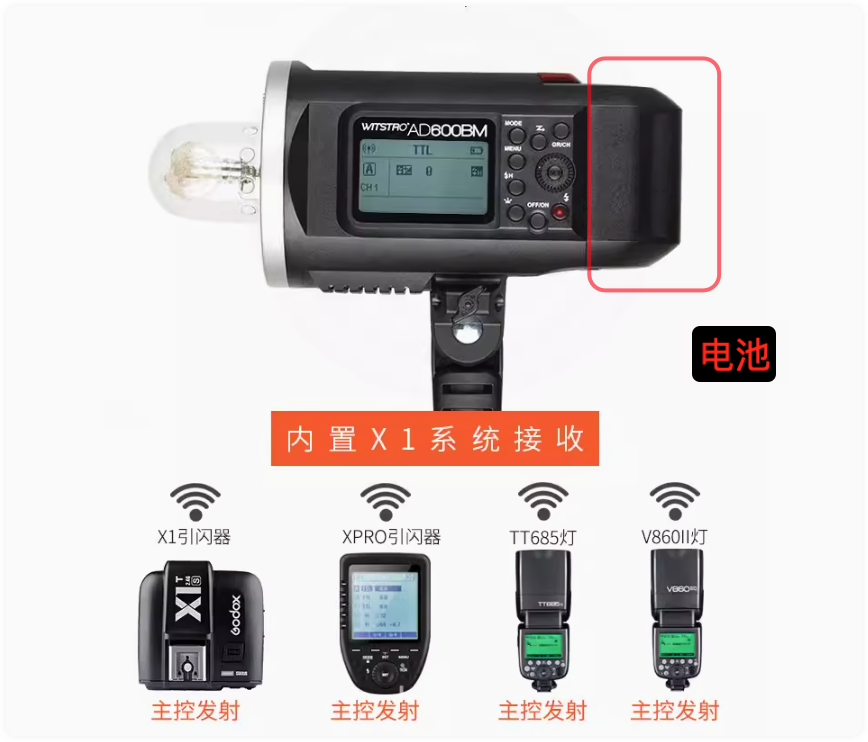
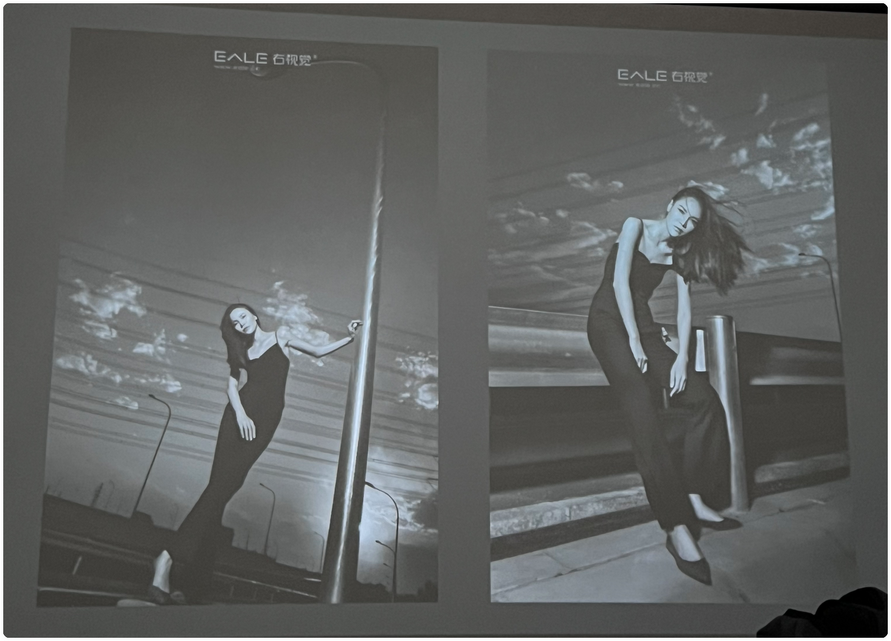
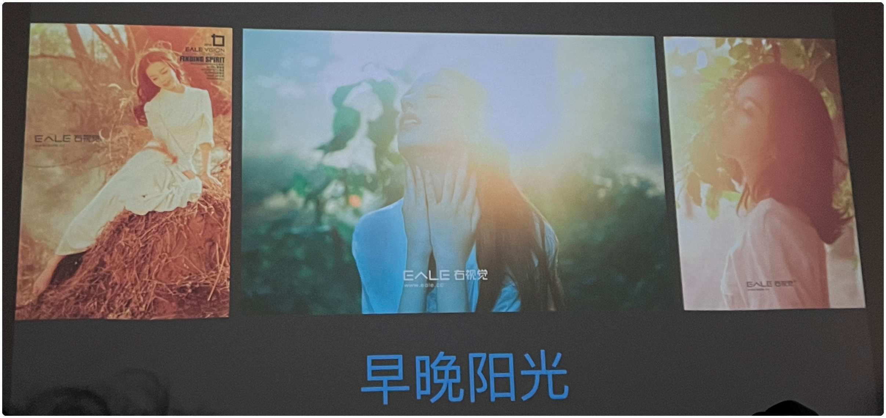
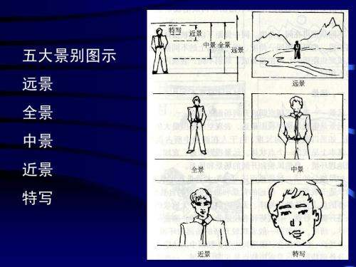

# 右视觉摄影机构 2022 年度摄影弟子班课程表

## 第一讲：摄影概述和光的本质

### 右视觉核心价值
### 弟子班内容及整体流程

### 摄影的本质是什么？
### 好照片的三要素
### 如何让摄影做的更长久进步的也更快
### 如何提升摄影师的眼光
### 如何让摄影师的观察更有效

### 如何做摄影拍摄题材和创意的有效积累
### 摄影师的控制力
### 摄影师必备的硬件基础。
### 解析光
### 光的三个核心点
### 熟悉灯光和附件，解析每一个附件的核心特点和使用技巧

#### 摄影灯附件
1. 标罩：标准硬光，很实；脸部结构很明显，
2. 雷达罩：依然是硬光
3. 柔光伞：
4. 柔光箱/长条柔光箱/八角柔光箱：很舒服的灯光
5. 束光筒/聚光筒
6. 反光伞

#### 摄影控光附件上的蜂巢（栅格）
- 让光的方向趋向一致，光变硬；
- 收放（光)；
- 光量变少

> 关于蜂巢更详细的讲解见老暂这个文章：https://tpway.com/gird/

### 深入理解光的速度和颜色

### 理解轴心光和各个景别打灯的技巧
### 如何选适合自己的闪光灯，如何充分利用闪光灯
### 结合实拍消化和深入了解
### 快速提升摄影眼光的好习惯！
### 轴心光和三原色人像现场实操

### 2023 年新增 led 常亮灯课程

## 第二讲：单灯
### 打灯的整体和环境意识
**没有绝对意义上的单灯**

#### 闪光灯的分类
1. 内置闪光灯
2. 热靴闪光灯（机顶闪光灯/电子闪光灯）
3. 外拍灯、手柄式闪光灯
4. 影室灯

#### 近几年闪灯的一些特点
1. 更稳定
2. 色温更精准
3. 闪灯速度更快
4. 高速同步
5. 外拍灯

### 打好灯光三要素
1. 角度
2. 距离
3. 范围

**角度是用来定调的**

关于角度在不同人身上的几个注意点：
1. 男女：男硬光用的比较多，突出轮廓和质感；女人更多使用柔光
2. 胖瘦：除了不同的镜头长短可以把人拍的胖瘦不同之外，更多的就是靠灯光了。
    + 把人拍的更瘦的灯光：硬光把人拍的更瘦；女生可以使用柔光加两侧使用吸光板
    + 把瘦的人拍胖的灯光：方向性更弱，用柔光
3. 皮肤质感：方向性强的，越硬的光质感更好
4. 五官立体：硬光角度大，适用男生；女生适用柔光，皮肤细腻。

### 通过光的角度深入解析蝴蝶光、伦勃朗灯光、底光、侧光、逆光等

#### 1. 蝴蝶光/美人光：
用途：可用于拍摄面部特写，也可拍全身、写真、艺术照。

基本定义：打光灯在正前方，~~如果拍半身，轴心光在下巴附近，所以灯肯定是比较高的~~，灯光角度为 45°（灯头上画一条水平线，轴心光和此水平线的夹角）（注：实际拍摄时根据下面的大小蝴蝶光来调节灯光角度）

起伏关系：第一：眼睛（下有阴影）；第二：鼻子（下有阴影）；第三：下嘴唇/下巴（下有阴影）

- 大蝴蝶：用更硬的光，或角度向下扣的更多了

- 小蝴蝶：用更柔的光，或角度变的小了（拍女生更建议用小蝴蝶）

#### 2. 伦勃朗灯光（/三角光）

用途：多用于拍摄企业领袖，偏商务的照片

基本定义：打灯在被摄体侧前方 45°，灯光角度为 45°（灯头上画一条水平线，轴心光和上水平线的夹角）

弹性空间：上面只是基础定义，拍照时不能完全按照定义。

对人脸结构交代最为严谨的灯光，传统的伦勃朗灯光三角交代是闭合的，

- 大伦勃朗：*笔记没有记上*，但是大致意思和上面的大蝴蝶相近，就是用更硬的光，影子轮廓更为明显

- 小伦勃朗：*笔记没有记上*，大致意思同小蝴蝶光，用更软的光，影子轮廓不明显

#### 3. 底光/鬼光
用途：

基本定义：灯光低于人的胸口位置，都称为底光。

拍摄：用低等架，灯离人不要太近（即人离背景近一点），不然拍出来会吓人；拍鬼光建议用硬光来拍摄；

#### 4. 侧光/阴阳光
侧光：一侧面部亮，一侧略暗。

拍摄附件：建议用长条柔光箱。

角度：打灯在人的左右侧，基本上接近 90 度，轴心光根据拍大头像、半身像、全身照判断，附件使用长条柔光箱，下扣角度不要大于 45 度，如果角度过大头部和人的肩膀处就会过亮（注：建议 15 - 25 度左右），使用长条柔光箱左右脸在鼻子分界处的轮廓就会比较匀，所以不能使用硬光（即：标罩、雷达罩）。

#### 5. 平光（/顺光）

使用：柔光伞和柔光箱

错误：不要用平推灯光，摄影师都没地方站了

正确：用深抛柔光伞或八角柔光箱提高，向下稍微有个 <=15 度的角度；如果房间较小，拍摄时身体两侧也会被打亮，因为两侧的墙会反光，这样会导致脸部太平没有轮廓，解决方法是在人和两侧墙体之间加上吸光板。

光越硬，照片的饱和度就会更高，结构的转折就会变的更加明快。

#### 6. 顶光

基本定义：*按照辉哥的说法，顶光正常使用时搭个棚，灯在棚的顶部从上往下打，如果没有搭棚，一般为从后上方往给人打光。*

案例：电影教父 

特点：排出的照片更有味道，因为人的眼部会看不到，这种光也不讨巧，

#### 7. 侧逆光
室内拍摄：从室内向亮的窗户等来打光，（或者说：从侧面打过来的光，模拟阳光???）

#### 8. 逆光/神仙光/轮廓光

*注：不会使用一个单灯来打逆光，后续课程会再补充*

### 通过光的距离的变化所能带来的各种效果

1. 距离改变所产生光的衰变
2. 距离的改变与附件软硬的关系
3. 距离改变所产生的光的方向性变化

距离：改变光的强弱。

被摄人（物）离灯越近影子越弱(柔)，离灯越远，影子越实。换句话说：被摄人(/物)离背景越近，影子越实；反之影子越弱(柔)。

不管是何附件，灯、被摄物、背景三者之间的关系：被摄物离灯的距离变近的时候，光的方向性会变弱，（个人注：因为光向四周直线运动，被摄人所产生的影子要经过一段距离才会投射到背景上，在这段距离内光会像四面八方发射，又因为被摄物离灯比较近所以背景上的阴影就会比较弱）

被摄物离灯的距离变远的时候，光的方向性会变强，

附件面积越小，基数就会变小，衰减就会越快。

用硬光拍摄，一米之内不要用，因为衰减不好控

### 棚内结合道具出来各种影子的技巧
1. 束光筒 + 
2. 束光筒 + 光罩
3. 束光筒 + 蕾丝纱 

指向用光：
- 拉开距离，方向性加强
- 拉近距离，方向性减弱

### 通过光的范围控制所能带来的效果
打好灯光的第三点：范围

舞台灯光：典型的主动范围的控制

### 核心的魅力：灯光控制可以如此简单和有效
### 商务人像，工笔人像灯光现场实操
### 2023 年新增十个单灯大片人像拍摄案例分享
### 答疑时间

#### 完成单灯的六个作业
一、利用光的角度每人拍摄四组（蝴蝶光、化勃朗、鬼光、自由发挥一个）灯光作品

二、利用光的距离每人拍摄两组（影子或者光的方向性）灯光作品

三、利用光的范围每人拍摄一组（主体精准成主业的光影范围）灯光作品

## 第三讲：双灯和初步接触多灯

### 深入点评上节课的作业，找到问题并解决问题。

白光亮度给到 230 左右，

灯光来控制练上发油的高光，使用柔光箱，即光的方向性弱。

问题：
1. 轴心光
2. 硬光、光的方向性强，光的衰减就快
3. 过曝、欠曝
4. 调子是画面的核心
5. 光影拍的更加整体一些

上节课补充：

柔光：小柔光箱 --> 大柔光箱 --> 慢反(用一个或几个柔光箱把背景白墙打亮，利用白光 90% 的反射把人打亮)

直线、速度、颜色和色温

灯光师有感情的，感情需要具体控制的支撑，主动控制与被动结果

### 解析光比和光比所能产生的作用

什么是光比？答：光比一般指摄影中，被摄场景的暗部和亮部的受光比例。是摄影的重要参数之一。

#### 光影关系

物体调子的规律可归纳为 "5 大调子，3 大面"

> 关于更多素描相关的知识见此知乎问答：https://www.zhihu.com/question/290870821/answer/2490625320

##### 5 大调子

|  1   | 高光  |
| ---- | ---- |
|  2   | 亮调  |
|  3   | 中间调  |
|  4   | 交界线  |
|  5   | 反（射）光  |

##### 3 大面
|  1   | 白（亮部）|
| ---- | ---- |
|  2   | 灰（中间调） |
|  3   | 黑（暗部） |

### 双灯经典案例解析

### 案例一 ： 主辅光
主：用雷达罩

辅：(1) 补暗部（/暗部细节），（2）控光比
- 棚内建议：用 1.2m 柔光箱或八角柔光箱
- 柔光箱的距离：建议 1 - 1.5m 之间 （1.5 - 2.5m ???)
- 柔光箱光比的控制：辅光到人身上的光量不能大于主光
- 双镜像：比如主光在左侧上部（/左前方），辐光应该在右侧下部（/右下方）。（注：拍人的正面）
- 拍大光比人像：主光给的 power 值高一些，辐光尽量不要大于主光。拍大光比人像尽量不要一步拍到位
- 被动效果（缺点）：对整体的环境都会打亮，即背景也会打亮，作用就是在辐光前加吸光板。

### 主灯光组（主灯不一定是一盏灯、主灯光组、夹板光等）

什么是主光? 答：对主题起到核心塑造关系的光

### 1. 夹板光
主光源：从人物的两侧的侧后，各一盏等打到被摄体

附件：2 个附件要一致

控制：方向性和范围

作用：是很高级的灯光，但是拍人并不是那么好看。

#### 最美人像
主光源：即上面的夹板光

人正前方：见手机图片（泡沫板的摆放）

特点：人的眼睛称为猫眼光，皮肤会特别好看，人的脸会显瘦，

### 2. 轴心光
拍半身：主光源轴心光差不多给到脖子部位
拍全身：如果希望整体都亮，轴心光放到胸部，希望上半身亮就给到下巴或脖子部位

### 3. 用几个灯光当做主灯光组
作用：当一个主光的强度不够时，可以使用几个灯光当做主灯光。

### 背景灯的作用和变化
1. 打白色背景：建议用一盏小号柔光伞，人物和背景可以拉开距离，~~把轴心光~~
2. 打灰色背景：使用柔光箱，拿距离来控制，灯和人近一些，人和背景远一些。

### 怎么高质量打出各种背景效果来呼应主题
1. 背景明度预留（因为通过灯光打上去的，预留比想要的颜色低一到两档）
2. 深色不好打，但是浅色很好打

### 侧逆光的由来和如何用的更精准
### 初步接触多灯

### 灯光顺序的重要性
1. 确认被摄人位置
2. 确定使用附件，调整角度，调整轴心光
3. 考虑主光 Power 值，主灯是标杆
4. 辅光
5. 背景灯
6. 侧逆光
7. 夹板灯光

### 四个作业练习
1. 主辅光：
2. 主灯光组：夹板光、猫眼光
    - 夹板光、猫眼光不建议用硬光拍摄，镜头建议用 70mm - 105mm 焦段
3. 背景灯：让人和背景分离，
4. 侧逆光：主辅光的角度控制是重点，辅光要打出脸、脖子、肩膀等处的轮廓。 按照辉哥的说法，辅光绝大部分情况下都是使用地灯八角柔光箱，一般情况下，如果光线不够再添加一个标灯往顶上打，来个漫反射。 （备注：在拍摄吃光（即：闪光灯出现在照片中，或者主闪光灯在高处冲着人的左右两侧后脑勺打光）的大逆光情况下，辐光建议使用反光伞来补光(注：右视觉的反光伞都是深口的)，根据大头、半身、全身不同情况调整好造型灯。

## 第四、五讲：右视觉灯光经典案例

## 第六讲：右视觉经典作品的背后及秘老师的摄影之路

亮部的颜色会逼着暗色的颜色往其互补色的方向走

饱和度高的颜色会逼着饱和度低的颜色往其互补色的方向走

-------------

点光源：如果拍摄的时候点光源是主光，那么要先给点光源。

## 第七、八讲：影棚布景（/置景）

置景是一个非常综合的话题，借机分享美术的三大构成，从地核打好基础，去主要的运用场景和道具。不管是从拍摄的角度还是被摄者的引导以及最终效果，置景都有很好的帮助作用。在这里，大家伙会充分感受到，影棚就是魔术箱，在里面可以出来任何想要的效果，这也是摄影的魅力所在之一。

棚内置景：背景、道具、综合

美术三大构成：平面、色彩、立体

好照片的三个元素：主题、主体、简化

平面构成和摄影的结合（构图，道具，场景等）
点、线、面

照片里喷点水，水就会变成光斑

### 色彩构成和摄影的结合（颜色本身的引导性，颜色的关系等）

| 色彩 | 色彩值 |                  抽象联想                  |
| :--: | :----: | :----------------------------------------: |
|  红  |        |  兴奋、热烈、激情、喜庆、高贵、紧张、奋进  |
|  橙  |        |  愉快、激情、活跃、热情、精神、活渡、甜美  |
|  黄  |        |  光明、希望、愉悦、阳和、明朗、动感、欢快  |
|  绿  |        |  舒适、和平、新鲜、青春、希望、安宁、温和  |
|  蓝  |        |  清爽、开朗、理智、沉静、深远、伤感、寂静  |
|  紫  |        |  高责、神秘、豪华、思念、悲哀、温柔、女性  |
|  白  |        |  洁净、明朗、清晰、透明、纯真、虚无、简洁  |
|  灰  |        | 沉着、平易、暖睐、内向、消极、失望、抑郁 |
|  黑  |        | 深沉、庄重、成熟、稳定、坚定、压抑、悲感 |

### 立体构成和摄影的结合（透视，消失点，主体突出等）

透视与立体构成

相机不同焦段的视角：

| 焦段   |  视角  |
| :--   |  :--  |
| 15mm  |  114° |
| 20mm | 94° |
| 24mm  |  84°  |
| 28mm  |  75°  |
| 35mm  |  63°  |
| 50mm  |  46°  |
| 70mm | 34° |
| 80mm | 30° |
| 85mm  |  28° |
| 100mm  |  24°  |
| 135mm  |  18°  |
| 200mm  |  12°  |
| 500mm  |  5°  |
| 600mm  | 4° |

人眼视角：
- 人单眼的水平视角最大可达 156 度
- 双眼的水平视角最大可达 188 度
- 人两眼重合视域为 124 度
- 单眼舒适视域为 60 度

拍摄主次：
大小 饱和度 虚实、节奏、XX

### 背景和主题的关系（拿经典案例解析背景布、色纸、肌理布等简单背景的灯光和拍摄技巧）

#### 背景

**(1)** 背景纸：推荐只建议买浅色，比如浅红色、浅粉色、青色等等。明度低于 128 的话，所有的纸都会坑坑洼洼

背景纸和色片的区别：背景纸是可以通过颜色来打出来的，但是还为什么需要背景纸呢？第一如果人在地上坐着的时候，如果欠曝，地上打不上色，第二就是人和背景离的比较近的话。背景纸不建议用黄色、绿色。

**(2)** 无纺布：不建议买无纺布。

**(3)** 绒布（肌理布？？）：拍摄厚重的效果。比如拍摄深红色背景

**(4)** 油画布：拍复古、厚重的题材。下图示例：

拍摄建议：背景灯预留，即建议人和背景拉开距离，因为油画布背景吸光，油画布补光一般使用束光筒，补光的距离见下面示例。

使用最多的是墨绿色的油画布。

**(5)** 写真布：不建议买，但有些可以买，比如：水泥墙。

**(6)** 塑料布：灯光如果从两侧打的话，塑料布会有高光，

柔焦人像：在镜头前加柔焦镜；或者在 uv 镜上涂凡士林（四周厚越往中间越少）；后期也可以。丝袜、白纱都不建议用。

### 道具在拍摄中的应用（道具的作用和被摄者结合及引导性；案例解析点线面构成和道具使用的关系；各种创意道具比如树枝树叶，烟雾，水，面粉，服装的特点等就在你身边；道具和主题的关系等）

建议：在摄影当中建议多用道具，道具本身具有引导性，这样给拍摄者一个引导。

服装搭配是一件非常重要的事情。从主题身上提取元素，这样道具不容易出错。

吹头发：不能对着人的眼睛来吹风，常规的位置是对着人的脖子吹；第二也不要对着一个地方吹，要摇着吹；

道具：秋千

##### 神仙光拍摄

灯光：

- 第一盏灯（标罩 + 按需求加色片）在人的背后，一般拍大半身人像，轴心光在的脖子处，不要超过人，让人挡住灯。
- 第二盏灯（标罩 + 按需求加色片）在第一盏灯的后面，但是灯位提高，往下有个角度，这个是给头部和肩膀的轮廓光。
- 第三盏灯（反光伞）在人的前方补光

附件：可以喷水，或者女生拿个配件（比如：打伞或者拿个扇子之类）

### 综合场景（数个右视觉经典案例的解析；创意点和场景的结合，大片原来是这么拍出来的；）

PE 镜面板

漫反：如果 Power 值已经给到最低了，可以把灯和墙的距离拉大来降低漫反的亮度。

### 整体意识的重要性

### 各个关系的综合处理

### 2023 年新增当前最有市场的拍摄案例

### 三个练习作业

- 利用背景（背景纸、绒布、肌理布）拍摄一个主题
- 利用道具拍摄一个主题
- 任选一种综合置景拍摄一个主题

为接下来的模特实拍做准备

## 第九讲：和被摄者的交互 如何引导你的拍摄对象（含中模拍摄）

*added:2023.10.19*

摄影的核心环节之一，被摄者的引导和 pose 部分，但我们给的更多，也本该需要更多有效的前后期相关的和拍摄中的系列工作要去做好的，然后享受其中即可。

### 答疑

### 上节课回顾

### 深入点评上节课的作业，找到问题并解决问题。

### 好的摄影师首先是一名好导演

### 结合大量的案例来谈

### 拍摄前的一些好习惯

- 口碑案例优先

- 先交朋友

- 倾听、为对方着想、收集有效信息

- 专业态度

- 控制的住的想象空间

拍摄前准备：拍摄方案 服装 场地 灯光 道具 配置 提前提醒等等。

### 拍摄中的一些好习惯

- 摄影和被摄者式镜子内外的关系
- 拍摄氛围、笑脸和尊重
- 被摄者也在观察摄影师
- 欣赏你的被摄者、他（她）是独一无二的
- 安全感和尊重
- 会夸奖
- 联机拍摄：capture one
- 及时分享，节奏把控

Capture one:

- 名称：
- 位置：
- 模板：空白
- Subfolders settings
    - 拍摄子文件夹
    - 

### 拍摄中拍摄者可能出现的各种问题以及解决方式

### 如何引导好被摄者

### 被摄者不喜欢的行为

气氛紧张

不必要的肢体接触

沟通不充分

狂拍不顾模特，不及时分享

不尊重模特

时间把控

### 拍摄后的一些好习惯

又多了一个新朋友

既是的回访

上次拍摄的好与不好

朋友好保持往来

维护老客户比新客户成本低很多

### 如何让拍摄中可能出现的问题消失于萌芽状态

### 如何解决已经出现的拍照中的问题

### 摄影师的最基本和最高职责：拍好每一次的拍摄

### 摄影中的 POSE

POSE: 三部曲

- 第一步：死记硬背
- 第二步：POSE 技巧
    - POSE 与镜头透视：越广的视角透视就越大，离镜头越近越大
    - 透视与姿势及相机的机位
    - POSE 与环境或置景
    - POSE 与道具
    - POSE 与节奏
- 

### 如何让你的 POSE 技巧快速有效提升

张势动作

- 全身

- 跳

- 转起来：不要转太多

- 失去平衡：借助外力

- 动起来

收势动作：

- 坐着
- 蹲着
- 侧抬（肩膀一定要打开，侧面的曲线给到）
- 侧低
- 跪
- 趴着

其他动作

- 找个支撑
- 嘴巴微张
- 眼神
- 哭和笑
- 背影
- 不看镜头
- 遮挡

### 外模的拍摄和沟通技巧

### 通过模式实拍巩固今天和之前的学习内容（右视觉造型师化妆造型）

### 发现问题解决问题

### 授课老师：秘老师

## 第十讲：摄影构图、外景拍摄

*added:2023.10.18*

好多人拍不好最熟悉的环境人像，一个容易拍摄太普通太中规中矩，摄影需要出彩才可以，再一个是没有拍摄的意识，内容太空。环境人像和之前的置景及灯光课关联非常大，结合系列意识和核心干货的分享，再结合大量实操的案例，在标杆意识下，我们可以很快掌握好当天的内容，

### 环境是载体，环境的弹性

### 外景人像的控制力

### 外景人像的五大调关系

### 外拍灯和附件的选择

#### 外拍灯分类：
- 热靴闪光灯、
- ~~传统外拍闪光灯~~、
- 最新外拍灯

    

#### 外拍附件
注：人不离灯

小号的反光伞，小号的柔光伞，两种伞已经满足 99% 的拍摄。柔光箱、标罩偶尔可以用到

外景拍摄中的光比和棚内光比的区别

### 近两年外拍灯特点和优势

### 外景拍摄的顺序和意识
外拍顺序：
- 首先拍环境，根据想要的景深来确定光圈（注：这里没有说大光比的图把对焦对在物上还是在天空上，根据下面两点我想应该是把对焦在天空上，因为这样放人进来的时候才是欠曝的。）
- 然后上人，拍出来人肯定欠曝
- 接着加闪灯，来回调整 power 值

### 逆光拍摄技巧

### 压光拍摄技巧

把背景的明度给压下去，拍摄大光比

压光：

### 服装拍摄技巧

### 夜景及慢门拍摄技巧
建议：使用灯棒，塑造人；

### 大环境人像拍摄技巧

### 黑白风格拍摄技巧

### 正午太阳下拍摄技巧
正午阳光：阳光强是大光比，方向性强，尽量让人的面部背光，正面用闪光灯补光

### 早晚阳光

### 外景的半置景和灵活用光

### 外景人像的几个注意点

外景人像注意点；融氛围、简化、五大调、用光、构图

### 外景拍摄实操（熟练外拍灯、各个风格实操）

黄绿经典组合

### 什么是构图

构图是

### 美术在构图中的重要作用

### 构图的引导性

### 构图的景别及机位语言

##### 景别：

- 远景：氛围
- 全景：xx
- 中景：肢体
- 近景：见情绪
- 特写：见灵魂

摄影中全景、中景、近景、特写的区分主要是按表现人物的部分来区分的，具体区分方法如下：

全景画面：主要表现人物全身，活动范围较大，体型、衣着打扮、身份交代的比较清楚，环境、道具看的明白，通常在拍内景时，作为摄像的总角度的景别。

中景画面：画框下边卡在膝盖左右部位或场景局部的画面称为中景画面。

近景画面：拍到人物胸部以上，或物体的局部称为近景。近景的屏幕形象是近距离观察人物的体现，所以近景能清楚地看清人物细微动作。

特写画面：画面的下边框在成人肩部以上的头像，或其他被摄对象的局部称为特写镜头。特写镜头被摄对象充满画面，比近景更加接近观众。

**扩展资料：**

##### 机位

- 高机位拍小清新，很可爱、年幼
- 

### 镜头焦段与透视

焦段与透视 空间 压缩

### 一条线引发的距离感

### 构图对视觉的影响

### 十余种拿起来就可以用的构图技巧及技法解析

### 构图的呼吸效应和想象空间

### 构图的一些原则

人像：

- 三分之一构图

- 居中构图：仪式感

- 引导线构图：

- 海报留白式构图/反留白构图

- 裁剪式构图

    

- 对角线构图
- 三角形构图
- 放射性空间透视构图
- 前景
- 框架式构图

### 构图的一些忌讳

常规人像摄影构图的几个忌讳
1. 无主题、无主体。
2. 画面太满、画面太空。
3. 裁剪小臂小腿

### 外景及构图的拍摄作业

三张外景人像

## 第十一讲：拍摄方案及后期基础

在完善的流程中，拍摄发难的占比极大，在拍摄之前和甲方或客户做有效的沟通和准备，是非常重要的事情，方案是桥梁和方向。

当然会分享一下后期的基础内容，为下面的后期课程做好准备和过度。

### 上节课回顾

### 深入点评上节课的作业，找到问题并解决问题

### 拍摄方案的重要性（商业、个人、创作(/团队本身)）

写方案

### 商业拍摄方案案例分享和解析（三个广告案例的解析和分享）

拍摄目的：主要是为了提升品牌形象

1. 主画面：必要的存在

全案流程：

- 节奏

- 概念创意 
- 平面方案 
- 视频方案：脚本和分镜
- 工作人员
- 备注

### 创意拍摄方案案例分享和解析

### 快速执行拍摄方案案例分享和解析

### 专题方案

### 方案和品牌的关系

### 先走起来：方案的第一步 - 关键字

### 作业：写三个商业拍摄方案

每个人写三个**执行拍摄方案**

- 注意：棚内拍摄，不能让模特毁装
- 写 3 个方案，毕业拍摄时拍 2 个
- 建议：可以和以后得发展相关，或有弹性的可以表现出来摄影师技术的

> 拍摄流程：
>
> 0. 主题：拍摄的方向和风格（写真、服装...)
>
> 1. 主视觉/主画面：必要的存在（相对应的图片）
> 2. 服装、道具、妆造、...
> 3. 灯位图
> 4. POSE
> 5. 镜头、景别、视角、机位
> 6. **关键词**：把不具象的东西变的具象化

> 自己拍摄选择：
>
> 1. 写真，妆面
> 2. 影棚模拟户外人像
> 3. 

## 第十三讲：后期精修及高效操作

- 继续深入掌握好中性灰和双曲线
- 人物液化
- 人物骨骼、肌肉及比例
- 人物液化系列案例
- 人物五官的精修
- 高低频
- 皮肤快速磨皮
- 服装及背景的高效处理
- 快速去高光
- 磨皮插件的运用
- 精修中的系列技巧
- 授课老师：秘老师 

## 第十四讲：后期调色
- 深入理解颜色
- 深度理解直方图
- 吃透一系列调整工具
- Capture one 解 RAW 的特点和优势
- 调色之王曲线的详解
- 日系人像，欧美人像，莫兰迪，青橙，棚内外等调色案例分享
- 杂志封面案例解析
- 前后期的关系及后期反推的前期注意事项
- PS 工程文件的优化
- 如何高效处理一组作品
- 各种关系的处理
- 授课老师：秘老师

 

## 第十四讲：选择的艺术及黑白人像

后期的每一步都离不开选择

选择的各种技巧

合成案例分享

抠像的几种技巧

关于合成的综述

关系及颜色的匹配

背景和主题的关系处理

前后景的关系

合成的技巧分享

黑大大片的技巧

秘老师指导和点评

然后开始做毕业拍摄前的系列准备，毕业拍摄以高质量商业拍摄标准来走

授课老师：秘老师

 

## 第十五讲：三分钟快修、后期案例解析及后期输出

上节课回顾

点评上节课的作业

没有时间节奏的后期是不负责任的

后期系列快速修图技法

从管理到接 RAW

从动作到图层的优化

从导出 LUT 到案例的优化

完全可以三分钟出一张高质量后期

前期预留的后期完善

杂志艺人后期技巧

服装类后期技巧

“废片”的后期  

视觉类图片后期技巧

后期出片锐化的一系列技巧

新媒体输出和印刷类输出的一系列注意事项

让你的后期为前期加分

授课老师：秘老师

 

## 第十六-十八讲：灯光回顾和毕业拍摄前期准备

回顾之前的灯光部分，温故而知新

商业拍摄的流程

确认和准备毕业拍照的提灯光、场景、服装、道具、妆面等

解决拍摄准备中的问题

确认拍摄顺序

授课老师：秘老师 准备指导老师：王老师

 

## 第十九、二十讲：毕业拍摄

以拍摄方案为准

每人拍摄两组中外模时尚大片

为前期的学习和下面的后期及以后的发展做准备

拍摄条件为商业拍摄中的一流条件

一流的外模，一流的化妆造型，一流的拍摄硬件

严格以商业流程的规范来操作

务必让每一位学生除了检验之前的学习之外，每人都有过硬的作品来帮助个人或公司今后的发展。

指导老师：秘老师

全程协助老师：王老师

化妆师：右视觉御用造型师

影棚：右视觉一号大影棚

 

第二十一：后期修图

后期阶段

讲解毕业大片的拍摄

选片技巧

后期方向和后期的一系列注意事项

然后开始后期

每人一台电脑和数位板

每人每组至少精修三张大片

后期过程之后充分理解前期

也充分掌握后期

后期过程中可申请前期练习

每天交片和讲解作业

找出自己修片的不足和快速弥补不足

过程一直有老师指导

授课指导老师：秘老师

 

然后每天上课前为后期修图详解，授课为秘老师。

 

## 第二十二讲：学习总结

毕业作品点评

回顾一个月内容，再讲解，再有新的感悟。

发展建议及规划

工作室建设和运营

拷贝作品、领毕业证和毕业合影纪念照。

课程结束之后并不是结束，学习完之后的每一个学生将会和右视觉一起来做好摄影，右视觉将在以后的日子里会每一位学生解惑，并且右视觉的发展计划中还会有很多的机会可以让每一位学员参与进来。

学习不达标和以后想进修的做时间安排

右视觉是每个学员永远的家，右视觉在下一盘大棋，大家还会有共事的机会 一起做好摄影。

课程结束之后会聚餐时间，一个月的高效分享学习之外我们松口气，好好唠唠，珍惜这难忘的经历！

主分享老师：秘老师

 

处了回顾和总结之前的内容外，一个很重要的内容是学完之后的发展建议，新媒体运营和推广技巧，工作室的运营，怎么快速发展摄影和快速接单。

相信每一个来右视觉学习的朋友们都是热爱摄影的，热爱，本来就应该产生更大的价值，我们首先都已经在做自己很喜欢的职业，喜欢本身就可以产生更大的价值。

备注：授课以当天内容为准，会比提到的内容还要更多也更为精彩。 

要学好和做好摄影很简单，来右视觉就好！