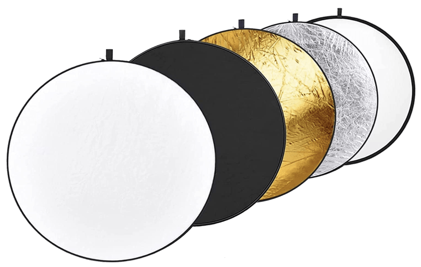
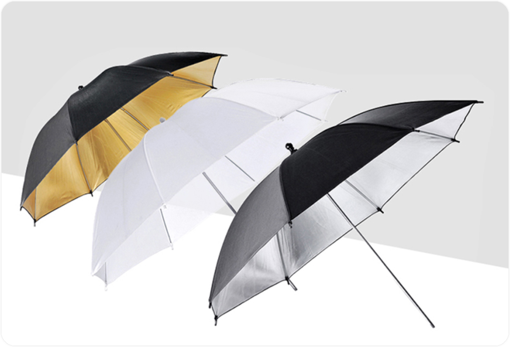
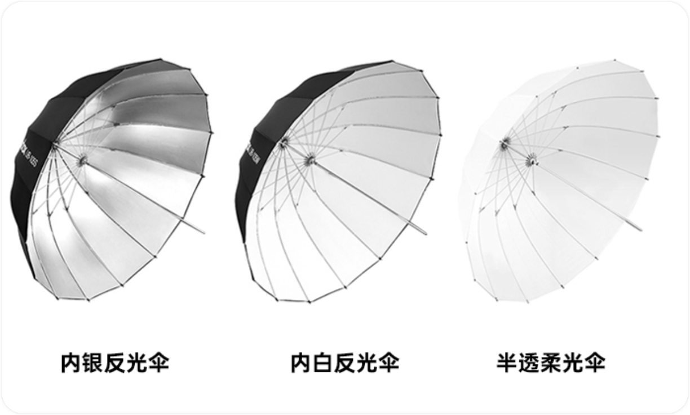
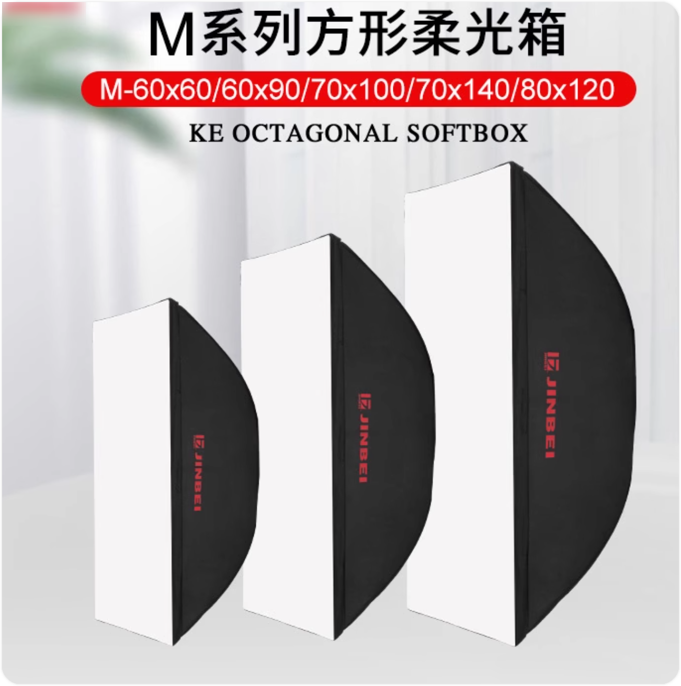
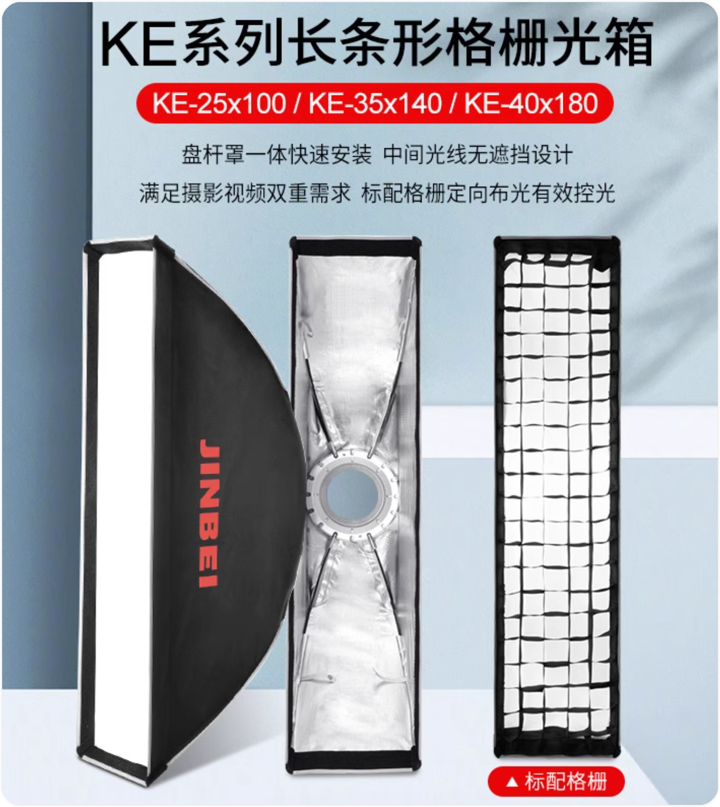
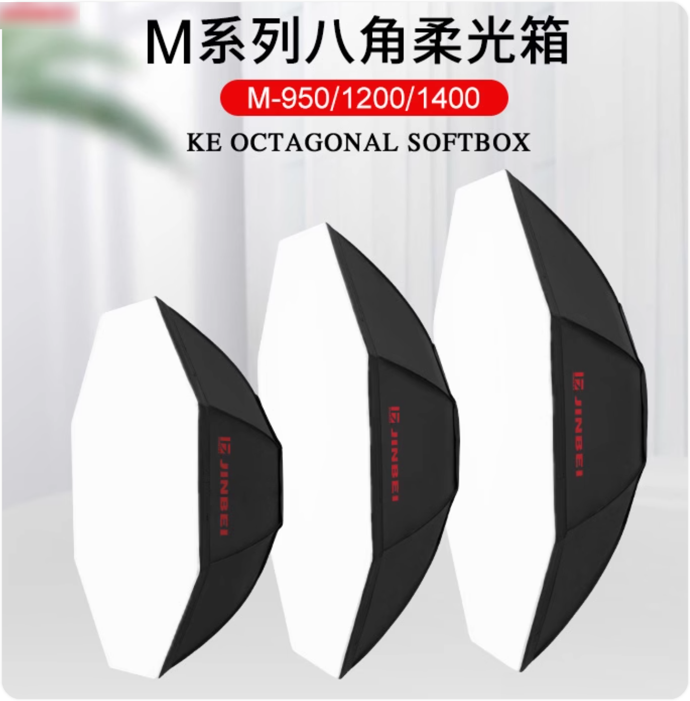
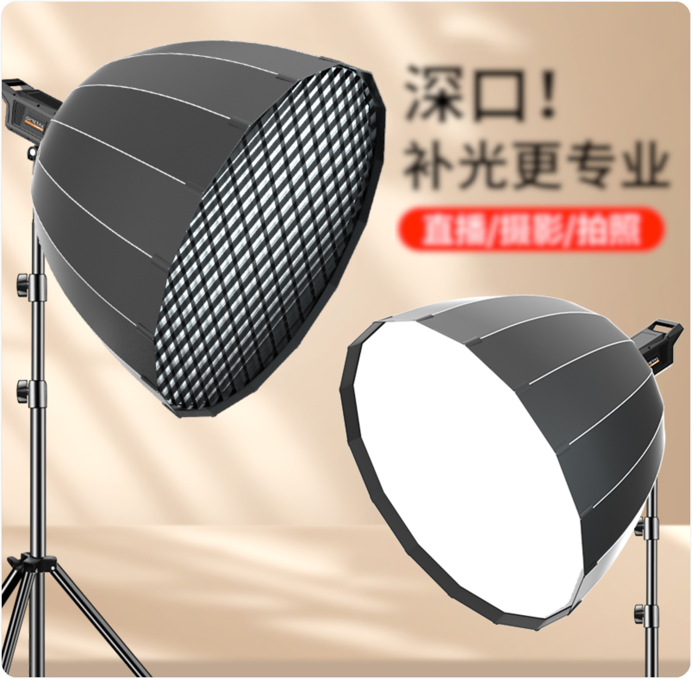

# 摄影灯及附(配)件

# ★ 闪光灯

# ★ 摄影灯附件

> 待做笔记：https://zhuanlan.zhihu.com/p/143167153

### New Words

| 单词       | 美式发音     | 词类 + 汉语释义       |
| ---------- | ------------ | --------------------- |
| sulfuric   | `/sʌlˈfjʊrɪk/` | adj. 硫酸的。         |
| acid       | `/ˈæsɪd/`      | n. 酸；酸性物质。     |
|            |              | adj. 酸性的。         |
| reflective | `/rɪˈflɛktɪv/` | adj. 反射的；反映的。 |
| plate      | `/pleɪt/`      | n. 盘；碟；牌子       |

| 摄影配件                 | 英文名称                                    |
| ------------------------ | ------------------------------------------- |
| 反光板                   | Reflector / Reflective plate                |
| 柔光伞和反光伞           | Soft light umbrella and reflective umbrella |
| 柔光箱                   | Softbox                                     |
| 硫酸纸和旗板             | Sulfuric acid paper and flag board          |
| 标准罩                   | Standard hood                               |
| 格珊、蜂巢和喷嘴(/猪嘴） | Grid, Honeycomb, and Snoot                  |
| 灯架                     | Light bracket                               |
| 转接支架                 | Adapter Bracket                             |
| 无效的灯光附件           | Ineffective Lighting Accessories            |

## 反光板（Reflector）

市面上有各种形状和规格的反光板可供选择，其中包括：

- 圆形反光板：二合一、五合一的圆形反光板，直径范围从60cm到80cm、110cm、120cm不等；
- 椭圆形反光板：规格包括 60\*90cm、80\*120cm、90\*140cm 等。
- 此外，还有三角形反光板等其他形状。

通常情况下，最常使用的是直径为80cm的五合一圆形反光板。这种反光板具有不同的反射面：

- 黑色面：吸收光线，通常用于拍摄花卉和小型产品，作为背景。
- 白色面：用于背景和轻微补光，提供柔和的光线，但补光强度较低。
- 银色面：反射光线强烈，适合用于远距离补光拍摄人物。
- 金色面：用于补光，并能够调节主体的色温。
- 此外，中间一层半透明的板可用于遮挡强烈的阳光，在拍摄产品时，结合夹子使用可柔化光线。

这些反射板提供了多种选项，适合不同的拍摄需求。

## 柔光伞和反光伞（Soft light umbrella and reflective umbrella）

柔光伞和反光伞通常有两种类型可选。

- 第一种是：纯白的柔光伞
- 第二种是：外黑内银（或外黑内白）的反光伞。

(上图)注：更深的形状能够更好地控制和精确地塑造光线与一般的反光伞相比，这款反光伞都拥有较深的抛物线形状。形状越深，您越能获得理想的光域控制能力。

- 经典黑银版：黑银版抛物线反光伞可集聚光效于物体细节，并产生自然的眼神光。既可以点亮被拍摄物体，也方便精确控制光效的对比度与饱和度，适用于打造清爽、前卫的造型。使用柔光罩，光效更柔和。
- 简介黑白版：黑白版抛物线反光伞依然能实现相对不错的控光，但光效比黑银版更柔和，且无需过多操作。安装柔光罩后，美丽的窗户光应运而生。
- 柔光透明版：透明版抛物线反光伞可用于扩大光源、柔和光效。经过透明衬布反射后的光线，比黑银版、黑白版更柔和，可以作为美妙的补充光。

黑银和黑白版前面可以加柔光罩，透明版前面可以添加反光罩。

*上面这几段文字来自神牛反光伞商品介绍：https://detail.tmall.com/item.htm?id=623589461522*

国内市场提供了成本较低且价格便宜的选项，但它们也容易受损。

纯白柔光伞的效果相对较差，可能会在太近的拍摄对象上产生伞骨阴影，因此一般来说，我不太推荐使用它。

外黑内银（内白）的反光伞提供了较好的反射效果，尽管略显硬一些，但效果还是令人满意的，因此我推荐使用它。

在室外拍摄时，这些伞不太适合使用，因为它们容易受到行人或风的干扰，可能被吹翻或损坏。幸运的是，它们的价格相对较低。

需要注意的是，这些附件在收纳时较长，对于携带来说有些不便。更好的柔光伞和反光伞通常是16骨的，因此具有更高的强度。对于便携性，美国Westcott公司提供了三折柔光伞反光伞，是一种不错的选择。

## 柔光箱

| 柔光箱类型       | 图示                                                         | 用途                                                         |
| ---------------- | ------------------------------------------------------------ | ------------------------------------------------------------ |
| 方形柔光箱       |  注：图示来自https://detail.tmall.com/item.htm?abbucket=12&id=680933169193&ns=1 | 一般方形柔光箱用于拍产品较多，但是又不绝对只用于拍产品，长方形柔光箱在影棚内也用于拍人像，八角和深口抛物线柔光箱（即：深抛柔光箱）、反射型伞式柔光箱一般用于拍摄人像较多，但同样也不绝对，拍产品也会用到八角柔光箱，球形柔光箱则一般用来直播或者录视频给人打主光。（来自：https://zhuanlan.zhihu.com/p/374394623） 常见的方形柔光箱有我们常说的“方箱”和“条柔”两种，每种都有很多不同的尺寸，黑色的箱体让光线在充分的漫反射后仍具有一定的指向性，白色的柔光布将光线进一步柔化，方形柔光箱是最常见、应用范围最广的种类。 |
| 长条柔光箱       |  | 条柔多数用来拍产品，特别是长条形状的产品，例如红酒瓶、条状厨具家具、电器等等，它可以在柔光的同时收缩成一条细长的高光线，来为长条状的产品提供细窄的条状高光。也有一些人像摄影使用条型柔光箱从侧面给人物打光。 |
| 八角柔光箱       |  | 八角柔光箱设计的初衷就是为了实现圆形柔光箱的效果，相比方口，八角柔光箱能营造更大的光场，背景和主体的光效更为协调，背景的光也会均匀些，在使用中通常给人物打顶光，来模仿自然天光的效果。  非常适合人像摄影主光适用，八角形设计，使被拍摄人物眼中的光斑成圆形，而产生更漂亮的眼神光。 |
| 深口抛物线柔光箱 |  | 八角柔光箱设计的初衷就是为了实现圆形柔光箱的效果，相比方口，八角柔光箱能营造更大的光场，背景和主体的光效更为协调，背景的光也会均匀些，在使用中通常给人物打顶光，来模仿自然天光的效果。 |
| 折叠柔光箱       |                                                              | 便于携带和储存，适用于户外或移动摄影，提供均匀的柔光。       |
| 混合柔光箱       |                                                              | 结合了不同形状的柔光箱，以获得多样化的光线效果。             |

## 硫酸纸和旗板

## 标准罩

## 格珊、蜂巢和猪嘴

## 灯架

## 转接支架  

## 无效的灯光附件

 

> 摄影照明设备的三种基本类型是连续光、闪光灯和光线调节器。连续光一直亮着，产生柔和的光线。闪光灯可以是手动或 TTL 闪光。而光线调节器可以改变光线的方向、强度或质量。
>
> 每种照明类型都有其优点和缺点。因此，在购买之前了解每种类型的工作原理非常重要。本指南将教您有关摄影照明设备的一切，以便您能够明智选择并开始拍摄惊人的照片！
>
> 当您刚开始学摄影时，购买所有必要的设备可能会令人不知所措。但不要担心！本指南将帮助您弄清楚您需要开始的内容。
>
> **多功能照明工具**
>
> Neewer 5合1 圆形灯反射板
>
> 了解不同类型的摄影照明设备以及多功能的5合1圆形灯反射板如何帮助您在室内或室外摄影中控制和塑造光线。
>
> ## 摄影照明设备类型：工作室灯光
>
> 在工作室中使用许多不同价格的摄影灯。您选择的灯光将取决于您需要多少功率，也会受到您的预算的影响。
>
> 幸运的是，有一些更便宜的摄影照明品牌，如Godox。它们提供一些性价比较高的设备。只要您了解摄影灯光的工作原理，就不需要顶级设备来获得最佳效果。
>
> 随着您的职业发展和获得更多高薪客户，您可以投资更昂贵的摄影灯。以下是最常见的工作室照明设备。
>
> ### 1. 闪光灯
>
> 闪光灯是主导工作室照明世界的闪光类型。当我们谈论工作室灯光时，通常会想到闪光灯。
>
> 闪光灯可以是单体头，比如Neewer Vision 4 300W。它将电池和灯光放在一个紧凑的单位中。或者它可以是需要连接到高功率电池的灯光。
>
> 这两种类型的闪光灯都可以控制闪光输出的强度。它们的功率可以以瓦秒为单位测量。某些工作室照明情境需要比其他情境更多的闪光输出。
>
> 例如，食物摄影或产品摄影可能需要具有400或500瓦特功率的灯光。这是因为场景通常很小。一个可以使用的示例闪光灯是Godox SK400II。
>
> 较大的场景，例如群体肖像，可能需要两倍于此或更多的灯光。
>
> 购买或租用闪光灯设备时，您希望确保可以将其插入工作室墙壁，而不会导致照明跳闸。但是，某些闪光灯不需要插电。还有一些可以在户外使用的电池操作型闪光灯。
>
> 如今，您可以以低价格购买功能强大的闪光灯。一个闪光灯之间的价格差异通常不在于功率，而在于闪光灯的制造质量、耐用性和闪光输出的质量和一致性。
>
> 使用闪光灯时，您需要同步设备来帮助您将闪光灯与相机同步。
>
> ### 2. 连续光
>
> 连续光也被称为“热光”，用于摄影的连续光不会“闪光”。相反，它们是一个稳定的光源。在按下快门之前，它们允许您看到光线如何落在您的主题上。
>
> 这对于产品拍摄或其他类型的静物摄影非常有优势。但与闪光灯单元相比，连续光并不那么受欢迎。
>
> 这些具有更少的功率。并且匹配光线与可能影响场景的其他环境光源是一项挑战。
>
> 另一个劣势是它们可能会变得非常热。因此有昵称“热光”。
>
> 就像这些VILTROX 2灯一样，LED灯已经改变了连续光的面貌。它们不会像其他连续光那样发热，并提供高质量的恒定光。
>
> 最好的LED照明设备成本数千美元。它们与最佳闪光灯的价格相媲美。
>
> ### 3. 速闪灯
>
> 速闪灯是工作室内外都可以使用的小型闪光灯。它们提供光线或在户外日光照明情况下添加补光光。
>
> 与闪光灯相比，它们的功率相对较弱。它们的尺寸较小，因此产生的光束较窄。这可能导致较硬的阴影和更明显的人工外观。
>
> 尽管如此，它们相对便宜。将多个速闪灯放在一起可以产生出色的工作室照明。它们还提供了轻便的选择，具有很强的多功能性。
>
> 例如，Neewer TT560等速闪灯与许多DSLR相机品牌兼容。您还可以购买更昂贵的、特定相机的速闪灯，例如尼康SB-700速闪灯。
>
> 速闪灯可以安装在相机的热靴上，以提供照相机上的闪光灯。为获得最佳效果，速闪灯应固定在灯架上并脱离相机使用。
>
> ## 工作室照明的修饰器
>
> 修饰器是一种可以安装在您的工作室光源上的照明附件，它可以帮助您控制和塑造光线。除非您希望使用硬直射光，否则您需要一个修饰器来与光源一起使用。
>
> 您选择的修饰器将取决于您对图像的目标。例如，如果您拍摄食物摄影，99%的情况下，您需要柔和、漫射的光线。
>
> 与下面的饮料图像一样，坚硬的直射光有其时刻。但它可能会让食物看起来冷、遥远、油腻和不诱人。柔和的光线将为您提供柔和的阴影，并展现主题的最佳特质。
>
> ### 4. 柔光箱
>
> 柔光箱可以是方形、矩形或八边形的，比如Neewer的47英寸雨伞柔光箱。在后一种情况下，它被称为八边箱。
>
> 柔光箱可能是最受欢迎的工作室修饰器。这是因为它们提供柔和、漫射的光线。
>
> 这种令人愉悦的光线质量对于大多数摄影类型都非常有效。您可以将它用于从肖像到食物的任何内容。
>
> ### 5. 条形柔光箱
>
> 条形柔光箱是一种矩形且非常窄的柔光箱。它非常适合需要长而窄的连续光束的摄影，比如酒精摄影。一个受欢迎的选择是Godox的条形柔光箱。
>
> 当放置在肖像主题后面时，它还可以有效产生背景光。光束更窄。因此，当使用条形柔光箱时，您可以更好地控制光线的位置。
>
> ### 6. 雨伞
>
> 雨伞是另一种常见的修饰器。与其他修饰器相比，它们并不总是产生最佳的工作室照明效果。它们有银色或白色的。
>
> 光线射入雨伞，将其反射到场景中。这有助于创造更大、因此更柔和的光源。
>
> 雨伞照明的问题在于光线往往会泄漏。因此，使用雨伞可能更难处理。
>
> ### 7. 透光伞
>
> 透光伞是由半透明材料制成的。您也可以将光线射入此伞，以获得柔和的光线。但它不会像普通伞那样给您方向性。
>
> 其中一些几乎像柔光箱一样工作，比如Neewer的透光伞。这是著名的肖像摄影师如Annie Leibovitz喜欢使用的首选修饰器。他们之所以喜欢它，是因为它提供了非常柔和的光线。
>
> 在创意肖像摄影的情况下，这可能非常令人满意。但在其他照片中，如食物或产品照片，光线可能太平坦。
>
> ### 8. 美容碟
>
> 美容碟是肖像、美容和时尚摄影的绝佳修饰器。美容碟将帮助您塑造面部特征并创造美丽的亮点。它还会由于其独特的形状从各个角度照亮光线。
>
> 为了更容易存放，您可以购买一个折叠式美容碟，比如Fovitec折叠式美容碟。使用美容碟，光线将环绕主题。它会产生美丽的阴影和亮点。
>
> ### 9. 碟反射器
>
> 碟反射器通常包括在购买单灯头之类的闪光灯时。它们是一个标准的照明修饰器，可以连接到您的闪光灯上。
>
> 它们适用于各种不同的摄影类型。它们可以产生非常硬直射光。通常，它们与各种网格一起使用。
>
> ### 10. 网格
>
> 网格有各种大小和形状。它们是一种可与其他修饰器一起使用的附件，可以产生更高程度的对比度。
>
> 其中一些网格是由坚硬材料制成的，可以连接到碟反射器或美容碟。或者它们可能是软的，可以连接到柔光箱或条形柔光箱的前面。
>
> 在硬网格的情况下，它们通常呈蜂窝状，如Godox，而且有不同的尺寸。网格的目的是增加对比度并控制光线质量和覆盖范围。
>
> ### 11. 射灯
>
> 射灯是一种非常特殊的修饰器。它允许您创建一个非常集中的光束。
>
> 它在需要将焦点光照射到非常特定区域时非常有用，例如背景光或突出汉堡馅料的情况。
>
> ## 必要的工作室照明配件
>
> 您需要一些配件，以充分利用您的照明。这些都是基本的。
>
> ### 12. C型架
>
> C型架（世纪架）是每个工作室都必备的工具。它们用于设置您的修饰器、保持反射器和扩散器，甚至使相机悬挂在摄影布景上。Neewer Pro C型架很受欢迎。
>
> 每位专业摄影师都在他们的工作室里有几个C型架。对于大型工作，他们甚至租更多的设备。
>
> ### 13. 光度计
>
> 您需要一个光度计来设置照明的功率并获得适当的曝光。URCERI的光度计很受欢迎。
>
> 光度计让您看到场景中是否有足够的光线。这样，您可以对闪光输出或光圈进行调整。
>
> ### 14. 反射器
>
> 具有各种形状和尺寸的银色和金色反射器。它们的目的是影响场景中的阴影。
>
> 金色会为场景添加一些温暖感。银色将创建比白色反射板更亮的场景。
>
> 您可以将反射器放在光的对面，以在主题上反弹一些填光。它还可以放在肖像主题的腹部，以软化眼睛和下巴下的阴影。
>
> Lastolite反射器是一个顶级品牌选择。但您也可以从诸如Neewer之类的品牌购买反射器。
>
> ### 15. 扩散器
>
> 除了使用正确的修饰器外，您还可能需要进一步扩散您的光源。购买反射器套件时，通常会包括一个扩散器。
>
> 您还可以使用透明的淋浴帘或其他透明材料制作DIY扩散器。
>
> ### 16. 散光器和旗帜
>
> 散光器代表“夹在中间”。它放在光源前面以改变其形状。它可以用于减少照射到汉堡面包之类的光线，创建一块耀眼的光点，这被称为“热点”。
>
> 您可以购买一组旗帜或gobos套件。但它们可能有点昂贵。您也可以自己制作，从一块黑色纸板或泡沫芯上剪出形状。
>
> 您可以连接一个木制竹签以创建一个手柄。然后，您可以将它放在需要影响光线的地方。
>
> ### 17. 凝胶
>
> 凝胶是一种非常便宜且方便的方法，用于在不理想的照明情况下进行颜色校正。
>
> 例如，您可能正在使用色温不一的灯光。您可以在修饰器上放置适当的凝胶颜色来匹配它们。
>
> 您还可以创造性地使用凝胶。它们可以在不使其看起来像添加了过滤器的情况下给图像增加一些色彩。
>
> ### 18. 色彩检查器
>
> 色彩检查器是一种可以帮助您获得图像准确颜色的设备。Datacolor SpyderCHEKR是一个相对便宜的选择。
>
> 如果您混合光源，它特别有用。它还可以帮助您在图像中获得正确的白平衡。
>
> 要使用色彩检查器，将其放置在场景中光线不直射的地方。它将向您显示实际光线的颜色，以便您可以进行校正。
>
> ## 结论
>
> 了解不同类型的摄影照明设备以及修饰器和配件如何工作至关重要。这有助于您选择适合您需求的工具，以获得令人满意的照片。
>
> 无论您是一名专业摄影师还是一个业余爱好者，良好的照明都是摄影的关键。掌握它需要时间和实践，但一旦您掌握了它，您将能够拍摄出出色的照片。祝您在摄影之旅中一切顺利！

# ★ 常亮灯

