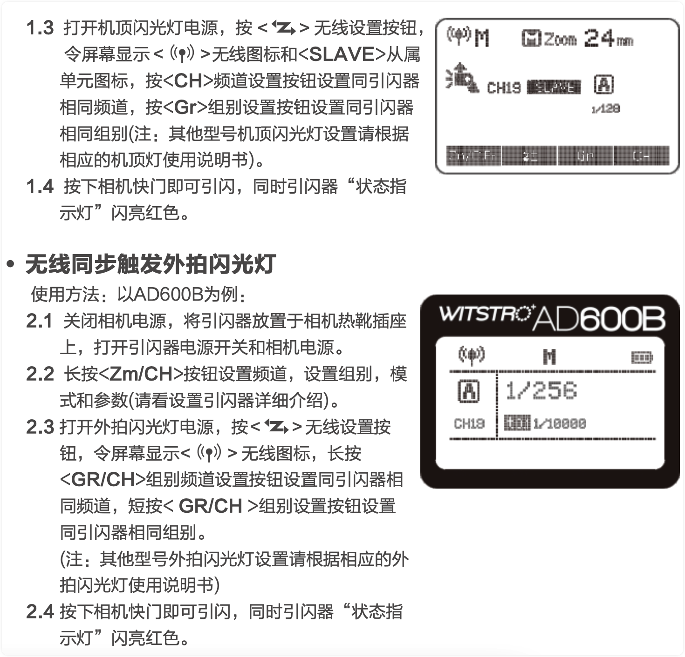
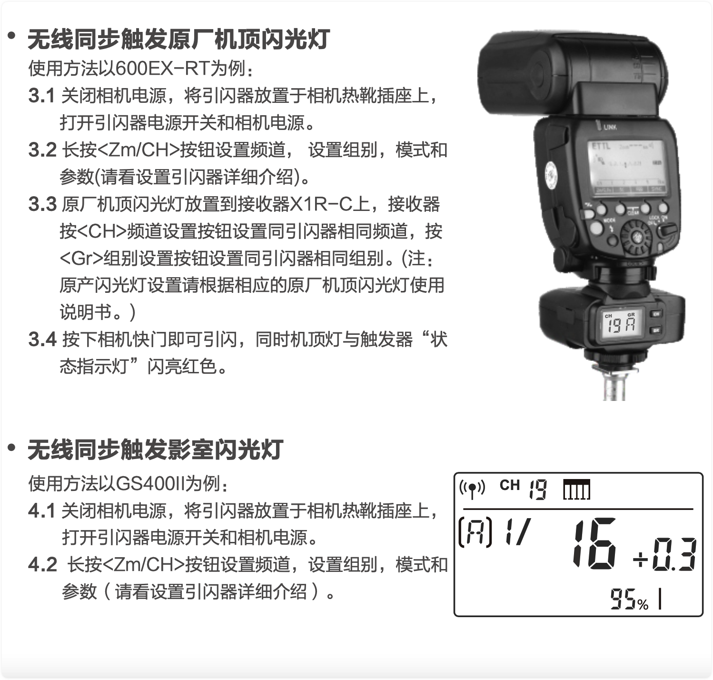
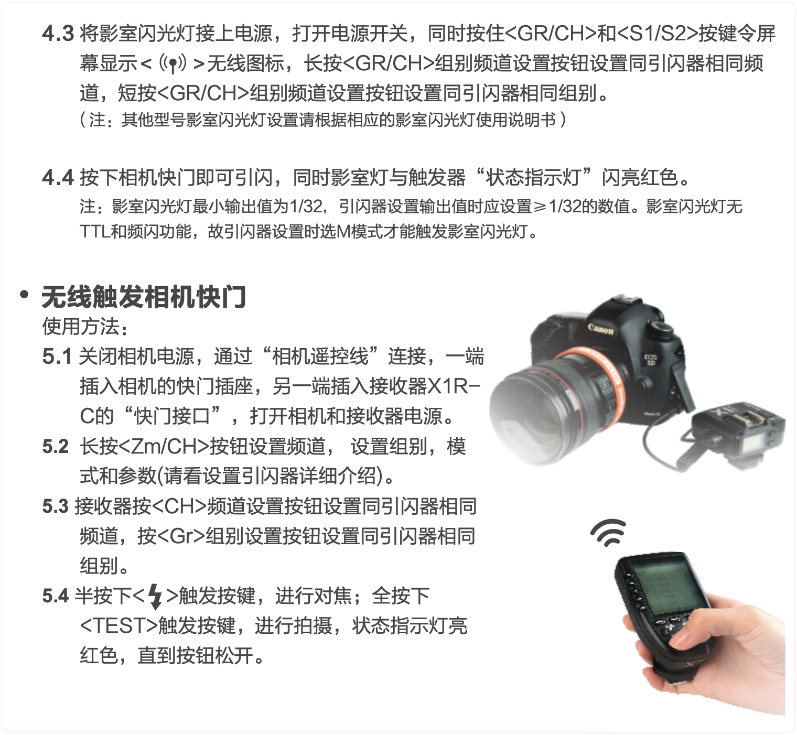
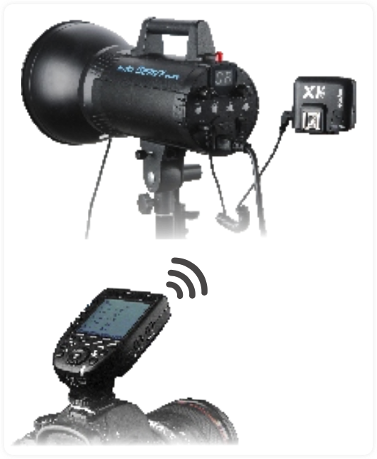
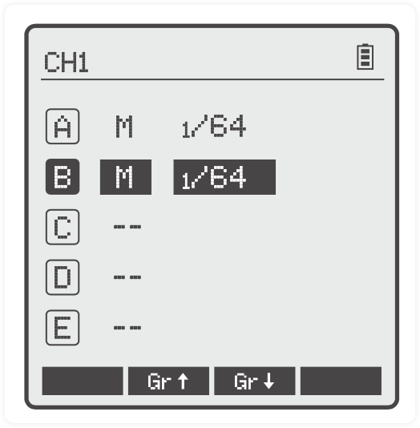
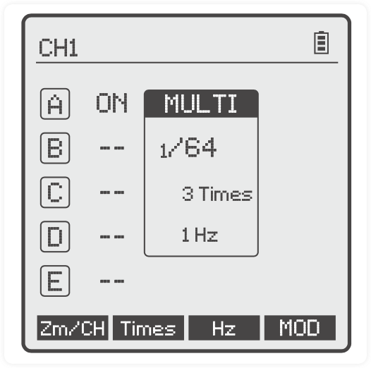
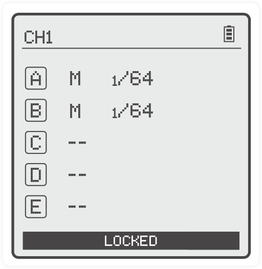
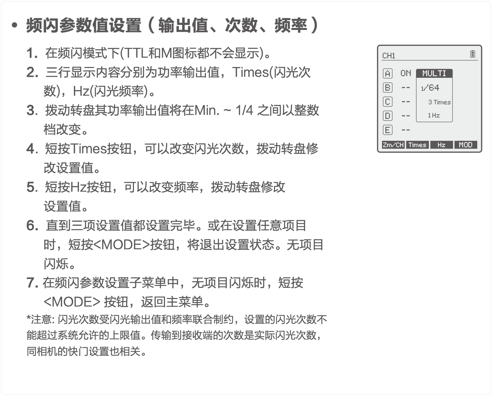

# 神牛引闪器

## 使用引闪器

### 1. 无线同步触发机顶闪光灯
使用方法以TT685C为例:

1.1 关闭相机电源，将引闪器放置于相机热靴插座上，打开引闪器电源开关和相机电源。 

1.2 长按<Zm/CH>按钮设置频道、设置组别、模式和参数。(详情请见“设置引闪器”)。

### 使用2.5mm同步接口触发闪光灯

使用方法:

**6.1** 接收器端连接方式请参考 “无线同步触发影室闪光灯”和 “无线同步触发相机快门”章节。

**6.2** 正常方式按下快门。将使用同步接口信号控制闪光

## 设置引闪器

### 电源开关

把电源开关拨至“ON”即可打开电源，状态指示灯不显示。 注意:长时间不使用时请关闭电源，以免耗电!

### 自动进入省电模式

1. 在停止操作发射器超过 90 秒之后，系统自动进入待机模式，此时LCD显示消失。 
2. 要唤醒系统，可以按任意键。如果安装在 CANON EOS 相机热靴上，也可以通过半按相机快门唤醒系统。 

*注: 若不想进入省电模式，按<MENU>按钮进入自定义菜单，选择STBY设置为OFF即可。*

### AF对焦辅助灯开关

把AF辅助对焦灯开关拨至“ON”，允许输出AF对焦光线。 相机无法对焦时，对焦灯会自动点亮;对好焦，对焦灯会自动熄灭。

### 频道设置

1. 长按<Zm/CH>按钮，频道值会被选中。
2. 拨动拨盘选择合适的频道值。再次按<SET>按钮，当前频道值被选定。
3. 引闪器共32个频道，可以在1-32频道之间切换。使用前请务必将引闪器和接收端置于相同频道。

### 无线ID设置

为了避免干扰，除了改变无线传输频道还可以通过改变无线ID，主控单元和从控单元无 线ID、频道一致才能触发。

 按`<MENU>`按钮进入 C.Fn ID, 按 `<SET>` 按钮选定OFF通道扩展关闭，选01-99其中 任意一数。

*注:神牛现有闪光灯暂无无线ID设置功能, 请把ID设置在OFF状态。

### 模式设置

1. 短按`<MODE>` 按钮，选中组的模式会改变。
2.  当组别设置为5组(A-E):
    - 2.1 多组显示时，按<MODE>按钮，多组模式可以 切换为MULTI模式，按组别选择按钮可以对当 前组MULTI模式设为打开“ON”或关闭 “--”;
    -  2.2 多组显示时，按组别选择按钮或单组模式时按 `<MODE>` 按钮，当前组的模式可以在 TTL/M/- - 模式下顺序切换。

3. 当组别设置为16组(0-F)时，只有手动模式M。 
4. 长按 `<MODE>` 按钮2秒在屏幕的下方出现 “LOCKED”表示屏幕已被锁定，此时不能再设置任何参数，再长按 `<MODE>` 按钮2秒解锁。

### 放大功能
多组和单组切换:在多组模式下选定组别，按<TCM>按钮，组别放大到单组模 式，再按<TCM>按钮返回到多组模式。

### 档位值设置
1. 多组显示时，在M模式下
    - 1.1 按组别按钮选中组别，拨动转盘其功率输出值将在Min~ 1/1 之间以0.3 为增量 改变，按<SET>建确定该组功率输出值;
    - 1.2 按<ALL>全组功率输出值会被选中，拨动转盘其功率输出值将在Min~ 1/1 之间 以0.3 为增量改变，再次按<ALL>确定全组功率输出值。

2. 单组显示时，在M模式下直接拨动转盘其功率输出值将在Min~ 1/1 之间以0.3 为增量改变。

注:Min. 指M或Multi模式下能设置的最小输出值。根据C.Fn-Min 的设置值不同分别为 1/128 或 1/256。在大多数机顶灯上，支持的最小输出是 1/128，无法设置到 1/256。配合神牛公司的AD600等大 功率的影室灯，可以调节最小输出到 1/256。

### 曝光补偿设置
1. 多组显示时，在TTL模式下
    - 1.1 按组别按钮选中组别，拨动转盘其FEC值在 -3 ~ 3 之间以0.3 为增量改变，按 <SET>键确定该组FEC值。
    - 1.2 按<ALL>全组FEC值会被选中，拨动转盘其FEC值在 -3 ~ 3 之间以0.3 为增 量改变, 再次按<ALL>确定全组FEC值。

2. 单组显示时，在TTL模式下直接拨动转盘其FEC值在 -3 ~ 3 之间以0.3 为增量改变。

### 频闪参数值设置(输出值、次数、频率)

