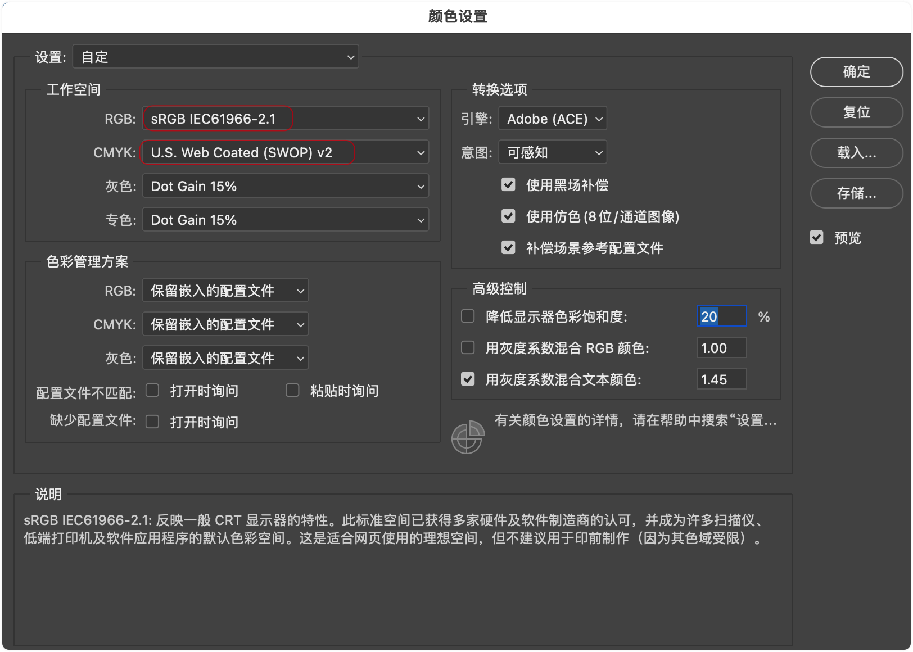
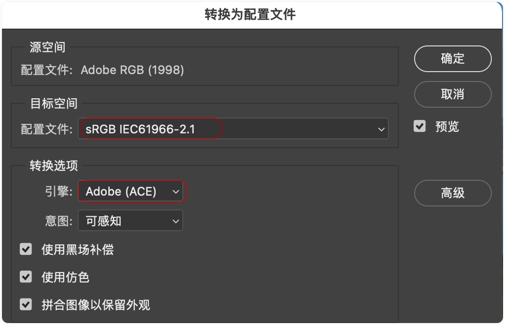
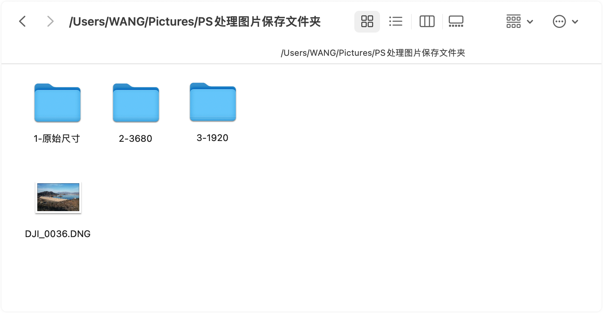
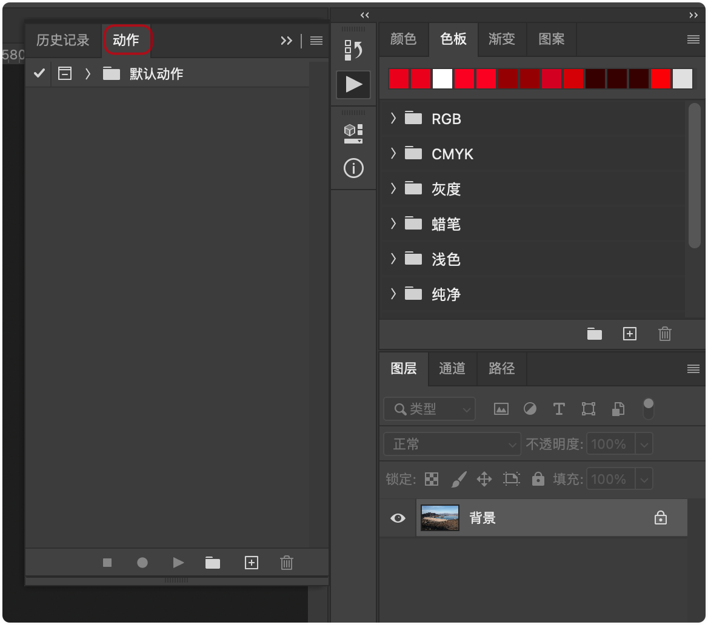

# 02 - 摄影后期基本技巧入门篇

## ▲ 1：如何正确保存图片 (.mp4)

### 1.1 RGB 色彩空间

在 `编辑` -> `颜色设置` 中可以看到图片拍摄时预设的 RGB 色彩空间，和电脑已设置的 CMYK 色彩空间

#### (1) Prophoto RGB

#### (2) sRGB

在 `编辑` -> `转换为配置文件` 可以用来在保存图片时为图片设置不同的色彩空间，但是默认还是建议使用 sRGB，如果使用 Prophoto RGB 或 Adobe RGB，在不支持这种色彩空间的显示器设备中，显示设备会自动把图片转换为 sRGB 的色彩空间，但是这种转换又不像 Photoshop 那样利用算法找到最相近的 sRGB 色彩值，所以会导致图片严重失真。

### 1.2 使用 PS 的`动作`功能生成不同大小的图片

> 补充信息：使用下面讲解的 `动作`功能前，建议先把图片和文件夹按照下面这种格式放好：
>
> 
>
> 原因：下面巫师老师讲解的动作，实际上就是保存了一系列的操作步骤，如果让 PS 复用操作步骤(即:动作)，那第二张要套用动作的图片就必须和第一张图片处在相同的文件夹里，因为已保存动作的路径是固定的。

点击 `窗口` -> `动作` 会打开动作窗口，如下图：

## ▲ 2：一个高效缩放图片的技巧 (.mp4)

## ▲ 3：智能拉直图片 (.mp4)

## ▲ 4：内容识别裁剪图片 (.mp4)

## ▲ 5：蒙板的概念、应用与生成 (.mp4)

> mask `/mæsk/`[us]  -n.掩饰；面具；口罩。-vt&vi.掩饰；遮盖；戴面具。

蒙版 (mask)，直译过来就是面具的意思，在早期的photoshop当中，它也被翻译成遮罩或者是蒙版。如果作为动词，它是遮住的意思，我相信这些不统一的翻译也给很多photoshop的初学者带来很多困惑。

### 示例 (1)

好让我们在photoshop当中看一个例子。 

这个文件有两个图层，

上层是晴朗天空下的草原。

而下层图片是雨后的红色的山石，

在正常情况下。

上层图片完全把下层图片挡住，

所以我们只能看到上面的图片，

而看不到下层图片。

如果我建立一个蒙版，

把上层图片挡住，

那么我们只能看到下层图片，

而看不到上层图片。

选择图层一在下面的菜单中有添加图层蒙版的按钮，

摁住ALT键，

点击这个按钮可以看到。

在上面图层当中photoshop产生了一个黑色的蒙版。

而此时，

上层图片已经看不见了，

完全被黑色的蒙版遮住在蒙版当中，

黑色意味着遮住不显示。

而白色意味着透过显示，

如果我们借鉴刚才汽车喷漆的例子，

在蒙版上我们可以用白色进行绘画。

这样可以显示上层图片的内容，

选择画笔前景色选成白色。

在黑色的蒙版上，

绘画可以将上层图片显示出来，

比如说现在我写二。

01.

漆可以看到，

就像刚才给汽车喷漆一样，

上层图片透过白色的蒙板显示出来。

摁住alta点击蒙版，

可以看到蒙版的形状，

这就是刚才我写到的2017。

蒙版的最主要功能就是部分显示当前的图层，

白色代表显示黑色代表隐藏。

当然，

在实际的操作当中，

我们很少创造2017这样的蒙版。

让我们先恢复到创建蒙版之前。

就眼前这个例子，

上层图片是晴天的蓝天白云，

而下层图片是阴天的山石，

我们可以很容易的利用蒙板。

为下层图片换上蓝天白云。

让我们看一下如何操作，

首先把蓝天白云的照片放在上层，

然后用一个黑色的蒙版全部遮住。

我们只需要把这个黑色蒙版的天空部分变成白色上层图片的蓝天白云，

自然就可以显示出来。

选择背景图层。

用快速选择工具。

很快的选择，

下层图片的天空部分。

这个时候，

天空部分已经被选择出来，

可以看到在天空部分周围有一圈已形线。

点击上层的黑色蒙版。

用画笔工具。

确保我的前景色是白色，

对天空部分进行涂抹。

啊，

可以把画笔选择的大一些。

可以看到，

随着我的涂抹，

上层的天空显现出来，

再次按住ALT键点选蒙版。

可以看到，

这个时候我们的蒙版形状是这样子的，

我们还可以。

把一些蒙版的细节再仔细修饰一下。

这个时候，

我们巧妙的使用了蒙版，

把两张图片的不同内容拼接起来。

我们采用了上层图片的蓝天跟下层图片的岩石，

让我们对比一下前后效果。

这是调整之前。

这是调整之后。

这是我们蒙版的形状。

记住白颜色代表显示，

黑颜色代表遮住对于上层图片来说，

白颜色显示了蓝天的部分。

而遮住了下层草地的部分，

那我们再看一个例子。

这张照片是一个人物照。

我想压暗人物四周的画面，

而保持人物脸部的亮度不变。

这个时候用蒙版可以非常轻松的做到这一点，

我们可以新建一个曲线调整图层可以看到。

在任何新建调整图层的时候，

photoshop自动的会产生一个白色的蒙版，

这也意味着对这个调整图层做任何调整。

会作用到下面图层的全部画面好，

我们这个时候压按图片把曲线往下拉。

可以看到，

整张画面都变得暗淡起来，

而我只希望画面的周围变暗，

而人物的主体保持原来的亮度。

我们只需要用黑色在蒙版上遮住人物的脸部。

确保变暗的效果，

不要作用在蒙版上好，

我们可以选择画笔。

把画笔的硬度降为0%选一支非常柔软的画笔。

然后确保我们的前景色是黑色。

确保我们选定的是蒙版。

这个时候我们只需要用黑色在蒙版上绘画就可以了。

这是调整之后。

这是调整之前可以看到画面的周围都已经被压暗了，

当然我们可以继续的调整一下人物的手臂。

然后手臂也不要这么按。

好，

再看一下效果调整之后。

调整之前按住ALT键点选蒙版。

可以看到，

这是当前蒙版的形状。

由于我们这个例子仅仅是需要强调主体蒙版的形状，

不需要非常的精细。

当然，

你也可以精确的控制蒙版的形状，

使得蒙版准确的遮住人物的脸部，

这个时候。

可以按下键盘的反斜线键盘，

可以看到这个时候photoshop用红颜色遮住了画面的局部。

而这个红颜色就代表了你当前蒙版所遮住的范围，

此时。

仍然用黑色在蒙版上绘画，

你就可以很清楚的知道当前的绘画位置与图片的相对关系。

比如说。

我想非常精确的控制整个人物。

注意，

这个时候红色并没有任何意义，

只是告诉你蒙版的范围在哪里。

再次点选图片可以切换到正常的显示，

让我们来看一下之前和之后的对比，

这是调整之后。

这是调整之前可以看到画面的周围被成功的压暗了。

那我们看第三个例子。

这张照片略有欠曝。

我们希望把人物的脸部稍微的提亮一些。

我们当然可以用刚才的方法选择一个曲线层。

然后把画面提亮。

photoshop默认的产生的是一张白色的蒙版，

由于我们只希望提亮面部，

这个时候我们可以。

摁ctrl I把整个白色蒙版变成黑色的蒙版，

然后用一张白色的画笔。

在人物的面部涂抹。

这个时候就可以起到。

只把面部提亮的作用。

这是调整之后。

这是调整之前。

提亮的程度可能太过了。

稍微的下降一点。

前后对比一下。

我们当然可以采取另外的方式，

这个图层删掉，

我们可以先对面部进行选择，

比如说我们选用快速选择工具。

对人物的面部进行非常快速的选择，

不需要非常的精细，

可以看到这个时候我很快的形成了面部的选区。

然后。

直接建立一个曲线的调整图层，

可以看到在有选区的情况下，

当建立调整图层时。

photoshop自动的会根据选区产生一个蒙版。

这个时候，

蒙版的形状是这样的，

跟我们刚才的选区是一致的。

这就意味着，

这个曲线调整图层的调整的结果仅仅会作用在该蒙版的。

白色区域也就是我们面部的区域。

让我们来调整一下这个曲线好，

我们把曲线提亮。

可以看到，

在这个时候，

曲线仅仅改变了。

人物的面部，

而对画面的其他部分没有影响，

让我们做一下前后对比。

曲线仅仅作用在人物的面部，

但是这时候有一个问题，

如果我们放大图片可以看到。

在蒙版的交界处，

发生了非常生硬的变化。

我们这个时候也可以看一下蒙版的形状，

再次看一下蒙版的形状。

可以看到，

蒙版的边缘是非常锋利的。

这也是为什么我们发生了颜色的突变，

这个时候可以通过对蒙版的羽化来解决。

选择调整图层的蒙版。

可以看到，

在属性对话框出现了羽化的选项，

我们可以拖动羽化。

到一定的像素，

这个时候生硬的分界线已经不见了，

那我们来看一下羽化后的蒙版是什么样子的？

这是羽化以后的蒙版。

这是羽化之前的蒙版，

是有非常生硬的分界线，

我们增加羽化半径，

可以看到，

随着羽化半径的增加。

蒙版的分界线变得越来越模糊，

而这些模糊的分界线可以带来非常自然的过渡。

让我们看一下前后对比，

这是调整之后。

这是调整之前。

可以看到，

人物的面部被有效的提亮了，

而且非常自然。

调整之后调整之前。

好让我们再看一个例子。

这也是张人物照。

我想做的是增加整张图片的饱和度，

很显然我可以选择调整图层，

然后选择自然饱饱和度。

我可以增加饱和度的滑块。

那么，

做一下前后对比，

可以看到整张图片的饱和度都被增加了。

由于我们人眼对肤色非常的敏感，

这个时候皮肤的颜色已经失真了，

我们想去除饱和度对皮肤部分的影响。

很显然，

我们只需要用黑色的画笔，

在白色的蒙版上绘画，

遮住皮肤的部分。

选择画笔，

确保我们的前景色是黑色的，

用黑色的画笔。

在人物的面部进行绘画。

把手这里给做一些处理人物的皮肤，

部分耳朵都可以做一些处理。

这个时候我们可以摁住反斜线键。

看一下我们现在蒙版的位置。

确保覆盖到人物的全部的范围。

同时不要。

覆盖到蓝色的衣服，

所以我们只需要用黑色和白色在蒙版上绘画就可以，

很轻松的控制。

让上层的效果作用于画面的哪一个部分？

所以这是我们调整之后。

这是调整之前可以看到，

除了人物皮肤以外。

画面的饱和度有明显的增加，

摁住alt选择蒙版可以看到，

这是当前蒙版的形状。

那我们再看一个例子。

这张照片是一个户外的人物照，

我想做的是把孩子衣服的颜色换掉选择。

调整图层选择色相饱和度，

选择色相饱和度，

这只小手的按钮。

可以看到，

鼠标变成了吸管的形状，

用这个吸管点击你希望改变的颜色，

比如说我在它的衣服上点击一下。

这个时候我只需要改变色相就可以了，

比如说我想把它的衣服改成黄颜色。

再稍微黄一点，

在这个时候，

不仅衣服变成了黄颜色，

部分的地面，

小孩子的鞋以及背后的背景都变成了黄颜色。

让我们做一下前后对比。

可以看到地面。

孩子的鞋，

裤子，

衣服，

甚至部分的背景的颜色都被改了。

而我只希望颜色的变化只局限在孩子的衣服上，

所以我需要建立一个蒙版。

只把上层的变化局限在孩子衣服的范围，

选择上层的白色蒙版摁下ctrl I，

把它全部切换成黑色。

代表这个时候全部遮住，

我只需要用白色的画笔。

在小孩子衣服的范围内绘画就可以了，

放大一点。

选择合适的画笔大小。

简单的绘画就可以了。

我们当然也可以用快速选择工具来更加精确的选择这个范围。

我们也可以摁下反斜线键。

看一下当前蒙版的范围，

确保我们的蒙版是覆盖了全部，

我们想覆盖的内容。

并且没有覆盖，

我们不想覆盖的内容。

所以摁一下x切换一下前景色背景色用。

黑色在蒙版的外侧会画。

确保我们的蒙版遮住了我们全部想遮住的范围。

好，

透过很简单的方法，

我们成功的实现了换颜色。

这个时候你可以。

随便拖动上层的调整，

图层继续为孩子的颜色进行选择，

所有的选择。

只会。

作用在蒙版范围之内，

很简单的把它调成绿颜色。

调整之前调整之后，

这个时候我们可以摁住alt点选蒙版，

看一下蒙版的形状。

所以主要记住，

蒙版是透过黑色和白色来控制，

当前图层是否作用在下层。

白色意味着当前图层完全作用在下层，

而黑色意味着当前图层完全被遮住，

没有作用在下层图层。

所以蒙版是控制当前图层局部作用，

在下层的一种手段使用蒙版，

我们可以对画面进行局部的调整。

可以用画笔使用黑色和白色，

在蒙版上绘画就可以创造出不错的蒙版，

当然有时候我们可以用更加简便的方法。

来创造更加贴切的蒙版，

让我们看回第一个例子啊，

首先删除上面的。

涂层恢复到原始画面。

刚才我是用快速选择工具，

非常快的选择了天空部分，

并且把天空部分换成了另外一张画面的内容。

而现在我想做的是我想压暗这张照片，

所有明亮的部分包含了明亮的天空以及部分水面，

明亮的倒影。

这个时候产生如此形状复杂的蒙版，

用一般的方法就比较困难，

我们可以很巧妙的用预值来做到这一点。

取消选择调用一个调整图层预值，

这个时候画面变成了黑白两色。

调整预值的滑块可以控制黑白色的范围，

很显然当画面的元素大于这个滑块。

所处的位置在画面当中呈现的是白色的，

而当画面的亮度低于该滑块，

所处的位置。

在画面当中呈现的是黑色的，

所以透过这个滑块可以很方便的控制。

图像黑白的范围。

假设我们现在调整到这个范围，

刚才我们说了，

蒙版其实就是透过黑色和白色来控制画面的效果，

是否作用在下层图层？

所以眼前的这张黑白画面就可以作为我们的蒙版，

全部选择这张画面，

然后选择编辑。

然后选择合并拷贝。

好，

这个时候这张画面就已经拷贝到剪贴板当中去了。

此时，

预制图层已经没有用了。

这时候，

我们把预制图层删掉。

这个时候，

我们可以新建一个。

曲线调整图层，

摁住alt选择photoshop自动产生的白色蒙版，

这个时候是全白色的。

代表的曲线调整的效果会全部作用在下层，

图层，

这个时候我们选择编辑，

选择粘贴。

就可以把刚才放在剪贴板当中的黑白图像作为蒙版拷贝到曲线的调整图层当中。

这个时候只需要压暗曲线就可以压暗整个画面，

当中所有明亮的部分。

让我们做一下前后对比。

当然，

这个时候画面有一个缺点。

画面产生了非常生硬的变化，

我们看一下蒙版。

可以看到，

这个时候蒙版的过渡是非常非常生硬的，

我们可以透过羽化来解决这个问题，

所以增加羽化的。

范围大概可以增加到这个范围，

可以看到这个时候。

过渡就比较自然了。

我们透过用预值产生了一张比较复杂的黑白画面，

作为蒙版。

非常快速的压暗了整张画面，

当中比较明亮的部分，

所以透过蒙版，

我们可以实现对画面的局部调整。

## ▲ 6：如何创建焦外光斑效果 (.mp4)

## ▲ 6：什么是快速蒙版 (.mp4)

## ▲ 7：用曲线获取极致对比度 (.mp4)

## ▲ 8：如何用曲线调色 (.mp4)

## ▲ 9：什么是剪贴蒙版 (.mp4)

## ▲ 10：用色彩范围建立选区和蒙版 (.mp4)

## ▲ 11：用色阶改变影调 (.mp4)

## ▲ 12：四种降噪方法大比拼 (.mp4)

## ▲ 13：极致锐化—USM锐化深度解析 (.mp4)

## ▲ 15：神奇的内容感知填充 (.mp4)

## ▲ 16：智能填充详解 (.mp4)

## ▲ 17：用保留细节扩大图片 (.mp4)

## ▲ 18：复杂边缘物体的选择 (.mp4)

## ▲ 19：快速生成平滑锋利的选区 (.mp4)

## ▲ 20：如何去除画面中任何元素—彻底掌握仿制图章 (.mp4)

## ▲ 21：用背景橡皮擦进行完美抠图 (.mp4)

## ▲ 22：用LUT调色 (.mp4)

## ▲ 23：用黑白调整图层获得生动色彩 (.mp4)

## ▲ 24：增加水印最有效的方法 (.mp4)

## ▲ 25：如何获取高动态范围的天空 (.mp4)

## ▲ 27：如何模拟电影感色调画面 (.mp4)

## ▲ 28：迅速获得生动的蓝天 (.mp4)

## ▲ 29：如何任意改变颜色 (.mp4)

## ▲ 30：为画面添加任意滤镜效果 (.mp4)

## ▲ 32：分区光影重构 (.mp4)

