#  Photographing Composition (摄影构图学)

Ben Clements and David Rosenfeld

本·克来门茨 & 大卫·罗森菲尔德 

译：姜雯 & 林少忠 & 李孝贤

## New Words

| 单词          | 美式发音          | 词类 + 汉语释义                                              |
| ------------- | ----------------- | ------------------------------------------------------------ |
| photograph    | `/ˈfoʊtəɡræf/`    | n. 照片；摄影作品。v. 拍照                                   |
| photographing | `/ˈfoʊtəˌɡræfɪŋ/` | v. 拍照；摄影（photograph 的现在分词） - Architectural`/ˌɑːrkɪˈtektʃərəl/` Photographing 建筑摄影 - No Photographing 严禁拍照 |
| photographic  | `/ˌfoʊtəˈɡræfɪk/` | adj. 摄影的；用摄影法的。 - photographic file 摄影胶片 - photographic equipment 摄影器材 |
| photographer  | `/fəˈtɑːɡrəfər/`  | n. 摄影师                                                    |
| photography   | `/fəˈtɑːɡrəfi/`   | n. 摄影；摄影术                                              |

## ▲ 原序 ix

在视觉艺术的语汇中，恐怕没有比“构图”这个词更使摄影人员望而生畏的了。学习摄影和学习绘画不尽相同。学习绘画的人在学习素描、画法和画画设计的同时就在学习构图，而摄影人员则是首先把注意力焦中在掌握相机、用光和冲洗上面。他们只有在能够准确调焦、正确曝光、掌握胶卷和相纸的性能，并能掌握冲洗的技术和技巧之后，才有时间来考虑构图问题。尽管如此，他们都早已不断地从更有经验的摄影人员那里听到，并从摄影出版物中看到“构图”这个词了。

因此，当摄影者开始对构图方面的文献作认真研究的时候，他们对于自己在这方面的欠缺是不无顾虑的。然而，很多论述构图的文章与著作却只能使原有的顾虑加重一层。因为它们的论述方法不外乎是下述种种：

一．作者从分析古代著名画家的作品出发，引伸出以金字塔式角锥形、S 形曲线、对角线、L 形等为基础的一系列大大简化的公式化模式。这些东西不论和当代摄影作品的面貌，还是我们所看到的周围世界，可以说都是毫不相关的。这种指导是学究式的。当摄影者必须从面对着的一片杂乱无章的细节中挑选出主题，但又感到无计可施的时候，这种指导是没有任何帮助的。因为这种模式的局限性太大了，它恐怕更适用于文艺复兴时期和巴罗克艺术风格时期的绘画，却不适用于今天的摄影或绘画。

二．把题材有趣、构图巧妙的照片发表出来，并附上摄影者拍摄过程的详尽说明。这实际上是在鼓励读者跑到同样或相似的拍摄地点去，按照原作的拍摄条件重演一遍，求得和原作相同的拍摄效果，然而，这种盲目的模仿是极其有害的。

三．著作家用图解的方法来分析优秀构图中的点、线、面，而这些东西对照片本身往往没有什么关系；它们只不过对分析者本人有意义罢了。遗憾的是，这种分析方法在读者身上产生出的最明显的效果竟是对分析者超乎寻常的尊敬和羡慕。在初学者的眼里，这些看不懂的图解就像是一套魔术，只有少数有幸具有某种妙诀的特殊人才才能表演。而这些妙诀一条没有传授给读者。

四．由注重心理学的艺术家来介绍和分析图象的视觉结构，然后又应用到形式和空间问题上。这些当然是非常之好的，不过，它们只是为那些高水平的艺术家服务的，他们熟悉完形心理学用语，而且在长期的研究和实践中已经掌握了设计工作的要点。有一种人在构图学名词方面很有学问，而在构图的内容和实践方面则很少造诣，如果对摄影构图求知心切的人听了他们的夸x夸其谈，就只能更加灰心丧气。

所有这些办法、效果都不好。因为任何一个人，只要肯下功夫，几乎都能把构图的理论和本领学到手。大部分知识都是从理性的、易于理解的原理得来，而这些原理通常都已经直觉地认识到了。在学习过程中，人们不禁会感到关于构图形式的研究，不过是对长期以来已经不自觉地领悟到的知识，作出明确的解释而已。和图片打交道，并经过一段时期体验的人，只要有了前进的信心、预期的目标和评价构图的标准，是可以通过正常的推理来解决他所遇到的问题的。

**本书的目的，是考察在摄影中对艺术创造起作用的那些要素和原理**。为此，我们逐个探讨了它们的性质，它们在视觉作用中的某些特征，并说明了如何把这些特征在摄影艺术中加以运用。

我们相信，**深刻认识这些特性，能够加强我们对周围世界的敏感性**。**在理解了形状、线条和质感的概念，懂得了它们在对比和节奏方面的相互作用之后，我们对自然界的观察才更敏锐。只有在深受一种艺术力量的熏陶之后，我们才能充分地意识到它的存在**，甚至在它部分地隐藏或伪装起来的时候，我们仍然可以感觉到它。有了这种意识，我们能认识到那些缺乏素养的人无法认识的东西；有了这种意识，我们对生活中看到的东西，以及对于别人抒发生活意义的作品，都会产生更强烈的感受。

**强烈的感受能力，常常有助于探索拍摄对象的外在形象和内在品质。在处理外在形象时，富于创造性的人们在拍摄对象的外形上能够发现一般人难以发现的特点、美点和情趣。对于拍摄对象的内在品质，则着意于挖掘和刻划那些深藏着未被认识的内在感情，而不局限于清楚再现景物的形象。每个艺术家都力求用一种前所未有的方式来表现他对于某种情景的个人感受**。

**研究摄影构图，当然也可以采取分析整个照片的方法。然而，根据我们的体会，如果对有关要素和原理缺乏深刻的理解，这种分析也是徒劳的。要求一个缺乏洞察力的人去说明一幅照片的成功所在，就好比要求他去发现自然界中那些值得拍摄的主题，几乎是同样困难的**。

因此，我们在本书中的探讨是带有综合性的。在每一章中，我们先讨论构图的某一要素，然后把它直接运用于整个照片中，并讨论它和前面学过的内容之间的关系。我们相信，当读者理解了每一要素和原理在构图中的作用以后，就会对所发现的任何主题都能有所感受，并且能够以构图的手段来表达自己的这种感受。

本·克莱门茨

大卫·罗森菲尔德

## ▲ 第一章 艺术和摄影 1

### 一、艺术形式的不断变化 1
艺术之所以成为艺术，与它所用的材料和工艺之间，只有一部分关系。 它的最重要的特点还是在于艺术家从题材中提取基本视觉美点并以感人的方式再现它们的才能。

自从人类开始重视绘画、雕塑和美化环境以来，每次关于艺术的讨论， 总不免要引出一个使哲学家们一直为难的问题：为什么一件作品可以称为艺术品，而在许多方面都和它相似的另一件却不是？人们提出过许多理论和解释，但随之而来的却是同样多的争议和反驳。这个问题的关键是从根本上混淆了以下三个方面：
（1）艺术和自然的异同

（2）视觉形象思维和文字概念的区别

（3）艺术和手艺的关系

### 二、艺术和描绘自然 2

### 三、艺术和抽象的视觉美点密切相关 6
并不是说， 题材丑陋反而能保证拍出成功的照片。美的题材经常能产生美的照片。**问题的关键是，艺术效果完全取决于艺术家是否从这个题材中发现了和感觉到了抽象的视觉美点，以及处理它们的能力；经过这番处理观众才能看到艺术家曾经看到过的东西，激发出和艺术家同样的感情**。

**按照艺术家的观点，自然存在的事物无所谓美和丑。正是艺术家，才能有能力发现美的本质，并把它展示给人们**。    *PS：（个人观点）所以这真的是艺术家的观点，自然界的动植物本身就是美的。*

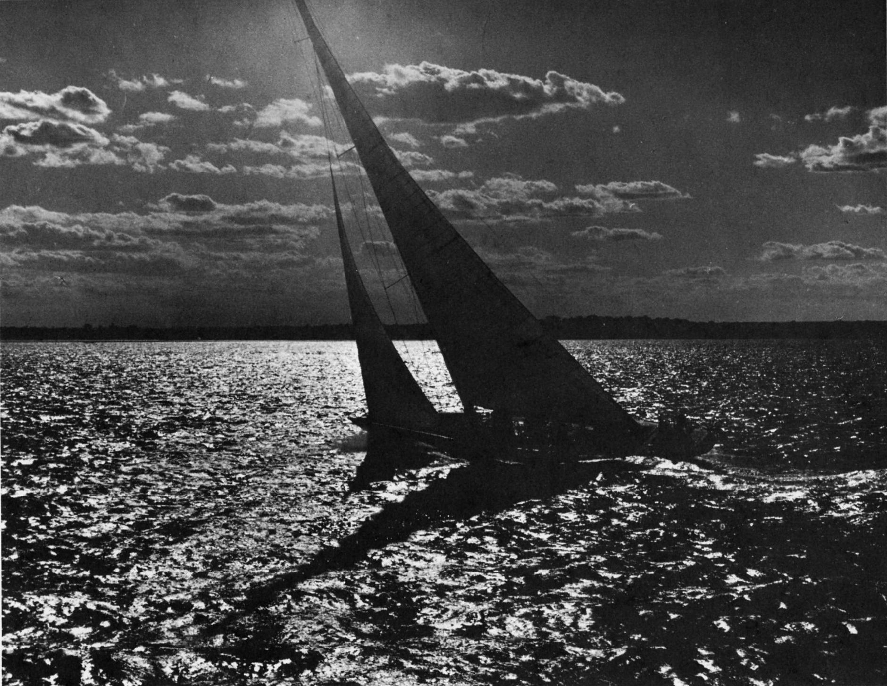

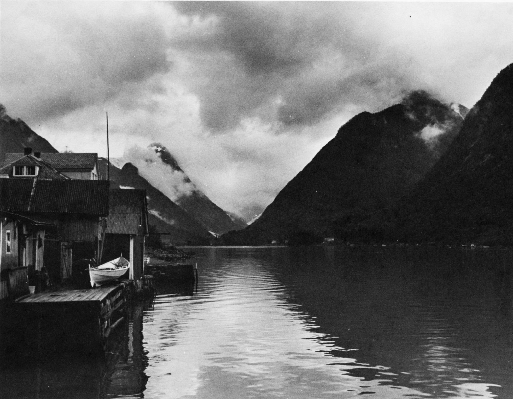

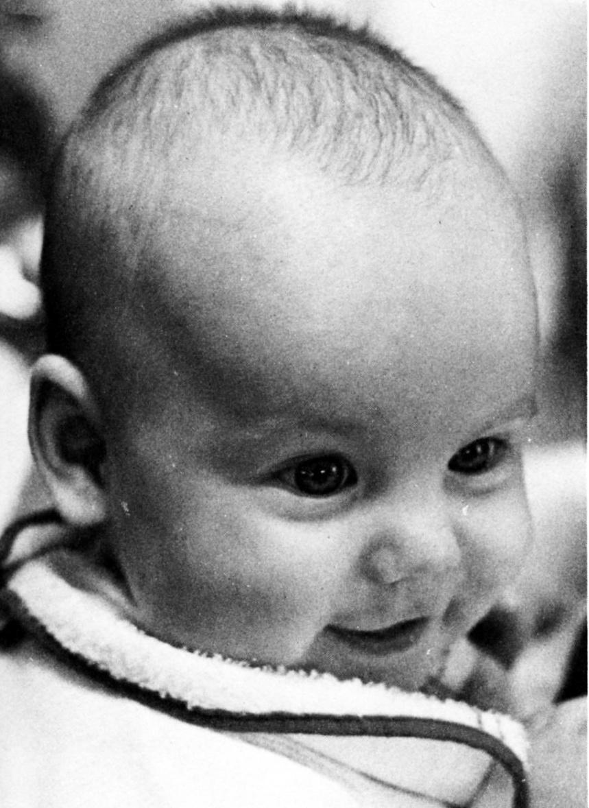

现在，问题明确了。**艺术品的质量和自然物的面貌关系很少。题材里固有的美并不一定等于照片是动人的。艺术品是由某种抽象的美点构成的，它和机械地模仿自然是两回事**。惟妙惟肖不能作为艺术品的出发点，也不是评价艺术品的标准。**==事实上，效果最好的照片，是既不违背自然形式，又力求高度简化，敢于大胆处理线条、 色调、形状和质感的那些作品。艺术就是汲取这些最本质的视觉美点，使之处于突出地位，剔除那些妨害中心思想的成分，或使之处于次要地位==**。

这类视觉美点，在我们周围到处都有，占我们日常生活的比重很大，以致我们大多数人竟然对它熟视无睹。**每一个题材，不论它是平淡无奇还是宏伟壮丽，它都包含着几乎无限量的视觉美点**。有时它只存在片刻，稍纵即逝。有时它藏在极普通的外表下面，貌不惊人，难以辨认。**事实上这隐藏着的视觉美点才是真正神奇有趣的东西**。

**从题材中发现这类线条、色调、形状和质感，把它们纳入取景器，以摄影家完全满意的方式加以处理，随后制成照片，使观众对这些视觉美点也能一目了然。这就是构图的全部内容**。

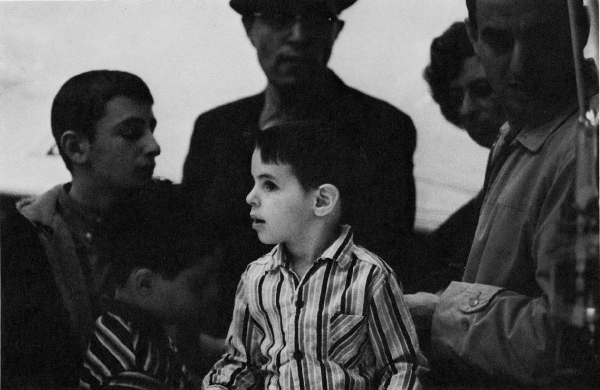

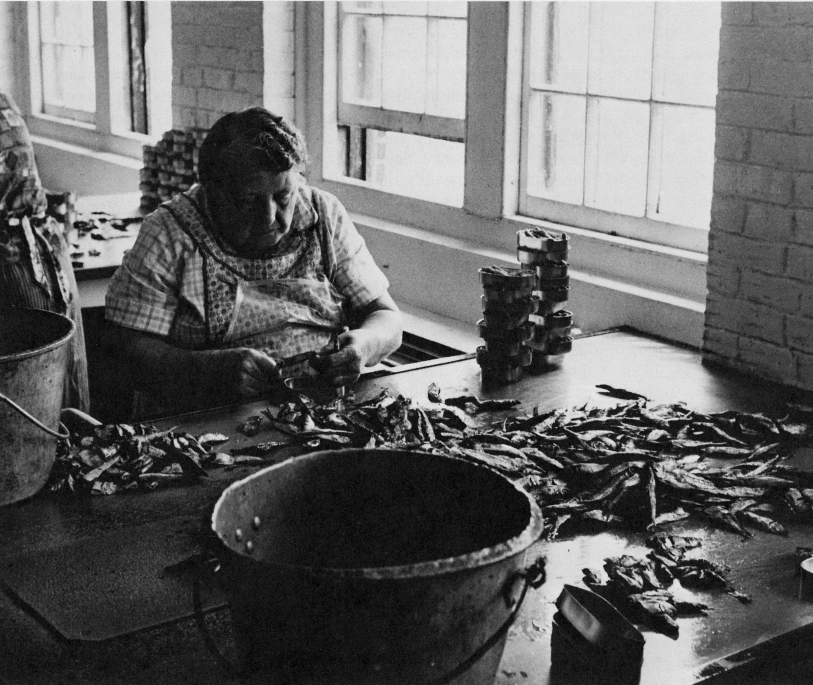

虽然有时候照片里看到的东西难以解释，简直象是魔术一样，但有许多东西仍然是可以弄清楚的。**有些摄影家生来就是很敏感，他们能在看来无所作为的地方一下子发现奇迹**。**有些人需要经过一番启发才能认识潜在的视觉因素**。然后也能不太费事地发现它们。**大多数人则必需给以系统的教育，提高他们认识视觉美点的敏感性，用这种方法培养他们的辨别能力**。

### 四、构图——从混乱中找出秩序 10
**构图是一个思维过程，它从自然存在的混乱事物中找出秩序；构图是一个组织过程，它把大量散乱的构图要素组织成为一个可以理解的整体；构图是对这些要素的反应过程，也是想方设法组织这些要素的过程，目的是让这些要素向人们传达摄影家已经体会到的兴奋、 崇敬、畏惧、惊异或同情。构图所表现出来的气氛，有时是平静的，有时是有力的或坚定的，有时也可能是活跃的。题材本身会向摄影家展示出所要表达的情绪**。

**==通过构图，摄影家澄清了他要表达的信息，把观众的注意力引向他发现的那些最重要有趣的要素==**。

**`构图方法和构图语言`**并没有什么神秘之处，也**`没有什么条文可以遵守`**。 **`要理解构图，参与构图实践，就必须对几千年来艺术领域里人所共知、行之有效的那些普遍原则有所理解`**。

关于构图方法，没有像技术资料那样现成的表格、汇编、手册可供利用。若干年前，有人曾想把构图方法汇编成书，把金字塔式的角锥形、圆形以及车轮辐射形等基本构图形式收录其中。显然，有些古代大师在他们的一些绘画中已经使用过类似构图形式。迄今为止，曾经产生过多少杰出的绘画和摄影作品，但是，如果企图按照某种基本格式去分析它们的构图，那么，分析的结果，与其说是一目了然，倒不如说是强词夺理。

**那些企图使构图符合一定模式的摄影家必定会发现，所得到的如果不是老框框，就是给作品加入了牵强附会的成分，这种模式对于我们增长本领起不了多大作用，正像我们引用名词术语打动不了听众一样**。

**这样的构图，即使安排得十分工整，面面俱到，由于不可避免地过分雷同，也必然令人生厌。因此，这种构图模式是否有用，值得怀疑**。

**另一方面，单凭直觉构图，或许能产生一些值得一看的作品，但在更多的情况下，这种做法带有偶然性，不能保证把摄影家的思想传达给观众**。

### 五、摄影中的冒牌美术 11

在摄影和美术的关系方面，那些对摄影和绘画都懂得很少的人，有把这两种表现手段混淆起来的危险。他们没有能力用颜料在画布上绘出满意的作品，于是就转而想用相机来获得貌似美术的效果——界线模糊、情绪低沉、朦胧不清、像图画一样，使人想起科罗（1）和他的模仿者的风格。这些吹嘘成“印象主义的”风景照，多年来在本地和全国沙龙里展出。可能至今还有追随者们热衷于搜罗古老的“药方”，想从中找到怎样处理负片和照片才能达到这类效果。

- (1) 让·巴蒂斯特·卡米耶·柯罗的画作赏析：https://www.zyzw.com/sjmh025.htm

随着绘画界几何抽象派、抽象表现主义、流行艺术派和极少派的出现， 摄影界兴起了一些假冒美术家的摄影者，他们同样是摄影的亵渎者。但他们模仿的不是古代的而是现代的绘画。他们处理影象时，也泼洒化学药品，使用颜料，硬加与摄影无关的材料，用这些办法求得肤浅的抽象艺术效果。

当然，绝对纯正又未免过于简单和拘束。但是，**在摄影光学、用光和化学处理方面仍然大有可为的情况下，根本没有必要去乞灵于模仿。 如果有些人不愿局限于直接使用相机、镜头、负片和照片冲放技术，可以去探索物影照相，多次曝光，光调器和照片剪辑等类形式**。

**==抽象艺术和抽象的视觉要素是不同的两个范畴==**。**抽象艺术是绘画和雕塑发展中的一个流派，它是作为对科学写实主义的反动而出现的。 首先它强烈地突出线条，其次是使用色彩的组合，目的是追求美学效果，而不是描绘自然**。此后，立体派发展起来了，大量不同形式的抽象派作品随之出现。那些认为立体派和抽象派作品是现代风格的人，一旦得知立体派竞肇始于 1908年的时候，一定会大吃一惊的！

从某种意义上说，抽象派作品的动机是想证明：只需要运用线条、明暗、颜色、形状、质感等抽象要素就可以制造出大量丰富多彩的绘画，而和现实世界的主题很少有或者根本没有关系。现在，这种论点早已被充分论证过了，而且经过长期流行，人们也感到厌烦了。**看来现代艺术观点又要和写实主义发生联系；然而这是和过去的风格迥然不同的一种写实主义。这种写实主义倾向于非常强烈地强调抽象要素，正是这些抽象要素，构成了各个视觉艺术——包括摄影以及绘画、印刷艺术和雕塑在内的——基础**。

自从人类开始装饰环境、衣服和工具以来，这些抽象要素就曾对每一种艺术形式的成功有过贡献。它们还要继续成为世界不同文化中的艺术的支配力量。

虽然 **==自然界的某些方面==** 经常是人类艺术的模特儿，但 **==在美学上成功的程度却直接关系到所强调的要素，即线条、形状、颜色、立体感和质感==**。**优秀的艺术品一般说来都是能够反映自然界这些要素的**。拙劣的作品，几乎都是只会模仿自然存在之物，很少注意或根本不去注意这些要素。

**==任何一种艺术，如果它自觉或不自觉地模仿其它艺术的话，那它就是否定了自己作为一种艺术的价值==**。摄影家如果用摄影器材去产生别人用颜料或雕刻工艺已经生产过的东西，那他就是把13自己降于劣等地位，他的艺术作品（如果可以叫做艺术作品的话）也就是劣等的。

**如果一把一张照片弄得象是油画、版画或蚀刻画，那是对摄影这种严肃手段的践踏**。

### 六、视觉形象思维和文字概念 13

美术家涉及的是视觉形象，音乐家涉及的是音响，作家涉及的是文字。 让这种表现方式去发挥那种表现方式的作用，是一个错误。

也许因为我们所受的教育大部分是通过文字进行的，我们总是习惯赋予照片以文字含意。好奇心驱使人们固执地注意着照片里的所谓感情上或道德上的暗示，也许还有它后面的浪漫故事。因为我们认为艺术品本身就具有文字含义，所以我们要寻找“画面以外的文字”来向我们自己或向别人解释艺术家的意图。

然而，**==有意义的“画面以外的文字”是不存在的。摄影家的信息纯粹是视觉的。照片中表现的任何含意只能看，不能读==**。

**即使对一幅照片的艺术价值作口头解释，也有可能夸大某一特点的重要性，而同时歪曲了所有各部分之间微妙的和谐关系，充其量不过是简单化地理解艺术家的意图**。

人们在评论蒙德里安的一幅几何形体派绘画时经常这样说：它包含着垂直线条和水平线条，它们互相交叉而形成大小不同的矩形，有些是纯黑色，其它一些是纯红色或纯黄色。所有这些，于对任何一个愿意劳神看一眼的人都是十分清楚的。对蒙德里安的这幅画所作的评论，不仅适用于他的其它作品，而且也适用于和他同时代其它艺术家的作品，即使每幅作品各自完全不同。

这些评论，实际上只是一般地谈到了蒙德里安作画的宗旨、作画的方法以及这一画派的主张。很难说这些评论会增进对某一幅作品的欣赏能力。这些评论既不能使欣赏蒙德里安的人得到什么要领去证实自己的正确，也不能说服不喜欢这些作品的人改变他们的看法。

在摄影方面也是这样。照片只能依靠它的视觉美点给人以深刻印象。搜集有关的主题的或处理方法的奇闻逸事，对艺术的价值不起作用，它只能引起混乱。

下面这些照片只需要通过视觉就可以传达它们的信息。

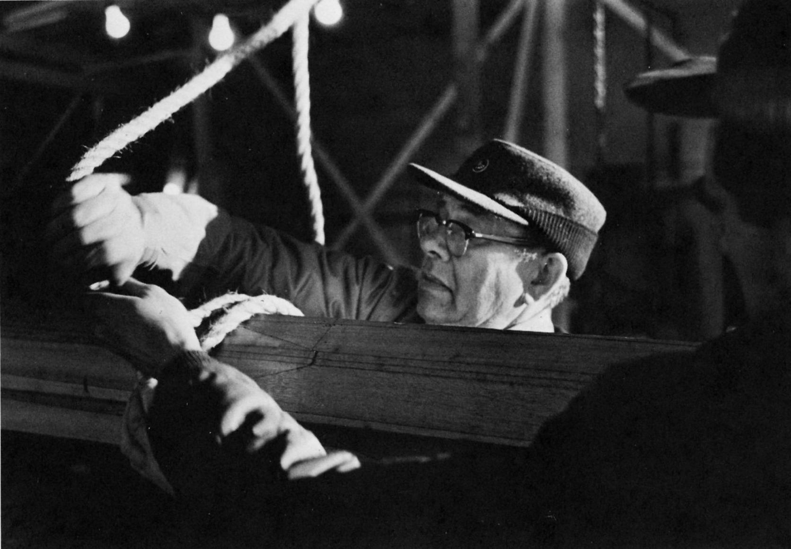

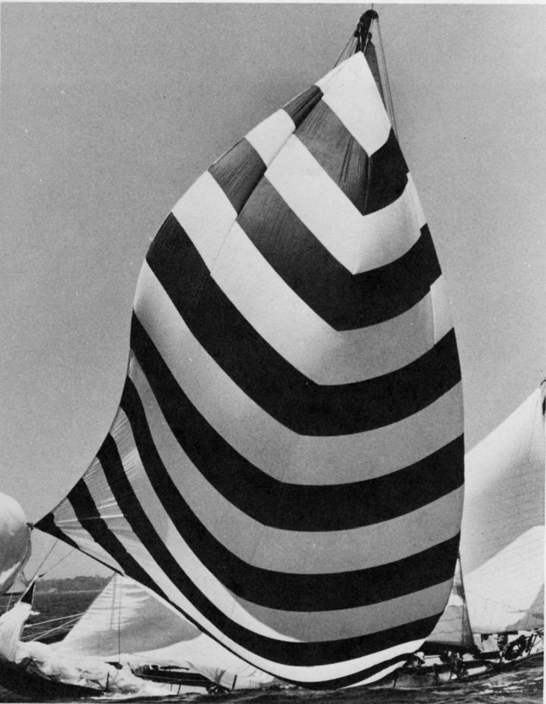

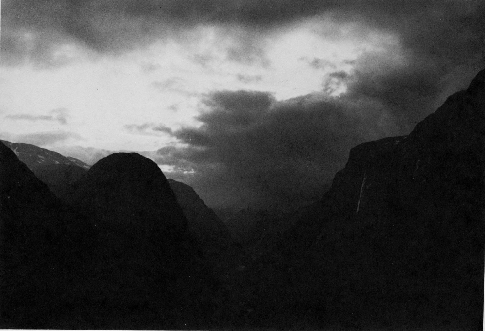

它们并非来自文字概念，也不要指望会有什么语言反应。照片已经表达了要说明的一切，无须任何文字补充说明。

成年人看到这些令人兴奋的线条、形状、色彩和质感的时候，也能重新体会到儿童时代才有的那种愉快心情。

### 七、艺术和手艺 17

为什么手艺和艺术经常被混为一谈，基至有时把手艺看作是艺术的同义语，这是很容易理解的。

初次尝试一种活动，往往因为动作不协调而受挫折。工具好像太笨，毛病百出。由于缺乏技术，整个工作搞糟了。观察了熟练工作的表演，容易夸大灵巧的操作和出色的产品之间的关系，从而得出错误的结论，认为二者是一回事。

**==一个人如果不能同时成为一个高超的艺匠，他就不可能成为一个艺术家==**。如果一件作品的设想是好的，但它的制作水平很低，那么设计的目的就难以达到。**为了创作具有艺术效果的作品，有趣的设想和完美的技术是缺一不可的**。但不能认为一个具有高操技术的艺匠就是一个艺术家。做家具的木工是一个很好的例子，足以说明这一点。

使用优质的木材，把所有榫头对正安好，油漆打磨到毫无瑕疪的程度， 就能造出一个柜子来。但最后成品可能并不好看。同样地，一个摄影者能够拍出一张技术上完美的照片来，曝光和印放都可能是无懈可击，令人羡慕的，甚至构图也可能很紧凑，但从全面衡量，这幅照片除了和它有直接有关的人员以外，也许不会吸引任何人。

**摄影艺术家不仅应该是一个超级艺匠，而且还要继续深入钻研，提高自己的技艺。甚至应该象二十世纪的画家一样，达到一个相当高度的水平，达到能够自由运用自己技艺和智慧的地步，甚至可以大胆运用有时近乎粗劣的创作手法**。

许多艺术家富有挑战性的性格，他们喜欢反驳那些已被公认为正确的和基本的东西。他们改变了透视关系，随意处理比例关系， 虚构不可能的场面，用假设的自然光源安排互相矛盾的照明，打破已有的色彩协调关系。反传统主义成为大多艺术家(如果他们原来的风格不是反传统主义的话)所追求的倾向。

下面几幅照片都没有遵守摄影技术的主要原则，结果是获得了更有力、更可爱、更动人的效果。

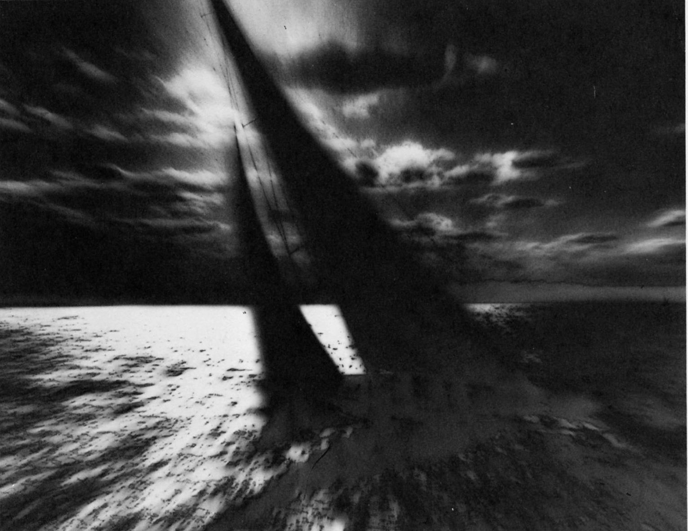

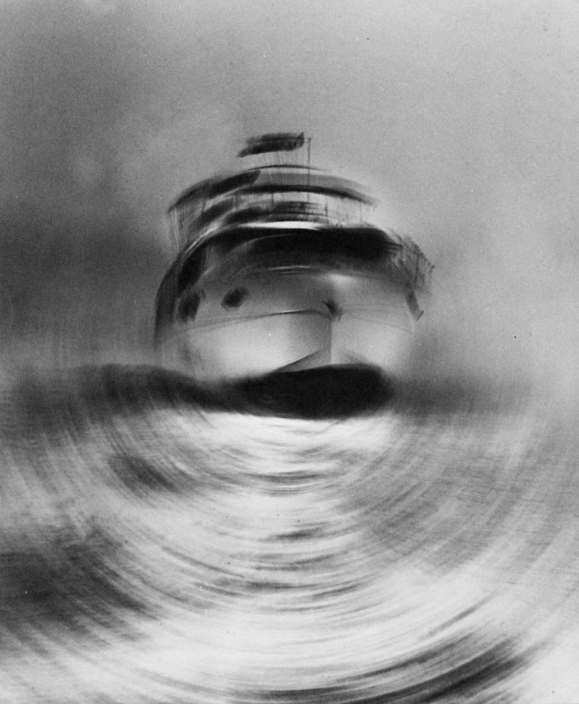

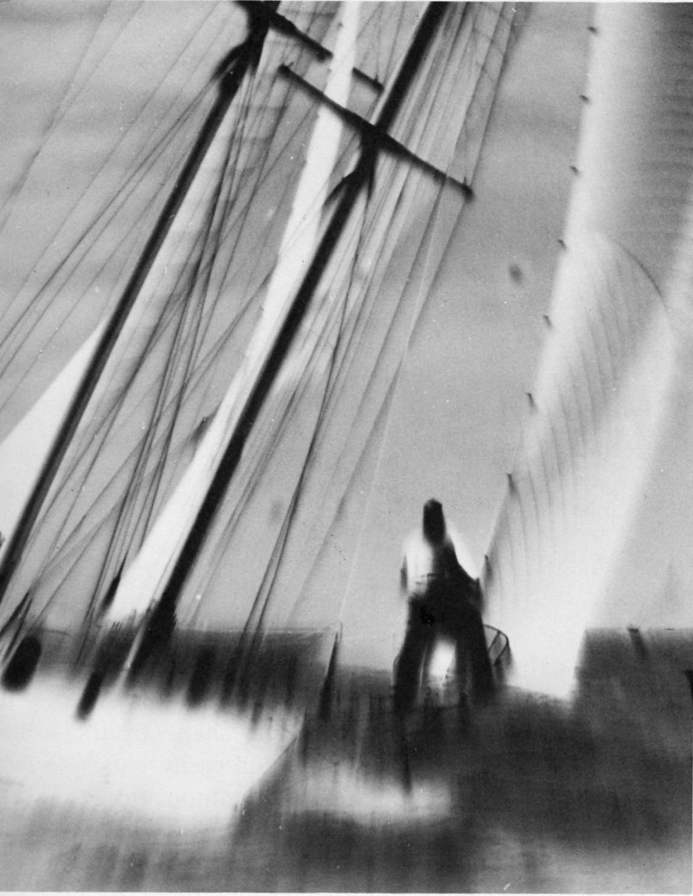

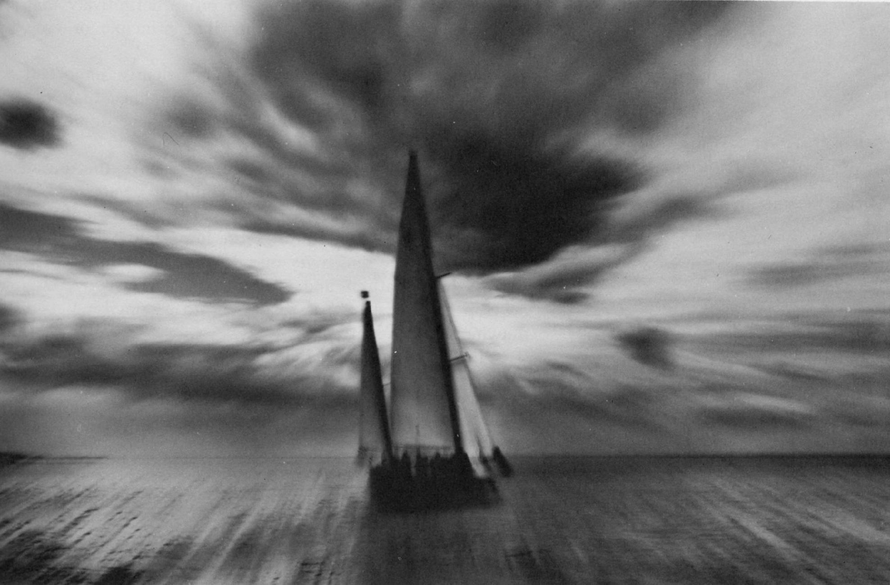

## ▲ 第二章 形状 20

### 一、画面和图形的相互关系 21

### 二、形状的创造 26

### 三、对自然界各种形状的观察 27

### 四、自由形状和复合形状 31

### 五、减图造形法 33

### 六、增图造形法 33

### 七、剪纸造形法 34

### 八、烧纸造形法 34

### 九、随意造形法 34

### 十、单个形状的拍摄 35

### 十一、 直观构图 36

### 十二、 两个或多个形状的构图 37

### 十三、 空间的划分 39

### 十四、 各种艺术风格的相互依存关系 43

### 十五、 规则形状和不规则形状相结合的构图 44

### 十六、 表现各种形状的照片 45

## ▲ 第三章 线条 ——不存在的事实 48
### 一、对自然界和人造物中线条的观察 48

### 二、理解线条的特性 51

### 三、线条的语汇 51

### 四、画面中的线条 58

### 五、线条的象征性联想作用 62

### 六、轮廓线或边线 64

## ▲ 第四章 明暗 ——摄影的要素 67

### 一、照片的质量 68

### 二、明和暗的造型作用 68

### 三、灰色级谱 70

### 四、高调和低调 71

### 五、对自然界明暗的联想作用 74

### 六、明和暗在美学上的运用——气氛 76

### 七、明暗配置 79

## ▲ 第五章 质感 84
### 一、触觉鉴别 84

### 二、触摸欲望 85

### 三、质地激起的情感反应 85

### 四、触觉和视觉的相互关系 85

### 五、视觉质感 86

### 六、工具和质地 90

### 七、自然界的质地 92

## ▲ 第六章 立体感 102
### 一、空间对气氛的塑造作用 103

### 二、在平面上表现立体物 103

### 三、实心立体物和空心立体物 104

### 四、形状和立体物 104

### 五、意义不明确的轮廓 107

### 六、立体性质的表现 109

### 七、用轮廓线表现立体感 113

### 八、立体物的相互关系 114

### 九、户外题材的立体感 116

### 十、自然界的立体感 118

### 十一、 深度空间和浅度空间 119

### 十二、 含蓄的立体感 120

### 十三、 肖像和人体摄影的立体感 122

## ▲ 第七章 设计原理 124

### 一、构图手段 124

### 二、构图方法 126

### 三、个别原理之间的各个有关方面 128

### 四、先入之见的构图模式 130

### 五、图片分析 131

### 六、心理学的探讨 132

## ▲ 第八章 趣味中心 133
### 一、树立单一的主要概念 133

### 二、视觉的选择性 136

### 三、从属景物 136

### 四、突出表现一个景物 137

### 五、背景的作用 139

### 六、复合趣味中心 144

## ▲ 第九章 布局 147
### 一、单一物体的布局 147

### 二、人像摄影的布局 151

### 三、布局对摄影意图的强调作用 156

### 四、指出着重点 161

## ▲ 第十章 对比 ——利用差异进行对比 164
### 一、利用大小进行对比 166

### 二、利用明暗进行对比 170

### 三、利用形状进行对比 176

### 四、利用方向进行对比 177

### 五、利用情绪进行对比 181

### 六、利用质感进行对比 183

### 七、利用思想和内容进行对比 185

## ▲ 第十一章 节奏 ——格局和步调 187

### 一、通过相似点形成和谐感 188

### 二、节奏 190

### 三、节奏的视觉快感 191viii

### 四、重复形成的节奏 192

### 五、间隔的重复 197

### 六、复合结构 198

### 七、交替形成的节奏 201

### 八、渐变形成的节奏 203

### 九、辐射形成的节奏 206

### 十、中轴线上的辐射 208

### 十一、 视觉的动感 211

### 十二、 含蓄的运动 212

### 十三、 随意线条中的节奏和动感 213

### 十四、 随意形状中的节奏和动感 216

## ▲ 第十二章 揭开平衡的真象 218
### 一、对称平衡 219

### 二、平衡的传统观念 220

### 三、非对称的平衡 222

### 四、物理力和视觉力感 225

### 五、假想垂直中轴线的顽固性 227

### 六、稳定的必要性值得怀疑 229

### 七、用直觉处理平衡关系 229

## ▲ 第十三章 统一 ——拍摄意图的单一性 230
### 一、从单数到多数 230

### 二、拍摄对象在主题中的统一 236

### 三、相似形状和相似方向的重复 238

### 四、通过组合求统一 240

### 五、统一的多变性 245

### 六、通过对比求统一 246

### 七、通过一体化求统一 246

### 八、明和暗的统一 249

### 九、通过流畅线条求统一 250

### 十、背景对统一感的作用 253

## ▲ 第十四章 结束语 255
