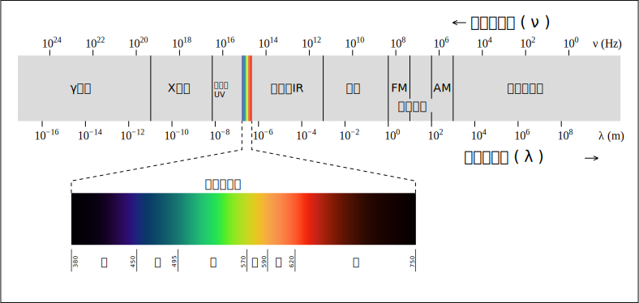

# 电磁辐射

> 完整讲解见 wikipedia: https://zh.wikipedia.org/wiki/%E9%9B%BB%E7%A3%81%E8%BC%BB%E5%B0%84#cite_note-1

**电磁辐射**是由源[传递](https://zh.wikipedia.org/wiki/輻射)[电磁场](https://zh.wikipedia.org/wiki/電磁場)能量到空间的现象[[1\]](https://zh.wikipedia.org/wiki/電磁輻射#cite_note-1)，其[波动](https://zh.wikipedia.org/wiki/波)形式为[电磁波](https://zh.wikipedia.org/wiki/電磁波)。电磁波在空间中以[波](https://zh.wikipedia.org/wiki/波)的形式传递[能量](https://zh.wikipedia.org/wiki/能量)和[动量](https://zh.wikipedia.org/wiki/動量)。[经典电磁学](https://zh.wikipedia.org/wiki/经典电磁学)里，电磁波由[同相](https://zh.wikipedia.org/wiki/相位)[振荡](https://zh.wikipedia.org/wiki/振荡)的[电场](https://zh.wikipedia.org/wiki/電場)与[磁场](https://zh.wikipedia.org/wiki/磁場)组成。在均质且[各向同性](https://zh.wikipedia.org/wiki/各向同性)的介质中，电场与磁场的振荡方向互相垂直，并且垂直于波与能量的传播方向，形成[横波](https://zh.wikipedia.org/wiki/横波)。

电磁辐射的[量子](https://zh.wikipedia.org/wiki/量子)形式是[光子](https://zh.wikipedia.org/wiki/光子)。电磁波不需要依靠[介质](https://zh.wikipedia.org/wiki/介质)进行传播，在[真空](https://zh.wikipedia.org/wiki/真空)中传播速度为[光速](https://zh.wikipedia.org/wiki/光速)。电磁波可按照[频率](https://zh.wikipedia.org/wiki/頻率)分类，从低频率到高频率，主要包括[无线电波](https://zh.wikipedia.org/wiki/無線電波)、[微波](https://zh.wikipedia.org/wiki/微波)、[兆赫辐射](https://zh.wikipedia.org/wiki/兆赫輻射)、[红外线](https://zh.wikipedia.org/wiki/紅外線)、[可见光](https://zh.wikipedia.org/wiki/可見光)、[紫外线](https://zh.wikipedia.org/wiki/紫外線)、[X射线](https://zh.wikipedia.org/wiki/X射線)和[伽马射线](https://zh.wikipedia.org/wiki/伽馬射線)。人眼可接收到的电磁波，[波长](https://zh.wikipedia.org/wiki/波長)大约在380至780[nm](https://zh.wikipedia.org/wiki/奈米)之间，称为可见光。只要是本身温度大于[绝对零度](https://zh.wikipedia.org/wiki/絕對零度)的物体，除了[暗物质](https://zh.wikipedia.org/wiki/暗物質)以外，都可以发射电磁辐射，而世界上并不存在温度等于或低于绝对零度的物体，因此，人们周边所有的物体时刻都在进行电磁辐射。尽管如此，只有处于可见光频域以内的电磁波，才可以被人们肉眼看到，对于不同的生物，各种电磁波频段的感知能力也有所不同。

# 电磁辐射常识

> 笔记来源：https://www.huiyang.gov.cn/hyqzdlyxxgk/hjbh/hyfsaqxx/content/post_2460429.html

## 1、什么是电磁辐射？

对辐射一般的理解就是**由源向空间外传播的现象**，如太阳通过辐射将热能传递到地球，篝火将热能向周围辐射等等，那么电磁辐射就是电磁由源向空间外传播的现象。

在《电磁兼容术语》（GB/T4365-1995）中，对电磁辐射是这样定义的：**能量以电磁波形式由源发射到空间的现象，或能量以电磁波形式在空间传播**。

电磁辐射是一种物质，就像我们身边的衣服、食物、江河、空气等物质一样，只不过它们不是固态、液态，也不是气态的，而是以一种看不见、摸不着的特殊形态存在。

我们人类本身就处在各种电磁辐射的包围之中。人类生存的地球本身就是一个大磁场，天然磁场、太阳光、家用电器等都会发出强度不同的辐射。从某种意义上说，如果人的生存环境完全摆脱了电场、磁场，那么人类将无法适应。

## 2、电磁辐射是如何产生的？

我们知道，物体间相互作用的力一般有两种：一种是通过物体的直接接触产生的，叫做接触力。如摩擦力、碰撞力、推拉力等。另一种是不需要接触就可以发生的，这种力叫做场力。例如，电力、磁力、重力等。

电荷的周围存在着一种特殊的物质，叫做电场。它跟固态、液态、气态的物质不一样，看不见、摸不着，是一种特殊形态的物质。两个电荷之间的相互作用并不是电荷的直接作用，而是一个电荷的电场对另一个电荷所发生的作用。也就是说，在电荷周围的空间里，总是有电力在作用。因此，我们将有电力存在的空间称为电场。磁场是电流在其所通过的导体周围产生的具有磁力的一定空间。

电场和磁场是相互联系、相互作用，同时并存的。由于交变电场的存在，就会在其周围产生交变的磁场；磁场的变化，又会在其周围产生新的电场。它们的运动方向互相垂直，并与自己的运动方向垂直。这种交变的电场和磁场的总和，就是我们所说的电磁场。

这种变化的电场和磁场交替地产生、由远及近，并以一定速度在空间传播的过程中不断向周围空间辐射能量，这种辐射的能量称为电磁波，这种能量以电磁波形式由源发射到空间的现象称为电磁辐射。

## 3、为什么说电磁辐射完全不同于核辐射？

电磁辐射与核辐射完全不同。核辐射是指来自于原子核的辐射，通过射线辐射能量。影响人类的核辐射主要有三种，即α、β、γ射线。而电磁辐射来自于电磁场，以电磁波的形式在空间传播。有的人谈及辐射就以为是核辐射，或者把电磁辐射等同于核辐射，从而以为电磁辐射也存在严重危害，这是不正确的。

## 4、电磁辐射有什么作用？

电磁辐射可谓神通广大，在很多地方都能见到它的身影。具体应用的地方有：

（1）医学应用：微波理疗活血，治疗肿瘤等

治疗肿瘤的天线或辐射器可以将温度控制在只杀死癌细胞的很窄温度范围内。电磁辐射热疗利用电磁能使局部组织升温，提高血液循环，促进新陈代谢而达到治疗的目的。

（2）传递信息：通信、广播、电视等

通信主要有微波通信和长、短波通信，如手机、卫星电话。此外还有利用长、短波进行通信，如对讲机。广播是将声音变成电流，然后通过发射天线以波的形式传播出去。

（3）目标探测：雷达、导航、遥感等

雷达工作原理是发射机向探测的目标发送脉冲波，该脉冲波遇到探测目标能反射回来，于是就能测出反射波和发射机之间的时间间隔，从而得知探测目标与雷达所在地点的距离。

（4）感应加热：电磁炉、高频淬火、高频熔炼、高频焊接、高频切割等

利用中、长波波段的高频电磁场能量使导体或半导体本身发热，达到热加工的目的。

（5）介质加热：微波炉、微波干燥机、塑料热合机等

将非导体置于强电磁场内，其带正电与负电的分子或原子在交变电磁场的作用下，以这个电场的频率震荡，“摩擦”而引起发热，达到加工的目的。

（6）军事应用：电子战、电磁武器等

如海湾战争，美国首先查明了伊拉克军队使用的信号频率，然后用相同频率发出功率更强的信号，致使伊拉克军队的通信中断指挥不畅、雷达迷盲、武器失控而陷入被动。

## 5、电磁辐射强度用什么单位表示？

通过对电磁辐射概念的了解，我们知道电磁辐射其实是一种能量，它对环境的影响大小主要取决于能量的强弱，用来表量其强度大小的单位主要有：

（1）功率　辐射功率越大，辐射出来的电、磁场强度越高，反之则小。功率的单位是瓦（W）。

（2）功率密度　指单位时间、单位面积内所接收或发射的高频电磁能量。功率密度的单位是瓦/米2（W/m2）。例如，“40瓦/米2”可以简单理解为1平方米面积上接受到40瓦的电磁能量。在高频电磁辐射环境评估时功率密度常用MW/cm2表示。

（3）电场强度　是用来表示空间各处电场的强弱和方向的物理量。距离带电体近的地方电场强，远的地方电场弱。电场强度的单位是伏/米（V/m），在输电线和高压电器设备附近的工频电场强度通常用kV/m表示。

（4）磁场强度　是用来表示空间各处磁场的强弱与方向的物理量，它的单位是安/米（A/m）。

（5）磁感应强度　表示单位体积、面积里的磁通量，用于描述磁场的能量的强度，单位是特斯拉或高斯（T或Gs）。

## 6、电磁辐射频段如何分类

电磁场跨越的频率范围十分广阔，从工频（50Hz/60Hz）至微波段，与通信方面的作用差别很大，因而对人体健康的影响后果差别也很大。

通常电磁波的频谱可粗略划分为工频（50Hz/60Hz）、射频或高频（103~108 Hz）和微波（>109 Hz）三个频段。
