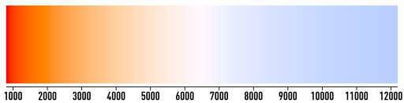
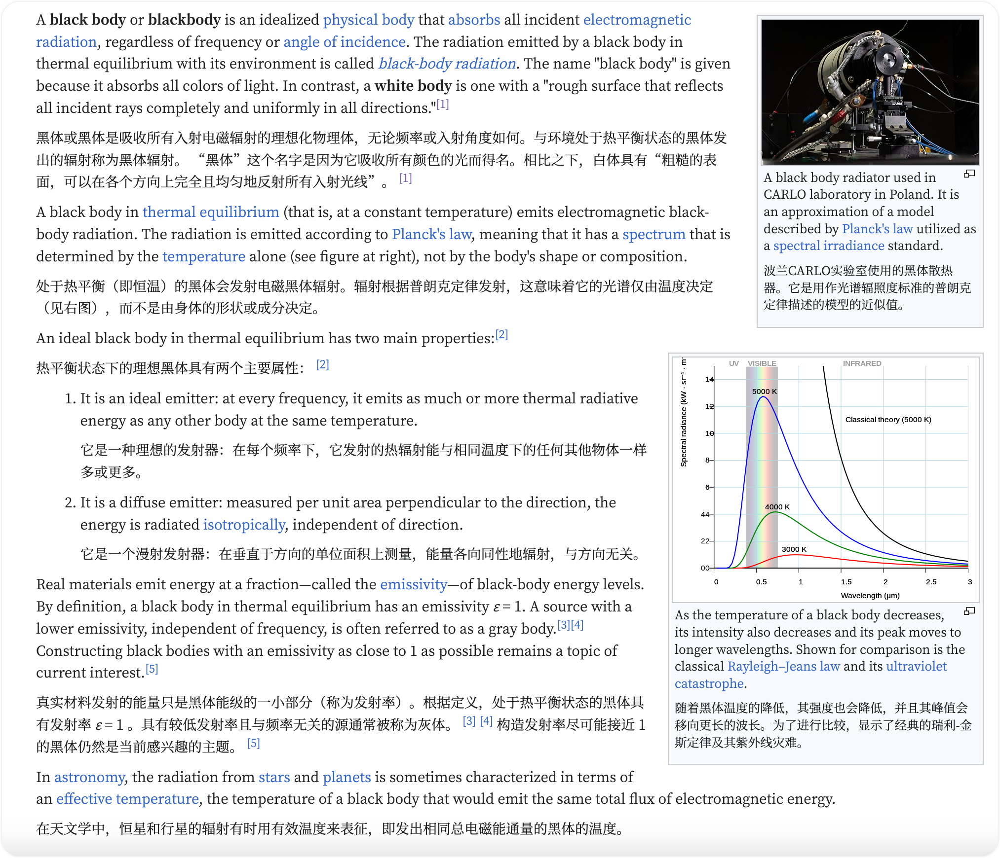
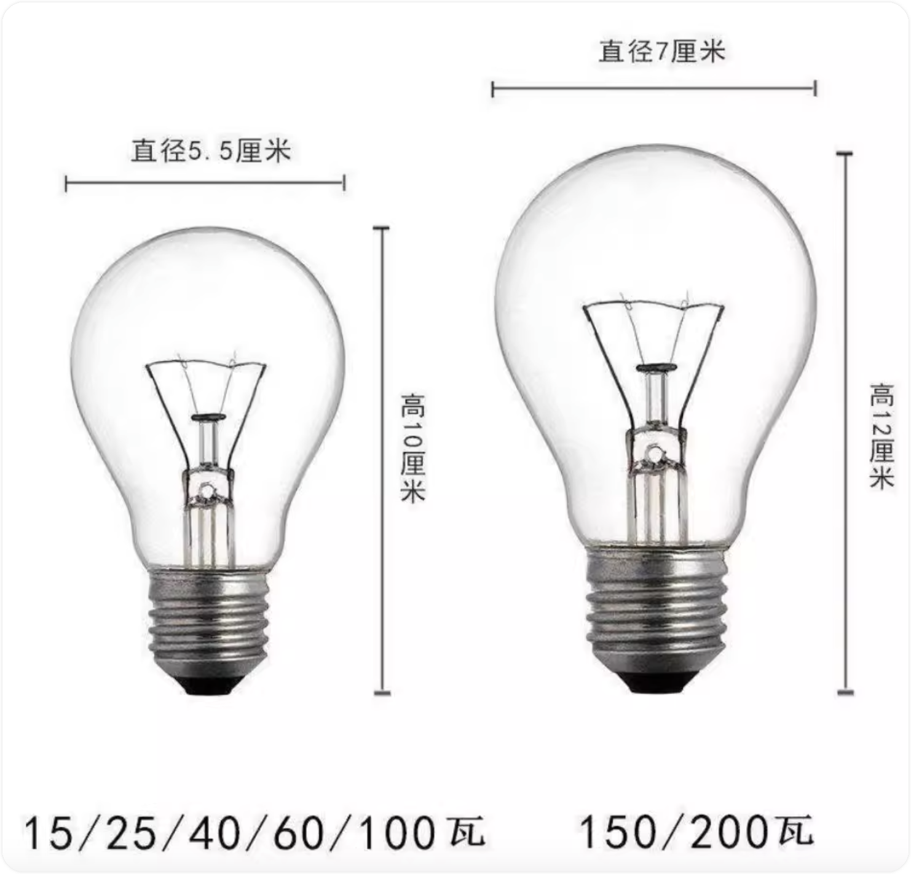
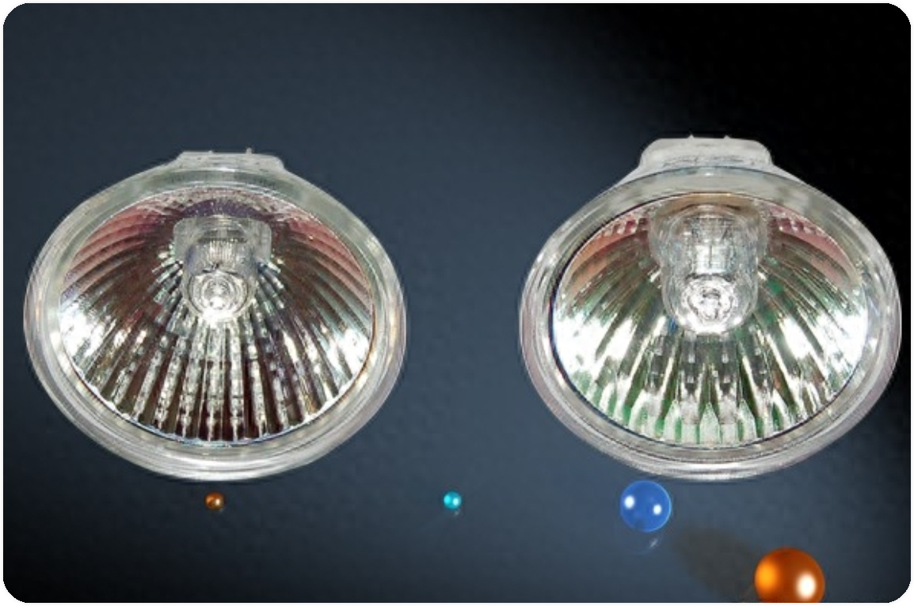
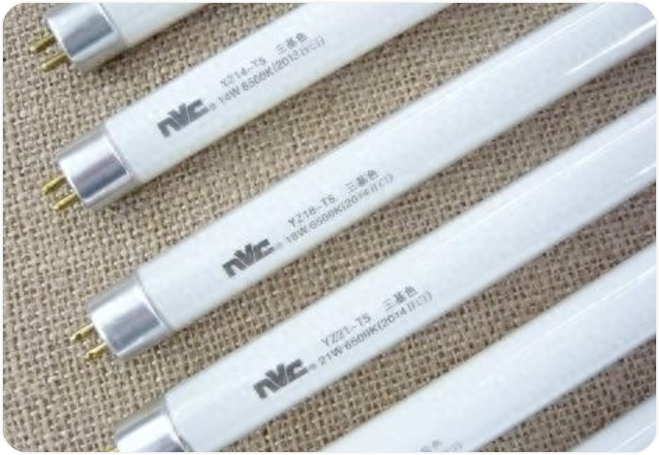
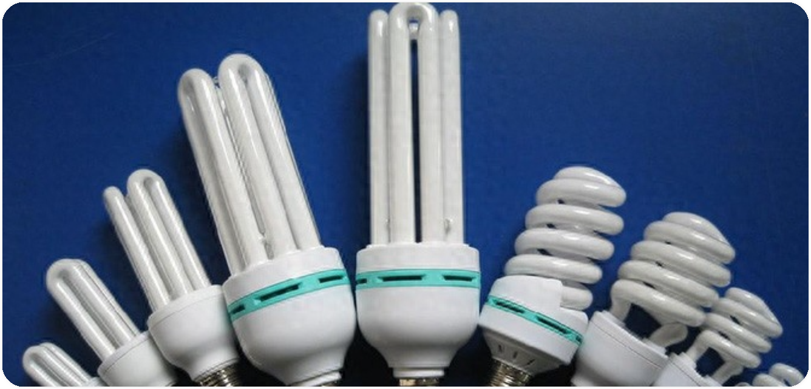
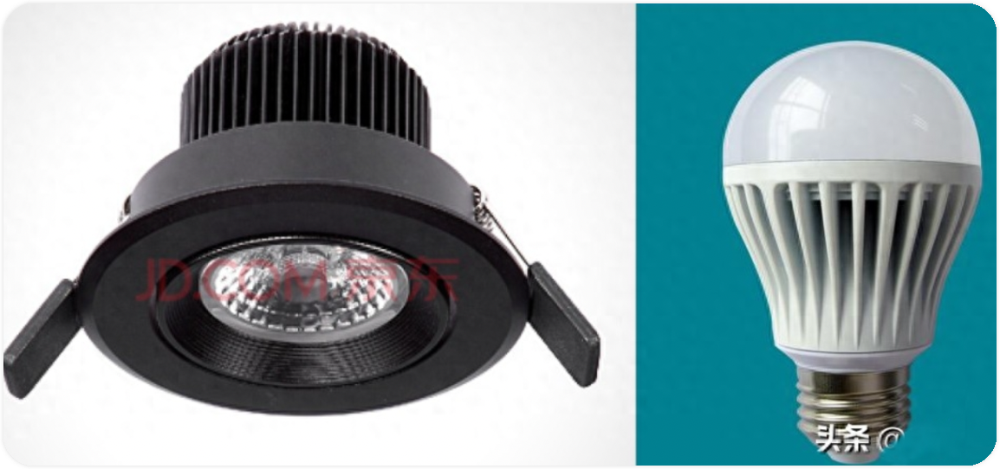

# 色温 （Color temperature)

*下面这段关于 "色温" 的笔记来自英文版的 wikipidea：https://en.wikipedia.org/wiki/Color_temperature#Categorizing_different_lighting*

**Color temperature** is a parameter describing the color of a [visible light](https://en.wikipedia.org/wiki/Visible_light) source by comparing it to the color of [light emitted](https://en.wikipedia.org/wiki/Black-body_radiation) by an [idealized opaque, non-reflective body](https://en.wikipedia.org/wiki/Black_body). The temperature of the ideal emitter that matches the color most closely is defined as the color temperature of the original visible light source. Color temperature is usually measured in [kelvins](https://en.wikipedia.org/wiki/Kelvin). The color temperature scale describes only the color of light emitted by a light source, which may actually be at a different (and often much lower) temperature.

色温是一个参数，通过将可见光源的颜色与理想的不透明、非反射体发出的光的颜色进行比较来描述可见光源的颜色。与颜色最接近的理想发射器的温度被定义为原始可见光源的色温。色温通常以开尔文为单位测量。色温标度仅描述光源发出的光的颜色，其实际上可能处于不同的（并且通常低得多）温度。 -- Google Translate

*下面这段 "色温" 笔记来自中文 wikipedia：https://zh.wikipedia.org/wiki/%E8%89%B2%E6%B8%A9*

光源**色温**的定义为与此光源发出相似的光的[黑体辐射体](https://zh.wikipedia.org/wiki/黑体_(热力学))所具有的[开尔文](https://zh.wikipedia.org/wiki/开尔文)温度。色温在摄影、录像、出版等领域具有重要意义。在实际应用中，只有当光源发出的光和黑体辐射的光类似时，色温才有定义。也就是，红-橙-黄-白-浅蓝这些颜色。当讨论色温时，讨论例如绿色、紫色的色温是没有意义的。

*800K 到 12200K 的黑体辐射光谱，这个区间大约是夜晚天空中各种星星发出的光的区间*

- 黑体辐射体：在[热力学](https://zh.wikipedia.org/wiki/熱力學)中，**黑体**（英语：Black body），是一个理想化的物体，它能够[吸收](https://zh.wikipedia.org/wiki/吸收)外来的全部[电磁辐射](https://zh.wikipedia.org/wiki/电磁辐射)，并且不会有任何的[反射](https://zh.wikipedia.org/wiki/反射_(物理学))与[透射](https://zh.wikipedia.org/wiki/透射)。随着[温度](https://zh.wikipedia.org/wiki/溫度)上升，黑体所辐射出来的[电磁波](https://zh.wikipedia.org/wiki/電磁波)与光线则称做[黑体辐射](https://zh.wikipedia.org/wiki/黑体辐射)。这个名词在1862年由[古斯塔夫·基尔霍夫](https://zh.wikipedia.org/wiki/古斯塔夫·基爾霍夫)所提出并引入[热力学](https://zh.wikipedia.org/wiki/熱力學)内。 (此段来源：- https://zh.wikipedia.org/wiki/%E9%BB%91%E4%BD%93_(%E7%89%A9%E7%90%86%E5%AD%A6)

    

    *上图来源：https://en.wikipedia.org/wiki/Black_body#cite_note-1*

- 开尔文：（英语：Kelvin）是[温度](https://zh.wikipedia.org/wiki/温度)的[计量单位](https://zh.wikipedia.org/wiki/计量单位)。它是[国际单位制](https://zh.wikipedia.org/wiki/國際單位制)（SI）的七个[基本单位](https://zh.wikipedia.org/wiki/国际单位制基本单位)之一，符号为**K**[[注 1\]](https://zh.wikipedia.org/wiki/开尔文#cite_note-1)。以开尔文计量的[温度](https://zh.wikipedia.org/wiki/温度)[标准](https://zh.wikipedia.org/wiki/溫度標準)称为[热力学温标](https://zh.wikipedia.org/wiki/热力学温标)，其零点为[绝对零度](https://zh.wikipedia.org/wiki/绝对零度)。在[热力学](https://zh.wikipedia.org/wiki/热力学)的经典表述中，绝对零度下所有热运动停止。早期1开尔文定义为水的[三相点](https://zh.wikipedia.org/wiki/三相点)与绝对零度相差的1/273.16。[[1\]](https://zh.wikipedia.org/wiki/开尔文#cite_note-res413-2)水的三相点是0.01℃，因此温度变化1摄氏度，相当于变化1开尔文；现1开尔文由[波兹曼常数](https://zh.wikipedia.org/wiki/波茲曼常數)定义。

    开氏温标得名自[英国](https://zh.wikipedia.org/wiki/英國)工程师和物理学家[第一代开尔文男爵威廉·汤姆森](https://zh.wikipedia.org/wiki/第一代开尔文男爵威廉·汤姆森)。

## 不同光的分类

黑体辐射体的色温等于它表面的开尔文温度, 温度的度量使用了以19世纪英国物理学家[威廉·汤姆逊，第一代开尔文男爵](https://zh.wikipedia.org/wiki/威廉·湯姆遜，第一代開爾文男爵)为名的温标。由于色温的定义不同于光源温度的定义，除了黑体辐射体以外，不能将“色温”的概念直接引用自光源的“温度”。

[白炽灯](https://zh.wikipedia.org/wiki/白炽灯)非常接近于一个黑体辐射体。

而不少其他光源，诸如[荧光灯](https://zh.wikipedia.org/wiki/熒光燈)，并不按照黑体的放射曲线辐射能量，为定义其颜色温暖程度，使用[相关色温](https://zh.wikipedia.org/wiki/色温#相關色温)（CCT）的标准，这是找到光源的感知色温跟黑体辐射温度近似的方式。因为白炽灯并不需要这种近似，白炽灯的CCT其实相当简单，就是它那未经调整的开氏温标值，像加热的黑体辐射体那样。

根据太阳在天空移动的位置，太阳的颜色会转变成红色、橘色、黄色、白色。在一天中，太阳光颜色的改变主要是大气层的散射作用造成的，更通俗的话：是光线被改变了，跟黑体辐射无关。

由于白天的自然光源属于较高的色温，而到了黄昏的自然光源属于低色温，因此人类的大脑在高色温照明下会比较有精神，而在低色温照明下则会认为该睡了；照明色温宜依照时间调整高低。

就算当太阳仅仅比水平线高一点，还是可以通过估计它的视色温（视色温会根据大气情况改变）而计算出它的有效温度。因此，就算太阳看起来是红的，并且此时视色温为2500K，通过简单的计算，就可以证实它实际上的有效温度大约是5770K。

天空的蓝色不是因为黑体辐射，而是由于大气[瑞利散射](https://zh.wikipedia.org/wiki/瑞利散射)会将阳光“打散”，蓝光比红光更容易被大气干扰，这个现象跟黑体的特性无关。

[请注意这个图表只是象征表现手法，上面的颜色并不是通过严格计算得出的结果。这里[colorimetrically-accurate diagram](http://www.techmind.org/colour/coltemp.html) （[页面存档备份](https://web.archive.org/web/20210126122856/http://www.techmind.org/colour/coltemp.html)，存于[互联网档案馆](https://zh.wikipedia.org/wiki/互联网档案馆)）有一张色度准确的图表]

一些常见的例子：

*注：下面这个表格来自中文版的 wikipedia 色温*

| K 值  | 光源  |
| ---  | ---  |
| 1500 K | 烛焰 |
| 1700 K | 火柴光 |
| 1850 K | 蜡烛 |
| 2800 K | 钨丝灯（[白炽灯](https://zh.wikipedia.org/wiki/白炽灯)）的常见色温。注：钨丝灯见下图 |
| 3000 K | [卤素灯](https://zh.wikipedia.org/wiki/卤素灯)及黄光日光灯的常见色温。 |
| 3350 K | 演播室“CP”灯 |
| 3400 K | 演播室台灯、照相泛光灯（不是闪光灯）等... |
| 4100 K | 月光、浅黄光日光灯 |
| 5000 K | 日光 |
| 5500 K | 平均日光、电子闪光（因厂商而异） |
| 5770 K | 有效太阳温度 |
| 6420 K | 氙弧灯 |
| 6500 K | 最常见的白光日光灯色温 |
| 9300 K | 电视屏幕(模拟) |

| K 值        | 光源             |
| ----------- | ---------------- |
| 1900 K 以下 | 蜡烛及火光       |
| 2900        | 家用钨丝灯       |
| 3200        | 摄影用钨丝灯     |
| 3200        | 摄影用石英灯     |
| 3500~4000   | 220 Ｖ日光灯     |
| 4500~6000   | 普通日光灯       |
| 5600        | HMI 灯           |
| 5800        | 水银灯           |
| 5500~8000   | 电视萤光幕       |
| 2000        | 朝阳及夕阳       |
| 3500        | 日出后一小时阳光 |
| 4300        | 早晨及午后阳光   |
| 5000~6000   | 平常白昼         |
| 5400        | 晴天中午太阳     |
| 6000 以上   | 阴天             |
| 6000~7000   | 晴天时的阴影下   |
| 7000~8500   | 雪地             |
| 10000 以上  | 蓝天无云的天空   |

| 种类                                         | 图片                                                         | 描述                                                         |
| -------------------------------------------- | ------------------------------------------------------------ | ------------------------------------------------------------ |
| 钨丝灯 / 白炽灯                              |  | 大部分白炽灯都是螺旋式底座                                   |
| 卤素灯（灯杯、杯灯、射灯）                   |  | 大部分家庭常用的射灯，就是用的这种灯杯                       |
| 荧光灯（日光灯、灯管） Fluorescent lamp |  | 或称**日光灯**、**灯管**、**荧光管**、**光管**，是一种照明装置，属于[气体放电灯](https://zh.wikipedia.org/wiki/氣體放電燈)的一种。它使用[电力](https://zh.wikipedia.org/wiki/電力)在[氩](https://zh.wikipedia.org/wiki/氬)或[氖](https://zh.wikipedia.org/wiki/氖)气中激发[水银](https://zh.wikipedia.org/wiki/水銀)[蒸气](https://zh.wikipedia.org/wiki/蒸氣)，形成[等离子](https://zh.wikipedia.org/wiki/電漿)并发出短波[紫外线](https://zh.wikipedia.org/wiki/紫外線)，紫外线被[磷光体](https://zh.wikipedia.org/wiki/磷光体)吸收后，磷光体会发出可见的光以照明，这样发出可见光的方式属于[荧光](https://zh.wikipedia.org/wiki/螢光)。 一般的荧光管以[玻璃](https://zh.wikipedia.org/wiki/玻璃)制造，在两端装有插口以连接电源及固定荧光管的位置。 与[电灯泡](https://zh.wikipedia.org/wiki/電燈泡)不同，荧光管必须设有[镇流器](https://zh.wikipedia.org/wiki/镇流器)，与[启辉器](https://zh.wikipedia.org/wiki/启辉器)配合产生让气体发生电离的瞬间高压。 为了取代传统[白炽灯](https://zh.wikipedia.org/wiki/白熾燈)，近年来发展出将灯管、[镇流器](https://zh.wikipedia.org/wiki/镇流器)、[启辉器](https://zh.wikipedia.org/wiki/启辉器)结合在一起，配合使用白炽灯灯座的改良型荧光灯泡，称为[节能灯](https://zh.wikipedia.org/wiki/省電燈泡)，可以在不更换灯具基座的情况下，直接取代[白炽灯](https://zh.wikipedia.org/wiki/白熾燈)使用。 - 来源 wikipedia |
| 节能灯                                       |  | 节能灯就是一种紧凑型、自带镇流器的日光灯                     |
| LED 灯                                       |  | LED 即发光二极管，是一种能够将电能转化为可见光的固态的半导体器件，它可以直接把电转化为光 |

5000K 和 6500K 的黑体的颜色分别接近于普通D50和D65的发光物，这通常用于颜色再现的场合（摄影、出版，等等）。

灯泡的功率 （20或100瓦）似乎能够改变其色彩，但其实只会改变它的光度，而我们的眼睛对这个非常敏感，颜色看起来就不同了。

对于基于黑体的光线，蓝色比红色更“热”，红色其实是更“冷”的颜色。这跟我们传统的认知不一样，大家都把蓝色跟“冷色”联系在一起，红色跟“暖色”联系在一起。这种传统概念其实是从其他方面演化来的，比较凉的水、冰看起来是蓝色，火、加热的金属的色调是偏红。相反的是，这恰恰证明了红色是所有可见光中最“冷”的颜色——红色是随着金属温度升高放射出来的第一个颜色。观察一下普通白炽灯泡，白炽灯发出的橘色光贯穿了它们的一生，白炽灯泡灯丝熔断的一刹那，发出的光线显而易见的有些偏蓝——熔断的一刹那间，灯丝比以往热得多，灯泡玻璃上的焦痕就是个证据。

在非正式场合，“色温”也可以代表“[白平衡](https://zh.wikipedia.org/wiki/色彩平衡)”。请注意，色温只涉及一个变量（以[热力学温标](https://zh.wikipedia.org/wiki/开氏温标)**K**做单位），而白平衡同时牵涉到两个（红色值、蓝色值）。

在摄影术领域中，另一种表现色温的数量叫做[mired](https://zh.wikipedia.org/w/index.php?title=Mired&action=edit&redlink=1)（迈尔德，逆标色温，用色温的倒数来标志温度的单位）。就很简单的一套公式就能在色温和mired之间换算。（关于换算的公式，以及采用mired的原因，请参照[mired](https://zh.wikipedia.org/w/index.php?title=Mired&action=edit&redlink=1)条目）

*注：下面这个表格来自英文版的 wikipedia 色温*

<table>
   <tbody>
        <tr>
           <th>Temperature (温度)  K 值</th>
            <th>Source (来源)   光源</th>
       </tr>
        <tr>
           <td style="background-color:#FF7900">1700&nbsp;K</td>
            <td>
               <a href="/wiki/Match" title="Match">Match</a> flame, 
                <a href="/wiki/Sodium-vapor_lamp#Low-pressure_sodium">low pressure sodium lamps</a> (LPS/SOX)
                
                匹配火焰、低压钠灯 (LPS/SOX)
           </td>
        </tr>
       <tr>
            <td style="background-color:#FF8100">1850&nbsp;K</td>
           <td>
                <a href="/wiki/Candle" title="Candle">Candle</a> flame,
               <a href="/wiki/Sunset">sunset</a>/<a href="/wiki/Sunrise">sunrise</a>
                 
               蜡烛火焰，日落/日出
            </td>
       </tr>
        <tr>
           <td style="background-color:#FF9C3E">2400&nbsp;K</td>
            <td>
               Standard <a href="/wiki/Incandescent_light_bulb">incandescent lamps</a>
                 
               标准白炽灯
            </td>
       </tr>
        <tr>
           <td style="background-color:#FFA24A;">2550&nbsp;K</td>
            <td>Soft white incandescent lamps   柔和的白色白炽灯</td>
       </tr>
        <tr>
           <td style="background-color:#FFA855;">2700&nbsp;K</td>
            <td>
               "Soft white" compact <a href="/wiki/Fluorescent_lamp">fluorescent</a>
                and <a href="/wiki/LED_lamp">LED</a> lamps
                  
                “柔白”紧凑型荧光灯和 LED 灯
            </td>
        </tr>
        <tr>
            <td style="background-color:#FFB369;">3000&nbsp;K</td>
            <td>Warm white compact fluorescent and LED lamps   暖白紧凑型荧光灯和 LED 灯</td>
        </tr>
        <tr>
            <td style="background-color:#FFBA75;">3200&nbsp;K</td>
            <td>
                <a href="/wiki/Photographic_studio">Studio</a> lamps,
               <a href="/wiki/Photoflood">photofloods</a>, etc.
                 
               演播室灯、泛光灯等
            </td>
       </tr>
        <tr>
           <td style="background-color:#FFBF7E;">3350&nbsp;K</td>
            <td>Studio "CP" light   工作室 "CP" 灯</td>
       </tr>
        <tr>
           <td style="background-color:#FFE4CC;">5000&nbsp;K</td>
            <td>Horizon <a href="/wiki/Daylight" title="Daylight">daylight</a>
                地平线日光
            </td>
        </tr>
        <tr>
            <td style="background-color:#FFE4CC;">5000&nbsp;K</td>
            <td>
               Tubular fluorescent lamps or cool white / daylight
                 
               管状荧光灯或冷白光/日光
                 
                <a href="/wiki/Compact_fluorescent_lamps">compact fluorescent lamps</a> (CFL)
                 
                紧凑型荧光灯（CFL)
            </td>
        </tr>
        <tr>
            <td style="background-color:#FFF0E8;">5500 – 6000&nbsp;K</td>
            <td>Vertical daylight, <a href="/wiki/Electronic_flash">electronic flash</a>
             
            垂直日光、电子闪光灯
            </td>
        </tr>
        <tr>
            <td style="background-color:#FFF5F6;">6200&nbsp;K</td>
            <td>
                <a href="/wiki/Xenon_arc_lamp" title="Xenon arc lamp">Xenon short-arc lamp</a> 
                <a href="#cite_note-OSI-2">[2]</a>
                 
                短弧氙灯
            </td>
        </tr>
        <tr>
            <td style="background-color:#FFF9FF;">6500&nbsp;K</td>
            <td>Daylight, overcast   白天，阴天</td>
        </tr>
        <tr>
            <td style="background-color:#DFE7FF;">6500 – 9500&nbsp;K</td>
            <td>
                <a href="/wiki/LCD" title="LCD">LCD</a> or 
                <a href="/wiki/Cathode-ray_tube">CRT</a> screen
                 
                LCD 或 CRT 屏幕
            </td>
        </tr>
        <tr>
            <td style="">10,000</td>
            <td>Blue sky without clouds  蓝天无云的天空</td>
        </tr>
        <tr>
            <td style="background-color:#A1BFFF;">15,000 – 27,000&nbsp;K</td>
            <td>Clear blue poleward sky   晴朗的蓝色极地天空</td>
        </tr> 
        <tr>
            <td colspan="2"><i>These temperatures are merely characteristic; there may be considerable variation   这些温度只是特征性的；可能会有相当大的变化。</i></td>
        </tr>
    </tbody>
</table>

### 光色的应用

|   名称   |                             说明                             |
| :------: | :----------------------------------------------------------: |
|  暖色光  | 暖色光的色温在3300K以下，暖色光与白炽灯相近，2000K上下的色温则类似烛光，红光成分较多，能给人以温暖，健康，舒适，比较想睡的感受。适用与家庭，住宅，宿舍，宾馆等场所或温度比较低的地方；睡前一段时间将光源调整为暖色光较佳，越低的色温越可以维持[退黑激素](https://zh.wikipedia.org/wiki/退黑激素)的分泌量。 |
| 中性色光 | 又叫冷白色，它的色温在3300K到5300K之间，中性色由于光线柔和，使人有愉快，舒适，安详的感受。适用与商店，医院，办公室，饭店，餐厅，候车室等场所。 |
|  冷色光  | 又叫日光色，它的色温在5300K以上，光源接近自然光，有明亮的感觉，使人精力集中及不容易睡着。适用与办公室，会议室，教室，绘图室，设计室，图书馆的阅览室，展览橱窗等场所。 |

## 色温的应用

### 胶片摄影术

胶片有的时候会夸大光线的颜色。比起白光下肉眼观测到的物体颜色，照片中物体的颜色可能会变得偏蓝或者偏桔红色。为了追求自然色彩印刷而进行的摄影中，色彩平衡需要被校对。

### 桌面出版
在桌面出版行业，对于一些颜色匹配软件，知道你的显示器色温是很重要的。

### 电视，视频和数码静止照相机

在这些领域，色温被称作“白平衡”。摄像或摄影设备会自动测量色温，也给出几个常用情况下对应的色温。在较专业的相机上也可以直接设置它。

### 艺术应用中的色温控制

### 水族箱灯管的应用
1. 淡水草缸的应用2700k
2. 海水珊瑚鱼缸的应用

### 生理时钟调节
较高的色温会让人有精神，而较低的色温则告诉人脑该睡觉了：白天时的蓝天白云色温是5000k起跳，而黄昏的色温不到3000k，月光色温是4100k，过去使用的火光色温也不到3000k，人类自然会这样的生理反应。

在白天时采用较高色温的光源照明，夜间照明则使用低色温光源，这样生理时钟就比较不容易紊乱。

## 相关色温
相关色温（correlated color temperature，Tcp）是使用特定已知的颜色刺激值（stimulus）在相同亮度及特定条件下重新组成为最接近浦郎克辐射体之色温即称之。[[1\]](https://zh.wikipedia.org/wiki/色温#cite_note-1)

### 动机

黑体辐射是判断光源白色程度的一种参考。黑体可用色温来描述其色相（Hue）变化。以类比方式来说，近似浦郎克的光源如萤光灯（fluorescent），高压放电灯可以用相关色温（CCT）方式来判定，使用浦郎克辐射体来做似乎是很好的方法。

