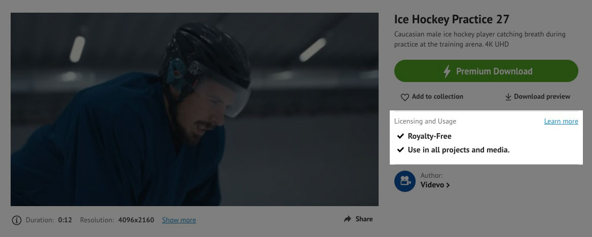
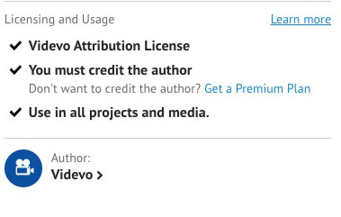
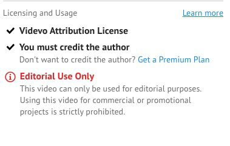

# Videvo

> https://www.videvo.net/

## Licenses and Usage: Full Guide

- BY[VIDEVO](https://www.videvo.net/blog/author/tomoms/)
- SEPTEMBER 20, 2017

Welcome to our guide on licensing and the usage of clips on Videvo.net. Below you will find all the information you need to ensure you are using clips from Videvo correctly.
欢迎阅读我们关于 Videvo.net 上的许可和剪辑使用指南。您将在下面找到确保正确使用 Videvo 剪辑所需的所有信息。

### Where can I find License and Author information for a clip? 在哪里可以找到剪辑的许可证和作者信息？

License and usage information for each clip is displayed on the clip download page in the top section to the right-hand side of the video player. Please see the image below for reference:
每个剪辑的许可证和使用信息显示在视频播放器右侧顶部的剪辑下载页面上。请参阅下图以供参考：

The author information is displayed just below this.
作者信息显示在此下方。

### 

### The Difference Between License and Usage 许可证和使用之间的区别

In order to keep our users safe, we provide License and Usage guidance for every clip on Videvo.
为了确保用户的安全，我们为Videvo上的每个剪辑提供许可证和使用指南。

The License defines what permissions you have in terms of editing the clip, whether you need to provide a credit, where you can publish the clip, etc. Usage dictates whether or not you may use the clip for commercial purposes to promote a product, brand, or service. If the usage states “All projects and media” you may use the clip for commercial purposes. If it states “Editorial Use Only”, you should not use the clip for commercial purposes. We will cover the topic of usage, both commercial and editorial in more detail later in this article.
许可证定义了您在编辑剪辑方面拥有的权限、是否需要提供信用、可以在何处发布剪辑等。使用情况决定了您是否可以将剪辑用于商业目的来推广产品、品牌或服务。如果用法显示“所有项目和媒体”，您可以将剪辑用于商业目的。如果它注明“仅供编辑使用”，则您不应将该剪辑用于商业目的。我们将在本文后面更详细地介绍商业和编辑用法的主题。

### 

### Licenses: 许可证：

There are 3 main types of License on Videvo.net, detailed below:
Videvo.net 许可证主要有 3 种类型，详见下文：

------

#### “Royalty Free License”: “免版税许可证”：

-   Download once and use in as many projects as you like
    下载一次，即可在任意数量的项目中使用
-   You may edit the clip(s) in any way you like
    您可以以任何您喜欢的方式编辑剪辑
-   You are not required to credit the author of the clip(s)
    您不需要注明剪辑的作者
-   You may use and publish the clip(s) worldwide and on any platform, including web, broadcast, shows, theatre, apps, and games
    您可以在全球范围内和任何平台上使用和发布剪辑，包括网络、广播、节目、剧院、应用程序和游戏
-   You may NOT redistribute the clip(s) in their original form (e.g. making the clip available as a stock clip for download on another website)
    您不得以原始形式重新分发剪辑（例如，将剪辑作为库存剪辑在其他网站上下载）

------

#### “Videvo Attribution License”: “Videvo署名许可”：

-   You may use the clip(s) for free and for perpetuity
    您可以免费永久使用这些剪辑
-   You must credit the author of the clip(s) in your production
    您必须在制作中注明剪辑的作者
-   You may use and publish the clip(s) worldwide and on any platform, including web, broadcast, shows, theatre, apps, and games
    您可以在全球范围内和任何平台上使用和发布剪辑，包括网络、广播、节目、剧院、应用程序和游戏
-   You may not redistribute the clip(s) in their original form (download and then re-upload the clip(s) elsewhere, e.g. torrent websites)
    您不得以原始形式重新分发剪辑（下载片段，然后在其他地方重新上传，.torrent例如网站）

------

#### “Creative Commons 3.0 Unported (CC-BY)”: “知识共享 3.0 未移植 （CC-BY）”：

-   You may use the clip(s) for free and for perpetuity
    您可以免费永久使用这些剪辑
-   You must credit the author of the clip(s) in your production
    您必须在制作中注明剪辑的作者
-   You may use and publish the clip(s) worldwide and on any platform, including web, broadcast, shows, theatre, apps, and games
    您可以在全球范围内和任何平台上使用和发布剪辑，包括网络、广播、节目、剧院、应用程序和游戏
-   You may share, adapt, and redistribute the clip(s), but you may not sell the clip(s)
    您可以共享、改编和重新分发剪辑，但不得出售剪辑

This is a rough overview of the CC 3.0 guidelines. For full information, read the [CC 3.0 Guidelines here](https://creativecommons.org/licenses/by/3.0/)
这是 CC 3.0 指南的粗略概述。有关完整信息，请在此处阅读 CC 3.0 指南

------

#### 

#### “NASA License”: “美国宇航局许可证”：

Please refer to the guidelines for use of NASA imagery, [located here](https://www.videvo.net/wp-content/uploads/2012/07/NASA-License-Agreement.pdf)
请参阅此处的NASA图像使用指南。

------

#### “Public Domain”: “公有领域”：

The ‘Public Domain’ License covers clips hosted on the site that are in the public domain. Public domain clips by the United States Fish and Wildlife Service may be used “as long as there is no implied U.S. Government / U.S. Department of the Interior / Fish and Wildlife Service endorsement, promotion, or support of a particular organization, product, or position.”
“公共领域”许可证涵盖网站上托管的属于公共领域的剪辑。美国鱼类和野生动物管理局的公共领域剪辑可以使用，“只要美国政府/美国内政部/鱼类和野生动物管理局没有暗示对特定组织、产品或职位的认可、推广或支持。

For these clips, please give credit to: **U.S. Fish & Wildlife Service, National Conservation Training Center, Creative Imagery.**
对于这些剪辑，请注明：美国鱼类和野生动物管理局，国家保护培训中心，Creative Imagesry。

Read more about the [public domain here](https://fairuse.stanford.edu/overview/public-domain/welcome/).
在此处阅读有关公共领域的更多信息。

------

#### “Videvo Standard License”: “Videvo标准许可证”：

This is a legacy license that is no longer used for licensing content on Videvo. However, if you downloaded a clip in the past under this license then the same terms of that license still apply.
这是一个遗留许可证，不再用于许可Videvo上的内容。但是，如果您过去根据此许可证下载了剪辑，则该许可证的相同条款仍然适用。

This License stipulates that:
本许可证规定：

-  You may use the clip(s) for free and for perpetuity
    您可以免费永久使用这些剪辑
-  You are not required to credit the author of the clip(s)
    您不需要注明剪辑的作者
-  You may use and publish the clip(s) worldwide and on any platform, including web, broadcast, shows, theatre, apps, and games
    您可以在全球范围内和任何平台上使用和发布剪辑，包括网络、广播、节目、剧院、应用程序和游戏
-  You may not redistribute the clip(s) in their original form (download and then re-upload the clip(s) elsewhere, e.g. torrent websites)
    您不得以原始形式重新分发剪辑（下载片段，然后在其他地方重新上传，.torrent例如网站）

------

### 

### Usage: Commercial Use or Editorial Use Only 用途：仅用于商业用途或编辑用途

As mentioned above, “Usage” defines whether a clip can be used for commercial purposes (all projects and media), or for editorial projects only (Editorial Use Only). On the clip download page, under “Usage” you will see one of two variations: “All projects and media” or “Editorial Use Only”. The screenshots below illustrate this:
如上所述，“使用”定义了剪辑是可以用于商业目的（所有项目和媒体），还是仅用于编辑项目（仅限编辑用途）。在剪辑下载页面的“使用情况”下，您将看到以下两种变体之一：“所有项目和媒体”或“仅限编辑使用”。下面的屏幕截图说明了这一点：

Clips are normally marked as Editorial Use Only when they contain identifiable persons, private property that is the main focus of the shot, brands or logos that are the main focus of the shot, or artwork or copyrighted works. Without a release form from the person(s) appearing in the shot or the owner of the property, it is not possible to use the clip for commercial purposes. However, you may use the clip for editorial purposes.
当剪辑包含可识别的人物、作为镜头主要焦点的私有财产、作为镜头主要焦点的品牌或徽标或艺术品或受版权保护的作品时，通常将其标记为“仅供编辑使用”。如果没有镜头中出现的人或财产所有者的授权书，则无法将剪辑用于商业目的。但是，您可以将剪辑用于编辑目的。

Read our [full guide on editorial use here](https://www.videvo.net/blog/editorial-usage-a-complete-guide-to-using-footage-marked-editorial-use-only/).
在此处阅读我们关于编辑使用的完整指南。

Here are some useful guides on the topic of editorial images/videos and intellectual property:
以下是有关编辑图像/视频和知识产权主题的一些有用指南：

The Nimia Guide on Editorial Documentaries
尼米亚编辑纪录片指南
[https://nimia.com/documentary-vs-commercial-requirements-for-legal-releases](https://nimia.com/documentary-vs-commercial-requirements-for-legal-releases/)

Shutterstock’s Guide to Editorial Images:
Shutterstock的编辑图像指南：
https://www.shutterstock.com/blog/2010/05/editorial-vs-commercial-images/

Getty’s Intellectual Property Wiki Page:
盖蒂的知识产权维基页面：
http://wiki.gettyimages.com/

------

### How Do I Credit the Author? 我如何注明作者？

As detailed above, many clips on Videvo require that you provide a credit to the author. If the clip(s) you have download requires that you attribute/credit the author, you can do so either as an on-screen credit or in any documentation that is published alongside your finished video.
如上所述，Videvo上的许多剪辑要求您提供作者的信用。如果您下载的剪辑要求您注明作者，则可以作为屏幕上的制作者，也可以在与完成的视频一起发布的任何文档中进行。

#### Example Credit: 示例信用：

If you have downloaded a clip created by the Author “Videvo” (us!) and it is licensed under the “Videvo Attribution License”, you must credit Videvo in your production, either in the video itself (for example in the end credits) or in text form published alongside the video (for example, in a YouTube description).
如果您下载了由作者“Videvo”（我们！）创建的剪辑，并且该剪辑已获得“Videvo署名许可”的许可，则必须在制作中注明Videvo，无论是在视频本身（例如片尾字幕中）还是以与视频一起发布的文本形式（例如，在YouTube描述中）。

The format for the credit should be:
信用的格式应为：

“Stock footage provided by Videvo, downloaded from www.videvo.net”
“Videvo提供的素材，从 www.videvo.net 下载”

#### Crediting the author for Creative Commons 3.0 Clips: 为知识共享3.0剪辑致谢作者：

Creative Commons outline their own guidelines on how to credit the author of media licensed under CC 3.0 (CC-BY). You can read the guidelines here: https://wiki.creativecommons.org/wiki/License_Versions#Detailed_attribution_comparison_chart
知识共享组织概述了他们自己的指导方针，关于如何注明根据CC 3.0（CC-BY）许可的媒体的作者。您可以在此处阅读指南：https://wiki.creativecommons.org/wiki/License_Versions#Detailed_attribution_comparison_chart

------

This marks the end of our guidelines on licensing and usage for clips on Videvo. If you have any questions regarding licensing, usage or how to credit you can contact us at hello@videvo.net.
这标志着我们关于 Videvo 上剪辑的许可和使用指南的结束。如果您对许可、使用或如何信用有任何疑问，可以通过以下方式与我们联系 hello@videvo.net。

Last updated: 20th May 2020.
上次更新时间：2020 年 5 月 20 日。
