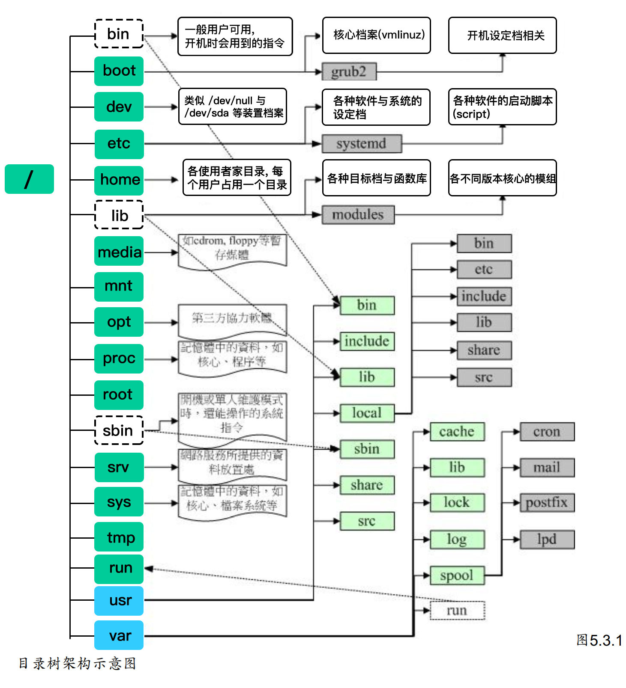
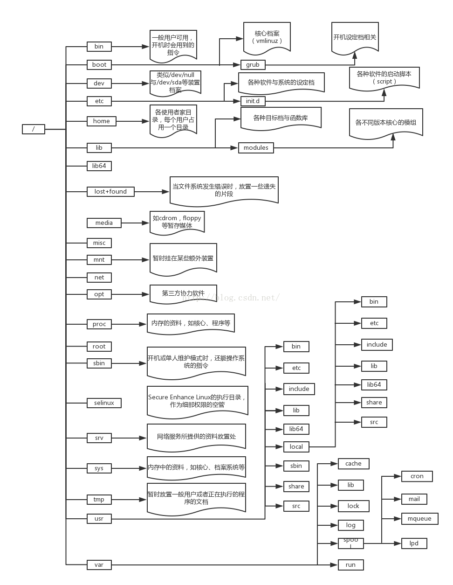

# Linux Learning

## 目录(Catalog)
1. 在 Mac 上搭建 Linux虚拟机 -- `MacOS` & `VMware10` & `CentOS 7`
2. 查看登录到服务器后根目录结构

## 生词(New Words)

## 内容(Content)
### 1. 在 Mac 上搭建 Linux虚拟机 
- `MacOS` & `VMware10` & `CentOS 7`: 
  [参考文章](https://blog.csdn.net/Nicolelovesmath/article/details/82716412)

### 2. 查看登录到服务器后根目录结构
- 当我们使用 `ssh root@公网IP` 输入之前设定的服务器登录密码进入服务器后,
  首次登录可能会询问公钥, `yes` 即可.
  
  上述操作是使用 `root` 用户身份登陆, 会直接进入到下图加粗的 **`root`** 目录下,
  先 `cd ..` 跳转到上层, 再 `ls -a`, 就可以看到类似下图的目录结构了.
  
  `Linux` 目录树结构示意图 (图`1`和图`2`对比着看):

  
  
  (图`1`)

  

  (图`2`)
