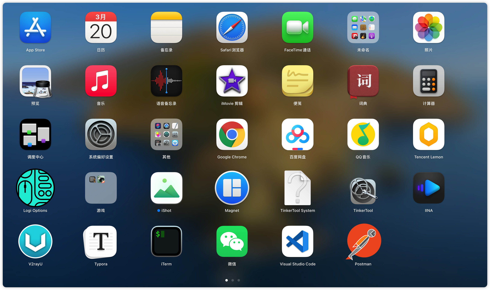
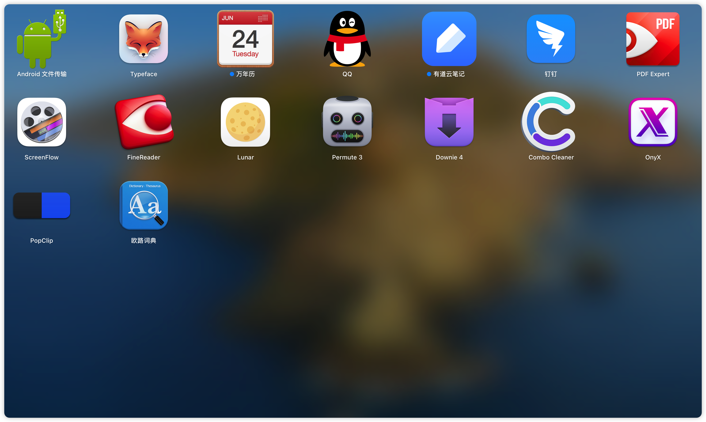

# MacOS 常用软件

### ▲ iShot (截图工具)

> 下载路径：AppStore 购买
>
> 官网使用说明：https://www.better365.cn/ishot.html
>
> **`请一定要去官网看使用解说`**
>
> 截图快捷键： `Option + A`

注：iShot 截图自带 OCR (optical character recognition 光学字符识别) 文字识别功能，截图的文字可以很容易得到。 

### ▲ Magnet (分屏软件)

### ▲ IINA (视频播放软件)

### ▲ V2rayU (VPN 软件)

### ▲ Typora (markdown 编辑器)

INNA 视频播放,  ScreenFlow 录屏，Premute 视频转换，Downie 下载所有网站的视频, Combo cleaner 杀毒软件，Popclip 的使用

### OnyX （mac系统维护工具）

>  下载：https://www.macwk.com/soft/onyx
