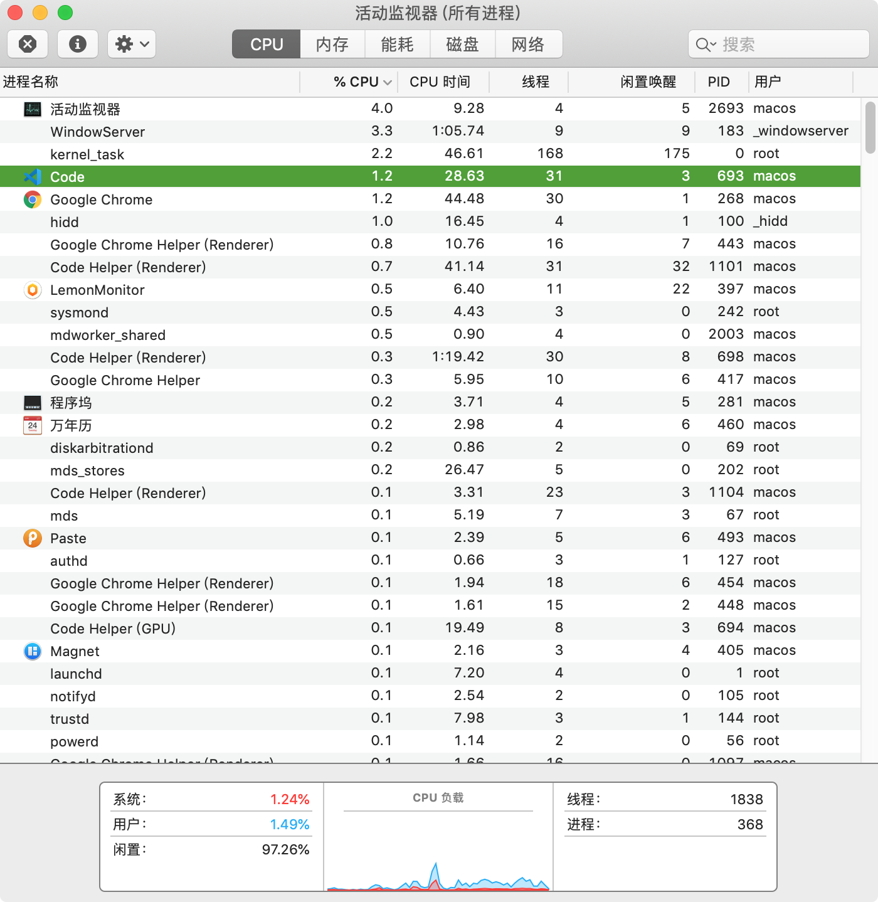
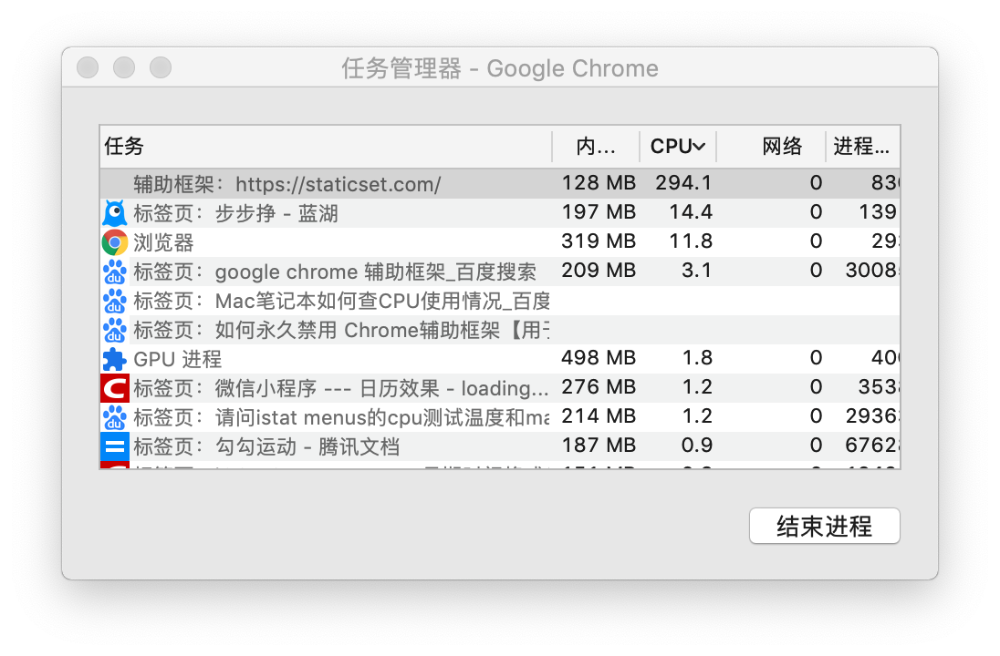

# MacOS 使用记录


## 生词(New Words)
- **remount [,ri:'maunt] --vi.重新骑上; 重登上. --vt.重新安装. --n.新马**
    + A tiny tool to re-mount write-protected NTFS volumes under MacOS
      in read-write mode. 一个微型工具, 以读写模式在 MacOS
      下重新挂载(安装)受写保护的 NTFS 卷.
    + She went to remount her horse. 她走过去重新上马.
- **cask [kɑːsk]/[kæsk] --n.木桶, 桶. --vt.装入桶内.**
    + I need a cask of wine and some apples. 我需要一桶酒和一些苹果.


## 内容(Content)
### 1. Mac 键盘符号说明:
- `⌘` == Command
- `⇧` == Shift
- `⌥` == Alt/Option
  + 
- `⌃` == Control
- `⇪` == Caps Lock
- `↩` == Return/Enter
- `⌫` == Delete
- `⌦` == 向后删除键（Fn+Delete）
- `↑` == 上箭头
- `↓` == 下箭头
- `←` == 左箭头
- `→` == 右箭头
- `⇞`== Page Up（Fn+↑）
- `⇟` == Page Down（Fn+↓）
- `Home` == Fn + ←
- `End` == Fn + →
- `⇥` == 右制表符（Tab键）
- `⇤` == 左制表符（Shift+Tab）
- `⎋` == Escape (Esc)
- `⏏` == 电源开关键

### 2. Mac 一键返回到桌面
- (1) 在 `程序坞` 旁边的桌面空白部分点击一下, 同时按住 `Command + Option + h` 可返回桌面.
- (2) 快捷键返回桌面: `Fn + F11`

### 3. 剪切-复制
- 复制粘贴：`Command` + `C` --> `Commadn` + `V`
- 剪切粘贴：`Command` + `C` --> `Commadn` + `Option` + `V`

### 4. Mac 刷新 DNS 解析
- (1st) 在 "iTerm/终端" 中输入: 
    ```shell
        sudo Killall -HUP mDNSResponder 
        echo macOS DNS Cache Reset
    ```
- (2nd) 第二种方法是如果不想使用命令行可以安装 PowerMyMac 
    + 打开软件后点击 "TookKit (工具套装)" --> "Maintenance (维修, 保养)"
        点击 "View" --> 单击左侧的 "Flush DNS" 然后点击右侧的 "Clean" 完成.

### 5. 打开没有授权的 App
- 若要覆盖安全性设置, 从而仍打开应用：
- 在 Mac 上的 "访达" 中, 找到想要打开的应用. 
- 请勿使用启动台来执行此操作. 启动台不允许访问快捷菜单. 
- 按住 `Control` 键点按应用图标, 然后从快捷键菜单中选取 "打开". 点按“打开

### 6. Mac 下好用的输入法： 搜狗输入法--秒杀苹果自带的中英文输入法

### 7. 隐藏/显示程序坞快捷键
- `Command + option(alt) + D`

### 7. MacOS Dock 栏自动显示和隐藏取消延迟
使用OS X的时候都会选择将Dock隐藏（可以在系统偏好设置—Dock中选择），等使用时将光标向下划Dock会自动弹出显示。这个显示或隐藏会有一点点（大概1秒左右）的延迟，使用下面的方法可以消除这个延迟:

打开--终端(或 iTerm), 输入如下代码

`defaults write com.apple.Dock autohide-delay -float 0 && killall Dock`

当 Dock 再次隐藏或显示时会立即执行

如想恢复默认的延迟速度, 在终端中输入以下代码即可:

`defaults delete com.apple.Dock autohide-delay && killall Dock`


### 8. Mac 更该文件的默认显示方式
- 在当前文件上单击右键 --> '显示简介' --> 打开方式 (点击选择需要的使用的默认软件) 
  --> 点击 '全部更该' 

### 9. 搜索文件路径:
- Mac 下 `/usr/local/...` 默认是隐藏状态, 所以需要打开 `/usr/local/...`
  并更改文件的话, 只需打开 `Finder`, 按下 `Command + shift + G`,
  在目录中搜索所需要的路径便可. 

### 10. Mac 下的 host 文件查找方式:
- 打开 Finder, 按快捷键组合 `Shift` + `Command` + `G` 查找文件,
  输入 `/etc/hosts` 确认前往.

### 11. 让 Mac 显示文件路径:
- 下载 `TinkerTools` --> `Finder` --> 勾选 `Show selected path in window title` 

### 12. 显示/隐藏 文件夹中的 默认隐藏文件  
- 使用快捷键：`Command + Shift + .` 来快速（在 Finder 中）显示和隐藏隐藏文件. 

### 13. 在 Finder 的顶部显示文件路径:
- 打开终端(Terminal)输入: 
  `defaults write com.apple.finder _FXShowPosixPathInTitle -bool YES`
  便可在 Finder 的顶部显示路径了, 在显示的路径上右键, 还可以直接访问路径中的任意一层.
- 复制当前文件路径的快捷键: `Option + Command + C`.

### 14. [如何在 Mac 上使用 "活动监视器"](https://support.apple.com/zh-cn/HT201464)  
-  "活动监视器" 显示了 Mac 上正在运行的进程, 以便您可以管理这些进程并查看它们对 Mac 活动
  和性能的影响. "活动监视器" 它是一种任务管理器, 可让您查看应用和其他进程对您的 CPU、内存
  、能耗、磁盘和网络使用情况的影响. 
- 您可以从 "应用程序" 文件夹的 "实用工具" 文件夹中打开 "活动监视器",
  或者使用 "聚焦" 进行查找. 

### 15. Mac 命令行里查看 ip 的命令:
- 在终端中输入 `ifconfig` 在给出的信息中心查看 `inet` 后面的 `ip` 便是. 如下:
  ```base
    en0: flags = 8863<UP,BROADCAST,SMART,RUNNING,SIMPLEX,MULTICAST> mtu 1500
        ether ac:bc:32:79:8f:61
        inet6 ......
        inet 10.4.23.150 ......
  ```

### 16. Mac 触控板操作：
- 在 "文件夹/文件上" 双手按下触控板既可弹出操作文件的小弹框

### 17. Mac 软件卸载
- 1st: 可以使用 `腾讯柠檬` 卸载.
- 2nd: 更多卸载方式见:
  [视频](https://www.bilibili.com/video/av71604615?from=search&seid=9193268103616972092)

### 18. Mac 分屏
- (1) 系统自带分屏操作: 
    - 分屏在 MacOS 里叫 Split View. 支持Split View 的 app 中, 鼠标长按全屏键
     （就是每个窗口左上角的关闭、最小化、全屏这三个中的第三个）3秒, 就出现啦. 
- (2) 更方便的操作是使用分屏软件 `Magnet`
    + magnet ['mægnɪt] --n.磁铁；磁石；磁体
    + 下载地址: `https://www.waitsun.com/magnet-pro.html`
    + 软件快捷键说明: 
        - 左半屏: `Control(^) + Option(⌥) + 左箭头(←)`
        - 右半屏: `Control(^) + Option(⌥) + 左箭头(→)`

### 19. Mac 系统自带截图快捷键
- `Command + Shift + 3` 截取整个屏幕, 保存图片在桌面
- `Command + Shift + 4` 选取部分屏幕区域, 保存图片在桌面 
- 先 `Command + Shift + 4` 再按空格, 可以对指定的窗口或者菜单截屏
- 以上快捷键, 加上 Ctrl, 可以把截屏保存在剪贴板. 

### 20. Mac 下更习惯用的截图
- (1) QQ 截图
- (2) iShot (可以截长图)

### 21. 打开 Mac 上允许安装任何来源的应用程序的方法：
- 打开终端 --> 输入: `sudo spctl --master-disable` 然后回车输入密码. 
- - 打开偏好设置 --> 安全性与隐私 , 就可以看到有 `任何来源` 的选项了

### 22. 使用 Spotlight 搜搜
- 打开 spotlight 的快捷键: `Command + 空格键(space bar)`
- 快速打开 spotlight 中搜索的文件的路径 `Command + 回车键(enter/return)`


### 23. Mac 程序界面快捷键: `Command (⌘)`
- 新建窗口：`Command` + `N` (new)
- 新建标签页：`Command` + `Tab`
- 软件全屏: `Command` + `Control` + `F`
- 关闭程序：`Command` + `Q` (quit [kwɪt] vt&vi.离开)
- 关闭当前窗口 / 关闭程序内部的多个标签页：`Command` + `W`
- 隐藏当前窗口: `Command` + `H`
- 最小化当前窗口: `Command` + `M`(Minisize 最小化)
- 切换程序：`Command` + `Tab`
- 关闭所有应用程序：`Command` + `Tab` 显示所有打开的应用程序图标,
  继续按住 `Command` 不松, 然后点击 `Q` 就可以快速的关闭程序; 遇到访达的时候会报错,
  因为访达无法用 `Command` + `Q` 来关闭, 这个时候只需要再点击一下 `Tab`,
  跳过访达就可以继续关闭程序了. 
- 强制退出：`Command` + `Option` + `Esc`
- `Option` 快捷键的一些操作:
    + 关闭多个访达窗口: option + 窗口的 x 号
    + option + i : 可以查看文件的简介(属性)
    + option + command + i : 为打开检查器, 然后单机想查看的文件, 
      当前文件的简介就会显式在检查器内了. 
    + 更改默认查看方式/拷贝路径: 在当前文件上单继右键在显式列表中可以看到`打开方式`选项, 
      按下 option 可以显式`默认打开方式`. 如果想拷贝文件的路径, 也是按下 option, 
      对应的操作就可以看到了. 
    + 展开当前文件夹下的所有文件夹: 把文件展示方式设为 `≡` (详细信息), 然后
      按下 option 间, 点击文件夹前的三角箭头, 便可以打开当前文件夹下的所有文件夹了. 

### 24. Mac 文件管理
- 文件夹中的 4 种文件显式方式: 
    + 依次为: 
    + 图标
    + 列表
    + 分栏
    + 封面流
- 快速预览当前文件:
    + 鼠标移动到当前文件上, 点击键盘的 `空格键` 就可以快速预览当前文件；
      还可以点击上下左右键快速切换文件, 找到当前需要的文件后, 再次点击空格即可关闭预览. 
- "文件/夹"重命名: 当前文件/夹点击选中后, 点击回车键(enter)即可快速修改文件/夹
- Spotlight 聚焦搜索 ('command + 空格' 唤醒聚焦搜索):
    - 输入搜索找到搜索内容后, 点击一下时打开；
      如果想打开文件所在的路径, 按下 Command + 双击搜索框下的文件名即可. 
- 显示文件夹中的隐藏文件快捷键：`shift + command + .`

### 25. Mac Chrome 浏览器常用快捷键:
- Command + L = 光标移动到地址栏
- Command + R = 刷新页面
- Command + W = 关闭当前标签
- Command + D = 收藏当前页面
- Command + option + L = 打开下载内容页面
- Command + option + i = 开发者工具
- 空格 = 屏幕下滚一页

### 26. Mac 包管理器
- 1、Homebrew 包管理器：
    + 按照官网的说明安装：`https://brew.sh/`, 中间可能会让输入密码, mac 下输入密码
      是不显示的, 直接输入即可. 
    + brew search xxx     // 搜索包
    + brew install xxx    // 安装包 
    + brew info xxx       // 查看包信息, 比如目前的版本, 依赖, 安装后注意事项等
    + brew uninstall xxx  // 卸载包
    + brew list           // 显示已安装的包
    + brew –help          // 查看brew的帮助
    + brew update         // 更新, 这会更新 Homebrew 自己
    + brew outdated xxx   // 检查过时（是否有新版本）, 这会列出所有安装的包里, 哪些可以升级
        - brew outdated mysql
    + brew upgrade xxx    // 升级所有可以升级的软件
        - brew upgrade mysql
    + brew cleanup xxx    // 清理不需要的版本极其安装包缓存
        - brew cleanup mysql
    + Homebrew 安装软件的存放目录: 通过 brew install 安装的所有软件存放在
      `/usr/local/Cellar/` 目录下. 
        - 可以使用 `brew list` 查看所有通过 brew 安装的
      软件, 然后通过显示的软件名通过 `brew list 软件名` 确定软件安装的路径..
- 2、Macprot 包管理:
- Macprot 与 brew 提供的功能基本一致, 不过......
### 27. Mac 下弹出 U盘/SSD
- 选中要弹出的 U盘/SSD 然后按下 `Command` + `E`

### 28. 拷贝文件到移动 SSD
- 使用 brew 安装 Mounty
  ```shell
    brew cask install mounty
  ```
- 打开软件如果挂载提示: The volume UNTITLED is not re-mountable in read/write
  mode. Probably it was not clean unmounted before. (卷不能在 读/写
  模式下重新挂载. 可能是因为先前没有完全卸载(安全删除)).

  这里的意思是说磁盘在 Win 下没有安全删除就拔除来了, 导致文件系统中有错误区块,
  所以在 Mac 中不能挂载成读写模式. 到 Windows 下, 打开 Dos 命令行, 输入:
  ```dos
    chkdsk /f (tip: 就是 f, 不是移动硬盘所在盘符)
  ```
  然后回车, 退出 esc / Y

  我在 Windows 10 上运行以上命令是不行的, 提示我卷在另外一个设备使用,
  但是我用火绒安全弹出移动硬盘后, 再次拿到 Mac 上便是可以使用 Mounty 加载了...

  下次再拔出移动硬盘之前, 一定记得安全删除/弹出.

### 29. 查看 mbp 风扇狂转(5000 ~ 6000 转) 的原因
- (2) 首先, 你应该有一个可以监控风扇转速的软件, 比如: 腾讯的 `Lemon`(免费),
  [Macs fan control](https://www.macbl.com/app/system/macs-fan-control)
  ... 等等, 它们都可以实时显示风扇转速. 
- (2) 从 `启动台` 找到 `活动监视器`, 然后点击顶部的 `cpu` 模块,
  查看每个软件(进程)对 CPU 的使用情况, 一般超过 100% 的都会导致 CPU
  负载过大, CPU 超负荷工作就会发热, 紧跟着风扇高速狂转加以散热.

  
  
  对于一般的软件直接双击在弹框中点击退出即可, 但如果是像浏览器这样开了多个标签页,
  直接退出的话, 所有页面都会关闭; 那么对于浏览器导致的 CPU 高速运转该怎么解决呢? 

  对于这个问题, 我们先来分析一下, 在浏览器中哪些情况会导致 CPU 使用率过高?
    + (1) 第一种情况可能就是, 某个页面中运行了恶意 JavaScript 脚本;
    + (2) 第二种可能就是在浏览器中安装了恶意插件.

  对于上面 2 种情况, 我们可以通过这种方式解决, 首先点击浏览器顶部的 `窗口` -->
  `任务管理器`, 查看每个标签和 CPU 的占用情况, 如果发现像下图这样占用了 294% CPU
  的进程, 肯定就是问题所在了.

  
  
   那么, 如何知道这个占用了很高 CPU 使用率的进程是什么呢?
   只需双击打开查看便知道了, 只需要结束这个进程, CPU 温度下来,
   风扇转速便自然降下来了.

### 30. Mac 无线连接 HP Laser MFP 136nw 打印机
- (1) 首先确保打印机已启用 Wi-Fi Direct(wifi 直连).
- å(2) 得到 Wi-Fi Direct 名称和密码(网络密钥),
  请按住打印机控制面板上的菜单按钮(`...`), 找到 `4 网络(NewWork)`
  接着按圆圈上 "上/右/下/左" 键中的 `左(箭头)` 键, 直到找到 --> `Wi-Fi`
  后, 按中间的 `OK` 键进入, 接下来仍按 `左(箭头)` 键, 找到 --> `Wi-Fi Direct`
  进入找到密钥, 然后记录(tip: 此机密钥为: Th0v8Gfz88 )
- (3) 打开 Mac, 把无线网络切换连到打印机. 
- (4) 将打印机作为 AirPrint 打印机添加至Mac. 打开 `系统偏好` 设置,
  并在 Mac 上选择打印机与扫描仪(打印与扫描). 选择 + 可显示打印机列表.
  选择打印机后, 等 Mac 自行设置完成后, 即可.

### 31. MacOS Big Sur CORE keygen 无权限打开解决方案
### 解决方案：
使用UPX：
1. 安装upx
```ps1con
brew install upx
```
2. 使用UPX
```text
sudo upx -d /Applications/CORE\ Keygen.app/Contents/MacOS/CORE\ Keygen
```
3. 再打开CORE Keygen.app就可以使用了。


### 32. 安装蓝灯后给 github 配置代理
在 webstorm 拉取代码时提示： fatal: unable to access

### 32. 解决 App 在 macOS Catalina下提示已损坏无法打开解决办法：
在终端中输入以下命令；
`sudo xattr -d com.apple.quarantine`
然后打开 访达 - 应用程序 找到对应的应用程序拖进去，注意上面 quarantine 和应用之间有一个空格。

### 33. Mac移动硬盘无法拷贝或删除文件的最佳解决方案

点击 **软件列表图标** --> **其他** --> **磁盘工具** --> 左侧垂直栏点击移动硬盘选中，然后点击当前窗口右上角的 **抹去**，在当前较小的弹框的：格式：选择 ExFAT. (注意: 这会格式化硬盘，请提前备份硬盘。)

下面的方法不用的原因是，**市面上的 NTFS 软件都收费**，最 TM 恶心的是还都被 *思远马克丁*给代理了，由此也可以看来开发者就没有想过让免费使用。

~~移动硬盘/U盘插入Mac，可以打开里面的文件，却不能拷贝/删除/新建文件夹。怎么解决呢？~~

~~出现这种情况很有可能是因为你的硬盘是 NTFS 格式。~~

~~**方法：给Mac装个NTFS插件**~~

~~插件安装后，在「系统偏好设置」里面可以查看到。~~

~~好用且稳定的NTFS插件Tuxera NTFS推荐给大家，可以让您完整的读写兼容NTFS格式驱动器，对磁盘进行访问、编辑、存储和传输文件等操作。同时还包括开源磁盘管理器等简单的格式和硬盘维修检查和修复。~~

### 32 巫师后期推荐 5 款 Mac 必备软件
- 0:00 介绍
- 1:59 必装神器 Alfred (任意搜索软件)
- 5:01 实时状态监控 iStat Menus
- 8:35 窗口吸附 Magnet
- 9:41 容器软件 Dropover
- 12:04 MacOS深度定制 TinkerTool
- 14:15 截屏神器 Monosnap
- 17:18 目录自动备份Sync folders Pro

### 33. 提示文件已损坏解决方法

先打开 `系统偏好设置 -> 安全与隐私 -> 通用` 选项卡，检查是否已经启用了 `任何来源` 选项。

如果没有这个选项，复制以下面的命令：

```bash
sudo spctl --master-disable
```

打开`终端`：

将刚刚复制的命令粘贴到终端中。

然后按下键盘的回车键（return）

输入密码

恭喜您，`您已成功开启任何来源`。