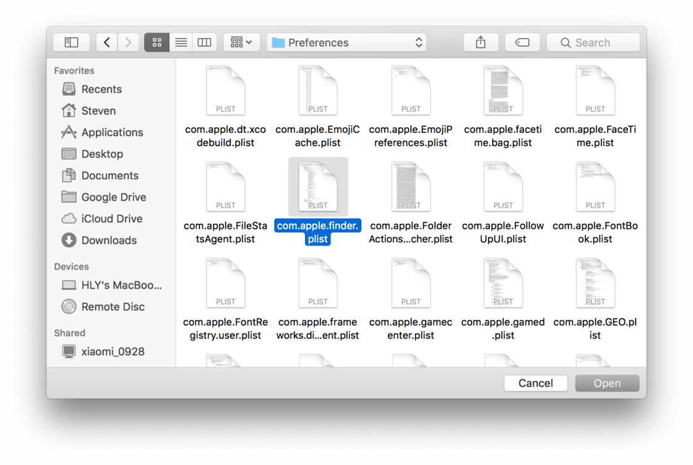
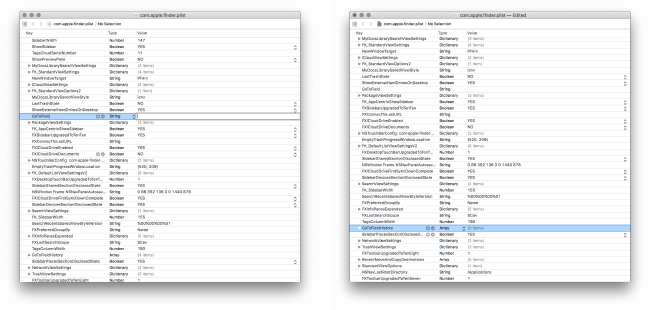
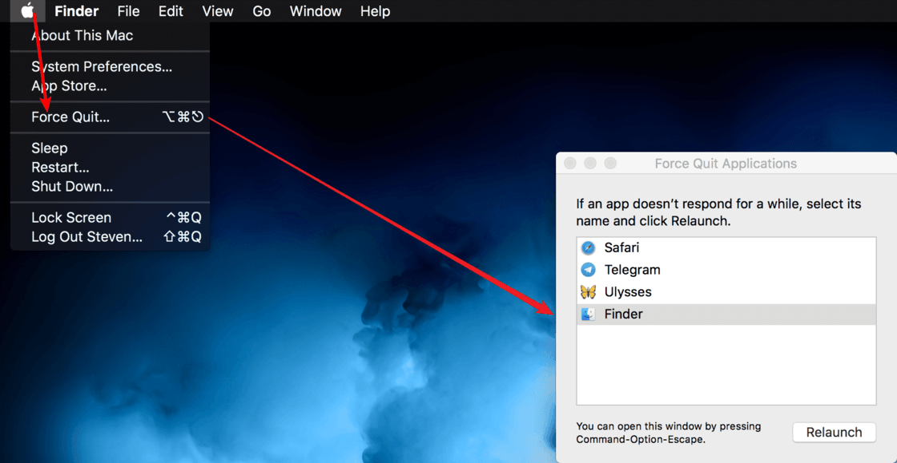

# 清除 macOS Finder 的「前往」(⌘ - shift - G) 记录


2020 年 05 月 01 日

**更新**：其实不用这么麻烦，在终端中跑一行命令即可：

```sh
plutil -replace GoToField -string '' ~/Library/Preferences/com.apple.finder.plist && plutil -replace GoToFieldHistory -json '[]' ~/Library/Preferences/com.apple.finder.plist && killall Finder

# 此命令所做的就是下文的内容：清除 ~/Library/Preferences/com.apple.finder.plist 中 GoToField 和 GoToFieldHistory 两个键值下的所有内容并重启 Finder
```

------


作为一个强迫症患者，我最近发现 macOS 的访达会记录所有「前往」(⌘ - shift - G) 过的文件夹，而且「前往」的记录无法很方便地删除。不过，借助万能的搜索引擎，我还是找到了删除「前往」记录的办法，记录如下。

为了方便编辑 plist 文件，我们需要先在 Mac App Store 中下载 **Xcode**。

1. 打开 Xcode，在菜单栏中选择 File > Open…，然后按 ⌘ - shift - G，输入`~/Library/Preferences/`，点击 Go

前往 ~/Library/Preferences/ 文件夹

2. 找到 `com.apple.finder.plist`，点击 Open

打开访达配置文件

3. 清空 `GoToField` 的键值，删除 `GoToFieldHistory` 下的所有子项，按 ⌘ - S 保存，随后退出 Xcode

清除 plist 文件中的「前往」记录

4. 点击左上角的 Apple 菜单 () > Force Quit… > Finder > Relaunch，重启访达

重启访达

这时打开访达就可以发现，「前往」记录被成功清除了。