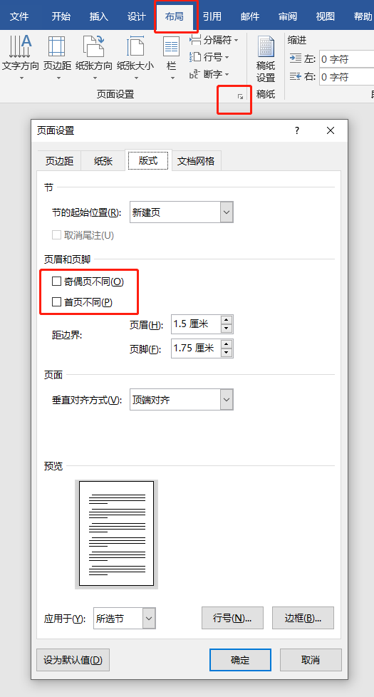
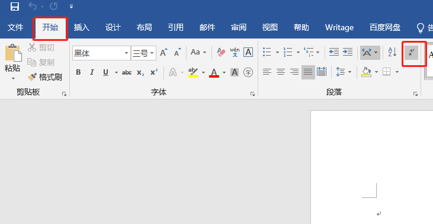
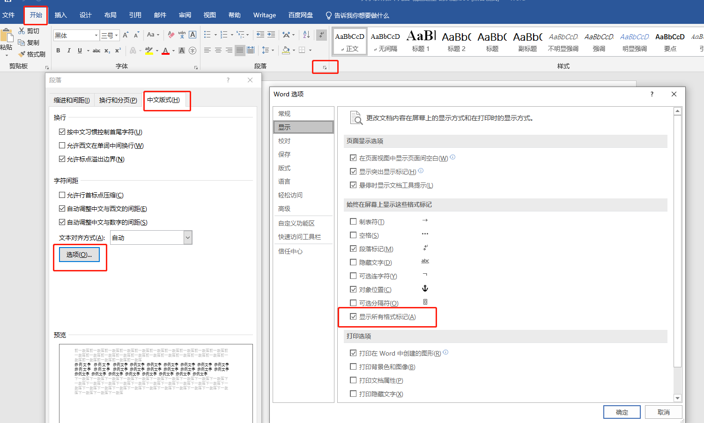

# 为什么word文件没有页码

有时遇到文档页数较多时，为了更方便的使用，我们可能会需要添加页码，然而偶尔会出现这样一个问题，某一页或者某几页的页码不见了，这是怎么回事呢

WORD里的页码有的不显示的原因有 3 个。

#### 1. 设置了奇偶页不同，这样如果只设置了奇数页页码，那偶数页是不显示的，这时候只要再设置偶数页页码或者将奇偶页不同取消掉就可以了

#### 2. 如上图，如果勾选了首页不同，那么首页的页码则不会出现

#### 3. 当上一页，插入了 **分节符**（不是分页符），上下节之间取消了 "同前节"，插入页码时选择了 "应用于本节"，那也可能不显示页码。这时只要删除分节符或链接到前一节即可。

显示和隐藏分节符的操作如下图：

Add: 下图的设置可以打开页面所有格式标记，所以也包含**分节符**。

