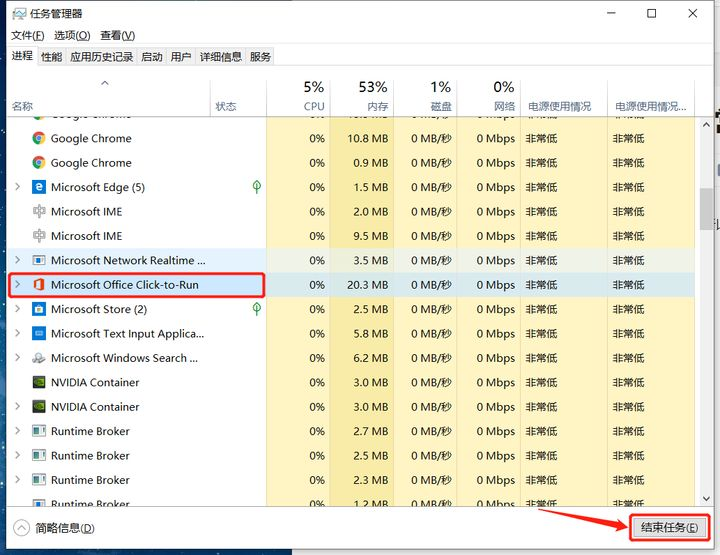
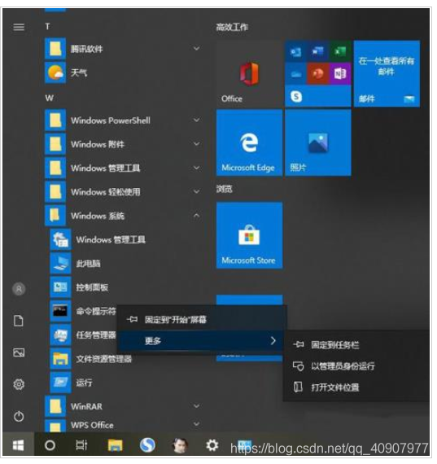
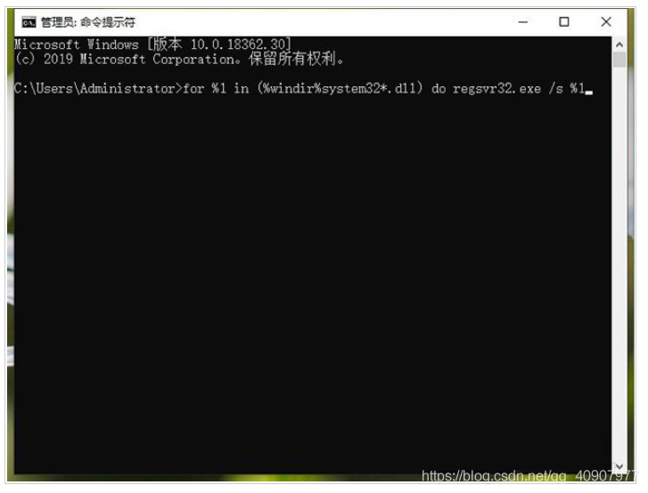
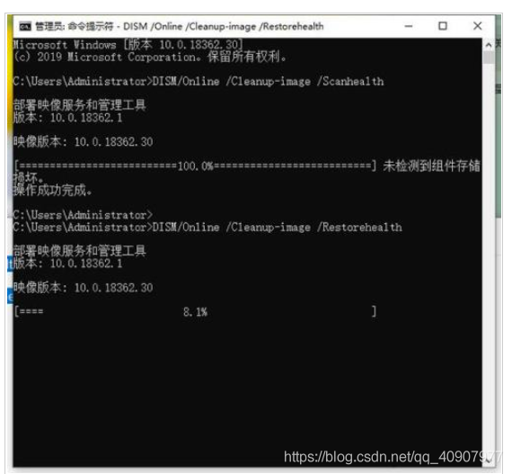

# office 应用程序无法正常启动 0xc0000142

## 方法一

> 一下笔记来源：https://zhuanlan.zhihu.com/p/142113192

以 win10 系统下为例，当遇到此类问题可进行以下操作。

Ctrl+Alt+Delete ，调出任务管理器界面，而后关掉 Microsoft Office Click-to-Run

多试几次就可以了

------

2021 年 1 月 30 日更新

感谢这位朋友的建议，祝他一帆风顺，大家也可以试试哦～o (*￣▽￣*) ブ

over

## 方法二

### 原因解析：

出现 0xc0000142 的报错信息可能是由于系统文件缺失或损坏导致的。

### 解决方法：

1、首先我们点击“开始菜单”，下拉找到并点击展开“Windows系统”选项，鼠标右键点击“命令提示符”，更多–》以管理员身份运行。

在管理员：命令提示符窗口中输入：“for %1 in (%windir%system32*.dll) do regsvr32.exe /s %1”，并回车键确定。

我们将电脑重启测试一下是否可以解决，如果不能解决，继续以管理员身份运行命令提示符中依次执行以下命令：

> DISM/Online /Cleanup-image /Scanhealth
>
> DISM/Online /Cleanup-image /Restorehealth
>
> Sfc /scannow

