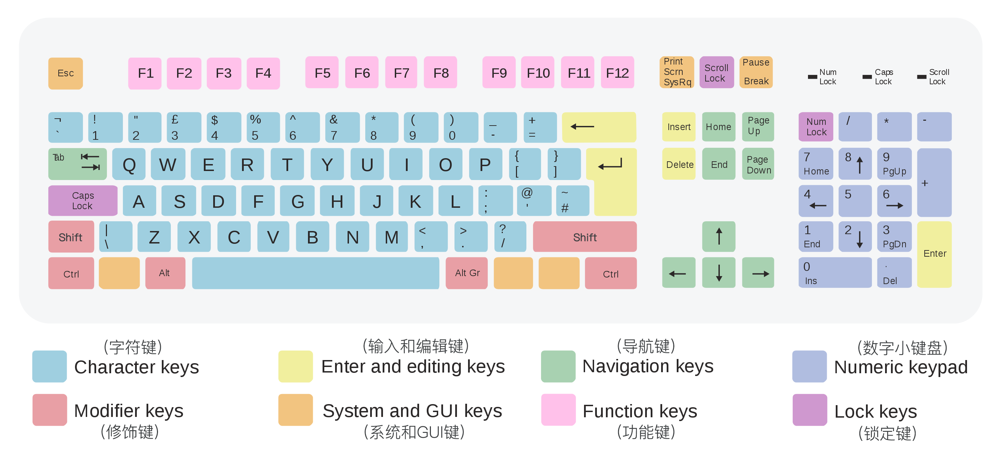

# Windows 入门教程 

   

## 标准键盘布局

 

#### Character keys (字符键)
**包含: `26个英文字母键` + `数字键` + `标点符号键等`**

- (1) `1, 2, 3, 4, 5, 6, 7, 8, 9, 0, -, =` 这些数字字符可以直接输入, 数字头上的各种符号, 输入时按下 `Shift` 键便可以打出. (例如: `#` = 按下 `Shift + 3`)
- (2) 熟背 26 个英文字符键: 可以这样背:
    + 第一行字母键: `Q, W, E, R, T`; `Y, U, I, O, P`
    + 第二行字符键: `A, S, D, F, G`; `H, J, K, L`
    + 第三行字符键: `Z, X, C, V, B, N, M`

#### Modifier keys (修饰键)

#### Enter and editing keys (输入 和 编辑器)
- `Enter`键: 又叫回车键. 按此键表示开始执行输入的命令, 在输入字符时, 按下此键表示换行.

#### System and GUI keys (系统 和 GUI 键)
- `ESC` 键: 退出键. 功能是退出当前环境(应用), 返回到原菜单.

#### Navigation keys (导航键)

#### Function keys (功能键)

#### Numeric Keypad (数字小键盘)

#### Lock keys (锁定键)

## 键盘手指的分工:
1. 左手小指主管 5 个键: `1, Q, A, Z` 和 左 `Shift` 键, 此外还分管左边的一些控制键. 
2. 左手无名指主管 4 个键: `2, W, S , X` 
3. 左手中指主管 4 个键: `3, E, D, C`
4. 左手食指主管 8 个键: `4, R, F, V,` `5, T, G, B`
5. 2 个大拇指专门击打`空格键` (既:最长的长条键).
6. 右手食指主管 8 个键: `6, Y, H, N`, `7, U, J, M`
7. 右手中指主管 4 个键: `8, I, K,` `,`
8. 右手无名指主管 4 个键: `9, O, L,` `.`
9. 右手小手指主管 5 个键: `0, P,` `;`,`/` 和 右 `Shift` 键, 此外还分管右边的一些控制键

