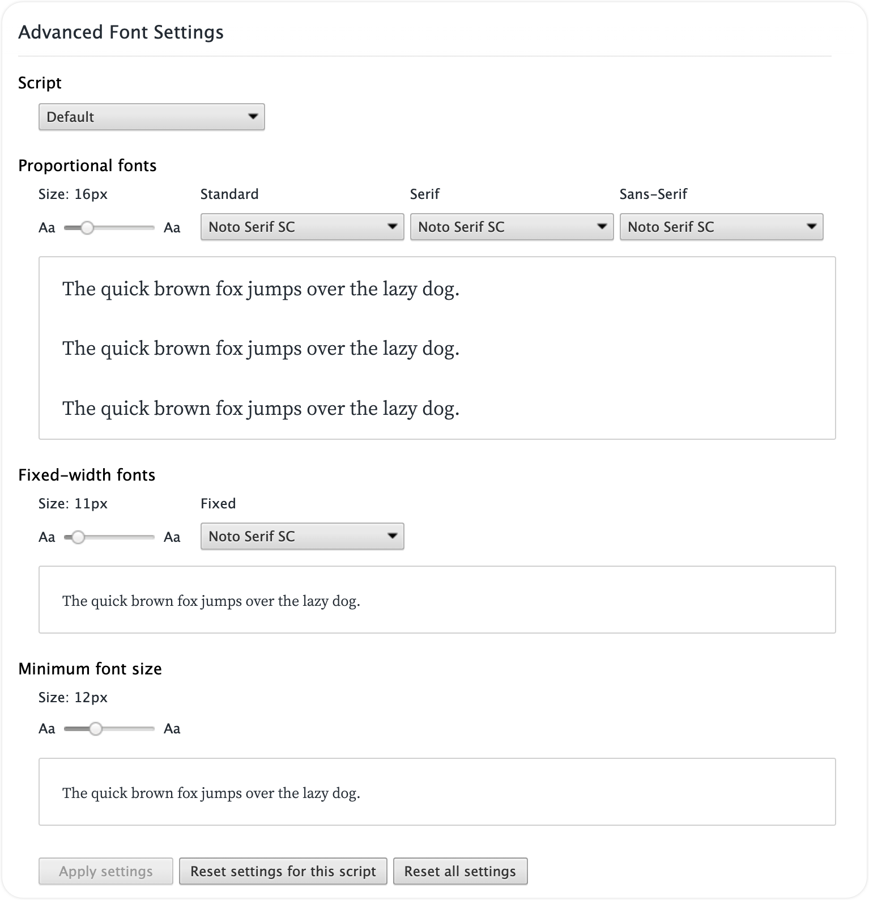
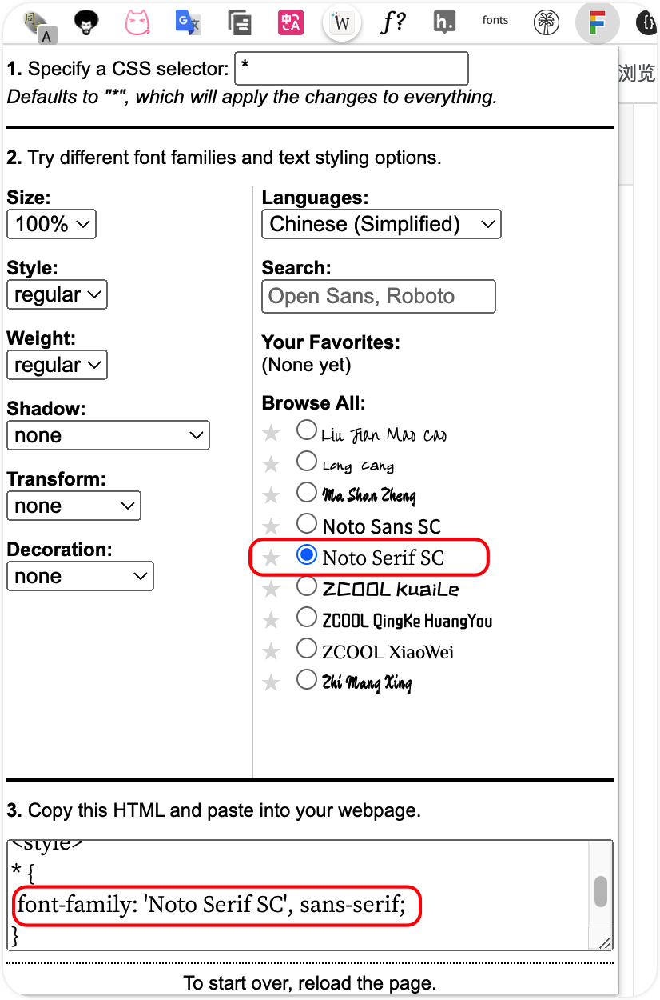
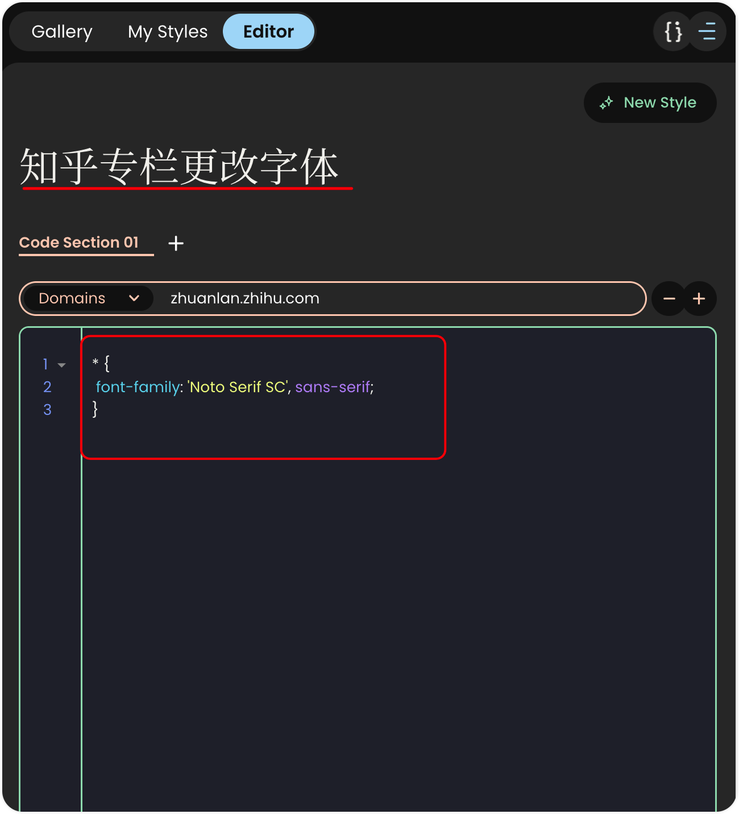

# Chrome 

Mac Chrome 调出控制台的快捷键: `fn` + `F12`


## New Words


## ▲ 1. Chrome 中自定义网页字体

*Edited: 2023.06.23*

自定义网页字体，一共要用到 3 个插件：

### (1) Advanced Font Settings

 `Advanced Font Settings`, 我记得很久之前 Chrome 默认更改字体的设置和此插件的界面一模一样，我的设置如下：



### (2) Goolge Font Previewer for Chrome

因为上面的 Fonts 插件在一些页面下不起作用，所以安装了第二个插件 `Goolge Font Previewer for Chrome`。


看名字就可以理解，这个字体是设置的 Google Font 字体，所以需要安装 Google 开源的字体，因为我第 (1) 个插件里的字体就是用的 google 字体 `Noto Serif SC` （SC: Simple Chinese），所以我无需再次安装，安装好之后，只需要在当前需要更改字体的页面直接点击插件图标来更换字体就行啦。如下图：



不过，这个插件也有个问题，就是每个网页打开后都需要单独设置一次，刷新页面后也需要再次设置，这就要了命了。。。 所以我们需要安装第三个插件来解决问题。

### (3) Stylish

`Stylish` 这个插件很多人应该都用过了，通过这个插件你可以更改网页中任何不满意的地方，只要你会 CSS，当然 CSS 对我没有问题，但是我也不喜欢折腾 Stylish 来自定义页面的各个板块，毕竟网站的页面绝大部分都是设计师设计出来的，我们几乎没有必要改动。在这里 Stylish 的作用是什么呢？那就是解决第二个插件设置了字体，刷新页面后还需要再次点击 `Google Font Previewer for Chrome` 来更改字体的重复重复操作。解决方式是这样的，我们首先看第二个插件的截图中红框框起来的字体 ：

```css
* {
    font-family: 'Noto Serif SC', sans-serif;
}
```

我们点击右上角的 Stylish 图标，在弹框中按照下图编辑并保存，这样以后我们给当前网页设置的字体被优先设置给当前网页了。




## ▲ 2. Chrome 中长截图

按 `F12`(Win) / `command + option + i`(Mac) 打开控制台, 接着按下
`Ctrl+Shift+P`(Win) / `Command + Shift + P`(Mac), 这时会出现一个搜索框,
输入 "Capture full size screenshot", 回车就可以自动截取整个网页内容并自动下载到本地.


## ▲ 3. Chrome 中保存当前网页中的所有图片
按 `F12`(Win) / `command + option + i`(Mac) 打开控制台, 点击 `Console`
进入控制台, 在输入框中输入
```
[...$$("img")].map(a => a.src).join('\r\n')
```
按回车,
然后我们可以看到网页内所有的图片的地址都被提取出来了.

而为了实现批量下载到本地, 我们可以将这些地址全部复制下来, 放在一个 “url.txt” 的文件内,
然后利用 wget 一键下载, 就可以全部保留到本地了。


## ▲ 4. mac 下chrome扩展插件安装在什么位置？
如果你的记性够好，请记住MAC下插件的安装位置：
`~/Library/Application Support/Google/Chrome/Default/Extensions`

Tip:找 mac 下 chrome 插件的安装位置是因为，chrome 浏览器的默认搜索引擎被一个插件劫持了，但是这个插件又卸不掉，只能根据插件的 ID 值在插件文件夹下查找。


## ▲ 5. 临时解决 macOS 下 Chrome 浏览器被托管的问题
1. 使用 Combo Cleaner 全盘扫描, 然后清除全部威胁.
2. 打开 `终端` 或 `iTerm` 使用如下命令删除 profiles 文件:
   ```sh
    # 查看
    sudo profiles -P
    # 删除
    sudo /usr/bin/profiles -D 
    # or
    sudo /urs/bin/profiles -D -f
   ```
3. 点击 `访达`，在右上角点击 `前往` --> `资源库` --> `LaunchAgents`，把下面不认识的 `com.xxxxxx.plist` 统统删除。
4. 重启 Mac.

