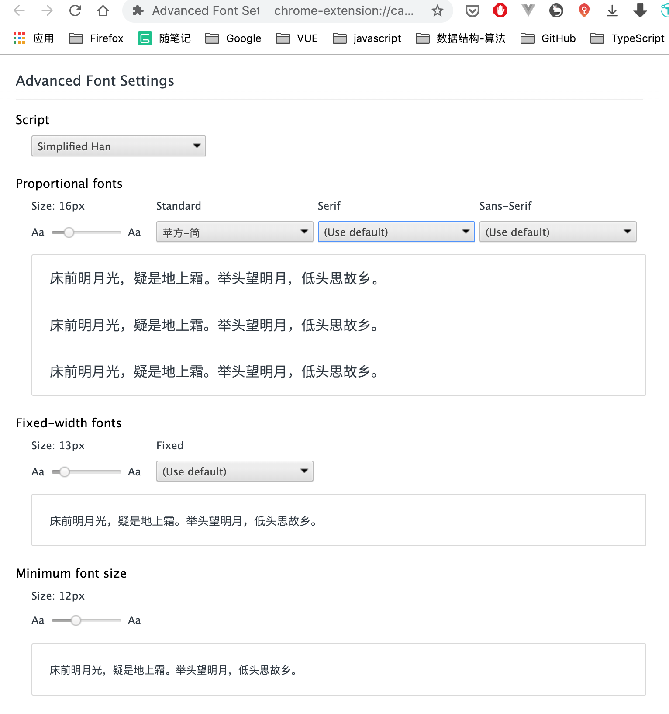

# Chrome 

Mac Chrome 调出控制台的快捷键: `fn` + `F12`


## 目录 (Catalog)
1. Chrome 下 advanced(进阶) 字体设置
2. Chrome 中长截图
3. Chrome 中保存当前网页中的所有图片


## 生词 (New Words)


## 内容 (Content)
### 1. Chrome 下 advanced(进阶) 字体设置


### 2. Chrome 中长截图

按 `F12`(Win) / `command + option + i`(Mac) 打开控制台, 接着按下
`Ctrl+Shift+P`(Win) / `Command + Shift + P`(Mac), 这时会出现一个搜索框,
输入 "Capture full size screenshot", 回车就可以自动截取整个网页内容并自动下载到本地.


### 3. Chrome 中保存当前网页中的所有图片
按 `F12`(Win) / `command + option + i`(Mac) 打开控制台, 点击 `Console`
进入控制台, 在输入框中输入
```
[...$$("img")].map(a => a.src).join('\r\n')
```
按回车,
然后我们可以看到网页内所有的图片的地址都被提取出来了.

而为了实现批量下载到本地, 我们可以将这些地址全部复制下来, 放在一个 “url.txt” 的文件内,
然后利用 wget 一键下载, 就可以全部保留到本地了。

### 4. mac 下chrome扩展插件安装在什么位置？
如果你的记性够好，请记住MAC下插件的安装位置：
`~/Library/Application Support/Google/Chrome/Default/Extensions`

Tip:找 mac 下 chrome 插件的安装位置是因为，chrome 浏览器的默认搜索引擎被一个插件劫持了，但是这个插件又卸不掉，只能根据插件的 ID 值在插件文件夹下查找。


### 5. 临时解决 macOS 下 Chrome 浏览器被托管的问题
1. 使用 Combo Cleaner 全盘扫描, 然后清除全部威胁.
2. 打开 `终端` 或 `iTerm` 使用如下命令删除 profiles 文件:
   ```sh
    # 查看
    sudo profiles -P
    # 删除
    sudo /usr/bin/profiles -D 
    # or
    sudo /urs/bin/profiles -D -f
   ```
3. 点击 `访达`，在右上角点击 `前往` --> `资源库` --> `LaunchAgents`，把下面不认识的 `com.xxxxxx.plist` 统统删除。
4. 重启 Mac.

