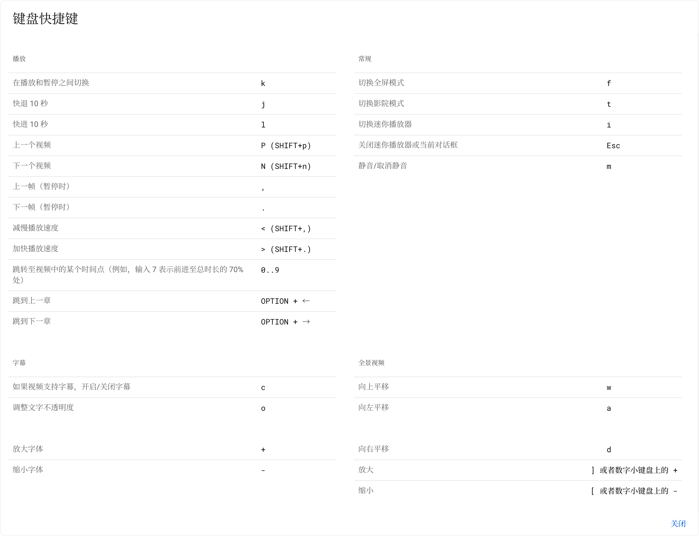
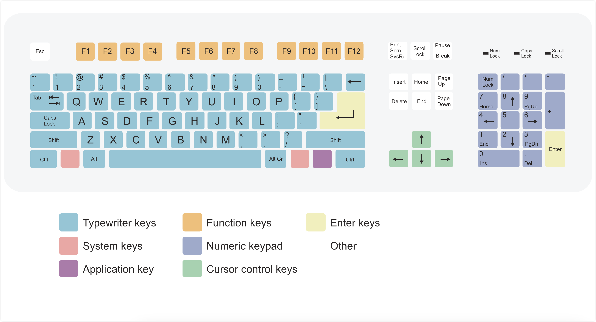
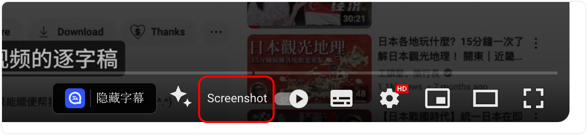
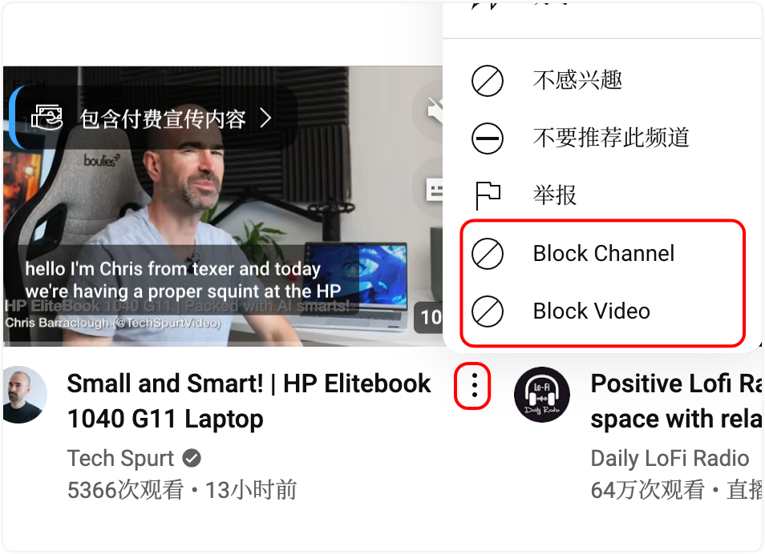
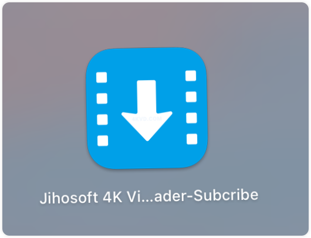

# Youtube 使用教程

## ▲ 播放快捷键

*Add: 2024.07.14*

在当前 Youtube 页面按下 `Shift` + `？` 快捷键即可调出快捷键窗口，如下：

下面表格为 ChatGPT 4o 识别的图片内容：

ChatGPT 4o:

The current environment does not have the necessary language data files for Chinese Simplified to perform OCR. However, I can still help you transcribe the text manually and format it into a table.

Here is the transcribed content from the image, formatted into a table:

### 播放控制

| 功能                                    | 快捷键          |
|---------------------------------------| --------------- |
| 在播放和暂停之间切换                            | `K`             |
| 快退 10 秒                               | `J`             |
| 快进 10 秒                               | `L`             |
| 上一个视频                                 | `P` (SHIFT+p)   |
| 下一个视频                                 | `N` (SHIFT+n)   |
| 上一帧（暂停时）                              | `,`             |
| 下一帧（暂停时）                              | `.`             |
| 减慢播放速度（5s）                            | `<`             |
| 加快播放速度（5s）                            | `>`             |
| 倍速播放（减慢：从 normal -- 0.25 每次减慢 0.25）   | `Shift`+ `,`    |
| 倍速播放（加快：从 normal -- 2 每次加速 0.25）      | `Shift`+ `.`    |
| 跳转至视频中的某个时间点                          | `0...9`         |
| 跳到上一章                                 | `OPTION`  + `←` |
| 跳到下一章                                 | `OPTION`  + `→` |

### 常规操作

| 功能                   | 快捷键   |
|----------------------|-------|
| 切换全屏模式               | `F`   |
| 切换剧院模式               | `T`   |
| 切换迷你播放器              | `I`   |
| 关闭迷你播放器或当前对话框    | `Esc` |
| 静音/取消静音              | `M`   |

### 字幕控制

| 功能                   | 快捷键 |
|----------------------|-----|
| 如果视频支持字幕，开启/关闭字幕     | `C` |
| 调整文字显示透明度            | `O` |
| 调整窗口不透明度             | `W` |
| 放大字体                 | `+`   |
| 缩小字体                 | `-`   |

### 全景视频

| 功能        | 快捷键                 |
|-----------| ---------------------- |
| 向上平移      | w                      |
| 向左平移      | a                      |
| 向下平移      | s                      |
| 向右平移      | d                      |
| 放大        | ] 或者数字小键盘上的 + |
| 缩小        | [ 或者数字小键盘上的 - |

If you need any modifications or additional formatting, please let me know!

##  ▲ Chrome Youtube 插件

*Add: 2024.07.14*

下面笔记来源：

- [给中国人的YouTube使用教程 | 亮点、技巧、插件 YouTube Tutorial](https://www.youtube.com/watch?v=WSPI21gUpCs&ab_channel=%E6%AA%80%E4%B8%9C%E4%B8%9C%C2%B7Tango)
- 

| 插件名                                                       | 描述                                                         |
| ------------------------------------------------------------ | ------------------------------------------------------------ |
| [YouTube summary with ChatGPT & Claude](https://chromewebstore.google.com/detail/youtube-summary-with-chat/nmmicjeknamkfloonkhhcjmomieiodli?utm_source=ext_app_menu) | glasp.io 开发。 注：当前 YouTube summary 的总结功能不是很好用， 也可以在 Chrome 插件商店中去尝试其他 summary plugin. |
| [Picture-in-Picture Extension (by Google)](https://chromewebstore.google.com/detail/hkgfoiooedgoejojocmhlaklaeopbecg?utm_source=ext_app_menu) | 画中画：把 YouTube 的播放页面单独用画中画的形式缩剥离出来， 也可以调整这个画中画窗口的大小。 |
| [Screenshot YouTube](https://chromewebstore.google.com/detail/gjoijpfmdhbjkkgnmahganhoinjjpohk?utm_source=ext_app_menu) | 截图的按钮就在当前视频的下方，图示如下：  注：截图的大小根据当前观看视频的分辨率来定， 观看 4K 就会截图 4K  的截图，其他同理。 |
| [BlockTube](https://chromewebstore.google.com/detail/blocktube/bbeaicapbccfllodepmimpkgecanonai?utm_source=ext_app_menu) | 安装完之后的使用方式如下图：  |
| [PocketTube: Youtube Subscription Manager](https://chromewebstore.google.com/detail/pockettube-youtube-subscr/kdmnjgijlmjgmimahnillepgcgeemffb?utm_source=ext_app_menu) | 管理 YouTube 订阅的频道                                      |
| [Youtube-shorts block](https://chromewebstore.google.com/detail/youtube-shorts-block/jiaopdjbehhjgokpphdfgmapkobbnmjp?utm_source=ext_app_menu) | 屏蔽 YouTube 列表中的 Shorts                                 |
| [Download Youtube Subtitles](https://chromewebstore.google.com/detail/download-youtube-subtitle/gdfkkklabpbkconekepgjcghpagenigl?utm_source=ext_app_menu) | 下载 YouTube 视频中的字幕，但前提是当前视频是有字幕的情况下。有字幕可以分为：1. 当前视频的上传者已经上传了字幕；2. 当前视频 YouTube 已经转录了字幕。 |
| 单个视频快速下载: 9x                                         | 在当前视频的 url 前添加 9x，例如视频 url: https://www.youtube.com/watch?v=vwxr9OFkDcQ&ab_channel=YOUYOU, 添加 9x 后为：https://www.9xyoutube.com/watch?v=vwxr9OFkDcQ&ab_channel=YOUYOU *注：2024.11.24 - 不好用，高清视频没有音频整合* |
| 单个及批量视频下载                                           | 使用 Downie 4 下载                                           |
| 批量视频下载                                                 | 使用自己购买的这个伪 4k downloader  |
| 4K Downloader                                                | 上面的 Jihosoft 4K Video downloader 是模仿真的 4K Downloader 的国内产品，真正的 [4K Downloader](https://www.4kdownload.com/zh-cn/6) 会员费用很贵，从闲鱼购买的破解版。 - 2024.11.24 |

## ▲ 不带字幕的 YouTube 视频下载

*Add: 2024.07.14*

当前我主要还是使用的 [Buzz](https://github.com/chidiwilliams/buzz) 来把音频转文字的.

> Buzz transcribes and translates audio offline on your personal computer. Powered by OpenAI's Whisper.
> Buzz 可在您的个人计算机上离线转录和翻译音频。由 OpenAI 的 Whisper 提供支持。
