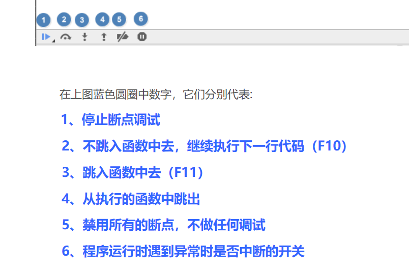

## 控制台使用教程

> 待做笔记：https://zh.javascript.info/debugging-chrome

-  控制台快捷键 
    1.Resume Script execution F8 (Ctrl + \)

## [Chrome 开发者工具的小技巧](https://blog.csdn.net/u011350541/article/details/77488791)
- 代码格式化
- 强制 DOM 状态
- 动画
- 直接编辑页面
- 网络限速
- 复制 HTTP 请求
- 抓图

## Chrome 导出/导入 书签
- 导出:
    + 在计算机上打开Chrome。
    + 点击右上角的 "更多(竖的...)" 图标 。
    + 依次选择书签 书签管理器。
    + 依次点击顶部的 "更多(竖的...)" 图标 导出书签。
- 导入:
    + 在计算机上打开 Chrome。
    + 点击右上角的“更多”图标 更多。
    + 依次选择书签 然后 导入书签和设置。
    + 选择包含待导入书签的程序。
    + 点击导入。
    + 点击完成。    