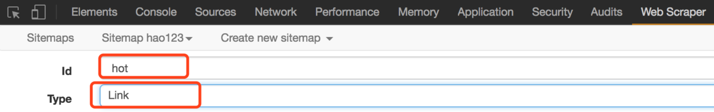
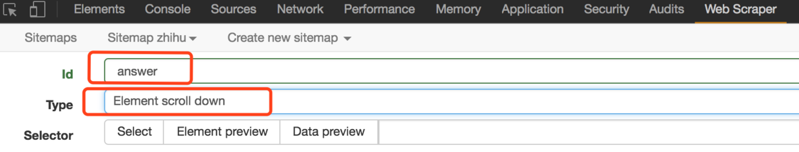

# 网页数据抓取工具 - 谷歌插件 Web Scraper

> 官网文档：https://webscraper.io/documentation

> 当前文章来源：https://blog.csdn.net/hezheqiang/article/details/79310713 (注：有更改)
>
> 
> 更多更详细的 Web Scraper 使用讲解见 B 站这个教程：https://space.bilibili.com/39880798/channel/collectiondetail?sid=566948

| 单词    | 美式发音      | 词性 + 汉语释义              |
| ------- | ------------- | ---------------------------- |
| scrape  | `/skreɪp/`    | v. 刮；擦伤 n. 刮痕；擦伤 |
| scraper | `/ˈskreɪpər/` | n. 刮刀；刮板                |

Web Scraper 是一款免费的，适用于普通用户的爬虫工具，可以方便的通过鼠标和简单配置获取你所想要数据。例如知乎回答列表、微博热门、微博评论、电商网站商品信息、博客文章列表等等。

(1) 在线安装方式： 访问 [web Scraper 插件](https://chrome.google.com/webstore/detail/web-scraper/jnhgnonknehpejjnehehllkliplmbmhn) ，点击 “添加至 CHROME”。

(2) 使用方式的入口：Open Web Scraper (打开网络爬虫)

Web Scraper is integrated into browser Developer tools. Figure 1 shows how you can open it on Chrome. You can also use keyboard shortcuts to open Developer tools. After opening Developer tools open *Web Scraper* tab. 

(Web Scraper 已集成到浏览器开发人员工具中。图 1 显示了如何在 Chrome 上打开它。您还可以使用键盘快捷键打开开发人员工具。打开开发人员工具后，打开 Web Scraper 选项卡)。

Shortcuts (快捷键)：

- Windows, Linux: `Ctrl + Shift + I` / `F12`
- Mac: `Command + Option + I`

## ▲ 原理及功能说明

### 数据爬取的基本思路：（Answer: ChatGPT 4o）

1. **获取初始数据源：** 首先通过一个或多个网页入口地址（这些入口可以是像知乎的专栏页面、博客文章列表等），找到我们需要的数据。你可以理解为这是我们爬取数据的起点。

2. **提取关键信息：** 接着，根据入口页面上的某些提示信息，比如网页中的链接、分页按钮等，进入下一层页面，从这些页面获取具体数据。就像点击网页中的链接，逐步深入到更具体的内容页。

3. **继续深入挖掘：** 然后根据已经找到的链接继续爬取下一层数据，直到获取到所有想要的数据（这个过程可以是递归的，即反复进行，直到爬完所有页面）。

---

原理大致如此，接下来正式认识一下 Web Scraper 这个工具，打开开发者工具，找到并点击 Web Scraper 标签栏，看到分为三个部分：

### Web Scraper 功能

| index | 功能                                  | 子功能                        | 说明 |
| ----- | ------------------------------------- | ----------------------------- | ---- |
| 1     | Sitemaps (站点地图集)                 | 无                            |      |
| 2     | Sitemap (站点地图)                    | 无                            |      |
| 3     | Create new sitemap (创建新的站点地图) | Create Sitemap (创建站点地图) |      |
|       |                                       | Import Sitemap (导入站点地图) |      |

#### (3) Create new sitemap

首先理解 **sitemap** ，字面意思**网站地图**(or **站点地图**)，这里可以理解为一个入口地址，可以理解为对应一个网站，对应一个需求，假设要获取知乎上的一个问题的回答，就创建一个 sitemap , 并将这个问题所在的地址设置为 sitemap 的 Start URL，然后点击 “Create Sitemap” 即可创建一个 sitemap。

#### (1) Sitemaps

sitemap 的集合，所有创建过的 sitemap 都会在这里显示，并且可以在这里进入一个 sitemap 进行修改和数据抓取等操作。

#### (2) Sitemap

进入某个 sitemap , 可以进行一系列的操作，如下图：

其中红色框部分 Add new selector 是必不可少的步骤。**Selector 选择器**，一个选择器对应网页上的一部分区域，也就是包含我们要收集的数据的部分。

下面是调整后的表格，添加了每个功能的汉语翻译：

| 功能                    | 汉语翻译         | 描述                                                         | 操作说明                                                     |
| ----------------------- | ---------------- | ------------------------------------------------------------ | ------------------------------------------------------------ |
| **Selectors**           | **选择器**       | 查看和管理当前 Sitemap 中的所有选择器（选择器定义了爬虫要抓取的内容）。 | 点击后可以看到已经创建的选择器列表，也可以在这里添加、编辑或者删除选择器。 |
| **Edit metadata**       | **编辑元数据**   | 编辑 Sitemap 的元数据，比如更改 Sitemap 名称或修改起始 URL。 | 点击后可以编辑你的 Sitemap 信息，包括其名称、URL 等。如果想修改 Sitemap 的起始页面 URL，通常可以在这里进行设置。 |
| **Website state setup** | **网站状态设置** | 设置网站的状态，这个选项用于处理需要登录或动态加载内容的网站。 | 如果目标网站需要登录、动态加载或其他复杂操作，可以在这里预设一些状态，如使用 cookies 或者等待页面加载完毕。 |
| **Scrape**              | **抓取**         | 开始执行爬虫任务，按照你设置的选择器规则进行数据抓取。       | 点击后开始爬取数据，你可以选择爬取的深度，调整并开始抓取。   |
| **Browse**              | **浏览**         | 查看爬虫抓取到的数据。                                       | 在这里可以浏览已经抓取到的数据，常用于检查爬取结果是否符合预期。 |
| **Export Sitemap**      | **导出 Sitemap** | 导出当前 Sitemap 的结构。这个文件可以在其他 Web Scraper 环境中导入。 | 点击后可以将 Sitemap 以 JSON 文件的形式导出，方便在其他地方重新使用，或者备份当前的爬虫结构。 |
| **Export data**         | **导出数据**     | 导出抓取到的数据，支持 CSV、JSON 等格式。                    | 当抓取完成后，可以通过这个选项导出所有的抓取结果，常用于分析和处理爬取到的数据。 |

### Add new selector (添加选择器) 按钮设置讲解

#### 创建选择器的设置项 - GPT 4o

| 功能                 | 汉语翻译       | 描述                                                         | 操作说明                                                     |
| -------------------- | -------------- | ------------------------------------------------------------ | ------------------------------------------------------------ |
| **Id**               | **ID**         | 用于标识当前选择器的唯一名称。                               | 你可以给选择器一个独特的 ID，便于在后续查看和管理不同选择器。每个选择器应该有一个清晰的命名，描述它的功能。 |
| **Type**             | **类型**       | 设置选择器的类型，在此处选择的是 **Link**，表示要抓取页面上的链接。 | 选择 **Link** 时，爬虫会抓取页面上的链接地址（例如 `<a>` 标签中的 `href`）。 |
| **Selector**         | **选择器路径** | 通过 **Select** 按钮可以在页面中选择你想要抓取的元素，自动生成 CSS 选择器路径。 | 点击 **Select** 按钮，然后在页面中选择一个链接元素，爬虫会抓取所有符合这个 CSS 选择器的链接。 |
| **Multiple**         | **多个**       | 勾选此选项表示会抓取多个符合选择条件的元素，而不仅仅是一个。 | 如果页面上有多个链接要抓取（例如文章列表），需要勾选 **Multiple** 选项，这样爬虫会抓取所有符合条件的链接。 |
| **Link type**        | **链接类型**   | 表示抓取链接时读取其 `href` 属性的值。                       | 爬虫会读取链接的 `href` 属性值，这是页面跳转的链接地址，通常情况下保持默认设置即可。 |
| **Parent Selectors** | **父选择器**   | 用于定义当前选择器的父级选择器，表示当前选择器的上下文（例如：在一个特定列表中选择链接）。 | 如果页面结构复杂，可以定义当前选择器的父级选择器，以确保选择器在正确的上下文中执行。比如这里选择的是 `_root`。 |
| **Save selector**    | **保存选择器** | 保存当前选择器的设置。                                       | 点击后保存当前选择器，并将其添加到 Sitemap 中，以便在后续的爬虫运行中使用。 |
| **Cancel**           | **取消**       | 取消当前选择器的设置，不保存更改。                           | 点击后取消当前的操作，放弃对选择器的更改。                   |

你现在设置的选择器类型为 **Link**，并且勾选了 **Multiple**，这意味着它会抓取页面上所有符合选择条件的链接。这在抓取包含多个文章或列表的页面时非常有用。**Parent Selectors** 用来定义当前选择器的上下文，确保选择器的作用范围限定在特定区域。

#### Type： Selector Type (选择器类型) - GPT 4o

非常感谢你的耐心！下面我将按照你提到的格式，以表格的形式详细讲解 Web Scraper 中设置选择器（Selector）的选项。

| 选择器类型              | 汉语翻译             | 描述                                                         | 操作说明                                                     |
| ----------------------- | -------------------- | ------------------------------------------------------------ | ------------------------------------------------------------ |
| **Text**                | **文本**             | 抓取页面中的文本内容。                                       | 用于抓取页面上显示的纯文本，比如标题、段落等。点击“Select”并在页面中选择要抓取的文本区域。 |
| **Link**                | **链接**             | 抓取页面中的链接（通常是 `<a>` 标签），并可以递归进入链接的目标页面抓取更多数据。 | 选择页面上的链接，通常用于递归爬取文章详情页。可以点击 "Select" 选择链接并勾选 **Multiple**，让爬虫抓取多个链接。 |
| **Image**               | **图片**             | 抓取页面中的图片链接或 `src` 属性。                          | 用于抓取图片的 URL，可以在页面中选择图片元素来提取它的 `src` 属性。 |
| **Table**               | **表格**             | 抓取页面中的表格内容。                                       | 选择页面中的 `<table>` 元素，可以抓取表格中的结构化数据。    |
| **Element attribute**   | **元素属性**         | 抓取 HTML 元素的属性值，比如 `class`、`id`、`href` 等。      | 如果需要抓取元素的某个特定属性（如链接的 `href` 或图片的 `src`），使用这个选项并选择要抓取的属性。 |
| **HTML**                | **HTML**             | 抓取页面中的 HTML 代码片段。                                 | 选择页面中的某个元素，抓取它的完整 HTML 代码，可以包含标签和嵌套结构。 |
| **Element**             | **元素**             | 抓取某个 HTML 元素的完整内容，包含文本、子元素和 HTML。      | 抓取某个 HTML 元素的全部内容和子元素，适合需要提取某个复杂结构的情况。 |
| **Element scroll down** | **元素滚动加载**     | 模拟滚动页面以加载更多内容，适用于懒加载或无限滚动的页面。   | 当页面需要滚动才能加载更多内容时，使用这个选项，爬虫会模拟滚动操作并抓取滚动后加载的新数据。 |
| **Element click**       | **元素点击**         | 模拟点击某个元素，比如按钮或链接，以加载新内容或切换页面。   | 适用于需要点击某个按钮才能加载更多内容的页面，爬虫会模拟点击操作，常用于抓取动态加载内容。 |
| **Grouped**             | **分组**             | 将多个选择器组合在一起，抓取页面上多个相关的数据，比如同时抓取标题、链接和日期等。 | 可以定义多个选择器，并将它们分组在一起，这样在爬虫运行时会一次性抓取多个相关的数据。 |
| **Sitemap.xml Links**   | **Sitemap.xml 链接** | 直接抓取网站的 `sitemap.xml` 中定义的所有链接。              | 适用于网站有 `sitemap.xml` 文件的情况，可以直接抓取站点地图中列出的所有页面链接。 |
| **Pagination**          | **分页**             | 模拟分页抓取操作，用于翻页式列表页面。                       | 当页面有分页时使用，可以让爬虫依次点击分页链接，抓取每一页的内容。 |

这样你可以根据自己的需求选择不同的选择器来设置爬取规则。每个选择器都有不同的应用场景，具体的操作可以根据你的抓取需求进行选择。如果你需要进一步的帮助或有任何问题，随时告诉我！

## ▲ 案例实践

### (0) 自己提供案例

比如抓取上面小高姐 Youtube  的 Playlist 列表：操作步骤如下：

1. 虽然上面作者说 selector (选择器) 的 ID 可以随便写，但是有时候并不知道怎么写，我是先用元素选择器定位当前需要抓取的一大块 div 的外围 div id，然后把这个 id 填入到 ID 选项，操作如下：

    

2. 填写如下：

    

3. Selector 项操作如下：

    ==待编辑==

------

------

*分割线：下面两个示例是文章作者提供*

------

------

### (1) 简单试水 hao123

由浅入深，先以一个最简单的例子为入口，只是作为进一步认识 Web Scraper 服务

> 需求背景：看到下面 hao123 页面中红色框住的部分了吧，我们的需求就是统计这部分区域中的所有网站名称和链接地址，最后以生成到 Excel 中。 因为这部分内容足够简单，当然真正的需求可能比这复杂，这么几个数据手工统计的时间也很快。

开始操作

1. 假设我们已经打开了 hao123 页面，并且在此页面的底部打开了开发者工具，并且定位到了 Web Scraper 标签栏；

2. 点击 “Create Sitemap”；

3. 之后输入 sitemap 名称和 start url，名称只为方便我们标记，就命名为 hao123（注意，不支持中文），start url 就是 hao123 的网址，然后点击 create sitemap；

4. 之后 Web Scraper 自动定位到这个 sitemap，接下来我们添加一个选择器，点击 “add new selector”；

5. 首先给这个 selector 指定一个 id，就是一个便于识别 名字而已，我这里命名为 hot。因为要获取名称和链接，所以将 Type 设置为 Link，这个类型就是专门为网页链接准备的，选择 Link 类型后，会自动提取名称和链接两个属性；

6. 之后点击 select , 然后我们在网页上移动光标，会发现光标所到之处会有颜色变化，变成绿色的，表示就是我么当前选择的区域。我们将光标定位到需求里说的那一栏的某个链接处，例如第一个头条新闻，在此处单击，这个部分就会变成红色，说明已经选中了，我们的目的是要选多个，所以选中这个之后，继续选第二个，我们会发现，这一行的链接都变成了红色，没错，这就是我们要的效果。然后点击 "Done selecting!"(data preview 是选中元素的标识符，可手动修改，通过 class . 元素名称来确定元素 如：div.p_name a)，最后别忘了勾选 Multiple ，表示要采集多条数据；

7. 最后保存，save selector。点击 Element preview 可以预览选择的区域，点击 Data preview 可以在浏览器里预览抓取的数据。 后面的文本框里的内容，对于懂技术的同学来说很清楚，这就是 xpath，我们可以不通过鼠标操作，直接手写 xpath 也可以；

完整操作过程如下：

8. 上一步操作完，其实就可以导出了。先别急，看一下其他的操作，Sitemap hao123 下的 Selector graph，可以看出拓扑结构图，_root 是根 selector ，创建一个 sitemap 自动会有一个 _root 节点，可以看到它的子 selector，就是我们创建的 hot selector；

9. Scrape ，开始抓取数据。

10. Sitemap hao123 下的 Browse ，可以通过浏览器直接查看抓取的最后结果，需要再；

11. 最后，使用 Export data as CSV，以 CSV 格式导出，其中 hot 列是标题，hot-href 列是链接；

### (2) 抓取知乎问题所有回答

> 简单的介绍完了，接下来试一个有些难度的，抓取一个知乎问题的所有答案，包括回答者昵称、赞同数量、回答内容。问题：为什么鲜有炫富的程序员？

知乎的特点是，页面向下滚动才会加载后面的回答

1. 首先还是在 Chrome 中打开这个链接，链接地址为：https://www.zhihu.com/question/30692237，并调出开发者工具，定位到 Web Scraper 标签栏；

2. Create new sitemap，填写 sitemap name 和 start url;

3. 接下来，开始添加选择器，点击 Add new selector；

4. 先来分析一下知乎问题的结构，如图，一个问题由多个这种区域组成，一个区域就是一个回答，这个回答区域包括了昵称、赞同数、回答内容和发布时间等。红色框住的部分就是我们要抓取的内容。所以我们抓取数据的逻辑是这样的：由入口页进入，获取当前页面已加载的回答，找到一个回答区域，提取里面的昵称、赞同数、回答内容，之后依次向下执行，当已加载的区域获取完成，模拟向下滚动鼠标，加载后续的部分，一直循环往复，直到全部加载完毕；

5. 内容结构的拓扑图如下，_root 根节点下包含若干个回答区域，每个区域下包含昵称. 赞同数、回答内容；

6. 按照上面这个拓扑图，开始来创建选择器，填写 selector id 为 answer（随意填），Type 选择 Element scroll down 。解释一下：Element 就是针对这种大范围区域的，这个区域还要包含子元素，回答区域就对应 Element，因为要从这个区域获取我们所需的数据，而 Element scroll down 是说这个区域利用向下滚动的方式可以加载更多出来，就是针对这种下拉加载的情况专门设计的。

7. 接下来点击 Select，然后鼠标到页面上来，让当绿色框框住一个回答区域后点击鼠标，然后移动到下一个回答，同样当绿色框框住一个回答区域后点击鼠标。这时，除了这两个回答外，所有的回答区域都变成了红色框，然后点击 "Done selecting！”，最后别忘了选择 Multiple ，之后保存；

8. 接下来，单击红色区域，进入刚刚创建的 answer 选择器中，创建子选择器；

9. 创建昵称选择器，设置 id 为 name，Type 设置为 Text，Select 选择昵称部分，如果没经验的话，可能第一次选的不准，发现有错误，可以调整，保存即可；

10. 创建赞同数选择器；

11. 创建内容选择器，由于内容是带有格式的并且较长，所以有个技巧，从下面选择会比较方便；

12. 执行 Scrape 操作，由于内容较多，可能需要几分钟的时间，如果是为了做测试，可以找一个回答数较少的问题做测试。

