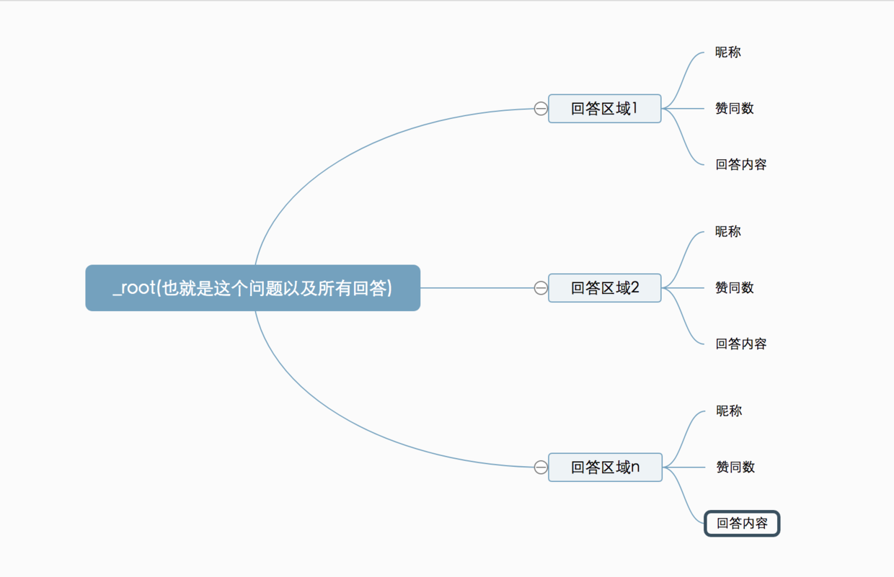

# 网页数据抓取工具 - 谷歌插件 Web Scraper

> 官网文档：https://webscraper.io/documentation

> 当前文章来源：https://blog.csdn.net/hezheqiang/article/details/79310713 (注：自己有更改)
>
> 
> 更多更详细的 Web Scraper 使用讲解见 B 站这个教程：https://space.bilibili.com/39880798/channel/collectiondetail?sid=566948

| 单词    | 美式发音      | 词性 + 汉语释义              |
| ------- | ------------- | ---------------------------- |
| scrape  | `/skreɪp/`    | v. 刮；擦伤 n. 刮痕；擦伤 |
| scraper | `/ˈskreɪpər/` | n. 刮刀；刮板                |

Web Scraper 是一款免费的，适用于普通用户的爬虫工具，可以方便的通过鼠标和简单配置获取你所想要数据。例如知乎回答列表、微博热门、微博评论、电商网站商品信息、博客文章列表等等。

(1) 在线安装方式： 访问 [web Scraper 插件](https://chrome.google.com/webstore/detail/web-scraper/jnhgnonknehpejjnehehllkliplmbmhn) ，点击 “添加至 CHROME”。

(2) 使用方式的入口：Open Web Scraper (打开网络爬虫)

Web Scraper is integrated into browser Developer tools. Figure 1 shows how you can open it on Chrome. You can also use keyboard shortcuts to open Developer tools. After opening Developer tools open *Web Scraper* tab. 

(Web Scraper 已集成到浏览器开发人员工具中。图 1 显示了如何在 Chrome 上打开它。您还可以使用键盘快捷键打开开发人员工具。打开开发人员工具后，打开 Web Scraper 选项卡)。

Shortcuts (快捷键)：

- Windows, Linux: `Ctrl + Shift + I` / `F12`
- Mac: `Command + Option + I`

## ▲ 原理及功能说明

数据爬取的思路一般可以简单概括如下：

1. 通过一个或多个入口地址，获取初始数据。例如一个文章列表页（就是类似于知乎的专栏页一样的页面），或者具有某种规则的页面，例如带有分页的列表页；

2. 根据入口页面的某些信息，例如链接指向，进入下一级页面，获取必要信息；

3. 根据上一级的链接继续进入下一层链接，获取必要信息（此步骤可以无限循环下去）；

原理大致如此，接下来正式认识一下 Web Scraper 这个工具，来，打开开发者工具，点到 Web Scraper 这个标签栏，看到分为三个部分：

| index | 功能                                  | 子功能                        | 说明 |
| ----- | ------------------------------------- | ----------------------------- | ---- |
| 1     | Sitemaps (站点地图集)                 | 无                            |      |
| 2     | Sitemap (站点地图)                    | 无                            |      |
| 3     | Create new sitemap (创建新的站点地图) | Create Sitemap (创建站点地图) |      |
|       |                                       | Import Sitemap (导入站点地图) |      |
|       |                                       |                               |      |

**(3) Create new sitemap**

首先理解 **sitemap** ，字面意思**网站地图**(or **站点地图**)，这里可以理解为一个入口地址，可以理解为对应一个网站，对应一个需求，假设要获取知乎上的一个问题的回答，就创建一个 sitemap , 并将这个问题所在的地址设置为 sitemap 的 Start URL，然后点击 “Create Sitemap” 即可创建一个 sitemap。

**(1) Sitemaps**

sitemap 的集合，所有创建过的 sitemap 都会在这里显示，并且可以在这里进入一个 sitemap 进行修改和数据抓取等操作。

**(2) Sitemap**

进入某个 sitemap , 可以进行一系列的操作，如下图：

其中红色框部分 Add new selector 是必不可少的步骤。**Selector 选择器**，一个选择器对应网页上的一部分区域，也就是包含我们要收集的数据的部分。

需要解释一下，一个 sitemap 下可以有多个 selector，每个 selector 有可以包含子 selector ，一个 selector 可以只对应一个标题，也可以对应一整个区域，此区域可能包含标题、副标题、作者信息、内容等等信息。

| 选择器              | 说明 |
| ------------------- | ---- |
| Selectors           |      |
| Edit metadata       |      |
| Website state setup |      |
| Scrape              |      |
| Browse              |      |
| Export Sitemap      |      |
| Export data         |      |

Selectors：查看所有的选择器。

Selector graph: 查看当前 sitemap 的拓扑结构图，根节点是什么，包含几个选择器，选择器下包含的子选择器。

Edit metadata: 可以修改 sitemap 信息，标题和起始地址。

Scrape: 开始数据抓取工作。

Export data as CSV: 将抓取的数据以 CSV 格式导出。

到这里，有一个简单的认识就可以了，实践出真知，具体的操作案例才具有说服力，下面就以几个例子来说一说具体的用法。

## ▲ 案例实践

### (0) 自己提供案例

比如抓取上面小高姐 Youtube  的 Playlist 列表：操作不如如下：

1. 虽然上面作者说 selector (选择器) 的 ID 可以随便写，但是有时候并不知道怎么写，我是先用 就是元素的

------

------

*分割线：下面两个示例是文章作者提供*

------

------

### (1) 简单试水 hao123

由浅入深，先以一个最简单的例子为入口，只是作为进一步认识 Web Scraper 服务

> 需求背景：看到下面 hao123 页面中红色框住的部分了吧，我们的需求就是统计这部分区域中的所有网站名称和链接地址，最后以生成到 Excel 中。 因为这部分内容足够简单，当然真正的需求可能比这复杂，这么几个数据手工统计的时间也很快。

开始操作

1. 假设我们已经打开了 hao123 页面，并且在此页面的底部打开了开发者工具，并且定位到了 Web Scraper 标签栏；

2. 点击 “Create Sitemap”；

3. 之后输入 sitemap 名称和 start url，名称只为方便我们标记，就命名为 hao123（注意，不支持中文），start url 就是 hao123 的网址，然后点击 create sitemap；

4. 之后 Web Scraper 自动定位到这个 sitemap，接下来我们添加一个选择器，点击 “add new selector”；

5. 首先给这个 selector 指定一个 id，就是一个便于识别 名字而已，我这里命名为 hot。因为要获取名称和链接，所以将 Type 设置为 Link，这个类型就是专门为网页链接准备的，选择 Link 类型后，会自动提取名称和链接两个属性；

6. 之后点击 select , 然后我们在网页上移动光标，会发现光标所到之处会有颜色变化，变成绿色的，表示就是我么当前选择的区域。我们将光标定位到需求里说的那一栏的某个链接处，例如第一个头条新闻，在此处单击，这个部分就会变成红色，说明已经选中了，我们的目的是要选多个，所以选中这个之后，继续选第二个，我们会发现，这一行的链接都变成了红色，没错，这就是我们要的效果。然后点击 "Done selecting!"(data preview 是选中元素的标识符，可手动修改，通过 class . 元素名称来确定元素 如：div.p_name a)，最后别忘了勾选 Multiple ，表示要采集多条数据；

7. 最后保存，save selector。点击 Element preview 可以预览选择的区域，点击 Data preview 可以在浏览器里预览抓取的数据。 后面的文本框里的内容，对于懂技术的同学来说很清楚，这就是 xpath，我们可以不通过鼠标操作，直接手写 xpath 也可以；

完整操作过程如下：

8. 上一步操作完，其实就可以导出了。先别急，看一下其他的操作，Sitemap hao123 下的 Selector graph，可以看出拓扑结构图，_root 是根 selector ，创建一个 sitemap 自动会有一个 _root 节点，可以看到它的子 selector，就是我们创建的 hot selector；

9. Scrape ，开始抓取数据。

10. Sitemap hao123 下的 Browse ，可以通过浏览器直接查看抓取的最后结果，需要再；

11. 最后，使用 Export data as CSV，以 CSV 格式导出，其中 hot 列是标题，hot-href 列是链接；

### (2) 抓取知乎问题所有回答

> 简单的介绍完了，接下来试一个有些难度的，抓取一个知乎问题的所有答案，包括回答者昵称、赞同数量、回答内容。问题：为什么鲜有炫富的程序员？

知乎的特点是，页面向下滚动才会加载后面的回答

1. 首先还是在 Chrome 中打开这个链接，链接地址为：https://www.zhihu.com/question/30692237，并调出开发者工具，定位到 Web Scraper 标签栏；

2. Create new sitemap，填写 sitemap name 和 start url;

3. 接下来，开始添加选择器，点击 Add new selector；

4. 先来分析一下知乎问题的结构，如图，一个问题由多个这种区域组成，一个区域就是一个回答，这个回答区域包括了昵称、赞同数、回答内容和发布时间等。红色框住的部分就是我们要抓取的内容。所以我们抓取数据的逻辑是这样的：由入口页进入，获取当前页面已加载的回答，找到一个回答区域，提取里面的昵称、赞同数、回答内容，之后依次向下执行，当已加载的区域获取完成，模拟向下滚动鼠标，加载后续的部分，一直循环往复，直到全部加载完毕；

5. 内容结构的拓扑图如下，_root 根节点下包含若干个回答区域，每个区域下包含昵称. 赞同数、回答内容；

6. 按照上面这个拓扑图，开始来创建选择器，填写 selector id 为 answer（随意填），Type 选择 Element scroll down 。解释一下：Element 就是针对这种大范围区域的，这个区域还要包含子元素，回答区域就对应 Element，因为要从这个区域获取我们所需的数据，而 Element scroll down 是说这个区域利用向下滚动的方式可以加载更多出来，就是针对这种下拉加载的情况专门设计的。

7. 接下来点击 Select，然后鼠标到页面上来，让当绿色框框住一个回答区域后点击鼠标，然后移动到下一个回答，同样当绿色框框住一个回答区域后点击鼠标。这时，除了这两个回答外，所有的回答区域都变成了红色框，然后点击 "Done selecting！”，最后别忘了选择 Multiple ，之后保存；

8. 接下来，单击红色区域，进入刚刚创建的 answer 选择器中，创建子选择器；

9. 创建昵称选择器，设置 id 为 name，Type 设置为 Text，Select 选择昵称部分，如果没经验的话，可能第一次选的不准，发现有错误，可以调整，保存即可；

10. 创建赞同数选择器；

11. 创建内容选择器，由于内容是带有格式的并且较长，所以有个技巧，从下面选择会比较方便；

12. 执行 Scrape 操作，由于内容较多，可能需要几分钟的时间，如果是为了做测试，可以找一个回答数较少的问题做测试。

