# 摄影灯及附(配)件

The three basic types of photography lighting equipment are continuous lights, strobes, and modifiers. Continuous lights are always on and produce a soft light. Strobes are flashes that can be either manual or TTL. And modifiers change the direction, intensity, or quality of light.

摄影照明设备的三种基本类型是连续灯、闪光灯和修饰灯。连续灯始终亮起并产生柔和的光线。闪光灯是可以手动或 TTL 闪光灯。(光线)调节器可以改变光的方向、强度或质量。

- 此段笔记来源：https://expertphotography.com/studio-lighting/

# ★ 闪光灯

# ★ 摄影灯附件

> 笔记来源：https://zhuanlan.zhihu.com/p/143167153

### New Words

| 单词       | 美式发音     | 词类 + 汉语释义       |
| ---------- | ------------ | --------------------- |
| sulfuric   | `/sʌlˈfjʊrɪk/` | adj. 硫酸的。         |
| acid       | `/ˈæsɪd/`      | n. 酸；酸性物质。     |
|            |              | adj. 酸性的。         |
| reflective | `/rɪˈflɛktɪv/` | adj. 反射的；反映的。 |
| plate      | `/pleɪt/`      | n. 盘；碟；牌子       |

| 摄影配件                 | 英文名称                                    |
| ------------------------ | ------------------------------------------- |
| 反光板                   | Reflector / Reflective plate                |
| 柔光伞和反光伞           | Soft light umbrella and reflective umbrella |
| 柔光箱                   | Softbox                                     |
| 硫酸纸和旗板             | Sulfuric acid paper and flag board          |
| 标准罩                   | Standard hood                               |
| 格珊、蜂巢和喷嘴(/猪嘴） | Grid, Honeycomb, and Snoot                  |
| 灯架                     | Light bracket                               |
| 转接支架                 | Adapter Bracket                             |
| 无效的灯光附件           | Ineffective Lighting Accessories            |

## 反光板（Reflector）

市面上有各种形状和规格的反光板可供选择，其中包括：

- 圆形反光板：二合一、五合一的圆形反光板，直径范围从60cm到80cm、110cm、120cm不等；
- 椭圆形反光板：规格包括 60\*90cm、80\*120cm、90\*140cm 等。
- 此外，还有三角形反光板等其他形状。

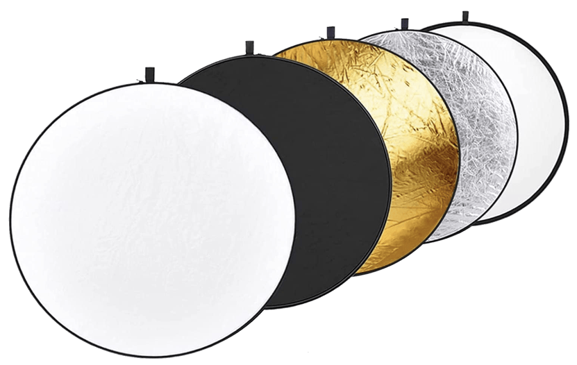

通常情况下，最常使用的是直径为80cm的五合一圆形反光板。这种反光板具有不同的反射面：

- 黑色面：吸收光线，通常用于拍摄花卉和小型产品，作为背景。
- 白色面：用于背景和轻微补光，提供柔和的光线，但补光强度较低。
- 银色面：反射光线强烈，适合用于远距离补光拍摄人物。
- 金色面：用于补光，并能够调节主体的色温。
- 此外，中间一层半透明的板可用于遮挡强烈的阳光，在拍摄产品时，结合夹子使用可柔化光线。

这些反射板提供了多种选项，适合不同的拍摄需求。

> 下面笔记来自：https://zhuanlan.zhihu.com/p/142933866
>
> ## 一、常用的反光板类型及选购
>
> 一般户外拍摄时，利用自然光（太阳）加上反光板，而室内或者棚拍时，利用人造光（例如灯光或棚室灯）加上反光板，来达到让平淡的画面有立体感、质感、细节清晰、阴影恰到好处的拍摄效果。
>
> ### 1.反光板的类型
>
> 反光板有硬反光板和软反光板两种。
>
> 硬反光板在室外使用效果非常好，它可以复制主要光源，通常用于反光板需与被摄主体保持较远距离或者因天气原因日光微弱等情况下。
>
> 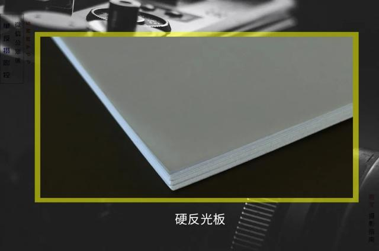
>
> 硬反光板价格比较贵，因此除专业摄影外，日常拍摄用的比较多的都是软反光板。光线在软反光板平面上产生漫反射，让光源被柔化并扩散到一个更大的区域，创造出跟扩散光源类似的效果，非常适合人像拍摄。
>
> ### 2.软反光板的选购
>
> 软反光板非常便宜，也就几十块钱，即可做主光又可做辅助光，功能多样，可以说是一款性价比非常高的附件了。它的形状主要有方形、圆形、椭圆形和三角形，但是反光板的不同形状并不影响补光效果。
>
> 软反光板的尺寸大小也有很多选择，小到30cm，大到180cm，综合反射效果、便携性和操作性等方面考虑，毒法师认为110cm左右的反光板最好。
>
> 根据反光板的支撑结构，可以分为扁钢条圈和硬性框架的软光板，前者可折叠方便携带，后者不可折叠可拆卸。根据反光面，市场上又分为双面反光板、五合一反光板、七合一反光板（多了蓝色和绿色）。
>
> 五合一反光板最实用，它是由一个柔光板和一个可变换的双面外套组成，包括银色反光板、金色反光板、白色反光板、黑色反光板和柔光板，接下来毒法师重点介绍下不同颜色反光板的特性和适用场景。
>
> ## 二、不同颜色反光板特性和适用场景
>
> 为了改变受光程度，实际拍摄中需要一个助手不断调整反光板与被摄主体的距离以及与光源的角度。没有助手的小伙伴默默举了爪，稳住，咱有办法解决。
>
> 没有助手的小伙伴可以购买一个可伸缩的反光板支架来固定反光板，这种支架上有一个万向转轮，可以360°旋转多方位补光，能调节反光板的高度和角度，非常实用，就是一个人来回调整会辛苦点。
>
> ### 1.银色反光板
>
> 银色反光板是常用的一种反光板，它具有最强的反射率，反射的光线非常明亮、强硬，属于冷色调。银色反光板可作为辅助光或者主光，作为主光时应该放远些或者将光线柔化，否则会引起过曝。
>
> 光线较弱的情况下，使用银色反光板可以获得明显的补光效果。在逆光拍摄时，利用银色反光板可避免阴阳脸，降低光比差，使面部曝光正常。同时银色反光板可以制造出好看的眼神光，传说的眼睛里有星星。
>
> 银面反光板光线很亮，但是它会有反射高光效应，即银色反光板会提高高光部分，产生更多反射高光，在人像拍摄中的体现就是被摄主体脸部的高光区域会比较多。
>
> ### 2.金色反光板
>
> 在日照条件下，金色反光板与银色反光板一样可以产生明亮的光，但是金色反光板产生的光线属于暖色调，常用作主光，可以模拟黄昏时的光线，且拍摄人像时会显得被摄主体皮肤红润。
>
> 各位小伙伴们都知道，日出和日落的光线最理想，使用金色反光板可延长该时段光线，前提是根据太阳的移动规律，去不断调节反光板与太阳的角度，以便得到理想光线。
>
> ### 3.白色反光板
>
> 白色反光板的反光性能比较弱，反射的光线比较柔和、自然、干净，所以白色反光板多用于辅助补光。拍摄时白色反光板离主体近些，用于拍摄半身或者特写照片。
>
> 白色反光板用于淡化阴影，补充阴影部分的细节。例如拍摄站在窗户前的被摄主体，主体一侧被窗户透进来的光照亮，另外一侧因光线不足产生很明显的阴影。这时就可以利用白色反光板增加一点点光，让阴影没那么重又不至于完全消除所有阴影。
>
> ### 4.黑色反光板
>
> 黑色反光板为减光板、吸光板，放在合适的位置能显著减少相应方向上的光线。适合拍摄静物，减少物体表面反光，例如拍摄金属饰品、珠宝、玻璃等场景时使用。
>
> 它能阻挡来自地面的反射，例如：让被摄主体站到漂亮的草地上或者红砖拍摄时，阳光会直射到地面，地面的颜色会反射到人们的脸上或者白色的礼服上。这时把黑色反光板放在地面，即可消除光反照到人脸上。
>
> 黑色反光板同时应用于指定位置创造个性化的阴影。或者作为黑色背景来拍摄人像，衬托被摄主体。
>
> ### 5.柔光板
>
> 柔光板不具备反射能力，无法补光。它的主要作用是有效柔化光线，在主光源和被摄主体间阻隔强光，在不改变拍摄距离和背景的情况下，减弱光线。
>
> 例如：正午顶光，在树影下拍摄，被摄主体脸上会留下阴影，这个时候就可以使用柔光板过滤光线、消除阴影，且柔光下被摄主体表情更自然，也不再担心强光刺眼。
>
> ## 三、反光板的打光小技巧
>
> 日光是不断移动的，使用反光板时需要根据太阳的移动不断对反光板的位置进行调节；补光讲究自然，光线要柔和不生硬。补光不一定要补全部，被摄主体与场景的光要有对比度才更能突出主体。
>
> 放反光板时，高光位会有比较重的阴影，显得脸瘦，低光位带来阴影不重，显得丰满。可以将反光板放在被摄主体正对面、平行或者更高位置，但是千万不要把反光板放在被摄主体下方，千万别从下往上打光，极有可能变成恐怖片现场，且被摄主体眼下黑圈圈会比较重。
>
> 反光板的摆放距离和角度需要根据打光的位置不断调整。反光板打光并不是一件简单的事，资深摄影玩家可以根据场景、焦距、pose、方位立即判断出，但是多数人不具备此能力，只能不断尝试锻炼。
>
> 利用反光板控制光比，练习观察人物在不同户外环境、不同时间段和不同天气情况的阳光底下照射的情况，然后选择不同性别、不同年龄段的人去做观察练习，熟能生巧，最终就知道如何摆放反光板了。
>
> 除了在摄影中的应用，反光板在拍电影和电视剧中也是不可或缺的。反光板的原理虽然简单，但是运用得当确是不 d宜，摄影是光影艺术，只有真正了解光，掌握光，才能向专业摄影世界更进一步。
>
> 

## 柔光伞和反光伞（Soft light umbrella and reflective umbrella）

柔光伞和反光伞通常有两种类型可选。

- 第一种是：纯白的柔光伞
- 第二种是：外黑内银（或外黑内白）的反光伞。

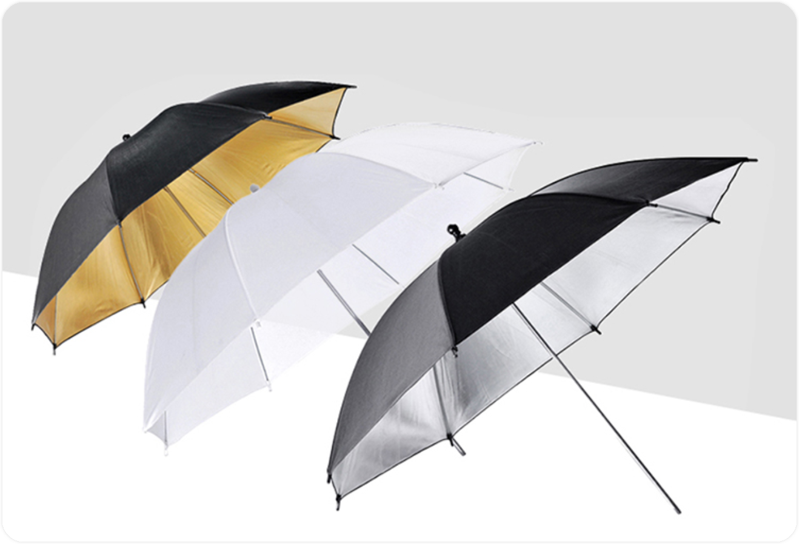

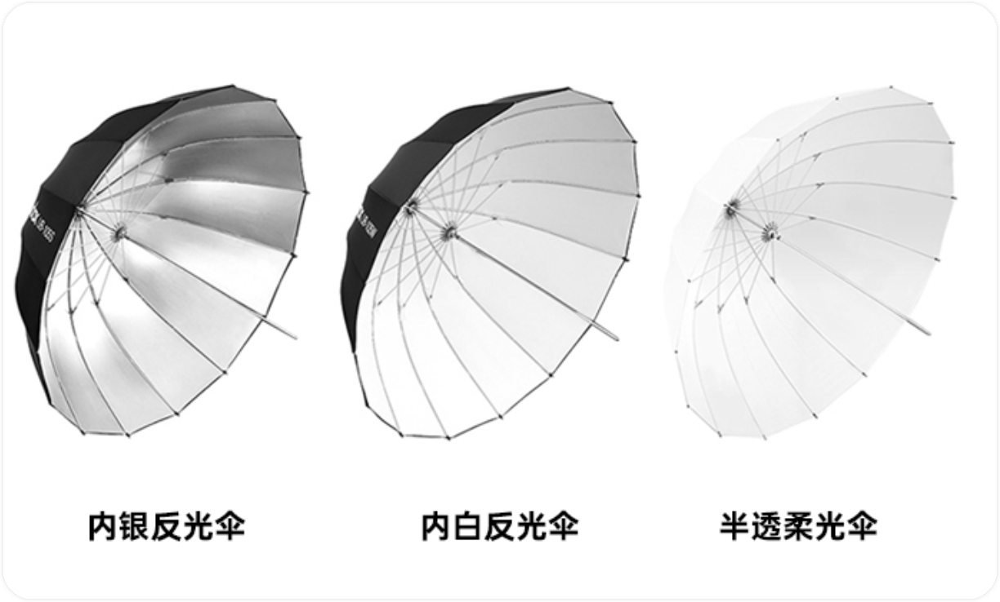

(上图)注：更深的形状能够更好地控制和精确地塑造光线与一般的反光伞相比，这款反光伞都拥有较深的抛物线形状。形状越深，您越能获得理想的光域控制能力。

- 经典黑银版：黑银版抛物线反光伞可集聚光效于物体细节，并产生自然的眼神光。既可以点亮被拍摄物体，也方便精确控制光效的对比度与饱和度，适用于打造清爽、前卫的造型。使用柔光罩，光效更柔和。
- 简介黑白版：黑白版抛物线反光伞依然能实现相对不错的控光，但光效比黑银版更柔和，且无需过多操作。安装柔光罩后，美丽的窗户光应运而生。
- 柔光透明版：透明版抛物线反光伞可用于扩大光源、柔和光效。经过透明衬布反射后的光线，比黑银版、黑白版更柔和，可以作为美妙的补充光。

黑银和黑白版前面可以加柔光罩，透明版前面可以添加反光罩。

*上面这几段文字来自神牛反光伞商品介绍：https://detail.tmall.com/item.htm?id=623589461522*

国内市场提供了成本较低且价格便宜的选项，但它们也容易受损。

纯白柔光伞的效果相对较差，可能会在太近的拍摄对象上产生伞骨阴影，因此一般来说，我不太推荐使用它。

外黑内银（内白）的反光伞提供了较好的反射效果，尽管略显硬一些，但效果还是令人满意的，因此我推荐使用它。

在室外拍摄时，这些伞不太适合使用，因为它们容易受到行人或风的干扰，可能被吹翻或损坏。幸运的是，它们的价格相对较低。

需要注意的是，这些附件在收纳时较长，对于携带来说有些不便。更好的柔光伞和反光伞通常是16骨的，因此具有更高的强度。对于便携性，美国Westcott公司提供了三折柔光伞反光伞，是一种不错的选择。

## 雷达罩/ 美人碟 Beautify dish

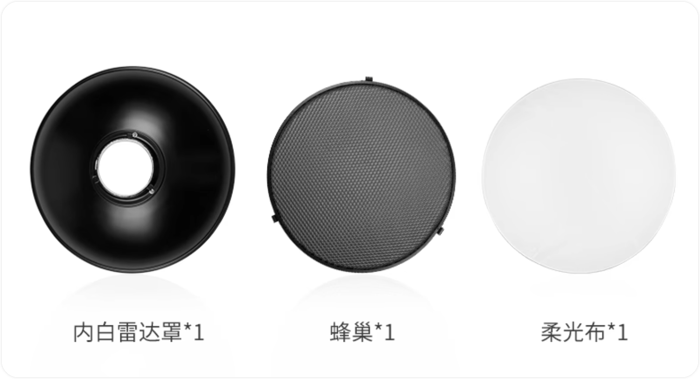

## 柔光箱

| 柔光箱类型               | 图示                                                         | 用途                                                         |
| ------------------------ | ------------------------------------------------------------ | ------------------------------------------------------------ |
| 方形柔光箱               | 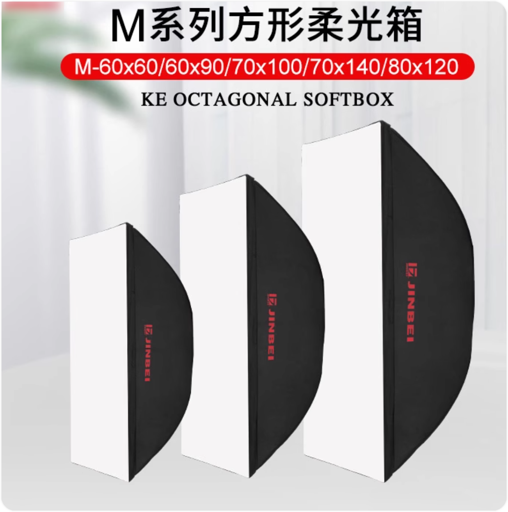 注：图示来自https://detail.tmall.com/item.htm?abbucket=12&id=680933169193&ns=1 | 一般方形柔光箱用于拍产品较多，但是又不绝对只用于拍产品，长方形柔光箱在影棚内也用于拍人像，八角和深口抛物线柔光箱（即：深抛柔光箱）、反射型伞式柔光箱一般用于拍摄人像较多，但同样也不绝对，拍产品也会用到八角柔光箱，球形柔光箱则一般用来直播或者录视频给人打主光。（来自：https://zhuanlan.zhihu.com/p/374394623） 常见的方形柔光箱有我们常说的“方箱”和“条柔”两种，每种都有很多不同的尺寸，黑色的箱体让光线在充分的漫反射后仍具有一定的指向性，白色的柔光布将光线进一步柔化，方形柔光箱是最常见、应用范围最广的种类。 |
| 长条柔光箱               | 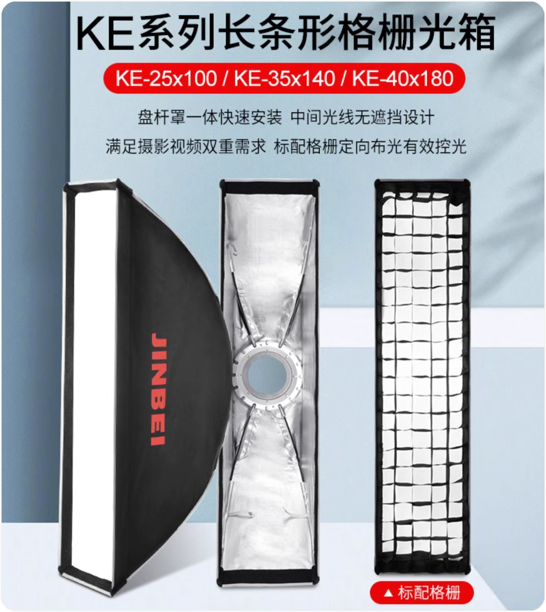 | 条柔多数用来拍产品，特别是长条形状的产品，例如红酒瓶、条状厨具家具、电器等等，它可以在柔光的同时收缩成一条细长的高光线，来为长条状的产品提供细窄的条状高光。也有一些人像摄影使用条型柔光箱从侧面给人物打光。 |
| 八角柔光箱               | 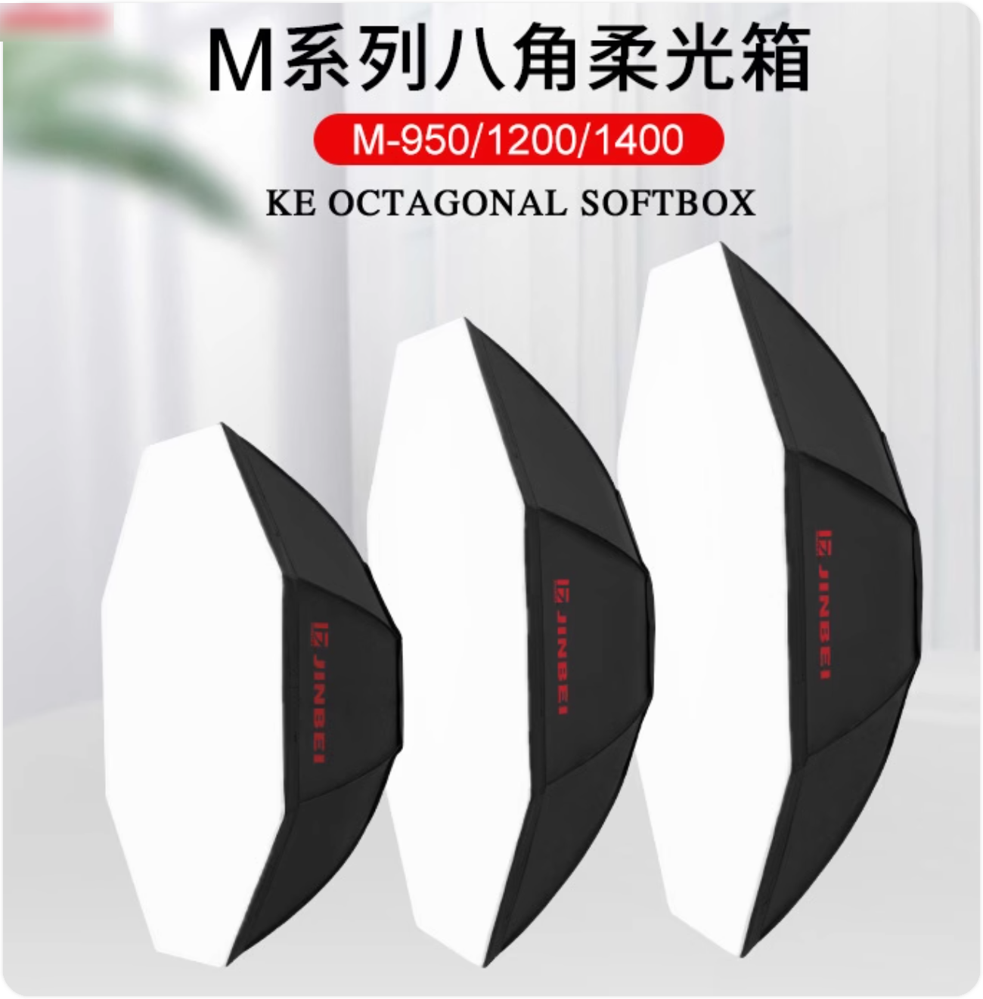 | 八角柔光箱设计的初衷就是为了实现圆形柔光箱的效果，相比方口，八角柔光箱能营造更大的光场，背景和主体的光效更为协调，背景的光也会均匀些，在使用中通常给人物打顶光，来模仿自然天光的效果。  非常适合人像摄影主光适用，八角形设计，使被拍摄人物眼中的光斑成圆形，而产生更漂亮的眼神光。 |
| 深口抛物线柔光箱         | 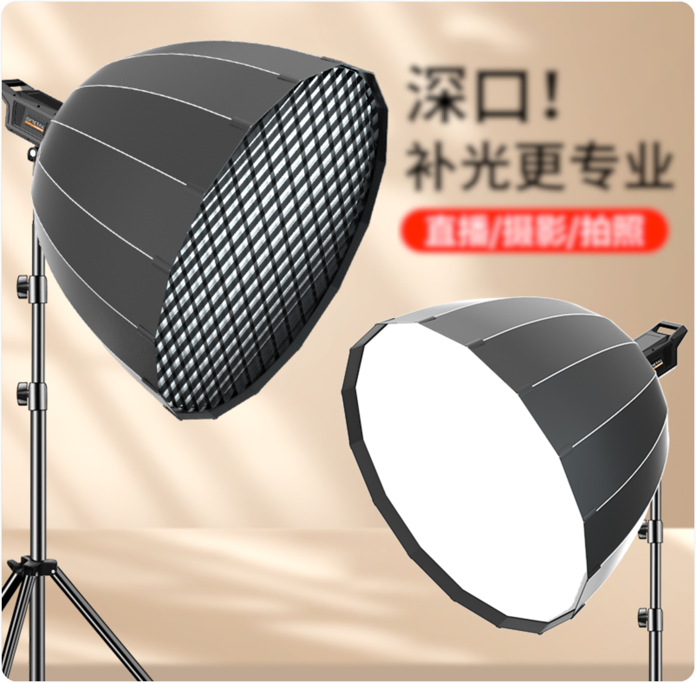 | 同样的便携性下（金属棒长度）下，越接近圆，发光面积越大，深口抛物线优越的纵深度和弧形箱壁，增加了光线在柔光箱内的交叉次数，柔光效果更卓越，给人物进行补光时光线质感更好，明亮柔和，明暗过渡更均匀，业内称之为“肖像之王”。 |
| 球形柔光箱（灯笼柔光箱） | 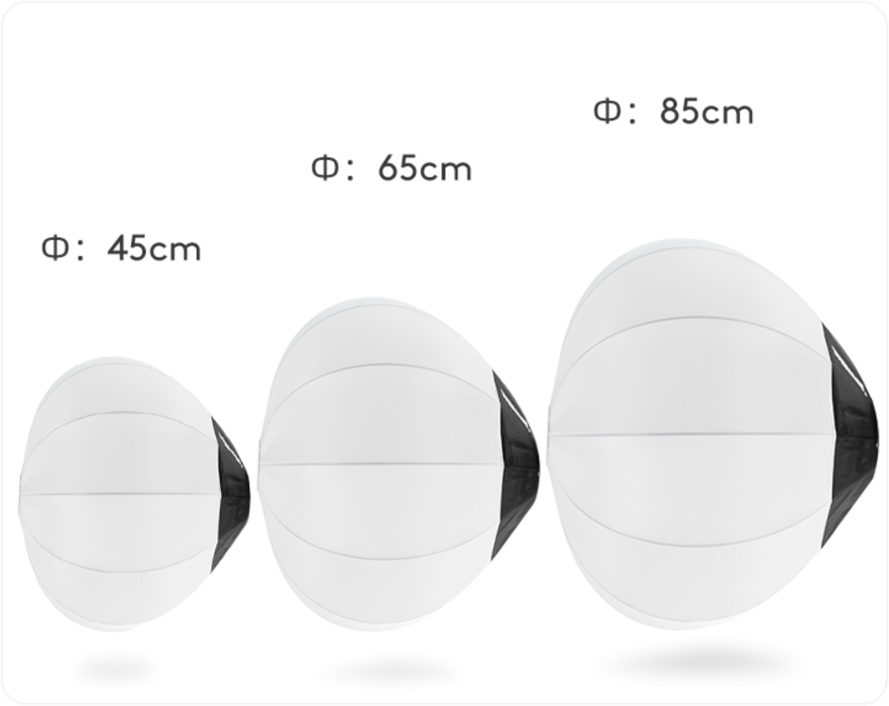 | 灯笼柔光箱也成为球形柔光箱，对光不施加方向性束缚，只做柔光，因此可以将光源柔化处理为360°柔和发散的球形光源，主要用来给空间内打造均匀通透的填充光的效果，在直播的短视频录制中使用较多，广告拍摄也用来搭配大功率灯光营造更大的均匀明亮场景。 |
|                          |                                                              |                                                              |

## 硫酸纸和旗板

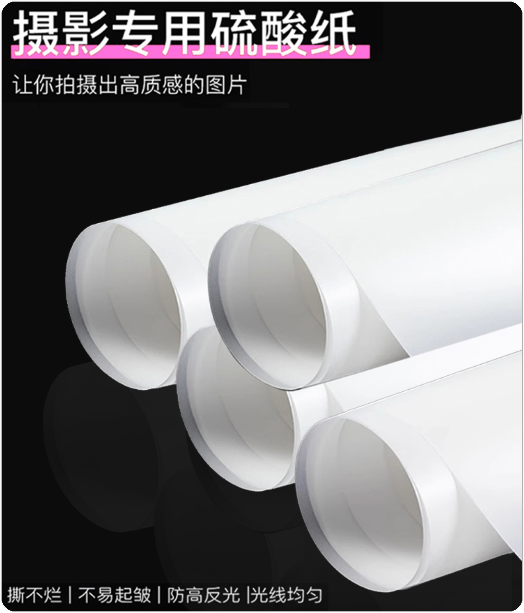

硫酸纸是拍物品最常用的东西，价格不贵，但容易弄坏，私人学习和玩可以多买几张，摄影工作室估计是成卷买的吧。旗 板的柔光效果比硫酸纸更好，如果不拍产品，只拍人像几乎是用不到的。

## 标准罩

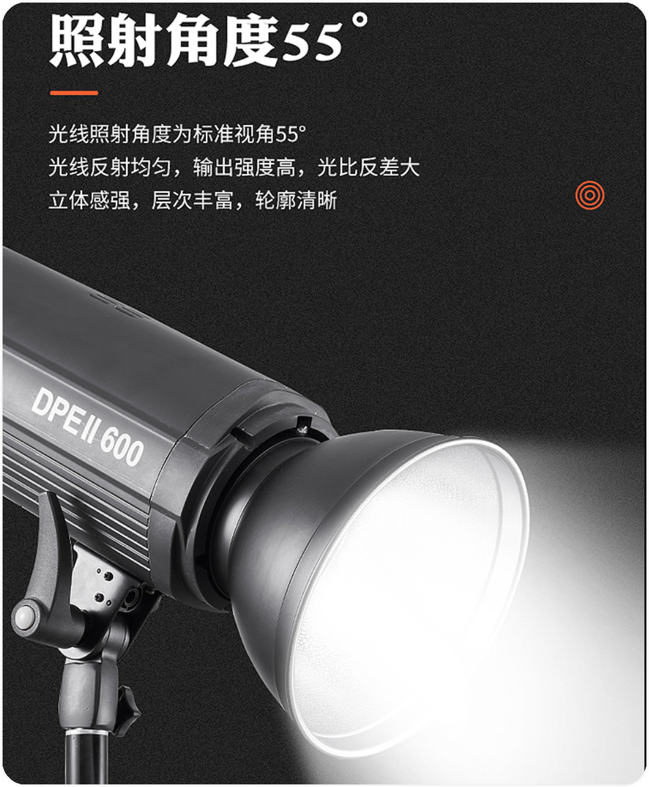

国外有布朗P70， 效果最好，价格2000以上，贵！国内有金贝M9，仿布朗P70，一套下来也要270左右，套装配的还是不实用的60度蜂巢，而不是实用的30度蜂巢，配齐30度和10度蜂巢接近500大洋，吐血！效果似乎还行。前面这两个都是70度的反光罩。要求不高还是标准55度标准罩，价格低廉厂家多。另外有一种叫美人碟，顾名思义，就是专门拍人像用的，还有一种叫MOLA的反光罩，没用过，这里不多讲了。

## 格珊（蜂巢）和猪嘴

上面三个都是一个作用，聚集光线，让打出来的光线具有方向性，不影响背景亮度，一般随厂家的柔光箱、反光罩配对购买，同型号不同厂家大小都有差异。格珊一般比较大，用在柔光箱上面，材质是软的，摸仿太阳光透过窗户一样的平行光。蜂巢一般用在反光罩和猪嘴上，有8 ~ 10度的；30度左右的，这个最常用。还有40 ~ 60度的，一般8 ~ 10度和40 ~ 60度都是辅助用的。猪嘴摸仿聚光灯一样的效果，也是用于定向打光的。这三种附件都是黑色的，吸收光线，因此会产生光损，损失的光量大约为1到2档。如果说没加格珊的柔光箱投出来的光在物体上产生的阴影柔和自然，那么加了格珊的光在物体上产生的阴影就柔中偏硬的过渡效果。而要的就是这种效果，使物体表面质感得以呈现。

## 灯架

不要买神牛的，做工质量真的很一般，第一次买灯架在神牛就买到个坏的；Selens和美铿这两个品牌的灯架做工和售后不错，质量过硬，买灯架最重要的是承重，如果你用重量2kg的灯，加上附件2kg，你要买能承重10kg的大灯架才稳；如果你就用到机顶闪光灯，加一个普通轻便的柔光箱重2Kg，你要买能承重5Kg的灯架才行。另外灯架最低都是1.8M的，还有就是2.4-2.8米高度的，一般买2.4到2.8米的比较通用，便携外拍就买可折叠灯架，一般1.8-2.2米的高度，够用了。灯架要么别用，拍人像一般两三个灯架就够了，一个主光，一个轮廓光，一个辅助补光。拍产品有时要五六个甚至更多灯架，主光一个灯架，有时要用两到三张硫酸纸，一张硫酸纸就要一个灯架，背景光一个或两个灯架，顶光一个灯架、定向轮廓光要一个灯架，所以要用的灯架多。

## 转接支架

这个没有太多好选择的，神牛S2支架，标准保荣卡口，可以接圆灯头，做工扎实可靠，我就买了两个。其余的也没什么好的，反而有些LED灯送的转接头很好用，例如iwata GP-01送的热靴云台等；

## 无效的灯光附件

1、机顶柔光箱、面积太小，没什么效果，跟直打没什么区别，还妨碍跳闪；

2、柔光罩、根机顶柔光箱一样，没卵用；

3、柔光伞~~~可能有的人觉得实用，本人意见是不实用；

4、各种专用灯卡口的灯光附件，例如神牛的J灯头标准罩、神牛卡口柔光箱等，买了用上一次新鲜劲一过只有出了；

5、劣质灯架和转接头等；

 

# ★ 造型灯

Notice: 还不知道下面这段对不对

>  笔记来源：https://expertphotography.com/studio-lighting/
0
## Modifiers for Studio Lighting 工作室灯光调节器

A modifier is a type of lighting accessory that is fastened to your studio light source. It helps you control and shape your light. Unless you want to use hard, direct lighting, you need a modifier to use with your light source.
调节器是一种固定在工作室光源上的照明配件。它可以帮助您控制和塑造光线。除非您想使用强直的直接照明，否则您需要一个修饰器来与光源一起使用。

And the modifier you choose will depend on your goal for the image. For example, if you shoot food photography, 99% of the time, you want soft, diffused light.
您选择的修饰符将取决于您的图像目标。例如，如果您拍摄食物摄影，99% 的时间您都需要柔和的漫射光。

Like in the beverage image below, hard and direct light has its moments. But it can make food look cold, distant, greasy, and unappetizing. A soft light will give you soft shadows and bring out the best qualities in your subject.
就像下面的饮料图片一样，强光和直射光有它的时刻。但它会让食物看起来冷淡、遥远、油腻、令人倒胃口。柔和的光线会给你带来柔和的阴影，并展现出拍摄对象的最佳品质。

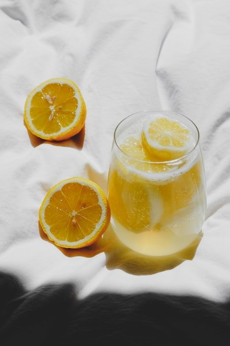

Direct, harsh sunlight. © Laura Chouette (Unsplash.com)
直射、刺眼的阳光。 © 劳拉·乔伊特 (Unsplash.com)

# ★ 常亮灯

