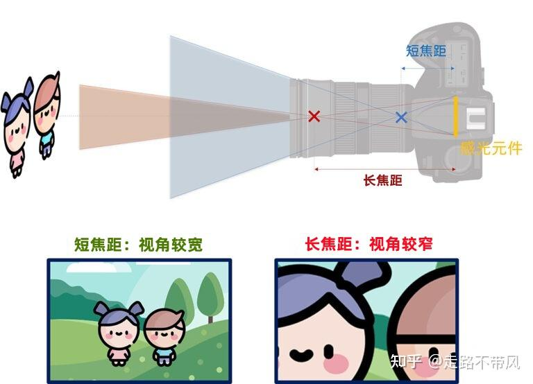
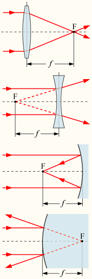

# 相机 Camera

## 什么是焦距？

> 下面笔记来源：[【相机标定】相机标定原理](http://shichaoxin.com/2022/12/07/%E7%9B%B8%E6%9C%BA%E6%A0%87%E5%AE%9A-%E7%9B%B8%E6%9C%BA%E6%A0%87%E5%AE%9A%E5%8E%9F%E7%90%86/)
>
> **焦点**：在几何光学中有时也称为**像点**，是源头的光线经过物镜后汇聚的点。

> 下面笔记来源：[Wikipedia - 焦距](https://zh.wikipedia.org/zh-tw/%E7%84%A6%E8%B7%9D)
>
> **焦距**：也称为焦长，是光学系统中衡量光的聚集或发散的度量方式，指从透镜中心到光聚集之焦点的距离。亦是照相机中，从镜片光学中心到 底片、 CCD 或 CMOS 等成像平面的距离。具有短焦距的光学系统比长焦距的光学系统有更佳聚集光的能力。 
>
> 当将摄影镜头调整到无限远时，其实是一个有名无实的焦距。在设计上，是将透镜的主平面与底片或成像检测器的距离调整为焦距的长度，然后，远距离的物体就能在底片或 CMOS 上形成清晰的影像。当镜头要拍摄比较接近的物体时，是镜头的主平面与成像检测器或胶片的距离发生变化，使得有限距离的物体得以清晰成像。（注：可以参考下图）
>

>
> 下面的笔记来源知乎：[摄影新手入门：1 分钟搞懂焦距是什么？焦距与视角的关系！](https://zhuanlan.zhihu.com/p/619352287)
>
> - 焦距的定义是：镜头的**光学中心**到**感光元件**之间的距离。（下图 X 到感光元件的距离）
> - 一般来说：焦距越**小**，视角就会越**广**；焦距越**大**，视角就会越**窄**。（下图蓝 / 红色分别代表小焦距 / 大焦距）
>
> 

## ▲ 什么是镜头的光学中心？

> 下面文字来源：

光学中心指镜片前表面与光轴的交点（光线由此透过时，不产生偏折）。

一切方向的光线通过透镜时，都会产生偏折，使光线传播方向发生变化；但透镜上有一点，任意方向的光线通过该点时，光线的传播方向不变，即出射方向和入射方向相互平行，这一点叫透镜的光学中心 。 在配镜中。将光轴与镜片前面的交点定义为光学中心

基本概念：

- 光学中心即光心：凸透镜的中心 O 点是透镜的光心。

另外的几个概念：
- 主轴：通过凸透镜两个球面球心 C1、C2 的直线叫凸透镜的主轴。
- 焦点：平行于主轴的光线经过凸透镜后会聚于主光轴上一点 F，这一点是凸透镜的焦点。
- 焦距：焦点 F 到凸透镜光心 O 的距离叫焦距，用 f 表示。
- 物距：物体到凸透镜光心的距离称物距，用 u 表示。
- 像距：物体经凸透镜所成的像到凸透镜光心的距离称像距，用 v 表示。

> 下图来源：[Wikipedia - 焦距](https://zh.wikipedia.org/zh-tw/%E7%84%A6%E8%B7%9D)
>
> 正透镜、负透镜、凹面镜和凸面镜的焦点 F 和焦距 f ：
>
> 

