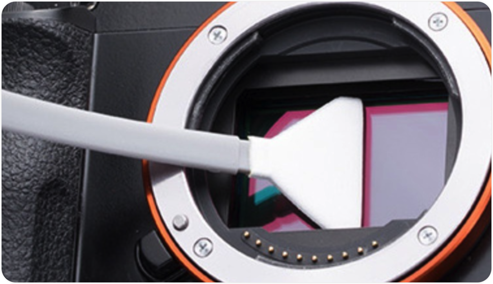
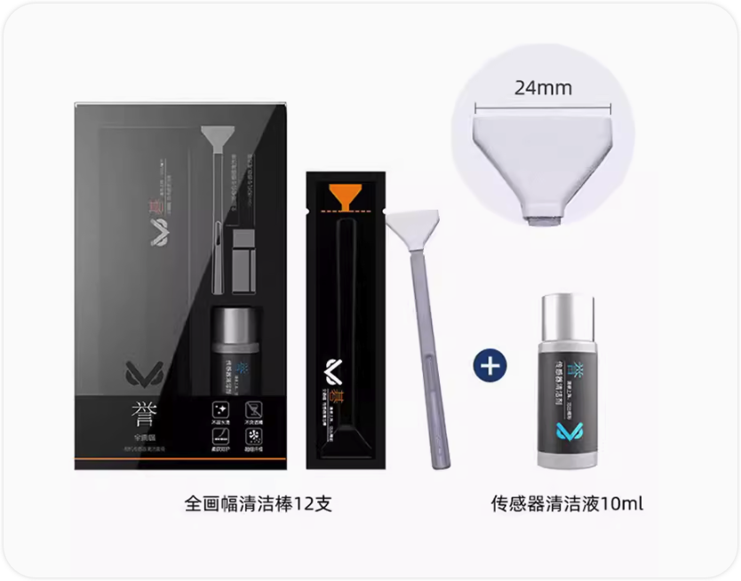
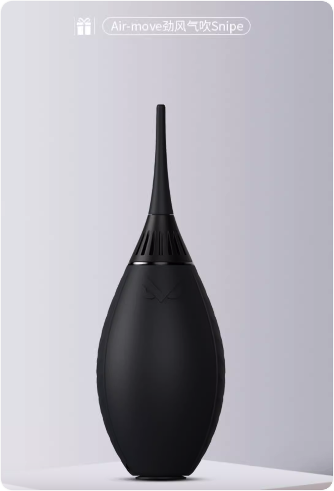
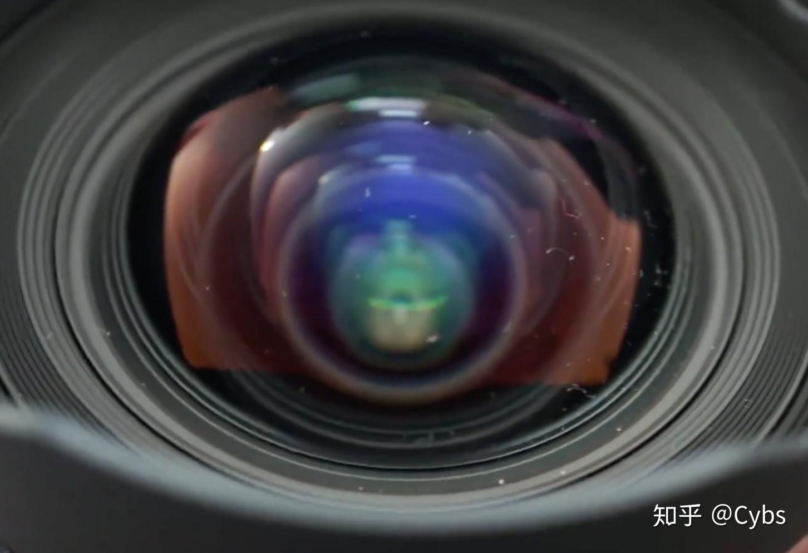
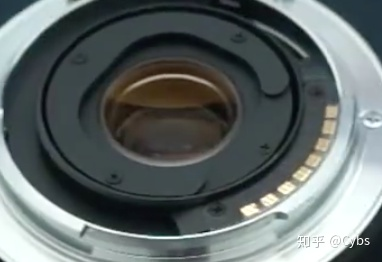
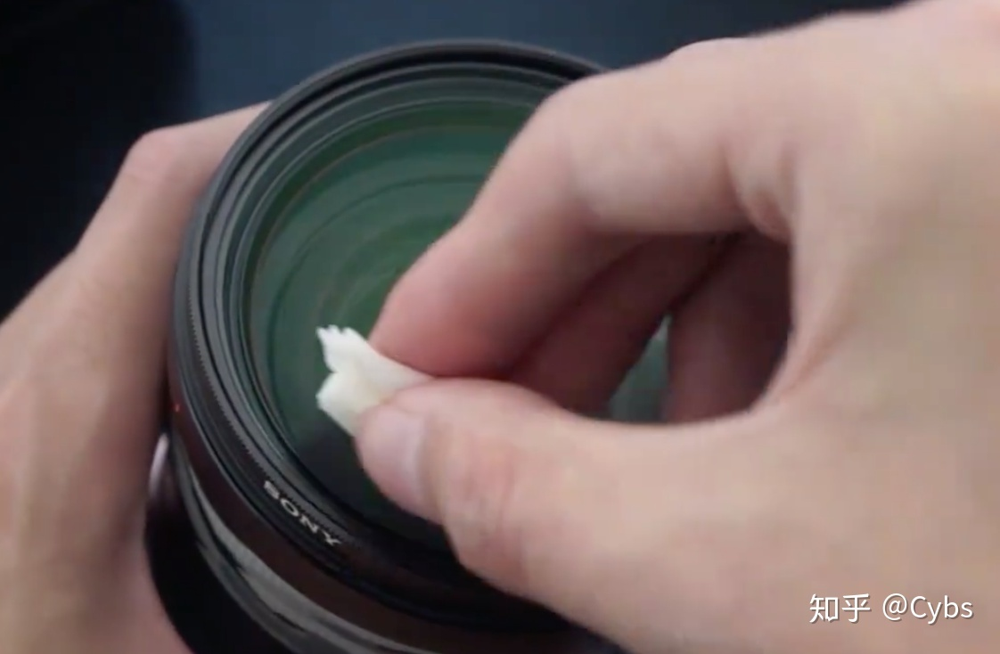

# 相机和镜头

| 单词  | 美式发音 | 词类 + 汉语释义 |
| ----- | -------- | --------------- |
| anti  |          |                 |
| shake |          |                 |
|       |          |                 |

## ▲ 相机清洁
> 笔记参考：
>
> - https://www.bilibili.com/video/BV1gM411e7ML/?spm_id_from=333.880.my_history.page.click&vd_source=e92153ec1930505e455be52646a78b7c
> - https://www.zhihu.com/tardis/zm/art/202746188?source_id=1003

### 1. 清洁工具

#### (1) ~~清洁布~~

#### (2) 镜头布配合镜头清洁液 或 镜头湿纸巾

更建议直接使用镜头湿纸巾：擦拭技巧见下面的 "镜头清洁" 说明

#### (3) 传感器清洁液 + 清洁棒

> 上图来自淘宝商品：VSGO微高专业单反相机镜头清洁套装清洁液传感器cmos清洁棒

#### (4) 气吹

当清洁设备（机身、镜头）表面时，气吹极为有用。在进行擦拭之前，通常会首先使用气吹，以去除表面的杂质和颗粒，以免在擦拭过程中损伤表面。使用气吹时，应特别注意从下往上吹（注：我个人认为大致的意思就是镜头或机器要清洁的面朝下，气吹从下往上吹），以防止空气中的灰尘再次降落到设备上。

高级气吹具备自带空气过滤功能，这意味着它们可以过滤掉空气中的灰尘和杂质，从而产生更为洁净的气流。此外，高级气吹通常具有更强的气流量和压力，并可更换不同长度的喷嘴，以适应不同的工作场景。个人建议考虑选择 VSGO 威高品牌的清洁设备，因为它们在市场上备受摄影师和爱好者的青睐。至于选择高级还是普通型号的气吹，可以根据您的预算和具体需求来决定。

对于不具备过滤功能的气吹，有一个使用技巧：在实际使用前，建议进行几次空吹，以排除内部的灰尘。这将确保吹出的气流更为清洁有效。

> 个人经验: 
>
> - CMOS 一点灰的话用 "一体气吹"。实在吹不掉用 cmos 清洁棒。
>
> - 镜头用 "医用脱脂棉"，便宜量大。
>
> 千万不要用镜头笔什么的，这玩意实在不行。

> 后镜最好不要用气吹，有些吹完会进灰.

#### (5) 清洁刷
作用跟气吹类似，也是扫走表面的灰尘，一般用在机身等表面去除明显的灰尘颗粒，这个可有可无，有时比擦拭和吹要方便，可以买一把傍身。

### 2. 传感器清洁
D810 的相机拆掉镜头第一眼看到的是反光板，反光板即时有灰尘也不用清洁，因为拍照的时候反光板会弹起(应该哈)

- 注：不过反光板应该可以使用全画幅 CMOS 清洁棒(即前面平的那个) + 传感器清洁剂来清洁去除灰尘，虽然这就是清洁 CMOS 的方法。

D810 的说明书 P453 中不建议自己清理 CMOS，如果相机的自清洁功能不能清理 CMOS 上明显的灰尘或颗粒，那就去找专业的尼康授权的服务人员进行清洁。

### 3. 镜头清洁

镜头是日常最容易脏的部件，新买来的镜头建议装上一块UV镜，不为别的，就是为了防护。一块普通的UV镜几十上百（也有很贵的，目的不一样）能买到，平时能起到防撞、防尘、防水（部分）的作用，损坏了再换一个也成本很低，挺划算的。可能有人会说装了UV会影响画质什么的，如果你的作品能去到这种高度，那恭喜你。

清洁镜头前，注意先清洁镜头盖，否则花了那么多功夫清洁完了，又被镜头盖污染了，就做了无用功。镜头盖主要用气吹、毛刷和湿巾就可以清理。

镜头需要注意清洁的主要是前镜片和后镜片。

镜片旁边的触点和圈用气吹吹走或清洁刷刷走灰尘，然后用湿巾（触点尽量避开水分以免短路）擦拭即可。

对于镜片，我们先用气吹从下往上大力吹走灰尘颗粒，如果依然有脏物贴在镜片上，我们就需要使用镜头纸。镜头纸的使用方法是，先折叠成几层厚的，从镜头中间开始打圈从内到外轻轻擦拭。有些镜头纸包含酒精，挥发得比较快，有些相对慢些，这时我们可以用镜头纸较干的部分再轻拭。

有些用得时间久了没有注意防潮的镜头，会长霉斑，如果不影响画质的话，不建议动手清理。

### 4. 机身清洁

使用清洁刷来刷更快。

## ▲ 相机

## ▲ 镜头

### 紫边
镜头紫边往往出现在大光比或者大反差的场景里，会在照片上亮部与暗部交界处出现的色散。紫边是最容易影响到画质的一种不良现象，紫边的出现与镜头的光学结构有关。

### 眩光
*《美国纽约摄影学院-摄影教材》 上有解释，记的做笔记*

### 畸变
畸变其实就是镜头失真，当拍摄一些线条物体时最为明显，如果变形大的镜头会把直线拍的变形。畸变分为桶形和枕形两种，作为长焦来说，畸变的几率非常轻微。

==Q: 镜头的畸变有几种？==

#### 透视畸变

#### 线性畸变

#### 反向畸变

#### 枕形畸变

> 截图来自：https://www.bilibili.com/video/BV1Lo4y1f7Pf/?spm_id_from=333.337.search-card.all.click&vd_source=e92153ec1930505e455be52646a78b7c

### 暗角
暗角其实称之为失光，就是由于光线入射问题造成的光线损失，基本上出现在画面的四个角上，如果使用大光圈的话很容易出现。一般来说厂家会通过镜片的设计和镜头口径来增加光线的射入量。

## ▲ 2.13 什么是微距镜头 (P69)

微距镜头是一种可以非常接近彼摄体进行聚焦的镜头。微距镜头在成像平面上所形成的影像大小与被摄体自身的真实尺大大致相等。

成像平面上的影像大小与真实被摄体大小的关系叫做复制比率。

- 1:1 的比率意味着成像平面上的影像跟实物大小一样，
- 1:2 的比率意味着成像平面上的影像是实物大小的一半，
- 1:3 的比率意味着影像是实物的 1/3，等等。

不同的生产厂商使用不同的标准对他们的微距镜头进行命名，造成了某些混乱。一般来说，我们认为下面的术语比较恰当。

微距镜头(macro lens)是指复制比率大约为 1:1 的镜头。

微聚焦镜头(macro-focusing lens)是指复制比率在 1:1.2 ~ 1:2 之间的镜头。

近聚焦镜头(close-focusing lens)是指复制比率在 1:2 ~ 1:4 之间的镜头。

尽管微距镜头通常都是中等焦距的镜头，但实际上它可以是任何焦距的镜头，既有 50mm 的微距镜头，也有100mm 的微距镜头或 70 ~ 180mm 的微距变焦镜头，给镜头冠以微距的名称，只不过是说明这种镜头除了具有确定焦距的普通镜头的功能外，跟一般镜头相比还可以聚焦更近的被摄体，在成像平面上形成实物般大小的影像。

微距镜头对于拍摄小物体颇具价值，比如昆虫、花卉、邮票等等。

使用标准镜头拍摄的野外的蒲公英花籽看上去就像图2.47的照片，而使用了微距镜头拍摄，花籽看上去就像奇妙的抽象图案（图2.48）。

**拍摄微距照片，诀窍就是聚焦要精确**，因为微距照片的景深范围很小，只有 1 英寸的很少一部分。例如，拍摄花朵上蜜蜂的微距影像，必须确保对蜜蜂精确聚焦，假设从镜头到蜜蜂的距离变化了哪怕不到 1/4 英寸，都会失去清晰焦点。因此，在拍摄奇妙的微距照片过程中，聚焦是极折磨人的。下一课中，我们会详细地为你介绍如何聚焦的内容。

