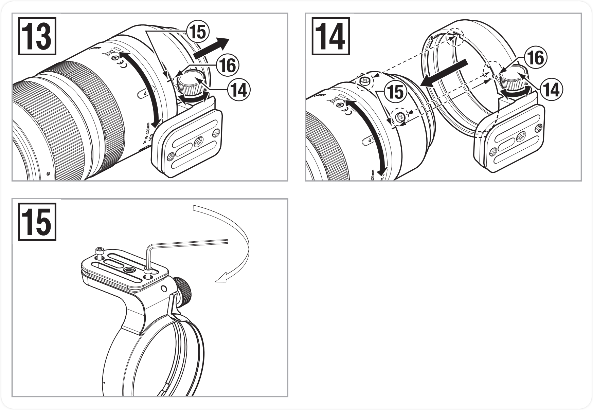

# 腾龙 SP 70-200mm F/2.8 Di VC USD G2

## New Words

| 单词         | 美式发音           | 词类 + 汉语释义 |
| ------------ | ------------------ | --------------- |
| vibration    | `/vaɪˈbreɪʃən/`    | n. 振动；震动   |
| compensation | `/ˌkɑmpənˈseɪʃən/` | n. 补偿；赔偿   |

| (1) 遮光罩                      | (2) 遮光罩安装定位标记            |
| ------------------------------- | --------------------------------- |
| (3) 遮光罩锁定标记              | (4) 滤镜环                        |
| (5) 遮光罩释放标记              | (6) 变焦环                        |
| (7) 焦距刻度                    | (8) 焦距标记                      |
| (9) 对焦环                      | (10) 摄影（照相）距离刻度         |
| (11) 摄影（照相）距离标记       | (12) 三脚架座                     |
| (13) 三脚架座标记               | (14) 三脚架座锁定螺丝             |
| (15) 三脚架座释放标记（镜头侧） | (16) 三脚架座释放标记（三脚架侧） |
| (17) 镜头安装标记               | (18) VC（防抖补偿）开关           |
| (19) AF/MF 开关                 | (20) 聚焦限制器                   |
| (21) VC 模式开关                | (22) 镜头／相机界面接口           |
| (23) 安全锁定螺丝的螺丝孔       | (24) 安全锁定螺丝（x2）           |
| (25) 六角扳手                   |                                   |

## ▲ 镜头说明

### 五级 VC 防抖系统

### VC 功能（参见图 [1]、[5]、[6]）

VC（防抖补偿）功能可减少手持拍摄时因抖动而造成的影像模糊。

#### 如何使用 VC
使用 VC 时，将 VC 开关 ⑱ 拨至 ON 位置。

半按快门并在拍摄相片前确认取景器影像稳定。

#### 切换 VC 模式
可使用 VC 模式开关 ㉑ 切换 VC 模式。

- MODE 1 在取景器影像稳定性与补偿效果之间取得平衡的基本模式
- MODE 2 追随模式
- MODE 3 仅在快门松开瞬间进行补偿而注重补偿效果的模式。

\* MODE 1 和 MODE 3 不支持追拍。

\* 要通过实时取景进行拍摄，可使用 MODE 1。

\* MODE 1 只能使用实用工具（TAP-in Utility）进行设置。

#### VC 在下列情况下有效
- 灯光昏暗的场所
- 禁止用闪光灯进行拍摄的场所
- 立足点不稳的地方

#### 在下列情况，VC 可能无法充分发挥作用。
- 当从剧烈摇晃的乘坐物上进行拍摄时
- 在相机过度移动时拍摄
- 在使用三角架进行拍摄时
- 通过 B 门拍摄（长时间曝光）时，请将 VC 开关拨到 OFF 位置。否则，VC 可能造成误动。

#### 注意
1. 半按快门刚开始时，取景器影像可能变得模糊。这是由于 VC 的原理造成的而非故障。
1. 将 VC 开关拨至 ON 时，由于会消耗相机电源，因此相机电源可供拍摄的影像张数会减少。
1. 当相机由其他物品（如三脚架）而非用手固定的情况下进行拍摄时，请将 VC 开关拨至 OFF。

#### 说明
1. 请勿在 VC 打开时从相机上取下镜头。如果在 VC 打开时取下镜头，则可能在镜头晃动时听到“咔嗒咔嗒 ”的声音。这并非是故障。如果镜头安装在相机上，且相机的电源打开，则声音会停止。
1. 在 MODE 2 和 MODE 3 中，VC 在取景器上的效果可能会降低，但这并非故障。
1. 对于配备内置闪光灯的尼康相机，内置闪光灯在充电时将关闭 VC。

### 聚焦限制器使用方法（参见图 [1]、[7]、 [8]）
当设置了自动对焦时，切换聚焦限制器开关 (20) 可以加速对焦过程。

#### 将自动对焦范围限制在远距（无限远至 3m）拍摄物（参见图 [7]） 将聚焦限制器开关拨至 “∞ - 3m”。

#### 不使用聚焦限制器时（参见图 [8]）
将聚焦限制器开关拨至 “FULL”。