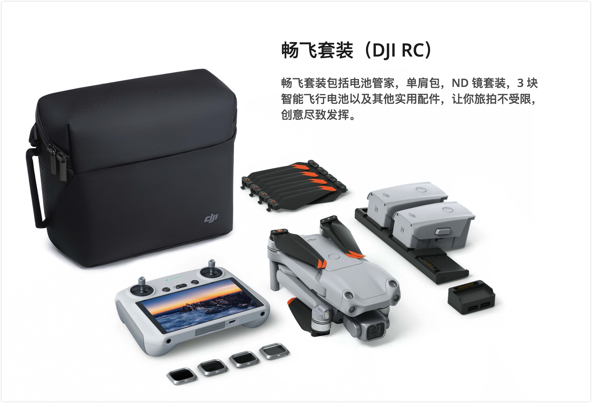

# 大疆 DJI Air 2S

## ▲ DJI Air 2S - 首次使用指引

> 笔记来源视频：[大疆DJI Air 2S - 首次使用指引](https://www.bilibili.com/video/BV1to4y1f7ia/?spm_id_from=333.337.search-card.all.click&vd_source=033cc0cb90262a8954da54444ec97bda)

> #### 使用讯飞视频转文字未校验原稿
>
> 说话人1 00:00
>  欢迎。
>
> 说话人2 00:03
>  收看DJ二to s教学视频，我们将以套装版本向您介绍DJ r9s的首次飞行使用，打开DJ r9s外箱，以康普为例，依次取出产品及配件。
>
> 说话人1 00:20
>  注意。
>
> 说话人2 00:22
>  配件分别放置于两个配件盒内，遥控器内置一条转接线，您可以扫描DG官网，DJ iFly下载页面的二维码，下载安装DCF flap，取下云台保护罩，依次展开飞行器击毙。多旋翼飞行器有ab电机和ab桨叶之分。A电机讲座外圈有橙色圆弧标志，对应安装中心有橙色圆圈标志的a桨叶b电机讲座外圈没有橙色圆弧标志，对应安装中心没有橙色源泉标志的必桨叶，请确保在飞行前正确安装桨叶，保障飞行安全，从遥控器下方取出并安装好遥感，拉伸移动设备支架，遥控器转接线收纳于支架凹槽内，右端带有遥控器标志的接口，用于连接遥控器端，左端的接口用于连接移动设备端，遥控器默认出厂装载莱特尼转接线，宁可在配件盒中更换其他转接线，从左端取出转接线接头绕至右端，并将转接线放置于防滑脚架后方，将移动设备放置在防滑脚架上，并让移动设备的接口朝向右，方向上推拉支架，固定好移动设备后即可连上转接线，首次使用电池时，请将电池接入直冲充电器充电，约一分钟即可成功激活电池，将电池放入电池舱，听到大声后，请确认电池是否安装牢固。
>
> 
>  短按一次，在长按约两秒飞行器和遥控器的电源开关，即可分别开启飞行器和遥控器。当您需要关闭飞行器和遥控器时，同样短按一次，再长按约两秒电源开关即可关闭电源。当飞行器与遥控器需要对屏时，您可以通过DJ来APP完成对屏。
>
>
>  首先开启飞行器，将移动设备与遥控器连接，在DJ来APP内点击右下角的连接飞机，随后点击右上角的飞行界面，打开设置，在操控页面底部点击配对飞机，当遥控器发出滴滴滴的提示音时，且遥控器电量指示灯呈现跑动状态，即可开始对屏长按飞行器电池开关约4秒，听到指示音嘟嘟嘟后松开，电源指示灯进入跑动状态，飞行器开始对屏，当遥控器提示音停止，遥控器电量指示灯停止跑动，恢复至电量显示状态，飞行器电源指示灯停止跑动，恢复至电量显示状态时，APP显示图传画面则对屏成功，您还可以使用遥控器组合按键，实现对屏功能，同时按住遥控器左上方的自定义按键，右上方的拍照录像切换按键以及遥控器顶部的拍摄按键，约两秒后遥控器发出滴滴滴的提示音，且遥控器电量指示灯呈现跑动状态，即可开始对屏长按飞行器电池开关约4秒，听到指示音嘟嘟嘟后松开，电源指示灯进入跑动状态，飞行器开始对屏，当遥控器提示音停止，遥控器电量指示灯停止跑动，恢复至电量显示状态，飞行器电源指示灯停止跑动，恢复至电量显示状态时，APP显示图传画面则对屏成功，打开DJ的APP，跟随APP页面指示进行飞行器的激活操作，当屏幕左上角出现新部件的升级提示时，点击升级提示，进入升级页面，点击开始升级，在升级过程中请勿断电或退出APP。
>
> 
>  注意在升级过程中，遥控器中间两颗LED灯会快速交替闪烁，遥控器与飞行器自动重启均属于正常现象。升级完成后，飞行器和遥控器将保持开机状态，折叠飞行器脚架安装云台保护罩，将飞行器装入飞行单肩包内，飞行准备拆除云台保护罩，展开击毙，并正确安装桨叶后，将飞行器放置在水平地面上，注意将机尾朝向自己运行DJ fly，在主界面选择DJ二to s对屏完成后点击开始飞行，仅在安全设置中将返航高度调整为高于周围最高建筑或物体的高度基础飞行操作。
>
> 
>  起飞前请选择无障碍无遮挡的开阔环境，先检查智能飞行电池电量，将飞行器放置在水平地面上，注意将机尾朝向自己，开机检查遥控器电量。
>
> 说话人1 05:37
>  开机。
>
> 说话人2 05:39
>  并将遥控器飞行档位切换至n档，检查APP飞行界面确认无异常提示，且GPS信号良好。
>
> 
>  点击APP左侧起飞按钮，长按弹窗飞行器将实现自动起飞，起飞后APP左侧按钮变为降落图标，点击左侧降落按钮，长按弹窗，飞行器将实现自动降落，如需手动起飞，以美国手为例，仅将两个摇杆同时下拉到底部再向内掰动，桨叶转动后，左手向上轻推油门杆可实现手动起飞。遥控器左边的遥感用于控制飞行高度与机头朝向，右边的遥感用于控制飞行器前进后退以及左右飞行。
>
> 
>  当您掰杆启动电机后，若飞行器未起飞，下拉左边摇杆，飞行器的电机将会关闭。若飞行器已经起飞，下拉左边摇杆，飞行器将会降落，短按遥控器上的急停按键，飞行器将会紧急刹车并悬停。在APP界面左下方，您能看到当前飞行距离和速度等信息，飞行过程中且始终保持遥控器天线，对准飞行器方向，以获得更好的通讯质量。
>
> 
>  在GPS信号差或指南针受到干扰时，若环境光线不满足视觉定位模式时，飞行器将进入姿态模式，此时飞行器无法定点悬停及自主刹车，为避免发生意外，需要尽快将飞行器降落到安全位置拍照与录像，点击右侧拍照模式按钮，可以选择拍照录像、一键短片等模式。右下角的相机参数菜单用于调节相机参数，遥控器左端的波轮可以调节云台俯仰角度，前端的切换按键可实现拍照录像功能的自由切换，搭配遥控器右端的拍摄按键，可实现快速拍照和录像功能。在录像模式下，您可通过以下操作实现数字变焦功能，上下拖动DCF飞行页面的变焦按钮，或点击变焦倍数，或双指在屏幕上做放大缩小动作，或按住遥控器fn键后调节云台波轮实现变。
>
> 
>  焦点击右下角的相册按钮，可以查看和下载已拍摄的素材，智能返航，点击APP左侧图标长按返航按钮或长按遥控器的返航键，飞行器将会执行智能返航，安全注意事项。
>
>
>  起飞前请注意飞行环境是否符合要求，并设置好安全返航的高度。别忘了检查桨叶是否安装正确，电池是否安装牢固，云台保护罩是否拆卸。感谢观看DJ l 2s首次使用教学视频，尽情享受您的飞行时刻。

### 1. 开箱

### 2. APP 下载

### 3. 遥控器介绍

### 4. 对频

### 5. 激活升级

### 6. 基础飞行操作

### 7. 拍照与录像

### 8. 返航

## ▲ 智能跟随 2.0

## ▲  10-bit Dlog-M 是什么？

## ▲  12.6 档动态范围的 RAW 格式是什么意思？

## ▲ 延时摄影 和 全景拍摄

## ▲ 大师镜头如何使用？

## ▲ ND 滤镜使用说明

提供 ND4/8/16/32 及 ND64/128/256/512 两种 ND 滤镜组合[4]，为你的作品增加格调。

- ND 滤镜截图来自：https://www.dji.com/cn/air-2s?site=brandsite&from=nav

### (1) 不同的 ND 镜在什么场景下使用？

#### 什么是大师镜头？

大师镜头是全新的自动飞行拍摄及后期剪辑功能。

无人机将根据拍摄目标类型和距离等信息，智能匹配人像、近景或远景三种飞行轨迹，自动拍摄多种经典航拍运镜。拍摄完成后将自动剪辑成片。有多种风格模板可选，新手也能一键出大片。

#### 对比OcuSync 2.0图传，DJI Air 2S的03图传有哪些方面的提升？

03 图传使用全新的图传方案，天线从双天线升级为4天线，不仅带来远达12公里1080p图传（无遮挡无干扰，FCC标准），更增强了图传系统的抗干扰能力，使其在城市等复杂环境下的图传可靠性进一步提升。

#### 我是无人机新手，有什么方法可以快速上手DJI Air 2S？

DJI Fly app 拥有完善的新手教学功能，让你到手即飞。配合DJI Air 2S高效好用的智能拍摄功能，稳定可靠的安全性能，无需高超技艺，即可无忧飞行，尽情拍摄。

#### 推荐使用什么存储卡？

目前推荐的存储卡为UHS-I Speed Grade 3 评级的microSD卡： 

- SanDisk Extreme 128GB V30 A2 microSDXC 
- SanDisk Extreme 256GB V30 A2 microSDXC 

