# DJI Air 2s 用户手册 v1.0 2021.04

## ▲ 目录

- 阅读提示
    + 符号说明
    + 使用建议
    + 获取教学视频
    + 下载 DJI Fly App
    + 下载 DJI Assistant 2（Consumer Drones Series）调参软件

- 产品概述
    + 简介
    + 准备飞行器
    + 准备遥控器
    + 部件名称
    + 遥控器部件名称
    + 激活 DJI Air 2S

- 飞行器
    + 飞行挡位
    + 飞行器状态指示灯
    + 自动返航
    + 视觉系统与红外传感系统
    + 智能飞行功能
    + 高级辅助飞行系统 4.0（APAS 4.0）
    + 飞行数据
    + 螺旋桨
    + 智能飞行电池
    + 云台相机

- 遥控器
    + 遥控器概述
    + 遥控器操作
    + 遥控器对频

- DJI Fly App
    + 主页
    + 相机界面

- 飞行
    + 飞行环境要求
    + 飞行限制以及特殊区域限飞
    + 飞行前检查
    + 自动起飞／自动降落
    + 手动启动／停止电机
    + 基础飞行

- 附录
    + 规格参数
    + 固件升级
    + 售后保修信息

## ▲ 阅读提示

### 1. 符号说明

 **禁止**

 重要**注意**事项 

 操作、使用**提示** 

 词汇解释、**参考信息**

### 2. 使用建议

DJI TM 为 DJI Air 2S 用户提供了教学视频和以下文档资料：
1. 《免责声明和安全概要》
2. 《快速入门指南》
3. 《用户手册》

建议用户首先观看教学视频和《免责声明和安全概要》，再阅读《快速入门指南》了解使用过程。

获取详细产品信息请阅读《用户手册》

### 3. 获取教学视频
用户可通过以下链接获取和观看教学视频，确保正确、安全地使用本产品。
http://www.dji.com/air-2s/video

### 4. 下载 DJI Fly App

请务必连接 DJI Fly App 使用本产品。扫描二维码以获得下载地址。

DJI Fly App 支持 Android 6.0 及以上系统，支持 iOS 11.0 及以上系统。

备注：为保证飞行安全，未连接、未登录 App，以及中国大陆地区用户未绑定手机完善注册信息进行飞行时，飞行器将被限高 30m，限远 50m。在中国大陆地区使用飞行器的用户，需根据中国民用航空局的相关规定完成实名登记，请通过民航局无人机实名登记系统登记，或直接在 DJI Fly App 中进行登记操作。如需了解更多信息，请访问 https://uas.caac.gov.cn

### 5. 下载 DJI Assistant 2（Consumer Drones Series）调参软件
通过以下地址下载 DJI Assistant 2 (Consumer Drones Series) 调参软件：http://www.dji.com/air-2s/downloads

**注意**：**本产品的工作环境温度为 0℃至 40℃**，根据电子元器件适用温度的等级划分，不满足需要更高适应
条件的军工级（-55℃至 125℃）要求。请在满足使用场景的环境下合理使用飞行器。

## ▲ 产品概述
本章主要介绍 DJI Air 2S 的功能特点，指导如何安装飞行器，以及介绍飞行器与遥控器各个部件的名称。

### 简介
DJI Air 2S 飞行器机身可折叠，配备位于**机身前方、后方、上方、下方的视觉系统**和**红外感知系统**，能在**室内外**稳定悬停、飞行，具备自动返航及前、后、上、下方障碍物感知功能。多种智能飞行功能如**智能跟随 4.0**、**兴趣点环绕 3.0**、**高级辅助飞行 4.0 **等，使飞行更智能安全，**大师镜头**、**延时摄影**、**一键短片**等强大的辅助拍摄功能助力轻松出大片。**三轴云台相机可稳定拍摄 5.4K 30fps/4K 60fps/1080p120fps 超高清视频**，最高**可拍摄 2000 万像素照片**。飞行器**最大飞行速度为 68.4 km/h**，最长飞行时间约 31 分钟。

**DJI Air 2S 使用 O3（Ocusync 3.0）图传技术，内置 4 天线^(1)^，在无干扰和无遮挡环境下，可达到最大 12 千米通信距离与最高 1080p 高清图传；支持 2.4 GHz 和 5.8 GHz 双频段，并可智能切换。**

- (1) 4 天线：前脚架内 2 个，后机臂 2 个。

遥控器机身配备完备按键可完成飞行器与相机的各种操作；配备移动设备支架可稳定放置移动设备，通过 DJI Fly App 在移动设备实时显示高清画面。**遥控器最长工作时间约 6 小时**。

**注意：** 

- 飞行器最大飞行速度为海平面附近无风环境下测得。最长飞行时间为无风环境时以 19.4 km/h 匀速飞行时测得。
- 在开阔无遮挡、无电磁干扰的环境飞行，并且飞行高度为 120m 左右，在 FCC 标准下遥控器可以达到最大通信距离（单程不返航）。遥控器最长可工作时间为实验环境下测得，仅供参考。
- 部分国家地区不支持 5.8 GHz 频段使用，请了解当地法律法规后合理使用。

### 1. 准备飞行器
飞行器出厂时处于收纳状态，请按照如下步骤展开飞行器。

#### (1) 移除云台罩

#### (2) 首先展开前机臂，然后展开后机臂

**提示**: 不使用飞行器时，建议安装云台罩以保护云台。

#### (3) 安装螺旋桨

桨帽带标记和不带标记的螺旋桨分别指示了不同的旋转方向。将带标记的螺旋桨安装至带有标记的电机桨座上。将桨帽嵌入电机桨座并按压到底，沿锁紧方向旋转螺旋桨到底，松手后 螺旋桨将弹起锁紧。使用同样的方法安装不带标记的螺旋桨至不带标记的电机桨座上。安装完毕后展开桨叶。

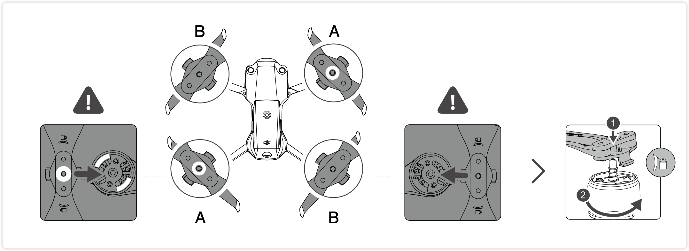

#### (4) 首次使用需给智能飞行电池充电以唤醒电池

按图示取出电池并连接标配电源适配器给其充电，约一分钟即可成功激活电池。电池完全充满电约需 1 小时 35 分钟。

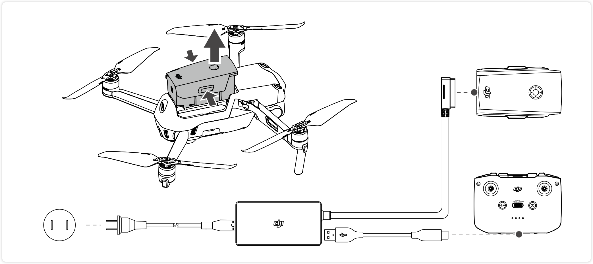

**注意**：

- 务必**首先展开前机臂，再展开后机臂**。
- **开启飞行器电源之前，确保云台罩已移除、前后机臂均已展开，以免影响飞行器自检**。

### 2. 准备遥控器

1. 取出位于摇杆收纳槽的摇杆，安装至遥控器。
2. 拉伸移动设备支架，并取出遥控器连接线手机端口(下图默认安装 Lightning 接口遥控器转接线，可根据移动设备接口类型更换相应的Micro USB 接口、USB-C 接口遥控器转接线)。 将移动设备放置于支架后，将遥控器连接线插入移动设备。确保移动设备嵌入凹槽内，放置稳固。

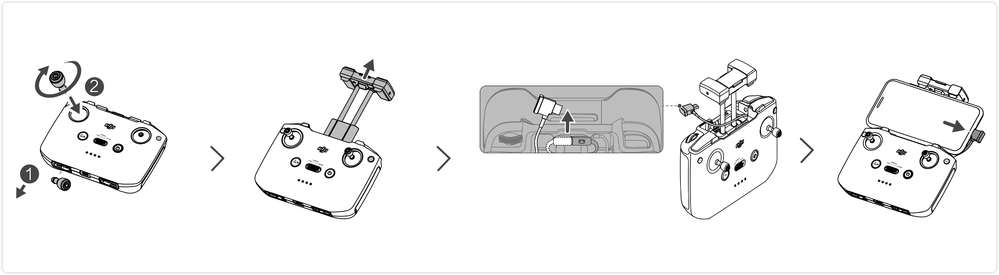

**注意**：连接安卓手机时，当系统弹出 USB 连接方式选项，请选择“仅充电”。选择其它选项有可能导致连接失败。

### 3. 部件名称

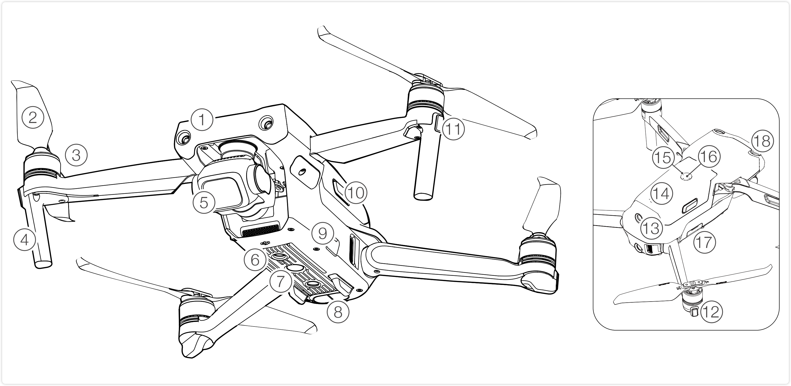

| 1．前视视觉系统^(1)^（2 个摄像头）     | 10．电池卡扣         |
| -------------------------- | -------------------- |
| **2．螺旋桨**                  | **11．**飞行器**机头指示灯**（左右各一个） |
| **3．电机**                  | **12．**飞行器**状态指示灯**（左右各一个） |
| **4．脚架（内含天线）**        | **13．后视视觉系统** （2 个摄像头）    |
| **5．一体式云台相机**          | **14．智能飞行电池**     |
| **6．下视视觉系统**（2 个摄像头）    | **15．电池电量指示灯**   |
| **7．补光灯**                  | **16．电池开关**       |
| **8．红外传感系统**            | **17．microSD 卡槽**  |
| **9．调参／数据接口（USB—C）** | **18．上视视觉系统**（2 个摄像头） |

(1) 视觉识别系统：通常来说包括 1 或 2 两个摄像头。（PS：初步估计 Air 2S 的 前/后/上/下 8 个视觉摄像头应该用的是一个图像处理器）

### 4. 遥控器部件名称

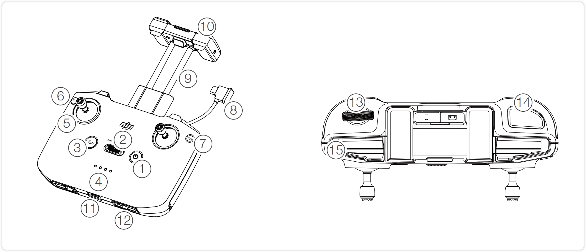

| 1．电源按键 短按查看遥控器电量；短按一次，再长按2秒开启／关闭遥控器电源。 | 8. 遥控器转接线  分别连接移动设备接口与遥控器图传接口， 实现图像及数据传输。可根据移动设备接口 类型自行更换。 |
| ------------------------------------------------------------ | ------------------------------------------------------------ |
| **2．飞行挡位切换开关**   用于切换运动（Sport）、普通（Normal） 与平稳（Cine）模式。 | **9. 移动设备支架**   用于放置移动设备。                      |
| **3．急停／智能返航按键**   短按使飞行器紧急刹车并原地悬停（GNSS或视觉系统生效时）。长按启动智能返航，再短按一次取消智能返航。 | **10. 天线**  传输飞行器控制和图像无线信号。       |
| **4．电量指示灯**   用于指示当前电量。                    | **11. 充电 / 调参接口(USB-C)**    用于遥控器充电或连接遥控器至电脑。 |
| **5．摇杆**   可拆卸设计的摇杆，便于收纳。DJI FlyApp 中可设置摇杆操控方式。 | **12. 摇杆收纳槽**   用于放置摇杆。                           |
| **6．自定义按键**   可通过 DJI Fly App 设置该按键功能。默认单击控制补光灯、双击使云台回中或朝下。 | **13. 云台俯仰控制拨轮**   用于调整云台俯仰角度。按住自定义按键 并转动云台俯仰控制拨轮可在录像模式下 调节变焦。 |
| **7．拍照／录像切换按键**   短按一次切换拍照或录像模式。      | **14. 拍摄按键**   短按拍照或录像。                           |
|                                                              | **15. 移动设备凹槽**   用于固定移动设备。                     |

### 5. 激活 DJI Air 2S

**全新的 DJI Air 2S 必须通过 DJI Fly App 激活，请开启飞行器和遥控器并连接手机，运行 DJI Fly 并根据界面提示操作。激活过程中需要使用互联网。**

## ▲ 飞行器

本章介绍飞行器的系统组成，以及各功能特点。

DJI Air 2S 飞行器主要由 ==飞控系统==、==通讯系统==、==视觉系统==、==动力系统==、以及智能==飞行电池==组成，本章节将详细介绍各部分的功能。

### 1. 飞行挡位

DJI Air 2S 支持普通、运动和平稳三种飞行挡位，可通过遥控器飞行挡位切换开关切换。

#### (1) 普通（Normal）档：
使用 GNSS 模块和前视、后视、上视以及下视视觉系统、红外传感系统以实现飞行器精确悬停、稳定飞行、智能飞行功能等。GNSS 信号良好时，利用 GNSS 可精准定位；GNSS 信号欠佳，光照等环境条件满足视觉系统需求时利用视觉系统定位。开启避障功能且光照等环境条件满足视觉系统需求时，最大飞行姿态角为 35°，最大飞行速度 15m/s。

> Added: **什么是 GNSS？**(2023.01.10)
> 
> A: GNSS 的全称是**全球导航卫星系统**（Global Navigation Satellite`/'sætəlaɪt/` System），此术语用于描述使用卫星信号来确定用户接收机位置的系统。也泛指所有的卫星导航系统（包括全球的、区域的和增强的）。目前的全球卫星导航系统中，美国的 GPS (Global Positioning`/pə'ziʃəniŋ/` System 全球定位系统) 系统和俄罗斯的 GLONASS(格洛纳斯) 系统处于完全运行状态，可以提供全球定位服务。中国的北斗系统 (也称为 Compass) 和欧盟的 Galileo` /ˌɡæləˈleɪəʊ/` 系统正在部署中。

#### (2) 运动（Sport）档：

使用 GNSS 模块、下视视觉系统实现飞行器精确悬停和稳定飞行。飞行器操控感度经过调整，最大飞行速度将会提升至 19m/s。使用运动模式飞行时，视觉避障功能自动关闭。

#### (3) 平稳模式（Cine）
平稳模式在普通模式的基础上限制了**最大飞行**速度、**上升**、**下降**速度，使飞行器在拍摄过程中更稳定。在 GNSS 卫星信号差或者指南针受干扰、并且不满足视觉定位工作条件时，飞行器将进入**姿态（ATTI）模式**。姿态模式下，飞行器会在水平方向将会产生漂移；并且视觉系统以及部分智能飞行模式将无法使用。 因此，该模式下飞行器自身无法实现定点悬停以及自主刹车，应尽快降落到安全位置以避免发生事故。应当尽量避免在 GNSS 卫星信号差以及狭窄空间飞行，以免进入姿态模式，导致飞行事故。

> ##### Added: 什么情况下 GNSS 卫星信号会变差？
>
> ##### Added: 无人机的指南针在什么情况下会受干扰？如何校准
> 指南针校准一般又称地磁校准，主要作用是消除外界磁场对地磁的干扰。地磁指南针是一种测量航向的传感器，航向是飞行器姿态三维角度中的一个，是组合导航系统中非常重要的一个状态量。
>
> 指南针易受其他电子设备、磁场等干扰而导致飞行数据异常，如果干扰后不进行指南针校准，无人机就会漂移，分不清方向，甚至导致飞行事故。
>
> **什么时候需进行指南针校准？**
> 1. 新机第一次飞行
> 2. 距离上次飞行时间超过一个月
> 3. 距离上次飞行地点超过20公里
> 4. APP提示校准指南针
>
> **如何校准指南针？**
>
> 有两种指南针校准方法：一种是机转人也转，另一种是机转人不转。
>
> 1. 机转人不转
>    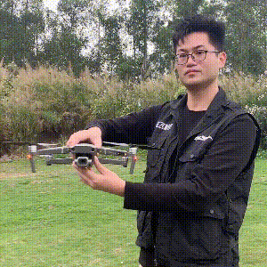
> 2. 人转机不转

**注意：**
- 在使用运动挡飞行时，视觉系统不会生效，飞行器无法主动刹车和躲避障碍物，用户务必留意周围环境，操控飞行器躲避飞行路线上的障碍物。
- 在使用运动挡飞行时，飞行器的飞行速度较普通挡相比将大幅度提升，由此造成刹车距离也相应地大幅度增加。在无风环境下飞行时，用户应预留至少 30 m 的刹车距离以保障飞行安全。
- 在使用运动挡和普通挡的在无风环境下上升或下降飞行时， 用户应预留至少 10 m 的刹车距离以保障飞行安全。
- 在使用运动挡飞行时，飞行器的姿态控制灵敏度与普通挡相比将大幅度提升，具体表现为遥控器上小幅度的操作会导致飞行器产生大幅度的飞行动作。实际飞行时，用户应预留足够的飞行空间以保障飞行安全。

### 2. 飞行器状态指示灯
DJI Air 2S 机身上包含**机头 LED 指示灯**以及**飞行器状态指示灯**。

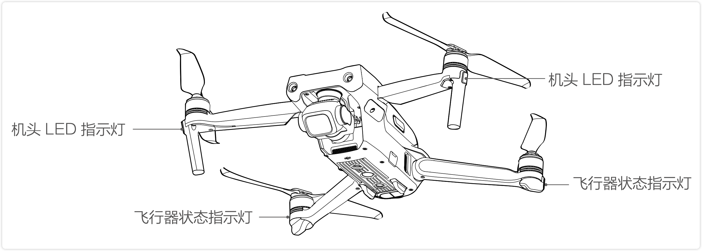

机头 LED 指示灯用于指示飞行器的机头方向，飞行器开启且电机未启动时将显示绿灯常亮。

飞行器电机未启动时，状态指示灯指示当前飞控系统的状态。请参考下表了解不同的闪灯方式所表示的飞控系统状态。

飞行器电机启动后，指示灯呈固定闪烁方式：**机头 LED 指示灯<strong style="color:green; border:1px solid green; border-radius:50%; padding:1px 3px;">绿</strong>灯闪烁，飞行器状态指示灯<strong style="color:red; border:1px solid green; border-radius:50%; padding:1px 3px;">红</strong><strong style="color:green; border:1px solid green; border-radius:50%; padding:1px 3px;">绿</strong>交替闪烁**。

#### 飞行器状态指示灯说明

##### 正常状态

| <strong style="color:red; border:1px solid red; border-radius:50%; padding:1px 3px;">红</strong> <strong style="color:green; border:1px solid green; border-radius:50%; padding:1px 3px;">绿</strong> <strong style="color:#bbbb02; border:1px solid #bbbb02; border-radius:50%; padding:1px 3px;">黄</strong> ...... | 红绿黄连续闪烁 | 系统自检                     |
| ------------------------------------------------------------ | -------------- | ---------------------------- |
| <strong style="color:#bbbb02; border:1px solid #bbbb02; border-radius:50%; padding:1px 3px;">黄</strong>  × 4 ...... | 黄灯闪四次     | 预热                         |
| <strong style="color:green; border:1px solid green; border-radius:50%; padding:1px 3px;">绿</strong> . . . . . . | 绿灯慢闪       | 使用 GNSS 定位               |
| <strong style="color:green; border:1px solid green; border-radius:50%; padding:1px 3px;">绿</strong>  × 2 ...... | 绿灯双闪       | 使用视觉系统定位             |
| <strong style="color:#bbbb02; border:1px solid #bbbb02; border-radius:50%; padding:1px 3px;">黄</strong> . . . . . . | 黄灯慢闪       | 无 GNSS 无视觉定位(姿态模式) |

##### 警告与异常

| <strong style="color:#bbbb02; border:1px solid #bbbb02; border-radius:50%; padding:1px 3px;">黄</strong> ······  | 黄灯快闪       | 遥控器信号中断             |
| ------------------------------------------------------------ | -------------- | ---------------------------- |
| <strong style="color:red; border:1px solid red; border-radius:50%; padding:1px 3px;">红</strong> . . . . . .   | 红灯慢闪       | 低电量报警                 |
| <strong style="color:red; border:1px solid red; border-radius:50%; padding:1px 3px;">红</strong> ......   | 红灯快闪       | 严重低电量报警             |
| <strong style="color:red; border:1px solid red; border-radius:50%; padding:1px 3px;">红</strong> . .. .. .   | 红灯间隔闪烁   | 放置不平或传感器误差过大   |
| <strong style="color:red; border:1px solid red; border-radius:50%; padding:1px 3px;">红</strong> —— | 红灯常亮       | 严重错误                   |
| <strong style="color:red; border:1px solid red; border-radius:50%; padding:1px 3px;">红</strong> <strong style="color:#bbbb02; border:1px solid #bbbb02; border-radius:50%; padding:1px 3px;">黄</strong> ......    | 红黄灯交替闪烁 | 指南针数据错误，需校准      |

### 3. 自动返航

DJI Air 2S 飞行器具备自动返航功能，返航方式主要分为**智能返航**、**智能低电量返航**以及**失控返航**。飞行器成功记录了返航点并且在定位服务良好的情况下，当用户开启智能返航、飞行器低电量触发智能低电量返航、遥控器与飞行器之间失去通讯信号以及图传信号丢失触发失控返航时，飞行器将自动返回返航点并降落。

| 参考信息 |                             GPS                              | 描述                                                         |
| -------- | :----------------------------------------------------------: | :----------------------------------------------------------- |
| 返航点   | 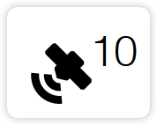 | 飞行器开机后，当 GNSS 信号首次显示为强或较强（白色）时，将记录飞行器当前位置为返航点。 起飞时，若 GNSS 信号再次达到强或较强时， 将重新记录飞行器当前位置为返航点； 若 GNSS 信号不能满足条件，则不会刷新返航点。 |

#### 3.1 智能返航
智能返航由用户主动触发，**可长按遥控器智能返航按键** 或 **点击 DJI Fly App 相机界面中的返航图标 **启动。返航过程中短按遥控器智能返航按键或点击DJI Fly App 相机界面中的停止图标 × 可退出返航。退出智能返航后，用户可重新控制飞行器。 

智能返航过程包括直线返航与节能返航。

##### 直线返航过程
1. 飞行器记录返航点。
2. 触发智能返航。
    + (a) 当返航距离 > 50 m 时，飞行器调整机头方向朝向返航点，然后上升至用户设定的返航高度后开始返航。若当前高度大于返航高度，则以当前高度返航。
    + (b) 当返航距离在 5 - 50 m 时，飞行器调整机头方向朝向返航点，并以当前高度返航。
    + (c) 返航距离 < 5 m 时，飞行器直接降落。
3. 飞行器自动飞回至返航点上方，飞行器开始降落。 

**注意**：返航若由 DJI Fly App 触发，当返航距离大于等于 5m 时，App 显示返航和降落选项，用户可选择返航或直接降落。

##### 节能返航过程
直线返航过程中，当飞行器距离返航点超过 480 m、飞行高度大于返航高度 90 m 且大于起飞高度 290 m 时，DJI Fly 会弹窗提示是否进入节能返航模式。用户选择之后，飞行器会中断当前的直线巡航，自动计算与返航点的一个最佳节能角度（与水平面夹角 14°），并将沿着这个角度飞行至返航点上方，再开始垂直降落。

节能返航过程中，如果出现用户向后打俯仰杆、遥控器信号中断、视觉系统失效这几种情况，飞行器将结束节能返航，进入直线返航。

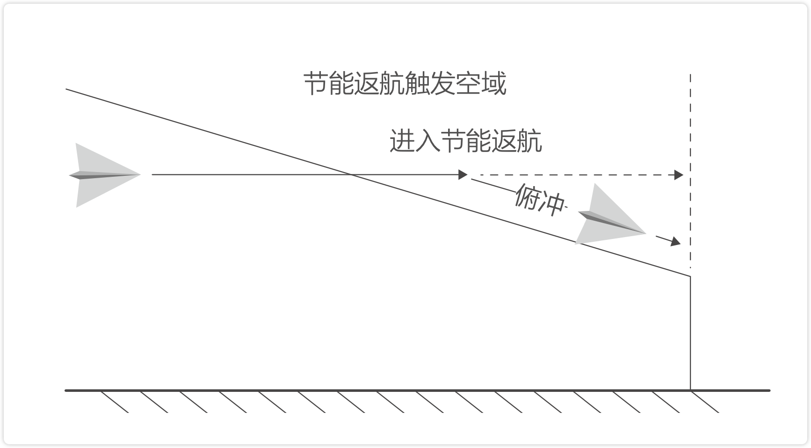

#### 3.2 智能低电量返航
当智能飞行电池电量过低、没有足够的电量返航时，用户应尽快降落飞行器，否则电量耗尽时飞行器将会直接坠落，导致飞行器损坏或者引发其它危险。
为防止因电池电量不足而出现不必要的危险，DJI Air 2S 将会根据飞行的位置信息，智能地判断当前电量是否充足。若当前电量仅足够完成返航过程，DJI Fly App将提示用户是否需要执行返航。

返航过程中可短按遥控器智能返航按键取消返航。若用户取消低电量返航提醒并继续飞行，将可能导致飞行器返回过程中电量不足迫降，造成飞行器丢失或坠毁。

若当前电量仅足够实现降落，飞行器将强制下降，不可取消。下降过程中可通过遥控器（无线信号正常时）控制飞行器水平方向。

#### 3.3 失控返航
当 GNSS 信号良好、指南针工作正常且飞行器成功记录返航点后，当无线信号中断 6 秒或以上，飞行器将会进入失控返航。飞行器首先将沿着失控之前的路径反向飞行 50 m，随后再执行直线返航。

若失控时飞行器距离返航点 < 50 m，则以当前高度直线返航。反向飞行 50m 后：
- (a) 当前位置距离返航点 < 50 m，飞行器以当前高度继续返航。
- (b) 当前位置距离返航点 > 50 m，且当前高度 > 返航高度时，飞行器以当前高度继续返航。
- (c) 当前位置距离返航点 > 50m，且当前高度 < 返航高度时，飞行器先原地上升至返航高度，随后朝返航点直线返航。

#### 返航避障过程

##### 上升过程中：
1. 当前方检测到障碍物时，飞行器停止上升，后退至安全距离并刹车，然后继续上升。
2. 当后方检测到障碍物时，飞行器停止上升，前进至安全距离并刹车，然后继续上升。
3. 当上方检测到障碍物时，飞行器停止上升，前进至安全距离并刹车，然后继续上升。
4. 当下方检测到障碍物时，不做处理。

##### 前进过程中：
1. 当前方检测到障碍物时，飞行器刹车，后退至安全距离并刹车，然后上升至前方没有障碍物后继续上升 5m，再继续前进。
2. 当后方检测到障碍物时，不做处理。
3. 当上方检测到障碍物时，不做处理。
4. 当下方检测到障碍物时，飞行器刹车，上升至下方没有障碍物后停止上升，继续前进。

**注意**：
- 飞行器无法躲避两侧的障碍物。
- 返航上升过程中，若往下拉满油门杆，飞行器将停止上升，此时若油门杆回中或持续拉满杆超过 10 秒将退出返航。返航巡航过程中，若向下拉满俯仰杆，飞行器将刹车并悬停，此时若俯仰杆回中或持续拉满杆超过 10 秒将退出返航。
- 当 GNSS 信号欠佳或者 GNSS 不工作时，有可能无法实现正常返航。若失控返航时 GNSS 信号欠佳或者 GNSS 不工作有可能进入姿态模式，飞行器将自动降落。
- **起飞前务必先进入 DJI Fly App 的相机界面，设置适当的返航高度（默认返航高度为 100m）**。
- 返航过程中，若光照等环境条件不符合视觉系统的需求，则飞行器无法躲避障碍物。
- 返航过程中，遥控器信号正常时用户可通过遥控器或 DJI Fly 控制飞行器的速度和高度，但不可以控制机头朝向和左右飞行。若用户打杆使飞行速度大于 15m/s（最大避障速度），则此时飞行器无法避障。
- 限飞区和禁飞区将对自动返航造成影响。返航时遇到禁飞区时，飞行器将下降到无禁区再继续返航，或者原地悬停。
- 风速过大时，可能导致飞行器无法成功返航。请谨慎飞行。

#### 降落保护
若用户通过遥控器、DJI Fly App 手动触发返航或降落，当飞行器降落时，降落保护功能生效。飞行器具体表现为：
1. 若飞行器降落保护功能正常且检测到地面可降落时，飞行器将直接降落。
2. 若飞行器降落保护功能正常，但检测结果为不适合降落时（例如下方为不平整地面或水面），则飞行器悬停，等待用户操作。
3. 若飞行器降落保护功能不正常，则下降到离地面 0.5m 时，App 将提示用户是否需要继续降落。点击确认或下拉油门持续 1s 后，飞行器降落。

由飞行器自主触发（如低电量、失控触发）的返航或降落，为保证安全，降落时飞行器会悬停在离地 0.5 m 的高度， DJI Fly App 将提示用户是否需要继续降落。点击确认或下拉油门持续 1s 后，飞行器降落，此时降落保护功能生效，具体表现同以上步骤。

#### 精准降落
飞行器在自动返航的过程中，当到达返航点上方后开始匹配地形特征，一旦匹配成功则开始修正降落位置，使飞行器能够精准地回到起飞点。

**注意**：
- 精准降落过程中降落保护同时生效。
- 飞行器仅在满足以下条件的情况下可实现精准降落：
    + (a) 飞行器仅在起飞时记录返航点，飞行过程中未刷新返航点。
    + (b) 飞行器起飞方式为垂直起飞，且起飞高度超过 7m。
    + (c) 地面环境未发生动态变化。
    + (d) 地面环境纹理较为丰富（例如雪地场景不适用该功能）。
    + (e) 光线明暗合适（例如暗夜或强光场景不适用该功能）。
- 降落过程中，可使用遥控器进行控制：
    + (a) 下拉油门杆可加大下降速度。
    + (b) 上推油门杆或者其他方式拨动摇杆都被视为放弃精准降落，飞行器将垂直下降， 降落保护功能同时生效。

### 4. 视觉系统与红外传感系统
DJI Air 2S 配备**前、后、上、下双目视觉系统**和**底部红外传感系统**，为飞行器提供环境感知能力。前、后、上、下视双目视觉系统分别位于机头、机尾和机底，分别由两个摄像头组成。**视觉系统通过图像测距来感知障碍物**。

底部**红外传感器系统分别由一个红外传感器模组（一发一收）组成**。红外传感器可以判断距离障碍物距离，还可以提供飞行器对地高度参考，配合下视双目系统计算飞行器位置信息。

DJI Air 2S 还配备下视补光灯，在光线不足时开启，可辅助下视视觉系统工作。

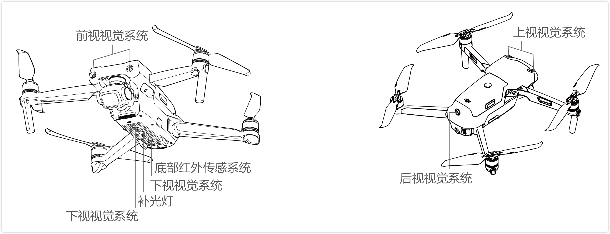

#### 4.1 观测范围
##### 前视
精确测距范围：0.38-23.8m；视角（FOV (Field of View 视场/视场角/视野)）：水平 72°，垂直 58°

##### 后视
精确测距范围：0.37-23.4m；视角（FOV）：水平 57°，垂直 44°

##### 上视
精确测距范围：0.34-28.6m；视角（FOV）：水平 63°，垂直 78°

##### 下视
精确悬停范围：0.5-30m，视觉悬停范围：0.5-60m

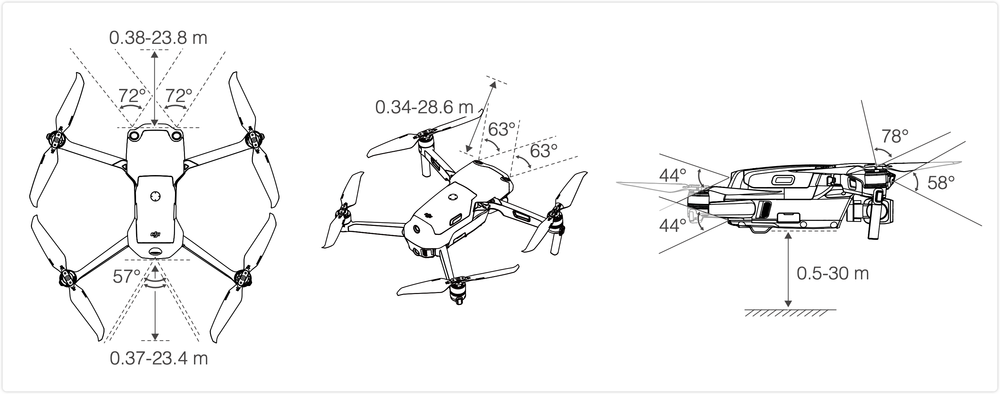

#### 4.2 校准

##### 自动校准
视觉系统出厂时已经校准，可正常工作。在飞行过程中，当系统检测到标定参数异常，飞行器将会尝试自动校准。此时 DJI Fly App 将出现相应提示。自动校准过程中无须用户参与，正常操作即可。若自动校准失败，则提示需要高级校准。

##### 高级校准
当 DJI Fly App 提示用户需要高级校准时，需将飞行器连接 DJI Assistant 2 (Consumer Drones Series) 调参软件，按以下步骤校准视觉系统（图示以校准前视视觉系统为例）。

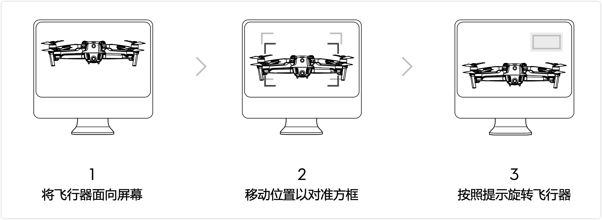

根据提示重复以上步骤校准后视、下视、上视视觉系统。

#### 4.3 使用场景
下视视觉系统的定位功能适用于无 GNSS 信号或 GNSS 信号欠佳的环境，最佳工作高度范围为 0.5 - 30m。下视视觉定位系统在普通或平稳模式中自动开启。

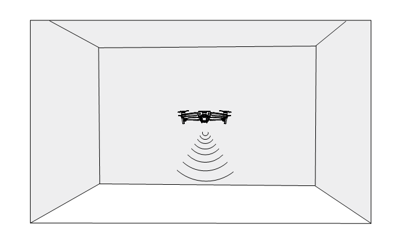

前视、后视、上视视觉系统在普通或平稳模式中自动开启（需在 DJI Fly App 中选择避障行为为绕行或刹停）。前视、后视、上视视觉系统适用于光照良好的环境，且飞行路线中遇到的障碍物纹理不可特别稀疏。另外由于惯性关系，需要控制飞行器在有效距离内刹车。

**注意**：
- 请务必留意飞行环境，视觉系统与红外传感系统只在有限条件下发挥安全辅助作用，不能代替人的判断和操控。用户应在飞行过程中时刻留意周围环境与 DJI Fly App 相关警示，全程保持对飞行器的控制并对操控行为负责。
- **无 GNSS 的情况下，在开阔平坦的场地使用视觉系统时，飞行器最大悬停高度为 60m。视觉定位系统最佳工作高度范围为 0.5 - 30m，超出该范围飞行时，视觉定位性能可能下降，请谨慎飞行。**
- 在 DJI Fly 可设置补光灯的打开方式（打开、关闭或自动）。若选择自动，补光灯将在环境光线不足时自动开启，此时视觉定位性能下降，若 GNSS 信号不佳，请谨慎飞行。
- **视觉系统在水面上可能无法正常工作**。因此，当降落功能触发时，飞行器可能无法主动回避下方水域。建议用户对飞行保持全程控制，并根据周围环境进行合理判断，不过度依赖视觉系统。
- 视觉系统无法识别没有纹理特征的表面，及无法在光照强度不足或过强的环境中正常工作。在以下场景下视觉系统无法正常工作：
    + (a) 纯色表面（例如纯黑、纯白、纯红、纯绿）。
    + (b) 有强烈反光或者倒影的表面（例如冰面）。
    + (c) 水面或者透明物体表面。
    + (d) 运动物体表面（例如人流上方、大风吹动的灌木或者草丛上方）。
    + (e) 光照剧烈快速变化的场景。
    + (f) 特别暗（光照小于 10lux）或者特别亮（光照大于 40,000lux）的物体表面。
    + (g) 对红外有很强吸收或者反射作用的材质表面（例如镜面）。
    + (h) 纹理特别稀疏的表面。
    + (i) 纹理重复度很高的物体表面（例如颜色相同的小格子砖）。
    + (j) 细小的障碍物。
- 请勿以任何方式干扰视觉系统，并确保镜头清晰无污点。
- 如果飞行器受到强烈碰撞，则有可能需要重新校准视觉系统。
- 避免在雨雾天气或在其他能见度低（能见度低于 100 m）的场景飞行。
- 起飞前请检查红外传感系统和视觉系统的表面玻璃：
    + (a) 去掉表面的贴膜、贴纸、及其他遮挡物品。
    + (b) 若有水滴、指纹、脏污等，请先擦拭干净（请使用无尘布擦拭，不能使用酒精等有机溶剂）。
    + (c) 若表面玻璃有掉落、破碎、划痕、磨损等，请返厂维修。
- 请勿以任何方式遮挡红外传感器。

### 5. 智能飞行功能

#### 5.1 焦点跟随
DJI Air 2S 焦点跟随包含聚焦 2.0、兴趣点环绕 3.0 以及智能跟随 4.0 三种智能功能。
##### (1) 聚焦 2.0 
飞行器停留在当前位置不自主飞行，仅机头以及云台相机跟随目标移动。

用户打杆可以控制飞行器移动：横滚杆控制飞行器围绕目标旋转，俯仰杆控制飞行器靠近或远离目标，油门杆控制飞行器高度，偏航杆控制构图。
- 提示：油门杆、偏航杆、俯仰杆、横滚杆 术语见当前文档 `遥控器 -- 1.遥控器概述` 

##### (2) 兴趣点环绕 3.0
飞行器以设定半径和速度环绕目标飞行，支持静止和动态目标（动态目标特指人、车、船，速度不宜过大，且跟随高度不会随动态目标变化而变化）。

##### (3) 智能跟随 4.0
分为**追踪**与**平行**两种跟随模式。

用户打杆可以控制飞行器移动：横滚杆控制飞行器围绕目标旋转，俯仰杆控制飞行器靠近或远离目标，油门杆控制飞行器高度，偏航杆控制构图。

1. **追踪**: 表现为飞行器保持当前与目标的相对距离，跟随目标移动而飞行。普通挡或平稳模式下，最大飞行速度为 12m/s，检测到障碍物时或用户操作俯仰杆时飞行器可主动绕行，操作横滚杆和油门杆时无避障；运动挡最大飞行速度为 19m/s，无避障功能。

2. **平行跟随**：表现为飞行器保持相对目标的拍摄和跟随角度，实现侧面跟随，普通挡或平稳模式下，最大飞行速度 12m/s；运动挡最大飞行速度为 19m/s。平行跟随模式无避障功能。

##### 启动焦点跟随
1. 启动飞行器，使飞行器起飞至离地面 1m 以上。
2. 在 DJI Fly 相机界面画框选择目标，即可进入焦点跟随。
3. 进入焦点跟随后，默认进入聚焦 2.0 （锁定），点击图标切换兴趣点环绕 3.0 （环绕）以及 智能跟随 4.0  （跟随）。打开“目标识别”开关后，自动识别的目标中，若出现挥手手势（单手举手，手肘高于肩部)，则自动选择挥手目标开始跟随。
4. 点击拍摄按键可拍照或录像。点击回放按键可查看所拍摄素材。

##### 退出焦点跟随

短按遥控器急停按键或点击屏幕上的 Stop 退出焦点跟随。

**注意**：
- 请在飞行器的跟随路径上始终避让人，动物，细小物体（如：树枝或电线等），或透明物体（如：玻璃或水面）。
- 始终留意来自飞行器四周的物体，并通过手动操作遥控器来避免碰撞。
- 时刻准备在紧急情况下手动控制飞行器或点击屏幕上的 Stop。
- 在以下场景需谨慎使用焦点跟随模式：
    + (a) 被跟随物体在非水平地面上移动；
    + (b) 被跟随物体在移动时发生大幅度的形变；
    + (c) 被跟随物体被长时间遮挡或位于视线外；
    + (d) 被跟随物体在积雪覆盖的区域；
    + (e) 被跟随物体与周围环境颜色或图案非常相近；
    + (f) 环境特别暗（光照小于 300 lux）或者特别亮（光照大于 10，000 lux）时。
- 用户在使用焦点跟随模式时，请务必遵守当地的法律法规对隐私权的规定。
- 若飞行器自动识别的目标并非人物、车、船，请谨慎选择。请勿选择儿童作为跟随目标。
- 请勿选择模型车、模型船等尺寸较小的车、船进行跟随。
- 跟随过程中，当跟随目标与其它物体重叠时可能导致跟随目标异常切换。
- 使用挥手手势启动智能跟随时，以画面中识别到的第一个手势为准。要求飞行器与挥手人的距离为 5 - 10m，飞行器的俯仰角度不超过 60°。
- 高分辨率录像时（2.7K 48/50/60 fps, 1080p 48/50/60/120 fps, 4K 48/50/60 fps, 5.4K 24/25/30 fps），焦点跟随不可用。

#### 5.2 大师镜头
飞行器将根据拍摄目标类型和距离等信息，智能匹配人像、近景或远景三种飞行轨迹，自动拍摄多种经典航拍运镜。拍摄完成后将自动剪辑成片。

##### 启动大师镜头
1. 启动飞行器，使飞行器起飞至离地面 2 m 以上。
2. 点击拍摄模式图标，选择大师镜头并阅读新手指导及注意事项。确保已充分了解并能安全使
    用该功能。
3. 框选目标后，点击 Start，飞行器将自动飞行并拍摄视频，并在拍摄完成后返回至拍摄起始点。
4. 点击回放按可查看所拍摄的视频，并可直接编辑及分享至社交网络。

##### 退出大师镜头
短按遥控器上的急停按键或点击屏幕按键使飞行器紧急刹车并悬停。

**注意**：
- 请在开阔无遮挡、无障碍物的环境使用大师镜头功能，并时刻注意飞行器路径上是否有人、动物、建筑物等障碍物。飞行器检测到前、后、上方向的障碍物（无法检测到侧边障碍物）将提前减速并刹车悬停，不会绕行。
- 始终注意来自飞行器四周的物体并通过手动操作来避免事故（如碰撞）及对飞行器的遮挡。
- 在以下场景下视觉系统无法正常工作，不建议使用大师镜头：
    + (a) 当被拍摄物体被长时间遮挡或位于视线外时；
    + (b) 当被拍摄物体与周围的环境颜色或图案非常相近时；
    + (c) 当被拍摄物体位于空中时；
    + (d) 当被拍摄物体以较快速度移动时；
    + (e) 在特别暗（光照小于 300 lux）或者特别亮（光照大于 10,000 lux）的环境。
- 请不要在靠近建筑物、有遮挡等 GNSS 信号不佳的地点使用大师镜头，否则可能导致飞行器飞行轨迹不稳定等意外情况发生。
- 用户在使用大师镜头功能时，请务必遵守当地的法律法规对隐私权的规定。

#### 5.3 一键短片
一键短片包含渐远、冲天、环绕、螺旋、彗星、小行星六个子模式，飞行器可自动按照所选拍摄方式飞行并持续拍摄特定时长，最后自动生成短视频，支持在回放中编辑与快速分享视频。

| .gif)                    | 渐 远： | 飞行器边后退边上升，镜头跟随目标拍摄。                       |
| ------------------------------------------------------------ | ------- | ------------------------------------------------------------ |
|                               | 冲 天： | 飞行器飞行到目标上方后垂直上升，镜头俯视目标拍摄。           |
|                               | 环 绕： | 飞行器以拍摄目标为中心，以特定距离环绕飞行拍摄。             |
| 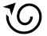                              | 螺 旋： | 飞行器以拍摄目标为中心，螺旋上升拍摄。                       |
|                               | 彗 星： | 飞行器以初始地点为起点，椭圆轨迹飞行绕到目标后面，并飞回起点拍摄。使用时确保飞行器周围有足够空间（四周有 30 m 半径、上方有 10 m 以上空间）。 |
| 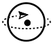 | 小行星  | 采用轨迹与全景结合的方式，完成一个从全景到局部的漫游小视频。飞行器以拍摄目标为中心，远离同时上升到一定高度拍摄，并以飞行最高点为全景照片的初始位置拍摄全景照片。最后合成全景图为星球效果，生成视频播放顺序与飞行轨迹相反。使用时确保飞行器周围有足够空间（后方有 40 m、上方有 50 m 及以上空间）。 |

##### 启动一键短片
1. 启动飞行器，使飞行器起飞至离地面 2 m 以上。
2. 点击拍摄模式图标，选择一键短片并阅读新手指导及注意事项。确保已充分了解并能安全使用该功能。
3. 选择子模式后，在屏幕上选定目标。点击 Start，飞行器将自动飞行并拍摄视频，并在拍摄完成后返回至拍摄起始点。若在取景画面中出现挥手手势（单手举手，手肘高于肩部），也可启动一键短片。
4. 点击回放按键  可查看所拍摄的短视频或原视频，并可直接编辑及分享至社交网络。

##### 退出一键短片
拍摄过程中短按遥控器上的急停按键或点击屏幕  按键使飞行器紧急刹车并悬停，再次点击屏幕可继续拍摄。

**注意**：
- 请在开阔无遮挡、无障碍物的环境使用一键短片功能，并时刻注意飞行器路径上是否有人、动物、建筑物等障碍物。飞行器检测到前、后、上方向的障碍物（无法检测到侧边障碍物）将提前减速并刹车悬停，不会绕行。
- 始终注意来自飞行器四周的物体并通过手动操作来避免事故（如碰撞）及对飞行器的遮挡。
- 在以下场景下视觉系统无法正常工作，不建议使用一键短片：
    + (a) 当被拍摄物体被长时间遮挡或位于视线外时；
    + (b) 当被拍摄物体与飞行器距离超过 50 m 时；
    + (c) 当被拍摄物体与周围的环境颜色或图案非常相近时；
    + (d) 当被拍摄物体位于空中时；
    + (e) 当被拍摄物体以较快速度移动时；
    + (f) 在特别暗（光照小于 300 lux）或者特别亮（光照大于 10,000 lux）的环境。
- 请不要在靠近建筑物、有遮挡等 GNSS 信号不佳的地点使用一键短片，否则可能导致飞行器飞行轨迹不稳定等意外情况发生。
- 用户在使用一键短片功能时，请务必遵守当地的法律法规对隐私权的规定。
- 使用挥手手势启动一键短片时，以画面中识别到的第一个手势为准。要求飞行器与挥手人的距离为 5-10 m，飞行器的俯仰角度不超过 60°。

#### 5.4 延时摄影
延时摄影包含自由延时、环绕延时、定向延时、轨迹延时四个子模式。

##### (1) 自由延时
通过设置参数，飞行器将在设定时间内自动拍摄一定数量的照片，并生成延时视频。未起飞状态下，可在地面进行拍摄；起飞状态下用户可以通过打杆自由控制飞行器和云台角度。使用步骤：
1. 设置拍摄参数，包括拍摄间隔、合成视频时长。屏幕将显示拍摄张数和拍摄时间。
2. 点击拍摄按键开始拍摄。

定速巡航功能：在操控界面配置遥控器自定义按键（Fn）的功能为定速巡航，在打杆时按下自定义按键进入定速巡航，此时飞行器将保持进入时的飞行速度进行拍摄。

##### (2) 环绕延时
选取目标，飞行器将在环绕目标飞行的过程中拍摄延时影像。使用步骤：
1. 设置拍摄参数，包括拍摄间隔、合成视频时长、环绕方向等。屏幕将显示拍摄张数和拍摄时间。
2. 框选目标。
3. 点击拍摄按键开始拍摄。
4. 拍摄过程中支持用户操作。使用云台俯仰拨轮和偏航杆可调节构图，通过俯仰杆控制与目标的距离，通过横滚杆控制环绕飞行速度，通过油门杆控制飞行器上升或下降的速度。

##### (3) 定向延时
选取目标及航向，飞行器将在定向飞行的过程中拍摄延时影像。定向模式下也可以不选择目标，只定向飞行，在只定向的情况下可打杆控制机头朝向和云台。使用步骤：
1. 设置拍摄参数，包括拍摄间隔、合成视频时长。屏幕将显示拍摄张数和拍摄时间。
2. 设定航向。
3. 框选目标（可不选），使用云台俯仰拨轮和偏航杆可调节构图。
4. 点击拍摄按键开始拍摄。通过俯仰杆和横滚杆控制飞行速度和短暂改变锁定的直线方向，通过油门杆控制飞行器上升或下降的速度。

##### (4) 轨迹延时
除了设置拍摄参数，还需要选定多个关键点位置和镜头朝向，飞行器将按照关键点信息生成轨迹拍摄延时影像，开始拍摄前可选择关键点的正序和倒序飞行。使用步骤：
1. 设置关键点位置和镜头朝向。
2. 设置拍摄参数，包括拍摄间隔、合成视频时长。屏幕将显示拍摄张数和拍摄时间。
3. 点击拍摄按键开始拍摄。
拍摄完成后飞行器将自动合成视频，用户可在回放中查看。用户可在系统设置—拍摄设置中选择是否保存原片以及原片的保存位置（机身内置存储或 SD 卡）。

**注意**：
- 请**建议飞行在 50m 或以上的高度拍摄延时影像以获得更好的效果，并且推荐设置拍摄间隔时间与快门时间至少相隔 2s 以上**。
- **建议选取距离 > 15 m 的静态景物，比如大楼、山、房子等**，不建议选取近处的地面、人物、移动的车等目标。
- 延时摄影中，若环境符合视觉系统生效条件，当飞行器检测到前、后、上方向的障碍物（无法检测到侧边障碍物）时将提前减速并刹车悬停，不会绕行。
- 当拍照张数超过 25 张（视频大于 1 秒）时，不管延时摄影正常完成或异常退出（如低电量返航），飞行器均会默认为用户合成视频。

### 6. 高级辅助飞行系统 4.0（APAS 4.0）

在普通挡可以使用高级辅助飞行系统（Advanced Pilot Assistance Systems, APAS）。当用户往前或者往后打杆飞行时，飞行器将根据用户的操作和周围环境规划绕行轨迹，从而使飞行器轻松绕开障碍物，获得更流畅的飞行体验和流畅的拍摄画面。

用户保持向前或向后打杆，可以实现上、下、左、右绕行。此时如果用户叠加其它杆量，则绕行和杆量会同时作用。若用户向前打杆时同时叠加航向杆量，则飞行器表现为协调转弯。

打杆绕行过程中可以暂停（遥控器暂停键或 App 暂停键），飞行器将悬停 3 s。

在 DJI Fly App 相机界面，进入系统设置—安全页面，可开启辅助飞行功能。

**注意**：
- 使用智能飞行功能时，高级辅助飞行系统将自动关闭，退出智能飞行系统时将自动恢复。高分辨率录像时（2.7K 48/50/60 fps, 1080p 120 fps, 4K 48/50/60 fps, 5.4K 24/25/30 fps），高级辅助飞行系统将自动关闭。
- 辅助飞行功能只在用户往前、后、上、下方向打杆飞行时有效，左右打杆飞行不生效，此时飞行器不会绕行以及避障。
- 请在视觉避障功能可以正常工作的场景下使用。请勿指示飞行器飞向他人、动物、细小物体（例如树枝或电线等）、透明物体（如玻璃或水等）。
- 请在具有视觉定位或 GNSS 定位的场景下使用。高级辅助飞行系统在水面上或积雪覆盖区域可能无法正常工作。
- 在光照条件特别暗（光照小于 300lux）或特别亮（光照大于 10,000lux）的条件下，请谨慎使用。请留意 DJI Fly 提示栏信息，确保飞行器工作在辅助飞行模式。
- 在限远、限高以及限飞区边界附近使用该功能时，高级辅助飞行系统可能无法正常工作。

### 7. 飞行数据
### 8. 螺旋桨
### 9. 智能飞行电池
### 10. 云台相机

## ▲ 遥控器

### 1. 遥控器概述
### 2. 遥控器操作
### 3. 遥控器对频

## ▲ DJI Fly App
### 1. 主页
### 2. 相机界面

## ▲ 飞行
### 1. 飞行环境要求

基站：

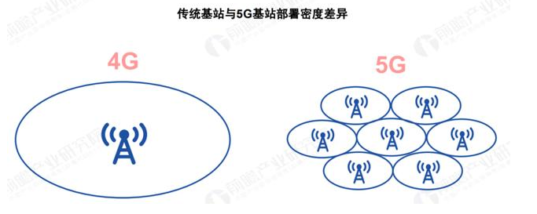

4G 信号塔：

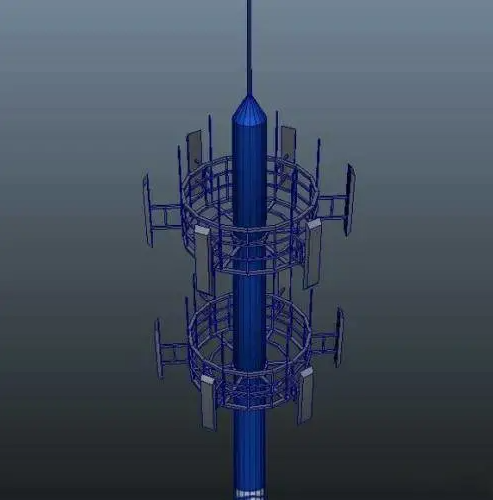

5G 信号塔：

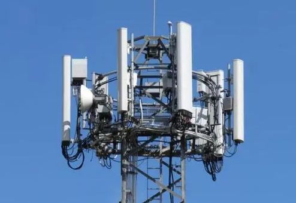

### 2. 飞行限制以及特殊区域限飞

### 3. 飞行前检查
### 4. 自动起飞／自动降落
### 5. 手动启动／停止电机
### 6. 基础飞行

## ▲ 附录
### 1. 规格参数
### 2. 固件升级
### 3. 售后保修信息

