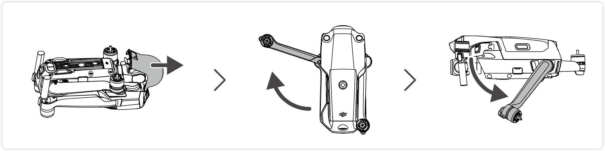

# DJI Air 2s 用户手册 v1.0 2021.04

## ▲ 目录

- 阅读提示
    + 符号说明
    + 使用建议
    + 获取教学视频
    + 下载 DJI Fly App
    + 下载 DJI Assistant 2（Consumer Drones Series）调参软件

- 产品概述
    + 简介
    + 准备飞行器
    + 准备遥控器
    + 部件名称
    + 遥控器部件名称
    + 激活 DJI Air 2S

- 飞行器
    + 飞行挡位
    + 飞行器状态指示灯
    + 自动返航
    + 视觉系统与红外传感系统
    + 智能飞行功能
    + 高级辅助飞行系统 4.0（APAS 4.0）
    + 飞行数据
    + 螺旋桨
    + 智能飞行电池
    + 云台相机

- 遥控器
    + 遥控器概述
    + 遥控器操作
    + 遥控器对频

- DJI Fly App
    + 主页
    + 相机界面

- 飞行
    + 飞行环境要求
    + 飞行限制以及特殊区域限飞
    + 飞行前检查
    + 自动起飞／自动降落
    + 手动启动／停止电机
    + 基础飞行

- 附录
    + 规格参数
    + 固件升级
    + 售后保修信息

## ▲ 阅读提示

### 1. 符号说明

 **禁止**

 重要**注意**事项 

 操作、使用**提示** 

 词汇解释、**参考信息**

### 2. 使用建议

DJI TM 为 DJI Air 2S 用户提供了教学视频和以下文档资料：
1. 《免责声明和安全概要》
2. 《快速入门指南》
3. 《用户手册》

建议用户首先观看教学视频和《免责声明和安全概要》，再阅读《快速入门指南》了解使用过程。

获取详细产品信息请阅读《用户手册》

### 3. 获取教学视频
用户可通过以下链接获取和观看教学视频，确保正确、安全地使用本产品。
http://www.dji.com/air-2s/video

### 4. 下载 DJI Fly App

请务必连接 DJI Fly App 使用本产品。扫描二维码以获得下载地址。

DJI Fly App 支持 Android 6.0 及以上系统，支持 iOS 11.0 及以上系统。

备注：为保证飞行安全，未连接、未登录 App，以及中国大陆地区用户未绑定手机完善注册信息进行飞行时，飞行器将被限高 30 m，限远 50 m。在中国大陆地区使用飞行器的用户，需根据中国民用航空局的相关规定完成实名登记，请通过民航局无人机实名登记系统登记，或直接在 DJI Fly App 中进行登记操作。如需了解更多信息，请访问 https://uas.caac.gov.cn

### 5. 下载 DJI Assistant 2（Consumer Drones Series）调参软件
通过以下地址下载 DJI Assistant 2 (Consumer Drones Series) 调参软件：http://www.dji.com/air-2s/downloads

**注意**：**本产品的工作环境温度为 0℃至 40℃**，根据电子元器件适用温度的等级划分，不满足需要更高适应
条件的军工级（-55℃至 125℃）要求。请在满足使用场景的环境下合理使用飞行器。

## ▲ 产品概述
本章主要介绍 DJI Air 2S 的功能特点，指导如何安装飞行器，以及介绍飞行器与遥控器各个部件的名称。

### 简介
DJI Air 2S 飞行器机身可折叠，配备位于**机身前方、后方、上方、下方的视觉系统**和**红外感知系统**，能在**室内外**稳定悬停、飞行，具备自动返航及前、后、上、下方障碍物感知功能。多种智能飞行功能如**智能跟随 4.0**、**兴趣点环绕 3.0**、**高级辅助飞行 4.0 **等，使飞行更智能安全，**大师镜头**、**延时摄影**、**一键短片**等强大的辅助拍摄功能助力轻松出大片。**三轴云台相机可稳定拍摄 5.4K 30fps/4K 60fps/1080p120fps 超高清视频**，最高**可拍摄 2000 万像素照片**。飞行器**最大飞行速度为 68.4 km/h**，最长飞行时间约 31 分钟。

**DJI Air 2S 使用 O3（Ocusync 3.0）图传技术，内置 4 天线^(1)^，在无干扰和无遮挡环境下，可达到最大 12 千米通信距离与最高 1080p 高清图传；支持 2.4 GHz 和 5.8 GHz 双频段，并可智能切换。**

- (1) 4 天线：前脚架内 2 个，后机臂 2 个。

遥控器机身配备完备按键可完成飞行器与相机的各种操作；配备移动设备支架可稳定放置移动设备，通过 DJI Fly App 在移动设备实时显示高清画面。**遥控器最长工作时间约 6 小时**。

**注意：** 

- 飞行器最大飞行速度为海平面附近无风环境下测得。最长飞行时间为无风环境时以 19.4 km/h 匀速飞行时测得。
- 在开阔无遮挡、无电磁干扰的环境飞行，并且飞行高度为 120 m 左右，在 FCC 标准下遥控器可以达到最大通信距离（单程不返航）。遥控器最长可工作时间为实验环境下测得，仅供参考。
- 部分国家地区不支持 5.8 GHz 频段使用，请了解当地法律法规后合理使用。

### 准备飞行器
飞行器出厂时处于收纳状态，请按照如下步骤展开飞行器。

#### 1. 移除云台罩

#### 2. 首先展开前机臂，然后展开后机臂

**提示**: 不使用飞行器时，建议安装云台罩以保护云台。

#### 3. 安装螺旋桨

桨帽带标记和不带标记的螺旋桨分别指示了不同的旋转方向。将带标记的螺旋桨安装至带有标记的电机桨座上。将桨帽嵌入电机桨座并按压到底，沿锁紧方向旋转螺旋桨到底，松手后 螺旋桨将弹起锁紧。使用同样的方法安装不带标记的螺旋桨至不带标记的电机桨座上。安装完毕后展开桨叶。

#### 4. 首次使用需给智能飞行电池充电以唤醒电池

按图示取出智能飞行电池并连接标配电源适配器给其充电，约一分钟即可成功激活电池。

电池完全充满电约需 1 小时 35 分钟。

### 准备遥控器

### 部件名称

| 1．前视视觉系统            | 10．电池卡扣         |
| -------------------------- | -------------------- |
| **2．螺旋桨**                  | **11．飞行器机头指示灯** |
| **3．电机**                  | **12．飞行器状态指示灯** |
| **4．脚架（内含天线）**        | **13．后视视觉系统**     |
| **5．一体式云台相机**          | **14．智能飞行电池**     |
| **6．下视视觉系统**            | **15．电池电量指示灯**   |
| **7．补光灯**                  | **16．电池开关         |
| **8．红外传感系统**            | **17．microSD 卡槽    |
| **9．调参／数据接口（USB—C）** | **18．上视视觉系统     |

### 遥控器部件名称

| 1．电源按键 短按查看遥控器电量；短按一次，再长按2秒开启／关闭遥控器电源。 | 8. 遥控器转接线  分别连接移动设备接口与遥控器图传接口， 实现图像及数据传输。可根据移动设备接口 类型自行更换。 |
| ------------------------------------------------------------ | ------------------------------------------------------------ |
| **2．飞行挡位切换开关**   用于切换运动（Sport）、普通（Normal） 与平稳（Cine）模式。 | **9. 移动设备支架**   用于放置移动设备。                      |
| **3．急停／智能返航按键**   短按使飞行器紧急刹车并原地悬停（GNSS或视觉系统生效时）。长按启动智能返航，再短按一次取消智能返航。 | **10. 天线**  传输飞行器控制和图像无线信号。       |
| **4．电量指示灯**   用于指示当前电量。                    | **11. 充电 / 调参接口(USB-C)**    用于遥控器充电或连接遥控器至电脑。 |
| **5．摇杆**   可拆卸设计的摇杆，便于收纳。DJI FlyApp 中可设置摇杆操控方式。 | **12. 摇杆收纳槽**   用于放置摇杆。                           |
| **6．自定义按键**   可通过 DJI Fly App 设置该按键功能。默认单击控制补光灯、双击使云台回中或朝下。 | **13. 云台俯仰控制拨轮**   用于调整云台俯仰角度。按住自定义按键 并转动云台俯仰控制拨轮可在录像模式下 调节变焦。 |
| **7．拍照／录像切换按键**   短按一次切换拍照或录像模式。      | **14. 拍摄按键**   短按拍照或录像。                           |
|                                                              | **15. 移动设备凹槽**   用于固定移动设备。                     |

### 激活 DJI Air 2S

## ▲ 飞行器

### 1. 飞行挡位
### 1. 飞行器状态指示灯

### 自动返航
### 视觉系统与红外传感系统
### 智能飞行功能
#### (1) 

### 高级辅助飞行系统 4.0（APAS 4.0）
### 飞行数据
### 螺旋桨
### 智能飞行电池
### 云台相机

## ▲ 遥控器
### 遥控器概述
### 遥控器操作
### 遥控器对频

## ▲ DJI Fly App
### 主页
### 相机界面

## ▲ 飞行
### 飞行环境要求
### 飞行限制以及特殊区域限飞
### 飞行前检查
### 自动起飞／自动降落
### 手动启动／停止电机
### 基础飞行

## ▲ 附录
### 规格参数
### 固件升级
### 售后保修信息

