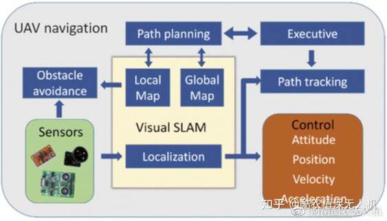
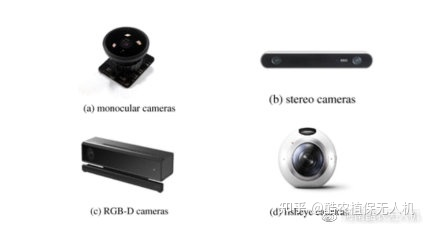
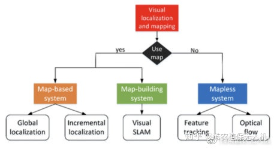

# 基于视觉的无人机导航综述

> 文章来源：[基于视觉的无人机导航综述](https://zhuanlan.zhihu.com/p/386139171)

无人机导航可以看作是机器人对如何安全、快速地到达目标位置进行规划的过程，它主要依赖于当前的环境和位置。为了顺利完成预定任务，无人机必须充分了解其状态，包括位置、导航速度、航向以及出发点和目标位置。
到目前为止，已经提出了各种导航方法，主要分为三类：惯性导航、卫星导航和基于视觉的导航。然而，这些方法都不是完美的;因此，根据无人机的具体任务，采用合适的无人机导航系统是至关重要的。
随着计算机视觉技术的飞速发展，基于视觉的导航成为自主导航的一个主要研究方向。首先，视觉传感器能够提供丰富的环境在线信息;第二，视觉传感器高度敏感抗干扰能力强，适合感知动态环境;第三，大多数视觉传感器是被动传感器，这也阻止了传感系统被检测到。基于视觉的无人机导航完整示意图如下图所示。

视觉导航使用视觉传感器。与GPS、激光闪电、超声波传感器等传统传感器相比，视觉传感器可以获取丰富的环境信息，包括颜色、纹理等视觉信息。
同时，它们更便宜、更易于部署，因此基于视觉的导航已成为研究领域的热点。如下图所示，视觉传感器通常包括以下几种：
(a) 单目相机
(b) 立体相机
(c) RGB-D 相机
(d) 鱼眼相机

上图典型的视觉传感器。(a) 单目相机，(b) 立体相机，(c) RGB-D 相机，(d) 鱼眼相机。

- 单目相机特别适用于紧凑性和最小重量至关重要的应用，此外，较低的价格和灵活的部署使其成为无人机的不错选择。然而，单目相机无法获得深度图。

- 立体相机实际上是安装在钻机上的一对相同的单目相机，这意味着它不仅提供单个相机可以提供的所有功能，而且还提供从两个视图中受益的额外功能。最重要的是，它可以基于视差原理而不是红外传感器的帮助来估计深度图。
- RGB-D相机可以借助红外传感器同时获取深度图和可见光图像，但由于范围有限，它们通常用于室内环境。
- 鱼眼相机是单目相机的一种变体，它提供宽视角，对于复杂环境中的避障很有吸引力。

视觉定位与制图
考虑到导航、视觉定位和地图系统中使用的环境和先验信息，可以大致分为三类：无地图系统、基于地图的系统和地图构建系统。

无地图系统在没有已知地图的情况下执行导航，而无人机仅通过提取已观察到的环境中的不同特征来导航。目前，无地图系统中最常用的方法是光流方法和特征跟踪方法。
基于地图的系统在地图中预先定义环境的空间布局，使无人机具有绕行行为和运动规划能力进行导航。通常，有两种类型的地图：八叉树地图和占用网格地图。不同类型的地图可能包含不同程度的细节，从完整环境的 3D 模型到环境元素的互连。
有时，由于环境限制，很难使用预先存在的准确环境地图进行导航。而且，在一些紧急情况下(如救灾)，事先获得目标区域的地图是不切实际的。因此在这种情况下，在飞行的同时构建地图将是一个更具吸引力和效率的解决方案。地图构建系统已广泛应用于自主和半自主领域，并且随着视觉同步定位和建图(visual SLAM)技术的快速发展而变得越来越流行。

障碍物检测与避障
避障是自主导航不可或缺的模块，因为它可以检测并提供附近障碍物的基本信息，减少碰撞风险以及飞行员的操作错误。因此，它可以大大增加无人机的自主性。
避障的方法主要有两种：基于光流的方法和基于SLAM的方法。基于光流，它能够生成局部信息流并获得图像的深度。这种方法模拟了人眼的机制，即视场中的物体随着您的距离越来越近而变大。基于这个原理，它可以通过比较连续图像来检测障碍物，并找出障碍物是否越来越近。
然而，基于光流的方法无法获得精确的距离，这可能会限制在某些特定任务中的使用。相比之下，基于 SLAM 的方法可以通过复杂的 SLAM 算法提供精确的度量地图，因此无人机可以导航和避开具有更多环境信息的障碍物。
路径规划
路径规划是无人机导航中的一项重要任务，它是指根据一些性能指标(如最低工作成本、最短飞行时间、最短飞行路线)寻找从起点到目标点的最佳路径。而在这个过程中，无人机需要避开障碍物。根据用于计算最优路径的环境信息类型，该问题可以分为两类：全局路径规划和局部路径规划。两种路径规划方法的说明如下图所示。

全局路径规划器需要构建地图内的起始位置和目标位置来计算初始路径，因此全局地图也称为静态地图。全局路径规划常用的算法包括启发式搜索方法和一系列智能算法。
局部路径规划基于局部环境信息和无人机自身的状态估计，旨在动态规划局部路径而不发生碰撞。由于动态环境中物体的运动等不确定因素，动态环境中的路径规划成为一个高度复杂的问题。在这种情况下，路径规划算法需要适应环境的动态特性，通过各种传感器获取环境未知部分的信息(如大小、形状和位置)。
尽管无人机与地面移动机器人共享类似的导航解决方案，但在涉及基于视觉的无人机导航时，我们仍然面临许多挑战。无人机需要实时处理大量传感器信息才能安全稳定飞行，尤其是图像处理，大大增加了计算复杂度。因此，在低功耗和有限计算资源的约束下导航成为无人机的一大挑战。