# 无人机 20 种运镜｜教你打杆技巧

> 笔记来源：bilibili 视频 [无人机 20 种运镜｜教你打杆技巧](https://www.bilibili.com/video/BV1YY4y1w7wQ/?spm_id_from=333.337.search-card.all.click&vd_source=033cc0cb90262a8954da54444ec97bda)

今天这个视频我们要说的是无人机的航拍运镜，这里示范 20 种实用的航拍运镜操作方法，前面 10 种操作比较单一相对简单，或者说最多仅涉及 2 种方向的控制；后 10 种是多方向组合的进阶操作，为了简明的向大家解释，我也会示范每一个运镜在遥控器上是如何操作的，也即你们常说的如何 "打杆"。

每个运镜的解释，我会讲解一些个人的使用方法或小技巧来达到运镜的最好效果。

开始讲解每一个运镜之前需要强调的就是无人机的飞行高度、速度，还有拍摄主体的距离，再加上你的相机的角度、构图等等，都是一个能产生不一样效果的一个变数。

所以今天要介绍的这些运镜只是一个单纯的带大家去认识不同种类的运镜而已的，那么你只要自己多加练习一些，再加上刚才说的所有因素加起来最后出来的可能性是千变万化的，好吧，我们直接开始。

## ▲ 1. 向前推进

第一个运镜：第一个很简单，就是向前推进，向前推进主要是靠右手的遥感向前推进，其实就可以了。

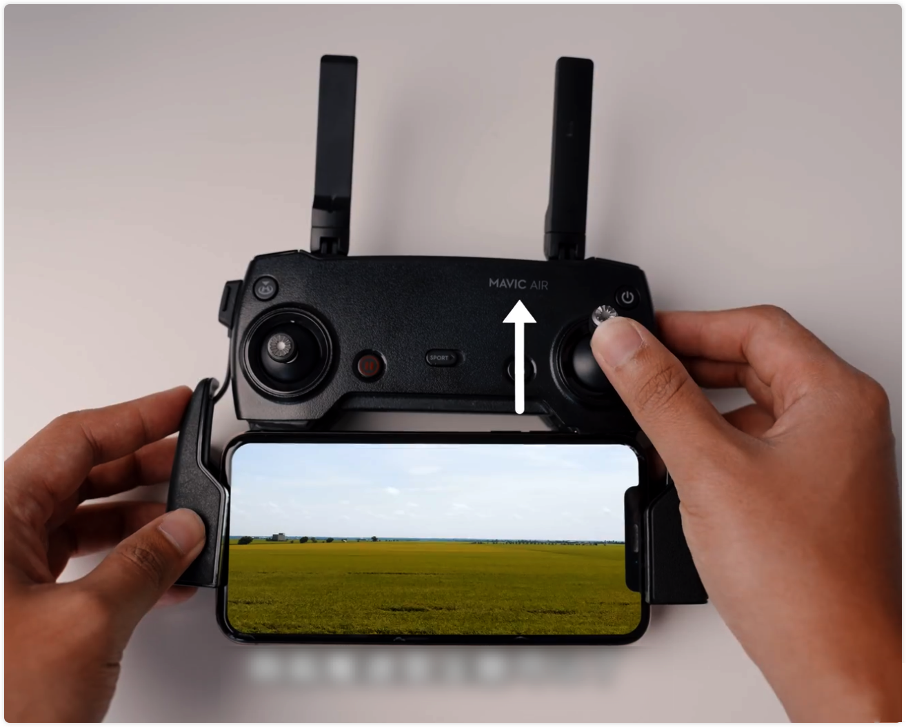

向前推进有一点需要注意的就是为了要让整个画面看起来有向前推进的感觉，我们尽量是保持让我们的画面里面是有前景的，或是另外一种说法就是高度不能太高，尽量让画面里充满更多的物体，作为我们眼镜的参考点，这样子我们的画面才会有这种向前推进的感觉。

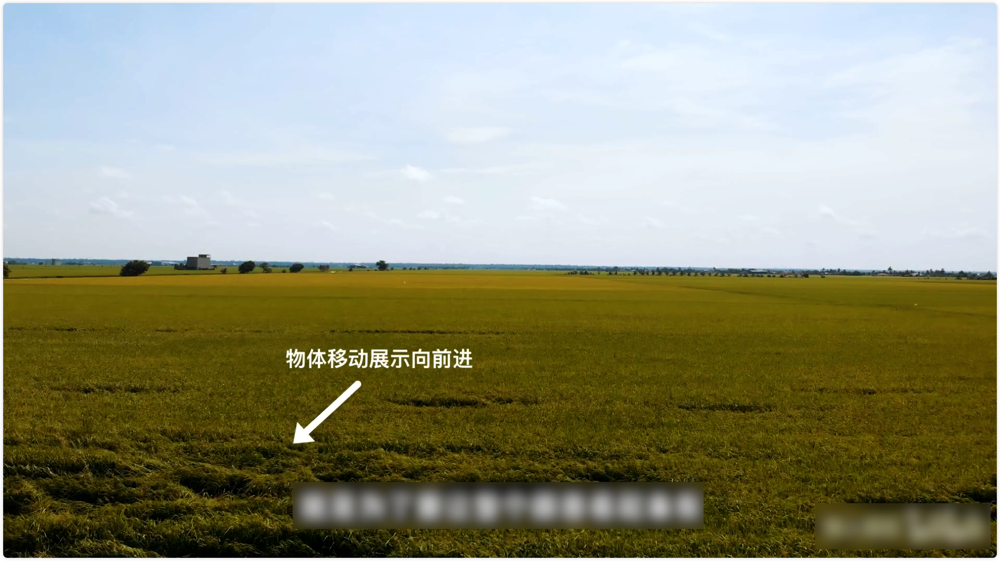

当然如果你要飞得很高也是可以的，你只要向前推进的时候，我们需要飞更久，让距离可以推进的更久一些，在剪辑的时候我们加速我们的整个素材就会有这一种推进的这种效果了。

## ▲ 2. 向后退

第二个：后退运镜，后退的动作很简单，后拉右摇杆就行了。

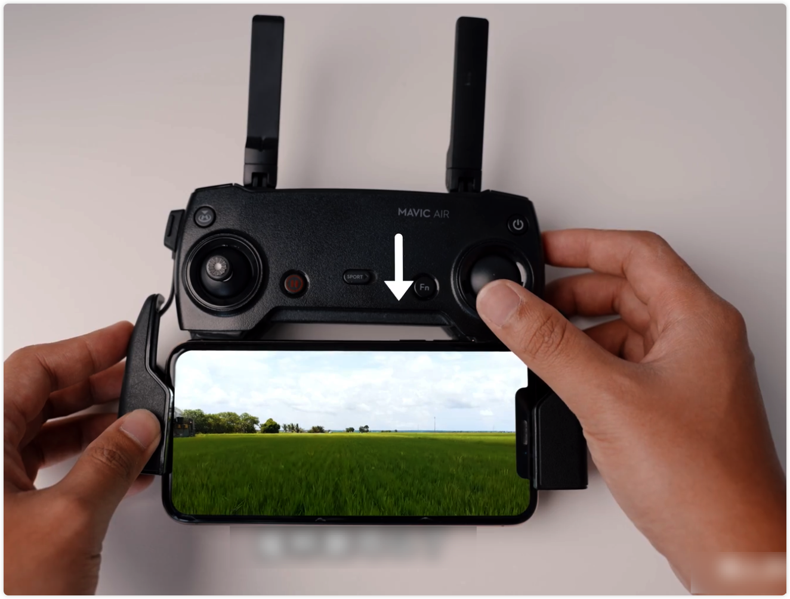

跟前进不一样的是后退的风险其实是比较大的，因为我们的视线不在后面，我们的镜头只是对着前面，当然无人机后面是有防撞的传感器的，但是我个人是不会完全相信传感器的，基本上我是从来都没有相信过传感器的，我建议是大家都还是需要用肉眼去注意周围的环境，不然我们先让无人机 360 度旋转，注意我们周遭的障碍物，观察一下周围的环境之后才来放心大胆的向后退，接下来你也有可能的会问我说既然后退有风险，那么我向前推进，然后在剪接的时候再把我们这个视频倒转回放就可以了，其实这样做也是可以的，但是某些情况比如说画面里如果有车子前进的话，那么就很明显的看出车子是在向反方向向后退的，所以这样子就会呈现破绽，所以我觉得实时的录制后退的画面其实是有必要的。

## ▲ 3. 左右移动

左右移动是很简单的，就是把我们的摇杆向右或者向左推进就可以了，

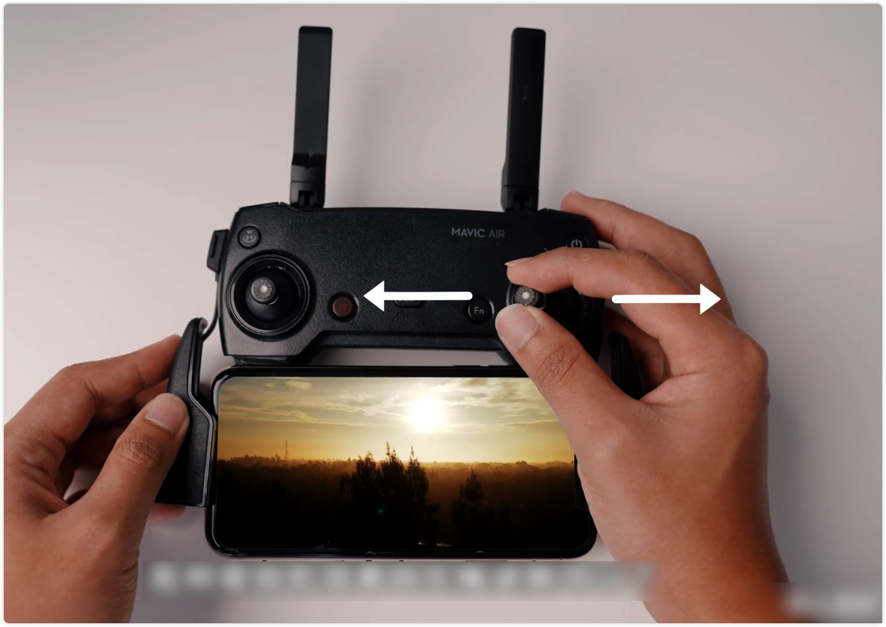

那么左右的移动，因为我觉得最关键的就是一定要用我们的肉眼去观察周围的环境，尤其是我用的这一款 DJI Mavic Air 左右两侧是没有防撞传感器的，所以就需要非常小心。这个运镜是非常适合跟踪你的主体去拍摄的，比如说要跟踪车子，或者人在跑步等等。

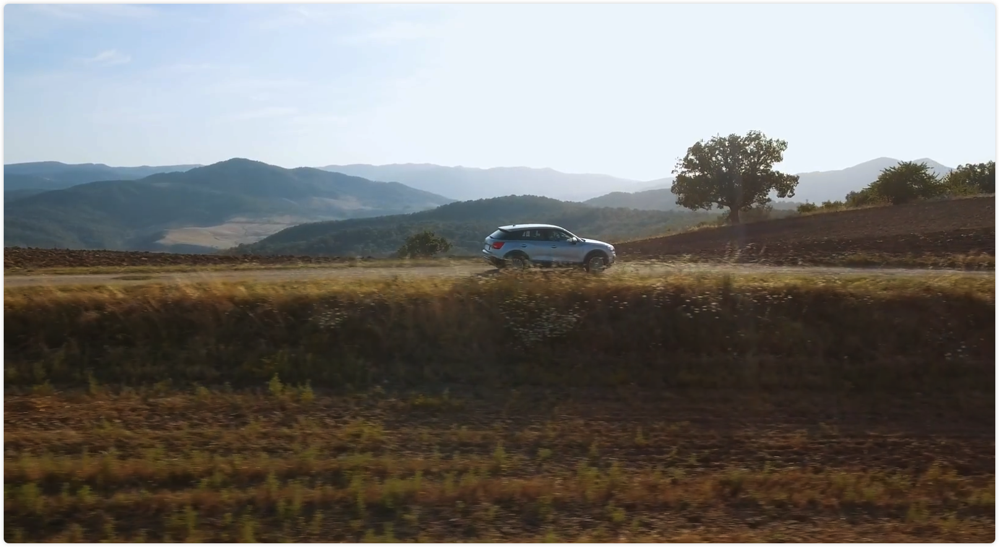 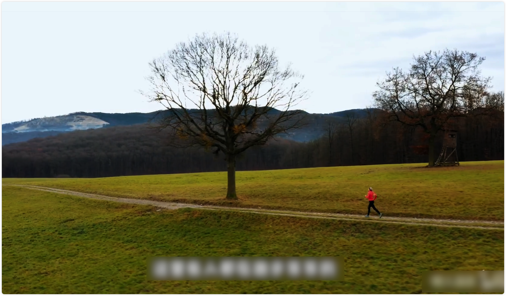

## ▲ 4. 升起/降落

第四个运镜：就是上升或者降落了，上升降落的其实就是左摇杆的推上或者拉下就可以了，

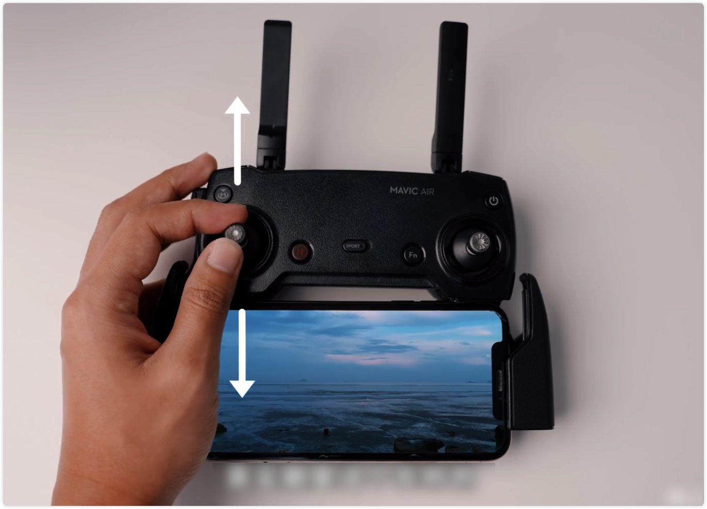

上升降落要好看，最重要的还是和 (1)向前推进 一样要有前景，尤其是上升的时候，如果有前景来带动你的画面，会加强上升的画面感，这个运镜非常适合作为揭晓一个开场的画面。

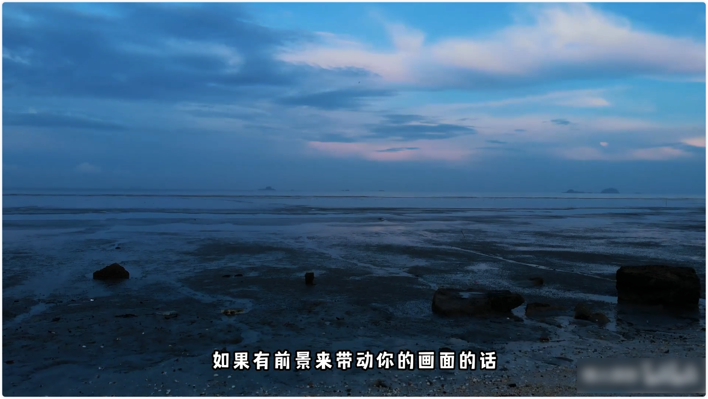

## ▲ 5. 前进升起降落/后退升起降落

第五个：就是前进时升起或降落，不然就是后退时升起或降落的。操作方法也是很简单，

- (1) 前进时升起/降落：右杆推进的同时左杆向前推，即让无人机升起；右杆推进的同时左杆拉下来，即前进的同时无人机是降落的。
- (2) 后退时升起/降落：右杆后拉的同时左杆向前推，即让无人机升起；右杆后拉的同时左杆拉下来，即后退的同时无人机是降落的。

这两种运镜非常适合作为开场画面的，尤其是配合我们后期剪接的时候，开场的效果有一些快进的话是很适合的。

## ▲ 6. 上帝视觉

第六个运镜就是上帝视觉的升起或者降落，这个很简单，把飞行器的一体式云台相机镜头和地面垂直，然后操作左摇杆上升或降落。

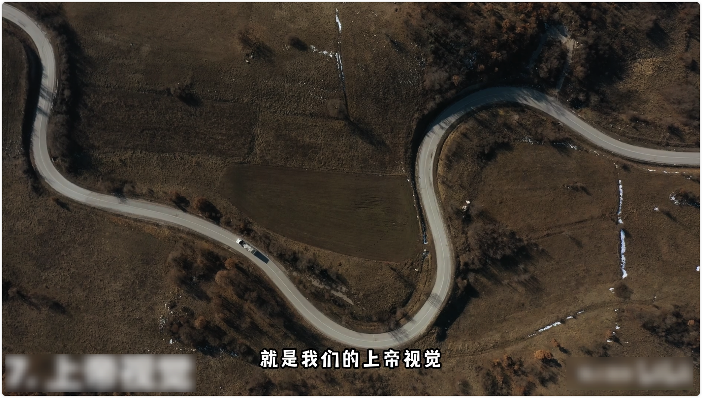

基本上运镜是比较容易执行的，主要还是看你的构图没问题了，你先把你的画面调整好了，直接就可以进行了。

## ▲ 7. 俯瞰（上帝视角）前进后退

第七个运镜就是我们的上帝视觉，再加上前进还有后退，上帝视觉也是很容易去执行的，跟 6 一样，把一体式云台相机的镜头和地面垂直，然后 向前推/向后拉 右摇杆就可以了。

## ▲ 8. 前进同时镜头摇下/摇上

第八个运镜：向前进的同时镜头摇上或摇下，第八个运镜就开始需要用到至少两个方向一起去控制了，那就是当你在前进的时候，就是你的右杆向前推的的时候，拨动云台俯仰控制拨轮，让镜头慢慢的朝上/朝下。

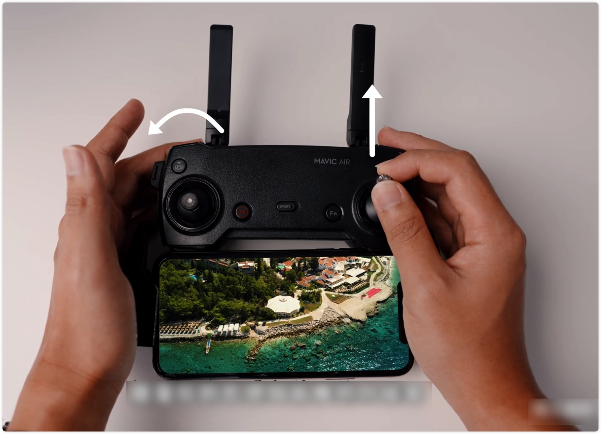

## ▲ 9. 后退同时镜头摇上/摇下

第九个就是我们的后退的同时，镜头是抬起或者朝下的，一样的这个右摇杆向后拉，然后镜头可以是慢慢的摇下去或者慢慢的抬起来，那么镜头也可以是先朝下，然后慢慢的摇起来，这是我比较建议的一种运用方法了。我们在后退的时候，镜头本来是朝下的，让我们慢慢的把它摇上来，就非常适合拍摄一个主体越来越远的感觉了。

## ▲ 10. 旋绕围绕

第十个眼镜是我个个人非常喜欢，而且我是觉得大多数人都是已经是非常熟悉的运镜了，那就是我们让我们的无人机环绕旋转的就是做一个半圆圈的运镜，这个是最常用的一个运镜了：

- 当我们的右杆向右推的同时，左杆要向反方向就是我们的左边推，这样子就会有这种向右旋转的效果了。

  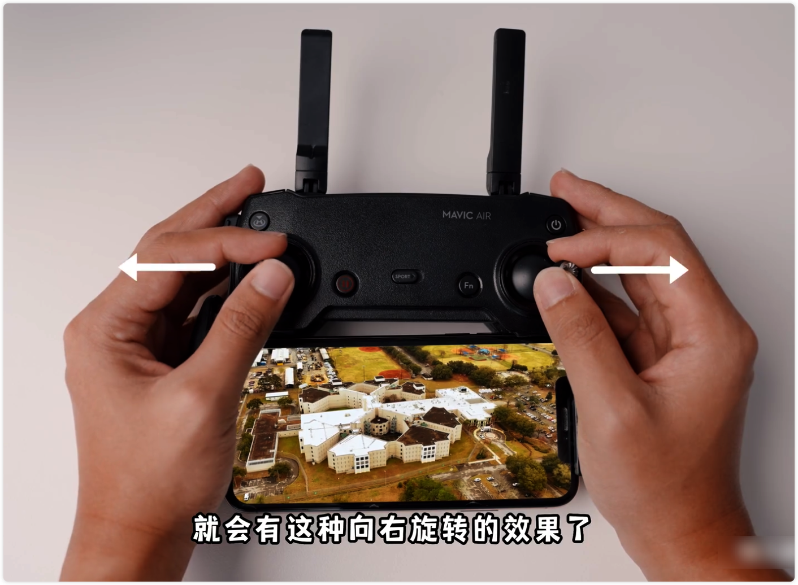

- 那么要向左旋转，只要反方向的去进行就可以了。

  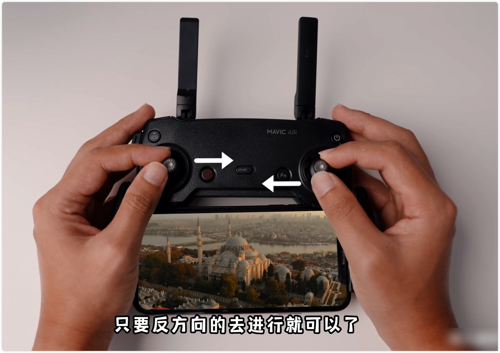

运镜最大优点就是整个动作看起来是非常的优雅的，同时操作起来也不会太难，主要是你要配合左右杆的这一个时间点的控制力道，强烈推荐，各位新手们一定要去掌握这一个技巧，这是非常实用的运镜。

## ▲ 11. 向前上升或降落 + 镜头摇下

接下来第十一个运镜就是开始我们需要操作三个不同的方向去进行的，那就是向前推进的，同时我们的镜头让它摇下去，同时间我们的无人机是上升或者降落的，打杆的方式就是我们的摇杆向前推进的同时，左杆可以是向上升起或者向下降落都可以，然后镜头慢慢的向下摇就可以了，运镜是非常有代入感，而且能吸引观众的注意力在我们想要的地方。

## ▲ 12. 后退上升或降落 + 镜头摇上
第十二个运镜跟刚才有点相反的，就是我们在无人机后退的时候，镜头摇上来的同时，我们无人机也是处于一种升起或者降落的状态的，这一次打杆方式我们是要向后退，然后上升或者是降落的同时，我们镜头可以是摇上来。

## ▲ 13. 上帝视觉旋转升降
第第十三个就是回到我们刚才有学过上帝视觉，就是让我们的镜头完全朝下的，同时我们的无人机是处于一种升起或者降落的这种旋转状态的，打杆方式，很简单的一我们先让我们的镜头完全朝向，然后左杆向上推的同时或者向下拉的同时，稍微的向左边或者右边推过去，这样子我们可以制造这种一边向上或者一边向下的旋转效果了。

## ▲ 14. 上升 + 镜头摇下
接下来第十四个引擎无人机升起的同时，镜头慢慢的摇下去的，这一个运镜其实主要是需要有一个主体在你这个画面里面，打杆方式其实就是我们的左杆向上的同时镜头慢慢的摇下去，那么这一个运镜的诀窍就是我们主要要让我们的主体一直保持在我们的画面中间，那就是非常好看的这种效果了。

## ▲ 15. 下降 + 镜头摇上
好，第十五个就是跟刚才第十四个是相反的，这时候我们是一边降落的，同时我们是把我们的镜头慢慢的摇上来的。

## ▲ 16. 旋转 + 镜头摇上或摇下 
好，接下来第十六个就是我们旋转的同时，镜头可以是摇上或者摇下的，这个阴茎是需要同时控制三个不同的个操作的，而且精准度是比较需要多加练习去加强的。

## ▲ 17. 旋转 + 上升或降落
接下来这一个运镜就是我们在旋转的同时，我们让我们无人机处于一种上升或者是降落的状态的这一个运镜，我们是不需要去调整我们镜头的，我们只需要专注在我们的左杆，主要是在我们的左杆这里在上升或者降落的同时，我们需要拉去 45 度来让它有一种旋转的同时在降落或者升起的。

## ▲ 18. 旋转 + 上升或降落 + 镜头上下
好，接下来第十八个运镜就是非常复杂的多了，因为我们要做的就是旋转的同时，镜头也要摇起来或者摇下去的。打杆的方式其实就是这个左右的旋转的打杆方式的，同时，我们需要让我们的无人机左杆这里向上升起，或者向下降落的，然后再加上我们的镜头的摇上或者摇下无可否认的这一个印记是比刚才所有的印记是非常的更加的复杂的。

那么这类型比较复杂的运境，我是建议你们需要非常熟悉当地的地形或者周围的这种障碍物，才去执行这种非常复杂的运境的。

当然了你也需要了解到底有没有需要或有没有必要去进行这么复杂的运镜来达到你的画面的效果，你也可以先问问自己是不是有其他更简单的有效的方式去说出你要说的故事，那么我建议是如果有其他更简单的这种运镜，我觉得是不必要去执行这么复杂的运镜的。

## ▲ 19. 上帝视觉 + 旋转追踪
接下来最后第二个就是第十九个运镜，就是我们的上帝视觉的同时，我们要旋转前进，然后旋转前进 180 度之后，我们的无人机还是保持顺畅的向同一个方向前进的。那么首先我们需要直接把我们的镜头摇下去，右杆向前推，同时我们的左杆慢慢的旋转，同一时间我们右杆我们需要配合我们左管旋转的角度方向改变，慢慢转成这种向后拉的这种角度的，这样子，我们在拍摄的时候才能保持这种旋转后继续跟踪我们的主体的这种效果。

## ▲ 20. 上帝视觉 + 后退 + 降落 + 镜头摇上
最后一个一样的我们是上帝视觉的，让我们的镜头摇下朝下的，然后让我们的无人机在后退的同时降落或者是可以升起，然后让我们的镜头慢慢的咬上来，这一个运镜我个人认为是非常适合有车或者一些向前移动的物体在你画面里，然后公路上或者一些比较价位地区需要做一个车的广告的结尾就非常适合这种运镜的。

好了，今天的教学就到此为止，无人机运镜和打杆方式千变万化，我不敢说我已经概括了所有的打杆方式或者一些运镜的，但是我相信这个视频绝对包括了所有适用于普通雨拍或者一些新手入门想要学习的一些技巧的，那么个人拍摄需求，我觉得基本上是可以满足大多数的拍摄的。至于广告类型的这种大型拍摄的运镜进阶版技巧，我觉得等下一次我自己升级了我自己的技术了之后，可以再和大家分享更高超的技巧的。

记得关注我，因为接下来我还会分享更多关于摄影与简介的视频的，我们下次见。
