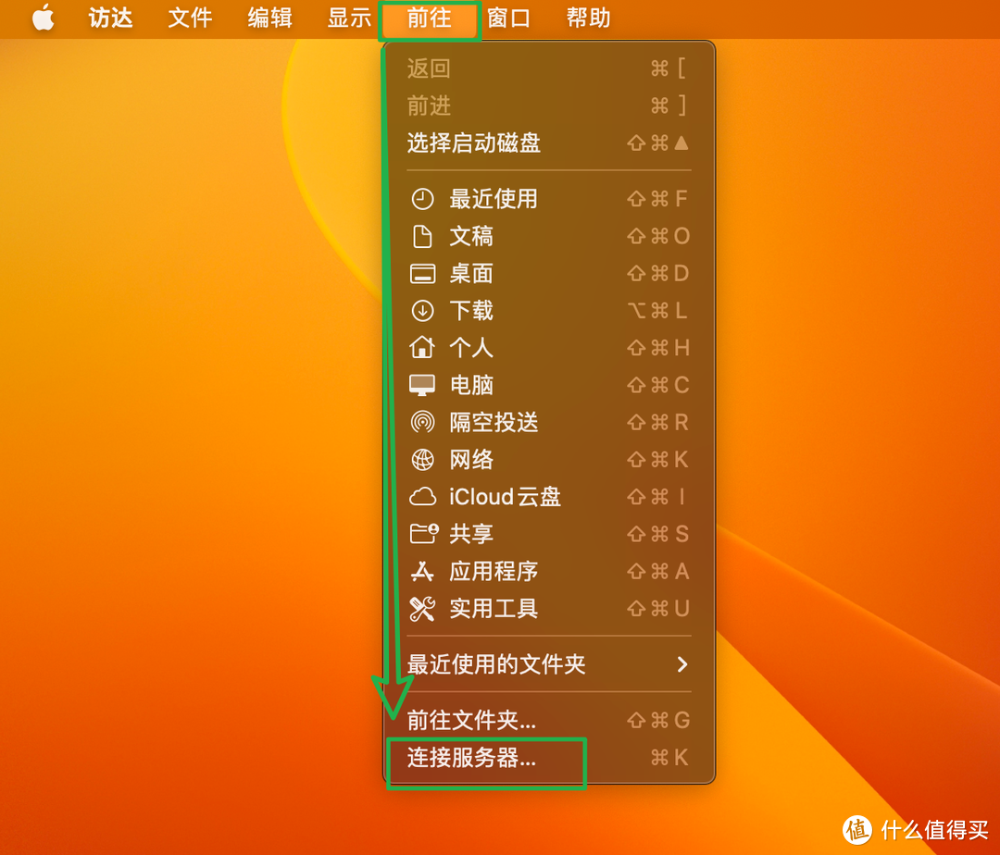
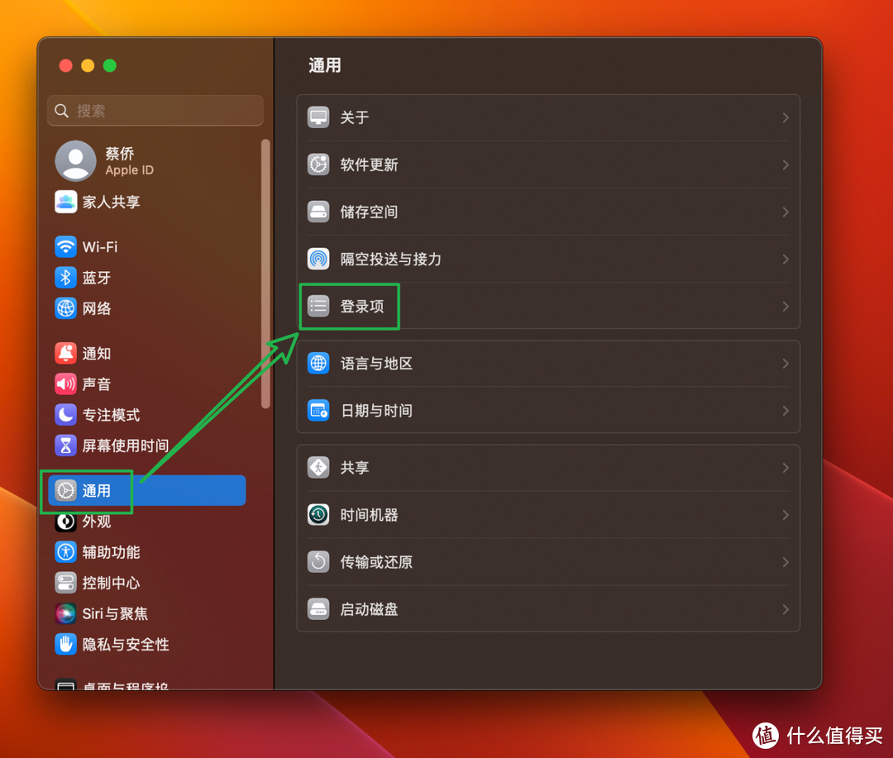
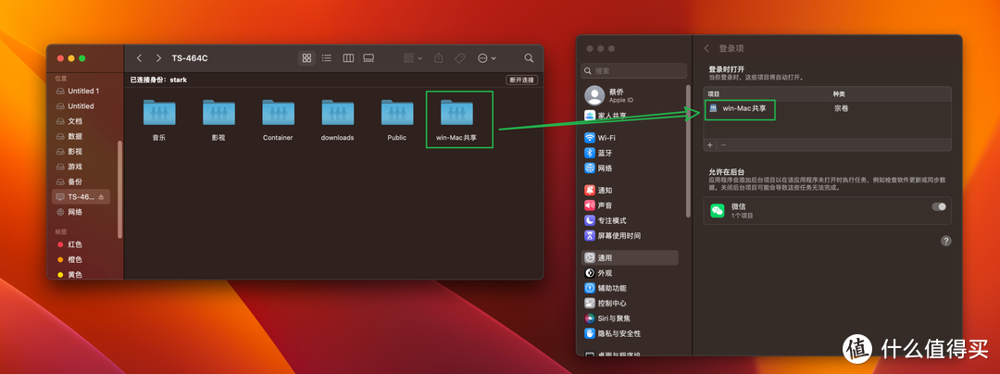

# NAS

网络附加存储 (Network Attached Storage, 缩写：NAS)

## ▲ 威联通 NAS

### 我的威联通NAS之旅 篇五：在NAS上实现Windows/mac OS双系统自动挂载与文件共享

> 笔记来源：https://post.smzdm.com/p/a2006xr7/

#### Mac OS 端设置

打开 "访达"，点击顶部的 "前往" 选项卡，在打开的下拉弹框中点击 "连接服务器"，

然后输入 `smb://192.168.254.199`  或者 `afp://192.168.254.199` 然后点击 "连接"。

PS：其实这里不用afp连接也可以，主要是前面我们在NAS中启用了苹果网络。这里你也可以直接用所有NAS都支持的smb连接也是一样可以的。主要是因为我会在后期会通过苹果的时间机器将一些资料备份到NAS上面，而目前这个操作仅限于afp连接协议。

在这里输入NAS 的用户名和密码，勾选下方的“记住此密码”，点击 "连接"。

这里现在挂载好了，等Mac重启的时候就没有了，需要重新挂载，怎么实现和Windows上一样，重启之后还会显示，就像本地硬盘一样呢？这里还需要以下两个步骤。

打开 `设置 — 通用 — 登录项`

然后打开 "访达"，在里面找到我们挂载的 NAS 上的共享文件夹，然后直接将该文件夹拖到我们上一步打开的 "登录项" 里面的 "项目" 下面，就 OK 了。以后直接在 "访达" 里面就能直接访问并读取 NAS 上的该共享文件夹了。

