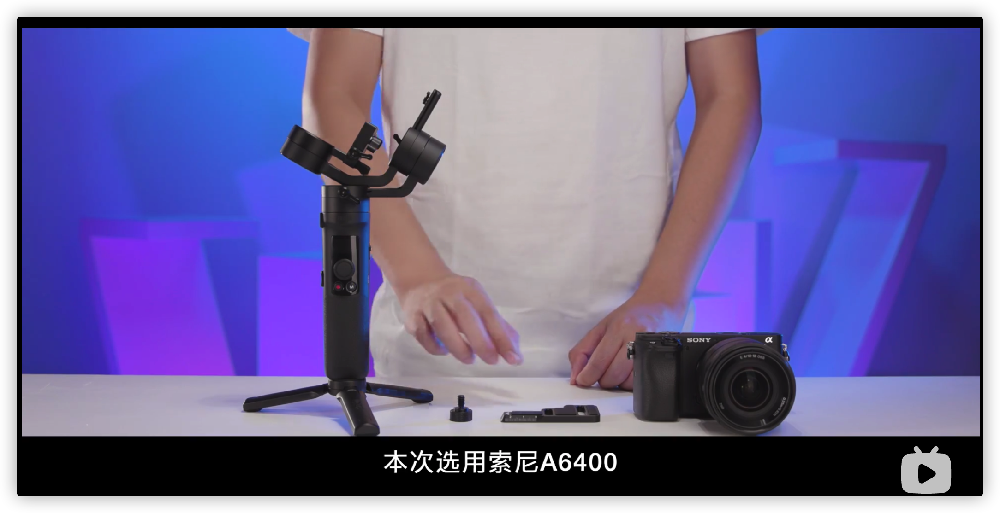
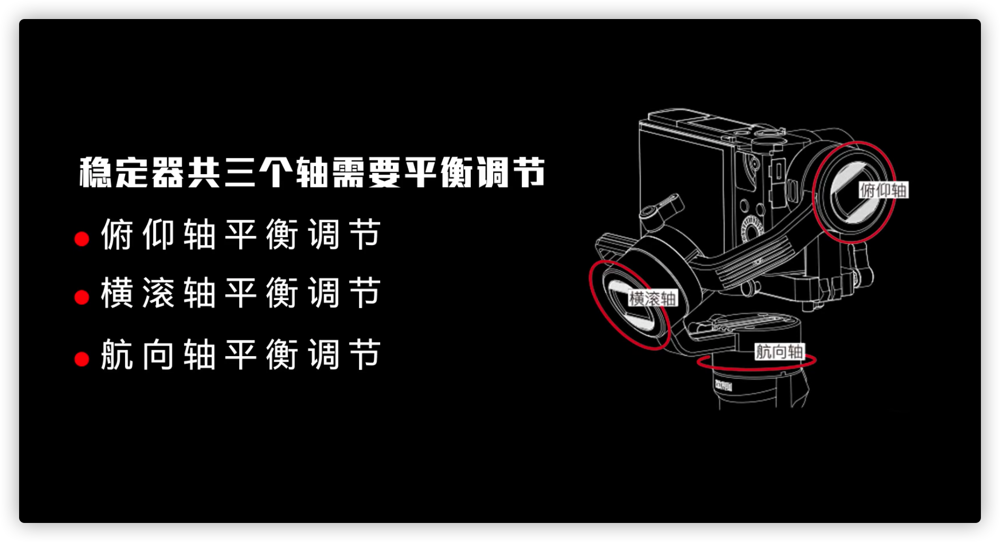
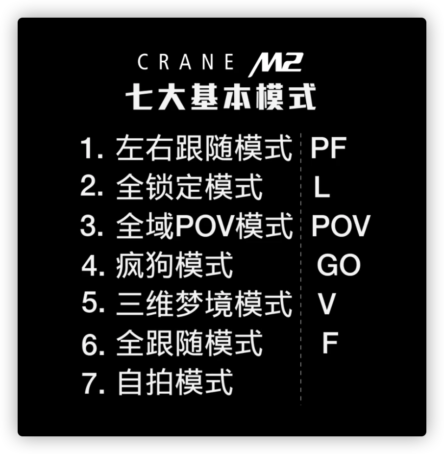

# 智云 CRANE M2 稳定器

> 智云 云鹤 M2 SONY调平教程: https://www.bilibili.com/video/BV1Ht411T7an?from=search&seid=15098040179436754938&spm_id_from=333.337.0.0


## 生词

### crane `/kreɪn/`
```css
├── noun
│   ├── (1) 起重机, 吊车.(a large tall machine used by builds for lifting heavy things)
│   ├── (2) 鹤 (a tall water bird with very long legs)
│
├── verb[intransitive, transitive always + adverb/preposition]
│   ├── 伸长(脖子)看; 探头看; 倾身看
│   │   ├── The children craned forward to see what was happening.
│   │   │   孩子们探头向前看发生了什么事.
│   │   ├── He craned his neck above the crowd to get a better view.
│   │   │   他伸长脖子﹐把头探出人群﹐想看得更清楚些.
|
```


## 隐定器共三个轴需要平衡调节

调节方式是先把三脚架安装在手柄上, 有稳定的支撑点





- **俯仰轴**平衡调节
- **横滚轴**平衡调节
- **航向轴**平衡调节




## M2 手机调平详细教程

> https://www.bilibili.com/video/BV1hJ411p7jj?from=search&seid=12567772360289573345&spm_id_from=333.337.0.0

