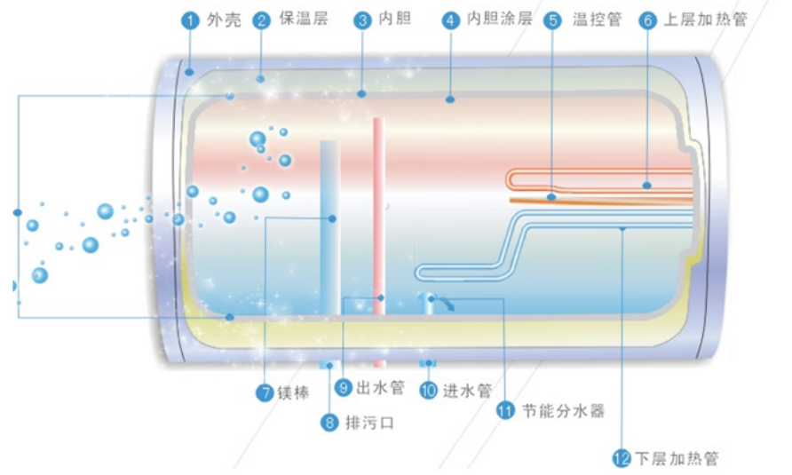
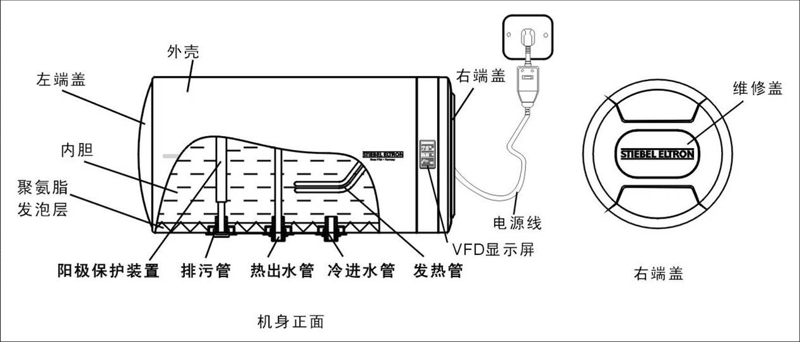
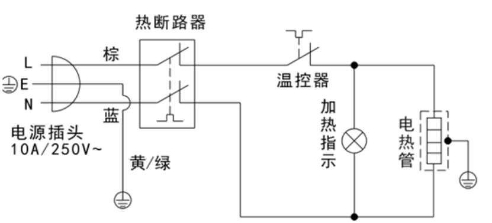
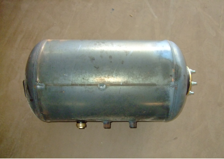
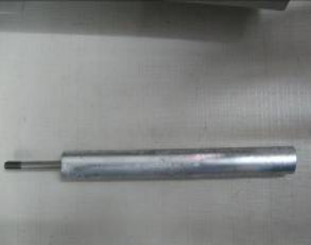
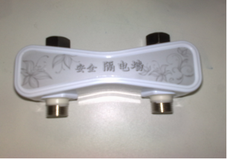
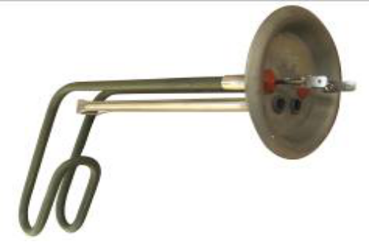
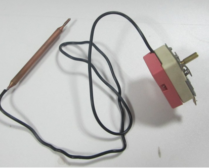
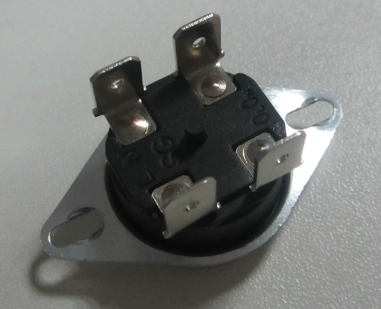
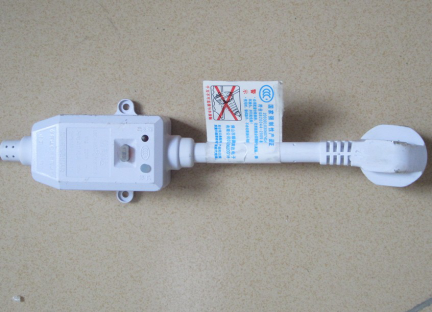

# # 电热水器的构造和原理

- > 文章来源: [搞生活](http://luheng.online/categories/搞生活/)

## ## 文章目录
1. 电热水器结构简图
2. 电热水器工作原理
    + 2.1 水路部分
    + 2.2 电路部分 
3. 电热水器零件介绍
    + 3.1 内胆
    + 3.2 镁棒
        - 3.2.1 镁棒的工作原理
    + 3.3 防电墙
    + 3.4 加热管
    + 3.5 控温器
    + 3.6 超温保护器（热断路器）
    + 3.7 漏电保护插头开关
4. 写在最后的话

## ## 内容

### 1. 电热水器结构简图
先看看外表的示意图

电热水器都是怎么工作的呢？

### 2. 电热水器工作原理
#### 2.1 水路部分
储水式电热水器贮满水通电后，电热水器内的电热管将电热水器内胆内的水加热，当加热到所设定的温度时电路自动断开，电热管停止加热，整机处于保温状态。当内胆内水温降低到某一温度时，电热管再次通电加热,这种状态循环往复，以便电热水器始终有热水可用。
**结构主要分为电路和水路两部分：**

#### 2.2 电路部分 
电热水器从第一次使用之后就是充满水了，之后进水通过安全阀单向（只能进水，不能出水）进入水箱内胆，下方进水口靠近水箱底部，其进水口上方有一挡板，使进入的冷水存在底部，防止冷水冲入上部影响热水水温，出水口在内胆上部，热水比冷水轻，在水的上部分，热水出水口也在此处，所以出水总是热的，要使热水流出，必须进入冷水，增加内胆内水压，热水才能被挤流出。关闭进水口，即使内胆存满热水也不会流出。流出的高温热水，通过调节混水阀，使之出水温度适合使用要求。热水能出来靠的是冷水进去时带来的水压，所以停水的时候即便内胆里充满水，里面的水也出不来，因为热水出水口在内胆上部。那冷水呢，停水了…(混水阀里的热水来自热水器，冷水是直接自来水管道的)。

电路的主要作用是对冷水加热至设定温度。
电热水器的加热通过电热管来进行，温度的设定则通过调节温控器进行，电热水器将电能转换成热能，传给被加热的媒体（水），水达到预定温度时，温控器会自动断电，停止加热。一段时间后，当水温比设定温度下降5℃左右时，温控器会重新工作，继续恢复加热至设定温度，如此反复工作。
原理图:

### 3. 电热水器零件介绍
#### 3.1 内胆
内胆作为热水器的主要储水工具，它必须具备保温、耐压、不生锈、无水垢、不渗水的特性。决定一款热水器好坏的重要因素之一就是热水器的内胆，内胆的好坏直接决定了热水器的使用寿命，而且内胆一旦破损，那么热水器将很难修复，甚至直接报废，虽然热水器的品牌很多，内胆名称也五花八门，什么“金圭内胆”、“高釉包钢内胆”、“钛金内胆”、“不锈钢内胆”、“搪瓷内胆”、“钢制瓷釉内胆”、“金瓷内胆”等等，但实际上市面上常见的热水器内胆主要有不锈钢内胆和搪瓷内胆2种，所谓的钛金内胆、金圭内胆、石英瓷釉、蓝宝石等等，不过是在这两种主材外面镀上或加上稀有金属，换了个叫法而已。

| 类型       |         突出优点         |                     缺点 |
| :--------- | :----------------------: | -----------------------: |
| 不锈钢内胆 |       价格相对低廉       |           焊缝易损易漏水 |
| 晶硅内胆   | 强度高、不易生锈、寿命长 |                          |
| 搪瓷内胆   |      不生锈、无水垢      | 易溶解、易腐蚀、易鱼鳞爆 |
| 钛金内胆   |      强度好、寿命长      |                          |
| 金圭内胆   |  抗腐蚀、抗冲击、寿命长  |                        . |

#### 3.2 镁棒
镁棒主要作用在于保护电热棒，电加热棒在加热时容易与水里面的矿物质发生反应，从而减少加热棒的使用寿命。

##### 3.2.1 镁棒的工作原理
利用的是阴极保护法，由于镁的活性大于加热棒的铁或铜，因此通过镁棒的作用，使水里面的矿物质先与镁棒反应。镁是电化学序列中电位较低的金属，生理上无毒。因此，用来制成镁棒保护内胆非常理想。镁棒的大小直接关系到保护内胆时间的长短和保护效果的大小，镁棒越大，保护效果越好，保护时间越长。

#### 3.3 防电墙
利用了水本身所具有的电阻（国标规定自来水在15℃时电阻率应大于1300Ω），通过对热水器内通水管材质的选择（绝缘材料），管径和距离的确定形成“隔电墙”。当电热水器通电工作时，加热内胆的水即使有电，也会在通过“隔电墙”时被水本身的电阻衰减掉而达到将电隔离的目的，使热水器进出水两端达到几乎为零的电压和0.02mA/kw以下的极微弱电流。

#### 3.4 加热管
电能→热能转化装置，主要用它来对水进行加热（类似热得快），其功率为1500W-3000W，主要由发热电阻丝，铜管或不锈钢管，导热绝缘介质氧化镁和接线端子构成。当通电时，电流使发热电阻丝发热，热量通过电加热器将储在内胆的水加热，电热管由三层构成，最里面为电阻丝，中间为耐高温绝缘氧化镁粉，外层为不锈钢管（英格莱800金属管能耐受1357-1385C高温） 。电阻丝为直接发热元件，耐高温绝缘镁粉起到在高温下绝缘作用，以保证电热管的安全性。

#### 3.5 控温器
现用控温器均为液体膨胀式结构。利用液体有热胀冷缩的特性，控温器将特殊液体密封在探管和毛细管组成的密封腔中，探管插到待测温部位，当该处温度上升时探管内液体膨胀，并沿毛细管移动至末端，膨胀的液体使膜盒变型后推动触点，使电路断开，停止加热。

调节控温器旋钮，也就是调节将触点断开的位移量，而此位移量与感测的温度成特定比例。

当温度下降后，膨胀后的液体会逐渐缩小体积，触点又回复到导通状态，发热管重新开始加热，这就是控温器控制水温的原理。当内胆的温度达到设定值时，液态受热膨胀流过毛细管顶起杠杆板，金属片自然弹起，断开两极，停止加热。当水温下降到设定温度的5℃左右时，液态冷缩，杠杆板自动回弹并压下弹簧片，电路重新闭合，开始加热，实现保温功能。

#### 3.6 超温保护器（热断路器）
原理是当内胆水温达到88℃或91℃时，金属片受热变形向上弹，顶起绝缘顶杆，断开两极实现防超温保护。当双极断开需复位时，必须手动按下手动复位键，并用万用表测量两极是否相通。

#### 3.7 漏电保护插头开关
原理是利用漏电开关内部装置，当电热水器有漏电或负载电流大过额定电流时会自动跳闸，切断电源，避免事故发生。

### 4. 写在最后的话
关于电热水器的构造原理在网上查询学习后，只能说是有所了解，不敢对此再有更多的讨论，科学与生活息息相关，这次算是为洗个热水澡操碎了心吧，本章完。

关于本文：相关资料主要是从网上各个地方摘录下来的，来源不好注明出处，如有侵犯，请与我联系。
