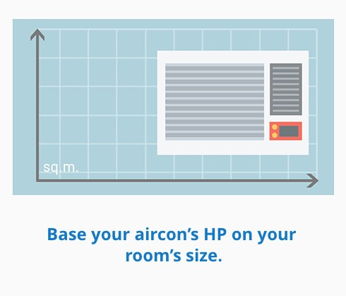

# 空调

## ▲ 制冷剂
> Wikipedia - https://zh.wikipedia.org/wiki/%E5%88%B6%E5%86%B7%E5%89%82

制冷剂，又称冷媒、致冷剂、雪种，是各种热机中借以完成能量转化的媒介物质。这些物质通常以可逆的相变（如气-液相变）来增大功率。如蒸汽引擎中的蒸汽、制冷机中的雪种等等。一般的蒸汽机在工作时，将蒸汽的热能释放出来，转化为机械能以产生原动力；而制冷机的雪种则用来将低温处的热量传动到高温处。

传统工业及生活中较常见的工作介质是部分卤代烃（尤其是氯氟烃），但现在由于它们会造成臭氧层空洞而逐渐被淘汰。其他应用较广的工作介质有氨气、二氧化硫和非卤代烃（例如甲烷）[1]。

## ▲ 空调匹数和面积

> ※ aircon (air conditioning) - abbr.空调 = air conditioner
>
> ※ HP (horsepower `/ˈhɔːrspaʊər/`) - n.马力；功率。

**TIP 01:** Match your aircon horsepower (HP) to the size of your room.

**提示 01**：将您的空调功率（HP）与房间大小相匹配。

**chatGPT:** The calculation of square meters is typically determined by length and width without considering the room's height. When we discuss air conditioners suitable for a certain area`/'ɛrɪə/` of a room, it's usually estimated`/ˈestəmət/` based on standard room height. Standard room heights typically`/ˈtɪpɪkəl/` range from 2.4 meters`/ˈmiːtər/` to 3 meters. If your room height differs from the standard, the estimation may have some deviation. Understanding the room's height is also meaningful when selecting an air conditioner because it can affect the cooling or heating effectiveness.

**chatGPT**：平方米计算通常是通过长度和宽度来确定的，而没有考虑房间的高度。当我们谈论空调适用于一定面积的房间时，通常是基于标准房间高度进行估算。标准房间高度通常在2.4米到3米之间。如果你的房间高度与标准不同，那么这个估算可能会有一定的偏差。在选择空调时，了解房间的高度也是有意义的，因为它可以影响空调的制冷或制热效果。

| **Room Size**  | **Aircon Horsepower (HP)** |
| -------------- | -------------------------- |
| 6 to 11 sq. m  | 0.5 HP                     |
| 12 to 17 sq. m | 0.75 HP                    |
| 18 to 22 sq. m | 1.0 HP                     |
| 23 to 27 sq. m | 1.5 HP                     |
| 28 to 40 sq. m | 2.0 HP                     |
| 41 to 54 sq. m | 2.5 HP                     |

### 家里房间的尺寸

| 房间 | 预估尺寸          | 长 * 宽 * 高（m） | 备注 |
| ---- | ----------------- | ----------------- | ---- |
|      |                   | 长 - 5.75m        |      |
| 客厅 | 28m^2^ ~ 31m^2^   | 宽 - 5.4m         |      |
|      |                   | 高 - 3.8m         |      |
|      |                   | 长 -              |      |
| 卧室 | 18.5m^2^ ~ 20m^2^ | 宽 -              |      |
|      |                   | 高 - 3.8m         |      |
|      |                   |                   |      |
|      |                   |                   |      |
|      |                   |                   |      |

## ▲ 制冷剂气体

> 笔记来源：https://www.figaro.co.jp/cn/knowledge/freon.html

最具代表性的制冷剂气体是氟利昂。氟利昂通常指的是碳氟化合物（碳和氟的化合物），作为冰箱和空调的制冷剂被开发出来。由于化学结构和组成的不同，氟利昂有CFC、HFC等很多种类。
除氟利昂以外的制冷气体还有氨气、CO2和丙烷等。

### 制冷剂的种类和特点

|          种类          |     制冷剂编号     |     组成     | 温室效应系数(GWP)*1 | 毒性・燃烧等级 |
| :--------------------: | :----------------: | :----------: | :-----------------: | :------------: |
|          CFC           |        R-12        |    CCl2F2    |       10,900        |       A1       |
|          R-11          |       CCl3F        |    4,750     |         A1          |                |
|         R-502          |  HCFC-22/CFC-115   |    4,520     |         A1          |                |
|          HCFC          |        R-22        |    CHClF2    |        1,810        |       A1       |
|         R-123          |      CHCl2CF3      |      77      |         B1          |                |
|          HFC           |       R-410a       |  HFC-32/125  |        2,090        |       A1       |
|         R-407c         |  HFC-32/125/134a   |    1,770     |         A1          |                |
|         R-134a         |      CH2FCF3       |    1,430     |         A1          |                |
|          R-32          |       CH2F2        |     675      |         A2L         |                |
|         R-454b         | HFC-32/HFO-1234yf  |     466      |         A2L         |                |
|         R-152a         |      CH3CHF2       |     124      |         A2          |                |
|          HFO           |      R-1234yf      |  CH2=CFCF3   |          1          |      A2L       |
| 包括HC在内的天然制冷剂 |       R-290        | C3H8（丙烷） |         10          |       A3       |
|         R-600a         | CH(CH3)3（异丁烷） |      4       |         A3          |                |
|         R-1270         |    C3H6（丙烯）    |      3       |         A3          |                |
|         R-744          |  CO2（二氧化碳）   |      1       |         A1          |                |
|         R-717          |     NH3（氨）      |      <1      |         B1          |                |

*1 : 基于IPCC第五次评估报告（2014）
