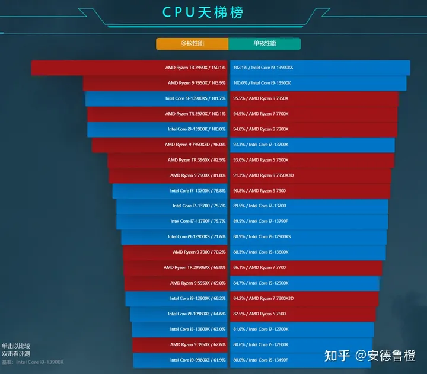

# 如何看懂电脑参数——CPU篇

> https://zhuanlan.zhihu.com/p/20495438

1,135 人赞同了该文章

2023年7月19日，看到有朋友还在点赞，于是更新了一些内容：

- 更新了一些文字内容，便于理解
- 天梯图改为超能网的天梯图，更直观并且可以搜索和对比
- 重新排了一下版

------

这篇发表在：[如何评价电脑的运行速度和显卡？ - 知乎用户的回答](http://zhihu.com/question/31444555/answer/52012567)

CPU有频率、核心、线程、缓存大小、架构、制程、功耗，接口这些主要参数，支持的指令集、虚拟技术之类的。涵盖的范围很多，内容很杂，有时候在没有一个比较完整的知识框架的时候，理解起来有点抽象。如果你只是想了解两个CPU之间的性能差异，那么天梯图是最合适的。

### 架构和IPC性能

架构、核心、线程、频率是3个是很大程度上决定了CPU性能的参数，架构就是常看到的sandy bridge/ivy bridge/haswell/broadwell/skylake 都是架构的名字。架构包含了这颗CPU最核心的架构，所以它也最直接的决定了一颗CPU的IPC性能，IPC性能可以理解为这颗CPU最最基础的计算能力，因为双核、四核相当于复制了核心，但是这个核心本身的能力是多少，IPC很关键。也IPC性能是最基础的，所以它的提升是实打实的，不需要调度优化，不需要特定条件，所以它通常也是比较难提升的。

### 命名

i3、i5、i7指的并不是一个具体产品，而是一个系列，它同样需要与代数挂钩，从命名上也能看出来，比如第一代i5通常是i5 750/i5 760，第二代是i5 2XXX，第三代i5 3XXX（第二代开始后面的数字第一位就代表第几代）而每一代都会更新架构，性能的提升也都来自于这里。而通常同一代的i3/i5/i7的架构是一样的，只是在核心数和一些其他外部参数上做了一些区分。并且因为版本的更迭，最新的i3已经比早几代的i7更强劲。所以i7并不一定比i5或者i3强，还得结合具体型号。

### 核心、线程

那同代i5和i7有什么区别呢？最大的区别其实就是核心数和线程数。早期很长时间i5都是4核心4线程（桌面版标压版本），而i7是4核心8线程（桌面版标压版本）。后来升级了，以2023年的13代为例的话，i5已经是6大核+N小核的格局，之所以小核心是N是因为不同版本数量有区别。

核心的意思就是在这个CPU里，有“几个人”，因为现在手机上有那种大小核心（高性能核心和低性能核心组合）的CPU，有一些是并不能所有核心一起工作的，所以并不是8核心就等于8个人工作，还是要看具体的架构设计。而线程的意思就是能处理任务的数量，1核心1线程就相当于一个普通的厨师，5分钟炒一盘菜，而1核心2线程，就相当于是一个熟手，他压榨一下能力，也许8分钟就能炒两个菜，但理想状态下，效率还是比不上两个普通厨师。

### 频率

CPU的主频=外频x倍频，外频是 CPU 乃至整个计算机系统的基准频率，这一点详细将起来过于复杂，可以查一些资料，新手也不是太需要不细说了。而主频的比较是建立在其他条件基本相同的情况下来讨论的，比如你手机或许2.5GHz的频率，而我笔记本2.0GHz，并不代表你手机的CPU性能比我笔记本的还好。因为核心数、缓存、架构（最主要是它）等等参数完全不一样。所以同是i5 4460和i5 4590的时候，3.3GHz相对于3.2GHz才有优势，但0.1的频率实际感受有多大了？个人意见：几乎没有。所以这种差异通常如果价差只有百八十，可以考虑，高了就不用在意了。

另外就是一定记得，只有在架构、核心数相同的情况下，去比较频率才有意义，你说你手机跑到了3.0GHz，我几十个核心的服务器CPU才2.0GHz，那是手机比这颗服务器CPU强吗？完全不是的。

### 缓存

缓存是CPU自己的“内存”，用来放暂时处理不及的东西，因为它的作用像内存对电脑的作用，但为什么CPU不用内存而用自己的缓存呢？因为内存的速度虽然很快，但依然达不到CPU的读写频率，所以CPU需要这样一个缓存来快速读写。而内存用来存放目前运行的程序所必须占用的空间。

而CPU又分为一级(L1)二级(L2)三级(L3)缓存，你通常会看到L1最小，L2次之，L3最大(很多普通CPU并没有三级，只有一二级)，成这种结构是因为，越上一级，制造难度就更大，成本更高，而且是远远高于内存条的，因为这些缓存是直接和CPU一起在同一块基板上的，简而言之：一部分晶体管被用作了CPU核心，一部分被用作了缓存。普通人不是太有必要关注这个。唯一一个值得关注的就是如今比较流行的“X3D”的CPU，都说它适合网游，就是因为它的L3缓存巨大，利于网游。

### 制程

制程也可以理解为工艺，常说的10nm，7nm都是说制程的。简单来概括，CPU就是几亿个负责开与关的晶体管，而在面积相同的一个CPU上，当然是塞进去的晶体管越多其性能越好。怎样放的更多呢？那就是降低晶体管的大小。同样数量不同大小的晶体管，更小的制程意味着更低的功耗和发热。

但是这个数字有时候是有一些“猫腻”的，业界Intel对制程的命名最为严格苛刻，台积电次之，三星的命名水分真的很大，无论是高通还是Nvidia，都吃过其制程工艺的亏。所以虽然数字接近，但也仅能作为参考。比较靠谱的数据是单位面积的晶体管数量，这也是为什么说Intel最严格，因为算其晶体管密度的话，往往更新版的大制程比别家的小制程的密度还高。但看这个问题也要辩证一点，虽然密度可以一较高下，但是毕竟功耗发热在那管着。

### 接口

我们常见的接口有LGA1200，LGA1700，AM4、AM5，Intel那边的LGA是指的封装模式，LGA指的是可拆卸的那种封装模式，即CPU本身是可更换的。BGA封装则是笔记本用的那种固定的封装。Intel的接口通常数字代表了其针角的数量。另外有一个小点提一下，就是以前的LGA775这些，针脚是在CPU上的，但后面的1150等等都是针脚在主板上，CPU是一个光面，主要是防止针脚被掰断…（CPU很多时候也确实比主板贵）

### 功耗

同样是i3、i5、i7，会被厂商分成不同的核心数量、功率级别（电压不同）做成不同的定位：桌面、游戏本、轻薄本。Intel这边更细一点，通常桌面非超频U是65W标准TDP，游戏本是45W，往下原来只有超低电压的轻薄本的U系列，15W，前两年新加入了一个P28，即28W。注意这里的TDP只是热设计功耗，它们的实际功耗并不是这么多。

另外，笔记本端，哪怕是同一代的i5、i7，其实核心数量和桌面级也不一样，所以它们只是为了品牌宣传统一，但实质上只有核心架构类似，没有其他的相同点。

### 超频

i5和i7的型号后面有结尾带K的，是指官方不锁倍频，可以在通过更改倍频来让处理器达到超频的目的。当然支持超频的也有一些特殊的，比如G3258，搭配B85超频…超频能带来一些性能上的提升，因为频率变高了嘛。但所承担的是发热、功耗的增加，在一些时候甚至可能烧坏CPU。这也是为啥能看到一些超频大赛用液氮来降温，因为散热确实很重要。

指令集——这个之前忘了写，CPU所支持的指令集，其实就是一个任务表，比如任务表里有ABCDE这5个选项，指令集发送A，那么A所对应的1、2、3、4、5步操作就由CPU来完成。而指令集越新，当然效率也越高。只是这确实不是我们平常选购时所关注的主要的点。

我们在关注CPU的时候关注的主要参数就是这些，大概明白了多少以后，其实可能你还是无法完全明白哪个好与不好，特别是跨移动平台和桌面平台的处理器。这时候你就需要“天梯图”了。

地址：

[CPU天梯榜 v2.20 - 超能网topic.expreview.com/CPU/](http://topic.expreview.com/CPU/)

看了这么多，可能你眼睛都看花了也还没明白到底购买的时候怎么选，所以我总结一下上面的内容，首先我们要知道什么东西是买CPU时最重要的东西。架构？核心？频率？我们来看一组数据对比：
A：8核心8线程，4.0GHz频率，二级缓存8MB，三级缓存8MB，32nm制程，核心代号Piledriver，125W
B：4核心8线程，3.6GHz频率，二级缓存1MB，三级缓存8MB，22nm制程，核心代号Haswell，84W
你觉得哪个CPU的性能更强呢？好吧，A就是AMD FX-8350，而B就是Intel i7 4790，实际跑分下来，B比A的分值高25%左右。而看起来4790除了功耗和制程以外其他参数看起来都比8350低啊，为什么会出现这样的情况呢？玄机就在核心代号上，Haswell的单核性能超过Piledriver很多。所以选购的时候最重要的还是核心。然后再在同核心架构的情况下，比较同系列的高端、低端的性价比。核心数真不是最重要的，别听商家告诉你这个是8核那个是4核之类之类的。其实还有更简单的比较方法，那就是看价格，市售的正规渠道CPU，基本上不会出现像E3和i7这样的同级别性能价差达到3分之一以上的情况。所以i7 4790的价格也高出FX-8350一大截。**总结：核心代号>核心/线程>频率>缓存>制程>其他**

编辑于 2023-07-19 15:41・IP 属地四川

中央处理器 (CPU)

数码

电脑硬件

赞同 113525 条评论

