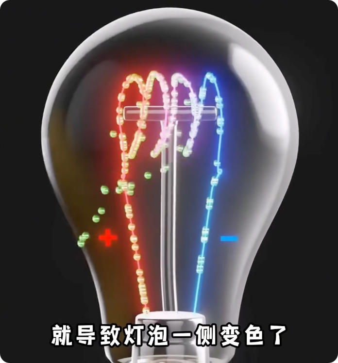

# 深度解读电脑所有硬件的工作原理

```md
Created: 2025.01.02

Edit: 2025.01.02、03

Source: https://www.bilibili.com/video/BV1cUWQevEkn/?spm_id_from=333.337.search-card.all.click&vd_source=e92153ec1930505e455be52646a78b7c

字幕：来源 Chrome 插件 哔哔君 (https://www.bibijun.cc/)(注：当天在这个插件里购买了几十块钱的 gpt-4o-mini 的 token)

字幕整理：把上面得到的字幕自己在 Typora 中分段后，发送给 chatgpt 4o, 让他帮忙整理成 markdown 排版的。排版的 prompt 见文档。

文档目录来源：评论 Up 主置顶
```


本视频耗时一年，制作共计115分钟，将为你深度解读电脑各个硬件的工作原理，其中会重点讲解的有 `晶体管、芯片制造、光刻机、CPU、主板、内存、硬盘、显卡、散热、电源、机箱、显示器、鼠标、键盘`。从微观到宏观，由简单到深入，带你一步步完全掌控自己的电脑。

## ▲ 00:00:25 晶体管原理

```md
Update: 2025.01.03

Edit: ChatGPT 4o 整理、自己观看视频编辑并添加截图
```

晶体管几乎改变了整个世界。一切以半导体为基础的元器件都离不开晶体管，而晶体管的发明最早要追溯到一个电灯泡。爱迪生在研究灯泡时发现一个问题，用过的灯泡的一侧总是会发黄。为什么会这样呢？

爱迪生通过实验发现，被加热的灯丝不仅会发光和发热，还会发出电子。这种现象被称为`热离子发射`。


由于灯泡内部是真空环境，这些漂浮的电子会自由移动，但是由于导线之间的电位差，


导致灯丝上的电子被吸引到正极的导线上。


电子加速向正极移动，随着时间的推移，大量的电子撞到灯泡的玻璃上，就导致灯泡一侧变色了。



但是爱迪生当时并不太清楚它的原理，所以没有更深入地去研究它。

1904年，英国科学家弗莱明（John Ambrose Flem）


在类似的灯泡上重新添加了一块金属片。


他发现如果金属片带正电，那么电子就可以加速来到金属片，形成一个完整的电路。


但是如果金属片带负电，那么它就会排斥电子，就不会有电子流过。这种装置也被称为`热离子二极管`。


==--- 下面还未编辑 ---==

==--- 下面还未编辑 ---==

==--- 下面还未编辑 ---==

热离子二极管最初用于将交流电转换为直流电，通过将多个二极管相连接，就能产生相当稳定的直流电。但是这种二极管有个问题，它不能放大信号。

1906年，美国科学家德弗雷斯特在弗莱明的真空二极管中加入了一个金属网状结构，充当第三个电极，也称为栅极。当电流快速流动时，栅极只需施加很小的负电压，流动的电子就会被排斥，导致电子无法到达正极。但是如果栅极施加少量的正电压，电子又会重新流向正极。所以只需要改变栅极电压的微小变化，就可以控制正极上的巨大电压，并且这种响应速度非常快。这种真空三极管不仅可以放大电压，还能控制电路的打开和关闭。

真空三极管的发明将计算机带到了一个全新的高度，并由此诞生了世界上第一台真正意义上的电子计算机，称为埃尼阿克。它于1945年首次上线。埃尼阿克不仅能进行数学计算，最重要的是它还可以编程，而且速度很快，每秒可以完成500次操作。但真空管也存在重大缺陷。它的灯丝一直需要加热，即使在空闲的时候也要消耗大量的能量，并且真空管也不可靠，每隔几天就会出现故障。另外，真空管太大了，这导致埃尼阿克计算机的尺寸非常大。埃尼阿克只使用了1万8000个真空管，但是占地面积却达到170平方米，重达30吨，而且耗电功率达到150千瓦。

如何替代真空管呢？经过科学家的不懈努力，最终诞生了革命性的电子元件，那就是晶体管，其中就包含计算机使用的 MOS 晶体管。

MOS 晶体管是如何工作的呢？制造晶体管的主要材料是硅。硅的外层有四个电子处于不稳定状态。为了保持稳定，硅原子会与其他的硅原子相结合，形成八个电子的稳定结构。为了增强硅的导电性，需要对硅进行掺杂。当往硅里面掺入拥有五个电子的磷元素时，会多出来一个可自由移动的电子，这种半导体被称为 N 型半导体。如果我们往里面掺入拥有三个电子的硼元素，当与硅结合时，会缺少一个电子，形成一个空穴。其他的电子可以移动来填充这个空穴，这种半导体被称为 P 型半导体。

现在我们分别使用磷元素和硼元素对硅进行掺杂，从而组成一个 PN 结。最开始，N 型半导体的边界会有一些自由电子流向 P 型半导体，并填充里面的空穴。这会导致 P 型半导体的边界带少量的负电，而 N 型半导体的边界则带少量的正电，从而产生内建电场。内建电场会阻止电子继续迁移，所以就会在中间形成耗尽层。

如果我们在 PN 结上像这样连上电池，PN 结的耗尽层将会进一步扩大。但是一旦我们将电池换个方向连接，这时我们再看 PN 结内部，可以发现 N 型半导体内的自由电子将克服内建电场，开始向 P 型半导体内的空穴移动。移动到空穴的电子接着又会向下一个空穴移动，就这样一直移动下去，最终就形成了电流，从而使得电路被导通。

现在我们换一种方式掺杂，分别在三个不同的位置向硅里面掺杂磷元素和硼元素，从而组成一个 NPN 结。跟前面的 PN 结会产生耗尽层一样，NPN 结也会在 P 型半导体接触的位置产生耗尽层。如果此时我们接上电池，N 型半导体的电子会被电池的正极所吸引，而空穴会远离，这会导致耗尽层的宽度进一步扩大，从而无法导通电路。

如何才能导通电路呢？现在我们使用一块绝缘体和一个金属电极放入半导体的中间，作为半导体的栅极，然后使用电路这么连接起来。这时电子就会立即流动起来。由于失去电子，栅极的金属电极会带上正电，从而产生电场。在电场的作用下，电子会向顶部位置进行流动，并填充这里的空穴，而它下面的位置既没有空穴，也没有电子，从而形成了耗尽层。这样一来，这一块的 N 型和 P 型半导体的连接就被打通了。

这时我们将连接在 N 型半导体的电池再接回去，可以看到电子开始流动，电路也就被打通了。如果这时我们将连接栅极的电池换成一个小号的，由于电流减小，这会导致形成的电场变弱，从而无法导通电路。所以说想要控制电路导通，只需要控制栅极的电压就可以了。

CPU 内部使用的晶体管就是这个原理，也被称为 MOS 晶体管。如果没有看懂没关系，我们再来简单理解一下。MOS 晶体管中间的电极为栅极，左右两边的电极分别是源极和漏极。当我们将源极通电时，电流并不能到达漏极这边。但是一旦我们将栅极通电，那么 N 型半导体之间的通道就会被打开，电流就能来到漏极了。电流导通代表一，电流未导通代表零。CPU 就是利用晶体管的这个特性来工作的。它的内部集成了上百亿个这样的晶体管，这些晶体管全部被雕刻到了一个只有指甲盖大小的芯片上。

如此高度复杂的芯片究竟是如何制造出来的呢？

这是一块石英石。将石英石捣碎后放入石英坩埚，通过高温提炼后，再放入籽晶，然后往上提拉籽晶，就能得到一根高纯度的硅锭。接着将硅锭切割成厚度只有 0.7mm 的硅晶圆。

得到硅晶圆后，接下来要做的就是对晶圆进行氧化。将晶圆每 25 张放在一起，然后放入晶圆传送盒内。传送盒会顺着导轨来到氧化设备内。在这里，晶圆会与设备内的氧气发生反应，从而在晶圆外面生成一层二氧化硅。

氧化后的晶圆接着进入涂胶工艺。将晶圆放入光刻胶涂布机，涂布机会在晶圆表面涂上一层极其均匀的光刻胶。涂完光刻胶的晶圆会进行软烘焙，用于蒸发掉光刻胶中的一部分溶剂。

之后将来到芯片制造最难的工艺——光刻。这是一台光刻机。光刻机主要由 EUV 光源、聚焦透镜、光掩模以及晶圆载体组成。我们重点来说一下光掩模。光掩模上面雕刻有电路图。它的作用就类似模板喷漆的模板。当进行光刻时，光刻机会发射极紫外光，然后通过透镜的层层反射，就会将光掩模上的电路图雕刻到晶圆的光刻胶上。

接下来需要做的就是显影。由于光刻时紫外光会照射到光刻胶上，被照射的光刻胶就会变成可溶解状态，也就是图中紫色的部分。所以当将晶圆放入显影机的显影溶液内时，可以看到紫色的可溶解光刻胶已经被清洗掉了。然后再进行硬烘焙来硬化剩余的光刻胶。那么晶圆上就剩下和电路图一样的光刻胶了。

接下来开始进行蚀刻。首先将晶圆放入蚀刻机内部。蚀刻机内会通入四氟化碳和氧气，从而形成高能等离子体。等离子体会与晶圆上没有光刻胶的地方发生反应，从而在晶圆上形成电路图。到这里，电路图才真正被雕刻到晶圆上。

由于刻蚀完的晶圆导电性很差，所以还需要对晶圆进行离子注入。使用离子注入机往晶圆表面轰击磷元素或者硼元素，磷或者硼就会掺杂到晶圆里面。但是这会导致晶格损坏，所以还需要进行退火处理来修复晶格。

离子注入后，晶圆表面的光刻胶就没用了，所以需要清除。这是一台光刻胶剥离器。剥离器使用溶剂，可以直接将晶圆上剩余的光刻胶溶解掉。

到这里，还有个最重要的问题没解决。因为我们只是将晶圆上的房子盖起来了，但是并没有修路。这会导致每座房子之间并没有连通。所以接下来需要做的就是金属化，用于连通电路。

这是一台化学气相沉积设备。它可以将金属铜沉积到晶圆表面的电路图内，从而在芯片表面形成一层金属铜膜。但是进行金属化后，晶圆表面并不平整。所以接下来晶圆会被放入设备内，进行化学机械抛光。经过一番研磨后，晶圆表面变得平滑，并且内部的金属线也暴露了出来。

但是这种芯片只有一层，而 CPU 芯片一般有大约 80 层。所以为了构建多层芯片，我们需要根据前面的每个流程，重复执行多达 940 多个步骤，从而制造出具有多层电路图的晶圆。

制造好的晶圆接下来要做的就是测试。测试人员会严格测试晶圆上的每一块 CPU 芯片，并找出每块芯片上的电路问题。根据问题的多少，工程师会对这些芯片进行分类，从而将芯片分成高端、中端和低端进行售卖。

测试完成后，晶圆会被使用激光进行分割，从而切成 200 多个小芯片。小芯片接下来会进行封装。芯片会被安装到一个印刷电路板上，背面会加上一个散热保护盖，然后外面再加上一个大的保护壳。最后再进行一次测试。测试没问题后，CPU 就能安装到电脑中进行使用了。


## ▲ 00:06:50 芯片制造

## ▲ 00:10:51 CPU计算原理
## ▲ 00:19:11 CPU设计
## ▲ 00:27:26 主板构造
## ▲ 00:30:31 主板制造
## ▲ 00:35:34 内存 锁存器原理
## ▲ 00:43:44 内存设计
## ▲ 00:49:22 内存工作原理
## ▲ 00:54:44 机械硬盘原理
## ▲ 00:59:14 固态硬盘原理
## ▲ 01:09:13 独立显卡原理
## ▲ 01:14:58 显卡光线追踪
## ▲ 01:22:40 独立显卡与AI
## ▲ 01:29:15 CPU与GPU的区别
## ▲ 01:33:18 电源结构简介
## ▲ 01:34:25 散热器
## ▲ 01:35:16 机箱
## ▲ 01:35:38 显示器原理
## ▲ 01:40:26 鼠标原理
## ▲ 01:45:55 键盘原理
## ▲ 01:48:16 如何挑选硬件


# Immersive summary 总结字幕，未编辑

本视频耗时一年, 制作共计115分钟, 将为你深度解读电脑各个硬件的工作原理, 其中会重点讲解的有晶体管芯片制造光刻机, CPU主板内存硬盘显卡散热电源机箱显示器, 鼠标键盘, 从微观到宏观, 由简单到深入, 带你一步步完全掌控自己的电脑, 晶体管几乎改变了整个世界, 一切以半导体为基础的元器件都离不开晶体管, 而晶体管的发明最早要追溯到一个电灯泡, 爱迪生在研究灯泡时发现一个问题, 用过的灯泡的一侧总是会发黄, 为什么会这样呢, 爱迪生通过实验发现, 被加热的灯丝不仅会发光和发热, 还会发出电子, 这种现象被称为热离子发射, 由于灯泡内部是真空环境, 这些漂浮的电子会自由移动, 但是由于导线之间的电位差, 导致灯丝上的电子被吸引到正极的导线上, 电子加速向正极移动, 随着时间的推移, 大量的电子撞到灯泡的玻璃上, 就导致灯泡一侧变色了, 但是爱迪生当时并不太清楚它的原理, 所以没有更深入的去研究它, 1904年, 英国科学家弗莱明, 在类似的灯泡上重新添加了一块金属片, 他发现如果金属片带正电, 那么电子就可以加速来到金属片, 形成一个完整的电路, 但是如果金属片带负电, 那么它就会排斥电子, 就不会有电子流过, 这种装置也被称为热离子二极管, 热离子二极管最初用于将交流电转换为直流电, 通过将多个二极管相连接, 就能产生相当稳定的直流电, 但是这种二极管有个问题, 它不能放大信号, 1906年, 美国科学家德弗雷斯特, 在弗莱明的真空二极管中, 加入了一个金属网状结构, 充当第三个电极, 也称为山极, 当电流快速流动时, 山脊只需施加很小的负电压, 流动的电子就会被排斥, 导致电子无法到达正极, 但是如果山极施加少量的正电压, 电子又会重新流向正极, 所以只需要改变升级电压的微小变化, 就可以控制正极上的巨大电压, 并且这种响应速度非常快, 这种真空三极管不仅可以放大电压, 还能控制电路的打开和关闭, 真空三极管的发明, 将计算机带到了一个全新的高度, 并由此诞生了世界上第一台, 真正意义上的电子计算机, 称为埃尼阿克, 它于1945年首次上线, 埃尼阿克不仅能进行数学计算, 最重要的是它还可以编程, 而且速度很快, 每秒可以完成500次操作, 但真空管也存在重大缺陷, 它的灯丝一直需要加热, 即使在空闲的时候也要消耗大量的能量, 并且真空管也不可靠, 每隔几天就会出现故障, 另外真空管太大了, 这导致埃尼阿克计算机的尺寸非常大, 埃尼阿克只使用了1万8000个真空管, 但是占地面积却达到170平方米, 重达30吨, 而且耗电功率达到150千瓦, 如何替代真空管呢, 经过科学家的不懈努力, 最终诞生了革命性的电子元件, 那就是晶体管, 其中就包含计算机使用的mos晶体管, 那mos晶体管是如何工作的呢, 制造晶体管的主要材料违规, 硅的外层有四个电子处于不稳定状态, 为了保持稳定, 硅原子会与其他的硅原子相结合, 形成八个电子的稳定结构, 为了增强硅的导电性, 需要对硅进行掺杂, 当往硅里面掺入拥有五个电子的磷元素时, 会多出来一个可自由移动的电子, 这种半导体被称为N型半导体, 如果我们往里面掺入拥有三个电子的硼元素, 当与硅结合时, 会缺少一个电子, 形成一个空穴, 其他的电子可以移动来填充这个空穴, 这种半导体被称为P型半导体, 现在我们分别使用磷元素和硼元素, 对硅进行掺杂, 从而组成一个PN结, 最开始, N型半导体的边界, 会有一些自由电子流向P型半导体, 并填充里面的空穴, 这会导致P型半导体的边界带少量的负电, 而N型半导体的边界则带少量的正电, 从而产生内建电场, 内建电场会阻止电子继续迁移, 所以就会在中间形成耗尽层, 如果我们在PN结上像这样连上电池, PN结的耗尽层将会进一步扩大, 但是一旦我们将电池换个方向连接, 这时我们再看PN结内部, 可以发现N型半导体内的自由电子将克服, 电子室内将开始向P型半导体内的空穴移动, 移动到空穴的电子, 接着又会向下一个空穴移动, 就这样一直移动下去, 最终就形成了电流, 从而使得电路被导通, 现在我们换一种方式掺杂, 分别在三个不同的位置, 像硅里面掺杂磷元素和硼元素, 从而组成一个NPN结, 跟前面的PN结会产生耗尽层一样, MPN结也会在PM半导体接触的位置, 产生耗尽层, 如果此时我们接上电池, N型半导体的电子会被电池的正极所吸引, 而空穴会远离, 这会导致耗尽层的宽度进一步扩大, 从而无法导通电路, 如何才能导通电路呢, 现在我们使用一块绝缘体和一个金属电极, 放入半导体的中间, 作为半导体的山脊, 然后使用电路这么连接起来, 这时电子就会立即流动起来, 由于失去电子, 山极的金属电极会带上正电, 从而产生如图所示的电场, 在电场的作用下, 电子会向顶部位置进行流动, 并填充这里的空穴, 而它下面的位置既没有空穴, 也没有电子, 从而形成了耗尽层, 这样一来, 这一块的N型和P型半导体的连接就被打通了, 这时我们将连接在N型半导体的电池再接回去, 可以看到电子开始流动, 电路也就被打通了, 如果这时我们将连接山级的电池, 换成一个小号的, 由于电流减小, 这会导致形成的电场变弱, 从而无法导通电路, 所以说想要控制电路导通, 只需要控制山极的电压就可以了, CPU内部使用的晶体管就是这个原理, 也被称为mos晶体管, 如果没有看懂没关系, 我们再来简单理解一下, 貌似晶体管中间的电极为山极, 左右两边的电极分别是源极和漏极, 当我们将原极通电时, 电流并不能到达漏极这边, 但是一旦我们将山极通电, 那么N型半导体之间的通道就会被打开, 电流就能来到漏极了, 电流导通代表一电流为导通代表零, CPU就是利用晶体管的这个特性来工作的, 它的内部集成了上百亿个这样的晶体管, 这些晶体管全部被雕刻到了, 一个只有指甲盖大小的芯片上, 如此高度复杂的芯片究竟是如何制造出来的呢, 这是一块石英石, 将石英石捣碎后放入石英干锅, 通过高温提炼后, 再放入紫荆, 然后往上提拉子精就能得到一根高纯度的规定, 接着将规定切割成厚度, 只有0.7mm的硅晶圆, 得到硅晶圆后, 接下来要做的就是对晶圆进行氧化, 将晶圆每25张放在一起, 然后放入晶圆传送盒内, 传送盒会顺着导轨来到氧化设备内, 在这里晶元会与设备内的氧气发生反应, 从而在晶圆外面生成一层二氧化硅, 氧化后的晶圆, 接着进入涂胶工艺, 将晶圆放入光刻胶涂布机, 涂布机会在晶圆表面涂上一层, 极其均匀的光刻胶, 涂完光刻胶的晶圆会进行软烘培, 用于蒸发掉光刻胶中的一部分溶剂, 之后将来到芯片制造最难的工艺, 也就是光刻, 这是一台光刻机, 光刻机主要由EUV光源聚焦透镜, 光眼膜以及晶圆载体组成, 我们重点来说一下光眼膜, 光眼膜上面雕刻有电路图, 它的作用就类似模板喷漆的这个模板, 当进行光刻时, 光刻机会发射及紫外光, 然后通过透镜的层层反射, 就会将光眼膜上的电路图, 雕刻到晶圆的光刻胶上, 接下来需要做的就是显影, 由于光刻蚀紫外光会照射到光刻胶上, 被照射的光刻胶就会变成可溶解状态, 也就是图中紫色的部分, 所以当将晶圆放入显影机的显影溶液内时, 可以看到紫色的可溶解的光刻胶, 已经被清洗掉了, 然后再进行硬烘培来硬化剩余的光刻胶, 那么晶圆上就剩下和电路图一样的光刻胶了, 接下来开始进行时刻, 首先将晶圆放入蚀刻机内部, 蚀刻机内会通入四氟化碳和氧气, 从而形成高能等离子体, 等离子体会与晶圆上, 没有光刻胶的地方发生反应, 从而在晶圆上形成电路图, 到这里电路图才真正被雕刻到晶圆上, 由于刻石丸的晶圆导电性很差, 所以还需要对晶圆进行离子注入, 使用离子注入机往晶圆表面轰击, 磷元素或者硼元素, 磷或者硼就会掺杂到晶元里面, 但是这会导致晶格损坏, 所以还需要进行退火处理来修复, 经阁离子注入后, 晶圆表面的光刻胶就没用了, 所以需要清除, 这是一台光刻胶玻璃器, 玻璃器使用溶剂, 可以直接将晶圆上剩余的光刻胶溶解掉, 到这里, 还有个最重要的问题没解决, 因为我们只是将晶圆上的房子盖起来了, 但是并没有修路, 这会导致每座房子之间并没有连通, 所以接下来需要做的就是金属化, 用于来连通电路, 这是一台气象沉积设备, 它可以将金属铜沉积到晶圆表面的电路图内, 从而在芯片表面形成一层金属铜膜, 但是进行金属化后, 晶圆表面并不平整, 所以接下来晶圆会被放入设备内, 进行化学机械抛光, 经过一番研磨后, 晶圆表面变得平滑, 并且内部的金属线也暴露了出来, 但是这种芯片只有一层, 而CPU芯片一般有大约80层, 所以为了构建多层芯片, 我们需要根据前面的每个流程, 重复执行多达940多个步骤, 从而制造出具有多层电路图的晶圆, 制造好的晶圆, 接下来要做的就是测试, 测试人员会严格测试晶圆上的每一块CPU芯片, 并找出每块芯片上的电路问题, 根据问题的多少, 工程师会对这些芯片进行分类, 从而将芯片分成高端, 中端和低端进行售卖, 测试完成后, 晶圆会被使用激光进行分割, 从而切成200多个小芯片, 小芯片接下来会进行封装, 芯片会被安装到一个印刷电路板上, 背面会加上一个散热保护盖, 然后外面再加上一个大的保护壳, 最后再进行一次测试测试, 没问题后, CPU就能安装到电脑进行使用了,


> 
>


接下来我们就来看下, CPU是如何通过晶体管来进行运算的, 这是两个晶体管, 我们分别将两个晶体管的原极通上电, 而山极是否通电, 则通过两个开关控制, 然后将两个晶体管的漏极分别与一个灯泡连接, 这样就组成了一个简单的或门电路, 现在不管我们是打开第一个晶体管的开关, 还是第二个开关, 又或者是两个开关都打开, 灯泡都能点亮, 但是当我们将两个开关都关闭时, 灯泡就不会点亮了, 现在我们将电路改造一下, 将第一个晶体管的漏极, 与第二个晶体管的原极进行连接, 这样就组成了一个与门电路, 当我们只打开第一个开关, 灯泡是不会点亮的, 如果只打开第二个开关, 灯泡也不会点亮, 只有将两个开关都打开, 灯泡才会被点亮, 除了组成或门和与门, 我们还可以实现非门以及异或门电路, 非门比较好理解, 输入和输出端刚好是相反的, 异或门相对来说比较复杂, 它是通过或门与门和非门组合在一起构建的, 当输入端都通电时, 输出端没有电流输出, 只有输入端有且只有一个通电时, 输出端才会有电流输出, 为了方便我们将异或门简化成这种符号, 现在我们开始使用前面说到的门电路, 来组合一个能进行计算的加法器, 这是两个灯泡以及两个控制开关, 我们只需要在这个位置添加一个与门电路, 然后跟左边的灯泡相连, 就能通过开关控制灯泡了, 接着我们在这个位置再添加一个异或门电路, 到这里, 一个能执行加法的逻辑门电路就组合好了, 这种逻辑门电路被称为半加器, 现在我们将一和一发送到半加器, 一代表打开开关, 所以两个开关都会打开, 我们分析一下具体的输出结果, 首先是异或门, 这里前面说过异或门有且只有一个开关, 打开电路才会导通, 所以输入为一和一十, 异或门的输出结果为零, 灯泡不会点亮, 而对于下面的与门电路, 由于输入为一合一, 那么与门的输出为一, 所以灯泡会被点亮, 点亮为一, 不点亮为零, 所以得到的结果为二进制的1010, 对应的结果刚好等于十进制的二, 现在我们用半加器来计算多位的二进制加法, 会发生什么呢, 从右往左先计算1+1, 1+1满二进一, 接着计算0+1, 由于前面进位了一个一, 但是半加器没有单独的输入来接收这个一, 所以得到的结果还是一, 接着再计算1+1得到一零, 最终半加器得到的结果, 1010与正确答案1100并不相等, 之所以会这样, 问题就出在这个进位上, 为了解决进位问题, 我们将半加器继续改进, 设计成这种全加器, 全加器在输入端多加了一个进位输入, 为了便于理解, 我们先不要关心全加器内部, 单个晶体管是如何运行的, 我们直接将它们看成一个整体, 现在我们再来计算前面的加法, 还是先计算1+1, 最开始时没有进位, 所以进位为零, 1+1加零得到的结果为一零, 接着计算0+1, 注意这里, 这时计算的进位输出, 一会被赋值给下一个全加器的进位输入, 所以计算1+0加一得到结果为一零, 这个进位输出, 一会继续赋值给下一个全加器的进位输入, 所以计算1+1加一得到111, 最终结果为1100, 这和正确结果是一样的, 如果我们想计算八位的二进制计算, 只需要将八个全加器连接起来, 就能进行八位的加法运算了, 为了便于理解, 我们还是不要关注细节, 而是将它们看成一个整体, 根据加法器, 我们还可以设计出减法器, 减法器内部晶体管连接是这样的, 同时还可以设计出增量器和减量器, 然后将这些运算器作为一个整体, 封装到CPU的内部, 这里有个问题, CPU怎么知道该调用这几个运算器中的哪一个呢, 其实很简单, 计算机运行时会将程序代码解析成汇编指令, 代码, 我们看第三行的a ADD指令, 指令解析后其实就对应加法器, 而SUB解析后则对应的是减法器, 问题是这些指令是如何解析的呢, 这就要用到二进制解码器, 当我们向解码器输入不同的组合值, 会激活不同位置的输出信号, 为了便于理解, 还是将它们封装起来, 然后我们来看下具体执行过程, 由于计算机底层只认识二进制, 所以汇编代码最终会被翻译成二进制, 对于二进制的前两位, 如果是零零代表是算术运算指令, 接下来的两位零零代表加法运算, 零一代表减法运算, 一一代表递减运算, 这两位二进制也被称为操作码, 当CPU需要进行计算时, 会先判断二进制前两位是否为算术运算指令, 如果是的, CPU会将操作码传入解码器, 零零代表加法运算, 所以解码器会调用加法器来进行运算, 然后将两个输入端加入进来, 并与每个运算器相连接, 这样一来运算器就能根据指令的不同, 调用相应的运算器进行运算, 然后我们再将这个运算器整体进行封装, 一个基础的算术逻辑单元, 就完成了, 算术逻辑单元接收两个输入值, 然后根据操作码的不同, 内部会调用不同的运算器, 最终得到相应的计算结果, 现在我们就以1+1为例, 来具体看看整个计算过程, 这是一段程序代码, 代码通过程序编译后, 会解析成难以看懂的汇编语言, 汇编语言再通过翻译会得到机器语言, 也就是二进制, 同样的我们计算A加B时, 计算机也会先将A加B这行代码, 解析成汇编语言, 这三行汇编语言的意思就是, 从内存加在10号位置的值, 然后与11号位置的数据相加, 计算的结果存到内存12的位置, 然后汇编语言再翻译成二进制, 最后将二进制存入到内存中, 由于内存是八位, 二进制作为一个存储单元, 所以每两行存储一个指令, 现在我们以1+1为例, 看看CPU的整个计算过程, 这是CPU的内部构造, 最上面这个是程序计数器, 主要用于存放指令所在内存的地址, 计算开始时, 内存地址, 寄存器, 首先会从程序计数器获取指令的内存, 地址值100, 然后内存地址寄存器会根据地址值100, 去内存读取指令, 接着将指令放入内存缓冲区寄存器, 为了更容易看懂, 这里我们还是将二进制替换成汇编指令, 接着指令会被移动到指令寄存器, 同时程序计数器的内存地址会变为102, 也就是下次执行的地址值, 然后指令会被发送到控制单元进行解释, 解释完后, 控制单元就明白, 这行指令是需要从内存10号的位置取出数据, 然后控制单元通过内存地址寄存器, 将10号位置的二进制值一, 读取到内存缓冲寄存器, 接着将一发送到累加寄存器, load10指令就执行完了, 我们接着执行add11指令, 前面的执行跟load10指令一样, 都是进行数据读取, 但是当指令来到控制单元时, 累加寄存器会先将一发送到运算器, 然后再解释执行IA11, 从而将11号位置的二进制值一, 再读取到内存缓冲寄存器, 然后从缓冲寄存器将一继续发送到累加寄存器, 最后再发送到运算器, 现在关键的时候来了, 前面都是在读取数据, 真正用于计算的就是这个运算器, 运算器就包含我们前面说到的半价器, 现在我们将一和一发送到半加器, 所以得到的结果为二进制的1010, 对应的结果刚好等于十进制的二, 然后将计算结果返回累加寄存器, 接着开始执行store12这行指令, 前面的执行依旧一样, 当执行到控制单元时, 控制单元会解释store12这条指令, 指令的意思就是将计算结果存入内存地址, 12的位置, 接着累加寄存器将计算结果二发送到内存, 缓冲寄存器, 最终将结果二存入到内存12的位置, 从而计算出1+1的值, 需要注意的是, 现实中CPU运算器极其复杂, 本视频仅仅为了抛砖引玉, 只在非常浅显的层面进行了探讨, 看到这里, 我们已经掌握了很多CPU的相关知识,

> Edit: ChatGPT 4o 整理
>
> 接下来我们就来看下，CPU是如何通过晶体管来进行运算的。
>
> 这是两个晶体管，我们分别将两个晶体管的源极通上电，而栅极是否通电，则通过两个开关控制。然后将两个晶体管的漏极分别与一个灯泡连接，这样就组成了一个简单的或门电路。现在不管我们是打开第一个晶体管的开关，还是第二个开关，又或者是两个开关都打开，灯泡都能点亮。但是当我们将两个开关都关闭时，灯泡就不会点亮了。
>
> 现在我们将电路改造一下，将第一个晶体管的漏极与第二个晶体管的源极进行连接，这样就组成了一个与门电路。当我们只打开第一个开关，灯泡是不会点亮的。如果只打开第二个开关，灯泡也不会点亮。只有将两个开关都打开，灯泡才会被点亮。
>
> 除了组成或门和与门，我们还可以实现非门以及异或门电路。非门比较好理解，输入和输出端刚好是相反的。异或门相对来说比较复杂，它是通过或门、与门和非门组合在一起构建的。当输入端都通电时，输出端没有电流输出。只有输入端有且只有一个通电时，输出端才会有电流输出。为了方便，我们将异或门简化成这种符号。
>
> 现在我们开始使用前面说到的门电路，来组合一个能进行计算的加法器。这是两个灯泡以及两个控制开关。我们只需要在这个位置添加一个与门电路，然后跟左边的灯泡相连，就能通过开关控制灯泡了。接着我们在这个位置再添加一个异或门电路。到这里，一个能执行加法的逻辑门电路就组合好了。这种逻辑门电路被称为半加器。
>
> 现在我们将1和1发送到半加器，1代表打开开关，所以两个开关都会打开。我们分析一下具体的输出结果。首先是异或门，这里前面说过异或门有且只有一个开关打开电路才会导通。所以输入为1和1时，异或门的输出结果为0，灯泡不会点亮。而对于下面的与门电路，由于输入为1和1，那么与门的输出为1，所以灯泡会被点亮。点亮为1，不点亮为0，所以得到的结果为二进制的10，对应的结果刚好等于十进制的2。
>
> 现在我们用半加器来计算多位的二进制加法，会发生什么呢？从右往左先计算1+1。1+1满二进一，接着计算0+1。由于前面进位了一个1，但是半加器没有单独的输入来接收这个1，所以得到的结果还是1。接着再计算1+1得到10。最终半加器得到的结果1010与正确答案1100并不相等。
>
> 之所以会这样，问题就出在这个进位上。为了解决进位问题，我们将半加器继续改进，设计成这种全加器。全加器在输入端多加了一个进位输入。为了便于理解，我们先不要关心全加器内部单个晶体管是如何运行的，而是直接将它们看成一个整体。
>
> 现在我们再来计算前面的加法，还是先计算1+1。最开始时没有进位，所以进位为0。1+1加0得到的结果为10。接着计算0+1。注意这里，这时计算的进位输出会被赋值给下一个全加器的进位输入。所以计算1+0加1得到结果为10。这个进位输出会继续赋值给下一个全加器的进位输入。所以计算1+1加1得到111。最终结果为1100，这和正确结果是一样的。
>
> 如果我们想计算八位的二进制计算，只需要将八个全加器连接起来，就能进行八位的加法运算了。为了便于理解，我们还是不要关注细节，而是将它们看成一个整体。根据加法器，我们还可以设计出减法器。减法器内部晶体管连接是这样的。同时还可以设计出增量器和减量器，然后将这些运算器作为一个整体，封装到CPU的内部。
>
> 这里有个问题，CPU怎么知道该调用这几个运算器中的哪一个呢？其实很简单，计算机运行时会将程序代码解析成汇编指令。我们看第三行的ADD指令，指令解析后其实就对应加法器，而SUB解析后则对应的是减法器。
>
> 问题是这些指令是如何解析的呢？这就要用到二进制解码器。当我们向解码器输入不同的组合值，会激活不同位置的输出信号。为了便于理解，还是将它们封装起来，然后我们来看下具体执行过程。
>
> 由于计算机底层只认识二进制，所以汇编代码最终会被翻译成二进制。对于二进制的前两位，如果是00代表是算术运算指令，接下来的两位00代表加法运算，01代表减法运算，11代表递减运算。这两位二进制也被称为操作码。当CPU需要进行计算时，会先判断二进制前两位是否为算术运算指令。如果是的，CPU会将操作码传入解码器，00代表加法运算，所以解码器会调用加法器来进行运算。
>
> 然后将两个输入端加入进来，并与每个运算器相连接。这样一来运算器就能根据指令的不同，调用相应的运算器进行运算。然后我们再将这个运算器整体进行封装，一个基础的算术逻辑单元就完成了。
>
> 算术逻辑单元接收两个输入值，然后根据操作码的不同，内部会调用不同的运算器，最终得到相应的计算结果。现在我们就以1+1为例，来具体看看整个计算过程。
>
> 这是一段程序代码。代码通过程序编译后，会解析成难以看懂的汇编语言。汇编语言再通过翻译会得到机器语言，也就是二进制。同样的我们计算A加B时，计算机也会先将A加B这行代码解析成汇编语言。这三行汇编语言的意思就是，从内存加载10号位置的值，然后与11号位置的数据相加，计算的结果存到内存12的位置。
>
> 然后汇编语言再翻译成二进制，最后将二进制存入到内存中。由于内存是八位，二进制作为一个存储单元，所以每两行存储一个指令。现在我们以1+1为例，看看CPU的整个计算过程。
>
> 这是CPU的内部构造。最上面这个是程序计数器，主要用于存放指令所在内存的地址。计算开始时，内存地址寄存器首先会从程序计数器获取指令的内存地址值100，然后内存地址寄存器会根据地址值100去内存读取指令，接着将指令放入内存缓冲区寄存器。
>
> 为了更容易看懂，这里我们还是将二进制替换成汇编指令。接着指令会被移动到指令寄存器，同时程序计数器的内存地址会变为102，也就是下次执行的地址值。然后指令会被发送到控制单元进行解释。解释完后，控制单元就明白，这行指令是需要从内存10号的位置取出数据。
>
> 然后控制单元通过内存地址寄存器，将10号位置的二进制值1读取到内存缓冲寄存器，接着将1发送到累加寄存器，LOAD10指令就执行完了。我们接着执行ADD11指令，前面的执行跟LOAD10指令一样，都是进行数据读取。但是当指令来到控制单元时，累加寄存器会先将1发送到运算器。
>
> 然后再解释执行ADD11，从而将11号位置的二进制值1再读取到内存缓冲寄存器，然后从缓冲寄存器将1继续发送到累加寄存器，最后再发送到运算器。现在关键的时候来了，前面都是在读取数据，真正用于计算的就是这个运算器。运算器就包含我们前面说到的半加器。
>
> 现在我们将1和1发送到半加器，所以得到的结果为二进制的10，对应的结果刚好等于十进制的2。然后将计算结果返回累加寄存器，接着开始执行STORE12这行指令。前面的执行依旧一样，当执行到控制单元时，控制单元会解释STORE12这条指令，指令的意思就是将计算结果存入内存地址12的位置。
>
> 接着累加寄存器将计算结果2发送到内存缓冲寄存器，最终将结果2存入到内存12的位置，从而计算出1+1的值。
>
> 需要注意的是，现实中CPU运算器极其复杂，本视频仅仅为了抛砖引玉，只在非常浅显的层面进行了探讨。看到这里，我们已经掌握了很多CPU的相关知识。


下面我们就自己来设计一个CPU电路, 前面说过代码通过编译后会解析成汇编指令, 汇编指令接着会被翻译成二进制, 这些二进制最终会被存入计算机的内存中, 为了便于理解, 我们将其中一行汇编指令简化成这样, 指令的意思就是, 加载内存地址为1101位置的数据, 然后将加载的数据存入CPU的R1寄存器里面, 为了将内存数据传入到寄存器, 我们需要使用数据总线与寄存器连接起来, 同时还需要提供一个地址总线, 告诉寄存器从内存哪个位置读取数据, 外加一根读取标志和一根写入标志来控制读写, 现在我们再来执行这行指令, 只需将读取标志激活, 地址值为1000位置的数据就会被读取到, 由于指令是存入到R2寄存器里面, 所以只需将R2寄存器的写入标志打开, 数据就能存入进来了, 除了从内存读取数据到寄存器, 反过来我们还可以将寄存器的数据存到内存, 比如这条指令, 意思就是将寄存器R1位置的数据, 存储到内存地址为0110的位置, 所以寄存器R1的读取标志首先要打开, 然后根据地址值0110找到内存位置, 接着将内存的写入标志打开, R1位置的数据, 就成功写入到内存地址为0110的位置了, 现在有个问题, 这些读写标志和数据总线都是如何控制的呢, 对于CPU寄存器的读写标志, 可以使用两个解码器来解决, 向解码器输入不同的二进制值, 会激活不同的输出线, 问题是解码器的输入值从哪里来呢, 答案就隐藏在这些汇编指令中, 前面说过, 汇编指令最终会被解析成二进制数据, 我们将二进制的前两位拆开, 其中零零代表算术运算, 接下来的两位是操作码, 零零代表加法运算, 一零代表减法运算, 接着第五和第六位以及第七和第八位, 分别代表从哪两个寄存器取值, 如果前两位不是零零, 那么就不是算术运算, 比如零一代表的是加载指令, 而一零则代表存储指令, 这两个指令的第三和第四位, 代表的是加载或存储数据所需的寄存器, 最后四位代表要加载或存储数据的内存地址, 接着我们将二进制的前两位作为值, 输入到一个解码器中, 这个解码器用于选择具体要执行的操作, 上面的四根线分别代表算术运算, 加载数据, 存储数据以及控制流, 根据二进制前两位的不同, 会分别激活不同的操作, 刚才说过, 对于存储指令, 第三四位代表的是存入哪个寄存器, 所以这两位二进制, 刚好可以连接到上面两个解码器, 用于选择具体的寄存器, 但是有个问题, 当输入零一时, R1的读取和写入标志都被激活了, 也就是图中黄色的线, 问题是读取和写入标志只能有一个被激活, 所以为了解决这个问题, 我们需要在它们中间加上与门电路, 同时将下面解码器的加载和存储输出线, 分别连接到与门电路, 对于存储指令存储输出线会激活, 又由于零一会激活这个解码器的第二根线, 所以这个与门的两个输入端都被激活了, 与门电路的特性是只要两个输入端都被激活, 输出端就会被激活, 所以最终只有R1读取标志被激活了, 然后根据不同的值可以激活不同的寄存器, 对于加载指令也是一样的道理, 到这里就剩下指令的最后四位没有解释了, 这四位对应内存的地址总线, 比如0110对应内存中的11001101, 现在我们将加载数据线与内存的读取线相连接, 那么加载数据线激活时, 内存的读取线也会激活, 所以最终内存0110位置的数据, 会被存储到寄存器R0里面, 如果指令是存储指令, 那么存储数据线会与内存的写入线相连接, 从而激活内存的写入标志, 所以最终会将R2寄存器里面的数据, 存储到内存地址为1111的位置, 需要注意的是, 执行指令之前, 指令本身也是需要加载到一个特定的寄存器的, 称为指令寄存器, 另外解码器这边的电路, 其实是可以进一步简化的, 我们可以将上面的两个解码器改为一个, 达到的目的是一样的, 到这里如何加载和存储数据, 我们已经讲清楚了, 那寄存器拿到数据后是如何进行算术运算的呢, 为了方便理解, 我们先将加载和存储数据的这部分电路隐藏掉, 然后引入一个算术逻辑单元, 关于算术逻辑单元, 前几期视频已经讲解过, 这里就简单过一下, 算术逻辑单元接收两个输入值, 然后根据操作码的不同, 比如如果操作码为零零, 那么代表加法, 算术逻辑单元内部就会做相应的加法运算, 从而将最终结果输出出来, 对于算术运算指令, 第三第四位的二进制就代表操作码, 所以我们可以将这两位传输给, 算术逻辑单元的操作码, 对于算术逻辑单元的两个输入, 我们可以直接与寄存器的总线相连接, 但是这样一来, 算术逻辑单元就只能固定死, 与寄存器R1和R3交互了, 为了更加灵活, 我们可以设计成根据不同的输入值, 可以选择不同的寄存器, 然后内部电路这么连接, 这样一来我们就实现了一个多路复用器, 为了便于理解, 我们将多路复用器封装起来, 同时为了方便查看, 我们将不同的寄存器以不同的颜色表示, 然后将两个多路复用器, 连接到计算逻辑单元的两个输入端, 接着每个寄存器在与两个多路复用器分别相连, 同时将算术输出线, 与寄存器的读取标志线相连接, 而算术指令的后四位, 零一和一一可以作为两个多路复用器的输入, 从而将R1和R3的数据发送到算术逻辑单元, 由于算术指令的操作码一零代表减法, 所以算术逻辑单元就会对获取的两个数据, 做减法运算, 最终得到输出结果, 当然这个电路做了非常大的简化, 然后将前面的加载和存储电路加入进来, 再加入其他电路, 然后将整个电路再封装起来, 这就组成了一个控制单元, 接着将算术逻辑单元与控制单元关联起来, 控制单元里面有一个存储指令的指令寄存器, 同时还有一个地址, 寄存器旁边的这些是记录状态的, 可以先不管到这里, 其实我们就设计了一个简单的CPU, 在CPU通电后, 所有的寄存器里面的默认值都是零, 所以寄存器里面的值需要从内存里面进行获取, 由于地址寄存器的初始值为0000, 所以控制器会从内存地址为0000的位置, 拿到指令, 然后存入指令寄存器中, 接着指令寄存器内部的电路就会解析指令, 寄存器中的指令, 解析后, 指令的意思是从内存中1110的位置, 获取所需数据, 然后存入到二零寄存器, 执行完后, 指令寄存器的值会增加一, 得到0001, 然后控制器就会从内存地址为0001的位置, 拿到指令, 然后继续存入指令寄存器, 接着还是一样解析指令, 指令, 意思是从内存地址为1111的位置拿到数据, 然后存入R1寄存器中, 接着地址寄存器的值继续增加到0010, 继续将数据从内存拿到指令寄存器, 解析后是一个算术运算指令, 指令的意思是, 将二零和R1寄存器的数据进行相加, 所以控制器会激活R0和R1, 寄存器的读取标志, 从而将数据发送给算术逻辑单元, 算术指令的操作码, 零零代表加法, 所以算术逻辑单元就会进行加法运算, 最终将结果计算出来, 并存储到一个临时的寄存器中, 临时寄存器会将数据复制到二零寄存器内, 接着地址寄存器的值增加到0011, 然后根据这个地址值将指令继续存入指令, 寄存器解析后, 指令意思为将R0里面的数据存储到内存, 地址为1101的位置上, 最终控制器会按照这个地址值, 将计算结果存入内存到这里, 一次简单的CPU运算才真正计算完成, 说完CPU, 接下来我们说主板, 这是电脑的主板, 主板上面的这些插槽和组件都是干嘛用的呢, 正中间的是CPU的固定支架, 用力下压旁边的金属把手, 就能打开这个固定支架之后就能看到一个插槽, 这个插槽是专门用于安装CPU的, 安装好后合上固定支架, 然后下压金属把手并固定CPU就安装好了, 由于CPU每秒会执行数10亿次操作, 会产生大量热量, 因此还需要在CPU上面安装一个散热风扇, 用于冷却CPU温度, 在CPU旁边是内存插槽, 一共有四个相同颜色的插槽为一组组成双通道, 双通道能提高传输性能, 所以如果有两根内存条, 最好是将它们安装到相同颜色的插槽上, 以利用双通道的特性, 由于内存断电后会丢失数据, 所以电脑还需要使用硬盘才能进行持久存储, 硬盘主要分为固态硬盘和机械硬盘, 有些比较老旧的电脑还配置有光驱, 但是现在基本被淘汰掉了, 在主板最边上的这个位置, 就是连接硬盘用的SATA接口, 不同的主板接口数量有所不同, 在主板的另外一个位置, 还有一个硬盘接口, 称为M2接口, 主要用于连接这种体积更小的固态硬盘, 除了CPU芯片外, 主板也有自己的芯片组, 它是CPU与周边设备沟通的桥梁, 几乎决定着主板的全部功能和CPU一样, 它也需要一个散热器进行散热, 来到这边的位置, 分别有一个4P接口和24P接口, 这两个接口都与电源相连接, 4P接口主要为CPU供电, 24P接口主要为主板供电, 这个位置有一个BIOS电池, BIOS用于对计算机开机过程中, 各种硬件设备的初始化和检测, 将主板旋转到侧面, 会看到很多接口, 最上面的这个是网孔, 用于连接有线网络, 这些是USB接口, 主要用于连接鼠标, 键盘或者其他USB设备, 有些鼠标和键盘的接口是圆孔的, 需要进入到这里的PS2接口, 紫色的用于连接键盘, 绿色的用于连接鼠标旁边的这三个是音频插孔, 绿色的插孔是立体声, 音频输出, 适用于连接耳机和音箱的, 粉色的插孔一般用于连接麦克风, 而蓝色的插孔则是音频输入, 一般是连接外部音频输入信号的, 这里还有VGA和HDMI接口, 主要用于连接显示器, 我们再回到主板的正面, 这个位置还有三个大小不一的PCIE插槽, 主要用于安装不同种类的扩展卡, 比如独立声卡和独立显卡, 

> Edit: ChatGPT 4o 整理
>
> 
>
> 下面我们就自己来设计一个 CPU 电路。前面说过，代码通过编译后会解析成汇编指令，汇编指令接着会被翻译成二进制。这些二进制最终会被存入计算机的内存中。
>
> 为了便于理解，我们将其中一行汇编指令简化成这样：指令的意思是加载内存地址为 1101 位置的数据，然后将加载的数据存入 CPU 的 R1 寄存器里面。为了将内存数据传入到寄存器，我们需要使用数据总线与寄存器连接起来，同时还需要提供一个地址总线，告诉寄存器从内存哪个位置读取数据，外加一根读取标志和一根写入标志来控制读写。
>
> 现在我们再来执行这行指令。只需将读取标志激活，地址值为 1000 位置的数据就会被读取到。由于指令是存入到 R2 寄存器里面，所以只需将 R2 寄存器的写入标志打开，数据就能存入进来了。除了从内存读取数据到寄存器，反过来我们还可以将寄存器的数据存到内存。
>
> 比如这条指令，意思是将寄存器 R1 位置的数据存储到内存地址为 0110 的位置。所以寄存器 R1 的读取标志首先要打开，然后根据地址值 0110 找到内存位置，接着将内存的写入标志打开，R1 位置的数据就成功写入到内存地址为 0110 的位置了。
>
> 现在有个问题：这些读写标志和数据总线都是如何控制的呢？对于 CPU 寄存器的读写标志，可以使用两个解码器来解决。向解码器输入不同的二进制值，会激活不同的输出线。
>
> 问题是解码器的输入值从哪里来呢？答案就隐藏在这些汇编指令中。前面说过，汇编指令最终会被解析成二进制数据。我们将二进制的前两位拆开，其中 00 代表算术运算，接下来的两位是操作码，00 代表加法运算，10 代表减法运算。
>
> 接着，第五和第六位以及第七和第八位分别代表从哪两个寄存器取值。如果前两位不是 00，那么就不是算术运算。比如 01 代表的是加载指令，而 10 则代表存储指令。这两个指令的第三和第四位代表的是加载或存储数据所需的寄存器，最后四位代表要加载或存储数据的内存地址。
>
> 接着我们将二进制的前两位作为值输入到一个解码器中，这个解码器用于选择具体要执行的操作。上面的四根线分别代表算术运算、加载数据、存储数据以及控制流。根据二进制前两位的不同，会分别激活不同的操作。
>
> 刚才说过，对于存储指令，第三四位代表的是存入哪个寄存器，所以这两位二进制刚好可以连接到上面两个解码器，用于选择具体的寄存器。但是有个问题，当输入 01 时，R1 的读取和写入标志都被激活了，也就是图中黄色的线。问题是读取和写入标志只能有一个被激活。
>
> 所以为了解决这个问题，我们需要在它们中间加上与门电路，同时将下面解码器的加载和存储输出线分别连接到与门电路。对于存储指令，存储输出线会激活。又由于 01 会激活这个解码器的第二根线，所以这个与门的两个输入端都被激活了。与门电路的特性是只要两个输入端都被激活，输出端就会被激活，所以最终只有 R1 读取标志被激活了。
>
> 然后根据不同的值可以激活不同的寄存器。对于加载指令也是一样的道理。到这里就剩下指令的最后四位没有解释了，这四位对应内存的地址总线，比如 0110 对应内存中的 11001101。
>
> 现在我们将加载数据线与内存的读取线相连接。那么加载数据线激活时，内存的读取线也会激活。所以最终内存 0110 位置的数据会被存储到寄存器 R0 里面。如果指令是存储指令，那么存储数据线会与内存的写入线相连接，从而激活内存的写入标志。所以最终会将 R2 寄存器里面的数据存储到内存地址为 1111 的位置。
>
> 需要注意的是，执行指令之前，指令本身也是需要加载到一个特定的寄存器的，称为指令寄存器。另外，解码器这边的电路其实是可以进一步简化的，我们可以将上面的两个解码器改为一个，达到的目的是一样的。
>
> 到这里如何加载和存储数据，我们已经讲清楚了。那么寄存器拿到数据后是如何进行算术运算的呢？为了方便理解，我们先将加载和存储数据的这部分电路隐藏掉，然后引入一个算术逻辑单元。
>
> 关于算术逻辑单元，前几期视频已经讲解过，这里就简单过一下。算术逻辑单元接收两个输入值，然后根据操作码的不同，比如如果操作码为 00，那么代表加法，算术逻辑单元内部就会做相应的加法运算，从而将最终结果输出出来。
>
> 对于算术运算指令，第三第四位的二进制就代表操作码。所以我们可以将这两位传输给算术逻辑单元的操作码。对于算术逻辑单元的两个输入，我们可以直接与寄存器的总线相连接，但是这样一来，算术逻辑单元就只能固定死与寄存器 R1 和 R3 交互了。
>
> 为了更加灵活，我们可以设计成根据不同的输入值可以选择不同的寄存器。然后内部电路这么连接，这样一来我们就实现了一个多路复用器。为了便于理解，我们将多路复用器封装起来，同时为了方便查看，我们将不同的寄存器以不同的颜色表示。
>
> 然后将两个多路复用器连接到计算逻辑单元的两个输入端。接着每个寄存器在与两个多路复用器分别相连，同时将算术输出线与寄存器的读取标志线相连接。而算术指令的后四位，01 和 11 可以作为两个多路复用器的输入，从而将 R1 和 R3 的数据发送到算术逻辑单元。
>
> 由于算术指令的操作码 10 代表减法，所以算术逻辑单元就会对获取的两个数据做减法运算，最终得到输出结果。当然这个电路做了非常大的简化。然后将前面的加载和存储电路加入进来，再加入其他电路，然后将整个电路再封装起来，这就组成了一个控制单元。
>
> 接着将算术逻辑单元与控制单元关联起来。控制单元里面有一个存储指令的指令寄存器，同时还有一个地址寄存器。旁边的这些是记录状态的，可以先不管。
>
> 到这里，其实我们就设计了一个简单的 CPU。在 CPU 通电后，所有的寄存器里面的默认值都是零，所以寄存器里面的值需要从内存里面进行获取。由于地址寄存器的初始值为 0000，所以控制器会从内存地址为 0000 的位置拿到指令，然后存入指令寄存器中。
>
> 接着指令寄存器内部的电路就会解析指令。寄存器中的指令解析后，指令的意思是从内存中 1110 的位置获取所需数据，然后存入到 R0 寄存器。执行完后，指令寄存器的值会增加一，得到 0001。
>
> 然后控制器就会从内存地址为 0001 的位置拿到指令，然后继续存入指令寄存器。接着还是一样解析指令，指令意思是从内存地址为 1111 的位置拿到数据，然后存入 R1 寄存器中。
>
> 接着地址寄存器的值继续增加到 0010，继续将数据从内存拿到指令寄存器。解析后是一个算术运算指令，指令的意思是将 R0 和 R1 寄存器的数据进行相加。所以控制器会激活 R0 和 R1 寄存器的读取标志，从而将数据发送给算术逻辑单元。
>
> 算术指令的操作码 00 代表加法，所以算术逻辑单元就会进行加法运算，最终将结果计算出来，并存储到一个临时的寄存器中。临时寄存器会将数据复制到 R0 寄存器内。
>
> 接着地址寄存器的值增加到 0011，然后根据这个地址值将指令继续存入指令寄存器。解析后，指令意思为将 R0 里面的数据存储到内存地址为 1101 的位置上。
>
> 最终控制器会按照这个地址值将计算结果存入内存。到这里，一次简单的 CPU 运算才真正计算完成。
>
> 说完 CPU，接下来我们说主板。
>
> 这是电脑的主板。主板上面的这些插槽和组件都是干嘛用的呢？正中间的是 CPU 的固定支架。用力下压旁边的金属把手，就能打开这个固定支架，之后就能看到一个插槽。这个插槽是专门用于安装 CPU 的。安装好后合上固定支架，然后下压金属把手并固定，CPU 就安装好了。
>
> 由于 CPU 每秒会执行数十亿次操作，会产生大量热量，因此还需要在 CPU 上面安装一个散热风扇，用于冷却 CPU 温度。在 CPU 旁边是内存插槽，一共有四个。相同颜色的插槽为一组组成双通道。双通道能提高传输性能，所以如果有两根内存条，最好是将它们安装到相同颜色的插槽上，以利用双通道的特性。
>
> 由于内存断电后会丢失数据，所以电脑还需要使用硬盘才能进行持久存储。硬盘主要分为固态硬盘和机械硬盘。有些比较老旧的电脑还配置有光驱，但是现在基本被淘汰掉了。在主板最边上的这个位置，就是连接硬盘用的 SATA 接口，不同的主板接口数量有所不同。
>
> 在主板的另外一个位置，还有一个硬盘接口，称为 M.2 接口，主要用于连接这种体积更小的固态硬盘。除了 CPU 芯片外，主板也有自己的芯片组。它是 CPU 与周边设备沟通的桥梁，几乎决定着主板的全部功能。和 CPU 一样，它也需要一个散热器进行散热。
>
> 来到这边的位置，分别有一个 4P 接口和 24P 接口。这两个接口都与电源相连接。4P 接口主要为 CPU 供电，24P 接口主要为主板供电。
>
> 这个位置有一个 BIOS 电池，BIOS 用于对计算机开机过程中各种硬件设备的初始化和检测。将主板旋转到侧面，会看到很多接口。最上面的这个是网口，用于连接有线网络。这些是 USB 接口，主要用于连接鼠标、键盘或者其他 USB 设备。
>
> 有些鼠标和键盘的接口是圆孔的，需要插入这里的 PS/2 接口。紫色的用于连接键盘，绿色的用于连接鼠标。旁边的这三个是音频插孔。绿色的插孔是立体声音频输出，适用于连接耳机和音箱。粉色的插孔一般用于连接麦克风，而蓝色的插孔则是音频输入，一般是连接外部音频输入信号的。
>
> 这里还有 VGA 和 HDMI 接口，主要用于连接显示器。我们再回到主板的正面，这个位置还有三个大小不一的 PCIe 插槽，主要用于安装不同种类的扩展卡，比如独立声卡和独立显卡。


最常见的就是安装独立显卡, 独立显卡可为用户提供, 更加出色的图形处理性能, 可以看到主板其实就是一个巨大的印刷电路板, 电路板上安装着各种微芯片和接口, 插槽以及组件, 几乎所有电脑的硬件设备都连接在主板上, 那如此复杂的电路板是如何制造出来的呢, 电路板的主要制作材料为铜板, 为了绝缘和支撑, 还需要一块玻璃纤维材料, 然后将它们压制在一起, 接着将铜板放入钻孔机进行钻孔, 钻孔前需要先在铜板上面覆盖一层保护铝板, 然后在铜板四个角落的位置打上四个定位孔, 与此同时, 设计工程师会利用计算机辅助软件, 设计出电路板的电路图形, 然后存入U盘之中, 接着将U盘插入到钻孔机上, 机器会根据设计的电路图形, 在电路板钻出符合设计要求的孔洞, 然后就是对钻好孔洞的电路板进行清洁, 以避免留下钻孔时的残留物, 接下来就是制造电路板最关键的一步, 雕刻电路板上的铜迹线, 首先需要在电路板上覆盖一层干膜, 然后根据设计师设计的电路图打印出光眼膜, 并将光眼膜覆盖到铜板上面, 接着将电路板放入UV机内, 仔细观察电阻膜, 可以看到光眼膜有电路图形的地方是透明的, 其他地方都是黑色的, 当使用紫外光进行照射时, 原本透明的地方干膜会发生固化, 而原本黑色的地方干膜不会固化, 接着在电路板涂覆显影溶液, 可以看到没有被固化的区域, 干膜会被溶解掉, 暴露出下面的铜, 接下来要做的就是, 时刻将电路板放入, 60到120℃的碱性溶液中, 暴露出来的铜会被溶解或蚀刻掉, 然后将电路板放入另一个溶液池中, 将铜迹线表面的光眼膜也溶解掉, 最终铜板上只剩下黄色的铜迹线, 由于同济线非常细, 肉眼很难看清楚, 所以还需要对同济线的质量进行检查, 质量检测人员会使用光学检测机, 对电路板进行拍照, 并与设计图进行比较, 如果发现铜迹线断裂或者不合格, 那么这种电路板就会被丢弃掉, 接下来要做的就是电路板的阻焊, 为了防止铜氧化和接触灰尘, 需要在电路板上涂上一层阻焊油墨, 一般都是绿色的, 但是有个问题, 电路板上的这些孔洞, 后面是需要安装电子元器件的, 所以需要将这些孔洞暴露出来, 怎么解决这个问题呢, 暴露孔洞的方式跟之前一样, 将打印的光眼膜覆盖到铜板, 并且光眼膜刚好能将所有的孔洞覆盖住, 然后使用光线进行照射, 光线照射到的绿色油墨会固化, 而黑色的地方照射不到则不会固化, 然后使用阻焊显影技术, 就能将电路板上的孔洞暴露出来了, 但是暴露出来的铜会氧化, 所以会再涂上一层防氧化材料, 接下来要做的就是丝网印刷了, 丝网印刷, 主要就是在电路板上打印一些原件的标识, logo以及符号等等, 完成后, 接着会进行电子元器件的安装, 首先需要使用对应的金属板放到电路板上面, 然后涂上焊接使用的焊膏, 焊膏涂敷完成就能使用机器安装电子元器件了, 所有的元器件安装完成后, 接着需要将电路板放入PCB烤箱内, 烤箱的温度会使得焊膏融化并凝固, 从而将元器件紧紧的焊接到电路板上, 一些无法使用机器焊接的元器件, 则使用人工安装到这里, 一块单层电路板就制造好了, 但是随着电子产品越来越复杂, 单层电路板的问题就暴露出来了, 比如耳机上的电路板非常的小, 这么大的电路板是安装不进耳机的, 我们需要缩小它的尺寸, 问题是如果直接这么做, 那么电子元器件之间的走线就会发生重叠, 这怎么办呢, 可以这样, 将一部分走线和电子元器件移到电路板的背面, 这样一来电路板就能缩小并放入耳机了, 但是这种耳机音质会非常差, 因为我们虽然将电路板放入了耳机, 但是由于元件和走线放置的太近, 导致一条走线中电流产生的磁场, 会影响到另一条走线的电流, 并且两条邻近的走线相当于一个电容器, 导致电压变化, 这些都会导致严重的相互干扰, 所以现代的PCB中都是使用多层电路板技术, 通过加入接地层和电源层来减少干扰, 这些层之间还需要添加一定数量的绝缘层, 层数根据需求来定, 有些PCB能达到十层以上, 然后将它们放入机器进行层压, 层压完成后, 需要在电路板上进行钻孔, 这些孔分为多种, 这是通孔, 主要用于连接电子元器件, 这是盲孔, 用于连通多层电路板, 这是安装孔, 主要用于固定电路板使用, 另外还有位于电路板内部的埋孔, 通孔和埋孔需要进行沉铜处理, 以便实现层与层之间相互导通, 然后重复前面制作单层电路板的相关步骤, 将多层电路板走线制造好, 接着安装所需的电子元器件, 到这里, 一块多层电路板就制造好了, 需要注意的是, 多层电路板的制造非常复杂, 本视频大大简化了整个制造流程, 说完电路板, 我们接着说电脑的另一个重要部件, 那就是内存, 无论多么复杂的芯片, 内部其实都是由这几种门电路相互连接构成的, 今天我们就用其中的或门与门和非门, 来制作一块电脑内存, 并实现数据的高速存储, 先来说与门与门是只有输入端都输入一, 输出端才输出一, 其他任何情况都是输出零, 而或门是只要输入端有一个输入一, 输出端就会输出一, 两个输入端都输入零时, 输出端才会输出零, 非门的输入端和输出端刚好相反, 当输入端输入一时, 输出端输出零, 输入端输入零时, 输出端输出一, 有个问题, 这种电路怎么就能用来存储数据呢, 这是或门电路, 我们将或门电路的输出端, 与电路的一个输入端连接起来, 最开始输入端都是零, 所以输出结果也为零, 现在我们将上面的输入端输入一, 所以输出端结果为一, 这时结果一会立即回传到下面的这个输入端, 得到的输出结果还是一, 由于下面输出端已经唯一了, 这时无论我们在上面的输入端输入零还是一, 输出端的最终结果只会是一, 也就是说我们用这样的一个电路就能储存一了, 现在我们将与门电路也像前面一样连接, 最开始输入端默认都输入一, 所以输出结果也为一, 现在我们将上面的输入端输入零, 所以输出端结果也为零, 这时结果零会立即回传到下面的这个输入端, 使得两个输入端都为零, 最终输出结果得到零, 这时无论我们在上面的输入端输入一还是零, 最终的输出结果都会是零, 所以零也被储存进来了, 现在我们把这两种电路如图所示连接起来, 然后在下面再添加一个非门电路, 当我们在输入端分别输入一和零, 由于非门的输入和输出刚好相反, 所以非门输出为一, 由于或门的输入为一, 所以不管上面这部分输入什么, 或门的输出都为一一合一, 经过与门得到结果为一, 一接着会回传到或门的输入端, 由于输入端有这个一, 这时候不管这里输入一还是零, 得到的最终结果都是一, 如果想要输出零该怎么做呢, 很简单, 直接将非门的输入变成一, 那么输出就为零, 由于零会作为与门的一个输入, 所以上面这部分电路的输入, 不管是一还是零, 最终的输出结果都为零, 如果没看懂没关系, 现在我们将电路封装起来, 如果我们想要电路存储一, 只需要在输入端分别输入一和零, 如果想要储存零, 不管上面的输入端输入什么, 只要下面的输入端输入一即可, 但是这种存储还是有点麻烦, 能不能改成输入一就存储一, 输入零就存储零呢, 当然可以, 但是需要重新增加一个输入线, 作为一个写入标志, 还需要再添加一部分电路进来, 完成后, 当写入标志为零时, 代表不允许写入, 所以不管在数据端输入一还是零, 数据都是存不进来的, 只有将写入标志激活为一, 数据端, 输入的零和一才能被储存进来, 现在我们将这个电路再进行封装, 写入标志为零时, 无论数据端输入什么, 输出端都为零, 只有写入标志为一, 数据端, 无论输入一和零都能存储进来, 到这里其实我们已经设计出了一个锁存器, 只不过它只能存储一位的二进制数据, 如果我们准备八个这样的锁存器, 像这样连接起来, 就能存储八个移位的二进制数据了, 当然我们可以连接更多的锁存器, 来存储更多的数据, 但是如果存储的数据非常大, 就不能用这种线性排列了, 我们可以改成这种4×4的矩阵排列, 然后添加四根纵向线和四根横向线, 现在只需要激活横向第二根线和纵向第二根线, 就能定位到这个锁存器, 问题是怎么激活纵向和横向线呢, 这是一个解码器, 当输入零零时, 输出端零被激活, 当输入零一时, 输出端一被激活, 以此类推,

> Edit: ChatGPT 4o 整理
>
> 
>
> 最常见的就是安装独立显卡。独立显卡可为用户提供更加出色的图形处理性能。
>
> 可以看到，主板其实就是一个巨大的印刷电路板。电路板上安装着各种微芯片和接口、插槽以及组件，几乎所有电脑的硬件设备都连接在主板上。如此复杂的电路板是如何制造出来的呢？
>
> 电路板的主要制作材料为铜板。为了绝缘和支撑，还需要一块玻璃纤维材料，然后将它们压制在一起。接着，将铜板放入钻孔机进行钻孔。钻孔前需要先在铜板上覆盖一层保护铝板，然后在铜板四个角落的位置打上四个定位孔。
>
> 与此同时，设计工程师会利用计算机辅助软件设计出电路板的电路图形，然后存入 U 盘之中。接着将 U 盘插入到钻孔机上，机器会根据设计的电路图形，在电路板上钻出符合设计要求的孔洞。然后，对钻好孔洞的电路板进行清洁，以避免留下钻孔时的残留物。
>
> 接下来是制造电路板最关键的一步：雕刻电路板上的铜迹线。首先，需要在电路板上覆盖一层干膜，然后根据设计师设计的电路图打印出光掩膜，并将光掩膜覆盖到铜板上。接着，将电路板放入 UV 机内。仔细观察电阻膜，可以看到光掩膜有电路图形的地方是透明的，其他地方是黑色的。
>
> 当使用紫外光进行照射时，原本透明的地方干膜会发生固化，而原本黑色的地方干膜不会固化。接着，在电路板涂覆显影溶液，可以看到没有被固化的区域，干膜会被溶解掉，暴露出下面的铜。随后，将电路板放入 60 到 120℃ 的碱性溶液中，暴露出来的铜会被溶解或蚀刻掉。然后，将电路板放入另一个溶液池中，将铜迹线表面的光掩膜也溶解掉，最终铜板上只剩下黄色的铜迹线。
>
> 由于铜迹线非常细，肉眼很难看清楚，所以还需要对铜迹线的质量进行检查。质量检测人员会使用光学检测机对电路板进行拍照，并与设计图进行比较。如果发现铜迹线断裂或者不合格，那么这种电路板就会被丢弃掉。
>
> 接下来要做的是电路板的阻焊。为了防止铜氧化和接触灰尘，需要在电路板上涂上一层阻焊油墨，一般都是绿色的。但是有个问题，电路板上的这些孔洞后面需要安装电子元器件，所以需要将这些孔洞暴露出来。
>
> 暴露孔洞的方式和之前类似，将打印的光掩膜覆盖到铜板上，并且光掩膜刚好能将所有的孔洞覆盖住。然后，使用光线进行照射。光线照射到的绿色油墨会固化，而黑色的地方照射不到则不会固化。然后使用阻焊显影技术，就能将电路板上的孔洞暴露出来了。
>
> 但是暴露出来的铜会氧化，所以会再涂上一层防氧化材料。接下来要做的是丝网印刷。丝网印刷主要就是在电路板上打印一些原件的标识、LOGO 以及符号等。
>
> 完成后，会进行电子元器件的安装。首先，需要使用对应的金属板放到电路板上面，然后涂上焊接使用的焊膏。焊膏涂敷完成后，就能使用机器安装电子元器件了。所有元器件安装完成后，接着需要将电路板放入 PCB 烤箱内。烤箱的温度会使得焊膏融化并凝固，从而将元器件紧紧焊接到电路板上。
>
> 一些无法使用机器焊接的元器件，则需要人工安装。到这里，一块单层电路板就制造好了。
>
> 随着电子产品越来越复杂，单层电路板的问题逐渐暴露出来了。比如耳机上的电路板非常小，单层电路板无法满足尺寸要求。我们需要缩小电路板的尺寸，但如果直接缩小，电子元器件之间的走线就会发生重叠。
>
> 为了解决这个问题，可以将一部分走线和电子元器件移到电路板的背面。这种方法虽然能缩小电路板尺寸，但由于元件和走线放置过近，容易导致相互干扰。因此，现代 PCB 中使用多层电路板技术，通过加入接地层和电源层来减少干扰。
>
> 这些层之间需要添加一定数量的绝缘层，层数根据需求决定。有些 PCB 能达到十层以上。随后，将它们放入机器进行层压。层压完成后，需要在电路板上进行钻孔。这些孔分为多种，例如通孔、盲孔、安装孔以及埋孔。
>
> 通孔和埋孔需要进行沉铜处理，以便实现层与层之间的相互导通。然后，重复前面制作单层电路板的相关步骤，将多层电路板的走线制造好，再安装所需的电子元器件。
>
> 到这里，一块多层电路板就制造完成了。需要注意的是，多层电路板的制造非常复杂，本视频大大简化了整个制造流程。
>
> 说完电路板，我们接着说电脑的另一个重要部件，那就是内存。
>
> 无论多么复杂的芯片，内部其实都是由或门、与门和非门等门电路相互连接构成的。今天我们就用其中的或门、与门和非门，来制作一块电脑内存，并实现数据的高速存储。
>
> 先来说与门：与门只有在输入端都输入 1 时，输出端才输出 1，其他任何情况都是输出 0。而或门是只要输入端有一个输入为 1，输出端就会输出 1，两个输入端都输入 0 时，输出端才会输出 0。非门的输入端和输出端刚好相反，当输入端输入 1 时，输出端输出 0，输入端输入 0 时，输出端输出 1。
>
> 有个问题，这种电路怎么就能用来存储数据呢？
>
> 这是或门电路。我们将或门电路的输出端与电路的一个输入端连接起来。最开始输入端都是 0，所以输出结果也为 0。现在我们将上面的输入端输入 1，所以输出端结果为 1。这时结果 1 会立即回传到下面的这个输入端，得到的输出结果还是 1。由于下面输出端已经是 1 了，这时无论我们在上面的输入端输入 0 还是 1，输出端的最终结果只会是 1。也就是说，我们用这样的一个电路就能储存 1 了。
>
> 现在我们将与门电路也像前面一样连接。最开始输入端默认都输入 1，所以输出结果也为 1。现在我们将上面的输入端输入 0，所以输出端结果也为 0。这时结果 0 会立即回传到下面的这个输入端，使得两个输入端都为 0，最终输出结果得到 0。这时无论我们在上面的输入端输入 1 还是 0，最终的输出结果都会是 0，所以 0 也被储存进来了。
>
> 现在我们把这两种电路如图所示连接起来，然后在下面再添加一个非门电路。当我们在输入端分别输入 1 和 0，由于非门的输入和输出刚好相反，所以非门输出为 1。由于或门的输入为 1，所以不管上面这部分输入什么，或门的输出都为 1。1 和 1 经过与门得到结果为 1，1 接着会回传到或门的输入端。由于输入端有这个 1，这时候不管这里输入 1 还是 0，得到的最终结果都是 1。
>
> 如果想要输出 0，该怎么做呢？很简单，直接将非门的输入变成 1，那么输出就为 0。由于 0 会作为与门的一个输入，所以上面这部分电路的输入，不管是 1 还是 0，最终的输出结果都是 0。如果没看懂没关系，现在我们将电路封装起来。如果我们想要电路存储 1，只需要在输入端分别输入 1 和 0；如果想要储存 0，不管上面的输入端输入什么，只要下面的输入端输入 1 即可。
>
> 但是这种存储还是有点麻烦，能不能改成输入 1 就存储 1，输入 0 就存储 0 呢？当然可以，但需要重新增加一个输入线，作为一个写入标志。还需要再添加一部分电路进来。完成后，当写入标志为 0 时，代表不允许写入，所以不管在数据端输入 1 还是 0，数据都是存不进来的。只有将写入标志激活为 1，数据端输入的 0 和 1 才能被储存进来。
>
> 现在我们将这个电路再进行封装。写入标志为 0 时，无论数据端输入什么，输出端都为 0。只有写入标志为 1，数据端输入的 1 或 0 都能存储进来。到这里，其实我们已经设计出了一个锁存器，只不过它只能存储一位的二进制数据。
>
> 如果我们准备 8 个这样的锁存器像这样连接起来，就能存储 8 位的二进制数据了。当然，我们可以连接更多的锁存器来存储更多的数据。但是如果存储的数据非常大，就不能用这种线性排列了。
>
> 我们可以改成这种 4×4 的矩阵排列，然后添加 4 根纵向线和 4 根横向线。现在只需要激活横向第二根线和纵向第二根线，就能定位到这个锁存器。
>
> 问题是怎么激活纵向和横向线呢？
>
> 这是一个解码器。当输入 00 时，输出端 0 被激活；当输入 01 时，输出端 1 被激活；以此类推。


输入不同的值就能激活不同的输出端, 现在我们将四根纵向线和四根横向线, 分别连接到两个解码器, 根据解码器的地址值, 会分别激活第一列的横向线和第四列的纵向线, 所以最终会锁定纵向线和横向线, 交叉处的锁存器, 找到锁存器后, 那该如何向锁存器存储数据呢, 我们需要将锁存器再改进一下, 首先在输出端添加一个晶体管, 接着将输出端返回去, 与输入端共用一根线, 同时为了读取存储的数据, 需要在晶体管的山脊再引出一根读取标志线, 当我们将写入标志激活, 同时数据端输入一一就会被存储到所存器, 由于读取标志未被激活, 所以晶体管的栅极不通电, 那晶体管就导通不了, 数据也不会传送出去, 现在我们来读取这个存储的一, 首先将写入标志关闭, 激活读取标志, 这会导致晶体管的积极通电, 所以晶体管被导通, 这会激活输出线, 从而读取到一, 现在我们将锁存器换成改进后的, 并将所有的输入输出端, 连接到一个公共的输入输出线, 所有的写入标志线也连接到一个公共的标志线, 读取标志线也是一样的操作, 这样一来, 我们只需要三根公共线就能操作读取和写入了, 但是现在解码器的线还没接到锁存器, 现在我们将解码器的两条线, 分别连接到一个与门电路, 与门电路的输出端, 再分别连接到另外两个与门的输入端, 这样一来, 只要有一根线没被激活, 就算读取和写入标志被激活, 数据也无法进行读取和写入, 然后将所有的锁存器都这么连接, 现在我们将写入标志打开, 但是到达这些与门电路时会被阻挡, 因为还没有找到具体要给哪个锁存器写入数据, 所以解码器必须先提供地址, 比如地址为1001, 最终会定位到第二排第二列的锁存器, 这时我们在输入端输入一, 那么这个一就会存到第二排第二列的所存器了, 如果我们想读取刚才存储的数据, 只需要将读取标志打开, 然后根据地址值1001定位到第二排, 第二列的锁存器, 从而将数据从该锁存器返回来, 现在我们将这些锁存器继续进行封装, 根据地址值的不同, 我们就能进行数据的读取和写入了, 其实到这里, 我们还是只能进行一位的二进制读取和写入, 现在我们将八个这样的大锁存器依次排列, 然后四根线连接到地址码, 用来定位每一个锁存器, 比如地址码111, 会定位到每个大锁存器的第一列, 第四排这个小锁存器改变地址码, 定位会进行相应改变, 接着再加上读取标志和写入标志线, 最后再引出每条数据输入线, 当我们要写入10111100这个二进制数, 先根据编码器的地址, 1011找到对应的小锁存器, 然后将写入标志打开, 这时八位的二进制值, 就能写入到每一个锁存器内了, 如果我们想要读取到这个八位二进制, 只需要将读取标志激活八位的二进制值, 就能读取并返回了, 为了更容易理解, 我们现在不要关注电路了, 而是将每个所存器的只看作一个连续的序列号, 这些序列号被放入到一个抽象的字节列表中, 列表中的每个数据都有一个索引, 通过解码器的地址码就能获取到索引, 然后定位到数据, 我们再将数据端写入, 标志和读取标志都引入进来, 一个内存模型就打造完成了, 其中数据端和解码器统称为总线, 这种内存也被称为静态随机存储器, 其中地址总线的宽度, 决定了我们可以处理多大的数据, 比如我们将解码器的地址总线扩大到八根, 那么每个解码器就能处理16个不同的输出, 如果是32位宽的地址总线, 那么就能处理4GB的数据, 需要注意的是, 由于这种内存速度非常快, 所以它其实更多的是用于CPU的缓存, 然后缓存与主内存进行配合, 从而提高CPU的工作效率, 其实内存发展到现在已经经历了很多代, 发生了非常大的改变, 那现在的内存又是如何工作的呢, 这是将内存放大到100万背后的样子, 它的内部有上百亿个存储单元, 存储单元分为晶体管和电容器两部分, 这是一个电容器, 电容器连接电源后, 可以为电容器充电, 充满电的电容器可以当做电池使用, 为其他电器供电, 只不过持续的时间非常短, 这是一个mos晶体管, 它由山极源极以及漏极组成, 通过向山脊施加一个小电压, 电流就能从源极流向漏极, 在某些情况下也可以从漏极流向源极, 我们可以将电容器与mos晶体管相连接, 就组合成了一个存储单元, 当山极施加电压时, 晶体管就能为电容器充电, 充满电后往山极施加电压, 电流就会从漏极流向源极, 从而导致电容器放电, 然后我们就可以这样定义, 电容器没有电就定义为零, 电容器有电就定义为一内存中的存储单元, 并不是线性排列的, 而是这种矩阵排列, 我们可以使用单根导线, 将每列晶体管的源极连接起来, 称为位线, 再使用单根导线将每排晶体管的山脊连接起来, 称为自线, 我们可以分别激活一根位线和一根子线, 然后通过两根线的相交, 来定位任何一个存储单元, 为了激活自线, 我们需要用到一个称为二进制解码器的组件, 解码器可以根据不同的输入激活不同的输出线, 比如输入零零会激活第一根输出线, 输入零一会激活第二根输出线, 以此类推, 激活位线也一样, 在底部再添加一个解码器, 这样只需要改变二进制值, 通过自线和位线相交, 就能找到具体的存储单元了, 但是实际问题更加复杂, 因为激活自现时还没来得及选择位线, 这一排的存储单元就输出了, 并且输出时会导致电容器放电, 使得原本存储一的单元变成了零, 为了解决这个问题, 我们先这样将电容器的电压充电到一伏, 代表二进制, 一电压放电为零, 伏代表零, 同时将位线也欲充电到0.5伏, 对于这两个充满电的电容器, 电压大于位线的0.5伏, 所以电容器会轻微放电, 电荷来到位线, 导致位线的电压增加, 而对于没有充电的电容器, 电容器的电压小于位线电压0.5伏, 位线电压会流向电容器, 导致位线的电压减小, 然后这些电压值的变化, 会被位线连接的感应放大器检测到, 如果位线的电压大于0.5伏, 就读取为一, 如果位线的电压小于0.5伏, 就读取为零, 感应放大器内部有一个锁存器, 可以将读取的数据存储在里面, 即使是电容器放电了, 依旧可以从锁存器读取到数据, 但是我们需要读取的是某个单元的特定值, 所以还需要添加一个新组件, 用什么组件好呢, 现在我们在下面加一个多路复用器, 多路复用器可以根据地址值来确定, 将哪个数据输出, 它内部由解码器和门电路组合而成, 我们先不要关心它内部的实现, 继续回到电路, 当向复用器输入一一时, 会激活第一根输出线, 所以最终得到结果为一, 从而获取到特定单元的值, 但是有个问题需要考虑, 在读取数据时, 电容器会充电或者放电, 我们需要将它们的电压恢复到原有的状态, 解决方法很简单, 重新读取感应放大器内部的值, 然后发回位线, 从而将电容器电压恢复到跟之前一样, 这些说的都是读取数据, 那写入数据又是如何操作的呢, 前面说到的多路复用器是用于读取的, 为了写入, 我们还需要一个刚好相反的多路复用器, 它可以接收单个数据, 然后根据地址值来确定将写入数据, 发送到哪个输出, 然后将读取和写入复用器合在一起, 就组成了一个新的复用器, 它可以在读和写之间切换, 现在我们看下如何写入数据, 首先需要将所有位线充电至0.5伏, 然后根据地址值激活所在单元的自线, 跟前面一样, 这会导致电容器充电或者放电, 然后感应放大器会检测这些值并存入锁存器, 这跟读取是一样的, 写入与读取不同的在于, 复用器会根据地址值选择一个感应放大器, 然后根据写入值一, 将选中的感应放大器的值修改为一, 然后通过位线将所有值发回存储单元, 


> Edit: ChatGPT 4o 整理
>
> 
>
> 输入不同的值就能激活不同的输出端。现在我们将四根纵向线和四根横向线分别连接到两个解码器。根据解码器的地址值，会分别激活第一列的横向线和第四列的纵向线。所以最终会锁定纵向线和横向线交叉处的锁存器。
>
> 找到锁存器后，那该如何向锁存器存储数据呢？我们需要将锁存器再改进一下。首先在输出端添加一个晶体管，接着将输出端返回去，与输入端共用一根线。同时，为了读取存储的数据，需要在晶体管的山脊再引出一根读取标志线。当我们将写入标志激活，同时数据端输入 1，1 就会被存储到锁存器中。由于读取标志未被激活，所以晶体管的栅极不通电，晶体管就导通不了，数据也不会传送出去。
>
> 现在我们来读取这个存储的 1。首先将写入标志关闭，激活读取标志。这会导致晶体管的栅极通电，晶体管被导通，从而激活输出线，读取到 1。
>
> 现在我们将锁存器换成改进后的版本，并将所有的输入输出端连接到一个公共的输入输出线。所有的写入标志线也连接到一个公共的标志线，读取标志线同样如此。这样一来，我们只需要三根公共线就能操作读取和写入了。
>
> 解码器的线还未接到锁存器。现在我们将解码器的两条线分别连接到一个与门电路，与门电路的输出端再分别连接到另外两个与门的输入端。这样一来，只要有一根线没被激活，就算读取和写入标志被激活，数据也无法进行读取和写入。
>
> 然后将所有的锁存器都这样连接。现在我们将写入标志打开，但到达这些与门电路时会被阻挡，因为还没有找到具体要给哪个锁存器写入数据。所以解码器必须先提供地址。例如地址为 1001，最终会定位到第二排第二列的锁存器。这时我们在输入端输入 1，那么这个 1 就会存到第二排第二列的锁存器了。
>
> 如果我们想读取刚才存储的数据，只需要将读取标志打开，然后根据地址值 1001 定位到第二排第二列的锁存器，从而将数据从该锁存器返回。
>
> 现在我们将这些锁存器继续进行封装。根据地址值的不同，我们就能进行数据的读取和写入了。
>
> 其实到这里，我们还是只能进行一位的二进制读取和写入。现在我们将八个这样的大锁存器依次排列，然后四根线连接到地址码，用来定位每一个锁存器。例如地址码 111 会定位到每个大锁存器的第一列第四排这个小锁存器。改变地址码，定位会进行相应改变。接着再加上读取标志和写入标志线，最后再引出每条数据输入线。当我们要写入 `10111100` 这个二进制数，先根据编码器的地址 `1011` 找到对应的小锁存器，然后将写入标志打开。这时八位的二进制值就能写入到每一个锁存器内了。
>
> 如果我们想要读取到这个八位二进制值，只需要将读取标志激活，八位的二进制值就能读取并返回了。
>
> 为了更容易理解，我们现在不要关注电路了，而是将每个锁存器只看作一个连续的序列号。这些序列号被放入到一个抽象的字节列表中，列表中的每个数据都有一个索引。通过解码器的地址码就能获取到索引，然后定位到数据。我们再将数据端、写入标志和读取标志都引入进来，一个内存模型就打造完成了。
>
> 其中数据端和解码器统称为总线。这种内存也被称为静态随机存储器。其中地址总线的宽度决定了我们可以处理多大的数据。例如，我们将解码器的地址总线扩大到八根，那么每个解码器就能处理 16 个不同的输出。如果是 32 位宽的地址总线，那么就能处理 4GB 的数据。
>
> 需要注意的是，由于这种内存速度非常快，所以它其实更多的是用于 CPU 的缓存。然后缓存与主内存进行配合，从而提高 CPU 的工作效率。
>
> 其实内存发展到现在已经经历了很多代，发生了非常大的改变。那现在的内存又是如何工作的呢？
>
> 这是将内存放大到 100 万倍后的样子。它的内部有上百亿个存储单元。存储单元分为晶体管和电容器两部分。这是一个电容器。电容器连接电源后，可以为电容器充电。充满电的电容器可以当作电池使用，为其他电器供电，只不过持续的时间非常短。这是一个 MOS 晶体管。它由栅极、源极以及漏极组成。通过向栅极施加一个小电压，电流就能从源极流向漏极，在某些情况下也可以从漏极流向源极。
>
> 我们可以将电容器与 MOS 晶体管相连接，就组合成了一个存储单元。当栅极施加电压时，晶体管就能为电容器充电。充满电后往栅极施加电压，电流就会从漏极流向源极，从而导致电容器放电。然后我们就可以这样定义：电容器没有电就定义为 0，电容器有电就定义为 1。
>
> 内存中的存储单元并不是线性排列的，而是这种矩阵排列。我们可以使用单根导线，将每列晶体管的源极连接起来，称为位线；再使用单根导线将每排晶体管的栅极连接起来，称为字线。我们可以分别激活一根位线和一根字线，然后通过两根线的相交来定位任何一个存储单元。
>
> 为了激活字线，我们需要用到一个称为二进制解码器的组件。解码器可以根据不同的输入激活不同的输出线。例如，输入 `00` 会激活第一根输出线，输入 `01` 会激活第二根输出线，以此类推。激活位线的方式也一样，在底部再添加一个解码器，这样只需要改变二进制值，通过字线和位线的相交，就能找到具体的存储单元了。
>
> 但实际问题更加复杂，因为激活字线时还没来得及选择位线，这一排的存储单元就输出了。而且输出时会导致电容器放电，使得原本存储 1 的单元变成了 0。
>
> 为了解决这个问题，我们先这样将电容器的电压充电到 1 伏，代表二进制 1；电压放电为 0 伏，代表 0。同时将位线也预充电到 0.5 伏。对于这两个充满电的电容器，电压大于位线的 0.5 伏，所以电容器会轻微放电，电荷来到位线，导致位线的电压增加。而对于没有充电的电容器，电容器的电压小于位线电压 0.5 伏，位线电压会流向电容器，导致位线的电压减小。
>
> 然后这些电压值的变化会被位线连接的感应放大器检测到。如果位线的电压大于 0.5 伏，就读取为 1；如果位线的电压小于 0.5 伏，就读取为 0。
>
> 感应放大器内部有一个锁存器，可以将读取的数据存储在里面。即使电容器放电了，依旧可以从锁存器读取到数据。但我们需要读取的是某个单元的特定值，所以还需要添加一个新组件。
>
> 用什么组件好呢？现在我们在下面加一个多路复用器。多路复用器可以根据地址值来确定将哪个数据输出。它内部由解码器和门电路组合而成。我们先不要关心它内部的实现，继续回到电路。当向复用器输入 `11` 时，会激活第一根输出线，所以最终得到结果为 1，从而获取到特定单元的值。
>
> 但是有个问题需要考虑。在读取数据时，电容器会充电或者放电。我们需要将它们的电压恢复到原有的状态。解决方法很简单：重新读取感应放大器内部的值，然后发回位线，从而将电容器电压恢复到跟之前一样。
>
> 这些说的都是读取数据，那写入数据又是如何操作的呢？前面说到的多路复用器是用于读取的。为了写入，我们还需要一个刚好相反的多路复用器。它可以接收单个数据，然后根据地址值来确定将写入数据发送到哪个输出。
>
> 然后将读取和写入复用器合在一起，就组成了一个新的复用器，它可以在读和写之间切换。
>
> 现在我们看下如何写入数据。首先需要将所有位线充电至 0.5 伏，然后根据地址值激活所在单元的字线。跟前面一样，这会导致电容器充电或者放电。然后感应放大器会检测这些值并存入锁存器。这跟读取是一样的。
>
> 写入与读取不同的在于，复用器会根据地址值选择一个感应放大器，然后根据写入值 1，将选中的感应放大器的值修改为 1。然后通过位线将所有值发回存储单元。


存储单元, 接着就会根据返回值, 对选中的字线上所有的电容器进行充电和放电, 之所以写入新值时还重写同一行中的其他值, 主要是为了防止数据丢失, 写入零也是一样, 位线充电至0.5伏之后, 电压会发生变化, 根据电压值, 感应放大器会向锁存器存入相应数据, 然后根据地址值选中感应放大器, 然后将值改为零之后发回位线, 电容器就会进行放电, 从而写入零, 但是存储单元还有一个问题, 那就是山脊, 即使没有打开, 那么依旧会有少量的电荷从漏极流向源极, 从而导致电容器放电, 虽然这个过程很慢, 但是时间一长就会发生数据丢失, 解决方案就是, 对存储单元进行周期性的自动刷新, 刷新会根据原有的数据, 对电容器进行充电和放电, 但是刷新周期内, 刷新的存储单元会阻止外部的访问, 从而会产生一定的延迟, 需要注意的是, 前面讲到所有东西只是基本原理, 实际的内存要复杂很多倍, 接下来我们就以DDDR5内存条为例, 来看下真实的内存是如何工作的, 这是电脑的DDDR5内存条, 内存条通过四个插槽与主板相连, 同时通过主板上的两个内存通道与CPU通信, 左边的两个内存槽共享一组内存通道, 右边的共享另一组通道, 每一个存储通道分为A和B两个部分, 并使用32根数据线, 向CPU独立传输32位数据, 另外还有21根额外的线直接通向CPU, 每一个存储器通道都携带一个地址, 指定在哪个位置读取或写入数据, 并使用七条控制信号线来传递命令, 地址和命令被发送到内存通道上的八个芯片上, 并由八个芯片共享32根数据线, 在芯片之间是分开的, 每一个芯片一次读取或写入八位数据, 这是内存拆开后的样子, 其中最重要的就是这个内存芯片, 内存芯片被分成八个组, 每组由四个库组成, 一共32个库, 每个库有6万5536个行, 8192个列, 这是将内存芯片放大到纳米级别后的样子, 芯片内部有170亿个, 这种1T1C存储单元尺寸只有几10NM, 存储单元由两部分组成, 这是电容器, 用于存储电荷或电子形式的数据, 上面, 这个是晶体管, 用于访问和读写数据, 当给电容器充电到一伏, 就代表存入二进制的一, 当将电压式放到零伏, 就代表存入二进制的零, 每一个存储单元只保存一位数据, 问题是电容器是怎么被充电和放电的呢, 其实在晶体管上面是有两根导线的, 自线连接到晶体管的山脊, 而位线连接到晶体管一边的沟道, 当对自线施加电压, 由于自线连接山脊, 山脊就会通电压, 晶体管打开电子流过沟道, 从而将电容器连接到位线, 通过对山脊电压的控制, 就能对电容器充电和放电了, 这只是一个存储单元, 那170多亿个存储单元组合在一起, 是怎么工作的呢, 我们截取其中一小部分来讲解, 在这些存储单元中, 每个字线与行横向连接, 位线与列相连接, 自线和纬线处在不同的层面相互交叉, 但是永远不会接触, 我们以上帝视角看一下这些电容器和晶体管, 可以很直观的看到, 自线暗行连接到每个晶体管的控制山脊上, 而魏线案例连接到晶体管的沟道上, 当一个字线被激活, 那这一条字线上的所有的电容器都会被激活, 并且在任何给定时间内, 只能有一行存储单元是激活的, 如果有多行的话, 那么就会有多个电容器连接到位线, 这就会导致电容器之间会相互干扰, 从而无法保存数据, 现在我们从微观层面看看, 内存是如何读写数据的, 当我们运行某个程序时, 内存存储器会从SSD中读取需要的数据, 然后CPU再从内存读取数据, 读取时CPU会向内存发送一个31位的地址码, 地址的前五位用于查找数据所在的库, 查找到后, 接着关闭所在的库中的所有自线的电压, 从而隔离所有电容器, 然后将所有位线充电至0.5伏, 接下来的16位二进制, 用于查找数据位于哪一行, 然后这一行的所有支线被打开, 并分别连接到他们的位线上, 如果电容器已经存储了一, 那么它的电压就是一伏, 当连接到位线上时, 电荷会从高电压流向低电压, 使得位线上的电压增加, 如果不做处理, 数据就会丢失, 这是连接位线的感测放大器, 会检测到电压的微小变化, 接着感测放大器将位线的电压也增加到一伏, 电压一致后, 电荷就不会向低电压流动了, 如果电容器已经存储的是零, 那么电荷就从位线流入电容器, 这使得位线的电压降低, 同样的感测放大器会检测到电压的变化, 将位线的电压驱动到零伏, 感测放大器, 会将位线上的电压都还原成原有的一或者零, 接下来的十位二进制, 用于查找数据位于哪些列上, 它会被发送到多路复用器上, 然后根据十位地址找出八个列, 接着通过位线连接到底部的读取驱动器, 将八位的二进制数据发送到CPU, CPU读取数据就完成了, 接下来我们看一下怎么写入数据, 写入数据跟读取数据差不多, 首先将31位的地址码和需要写入的数据, 发送到内存, 接下来跟之前一样, 选择数据所要写入的库, 关闭自线, 将电容器隔离, 并将位线充电到0.5伏, 然后使用16位地址码激活单行, 为了防止电压变化, 还是使用感测放大器将电压驱动到零或者一服, 接下来将十位地址发送到多路复用器, 多路复用器会根据十位地址找到相应的八个列, 然后连接到写入驱动器, 这时CPU发过来的数据会进行写入, 根据写入的二进制值, 驱动器会覆盖先前位线上的电压, 从而往电容器充电到一服或者零伏, 也就是写入零或者一到这里写入也完成了, 内存里面的这些存储单元, 每秒处理多达4亿次的读写请求, 也正是内存如此强悍的性能, 才让我们的电脑无比的丝滑, 除了内存可以存储数据, 计算机还有另外一个硬件可以存储数据, 那就是硬盘, 硬盘分为机械硬盘和固态硬盘, 我们先来讲机械硬盘S, 打开一块机械硬盘, 它的内部其实并不复杂, 我们的数据其实就存储在这块磁盘中, 根据硬盘的容量可以有多块盘片, 磁盘安装在主轴上, 主轴上的无刷电机, 会以7200转每分钟的速度带动磁盘转动, 这是一个磁头臂组件, 上下各有一个币, 在磁头臂的末端是一个滑块和读写头, 滑块, 通过特殊设计, 可以捕获高速旋转的磁盘产生的气流, 并利用气流将读写头悬浮在, 离磁盘表面只有15NM的地方, 硬盘在工作时, 磁头壁会一直位于磁盘的表面, 停止工作时, 磁头壁就会收回, 与磁头壁相连的还有一个线圈, 线圈上下还有两块强力磁铁, 当电流经过线圈时, 会产生一个电磁场, 此时上下两块磁铁就会受到一个作用力, 使得磁头壁在磁盘上移动, 当音圈通入反向电流时, 这时磁头臂会受到一个相反的作用力, 从而反向进行移动, 音圈, 能够将读写头的移动位置, 精确地控制在30NM左右, 从而快速找到需要读取的数据, 磁头每秒能在不同的磁道上来回移动20多次, 并可以进行非常微小的调整, 为了能让磁投币正常工作, 磁头壁是通过一条柔性电线, 向下连接到一个连接器的, 连接器, 能将信号传输到硬盘驱动以及PCB电路板上, PCB上有一个主处理器和一个dram芯片, 该芯片主要作为暂存器以及输入, 输出的缓冲区使用, 在这边还有一个小芯片, 主要用于控制音圈和无刷直流电机, PCB的侧边是硬盘的SOTA连接口, 然后所有的这些部件全部被一个外壳, 密封了起来, 硬盘的密封非常重要, 如果进入任何灰尘颗粒, 磁盘都会造成重大损坏, 因为读写头与磁盘间隔只有15NM, 而大的灰尘可达1万纳米, 说完硬盘的构造后, 那硬盘是如何读取数据的呢, 硬盘的数据就存储在这块磁盘中, 磁盘被分成非常多的同心圆磁道, 磁道数量达到50万多个, 然后这些磁盘又被分为多个扇区, 

> Edit: ChatGPT 4o 整理
>
> 存储单元接着就会根据返回值，对选中的字线上所有的电容器进行充电和放电。之所以写入新值时还重写同一行中的其他值，主要是为了防止数据丢失。写入零也是一样，位线充电至 0.5 伏之后，电压会发生变化。根据电压值，感应放大器会向锁存器存入相应数据。
>
> 然后根据地址值选中感应放大器，将值改为零之后发回位线，电容器就会进行放电，从而写入零。但是存储单元还有一个问题，那就是山脊，即使没有打开，依旧会有少量的电荷从漏极流向源极，从而导致电容器放电。虽然这个过程很慢，但是时间一长就会发生数据丢失。解决方案是对存储单元进行周期性的自动刷新。刷新会根据原有的数据对电容器进行充电和放电，但是刷新周期内，刷新的存储单元会阻止外部的访问，从而产生一定的延迟。
>
> 需要注意的是，前面讲到的所有东西只是基本原理，实际的内存要复杂很多倍。接下来以 DDR5 内存条为例，看下真实的内存是如何工作的。
>
> 这是电脑的 DDR5 内存条。内存条通过四个插槽与主板相连，同时通过主板上的两个内存通道与 CPU 通信。左边的两个内存槽共享一组内存通道，右边的共享另一组通道。每一个存储通道分为 A 和 B 两个部分，并使用 32 根数据线向 CPU 独立传输 32 位数据，另外还有 21 根额外的线直接通向 CPU。每一个存储器通道都携带一个地址，指定在哪个位置读取或写入数据，并使用七条控制信号线来传递命令。地址和命令被发送到内存通道上的八个芯片上，并由八个芯片共享 32 根数据线。在芯片之间是分开的，每一个芯片一次读取或写入八位数据。
>
> 这是内存拆开后的样子，其中最重要的就是这个内存芯片。内存芯片被分成八个组，每组由四个库组成，一共 32 个库，每个库有 65536 个行，8192 个列。这是将内存芯片放大到纳米级别后的样子。芯片内部有 170 亿个 1T1C 存储单元，尺寸只有几十纳米。存储单元由两部分组成：电容器用于存储电荷或电子形式的数据，晶体管用于访问和读写数据。当给电容器充电到一伏，就代表存入二进制的“1”；当将电压式放到零伏，就代表存入二进制的“0”。每一个存储单元只保存一位数据。
>
> 问题是电容器是怎么被充电和放电的呢？其实在晶体管上面是有两根导线的。自线连接到晶体管的山脊，而位线连接到晶体管一边的沟道。当对自线施加电压，由于自线连接山脊，山脊就会通电压，晶体管打开，电子流过沟道，从而将电容器连接到位线。通过对山脊电压的控制，就能对电容器充电和放电了。
>
> 这只是一个存储单元，那么 170 多亿个存储单元组合在一起，是怎么工作的呢？我们截取其中一小部分来讲解。在这些存储单元中，每个字线与行横向连接，位线与列相连接。自线和位线处在不同的层面相互交叉，但永远不会接触。我们以上帝视角看一下这些电容器和晶体管，可以很直观地看到，自线连接到每个晶体管的控制山脊上，而位线连接到晶体管的沟道上。当一个字线被激活，这一条字线上的所有电容器都会被激活，并且在任何给定时间内，只能有一行存储单元是激活的。如果有多行，那么就会有多个电容器连接到位线，导致电容器之间相互干扰，从而无法保存数据。
>
> 现在我们从微观层面看看内存是如何读写数据的。当我们运行某个程序时，内存存储器会从 SSD 中读取需要的数据，然后 CPU 再从内存读取数据。读取时，CPU 会向内存发送一个 31 位的地址码。地址的前五位用于查找数据所在的库。查找到后，接着关闭所在库中的所有自线的电压，从而隔离所有电容器，然后将所有位线充电至 0.5 伏。接下来的 16 位二进制，用于查找数据位于哪一行，然后这一行的所有自线被打开，并分别连接到他们的位线上。
>
> 如果电容器已经存储了一，那么它的电压就是一伏。当连接到位线上时，电荷会从高电压流向低电压，使得位线上的电压增加。如果不做处理，数据就会丢失。这是连接位线的感测放大器，会检测到电压的微小变化。接着感测放大器将位线的电压也增加到一伏，电压一致后，电荷就不会向低电压流动了。如果电容器已经存储的是零，那么电荷就从位线流入电容器，这使得位线的电压降低。同样的感测放大器会检测到电压的变化，将位线的电压驱动到零伏。感测放大器会将位线上的电压都还原成原有的一或者零。
>
> 接下来的十位二进制，用于查找数据位于哪些列上，它会被发送到多路复用器上，然后根据十位地址找出八个列，接着通过位线连接到底部的读取驱动器，将八位的二进制数据发送到 CPU，CPU 读取数据就完成了。
>
> 接下来我们看一下怎么写入数据。写入数据跟读取数据差不多，首先将 31 位的地址码和需要写入的数据发送到内存。接下来跟之前一样，选择数据所要写入的库，关闭自线，将电容器隔离，并将位线充电到 0.5 伏。然后使用 16 位地址码激活单行。为了防止电压变化，还是使用感测放大器将电压驱动到零或者一伏。接下来将十位地址发送到多路复用器。多路复用器会根据十位地址找到相应的八个列，然后连接到写入驱动器。这时 CPU 发过来的数据会进行写入。根据写入的二进制值，驱动器会覆盖先前位线上的电压，从而往电容器充电到一伏或者零伏，也就是写入零或者一。到这里写入也完成了。
>
> 内存里面的这些存储单元每秒处理多达 4 亿次的读写请求，也正是内存如此强悍的性能，才让我们的电脑无比的丝滑。
>
> 硬盘除了内存可以存储数据，计算机还有另外一个硬件可以存储数据，那就是硬盘。硬盘分为机械硬盘和固态硬盘，我们先来讲机械硬盘。
>
> 打开一块机械硬盘，它的内部其实并不复杂。我们的数据其实就存储在这块磁盘中。根据硬盘的容量，可以有多块盘片。磁盘安装在主轴上，主轴上的无刷电机会以每分钟 7200 转的速度带动磁盘转动。
>
> 这是一个磁头臂组件，上下各有一个臂。在磁头臂的末端是一个滑块和读写头。滑块通过特殊设计，可以捕获高速旋转的磁盘产生的气流，并利用气流将读写头悬浮在离磁盘表面只有 15 纳米的地方。硬盘在工作时，磁头臂会一直位于磁盘的表面，停止工作时，磁头臂就会收回。
>
> 与磁头臂相连的还有一个线圈。线圈上下还有两块强力磁铁，当电流经过线圈时，会产生一个电磁场。此时上下两块磁铁就会受到一个作用力，使得磁头臂在磁盘上移动。当音圈通入反向电流时，这时磁头臂会受到一个相反的作用力，从而反向移动。音圈能够将读写头的移动位置精确控制在 30 纳米左右，从而快速找到需要读取的数据。磁头每秒能在不同的磁道上来回移动 20 多次，并可以进行非常微小的调整。
>
> 为了能让磁头臂正常工作，磁头臂是通过一条柔性电线向下连接到一个连接器的。连接器能将信号传输到硬盘驱动以及 PCB 电路板上。PCB 上有一个主处理器和一个 DRAM 芯片，该芯片主要作为暂存器以及输入、输出的缓冲区使用。在旁边还有一个小芯片，主要用于控制音圈和无刷直流电机。PCB 的侧边是硬盘的 SATA 连接口。然后所有的这些部件全部被一个外壳密封了起来。
>
> 硬盘的密封非常重要。如果进入任何灰尘颗粒，磁盘都会造成重大损坏，因为读写头与磁盘间隔只有 15 纳米，而大的灰尘可达 1 万纳米。
>
> 说完硬盘的构造后，那硬盘是如何读取数据的呢？硬盘的数据就存储在这块磁盘中。磁盘被分成非常多的同心圆磁道，磁道数量达到 50 万多个。然后这些磁道又被分为多个扇区。

我们单独看其中的一个扇区, 扇区的前一部分是同步码, 用于记录每个数据的长度, 接着是一个地址码, 用于告诉读写头数据位于哪个渠道, 哪个扇区, 接着就是用于存储真实数据的区域, 每个扇区存储4KB数据, 最后面的是纠错码, 用于验证存储在块中的数据, 是否被正确读写出来, 现在我们放大磁盘进入微观世界, 看下磁头究竟是如何读写数据的, 将数据写入磁盘, 是通过磁头磁化磁盘单元来实现的, 一个磁盘单元, 只有90100乘以125NM大小, 当磁盘单元被磁化时, 磁盘单元内的所有原子的南北极, 都会指向同一方向, 为了能实现磁化, 在写入头的后面有一个通电线圈, 线圈通电会产生强磁场, 磁场通过写入头聚焦到尖端的一个小点上, 在磁场的作用下, 磁盘单元的磁场方向发生改变, 从而实现磁化, 需要注意的是, 这种磁化是持久的, 即使磁头移开了, 磁盘单元的磁化依旧可以保持很多年, 当改变电流方向, 磁盘的磁盘单元方向也会跟着改变, 有了这些磁化的磁盘单元, 我们就可以这样定义, 箭头朝上的磁盘单元等于一, 箭头朝下的磁盘单元等于零, 这种定义看起来很简单, 但是实际情况并不是这样定义的, 磁头是通过检测相邻的两个磁盘单元的磁场方, 向来定义零和一的, 相邻的两个磁盘单元的磁场方向, 如果相反, 那么就定义为一, 如果两个磁盘单元的磁场方向一样, 那就定义为零, 所以当磁盘写入数据时, 写入头就会根据数据是零, 或者一来磁化相应的磁盘单元, 读取数据也一样, 读取数据是通过读取头来操作的, 读取头的内部是多层的导电材料, 由磁性材料和非磁性材料交替组合而成, 这种材料很特殊, 它可以根据磁盘单元的磁场强度来改变电阻率, 如果电阻率较低, 表示下方的磁场比较强, 那结果就读取为一, 如果电阻率比较高, 表示下方的磁场比较弱, 那结果就读取为零, 从而将最终的磁盘数据读取出来, 说完机械硬盘, 我们接着说固态硬盘, 这是固态硬盘的存储芯片, 这是将存储芯片放大到纳米级别后的样子, 我们电脑里面的数据就存储在几10亿个, 这种存储单元里面, 存储单元由同心圆组合而成, 内部包含多层, 这是存储单元的平面图, 存储单元分为山脊电荷井以及通道, 它们中间都通过绝缘的电介质隔开, 电介质可以防止电子流失, 这些结构中电荷井就是用来存储电子的, 当我们往硬盘存储文件, 就相当于往存储单元的电荷井内冲入电子, 问题来了, 电子是怎么进入到电荷井的呢, 现在我们换个角度来探讨这个问题, 我们把电荷井想象成一个封闭的房间, 而房间两边绝缘的电介质想象为房间的墙壁, 进入到房间内的电子都无路可逃, 以至于能待上十几年之久, 当我们需要写入数据时, 数据会通过中间的通道来到需要写入的位置, 但是通道和电荷井之间隔着一道墙, 他们一开始都是相安无事的, 通道的电子是无法越过墙壁进入房间的, 因为电子移动是需要一定能量的, 那能不能加大电压呢, 问题是这样做可能会破坏掉墙壁, 怎么才能穿透这堵墙呢, 这就要用到量子力学的原理, 在量子力学中, 电子不是像经典物理学中的粒子那样, 具有确定的位置和动量, 而是具有一定的概率分布, 当在另一堵墙后面的山脊上施加一个正电压, 正电厂会将带有负电的电子从通道上吸引过来, 并往房间这边拉, 如果绝缘的电介质足够薄, 并且施加在山脊上的电压拉力足够大, 通道中概率分布的电子, 就能直接穿越电介质屏障进入到房间中来, 这种现象被称为量子隧穿效应, 电子进入房间的数量有多有少, 电子数量最少或者没有十, 用一一表示电子数量, 装满时, 用000表示, 一共可以存入八个不同的二进制组合, 当我们存储照片时, 照片就是通过这种方式存储到每个房间的, 这是一套极其复杂的量子力学方程, 作为理论基础的, 它能计算出电介质屏障到底应该有多薄, 以及三级电压需要多大, 才能让电子穿过电介质进入电荷井, 但是我们在使用手机和硬盘时, 并不需要懂任何量子力学的知识, 这一切都要归功于科学家天才般的设计, 数据存入硬盘后, 那要怎么将数据读取出来呢, 我们还是回到存储单元的结构上来, 为了更容易理解, 我们先简化设计一下, 将存储电子的电荷井先去掉, 通常情况下, 通道里面电子是不流动的, 也就是通道是关闭的, 但是当一个电压施加在山脊上时, 会产生一个电场, 在电场的作用下, 电子就会在通道中流动了, 这个打开通道的最小电压称为阈值电压, 也就是低于阈值电压通道关闭, 高于阈值电压通道打开, 现在我们将电荷井放回去, 当增加三级电压, 电子会发生量子隧穿, 从而进入电荷井中, 当电荷井中有电子后, 我们施加一个超过阈值的电压到山脊, 有趣的事情发生了, 按照前面讲到, 超过阈值电压通道的电子应该流动才对, 但是由于电荷井的电子扰乱了山脊的电压, 所产生的电场通道的打开被阻止了, 也就是电荷井的电子能抑制通道的打开, 为了克服这个问题, 需要在山脊施加更大的电压, 我们通过这种阈值电压的差异就能读取数据了, 这是两个相连的存储单元, 左边的电荷井中没有电子, 而右边的电荷井中有很多电子, 当一个电压施加在两个存储单元的山脊时, 左边的通道会打开, 电子会流动, 而右边由于电荷井中有电子通道不会被打开, 接下来我们施加一个更高的电压, 这时右侧通道也被打开了, 也就是说这两个存储单元有不同的阈值电压, 左边的阈值电压比较低, 它的电荷中没有多余的电子, 我们读取为二进制的一, 而右边的阈值电压比较高, 电荷井中有大量的电子, 我们读取为二进制的零, 根据施加在山级电压的高低, 我们就能读取SSD里面的数据了, 但是这种是存储一比特数据的情况, 如果是存储三比特的数据又是怎么读取的呢, 我们通过这一页为例, 同一页上的储存单元, 一个相同的电压会被施加到这一页上, 所有储存单元的山脊上, 我们先往山脊施加一个很小的电压, 然后检查每一个通道是否有电子流动, 如果检查到这个储存单元有电子流动, 说明通道是打开的, 这意味着电荷仅没有电子, 我们就读取为111, 接着我们提高山级的电压, 并检查通道的电子流动, 这时这个储存单元的通道被打开了, 这说明电荷井有少量的电子存储的, 直读为110, 继续提高电压, 我们就能读取到每个电荷井存储的二进制值了, 可以看到, 机械硬盘和固态硬盘都是用来存储数据的, 那它们有什么差别呢, 机械硬盘依赖机械结构的速度, 

> Edit: ChatGPT 4o 整理
>
> 我们单独看其中的一个扇区。扇区的前一部分是同步码，用于记录每个数据的长度。接着是一个地址码，用于告诉读写头数据位于哪个渠道、哪个扇区。然后是用于存储真实数据的区域，每个扇区存储 4KB 数据。最后面的是纠错码，用于验证存储在块中的数据是否被正确读写出来。
>
> 现在我们放大磁盘进入微观世界，看下磁头究竟是如何读写数据的。将数据写入磁盘，是通过磁头磁化磁盘单元来实现的。一个磁盘单元只有 90×100 纳米乘以 125 纳米的大小。当磁盘单元被磁化时，磁盘单元内的所有原子的南北极都会指向同一方向。
>
> 为了能实现磁化，在写入头的后面有一个通电线圈。线圈通电会产生强磁场，磁场通过写入头聚焦到尖端的一个小点上。在磁场的作用下，磁盘单元的磁场方向发生改变，从而实现磁化。需要注意的是，这种磁化是持久的，即使磁头移开了，磁盘单元的磁化依旧可以保持很多年。当改变电流方向，磁盘的磁场方向也会跟着改变。
>
> 有了这些磁化的磁盘单元，我们就可以这样定义：箭头朝上的磁盘单元等于一，箭头朝下的磁盘单元等于零。这种定义看起来很简单，但实际情况并不是这样。磁头是通过检测相邻两个磁盘单元的磁场方向来定义零和一的。如果相邻两个磁盘单元的磁场方向相反，那么就定义为一；如果方向一样，则定义为零。因此，当磁盘写入数据时，写入头会根据数据是零或一来磁化相应的磁盘单元。
>
> 读取数据的过程是通过读取头操作的。读取头的内部是多层的导电材料，由磁性材料和非磁性材料交替组合而成。这种材料很特殊，可以根据磁盘单元的磁场强度改变电阻率。如果电阻率较低，表示下方的磁场比较强，结果读取为一；如果电阻率较高，表示下方的磁场比较弱，结果读取为零，从而将磁盘数据最终读取出来。
>
> 说完机械硬盘，我们接着说固态硬盘。这是固态硬盘的存储芯片，也是将存储芯片放大到纳米级别后的样子。我们电脑里的数据存储在数十亿个这种存储单元里。存储单元由同心圆组合而成，内部包含多层。这是存储单元的平面图，存储单元分为山脊、电荷井以及通道。它们中间通过绝缘的电介质隔开，电介质可以防止电子流失。这些结构中，电荷井是用来存储电子的。
>
> 当我们往硬盘存储文件时，相当于往存储单元的电荷井内冲入电子。问题来了：电子是怎么进入到电荷井的呢？现在我们换个角度来探讨这个问题。我们把电荷井想象成一个封闭的房间，而房间两边绝缘的电介质想象为房间的墙壁。进入到房间内的电子都无路可逃，能待上十几年之久。
>
> 当需要写入数据时，数据会通过中间的通道来到需要写入的位置。但通道和电荷井之间隔着一道墙，起初是相安无事的，通道的电子无法越过墙壁进入房间，因为电子移动需要一定能量。直接加大电压可能会破坏墙壁。那么如何穿透这堵墙呢？这需要用到量子力学中的隧穿效应。
>
> > 下面这几段应该也是 chatgpt 4o 自己发挥的:
> >
> > 在量子力学中，电子具有概率分布。当在另一侧的山脊施加一个正电压，正电场会吸引带负电的电子向电荷井方向移动。如果电介质足够薄并且电压足够大，电子可以通过量子隧穿效应进入电荷井。这种现象让电子能够进入房间并存储多年。
> >
> > 接下来，当我们施加不同的电压，就可以通过电子数量的不同读取出数据。例如，当电荷井没有电子时，读取为二进制 1；当有电子时，读取为二进制 0。通过存储单元的阈值电压差异，我们可以实现多比特数据的存储和读取。
> >
> > 固态硬盘的这种设计依赖极其复杂的量子力学方程，用来计算电介质屏障的厚度和电压强度。科学家通过这些方程设计了高效的硬盘，即使我们在日常使用时并不了解这些理论。
> >
> > 机械硬盘和固态硬盘是用来存储数据的硬件，但它们在工作原理和性能上存在差异。
> >
> > 我们通过这一页为例，同一页上的存储单元，一个相同的电压会被施加到这一页上所有存储单元的山脊上。我们先往山脊施加一个很小的电压，然后检查每一个通道是否有电子流动。如果检查到这个存储单元有电子流动，说明通道是打开的，这意味着电荷井没有电子，我们就读取为 `111`。
> >
> > 接着我们提高山脊的电压，并检查通道的电子流动。这时，这个存储单元的通道被打开了，这说明电荷井有少量的电子存储，读取为 `110`。继续提高电压，我们就能读取到每个电荷井存储的二进制值。
> >
> > 可以看到，机械硬盘和固态硬盘都是用来存储数据的，但它们有什么差别呢？机械硬盘依赖机械结构的速度，因此在随机读写时性能会受到机械移动的限制。而固态硬盘依赖电子传输，读写速度更快，且没有机械部件，因此更加耐用。
> >
> > 机械硬盘在价格上更便宜，并且容量可以更大，而固态硬盘由于技术复杂，价格较高，但随着技术的进步，固态硬盘的成本正在逐渐下降。现在许多电脑都选择结合机械硬盘和固态硬盘的存储方案，既能兼顾容量又能提高性能。
>
> 在量子力学中，电子不像经典物理学中的粒子那样具有确定的位置和动量，而是具有一定的概率分布。当在另一堵墙后面的山脊上施加一个正电压时，正电场会将带有负电的电子从通道上吸引过来，并往房间这边拉。如果绝缘的电介质足够薄，并且施加在山脊上的电压拉力足够大，通道中概率分布的电子就能直接穿越电介质屏障进入到房间中来。这种现象被称为量子隧穿效应。
>
> 电子进入房间的数量有多有少。电子数量最少或没有时，用 `111` 表示；电子数量装满时，用 `000` 表示。一共可以存入八个不同的二进制组合。当我们存储照片时，照片就是通过这种方式存储到每个房间的。这是一套极其复杂的量子力学方程作为理论基础，它能计算出电介质屏障到底应该有多薄，以及施加的电压需要多大，才能让电子穿过电介质进入电荷井。
>
> 但是我们在使用手机和硬盘时，并不需要懂任何量子力学的知识，这一切都要归功于科学家天才般的设计。
>
> 数据存入硬盘后，那要怎么将数据读取出来呢？我们还是回到存储单元的结构上来。为了更容易理解，我们先简化设计一下，将存储电子的电荷井先去掉。通常情况下，通道里面的电子是不流动的，也就是通道是关闭的。但是当一个电压施加在山脊上时，会产生一个电场。在电场的作用下，电子就会在通道中流动了。这个打开通道的最小电压称为阈值电压，也就是低于阈值电压通道关闭，高于阈值电压通道打开。
>
> 现在我们将电荷井放回去。当增加电压时，电子会发生量子隧穿，从而进入电荷井中。当电荷井中有电子后，我们施加一个超过阈值的电压到山脊。有趣的是，按照前面讲到的，超过阈值电压时通道中的电子应该流动才对，但由于电荷井的电子扰乱了山脊的电压，所产生的电场阻止了通道的打开，也就是说电荷井的电子能抑制通道的打开。为了克服这个问题，需要在山脊施加更大的电压。我们通过这种阈值电压的差异就能读取数据了。
>
> 例如，这是两个相连的存储单元。左边的电荷井中没有电子，而右边的电荷井中有很多电子。当一个电压施加在两个存储单元的山脊上时，左边的通道会打开，电子会流动；而右边由于电荷井中有电子，通道不会被打开。接下来我们施加一个更高的电压，这时右侧通道也被打开了。也就是说这两个存储单元有不同的阈值电压。左边的阈值电压较低，它的电荷井中没有多余的电子，我们读取为二进制的 `1`；而右边的阈值电压较高，电荷井中有大量的电子，我们读取为二进制的 `0`。根据施加在山脊的电压高低，我们就能读取 SSD 里面的数据了。
>
> 如果是存储三比特的数据又是怎么读取的呢？我们通过这一页为例。同一页上的存储单元，一个相同的电压会被施加到这一页上所有存储单元的山脊上。我们先往山脊施加一个很小的电压，然后检查每一个通道是否有电子流动。如果检查到这个存储单元有电子流动，说明通道是打开的，这意味着电荷井没有电子，我们就读取为 `111`。
>
> 接着我们提高山脊的电压，并检查通道的电子流动。这时，这个存储单元的通道被打开了，这说明电荷井有少量的电子存储，读取为 `110`。继续提高电压，我们就能读取到每个电荷井存储的二进制值。
>
> 可以看到，机械硬盘和固态硬盘都是用来存储数据的，但它们有什么差别呢？机械硬盘依赖机械结构的速度，

机械硬盘和固态硬盘都是用来存储数据的，但它们有什么差别呢？机械硬盘依赖机械结构的速度，特别是盘片的旋转速度, 在读取数据之前, 需要先摆动磁头壁到对应的磁道上, 然后等待扇区转过来才能进行读取, 这会导致大约十几毫秒的延迟, 固态硬盘存储使用的是电子电气信号的速度, 肯定要远远超过机械速度, 大部分的机械硬盘速度可以做到, 100~200兆每秒, 而SATA3固态硬盘速度能跑到500兆每秒, 并且固态硬盘没有噪音产生, 机械硬盘由于需要磁盘高速旋转, 所以噪声偏大, 另外固态硬盘由于采用闪存芯片存储, 所以通常可以做得非常小巧, 通常用于笔记本电脑, 机械硬盘的结构由于比较复杂, 所以体积比较大, 通常用于台式电脑, 但是机械硬盘也有几个优势, 机械硬盘价格比较便宜, 同等容量的硬盘, 机械硬盘要便宜三倍左右, 另外固态硬盘有P1写入次数限制, 因此寿命要比机械硬盘短, 最后固态硬盘一旦数据丢失, 很难进行数据恢复, 而机械硬盘数据恢复则相对容易有个问题, 内存和固态硬盘速度都非常快, 如果不要内存, 直接使用固态硬盘代替内存可以吗, 这曾是阿里的一道面试题, 这个问题看似复杂, 其实一点也不简单, 首先固态硬盘和内存在存储结构上就完全不同, 固态硬盘采用的是3D闪存单元阵列, 来存储数据, 这些存储单元被一层层地堆叠在一起, 形成一个巨大的存储系统, 固态硬盘的数据就存储在这个系统的, 每个存储单元中, 单个存储单元的组成极其复杂, 这是简化后的一个存储单元, 存储单元由控制升级绝缘层, 电荷井以及电子通道组成, 电荷井是真正存储数据的地方, 当我们往硬盘存储数据时, 其实就是往电荷井冲入电子, 每个电荷仅可以存入三比特的数据, 也就是八个不同的二进制值电荷井, 这种特殊设计, 可以使得电子在十几年内都不会丢失, 说完硬盘, 我们再来看下内存的存储结构, 内存里面是一个巨大的2D存储单元阵列, 这是其中一个称为1T1C的存储单元, 存储单元的本质其实就是一个电容器, 当往电容器里面充电到衣服记录为二进制的一, 当电容器放电到零伏, 记录为二进制的零, 每个电容器只能存储一比特数据, 也就是要么存储零, 要么存储一, 需要注意的是, 电容器会发生漏电的现象, 所以每隔一段时间就需要对电容器进行刷新, 以避免数据丢失, 这也是内存在断电后数据会丢失的主要原因, 通过上面分析可以看到, 固态硬盘和内存的存储结构区别非常大, 这种区别直接导致的就是, 硬盘和内存容量相差巨大, 固态硬盘内部有数万亿的存储单元, 这使得固态硬盘的容量能达到tb级别, 而内存条内部只有几10亿的存储单元, 存储容量只有GB级别, 除了存储容量存在巨大的差距, 内存和固态硬盘的速度也相差甚远, 固态硬盘的速度除了跟硬盘的闪存, 芯片类型有关系外, 还有一个重要原因就是硬盘接口, 因为接口受限于带宽, 不同接口的硬盘读取速度有很大的差异, 而内存只在2D平面进行寻址, 直接通过内存地址可以访问任何数据, 另外内存采用双通道传输, 并且通过内存总线直接与CPU进行通信, 享受与CPU通信的最优带宽, 这使得在传输速度和处理能力上, 硬盘接口都无法与之比拟, 固态硬盘的数据读写速度只有50微秒, 而内存只需要17纳秒, 也就是内存比固态硬盘的速度整整快了3000倍, 所以你在用计算机玩游戏时, 计算机都会先从硬盘中读取数据, 然后将数据加载到内存中, 这个过程需要一定的时间, 所以你会在游戏界面看到一个加载进度条, 一旦所需要的数据全部加载进内存, CPU就能在几纳秒内从内存拿到数据进行处理, 那如果直接将内存去掉, 让CPU从硬盘读取数据会怎样呢, 去掉内存后, 先不说CPU能不能直接从硬盘读取到数据, 但是速度上, 这比直接从内存读取的速度慢近3000倍, 直接导致的结果就是计算机将非常卡顿, 所以想要用固态硬盘替代内存并不现实, 除了速度限制外, 计算机的架构也不支持, 因为不管计算机如何发展, 目前的电脑都是采用的冯诺依曼架构, 也就是CPU内存和硬盘的架构, 如果去掉内存, 那么计算机的整个架构, 包括操作系统都需要重新设计, 所以就目前来说, 固态硬盘想要替代内存还是非常困难的, 说完硬盘, 接下来我们来讲显卡, 你在玩网络游戏时, 这些逼真的3D场景是如何渲染出来的, 其实主要就分三部, 分别为顶点着色, 光栅画以及片源着色, 所有的3D游戏都离不开这三个核心步骤, 我们首先来看顶点着色, 顶点着色的基本思想, 就是在3D空间获取所有物体的图形数据, 并按照摄像机的视角来计算, 每个物体落在2D显示器中的位置, 我们以这个游戏场景中的火车头为例, 虽然它的表面看起来相当复杂, 但是在计算机看来, 它就是由76万2000个平面三角形, 38万2000个顶点, 九种不同的材料或颜色组合而成, 如果放大车身, 就能看到这些三角形的总体分布, 然后将三角形和它的顶点数据发送到计算机, 处理后并显示在屏幕, 但是如何发送这些数据到计算机呢, 我们以其中一个物体为例, 它从三维世界移动到2D屏幕, 一共需要经过三次转换, 首先需要将一个顶点, 从模型空间移动到世界空间, 然后从世界空间移动到摄像机空间, 最后从摄像机空间移动到视图屏幕, 为了执行这个转换, 需要获取顶点在模型空间中的XYZ坐标值, 模型在世界空间中的位置比例和旋转值, 以及摄像机的坐标值, 获取到所有这些值后, 接着将这些值插入到不同的变换矩阵中, 并将它们相乘, 从而得到一个顶点在2D屏幕上的XYZ值, 然后继续使用矩阵变换, 得到另外两个顶点, 并形成一个三角形, 从而得到三角形落在2D显示器中的位置, 火车站其他场景也都这样进行矩阵计算, 最终大概会得到350多万个三角形矩阵, 计算的过程极其复杂, 但是没有关系, 显卡的GPU就是专门处理这种数据的, 有些高端的显卡GPU光核心就有1万多个, 每秒能有效执行高达35万亿次的数学运算, 仅仅只要几毫秒, 就能处理掉上百万的三角形数据, 现在我们已经计算出, 所有三角形在屏幕的位置信息, 接下来要做的就是对每个三角形进行光栅化, 根据顶点在屏幕的位置, GPU会计算出哪些像素属于这个三角形, 从而将像素整个覆盖到三角形内部, 接下来GPU会获取分配给三角形的纹理或颜色, 然后对像素进行阴影处理, 接着GPU会处理下一个三角形, 并为每个三角形内部的像素负不同的颜色值, 当所有的三角形通过光栅化处理完毕后, 二维图像就转换完成了, 接着将这些二维图像数据, 从缓冲区发送到计算机进行处理, 这里有个问题, 火车会遮挡一部分物体, 遮挡的物体并不会显示出来, 这是如何做到的呢, 答案就是使用深度缓冲区, 在前面讲到通过顶点着色转换数据时, 除了XY坐标数据外, 还有Z坐标的数据, ca坐标就是深度值, 代表物体离摄像机的距离, 当一个三角形被栅格化时, 它会覆盖一组像素, 并将Z轴的值与存储在深度缓冲区中的值, 进行比较, 如果Z轴的值比较小, 意味着离摄像机近, 那么C轴的值就会覆盖深度缓冲区中的值, 如果再添加一个三角形进来, 它的CE值比缓冲区中的值高, 这意味着这个三角形离我们更远, 所以前一个三角形的重叠部分的值, 就会被替换掉, 从而形成一个三角形遮挡, 另外一个的效果, 现在我们已经能够显示2D图像, 问题是仅仅通过数字来给像素上色是不够的, 为了使场景逼真, 我们还必须考虑光线的方向, 相机的位置以及其他物体的反射和阴影, 这样才能模拟出真实的3D场景, 比如这个火车如果不进行阴影处理, 火车看起来非常的不真实, 但是一旦进行了阴影处理, 火车立马变得非常逼真, 另外当太阳在天空中移动时, 火车上的阴影应该是随太阳不断变化的, 而到了晚上, 所有物体的材料和颜色都应该更暗淡一些, 想要做到这一点, 就要进行第三步处理, 那就是片源着色, 基本原理很简单, 当一个物体表面指向光源时, 它的阴影就会很亮, 但是如果物体表面背离光源时, 阴影就会很暗淡, 为了计算三角形阴影, 有两个关键的细节, 我们需要知道, 第一是光的方向, 第二是三角形表面面对的方向, 还是以火车为例, 它的表面有76万2000个平面三角形组成, 其中许多三角形面向不同的方向, 每个垂直于三角形平面的方向称为法线, 为了计算三角形阴影, 我们设置一个余弦值, 

> Edit: ChatGPT 4o 整理
>
> ### 机械硬盘和固态硬盘的差别
>
> 机械硬盘和固态硬盘都是用来存储数据的，但它们有什么差别呢？机械硬盘依赖机械结构的速度，特别是盘片的旋转速度。在读取数据之前，需要先摆动磁头臂到对应的磁道上，然后等待扇区转过来才能进行读取，这会导致大约十几毫秒的延迟。固态硬盘存储使用的是电子电气信号的速度，肯定要远远超过机械速度。大部分的机械硬盘速度可以做到 100~200 兆每秒，而 SATA3 固态硬盘速度能跑到 500 兆每秒。
>
> 并且固态硬盘没有噪音产生，机械硬盘由于需要磁盘高速旋转，所以噪声偏大。另外，固态硬盘由于采用闪存芯片存储，所以通常可以做得非常小巧，通常用于笔记本电脑。机械硬盘的结构由于比较复杂，所以体积比较大，通常用于台式电脑。
>
> 但是机械硬盘也有几个优势。机械硬盘价格比较便宜，同等容量的硬盘，机械硬盘要便宜三倍左右。另外固态硬盘有 P/E 写入次数限制，因此寿命要比机械硬盘短。最后，固态硬盘一旦数据丢失，很难进行数据恢复，而机械硬盘数据恢复则相对容易。
>
> ### 固态硬盘能否替代内存？
>
> 内存和固态硬盘速度都非常快。如果不要内存，直接使用固态硬盘代替内存可以吗？这曾是阿里的一道面试题。这个问题看似复杂，其实一点也不简单。
>
> 首先，固态硬盘和内存在存储结构上就完全不同。固态硬盘采用的是 3D 闪存单元阵列来存储数据，这些存储单元被一层层地堆叠在一起，形成一个巨大的存储系统。固态硬盘的数据就存储在这个系统的每个存储单元中。单个存储单元的组成极其复杂，这是简化后的一个存储单元。存储单元由控制栅极、绝缘层、电荷井以及电子通道组成。电荷井是真正存储数据的地方，当我们往硬盘存储数据时，其实就是往电荷井冲入电子。每个电荷井可以存入三比特的数据，也就是八个不同的二进制值。电荷井这种特殊设计，可以使得电子在十几年内都不会丢失。
>
> 说完硬盘，我们再来看下内存的存储结构。内存里面是一个巨大的 2D 存储单元阵列。这是其中一个称为 1T1C 的存储单元。存储单元的本质其实就是一个电容器。当往电容器里面充电到一伏，记录为二进制的“1”；当电容器放电到零伏，记录为二进制的“0”。每个电容器只能存储一比特数据，也就是要么存储“0”，要么存储“1”。需要注意的是，电容器会发生漏电的现象，所以每隔一段时间就需要对电容器进行刷新，以避免数据丢失。这也是内存在断电后数据会丢失的主要原因。
>
> 通过上面分析可以看到，固态硬盘和内存的存储结构区别非常大。这种区别直接导致的就是硬盘和内存容量相差巨大。固态硬盘内部有数万亿的存储单元，这使得固态硬盘的容量能达到 TB 级别；而内存条内部只有几十亿的存储单元，存储容量只有 GB 级别。
>
> 除了存储容量存在巨大的差距，内存和固态硬盘的速度也相差甚远。固态硬盘的速度除了跟硬盘的闪存芯片类型有关系外，还有一个重要原因就是硬盘接口。因为接口受限于带宽，不同接口的硬盘读取速度有很大的差异。而内存只在 2D 平面进行寻址，直接通过内存地址可以访问任何数据。另外，内存采用双通道传输，并且通过内存总线直接与 CPU 进行通信，享受与 CPU 通信的最优带宽。这使得在传输速度和处理能力上，硬盘接口都无法与之比拟。
>
> 固态硬盘的数据读写速度只有 50 微秒，而内存只需要 17 纳秒，也就是内存比固态硬盘的速度整整快了 3000 倍。所以你在用计算机玩游戏时，计算机都会先从硬盘中读取数据，然后将数据加载到内存中。这个过程需要一定的时间，所以你会在游戏界面看到一个加载进度条。一旦所需要的数据全部加载进内存，CPU 就能在几纳秒内从内存拿到数据进行处理。
>
> 那如果直接将内存去掉，让 CPU 从硬盘读取数据会怎样呢？去掉内存后，先不说 CPU 能不能直接从硬盘读取到数据，但是速度上，这比直接从内存读取的速度慢近 3000 倍，直接导致的结果就是计算机将非常卡顿。
>
> 所以想要用固态硬盘替代内存并不现实。除了速度限制外，计算机的架构也不支持。因为不管计算机如何发展，目前的电脑都是采用的冯·诺依曼架构，也就是 CPU、内存和硬盘的架构。如果去掉内存，那么计算机的整个架构，包括操作系统都需要重新设计。所以就目前来说，固态硬盘想要替代内存还是非常困难的。
>
> ### 显卡渲染 3D 场景的步骤
>
> 接下来我们来讲显卡。你在玩网络游戏时，这些逼真的 3D 场景是如何渲染出来的？其实主要就分三步，分别为顶点着色、光栅化以及片源着色。所有的 3D 游戏都离不开这三个核心步骤。
>
> 我们首先来看顶点着色。顶点着色的基本思想，就是在 3D 空间获取所有物体的图形数据，并按照摄像机的视角来计算每个物体落在 2D 显示器中的位置。
>
> 我们以这个游戏场景中的火车头为例。虽然它的表面看起来相当复杂，但是在计算机看来，它就是由 76 万 2000 个平面三角形、38 万 2000 个顶点、九种不同的材料或颜色组合而成。如果放大车身，就能看到这些三角形的总体分布，然后将三角形和它的顶点数据发送到计算机处理后并显示在屏幕。
>
> 但是如何发送这些数据到计算机呢？我们以其中一个物体为例，它从三维世界移动到 2D 屏幕，一共需要经过三次转换。首先需要将一个顶点从模型空间移动到世界空间，然后从世界空间移动到摄像机空间，最后从摄像机空间移动到视图屏幕。为了执行这个转换，需要获取顶点在模型空间中的 XYZ 坐标值，模型在世界空间中的位置比例和旋转值，以及摄像机的坐标值。
>
> 获取到所有这些值后，接着将这些值插入到不同的变换矩阵中，并将它们相乘，从而得到一个顶点在 2D 屏幕上的 XYZ 值。然后继续使用矩阵变换，得到另外两个顶点，并形成一个三角形，从而得到三角形落在 2D 显示器中的位置。火车站其他场景也都这样进行矩阵计算，最终大概会得到 350 多万个三角形矩阵。
>
> 计算的过程极其复杂，但是没有关系。显卡的 GPU 就是专门处理这种数据的。有些高端的显卡 GPU 光核心就有 1 万多个，每秒能有效执行高达 35 万亿次的数学运算，仅仅只要几毫秒，就能处理掉上百万的三角形数据。
>
> 现在我们已经计算出所有三角形在屏幕的位置信息。接下来要做的就是对每个三角形进行光栅化。根据顶点在屏幕的位置，GPU 会计算出哪些像素属于这个三角形，从而将像素整个覆盖到三角形内部。接下来 GPU 会获取分配给三角形的纹理或颜色，然后对像素进行阴影处理。接着 GPU 会处理下一个三角形，并为每个三角形内部的像素赋不同的颜色值。当所有的三角形通过光栅化处理完毕后，二维图像就转换完成了。
>
> 接着将这些二维图像数据从缓冲区发送到计算机进行处理。
>
> 这里有个问题：火车会遮挡一部分物体，遮挡的物体并不会显示出来，这是如何做到的呢？答案就是使用深度缓冲区。在前面讲到通过顶点着色转换数据时，除了 XY 坐标数据外，还有 Z 坐标的数据。Z 坐标就是深度值，代表物体离摄像机的距离。当一个三角形被栅格化时，它会覆盖一组像素，并将 Z 轴的值与存储在深度缓冲区中的值进行比较。如果 Z 轴的值比较小，意味着离摄像机近，那么 Z 轴的值就会覆盖深度缓冲区中的值。如果再添加一个三角形进来，它的 Z 值比缓冲区中的值高，这意味着这个三角形离我们更远，所以前一个三角形的重叠部分的值就会被替换掉，从而形成一个三角形遮挡另一个的效果。
>
> 现在我们已经能够显示 2D 图像，问题是仅仅通过数字来给像素上色是不够的。为了使场景逼真，我们还必须考虑光线的方向、相机的位置以及其他物体的反射和阴影，这样才能模拟出真实的 3D 场景。
>
> 比如这个火车，如果不进行阴影处理，火车看起来非常不真实。但是一旦进行了阴影处理，火车立马变得非常逼真。另外，当太阳在天空中移动时，火车上的阴影应该随太阳不断变化。而到了晚上，所有物体的材料和颜色都应该更暗淡一些。
>
> 想要做到这一点，就要进行第三步处理，那就是片源着色。基本原理很简单。当一个物体表面指向光源时，它的阴影就会很亮。但是如果物体表面背离光源时，阴影就会很暗淡。为了计算三角形阴影，有两个关键的细节我们需要知道：第一是光的方向，第二是三角形表面面对的方向。
>
> 还是以火车为例，它的表面有 76 万 2000 个平面三角形组成，其中许多三角形面向不同的方向。每个垂直于三角形平面的方向称为法线。为了计算三角形阴影，我们设置一个余弦值。


当表面面向光线时, 余弦值为一, 当表面垂直于光线时, 余弦值为零, 接着我们将余弦值乘以光的强度, 然后乘以材料的颜色, 就能得到正确的三角形阴影颜色, 当我们调整三角形面对光源的角度时, 就能得到一个从明到暗的颜色范围, 但是这里又有一个问题, 一个对象中的每个三角形都只有一个法线, 因此每个像素在整个三角形表面上, 共享相同的颜色, 但是对于弯曲的部分, 例如火车的机身, 如果还是共享相同的颜色, 那么火车的机身就会不真实, 因此为了产生平滑的阴影, 我们不能使用每个三角形的法线, 而是使用它的顶点法线, 然后根据每个顶点的法线计算出一个中心法线, 这就像在三角形上混合了三种颜色, 而中心法线则是三角形, 三个顶点法线的比例混合, 因此就能产生比较平滑的阴影, 阴影经过处理后渲染到车身, 火车就能形成逼真的3D效果了, 另外显卡还有一个重要功能, 就是可以进行光线追踪, 它可以让电影或者游戏画面更接近现实, 电影中的场景或者特效, 为什么会如此逼真, 这就要用到光线追踪, 比如为了构建一场星际战斗的场景, 设计师会对宇宙飞船和星球进行建模和纹理化, 然后将灯光以及相机放置在场景周围, 并进行场景渲染, 渲染是一个计算过程, 它模拟光线如何从模型反射并照亮每个模型, 从而将简单的3D模型转化为逼真的电影场景, 能进行光线追踪的方式有很多, 但是电影中最常用的是路径追踪, 路径追踪的计算非常巨大, 这么简单的一个星际战斗的场景, 如果让地球上所有的人口一起工作, 并每秒执行一次计算, 需要连续12天不间断才能完成整个计算量, 以至于在过去的几十年时间内, 除了超级计算机外, 路径追踪都被认为是不可能实现的, 其实早在1986年, 路径追踪就已经被提了出来, 随后科学家花了30多年的时间, 路径追踪, 最终才在疯狂动物城, 海底总动员等电影上进行了使用, 即便如此, 渲染这些大型3D电影, 仍然需要1000个服务器群, 花费数个月进行千万亿次计算后才能完成, 那路径追踪为什么会如此复杂呢, 这是电影中的一个3D场景, 为了制造这个场景, 设计师需要花费几个月的时间, 对所有的岛屿城堡房屋树木进行建模, 单独看其中的一个模型, 其实它都是由无数个小三角形组成的, 而GPU就是专门处理这种由三角形组成的, 3D场景, 整个城堡的三角形达到320万个, 模型构建完成后, 3D美术师会为场景的物体分配纹理, 纹理会定义物体的颜色以及物体的材质属性, 比如定义物体的表面是粗糙还是光滑, 是金属玻璃还是水状, 完成纹理贴图后, 设计师会向场景添加太阳光线, 并调整光线强度和方向, 以便模拟一天中的所有时间, 最后添加虚拟摄像机, 从而将整个场景渲染到视图屏幕, 可以看到添加光线后, 整个场景立即变得非常逼真, 这就是光线追踪起到的效果, 当太阳光线照射到红色屋顶表面时, 一些光会被吸收, 但是红光会被反射到摄像机, 根据反射的红光就能为物体进行着色, 然后其他的物体也一样, 从而为整个场景进行着色, 但是有个很大的问题, 在这个场景中, 太阳会产生无数条的光线, 但是只有一小部分进入了摄像机, 对于我们来说, 只有进入摄像机的这一部分光线才有用, 所以不需要从太阳这个光源发射光线, 而是从摄像机发射, 然后我们确定光线照射到了哪些物体上, 最后再计算太阳光是如何照亮这些物体的, 我们看一下整个计算过程, 这是一家理发店的场景, 它包含了800多万个三角形, 为了在视图平面创建图像, 总共有83亿条光线, 从虚拟摄像机的视图平面出发进入场景, 由于路径追踪是一种大规模的并行操作, 所以每个像素都是相互独立的, 也就是说一个像素上的上千条光线, 与其他像素上的光线可以同时计算, 一旦单个像素的光线计算完成, 就会与其他的像素相结合, 共同完成整个场景画面, 但是整个场景光线太多了, 为了更容易理解, 我们取其中的一条光线来进行讲解, 首先光线会从摄像机开始, 穿过像素点进入场景中, 光线最终会来到场景中的一个物体, 并击中物体中的一个三角形, 一旦击中该物体的颜色, 就会与光线对应的像素相关联, 比如当光线击中这把椅子的把手, 像素就会变成把手的颜色, 穿过该像素的其他光线, 也会非常接近该光线的颜色, 这些颜色平均在一起被称为主光线, 但是这种方式显示的像素颜色有个问题, 那就是生成的3D图像并不逼真, 每个像素上只是一些简单的颜色, 因此场景看起来非常假, 所以接下来我们就需要计算摄像机照射的位置, 在太阳光或者电灯等光源的照射下是什么样的, 比如现在摄像机的光线, 照射到了这个蓝色的条纹上, 在摄像机看来它就是完全蓝色的, 但是在实际生活中, 在太阳光线或者灯光下, 蓝色其实是有一个从明到暗的渐变过程, 这是因为背向光源的部分, 是通过光源照射到墙壁, 然后反射到蓝色部分上的, 因此光线会变弱, 所以想要还原物体的真实样貌, 光线追踪, 需要确定物体表面是如何被直接照亮的, 这被称为直接照明, 其次还要确定物体如何被其他物体, 反射的光照亮, 这被称为间接照明, 为了计算直接照明, 摄像机发出的光线会打到杆子上, 三角形的交叉点上, 然后会生成阴影光线, 接着阴影光线被发射到每个光源的方向, 比如室内的灯泡以及房间的窗户, 如果相交点与这些光源之间没有任何物体遮挡, 那么就说明这个点是直接照明, 另外照亮该点的光源都会有一个亮度大小, 颜色距离等信息, 所有这些因素与该点的RGB值进行关联计算, 就能得到该点所在像素的亮度和颜色, 如果我们现在将门打开, 这时会有更多的光线进入, 如果再计算RGB值, 就会发现RGB值增加了, 现在我们再从摄像机发射一条光线, 这次光线落在了背光的蓝色区域, 还是一样, 光线会从该点向外发射阴影光线, 但是阴影光线会被杆子完全阻挡住, 所以该点是无法被直接照亮的, 因此像素非常暗淡, 所以为了计算间接照明, 我们需要从摄像机的主光线中取出焦点, 并生成其反射后的辅助光线, 辅助光线照到墙壁后, 会从这个点出发, 向每个光源发射一组新的阴影光线, 这些阴影光线会与光源的属性继续进行计算, 从而得到这个点的颜色值, 本质上墙上的这一点就相当于一盏灯, 它会照亮杆子背面, 但是有些阴影光线通过反射, 可能会继续处于阴影中, 如果这个点发射新的阴影光线, 光线可能会改变方向, 打到天花板上之后, 该点会继续向外发射阴影光线, 从而连接到电灯或者太阳等光源, 其实天花板上的这个点也可以看作一个光源, 墙壁上的这个光源, 就是被天花板上这个光源照亮的一个点, 发射的阴影光线会非常多, 并且会经过多个点发射多次阴影光线, 最终就会得到光源间接照亮阴影点的光线路径, 然后根据光源的相关属性, 从而就能计算出像素的精确值, 其他的像素点也一样, 最终计算出整个场景的像素值, 从而还原出真实逼真的3D场景, 通常一个动画每秒为24帧, 一个20分钟的动画会超过上千亿条的光线, 每条光线都需要进行计算, 可想而知计算量有多庞大, 但是这些问题显卡却能轻松处理, 它专门为图形处理而生, 打开显卡, 你会发现一个GPU芯片, 它拥有1万496个CUDA核心, 82个光线追踪核心, CUDA核心用于计算基本的算术运算, 而光线追踪的核心则经过专门的设计和优化, 然后通过GPU的管道进行操作, 每秒可以处理几10亿条的光线计算, 并且可以在4分钟内, 就能渲染出一个这样逼真的复杂场景, 另外光线追踪在大型3D游戏中, 也是必不可少的, 它让3D游戏无限接近现实, 这在之前是根本不可能做到的, 然而在GPU的加持下, 现在却变得异常的简单, 其实显卡除了用于加速图形渲染外, 还有一个王炸功能, 那就是它的GPU可以作为AI芯片使用, 那么现在我们就重点讲解显卡的AI芯片功能, 

> Edit: ChatGPT 4o 整理
> 
>
> 首先我们先来了解一下显卡。打开显卡里面是一块PCB电路板，电路板上最重要的元件就是这块GPU芯片。跟CPU芯片一样，GPU芯片内部也集成了上百亿的晶体管，但是不同的是，GPU内部的核心数能达到上万个，而CPU一般只有少数的几个核心。为什么GPU的核心数需要这么多呢？这就跟GPU处理的任务有关系了。
>
> 我们以3D游戏为例。你在游戏中看到的任何画面，都是通过GPU渲染出来的。游戏里面的每一个物体，都是由无数个小三角形相互连接组成。每个小三角形又有三个顶点，每个顶点在3D世界都有相应的坐标值。根据每个三角形在空间中的位置进行连线，我们就能组合成一个3D模型。然后再根据3D模型，给每个三角形贴上相应的皮肤，一个3D模型就渲染出来了。
>
> 整个过程看似简单，但是计算机处理起来却非常复杂。在现实世界中，人移动时，眼睛看到的物体是不断变化的。为了模拟眼睛的效果，在计算机图形学中，是使用一个摄像机来代替眼睛的。那么摄像机看到一个物体时，是如何将它渲染到一个2D视图屏幕上的呢？
>
> 首先，物体在模型空间中，为了保持自己的形态，自身拥有一系列的空间坐标信息。想要知道物体在这个世界上是什么样的，就需要将物体从模型空间转换到世界空间。由于人眼睛看到的物体是不断变化的，所以物体在世界的坐标，还需要根据摄像机的移动进行变化。因此世界空间最终还要转化到摄像机空间，最后摄像机空间会转化为视图，从而显示到屏幕。
>
> 重点来了，不同的空间是如何进行转换的呢？我们以模型的一个顶点坐标为例。当它转移到世界空间时，自身信息会发生变化。我们可以获取到模型变化时的位置、比例和旋转值。然后再转移到摄像机空间，同样的，我们也可以获取到摄像机的坐标和旋转值的变化。最后将这些坐标、比例和旋转值放入矩阵转换中进行计算。
>
> 矩阵转换听起来高大上，其实就是对这些值进行小学生都会的加法和乘法运算，最终得到一个对应2D屏幕的XYZ值。这只是对其中的一个顶点进行转换。但是在游戏中，场景往往都非常复杂，动辄十几万甚至上百万个顶点需要并行计算。这些大量的简单的并行计算任务，是完全没有必要消耗CPU的计算资源的。所以，为了解放CPU，就诞生了专门为简单的并行计算而生的GPU。
>
> GPU拥有成千上万个核心。当把大量的计算任务丢给GPU后，GPU会将这些任务立即分给核心上的计算逻辑单元进行计算，从而快速得到输出结果。因此你在玩游戏时感受不到任何延迟。
>
> 那么GPU是如何做到大规模并行计算的呢？这里有100个计算任务需要GPU处理，每个任务为一个线程。最理想的状态就是将这100个线程任务分别给100个GPU核心进行处理。问题是，GPU处理的都是海量的计算任务。如果有100万个任务要处理，就需要100万个核心，这显然是不现实的。
>
> 但是如果我们将100万个任务发送给1000个GPU核心去处理，可以看到整个分配过程又会极其复杂。为了方便，我们将1000个GPU核心，每100个一组分成十组。在进行任务分配时，就会简单很多。对应的100万个线程任务，我们也可以进行分组，每1000个任务一组分成1000组，然后再进行分配，分配过程就更简单了。
>
> 但是问题是，每组线程任务有1000个，对应的处理核心只有100个。为了进一步优化，我们可以将每组的1000个线程任务继续进行分组，每100个一组分成十组。这样100个线程任务就能对应100个核心进行处理了。GPU就是以这种极其高效的任务分配来提供高性能的计算服务的。
>
> 其实说到这里，GPU还都是为了图形渲染而服务的。那它是如何演变成AI芯片的呢？这跟AI浪潮的来临有很大的关系。AI模型需要不停地进行大量的并行计算，特别是矩阵计算，以此来完成模型的深度学习和快速训练。而GPU刚好契合了AI大模型计算的需求。
>
> 但是其他厂商也生产了很多专业的AI芯片，为什么只有英伟达能成为AI领域的天选之子呢？这就不得不说，GPU的CUDA才是英伟达能起飞的关键。为了构建通用的并行计算架构，英伟达早在2007年就推出了CUDA并行计算平台和编程模型，并且之后的每一代GPU都支持CUDA。
>
> 有了CUDA后，任何人都可以在这个平台上进行开发。开发者可以随意调用GPU强大的计算能力来满足自己的计算需求。比如你编写了一段这样的CUDA代码，当代码发送到GPU运行后，GPU会从内存拿到相关的数据。接着CPU就会告诉GPU并行执行该程序，那么GPU就会按照需求自动将任务分成100个线程，然后分配给100个核心去计算执行。
>
> 至于具体如何分配线程，程序员完全不用去关心。但是CUDA在当时推出时并不吃香，因为显卡当时还仅仅用于图形加速渲染，CUDA的商业价值并没有显现。这也使得很多公司并没有下场来做类似CUDA的平台。
>
> 但是随着AI的爆发，开发者可以通过CUDA调用GPU强大的计算能力的优势，以及本身GPU芯片性能过硬，一下子吸引了大量的开发者涌入CUDA平台。其中最有名的就是ChatGPT，使用了上万颗英伟达GPU来训练自己的AI模型。这也使得ChatGPT一举成为全球最有名的AI大模型。
>
> CUDA也成为了英伟达最大最深的护城河。几乎全球所有的大型科技公司都在通过CUDA来使用英伟达的GPU，市场份额接近90%。这也为英伟达构建了一个牢不可破的巨大生态。另外，英伟达每年还在不断推出打破摩尔定律的超级AI芯片，使得英伟达领头羊的地位还在不停扩大。
>
> 那么问题来了，你觉得想要突破英伟达的护城河，国产GPU的出路到底在哪里呢？
>
> 接着又有一个问题，GPU和CPU都能进行运算，那它们具体有哪些区别呢？首先，二者在结构设计上就有很大的不同。
>
> 我们来看下CPU芯片的内部构造。芯片的中间位置就是CPU的核心。这是一个十核心的CPU，每个核心内部都极其复杂。在核心的侧边是共享的三级缓存，中间是环形互联。最右侧的是处理图形渲染的核心显卡，核心显卡是将GPU集成到了CPU上，但是性能要比独立显卡的GPU弱很多。左上角的是内存控制器，负责从CPU向内存发送数据，或者从内存读取数据到CPU。最左边的是系统代理和平台IO，它们会与主板的芯片组信息通信，从而管理各个硬件之间的数据流。
>
> 说完CPU芯片，我们再来看下显卡的内部构造。跟CPU一样，GPU也是通过很多针脚连接到一块PCB电路板的。打开GPU外壳，里面也是一块小芯片。但是它的构造和CPU芯片有很大的不同。这块GPU芯片大约有118亿个晶体管，这些晶体管被分成了六个图形处理集群，总共28个流式处理器。每个流式处理器又由128个核心组成，核心数达到3584个。
>
> 这是核心内部的CUDA处理单元，可以进行整数和浮点数的运算，并且可以分配线程来处理大规模的并行计算任务。可以看到GPU的核心比CPU的核心要简单很多。在GPU芯片中也有高速缓存，但是只有两级。芯片的周边是一个内存控制器，用于与内存交互数据。
>
> 虽然CPU和GPU芯片有相同的地方，但是GPU拥有的几千个核心，基本上都是专业用于计算的。而CPU的核心虽然少，但是处理的问题却很复杂。它不仅需要计算，还要通过预测和深度管道来优化代码的执行。
>
> 除了芯片内部结构不同外，CPU和GPU处理任务的方式也不同。这里有100名小学生和一名数学教授。小学生和数学教授需要做100道简单的加法运算。对于教授来说，他只有一个人，所以这100道题教授需要一道道地按先后顺序来解答。而小学生有100名，这100道题刚好每人能分一道题，所以小学生解题要比教授快很多倍。
>
> 但是如果是一道复杂的数学题，小学生绞尽脑汁都做不出来，而教授却很快给出了答案。这里的100名小学生就代表GPU，而数学教授则代表CPU。一句话概括就是，CPU更擅长处理复杂的串行计算任务，而GPU则更擅长处理大规模的并行计算任务。
>
> 比如现在CPU和GPU需要同时处理一张图片，照片的像素为1600万。每个像素都有自己的RGB值。如果我们想让这张图片变得更亮，可以让每个像素的RGB值加上一个20。CPU有十个核心，因此每次只能执行十个加法运算。而GPU有几千个核心，因此可以一次并行执行几千个加法运算。
>
> 
>
> ### ~~渲染光线追踪与显卡功能解析~~
>
> ~~当表面面向光线时，余弦值为一；当表面垂直于光线时，余弦值为零。接着我们将余弦值乘以光的强度，然后乘以材料的颜色，就能得到正确的三角形阴影颜色。当我们调整三角形面对光源的角度时，就能得到一个从明到暗的颜色范围。~~
>
> ~~但是这里又有一个问题，一个对象中的每个三角形都只有一个法线。因此，每个像素在整个三角形表面上，共享相同的颜色。但是对于弯曲的部分，例如火车的机身，如果还是共享相同的颜色，那么火车的机身就会不真实。~~
>
> ~~因此，为了产生平滑的阴影，我们不能使用每个三角形的法线，而是使用它的顶点法线。然后根据每个顶点的法线计算出一个中心法线。这就像在三角形上混合了三种颜色，而中心法线则是三角形三个顶点法线的比例混合，因此就能产生比较平滑的阴影。阴影经过处理后渲染到车身，火车就能形成逼真的 3D 效果了。~~
>
> ~~另外显卡还有一个重要功能，就是可以进行光线追踪。它可以让电影或者游戏画面更接近现实。电影中的场景或者特效，为什么会如此逼真？这就要用到光线追踪。~~
>
> ~~比如为了构建一场星际战斗的场景，设计师会对宇宙飞船和星球进行建模和纹理化，然后将灯光以及相机放置在场景周围，并进行场景渲染。渲染是一个计算过程，它模拟光线如何从模型反射并照亮每个模型，从而将简单的 3D 模型转化为逼真的电影场景。~~
>
> ~~能进行光线追踪的方式有很多，但是电影中最常用的是路径追踪。路径追踪的计算非常巨大，这么简单的一个星际战斗的场景，如果让地球上所有的人口一起工作，并每秒执行一次计算，需要连续 12 天不间断才能完成整个计算量。~~
>
> ~~以至于在过去的几十年时间内，除了超级计算机外，路径追踪都被认为是不可能实现的。其实早在 1986 年，路径追踪就已经被提了出来，随后科学家花了 30 多年的时间，路径追踪最终才在《疯狂动物城》《海底总动员》等电影上进行了使用。~~
>
> ~~即便如此，渲染这些大型 3D 电影，仍然需要 1000 个服务器群，花费数个月进行千万亿次计算后才能完成。路径追踪的实现与复杂性~~
>
> ~~这是电影中的一个 3D 场景，为了制造这个场景，设计师需要花费几个月的时间，对所有的岛屿、城堡、房屋、树木进行建模。单独看其中的一个模型，其实它都是由无数个小三角形组成的。而 GPU 就是专门处理这种由三角形组成的 3D 场景。整个城堡的三角形达到 320 万个。~~
>
> ~~模型构建完成后，3D 美术师会为场景的物体分配纹理。纹理会定义物体的颜色以及物体的材质属性，比如定义物体的表面是粗糙还是光滑，是金属、玻璃还是水状。~~
>
> ~~完成纹理贴图后，设计师会向场景添加太阳光线，并调整光线强度和方向，以便模拟一天中的所有时间。最后，添加虚拟摄像机，从而将整个场景渲染到视图屏幕。~~
>
> ~~可以看到，添加光线后，整个场景立即变得非常逼真。这就是光线追踪起到的效果。当太阳光线照射到红色屋顶表面时，一些光会被吸收，但是红光会被反射到摄像机。根据反射的红光，就能为物体进行着色。然后其他的物体也一样，从而为整个场景进行着色。~~
>
> ### ~~光线追踪的优化~~
>
> ~~但是有个很大的问题，在这个场景中，太阳会产生无数条的光线，但是只有一小部分进入了摄像机。对于我们来说，只有进入摄像机的这一部分光线才有用。所以，不需要从太阳这个光源发射光线，而是从摄像机发射。然后我们确定光线照射到了哪些物体上，最后再计算太阳光是如何照亮这些物体的。~~
>
> ~~我们看一下整个计算过程。这是一家理发店的场景，它包含了 800 多万个三角形。为了在视图平面创建图像，总共有 83 亿条光线从虚拟摄像机的视图平面出发进入场景。~~
>
> ~~由于路径追踪是一种大规模的并行操作，所以每个像素都是相互独立的。也就是说，一个像素上的上千条光线，与其他像素上的光线可以同时计算。一旦单个像素的光线计算完成，就会与其他的像素相结合，完成整个场景画面。~~
>
> ~~但是整个场景光线太多了。为了更容易理解，我们取其中的一条光线来进行讲解。~~
>
> ### ~~光线的计算过程~~
>
> ~~首先，光线会从摄像机开始，穿过像素点进入场景中。光线最终会来到场景中的一个物体，并击中物体中的一个三角形。一旦击中，该物体的颜色就会与光线对应的像素相关联。~~
>
> ~~比如当光线击中这把椅子的把手，像素就会变成把手的颜色。穿过该像素的其他光线，也会非常接近该光线的颜色。这些颜色平均在一起被称为主光线。~~
>
> ~~但是这种方式显示的像素颜色有个问题，那就是生成的 3D 图像并不逼真。每个像素上只是一些简单的颜色，因此场景看起来非常假。~~
>
> ~~接下来我们就需要计算摄像机照射的位置在太阳光或者电灯等光源的照射下是什么样的。比如现在摄像机的光线照射到了这个蓝色的条纹上。在摄像机看来，它就是完全蓝色的。但是在实际生活中，在太阳光线或者灯光下，蓝色其实是有一个从明到暗的渐变过程。这是因为背向光源的部分，是通过光源照射到墙壁，然后反射到蓝色部分上的，因此光线会变弱。~~
>
> ### ~~光线追踪的直接照明与间接照明~~
>
> ~~所以想要还原物体的真实样貌，光线追踪需要确定物体表面是如何被直接照亮的，这被称为直接照明。其次，还要确定物体如何被其他物体反射的光照亮，这被称为间接照明。~~
>
> #### ~~直接照明~~
>
> ~~为了计算直接照明，摄像机发出的光线会打到杆子上的三角形交叉点，然后会生成阴影光线。接着，阴影光线被发射到每个光源的方向，比如室内的灯泡以及房间的窗户。~~
>
> ~~如果交点与这些光源之间没有任何物体遮挡，那么就说明这个点是直接照明。照亮该点的光源都会有一个亮度、大小、颜色、距离等信息。所有这些因素与该点的 RGB 值进行关联计算，就能得到该点所在像素的亮度和颜色。~~
>
> ~~如果我们现在将门打开，这时会有更多的光线进入。如果再计算 RGB 值，就会发现 RGB 值增加了。~~
>
> #### ~~间接照明~~
>
> ~~现在我们再从摄像机发射一条光线，这次光线落在了背光的蓝色区域。还是一样，光线会从该点向外发射阴影光线。但是阴影光线会被杆子完全阻挡住，所以该点是无法被直接照亮的，因此像素非常暗淡。~~
>
> ~~为了计算间接照明，我们需要从摄像机的主光线中取出焦点，并生成其反射后的辅助光线。辅助光线照到墙壁后，会从这个点出发，向每个光源发射一组新的阴影光线。这些阴影光线会与光源的属性继续进行计算，从而得到这个点的颜色值。~~
>
> ~~本质上，墙上的这一点就相当于一盏灯，它会照亮杆子背面。但是有些阴影光线通过反射，可能会继续处于阴影中。~~
>
> ~~如果这个点发射新的阴影光线，光线可能会改变方向，打到天花板上之后，该点会继续向外发射阴影光线，从而连接到电灯或者太阳等光源。其实天花板上的这个点也可以看作一个光源，墙壁上的这个光源就是被天花板上这个光源照亮的一个点。~~
>
> #### ~~多次光线反射与像素计算~~
>
> ~~发射的阴影光线会非常多，并且会经过多个点发射多次阴影光线。最终，就会得到光源间接照亮阴影点的光线路径。然后根据光源的相关属性，从而就能计算出像素的精确值。~~
>
> ~~其他的像素点也一样。最终计算出整个场景的像素值，从而还原出真实逼真的 3D 场景。~~
>
> ### ~~大型场景渲染的显卡效率~~
>
> ~~通常一个动画每秒为 24 帧，一个 20 分钟的动画会超过上千亿条的光线。每条光线都需要进行计算，可想而知计算量有多庞大。但是这些问题显卡却能轻松处理。它专门为图形处理而生。~~
>
> ~~打开显卡，你会发现一个 GPU 芯片。它拥有 1 万 496 个 CUDA 核心，82 个光线追踪核心。CUDA 核心用于计算基本的算术运算，而光线追踪的核心则经过专门的设计和优化。然后通过 GPU 的管道进行操作，每秒可以处理几十亿条的光线计算，并且可以在 4 分钟内就能渲染出一个这样逼真的复杂场景。~~
>
> ~~另外，光线追踪在大型 3D 游戏中也是必不可少的。它让 3D 游戏无限接近现实，这在之前是根本不可能做到的。然而在 GPU 的加持下，现在却变得异常简单。~~

首先我们先来了解一下显卡, 打开显卡里面是一块PCB电路板, 电路板上最重要的元件就是这块GPU芯片, 跟CPU芯片一样, GPU芯片内部也集成了上百亿的晶体管, 但是不同的是, GPU内部的核心数能达到上万个, 而CPU一般只有少数的几个核心, 为什么GPU的核心数需要这么多呢, 这就跟GPU处理的任务有关系了, 我们以3D游戏为例, 你在游戏中看到的任何画面, 都是通过GPU渲染出来的, 游戏里面的每一个物体, 都是由无数个小三角形相互连接组成, 每个小三角形又有三个顶点, 每个顶点在3D世界都有相应的坐标值, 根据每个三角形在空间中的位置进行连线, 我们就能组合成一个3D模型, 然后再根据3D模型, 给每个三角形贴上相应的皮肤, 一个3D模型就渲染出来了, 整个过程看似简单, 但是计算机处理起来却非常复杂, 在现实世界中, 人移动时, 眼睛看到的物体是不断变化的, 为了模拟眼睛的效果, 在计算机图形学中, 是使用一个摄像机来代替眼睛的, 那摄像机看到一个物体时, 是如何将它渲染到一个2D视图屏幕上的呢, 首先物体在模型空间中, 为了保持自己的形态, 自身拥有一系列的空间坐标信息, 想要知道物体在这个世界上是什么样的, 就需要将物体从模型空间转换到世界空间, 由于人眼睛看到的物体是不断变化的, 所以物体在世界的坐标, 还需要根据摄像机的移动进行变化, 因此世界空间最终还要转化到摄像机空间, 最后摄像机空间会转化为视图, 从而显示到屏幕, 重点来了, 不同的空间是如何进行转换的呢, 我们以模型的一个顶点坐标为例, 当它转移到世界空间时, 自身信息会发生变化, 我们可以获取到模型变化时的位置, 比例和旋转值, 然后再转移到摄像机空间, 同样的, 我们也可以获取到摄像机的坐标, 和旋转值的变化, 最后将这些坐标比例和旋转值, 放入矩阵转换中进行计算, 矩阵转换听起来高大上, 其实就是对这些值进行, 小学生都会的加法和乘法运算, 最终得到一个对应2D屏幕的XYZ值, 这只是对其中的一个顶点进行转换, 但是在游戏中往往场景都非常的复杂, 动辄十几万甚至上百万个顶点需要并行计算, 但是这些大量的简单的并行计算任务, 是完全没有必要消耗CPU的计算资源的, 所以为了解放CPU, 就诞生了专门为简单的并行计算而生的GPU, 它拥有成千上万个核心, 当把大量的计算任务丢给GPU后, GPU会将这些任务立即分给核心上的计算, 逻辑单元进行计算, 从而快速得到输出结果, 因此你在玩游戏时感受不到任何延迟, 那GPU是如何做到大规模并行计算的呢, 这里有100个计算任务需要GPU处理, 每个任务为一个线程, 最理想的状态就是将这100个线程任务, 分别给100个GPU核心进行处理, 问题是GPU处理的都是海量的计算任务, 如果有100万个任务要处理, 就需要100万个核心, 这显然是不现实的, 但是如果我们将100万个任务, 发送给1000个GPU核心去处理, 可以看到整个分配过程又会极其复杂, 为了方便我们将1000个GPU核心, 每100个一组分成十组, 在进行任务分配就会简单很多, 对应的100万个线程任务, 我们也可以进行分组, 每1000个任务一组分成1000组, 然后再进行分配, 分配过程就更简单了, 但是问题是, 每组线程任务有1000个, 对应的处理核心只有100个, 为了进一步优化, 我们可以将每组的1000个线程任务, 继续进行分组, 每100个一组分成十组, 这样100个线程任务, 就能对应100个核心进行处理了, GPU就是以这种极其高效的任务分配, 来提供高性能的计算服务的, 其实说到这里, GPU还都是为了图形渲染而服务的, 那他是如何演变成AI芯片的呢, 这跟AI浪潮的来临有很大的关系, AI模型需要不停的进行大量的并行计算, 特别是矩阵计算, 以此来完成模型的深度学习和快速训练, 而GPU刚好契合了AI大模型计算的需求, 但是其他厂商也生产了很多专业的AI芯片, 为什么就英伟达能成为AI领域的天选之子呢, 这就不得不说, GPU的KODAKDA才是英伟达能起飞的关键, 为了构建通用的并行计算架构, 英伟达早在2007年就推出了KDA, 并行计算平台和编程模型, 并且之后的每一代GPU都支持库的, 有了code后, 任何人都可以在这个平台来进行开发, 开发者可以随意调用GPU, 强大的计算能力来满足自己的计算需求, 比如你编写了一段这样的coder代码, 当代码发送到GPU运行后, GPU会从内存拿到相关的数据, 接着CPU就会告诉GPU并行执行该程序, 那么GPU就会按照需求, 自动将任务分成100个线程, 然后分配给100个核心去计算执行, 至于具体如何分配线程, 程序员完全不用去关心, 但是KDA在当时退出时并不吃香, 因为显卡当时还仅仅用于图形加速渲染, code的商业价值并没有显现, 这也使得很多公司并没有下场, 来做类似coda的平台, 但是随着AI的爆发, 开发者可以通过coda调用GPU, 强大计算能力的优势, 以及本身GPU芯片性能过硬, 一下子吸引了大量的开发者涌入KDA平台, 其中最有名的就是chat g, Chat gp t, 使用了上万科的英伟达GPU来训练自己的AI模型, 这也使得chatgpt, 一举成为全球最有名的AI大模型, KDA也成为了英伟达最大最深的护城河, 几乎全球所有的大型科技公司, 都在通过code来使用英伟达的GPU, 市场份额接近90%, 这也为英伟达构建了一个牢不可破的巨大生态, 另外英伟达每年还在不断的推出, 打破摩尔定律的超级AI芯片, 使得英伟达领头羊的地位还在不停的扩大, 那么问题来了, 你觉得想要突破英伟达的护城河, 国产GPU的出路到底在哪里呢, 接着又有一个问题, GPU和CPU都能进行运算, 那它们具体有哪些区别呢, 首先二者在结构设计上就有很大的不同, 我们来看下CPU芯片的内部构造, 芯片的中间位置就是CPU的核心, 这是一个十核心的CPU, 每个核心内部都极其复杂, 在核心的侧边是共享的三级缓存, 中间是环形互联, 最右侧的是处理图形渲染的核心显卡, 核心显卡是将GPU集成到了CPU上, 但是性能要比独立显卡的GPU弱很多, 左上角的是内存控制器, 负责从CPU向内存发送数据, 或者从内存读取数据到CPU, 最左边的是系统代理和平台IO, 他们会与主板的芯片组信息通信, 从而管理各个硬件之间的数据流, 说完CPU芯片, 我们再来看下显卡的内部构造跟CPU一样, GPU也是通过很多针脚连接到一块PCB电路板的, 打开GPU外壳里面也是一块小芯片, 但是它的构造和CPU芯片有很大的不同, 这块GPU芯片大约有118亿个晶体管, 这些晶体管被分成了六个图形处理集群, 总共28个流式处理器, 每个流式处理器又由128个核心组成, 核心数达到3584个, 这是核心内部的CUDA处理单元, 可以进行整数和浮点数的运算, 并且可以分配线程来处理, 大规模的并行计算任务, 可以看到GPU的核心比CPU的核心要简单很多, 在GPU芯片中也有高速缓存, 但是只有两级芯片的周边是一个内存控制器, 用于与内存交互数据, 虽然CPU和GPU芯片有相同的地方, 但是GPU拥有的几千个核心, 基本上都是专业用于计算的, 而CPU的核心虽然少, 但是处理的问题却很复杂, 它不仅需要计算, 还要通过预测和深度管道来优化代码的执行, 除了芯片内部结构不同外, CPU和GPU处理任务的方式也不同, 这里有100名小学生和一名数学教授, 小学生和数学教授, 需要做100道简单的加法运算, 对于教授来说, 他只有一个人, 所以这100道题, 教授需要一道道的按先后顺序来解答, 而小学生有100名, 这100道题刚好每人能分一道题, 所以小学生解题要比教授快很多倍, 但是如果是一道复杂的数学题, 小学生绞尽脑汁都做不出来, 而教授却很快给出了答案, 这里的100名小学生就代表GPU, 而数学教授则代表CPU, 一句话概括就是, CPU更擅长处理复杂的串行计算任务, 而GPU则更擅长处理大规模的并行计算任务, 比如现在CPU和GPU需要同时处理一张图片, 照片的像素为1600万, 每个像素都有自己的RGB值, 如果我们想让这张图片变得更亮, 可以让每个像素的RGB值加上一个20, CPU有十个核心, 因此每次只能执行十个加法运算, 而GPU有几千个核心, 因此可以一次并行执行几千个加法运算, 

> Edit: ChatGPT 4o 整理
>
>
> 首先，我们先来了解一下显卡。打开显卡，里面是一块PCB电路板，电路板上最重要的元件就是这块GPU芯片。跟CPU芯片一样，GPU芯片内部也集成了上百亿的晶体管，但是不同的是，GPU内部的核心数能达到上万个，而CPU一般只有少数的几个核心。为什么GPU的核心数需要这么多呢？这就跟GPU处理的任务有关系了。
>
> 我们以3D游戏为例。你在游戏中看到的任何画面，都是通过GPU渲染出来的。游戏里面的每一个物体，都是由无数个小三角形相互连接组成。每个小三角形又有三个顶点，每个顶点在3D世界都有相应的坐标值。根据每个三角形在空间中的位置进行连线，我们就能组合成一个3D模型。然后再根据3D模型，给每个三角形贴上相应的皮肤，一个3D模型就渲染出来了。
>
> 整个过程看似简单，但是计算机处理起来却非常复杂。在现实世界中，人移动时，眼睛看到的物体是不断变化的。为了模拟眼睛的效果，在计算机图形学中，是使用一个摄像机来代替眼睛的。那么，摄像机看到一个物体时，是如何将它渲染到一个2D视图屏幕上的呢？
>
> 首先，物体在模型空间中，为了保持自己的形态，自身拥有一系列的空间坐标信息。想要知道物体在这个世界上是什么样的，就需要将物体从模型空间转换到世界空间。由于人眼睛看到的物体是不断变化的，所以物体在世界的坐标，还需要根据摄像机的移动进行变化。因此，世界空间最终还要转化到摄像机空间，最后摄像机空间会转化为视图，从而显示到屏幕。
>
> 重点来了，不同的空间是如何进行转换的呢？我们以模型的一个顶点坐标为例。当它转移到世界空间时，自身信息会发生变化。我们可以获取到模型变化时的位置、比例和旋转值。然后再转移到摄像机空间，同样的，我们也可以获取到摄像机的坐标和旋转值的变化。最后将这些坐标、比例和旋转值放入矩阵转换中进行计算。
>
> 矩阵转换听起来高大上，其实就是对这些值进行小学生都会的加法和乘法运算，最终得到一个对应2D屏幕的XYZ值。这只是对其中的一个顶点进行转换。但是在游戏中，场景往往都非常复杂，动辄十几万甚至上百万个顶点需要并行计算。这些大量的简单的并行计算任务，是完全没有必要消耗CPU的计算资源的。所以，为了解放CPU，就诞生了专门为简单的并行计算而生的GPU。
>
> GPU拥有成千上万个核心。当把大量的计算任务丢给GPU后，GPU会将这些任务立即分给核心上的计算逻辑单元进行计算，从而快速得到输出结果。因此，你在玩游戏时感受不到任何延迟。
>
> 那么，GPU是如何做到大规模并行计算的呢？这里有100个计算任务需要GPU处理，每个任务为一个线程。最理想的状态就是将这100个线程任务分别给100个GPU核心进行处理。问题是，GPU处理的都是海量的计算任务。如果有100万个任务要处理，就需要100万个核心，这显然是不现实的。
>
> 但是，如果我们将100万个任务发送给1000个GPU核心去处理，可以看到整个分配过程又会极其复杂。为了方便，我们将1000个GPU核心，每100个一组分成十组。在进行任务分配时，就会简单很多。对应的100万个线程任务，我们也可以进行分组，每1000个任务一组分成1000组，然后再进行分配，分配过程就更简单了。
>
> 但是，问题是，每组线程任务有1000个，对应的处理核心只有100个。为了进一步优化，我们可以将每组的1000个线程任务继续进行分组，每100个一组分成十组。这样，100个线程任务就能对应100个核心进行处理了。GPU就是以这种极其高效的任务分配来提供高性能的计算服务的。
>
> 其实说到这里，GPU还都是为了图形渲染而服务的。那它是如何演变成AI芯片的呢？这跟AI浪潮的来临有很大的关系。AI模型需要不停地进行大量的并行计算，特别是矩阵计算，以此来完成模型的深度学习和快速训练。而GPU刚好契合了AI大模型计算的需求。
>
> 但是，其他厂商也生产了很多专业的AI芯片，为什么只有英伟达能成为AI领域的天选之子呢？这就不得不说，GPU的CUDA才是英伟达能起飞的关键。为了构建通用的并行计算架构，英伟达早在2007年就推出了CUDA并行计算平台和编程模型，并且之后的每一代GPU都支持CUDA。
>
> 有了CUDA后，任何人都可以在这个平台上进行开发。开发者可以随意调用GPU强大的计算能力来满足自己的计算需求。比如，你编写了一段这样的CUDA代码，当代码发送到GPU运行后，GPU会从内存拿到相关的数据。接着，CPU就会告诉GPU并行执行该程序，那么GPU就会按照需求自动将任务分成100个线程，然后分配给100个核心去计算执行。
>
> 至于具体如何分配线程，程序员完全不用去关心。但是，CUDA在当时推出时并不吃香，因为显卡当时还仅仅用于图形加速渲染，CUDA的商业价值并没有显现。这也使得很多公司并没有下场来做类似CUDA的平台。
>
> 但是，随着AI的爆发，开发者可以通过CUDA调用GPU强大的计算能力的优势，以及本身GPU芯片性能过硬，一下子吸引了大量的开发者涌入CUDA平台。其中最有名的就是ChatGPT，使用了上万颗英伟达GPU来训练自己的AI模型。这也使得ChatGPT一举成为全球最有名的AI大模型。
>
> CUDA也成为了英伟达最大最深的护城河。几乎全球所有的大型科技公司都在通过CUDA来使用英伟达的GPU，市场份额接近90%。这也为英伟达构建了一个牢不可破的巨大生态。另外，英伟达每年还在不断推出打破摩尔定律的超级AI芯片，使得英伟达领头羊的地位还在不停扩大。
>
> 那么问题来了，你觉得想要突破英伟达的护城河，国产GPU的出路到底在哪里呢？
>
> 接着又有一个问题，GPU和CPU都能进行运算，那它们具体有哪些区别呢？首先，二者在结构设计上就有很大的不同。
>
> 我们来看下CPU芯片的内部构造。芯片的中间位置就是CPU的核心。这是一个十核心的CPU，每个核心内部都极其复杂。在核心的侧边是共享的三级缓存，中间是环形互联。最右侧的是处理图形渲染的核心显卡，核心显卡是将GPU集成到了CPU上，但是性能要比独立显卡的GPU弱很多。左上角的是内存控制器，负责从CPU向内存发送数据，或者从内存读取数据到CPU。最左边的是系统代理和平台IO，它们会与主板的芯片组信息通信，从而管理各个硬件之间的数据流。
>
> 说完CPU芯片，我们再来看下显卡的内部构造。跟CPU一样，GPU也是通过很多针脚连接到一块PCB电路板的。打开GPU外壳，里面也是一块小芯片。但是，它的构造和CPU芯片有很大的不同。这块GPU芯片大约有118亿个晶体管，这些晶体管被分成了六个图形处理集群，总共28个流式处理器。每个流式处理器又由128个核心组成，核心数达到3584个。
>
> 这是核心内部的CUDA处理单元，可以进行整数和浮点数的运算，并且可以分配线程来处理大规模的并行计算任务。可以看到GPU的核心比CPU的核心要简单很多。在GPU芯片中也有高速缓存，但是只有两级。芯片的周边是一个内存控制器，用于与内存交互数据。
>
> 虽然CPU和GPU芯片有相同的地方，但是GPU拥有的几千个核心，基本上都是专业用于计算的。而CPU的核心虽然少，但是处理的问题却很复杂。它不仅需要计算，还要通过预测和深度管道来优化代码的执行。
>
> 除了芯片内部结构不同外，CPU和GPU处理任务的方式也不同。这里有100名小学生和一名数学教授。小学生和数学教授需要做100道简单的加法运算。对于教授来说，他只有一个人，所以这100道题教授需要一道道地按先后顺序来解答。而小学生有100名，这100道题刚好每人能分一道题，所以小学生解题要比教授快很多倍。
>
> 但是，如果是一道复杂的数学题，小学生绞尽脑汁都做不出来，而教授却很快给出了答案。这里的100名小学生就代表GPU，而数学教授则代表CPU。一句话概括就是，CPU更擅长处理复杂的串行计算任务，而GPU则更擅长处理大规模的并行计算任务。
>
> 比如现在CPU和GPU需要同时处理一张图片，照片的像素为1600万。每个像素都有自己的RGB值。如果我们想让这张图片变得更亮，可以让每个像素的RGB值加上一个20。CPU有十个核心，因此每次只能执行十个加法运算。而GPU有几千个核心，因此可以一次并行执行几千个加法运算。

GPU在处理图片时, 像素并不是一个接一个进行计算的, GPU会将图片任务分成很多份, 然后将任务一次发送给几千个核心进行计算, 计算之间相互独立, 最终只要将所有的计算结果组合在一起, 一张图片就处理完成了, 当然计算速度也是遥遥领先CPU的, 除了以上这些不同外, 由于GPU需要处理大量的任务, 所以功耗非常大, 从而产生的热量也非常高, 所以独立显卡一般自带比较好的散热组件, 相比之下CPU的功耗和散热要低很多, 一般都是使用自带的风冷散热器, 条件好的可以买水冷散热器进行散热, 最后CPU和GPU的价格也相差比较大, 近些年来, GPU高性能的计算能力在AI领域得到了广泛应用, 这也使得GPU的价格一路水涨船高, 而CPU的价格则相对较低, 前面讲到的所有硬件都需要电源来进行供电, 那电源是如何工作的呢, 这是电脑的电源, 它能将电流分配到整个计算机, 这是电源的主变压器, 主变压器降低电压, 并在初级侧高压和次级侧低压之间, 架起隔离边界, 这是电源的控制电路板, 并使用光隔离器, 将调整信号发送到主侧的开关电源晶体管, 这里还有几十个其他组件用于过滤输入电压, 并产生各种输出电压, 由于电脑各个硬件使用的电压并不相同, 电源很大一部分工作就是调整电压, 并产生各种输出电压, 然后将匹配的工作电压提供给电脑中, 所有不同的硬件, 硬件通电后, 整个计算机就能工作了, 由于每个硬件需要的功率不同, 所以电源的总功率必须大于, 各个硬件需要的功率, 以防止超过功率后电源受到损坏, 电脑的各个硬件在运行时都会消耗电量, 消耗电量就会产生热量, 尤其是CPU, CPU在工作时消耗的功率, 相当于大约16个led灯泡, 温度能达到100多度, 因此会产生大量的热量, 这就需要用到CPU散热器, 散热器分为风冷和水冷, 风冷是由风扇吹出的气流, 将其片上的热量带走, 借此降低CPU温度, 而水冷则是用一个泵, 让液体循环通过管道进入散热器, 然后将热量传递到散热器的鳍片上, 然后借助散热器风扇的转动, 就能将热量传递到空气中了, 之后冷却后的液体会顺着回路管道再返回到泵, 散热器的泵内部是一个无刷直流电机, 它由电路板控制芯片, 电机定子中间隔板以及永磁转子组成, 转子和定子之间没有机械连接, 从而防止冷却液泄漏, 如果你对CPU的冷却要求比较高, 可以选择水冷散热器, 不过水冷散热器价格相对较高, 上面讲到的所有硬件都需要装到一个地方, 那就是机箱, 选购机箱时需要根据主板, 电源, 显卡等硬件的尺寸, 选择合适的机箱尺寸, 确定合适尺寸后, 再根据个人的爱好选择喜欢的外观和材质, 到这里, 我们已经将电脑的八大硬件都讲解了一遍, 现在我们来讲解电脑周边的硬件, 我们先从显示器开始, 这是一张马赛克图片, 它里面到底隐藏着什么不可描述的东西呢, 我们将显示器后面的每个led的尺寸缩小, 可以看到马赛克图片, 慢慢的变成了一张高清的照片, 但是有个问题, LED的尺寸并不能一直缩小, 当尺寸达到0.3mm时, 技术上就很难实现了, 如何进一步获得更高清的图像呢, 这需要我们重新设计一下显示屏幕, 这是一块彩色滤光片, 滤光片后面使用一个白光led作为背光源, 当l led点亮时, 屏幕会显示白色, l led关闭时, 屏幕会显示黑色, 但是这不是成黑白屏幕了吗, 我们继续进行改进, 为了呈现更多颜色, 我们在彩色滤光片后面, 再添加两块偏振片和一块光学薄片, 它们有什么用呢, 我们先来了解一下光的特性, 光有相互垂直的电场和磁场, 它们垂直于光传播的方向, 为了方便讲解, 我们只展示电场, 这种光被称为非偏振光, 当光通过垂直偏振片时, 偏振片有个特性, 它只允许电场的垂直分量通过, 我们现在回到显示屏, 这里可以看到光通过垂直偏振片时, 的确只有垂直分量, 通过其他的分量都被阻挡住了, 接着分量会来到光学薄片, 当我们给这个薄片一个旋转信号时, 薄片会把垂直偏振光旋转到我们想要的角度, 如果旋转角度为90度, 那么偏振光刚好能通过下一个水平偏振片, 但是如果旋转角度不到90度, 水平偏振片就会遮挡一部分光线, 那么光的强度就会降低, 如果旋转角度为零度, 那么整个光线都会被遮挡, 三个这样的红绿蓝单元组合在一起, 就能构成一个像素, 如果放大一个显示屏, 你就会发现, 显示屏就是由一个个的像素组合而成, 每个像素后面就是这种红绿蓝单元, 这里有个问题, 为什么一定是红绿蓝三种颜色呢, 红绿蓝被称为三原色, 当光以不同强度穿过红绿蓝绿光片时, 可以得到任何我们想要的颜色, 这是如何做到的呢, 我们现在将像素放大到一英寸, 可以看到显示的还是红绿蓝三种颜色, 只是红绿蓝深浅不同, 但是一旦像素足够小, 单个颜色就无法区分出来, 由于人眼的视觉分辨率有限, 看到的就是三种颜色混合后的色彩, 现在我们再回到显示屏, 如果我们想要获取到青色, 只需要将红色滤光片的偏振光调整成垂直, 就能得到青色了, 同样的原理, 为了得到黄色, 只需要阻挡蓝色滤光片的偏振光即可, 现在有个问题, 这个光学薄片到底是如何控制光的偏振的呢, 其实在光学薄片内部还有液晶, 正常情况下液晶处于偏转状态, 并且刚好能将入射光旋转90度, 然后来到水平偏振片, 但是如果在光学薄片上施加电场时, 分子就会发生扭曲, 从而控制光的偏振, 为了使显示屏显示的图像更平滑, 在背光源前面还有一块漫射板, 但是漫射板扩散范围太大了, 所以在漫射板前面还有一块棱镜片, 用于将光线向前集中, 这就是led屏幕的工作原理, 现在我们将计算机或者电视的数字信号, 转换成电信号, 然后输入到光学薄片, 就能控制液晶的偏转, 从而显示出图像, 但是OLED屏幕虽然看起来完美, 还是有不少问题, 比如我们要显示黑色, 但是得到的结果却是这样的, 这是因为奥义led背光源一直在持续发光, 显示的并不是纯黑色, 另外持续发光的led也会导致不少的能源消耗, 所以更加先进的OLED屏就诞生了, OLED屏采用了完全不同的技术, 它的光源基于半导体材料, 在半导体材料中处于稳定状态的电子位于homo, 能级处于激发态的电子位于normal能级, 当我们在半导体材料的阴极和阳极接通电源时, 阳极的电子就会脱离, 产生空穴, 并通过导线来到阴极, 进入阴极的电子会重新填充之前的空穴, 填充的过程中, 电子会以光子的形式释放能量, 并发出明亮的光, 当然实际情况肯定不是这么简单, 在电极之间其实还有很多层, 这些层可以使得电子更好地进行迁移, 并且能耗也能大幅降低, 然后将led放置在彩色滤光片后面, 就组成了一个像素单元, OLED屏, 每个像素点都可以单独开启和关闭, 所以屏幕能展现更纯粹的黑色效果, 并且可以再现任何想要的颜色, 由于OLED屏去掉了背光层和液晶层, 因此可以做到更纤薄, 更轻巧, 也更容易弯曲, 说完显示器, 我们接着来说鼠标, 鼠标里面最重要的部件, 就是这个光学旋转编码器, 它由三个关键部件组成, 一个可以发光的红外l led, 一对可以探测l led光线的光学传感器, 以及中间的这个编码盘, 编码盘里面有48根等间距辐条, 当你旋转滚轮时, 这些辐条就会旋转, 旋转时, 从l led发出的光会被编码盘的辐条间歇性阻挡, 其中穿过辐条间隙的l led光, 会来到对面的这对光学传感器, 然后被转化成脉冲信号, 滚轮每旋转一圈, 传感器就会产生48个光脉冲, 假如我们现在飞速滑动滚轮, 在每1%秒内, 传感器能产生12个光脉冲, 处理器通过计算就能得出, 轮子以每秒25转的速度旋转, 然后处理器将这些信息发送给计算机, 计算机就能根据鼠标滚动的角距离, 计算出滚轮的滚动距离, 然后再根据滚动方向, 鼠标就能控制网页的上下滑动了, 这里有个问题, 滚轮的滚动方向是如何判断的呢, 其实很简单, 光学传感器的两个传感器是相邻的, 根据轮子旋转的方向, 一个传感器比另一个先接收到光, 比如你顺时针滚动滚轮, 这两个传感器的脉冲信号会是这样的, 但是如果你逆时针滚动滚轮, 这两个传感器的脉冲信号又会是这样, 根据这些信息, 计算机就很容易判断出滚轮的滚动方向了, 除了滚动外, 鼠标还有一个非常重要的功能, 就是移动光标, 这又是怎么做到的呢, 鼠标的底部是一个图像采集系统, 系统由一个红外led灯, 一对透镜以及一个图像传感器组成, l led产生的红外光穿过下面的透镜, 照射到鼠标正下方的鼠标垫, 鼠标垫被光线照射后, 上面的纹理就会显现出来, 高处的纹理比较明亮, 而低处的纹理则比较暗淡, 接着红外光被鼠标垫表面反射回去, 穿过第二个透镜, 然后通过一个微小的孔径, 最后到达图像传感器, 图像传感器只有1600像素, 它聚焦在一个只有硬币两1%大小的区域, 传感器每秒钟可以拍摄1万7000张纹理图片, 也就是你移动鼠标, 0.1秒图像传感器就会拍摄1700张图片, 

> Edit: ChatGPT 4o 整理
>
> GPU在处理图片时，像素并不是一个接一个进行计算的。GPU会将图片任务分成很多份，然后将任务一次发送给几千个核心进行计算。计算之间相互独立，最终只要将所有的计算结果组合在一起，一张图片就处理完成了。当然，计算速度也是遥遥领先CPU的。
>
> 除了以上这些不同外，由于GPU需要处理大量的任务，所以功耗非常大，从而产生的热量也非常高。因此，独立显卡一般自带比较好的散热组件。相比之下，CPU的功耗和散热要低很多，一般都是使用自带的风冷散热器，条件好的可以买水冷散热器进行散热。
>
> 最后，CPU和GPU的价格也相差比较大。近些年来，GPU高性能的计算能力在AI领域得到了广泛应用，这也使得GPU的价格一路水涨船高，而CPU的价格则相对较低。
>
> 前面讲到的所有硬件都需要电源来进行供电。那么，电源是如何工作的呢？这是电脑的电源，它能将电流分配到整个计算机。这是电源的主变压器，主变压器降低电压，并在初级侧高压和次级侧低压之间架起隔离边界。这是电源的控制电路板，并使用光隔离器，将调整信号发送到主侧的开关电源晶体管。这里还有几十个其他组件用于过滤输入电压，并产生各种输出电压。
>
> 由于电脑各个硬件使用的电压并不相同，电源很大一部分工作就是调整电压，并产生各种输出电压，然后将匹配的工作电压提供给电脑中所有不同的硬件。硬件通电后，整个计算机就能工作了。由于每个硬件需要的功率不同，所以电源的总功率必须大于各个硬件需要的功率，以防止超过功率后电源受到损坏。
>
> 电脑的各个硬件在运行时都会消耗电量，消耗电量就会产生热量，尤其是CPU。CPU在工作时消耗的功率相当于大约16个LED灯泡，温度能达到100多度，因此会产生大量的热量。这就需要用到CPU散热器。散热器分为风冷和水冷。风冷是由风扇吹出的气流将其片上的热量带走，借此降低CPU温度。而水冷则是用一个泵让液体循环通过管道进入散热器，然后将热量传递到散热器的鳍片上，最后借助散热器风扇的转动，将热量传递到空气中。冷却后的液体会顺着回路管道再返回到泵。
>
> 散热器的泵内部是一个无刷直流电机，它由电路板控制芯片、电机定子中间隔板以及永磁转子组成。转子和定子之间没有机械连接，从而防止冷却液泄漏。如果你对CPU的冷却要求比较高，可以选择水冷散热器，不过水冷散热器价格相对较高。
>
> 上面讲到的所有硬件都需要装到一个地方，那就是机箱。选购机箱时需要根据主板、电源、显卡等硬件的尺寸选择合适的机箱尺寸。确定合适尺寸后，再根据个人的爱好选择喜欢的外观和材质。
>
> 到这里，我们已经将电脑的八大硬件都讲解了一遍。现在我们来讲解电脑周边的硬件。我们先从显示器开始。这是一张马赛克图片，它里面到底隐藏着什么不可描述的东西呢？我们将显示器后面的每个LED的尺寸缩小，可以看到马赛克图片慢慢变成了一张高清的照片。但是有个问题，LED的尺寸并不能一直缩小。当尺寸达到0.3mm时，技术上就很难实现了。
>
> 如何进一步获得更高清的图像呢？这需要我们重新设计一下显示屏幕。这是一块彩色滤光片，滤光片后面使用一个白光LED作为背光源。当LED点亮时，屏幕会显示白色；LED关闭时，屏幕会显示黑色。但是这不是成了黑白屏幕了吗？我们继续进行改进。
>
> 为了呈现更多颜色，我们在彩色滤光片后面再添加两块偏振片和一块光学薄片。它们有什么用呢？我们先来了解一下光的特性。光有相互垂直的电场和磁场，它们垂直于光传播的方向。为了方便讲解，我们只展示电场。这种光被称为非偏振光。当光通过垂直偏振片时，偏振片有个特性：它只允许电场的垂直分量通过。
>
> 我们现在回到显示屏。这里可以看到光通过垂直偏振片时，的确只有垂直分量通过，其他的分量都被阻挡住了。接着分量会来到光学薄片。当我们给这个薄片一个旋转信号时，薄片会把垂直偏振光旋转到我们想要的角度。如果旋转角度为90度，那么偏振光刚好能通过下一个水平偏振片。但是如果旋转角度不到90度，水平偏振片就会遮挡一部分光线，那么光的强度就会降低。如果旋转角度为0度，那么整个光线都会被遮挡。
>
> 三个这样的红、绿、蓝单元组合在一起，就能构成一个像素。如果放大一个显示屏，你就会发现，显示屏就是由一个个的像素组合而成，每个像素后面就是这种红绿蓝单元。
>
> 这里有个问题，为什么一定是红绿蓝三种颜色呢？红绿蓝被称为三原色。当光以不同强度穿过红绿蓝滤光片时，可以得到任何我们想要的颜色。如何做到的呢？我们现在将像素放大到一英寸，可以看到显示的还是红绿蓝三种颜色，只是红绿蓝深浅不同。但是一旦像素足够小，单个颜色就无法区分出来。由于人眼的视觉分辨率有限，看到的就是三种颜色混合后的色彩。
>
> 现在我们再回到显示屏。如果我们想要获取到青色，只需要将红色滤光片的偏振光调整成垂直，就能得到青色。同样的原理，为了得到黄色，只需要阻挡蓝色滤光片的偏振光即可。
>
> 现在有个问题，这个光学薄片到底是如何控制光的偏振的呢？其实在光学薄片内部还有液晶。正常情况下，液晶处于偏转状态，并且刚好能将入射光旋转90度，进而来到水平偏振片。但是如果在光学薄片上施加电场时，分子就会发生扭曲，从而控制光的偏振。
>
> 为了使显示屏显示的图像更平滑，在背光源前面还有一块漫射板。但是漫射板扩散范围太大了，所以在漫射板前面还有一块棱镜片，用于将光线向前集中。这就是LED屏幕的工作原理。
>
> 现在我们将计算机或者电视的数字信号转换成电信号，然后输入到光学薄片，就能控制液晶的偏转，从而显示出图像。但是OLED屏幕虽然看起来完美，还是有不少问题。比如，我们要显示黑色，但是得到的结果却是这样的。这是因为LED背光源一直在持续发光，显示的并不是纯黑色。另外，持续发光的LED也会导致不少的能源消耗。所以，更加先进的OLED屏就诞生了。
>
> OLED屏采用了完全不同的技术。它的光源基于半导体材料。在半导体材料中，处于稳定状态的电子位于HOMO能级，处于激发态的电子位于LUMO能级。当我们在半导体材料的阴极和阳极接通电源时，阳极的电子就会脱离，产生空穴，并通过导线来到阴极。进入阴极的电子会重新填充之前的空穴，填充的过程中，电子会以光子的形式释放能量，并发出明亮的光。
>
> 当然，实际情况肯定不是这么简单。在电极之间其实还有很多层，这些层可以使得电子更好地进行迁移，并且能耗也能大幅降低。然后将OLED放置在彩色滤光片后面，就组成了一个像素单元。OLED屏每个像素点都可以单独开启和关闭，所以屏幕能展现更纯粹的黑色效果，并且可以再现任何想要的颜色。由于OLED屏去掉了背光层和液晶层，因此可以做到更纤薄、更轻巧，也更容易弯曲。
>
> 说完显示器，我们接着来说鼠标。鼠标里面最重要的部件，就是这个光学旋转编码器。它由三个关键部件组成：一个可以发光的红外LED、一对可以探测LED光线的光学传感器，以及中间的编码盘。编码盘里面有48根等间距辐条。当你旋转滚轮时，这些辐条就会旋转。旋转时，从LED发出的光会被编码盘的辐条间歇性阻挡，其中穿过辐条间隙的LED光，会来到对面的这对光学传感器，然后被转化成脉冲信号。
>
> 滚轮每旋转一圈，传感器就会产生48个光脉冲。假如我们现在飞速滑动滚轮，在每1/10秒内，传感器能产生12个光脉冲。处理器通过计算就能得出轮子以每秒25转的速度旋转。然后处理器将这些信息发送给计算机，计算机就能根据鼠标滚动的角距离，计算出滚轮的滚动距离，然后再根据滚动方向，鼠标就能控制网页的上下滑动了。
>
> 这里有个问题，滚轮的滚动方向是如何判断的呢？其实很简单。光学传感器的两个传感器是相邻的。根据轮子旋转的方向，一个传感器比另一个先接收到光。比如，你顺时针滚动滚轮，这两个传感器的脉冲信号会是这样的。但是如果你逆时针滚动滚轮，这两个传感器的脉冲信号又会是这样。根据这些信息，计算机就很容易判断出滚轮的滚动方向了。
>
> 除了滚动外，鼠标还有一个非常重要的功能，就是移动光标。这又是怎么做到的呢？鼠标的底部是一个图像采集系统，系统由一个红外LED灯、一对透镜以及一个图像传感器组成。LED产生的红外光穿过下面的透镜，照射到鼠标正下方的鼠标垫。鼠标垫被光线照射后，上面的纹理就会显现出来。高处的纹理比较明亮，而低处的纹理则比较暗淡。
>
> 接着，红外光被鼠标垫表面反射回去，穿过第二个透镜，然后通过一个微小的孔径，最后到达图像传感器。图像传感器只有1600像素，它聚焦在一个只有硬币1%的大小的区域。传感器每秒钟可以拍摄1万7000张纹理图片，也就是你移动鼠标0.1秒，图像传感器就会拍摄1700张图片。


这项技术牛就牛在鼠标并不会保存这些图像, 而是每次拍照时, 都会将刚拍的图片, 与59微秒之前的图片进行比较, 然后微信片利用两张图片之间的差异, 就能确定鼠标移动的距离了, 问题是, 芯片是如何识别出两张图片之间差异的呢, 这有两张图片, 他们拍摄间隔为59微秒, 为了计算它们的差异, 图片会被发送到鼠标内部的数字信号处理器, 处理器会将第一张图片叠加到第二张图片上, 接下来, 数字信号处理器, 从第一张图片中减去第二张图片的像素值, 得到一张新的差异图片, 然后处理器移动第二张图片, 同时保持第一张图片静止, 并不断计算第二张图片与差异图片的差值, 直到两张照片重合或者差值最小时停止移动, 这两张图片在比对的过程中, 移动的距离就是鼠标在X和Y轴所移动的距离, 59微秒后, 图像传感器捕获另一张图片, 同样的道理, 通过比对算法计算出另外一组图片的XY值, 图像传感器就这样不断捕获, 不断比对, 在执行到第17次时, 处理器会将所有的X和Y值进行相加, 从而得到鼠标在一毫秒内移动的距离, 然后计算结果被发送到鼠标内部的芯片上, 芯片再通过USB收发器或者蓝牙, 将结果传输到计算机, 计算机, 通过处理, 就能知道鼠标最终移动的方向和距离了, 除了这种光学旋转编码器, 还有一种磁性旋转位置, 编码器的鼠标内部使用的是磁铁, 滚轮, 旁边是一块微芯片, 微芯片上面有两块霍尔传感器, 用于检测磁场强度和磁铁的旋转位置, 那霍尔传感器是如何工作的呢, 在每个传感器上都有一块非常小的半导体板, 板上有电子流过, 在洛伦兹力的作用下, 正负电子会分布在半导体板的两端, 如果我们改变磁场的方向, 正负电子的方向也会跟着改变, 现在我们在板子的两端加上两根导线, 并测量板子顶部和底部之间的电压差, 当磁场不断旋转变化时, 电压方向也会不断变化, 并以正弦波的形式呈现出来, 然后利用这个来回波动的电压, 就能确定滚轮旋转的速度和走过的角距离, 但是一个霍尔效应传感器, 无法确定滚轮旋转的方向, 因此在微芯片上安装了两个相互垂直的, 霍尔效应传感器, 分别标记为X和Y, 由于鼠标滚轮每次旋转不同的角度, 从0~359度, X和Y传感器上的电压, 都会是一个不同数值的组合, 微芯片每1‰秒记录一次精确的角度位置, 并与之前的位置进行比较, 然后利用测量的角度差和时间差, 来确定鼠标的移动速度, 角距离以及滚动方向, 并将这些信息发送给计算机, 计算机处理后, 浏览器就能知道网页应该滚动多少了, 说完鼠标, 我们再来看下键盘是如何工作的, 键盘的组成看似简单, 其实一点也不复杂, 去掉按键和外壳后, 剩下的就是键盘比较关键的部分, 最上面的这个是薄膜橡胶板, 接下来是三块塑料薄片, 其中顶部和底部的塑料薄片上印有导线, 顶部的导线组合有12根, 底部的导线组合有11根, 这些导线全部与一块PCB电路板相连接, 当我们按下一个按键时, 按压, 会导致顶部和底部的塑料薄片上的导线接通, 从而形成一个闭合电路, 然后返回到电路板上的微芯片进行处理, 有个问题, 微芯片是如何知道我们按下的是哪个按键的呢, 为了便于理解, 我们将塑料薄片上的导线组织成一个网格, 也就是一个键盘矩阵, 底部薄片的导线作为列顶部薄片的导线, 作为行电路板上的微处理器, 会沿每列输出三伏的电压, 同时主动监控每一行的输入, 如果我们按下键盘的字母Y3伏电压, 沿着第四列输出, 并沿着第二行返回, 这样处理器就能知道Y键被按下了, 同样的道理, 如果我们按下B键, 三伏电压沿着第八列输出, 并沿着第一行返回, 但是如果你深入思考一下, 就会发现这种键盘矩阵是有问题的, 因为微芯片向每一列通路的都是三伏电压, 如果我们按下一个按键, 那么这一行的电压都会返回, 这就导致微芯片无法确认, 你到底按下的是哪个按键, 针对这个问题有两种解决方案, 一种方案是使用三伏电压, 沿着每列依次快速的扫描, 通过将活动列与输入行上接收到的电压相关联, 我们就可以确定列与行的确切交叉点, 从而确定按下了哪个键, 但是这种方式有个缺点, 那就是需要连续扫描三伏电压, 导致电量的浪费, 这怎么办呢, 我们看下第二种方案, 可以这样将每一列都通三伏电压, 当键被按下时发送一个脉冲周期, 每次关闭一列, 你确定按下了一行中的哪个键, 比如我们按下G键, 那么第三行会得到一个这样的输入信号, 如果我们同时按下了L和A键, 那么第六行就会得到一个这样的输入信号, 这些信号数据会传送到微芯片, 微芯片处理后, 最终就能将我们的输入显示在计算机屏幕上了, 现在我们已经学完所有的硬件知识, 那这些硬件该如何挑选呢, 看完这期视频, 小白也能配置出高性能电脑, 电脑一共就八大硬件, 这些硬件究竟该如何选购呢, 首先是CPU的挑选, CPU是整个电脑的核心, 选购不好会直接影响到电脑的性能, 在CPU内部有一块小芯片, 根据CPU的不同芯片会被分成数量不等的核心, 核心数是挑选CPU最重要的指标, 核心数越多, CPU的处理能力越强, 同时为了提高CPU的效率, CPU还内置了三级高速缓存, 当CPU读取数据时, 首先会从一级缓存读取, 如果读取不到, 会从二级缓存读取, 如果二级缓存也读取不到, 会从三级缓存读取, 三级缓存再读取不到才会去内存里面读取, 所以缓存也是挑选CPU的一个重要指标, 如果是相同架构, 相同工艺的CPU, 三级缓存容量大的性能越强, 除了核心和缓存外, 挑选CPU的另外一个重要指标就是主频, 主频是CPU的工作频率, 一般说来一个时钟周期完成的指令数是固定的, 所以主频越高, CPU的速度就越快, 可以看到主板其实就是一个巨大的印刷电路板, 电路板上安装着各种微芯片和接口, 插槽以及组件, 几乎所有电脑的硬件设备都连接在主板上, 硬盘主要分为机械硬盘和固态硬盘两种, 机械硬盘价格低廉, 容量大, 数据不易丢失, 它的内部有一块旋转的磁盘, 磁盘上的磁性材料会根据磁场的方向进行磁化, 从而存储数据, 但是这个过程需要磁盘不停的旋转, 所以机械硬盘的读写速度跟转速有很大关系, 转速越高, 读写速度越快, 但是价格也越高, 固态硬盘内部是一个3D闪存单元阵列, 单元阵列由一个个存储单元构成, 存储单元通过操作电子来存储数据, 所以读写速度要比机械硬盘快很多倍, 选择固态硬盘时, 首先要考虑的就是容量, 容量越大, 价格越高, 其次是读写速度, 读写速度的大小, 取决于固态硬盘的主控芯片和闪存颗粒的品质, 一般选择主流厂商不会错, 但是相应的价格也会越高, 最后是固态硬盘的接口, 接口类型主要有SA和按摩点二等, 选购M点二接口的硬盘, 在读写速度和体积方面有很大的优势, 选购固态硬盘前, 必须先确定主板上支持的硬盘接口类型, 否则硬盘无法安装, 接下来是电脑另外一个非常重要的部件, 那就是显卡, 我们能够在显示屏看到画面就依赖于显卡, 显卡分为集成显卡和独立显卡, 现在的集成显卡, 一般都集成在CPU内部或者主板上, 如果你对画质和性能要求并不高, 集显就够用了, 如果你是高端游戏玩家, 对显卡性能有很高要求, 可以选择独立显卡, 首先要关注的就是显卡的核心, 核心的频率越高, 运行速度越快, 核心的数量越多, 并行处理任务的能力也越强, 其次是显存容量, 显存是显卡中存储图像数据的内存, 显存容量越大, 显卡处理大型游戏和图形任务的性能越高, 当然越高端的显卡价格也越昂贵, 接下来要说到的另外一个重要硬件就是电源, 由于电脑各个硬件使用的电压并不相同, 电源很大一部分工作就是调整电压, 并产生各种输出电压, 然后将匹配的工作电压提供给电脑中, 所有不同的硬件, 所以选购电源时最重要的指标就是电源的功率, 功率计算有个公式, CPU功耗加上显卡功耗加上100, 再乘以1.2, 就大概能计算出电脑的功耗, 然后根据功耗选择匹配的电源功率就可以了, 电脑的各个硬件都会消耗电量, 消耗电量就会产生热量, 尤其是CPU, CPU在工作时消耗的功率, 相当于大约16个LED灯泡, 温度能达到100多度, 因此会产生大量的热量, 这就需要用到CPU散热器, 散热器分为风冷和水冷, 风冷是由风扇吹出的气流, 将其片上的热量带走, 借此降低CPU温度, 而水冷则是用一个泵, 让液体循环通过管道进入散热器, 然后通过散热器的散热片将热量散发出去, 如果对CPU的冷却要求比较高, 可以选择水冷散热器, 不过水冷散热器价格相对较高, 上面讲到的所有硬件都需要装到一个地方, 那就是机箱, 选购机箱时需要根据主板, 电源, 显卡等硬件的尺寸, 选择合适的机箱尺寸, 确定合适尺寸后, 再根据个人爱好选择喜欢的外观和材质, 最后对于小白来说, 只需记住一点, 根据自己的需求, 只选对的, 不选贵的,

> Edit: ChatGPT 4o 整理
>
> 这项技术牛就牛在鼠标并不会保存这些图像，而是每次拍照时，都会将刚拍的图片与 59 微秒之前的图片进行比较，然后通过两张图片之间的差异，就能确定鼠标移动的距离。
>
> **芯片如何识别两张图片之间的差异**
>  这有两张图片，它们拍摄间隔为 59 微秒。为了计算它们的差异，图片会被发送到鼠标内部的数字信号处理器。处理器会将第一张图片叠加到第二张图片上，然后从第一张图片中减去第二张图片的像素值，得到一张新的差异图片。接着，处理器移动第二张图片，同时保持第一张图片静止，并不断计算第二张图片与差异图片的差值，直到两张照片重合或者差值最小时停止移动。
>
> 在比对的过程中，图片移动的距离就是鼠标在 X 和 Y 轴上所移动的距离。59 微秒后，图像传感器捕获另一张图片，同样的道理，通过比对算法计算出另外一组图片的 XY 值。图像传感器不断捕获，不断比对。在执行到第 17 次时，处理器会将所有的 X 和 Y 值进行相加，从而得到鼠标在一毫秒内移动的距离。
>
> 计算结果被发送到鼠标内部的芯片上，芯片再通过 USB 收发器或者蓝牙，将结果传输到计算机。计算机处理后，就能知道鼠标最终移动的方向和距离。
>
> **磁性旋转位置编码器**
>  除了光学旋转编码器，还有一种磁性旋转位置编码器。这种鼠标内部使用的是磁铁和滚轮，旁边是一块微芯片。微芯片上有两块霍尔传感器，用于检测磁场强度和磁铁的旋转位置。
>
> 霍尔传感器的工作原理是：在每个传感器上都有一块非常小的半导体板，板上有电子流过。在洛伦兹力的作用下，正负电子会分布在半导体板的两端。如果改变磁场的方向，正负电子的方向也会随之改变。现在，我们在板子的两端加上两根导线，并测量板子顶部和底部之间的电压差。当磁场不断旋转变化时，电压方向也会不断变化，并以正弦波的形式呈现出来。
>
> 利用这种来回波动的电压，就能确定滚轮旋转的速度和走过的角距离。但是，一个霍尔效应传感器无法确定滚轮旋转的方向。因此，在微芯片上安装了两个相互垂直的霍尔效应传感器，分别标记为 X 和 Y。由于鼠标滚轮每次旋转的角度不同，从 0 到 359 度，X 和 Y 传感器上的电压都会是一个不同数值的组合。
>
> 微芯片每 1 毫秒记录一次精确的角度位置，并与之前的位置进行比较，然后利用测量的角度差和时间差，来确定鼠标的移动速度、角距离以及滚动方向，并将这些信息发送给计算机。计算机处理后，浏览器就能知道网页应该滚动多少。
>
> **键盘的工作原理**
>  键盘的组成看似简单，其实一点也不复杂。去掉按键和外壳后，剩下的就是键盘比较关键的部分。最上面的是薄膜橡胶板，接下来是三块塑料薄片。其中，顶部和底部的塑料薄片上印有导线，顶部的导线组合有 12 根，底部的导线组合有 11 根。这些导线全部与一块 PCB 电路板相连接。
>
> 当我们按下一个按键时，按压会导致顶部和底部的塑料薄片上的导线接通，从而形成一个闭合电路，然后返回到电路板上的微芯片进行处理。
>
> **键盘矩阵原理**
>  为了便于理解，我们将塑料薄片上的导线组织成一个网格，也就是一个键盘矩阵。底部薄片的导线作为列，顶部薄片的导线作为行。电路板上的微处理器会沿每列输出 3 伏的电压，同时主动监控每一行的输入。
>
> 例如，如果我们按下键盘的字母 Y，3 伏电压沿着第四列输出，并沿着第二行返回，这样处理器就能知道 Y 键被按下。同样的道理，如果我们按下 B 键，3 伏电压沿着第八列输出，并沿着第一行返回。
>
> 但是，这种键盘矩阵有一个问题：微芯片向每一列通路的都是 3 伏电压，如果我们按下一个按键，那么这一行的电压都会返回，导致微芯片无法确认到底按下的是哪个按键。那么这一行的电压都会返回，这就导致微芯片无法确认你到底按下的是哪个按键。针对这个问题有两种解决方案。
>
> 一种方案是使用三伏电压，沿着每列依次快速地扫描。通过将活动列与输入行上接收到的电压相关联，我们就可以确定列与行的确切交叉点，从而确定按下了哪个键。但是这种方式有个缺点，那就是需要连续扫描三伏电压，导致电量的浪费。
>
> 这怎么办呢？我们看下第二种方案。可以将每一列都通三伏电压，当键被按下时发送一个脉冲周期，每次关闭一列，从而确定按下了一行中的哪个键。比如我们按下 G 键，那么第三行会得到一个这样的输入信号。如果我们同时按下了 L 和 A 键，那么第六行就会得到一个这样的输入信号。这些信号数据会传送到微芯片，微芯片处理后，最终就能将我们的输入显示在计算机屏幕上了。
>
> 现在我们已经学完所有的硬件知识，那这些硬件该如何挑选呢？看完这期视频，小白也能配置出高性能电脑。电脑一共就八大硬件，这些硬件究竟该如何选购呢？
>
> 首先是 CPU 的挑选。CPU 是整个电脑的核心，选购不好会直接影响到电脑的性能。在 CPU 内部有一块小芯片，根据 CPU 的不同芯片会被分成数量不等的核心。核心数是挑选 CPU 最重要的指标，核心数越多，CPU 的处理能力越强。同时为了提高 CPU 的效率，CPU 还内置了三级高速缓存。当 CPU 读取数据时，首先会从一级缓存读取，如果读取不到，会从二级缓存读取。如果二级缓存也读取不到，会从三级缓存读取。三级缓存再读取不到才会去内存里面读取。所以缓存也是挑选 CPU 的一个重要指标。如果是相同架构、相同工艺的 CPU，三级缓存容量大的性能越强。
>
> 除了核心和缓存外，挑选 CPU 的另外一个重要指标就是主频。主频是 CPU 的工作频率，一般来说，一个时钟周期完成的指令数是固定的，所以主频越高，CPU 的速度就越快。
>
> 接下来是主板。主板其实就是一个巨大的印刷电路板，电路板上安装着各种微芯片和接口、插槽以及组件。几乎所有电脑的硬件设备都连接在主板上。
>
> 硬盘主要分为机械硬盘和固态硬盘两种。机械硬盘价格低廉，容量大，数据不易丢失。它的内部有一块旋转的磁盘，磁盘上的磁性材料会根据磁场的方向进行磁化，从而存储数据。但是这个过程需要磁盘不停地旋转，所以机械硬盘的读写速度跟转速有很大关系。转速越高，读写速度越快，但是价格也越高。
>
> 固态硬盘内部是一个 3D 闪存单元阵列，单元阵列由一个个存储单元构成。存储单元通过操作电子来存储数据，所以读写速度要比机械硬盘快很多倍。选择固态硬盘时，首先要考虑的就是容量，容量越大，价格越高。其次是读写速度，读写速度的大小取决于固态硬盘的主控芯片和闪存颗粒的品质。一般选择主流厂商不会错，但是相应的价格也会越高。最后是固态硬盘的接口，接口类型主要有 SATA 和 M.2 等。选购 M.2 接口的硬盘，在读写速度和体积方面有很大的优势。选购固态硬盘前，必须先确定主板上支持的硬盘接口类型，否则硬盘无法安装。
>
> 接下来是电脑另外一个非常重要的部件，那就是显卡。我们能够在显示屏看到画面就依赖于显卡。显卡分为集成显卡和独立显卡。现在的集成显卡一般都集成在 CPU 内部或者主板上。如果你对画质和性能要求并不高，集显就够用了。如果你是高端游戏玩家，对显卡性能有很高要求，可以选择独立显卡。
>
> 首先要关注的就是显卡的核心。核心的频率越高，运行速度越快；核心的数量越多，并行处理任务的能力也越强。其次是显存容量，显存是显卡中存储图像数据的内存。显存容量越大，显卡处理大型游戏和图形任务的性能越高。当然，越高端的显卡价格也越昂贵。
>
> 接下来要说到的另外一个重要硬件就是电源。由于电脑各个硬件使用的电压并不相同，电源很大一部分工作就是调整电压，并产生各种输出电压，然后将匹配的工作电压提供给电脑中所有不同的硬件。所以选购电源时，最重要的指标就是电源的功率。功率计算有个公式：CPU 功耗加上显卡功耗加上 100，再乘以 1.2，就大概能计算出电脑的功耗，然后根据功耗选择匹配的电源功率就可以了。
>
> 电脑的各个硬件都会消耗电量，消耗电量就会产生热量，尤其是 CPU。CPU 在工作时消耗的功率，相当于大约 16 个 LED 灯泡，温度能达到 100 多度，因此会产生大量的热量。这就需要用到 CPU 散热器。散热器分为风冷和水冷。风冷是由风扇吹出的气流，将其片上的热量带走，借此降低 CPU 温度。而水冷则是用一个泵，让液体循环通过管道进入散热器，然后通过散热器的散热片将热量散发出去。如果对 CPU 的冷却要求比较高，可以选择水冷散热器，不过水冷散热器价格相对较高。
>
> 上面讲到的所有硬件都需要装到一个地方，那就是机箱。选购机箱时需要根据主板、电源、显卡等硬件的尺寸，选择合适的机箱尺寸。确定合适尺寸后，再根据个人爱好选择喜欢的外观和材质。
>
> 最后，对于小白来说，只需记住一点：根据自己的需求，只选对的，不选贵的。


------

------

------

# 下面内容是 gpt 在翻译上面的内容时自己创建的

刚开始的一部分还是上面字幕的内容，然后下面就自己发挥了。

> 存储单元接着会根据返回值，对选中的字线上所有的电容器进行充电和放电。之所以写入新值时还重写同一行中的其他值，主要是为了防止数据丢失。写入零的过程也是一样，位线充电至 0.5 伏后，电压会发生变化。根据电压值，感测放大器会向锁存器存入相应数据，然后根据地址值选中感测放大器，将值改为零之后发回位线，电容器就会进行放电，从而写入零。
>
> 但存储单元还有一个问题，即使栅极没有打开，依旧会有少量的电荷从漏极流向源极，从而导致电容器放电。虽然这个过程很慢，但时间一长就会发生数据丢失。解决方案是对存储单元进行周期性的自动刷新。刷新会根据原有的数据对电容器进行充电和放电，但刷新周期内，刷新的存储单元会阻止外部的访问，从而会产生一定的延迟。
>
> 需要注意的是，前面讲到的一切只是基本原理，实际内存要复杂很多倍。接下来，我们以 DDR5 内存条为例，来看下真实的内存是如何工作的。
>
> #### DDR5 内存工作原理
>
> 这是电脑的 DDR5 内存条，内存条通过四个插槽与主板相连，同时通过主板上的两个内存通道与 CPU 通信。左边的两个内存槽共享一组内存通道，右边的共享另一组通道。每一个存储通道分为 A 和 B 两个部分，并使用 32 根数据线向 CPU 独立传输 32 位数据。另外还有 21 根额外的线直接通向 CPU。
>
> 每一个存储器通道都携带一个地址，指定在哪个位置读取或写入数据，并使用七条控制信号线来传递命令。地址和命令被发送到内存通道上的八个芯片上，并由八个芯片共享 32 根数据线，这些数据线在芯片之间是分开的。每一个芯片一次读取或写入八位数据。
>
> #### 内存芯片结构
>
> 这是内存拆开后的样子，其中最重要的是内存芯片。内存芯片被分成八个组，每组由四个库组成，一共 32 个库。每个库有 65536 行和 8192 列。放大到纳米级别后，芯片内部有 170 亿个 1T1C 存储单元，尺寸只有几十纳米。存储单元由两部分组成：
>
> - **电容器**：用于存储电荷或电子形式的数据。
> - **晶体管**：用于访问和读写数据。
>
> 当给电容器充电到 1 伏时，就代表存入二进制的 1；当将电压放电到 0 伏时，就代表存入二进制的 0。每一个存储单元只保存一位数据。
>
> #### 读写过程
>
> **1. 数据读取**
>  当我们运行某个程序时，内存存储器会从 SSD 中读取需要的数据，然后 CPU 再从内存读取数据。
>
> - CPU 向内存发送一个 31 位的地址码。
> - 地址的前五位用于查找数据所在的库，并关闭该库中所有字线的电压以隔离所有电容器。
> - 将所有位线充电至 0.5 伏。
> - 接下来的 16 位二进制用于查找数据位于哪一行，然后这一行的所有字线被打开并分别连接到位线上。
> - 如果电容器存储的是 1，那么电压为 1 伏，当连接到位线时，电荷从高电压流向低电压，导致位线电压增加。感测放大器会检测到电压变化，并将位线电压驱动到 1 伏。
> - 如果电容器存储的是 0，感测放大器会将位线电压驱动到 0 伏。
> - 接下来的十位二进制用于查找数据位于哪些列上，它会被发送到多路复用器上。多路复用器根据地址找出八个列，然后通过位线连接到读取驱动器，最终将八位二进制数据发送到 CPU。
>
> **2. 数据写入**
>  写入数据的过程与读取数据类似：
>
> - CPU 向内存发送 31 位的地址码和需要写入的数据。
> - 选择数据所要写入的库，关闭字线，将电容器隔离，并将位线充电到 0.5 伏。
> - 使用 16 位地址码激活单行，感测放大器将电压驱动到 0 或 1。
> - 使用 10 位地址选择列，并通过写入驱动器将二进制值写入到电容器。根据写入的值，驱动器会覆盖位线上的电压，将电容器充电到 1 伏或 0 伏。
>
> #### 刷新与延迟
>
> 存储单元需要定期刷新，以避免电荷泄漏导致的数据丢失。刷新时，感测放大器会读取电容器的当前电压，并将其恢复到原始状态。然而，刷新周期内，存储单元会阻止外部访问，导致一定的延迟。
>
> #### 磁盘结构及数据存储
>
> 硬盘的数据存储在磁盘上，磁盘被分为多个**同心圆磁道**，磁道数量可以达到 50 万多个。每个磁道进一步划分为多个扇区（Sector）。一个扇区通常大小为 512 字节或 4096 字节（4 KB），这是硬盘最小的数据存储单位。
>
> 每块磁盘通过主轴固定，并由无刷电机驱动以每分钟 7200 转（RPM）或更高速度旋转。主轴和磁盘一起构成了硬盘的存储基础。
>
> #### 磁头臂及读写头
>
> 磁盘数据的读取与写入由磁头臂完成。磁头臂由以下关键部分组成：
>
> - **滑块和读写头**：滑块悬浮在距离磁盘表面约 15 纳米的高度，通过磁盘高速旋转产生的气流支撑。
> - **音圈电机**：音圈电机由线圈和两块强力磁铁组成，控制磁头臂的精确移动。当电流通过线圈时，电磁场推动磁头臂移动到磁盘的不同位置，从而精确定位到需要访问的数据。
>
> #### PCB 电路板
>
> 硬盘底部的 PCB 电路板上集成了多个组件：
>
> - **主处理器**：负责处理硬盘的各种命令。
> - **DRAM 缓存**：用于暂存数据，提高数据读写速度。
> - **控制芯片**：用于控制音圈电机和无刷电机的运行。
> - **SATA 接口**：提供与主板的连接，实现数据传输。
>
> 硬盘内的密封结构防止灰尘进入，因为灰尘颗粒可能导致严重损坏。
>
> #### 磁头工作原理
>
> 当硬盘开始工作时，磁头臂将滑块和读写头移至磁盘表面。读写头通过磁化磁盘表面的小区域来存储数据。这些区域以微小的方向性磁场存储二进制数据（1 或 0）。读写过程如下：
>
> - **写入数据**：硬盘控制器将电流发送到读写头，改变磁头产生的磁场方向，从而在磁盘表面写入对应的磁场。
> - **读取数据**：读写头感应磁场的变化，将其转换为电信号，再由硬盘控制器解码为数据。
>
> #### 扇区、簇与文件存储
>
> 磁盘上的每个扇区都被标记为一个独立的存储单元，但硬盘通常以**簇（Cluster）**为单位存储数据，一个簇由多个扇区组成。文件系统会根据文件大小分配不同数量的簇，文件的起始位置和簇分布被记录在硬盘的分区表或文件分配表中。
>
> #### 数据寻址与存取时间
>
> 数据寻址依赖于以下三部分：
>
> 1. **柱面号（Cylinder）**：指定磁盘的垂直位置。
> 2. **磁头号（Head）**：指定读取数据的磁头。
> 3. **扇区号（Sector）**：指定磁道中的具体扇区。
>
> 数据存取时间由三个主要部分组成：
>
> 1. **寻道时间**：磁头臂移动到目标磁道的时间。
> 2. **旋转延迟**：磁盘旋转使目标扇区到达磁头下方的时间。
> 3. **数据传输时间**：数据从磁盘传输到内存所需的时间。
>
> 机械硬盘的速度限制主要受制于寻道时间和旋转延迟。
>
> #### 机械硬盘的优缺点
>
> - **优点**：
>     - 大容量：机械硬盘可提供高达数 TB 的存储空间。
>     - 成本低：每 GB 的成本远低于固态硬盘。
> - **缺点**：
>     - 速度较慢：机械硬盘的读写速度受物理限制。
>     - 易受损坏：磁头与磁盘的极小间距增加了机械故障的风险。


